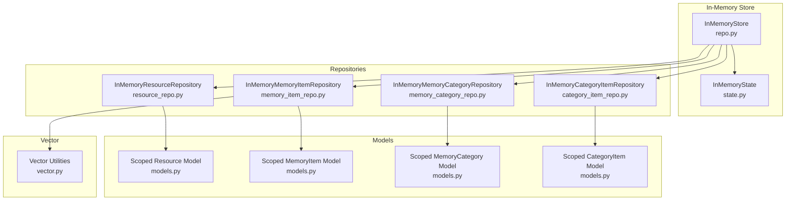
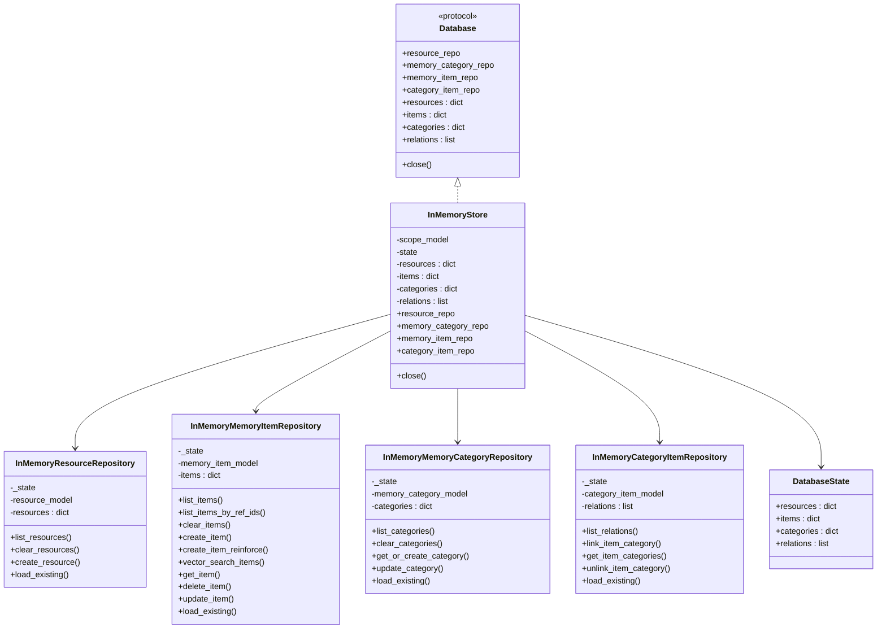
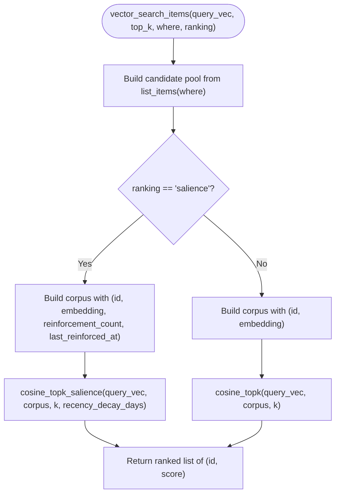
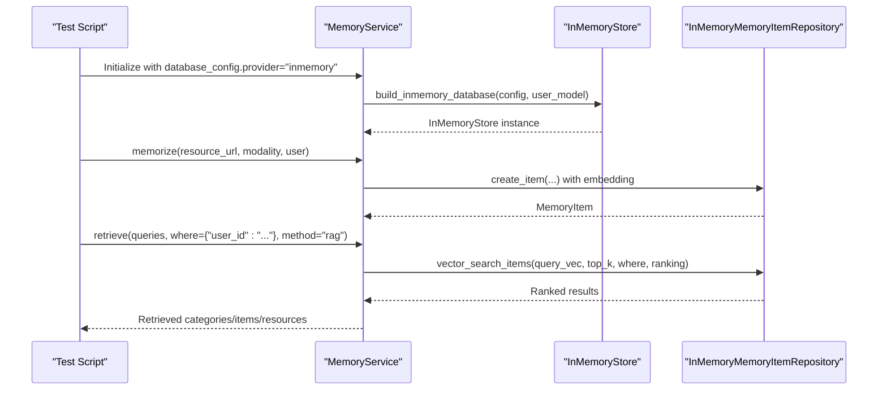
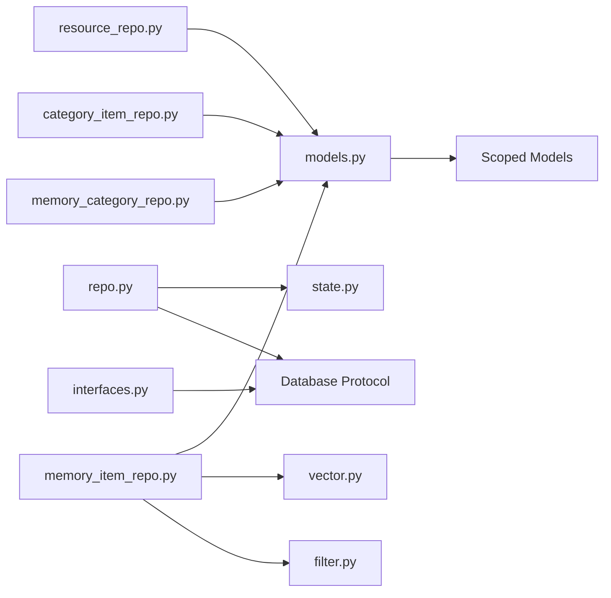

# In-Memory Storage

<cite>
**Referenced Files in This Document**
- [__init__.py](file://src/memu/database/inmemory/__init__.py)
- [models.py](file://src/memu/database/inmemory/models.py)
- [repo.py](file://src/memu/database/inmemory/repo.py)
- [vector.py](file://src/memu/database/inmemory/vector.py)
- [state.py](file://src/memu/database/inmemory/state.py)
- [repositories/__init__.py](file://src/memu/database/inmemory/repositories/__init__.py)
- [memory_item_repo.py](file://src/memu/database/inmemory/repositories/memory_item_repo.py)
- [memory_category_repo.py](file://src/memu/database/inmemory/repositories/memory_category_repo.py)
- [category_item_repo.py](file://src/memu/database/inmemory/repositories/category_item_repo.py)
- [resource_repo.py](file://src/memu/database/inmemory/repositories/resource_repo.py)
- [filter.py](file://src/memu/database/inmemory/repositories/filter.py)
- [models.py](file://src/memu/database/models.py)
- [interfaces.py](file://src/memu/database/interfaces.py)
- [state.py](file://src/memu/database/state.py)
- [settings.py](file://src/memu/app/settings.py)
- [test_inmemory.py](file://tests/test_inmemory.py)
</cite>

## Table of Contents
1. [Introduction](#introduction)
2. [Project Structure](#project-structure)
3. [Core Components](#core-components)
4. [Architecture Overview](#architecture-overview)
5. [Detailed Component Analysis](#detailed-component-analysis)
6. [Dependency Analysis](#dependency-analysis)
7. [Performance Considerations](#performance-considerations)
8. [Troubleshooting Guide](#troubleshooting-guide)
9. [Conclusion](#conclusion)
10. [Appendices](#appendices)

## Introduction
This document explains the in-memory storage implementation used by memU’s development and testing backend. It covers the in-memory data structures, the repository pattern, vector similarity search, memory layout, persistence limitations, performance characteristics, configuration and initialization, usage patterns, and operational guidance for development workflows. The in-memory store is designed to be lightweight, deterministic, and easy to reset during tests or interactive sessions.

## Project Structure
The in-memory storage is organized around a small set of modules that implement a repository pattern over Python dictionaries and lists. The key elements are:
- A factory that builds scoped Pydantic models for user-scoped records
- A concrete in-memory store that aggregates repositories
- Repositories for resources, memory items, memory categories, and category-item relations
- A vector module implementing cosine similarity and salience-aware ranking
- A shared state container holding all in-memory records

**Diagram sources**
- [repo.py](file://src/memu/database/inmemory/repo.py#L20-L61)
- [state.py](file://src/memu/database/inmemory/state.py#L1-L8)
- [resource_repo.py](file://src/memu/database/inmemory/repositories/resource_repo.py#L13-L63)
- [memory_item_repo.py](file://src/memu/database/inmemory/repositories/memory_item_repo.py#L16-L263)
- [memory_category_repo.py](file://src/memu/database/inmemory/repositories/memory_category_repo.py#L15-L86)
- [category_item_repo.py](file://src/memu/database/inmemory/repositories/category_item_repo.py#L13-L46)
- [models.py](file://src/memu/database/inmemory/models.py#L30-L54)
- [vector.py](file://src/memu/database/inmemory/vector.py#L56-L138)

**Section sources**
- [__init__.py](file://src/memu/database/inmemory/__init__.py#L10-L26)
- [models.py](file://src/memu/database/inmemory/models.py#L30-L54)
- [repo.py](file://src/memu/database/inmemory/repo.py#L20-L61)
- [state.py](file://src/memu/database/inmemory/state.py#L1-L8)
- [repositories/__init__.py](file://src/memu/database/inmemory/repositories/__init__.py#L1-L22)

## Core Components
- Scoped models: The in-memory models are dynamically merged with a user-provided Pydantic model to enforce scoping (e.g., user_id) while retaining the core record schema.
- InMemoryStore: Implements the backend-agnostic Database protocol, aggregating repositories and exposing in-memory collections.
- Repositories: Provide CRUD and query operations over dicts/lists, with optional filtering and vector search.
- Vector utilities: Provide cosine similarity and salience-aware ranking for retrieval.

**Section sources**
- [models.py](file://src/memu/database/inmemory/models.py#L30-L54)
- [interfaces.py](file://src/memu/database/interfaces.py#L12-L27)
- [repo.py](file://src/memu/database/inmemory/repo.py#L20-L61)
- [vector.py](file://src/memu/database/inmemory/vector.py#L56-L138)

## Architecture Overview
The in-memory store adheres to a repository pattern layered over a shared state container. The store exposes typed repositories and maintains four primary collections:
- resources: dict keyed by id
- items: dict keyed by id
- categories: dict keyed by id
- relations: list of relations

**Diagram sources**
- [interfaces.py](file://src/memu/database/interfaces.py#L12-L27)
- [repo.py](file://src/memu/database/inmemory/repo.py#L20-L61)
- [resource_repo.py](file://src/memu/database/inmemory/repositories/resource_repo.py#L13-L63)
- [memory_item_repo.py](file://src/memu/database/inmemory/repositories/memory_item_repo.py#L16-L263)
- [memory_category_repo.py](file://src/memu/database/inmemory/repositories/memory_category_repo.py#L15-L86)
- [category_item_repo.py](file://src/memu/database/inmemory/repositories/category_item_repo.py#L13-L46)
- [state.py](file://src/memu/database/inmemory/state.py#L8-L14)

## Detailed Component Analysis

### Memory Layout and Data Persistence Limitations
- Collections:
  - resources: dict[str, Resource]
  - items: dict[str, MemoryItem]
  - categories: dict[str, MemoryCategory]
  - relations: list[CategoryItem]
- Persistence: No disk persistence. Data is held in process memory and is lost when the process ends or the store is discarded.
- Scoping: Records carry user-defined fields (e.g., user_id) merged into their Pydantic models to isolate data per user or agent.

**Section sources**
- [state.py](file://src/memu/database/state.py#L8-L14)
- [state.py](file://src/memu/database/inmemory/state.py#L8-L14)
- [models.py](file://src/memu/database/models.py#L68-L106)
- [models.py](file://src/memu/database/inmemory/models.py#L30-L54)

### Repository Pattern Implementation
- Resource repository: Manages Resource records with list/clear/create operations and basic filtering.
- Memory item repository: Manages MemoryItem records with deduplication by content hash, reinforcement counters, and vector search.
- Memory category repository: Manages MemoryCategory records with upsert-like behavior and updates.
- Category-item repository: Manages many-to-many relations between items and categories.

Filtering is supported via a simple where matcher that handles equality and “in” checks.

**Section sources**
- [resource_repo.py](file://src/memu/database/inmemory/repositories/resource_repo.py#L13-L63)
- [memory_item_repo.py](file://src/memu/database/inmemory/repositories/memory_item_repo.py#L16-L263)
- [memory_category_repo.py](file://src/memu/database/inmemory/repositories/memory_category_repo.py#L15-L86)
- [category_item_repo.py](file://src/memu/database/inmemory/repositories/category_item_repo.py#L13-L46)
- [filter.py](file://src/memu/database/inmemory/repositories/filter.py#L7-L30)

### Vector Similarity Search and Ranking
- Cosine similarity: Implemented with vectorized NumPy operations for efficient batch scoring.
- Top-k selection: Uses argpartition for O(n) selection when k << n, falling back to sorting when k is near n.
- Salience-aware ranking: Combines similarity with logarithmic reinforcement count and exponential recency decay.
- Retrieval entry points:
  - vector_search_items in the memory item repository
  - Utility functions for standalone use

**Diagram sources**
- [memory_item_repo.py](file://src/memu/database/inmemory/repositories/memory_item_repo.py#L169-L196)
- [vector.py](file://src/memu/database/inmemory/vector.py#L56-L138)

**Section sources**
- [vector.py](file://src/memu/database/inmemory/vector.py#L11-L138)
- [memory_item_repo.py](file://src/memu/database/inmemory/repositories/memory_item_repo.py#L169-L196)

### Configuration, Initialization, and Usage Patterns
- Factory: build_inmemory_database constructs scoped models and returns an InMemoryStore instance.
- Initialization: InMemoryStore accepts optional user model, models, and state; otherwise defaults are applied.
- Typical usage in tests and examples:
  - Configure metadata_store.provider = "inmemory"
  - Instantiate MemoryService with database_config pointing to inmemory
  - Call memorize and retrieve with where filters to scope by user_id

**Diagram sources**
- [__init__.py](file://src/memu/database/inmemory/__init__.py#L10-L26)
- [repo.py](file://src/memu/database/inmemory/repo.py#L20-L61)
- [memory_item_repo.py](file://src/memu/database/inmemory/repositories/memory_item_repo.py#L79-L167)
- [test_inmemory.py](file://tests/test_inmemory.py#L17-L84)

**Section sources**
- [__init__.py](file://src/memu/database/inmemory/__init__.py#L10-L26)
- [repo.py](file://src/memu/database/inmemory/repo.py#L20-L61)
- [settings.py](file://src/memu/app/settings.py#L299-L322)
- [test_inmemory.py](file://tests/test_inmemory.py#L17-L84)

### Memory Management and Cleanup
- Close semantics: InMemoryStore.close() is a no-op, indicating no external connections to release.
- Clear operations: Repositories expose clear_* methods to remove matching records, useful for test isolation and resetting state.
- Deduplication and reinforcement: Memory items track content_hash and reinforcement counters to avoid duplication and bias retrieval toward frequently reinforced memories.

**Section sources**
- [repo.py](file://src/memu/database/inmemory/repo.py#L59-L61)
- [memory_item_repo.py](file://src/memu/database/inmemory/repositories/memory_item_repo.py#L53-L60)
- [memory_item_repo.py](file://src/memu/database/inmemory/repositories/memory_item_repo.py#L122-L167)

## Dependency Analysis
The in-memory store depends on:
- Pydantic models and filtering utilities
- NumPy for vectorized computations
- Pendulum for time parsing and normalization
- The shared Database protocol and state container

**Diagram sources**
- [models.py](file://src/memu/database/inmemory/models.py#L30-L54)
- [interfaces.py](file://src/memu/database/interfaces.py#L12-L27)
- [repo.py](file://src/memu/database/inmemory/repo.py#L20-L61)
- [state.py](file://src/memu/database/state.py#L8-L14)
- [memory_item_repo.py](file://src/memu/database/inmemory/repositories/memory_item_repo.py#L16-L263)
- [memory_category_repo.py](file://src/memu/database/inmemory/repositories/memory_category_repo.py#L15-L86)
- [category_item_repo.py](file://src/memu/database/inmemory/repositories/category_item_repo.py#L13-L46)
- [resource_repo.py](file://src/memu/database/inmemory/repositories/resource_repo.py#L13-L63)
- [filter.py](file://src/memu/database/inmemory/repositories/filter.py#L7-L30)
- [vector.py](file://src/memu/database/inmemory/vector.py#L56-L138)

**Section sources**
- [models.py](file://src/memu/database/inmemory/models.py#L30-L54)
- [interfaces.py](file://src/memu/database/interfaces.py#L12-L27)
- [repo.py](file://src/memu/database/inmemory/repo.py#L20-L61)
- [memory_item_repo.py](file://src/memu/database/inmemory/repositories/memory_item_repo.py#L16-L263)

## Performance Considerations
- Vector search:
  - Vectorized cosine similarity reduces overhead.
  - Argpartition selects top-k efficiently for large corpora.
  - Salience-aware ranking adds per-record loops but remains linear in corpus size.
- Filtering:
  - Linear scans over dicts/lists; suitable for small to medium datasets.
- Memory footprint:
  - Stores embeddings as plain lists; consider dtype and dimensionality impact.
- Concurrency:
  - Not thread-safe; guard access with locks if used concurrently.

[No sources needed since this section provides general guidance]

## Troubleshooting Guide
Common issues and resolutions:
- Missing embeddings:
  - Symptom: vector_search_items returns empty or unexpected results.
  - Cause: Some items lack embedding vectors.
  - Resolution: Ensure embeddings are computed and stored when creating items.
- Incorrect scoping:
  - Symptom: Retrieval returns unrelated records.
  - Cause: where filter does not include required user_id or other scope fields.
  - Resolution: Include appropriate where filters matching the user model fields.
- Reinforcement not taking effect:
  - Symptom: Same facts appear without increased relevance.
  - Cause: Using non-tool memory types with reinforce flag or missing content_hash.
  - Resolution: Use memory_type "tool" with reinforce, or ensure compute_content_hash is applied and stored in extra.
- Time parsing errors:
  - Symptom: Salience scores degrade unexpectedly.
  - Cause: Malformed last_reinforced_at timestamps.
  - Resolution: Ensure timestamps are valid ISO strings and parseable by the time library.

**Section sources**
- [memory_item_repo.py](file://src/memu/database/inmemory/repositories/memory_item_repo.py#L169-L196)
- [memory_item_repo.py](file://src/memu/database/inmemory/repositories/memory_item_repo.py#L204-L217)
- [vector.py](file://src/memu/database/inmemory/vector.py#L16-L54)

## Conclusion
The in-memory storage provides a fast, deterministic, and easy-to-use backend for development and testing. It implements a clean repository pattern, supports scoped models, and offers robust vector similarity search with salience-aware ranking. While it lacks persistence and concurrency safety, it is well-suited for iterative development, unit tests, and demos. For production, prefer durable backends such as PostgreSQL or SQLite.

[No sources needed since this section summarizes without analyzing specific files]

## Appendices

### Configuration Reference
- Metadata store:
  - provider: "inmemory"
  - ddl_mode: "create" or "validate"
  - dsn: not applicable for inmemory
- Vector index:
  - provider: "bruteforce" (default for inmemory)
  - dsn: not applicable for bruteforce

**Section sources**
- [settings.py](file://src/memu/app/settings.py#L299-L322)

### Example Usage Paths
- End-to-end test with in-memory storage:
  - [tests/test_inmemory.py](file://tests/test_inmemory.py#L17-L84)
- Factory and store construction:
  - [src/memu/database/inmemory/__init__.py](file://src/memu/database/inmemory/__init__.py#L10-L26)
  - [src/memu/database/inmemory/repo.py](file://src/memu/database/inmemory/repo.py#L20-L61)