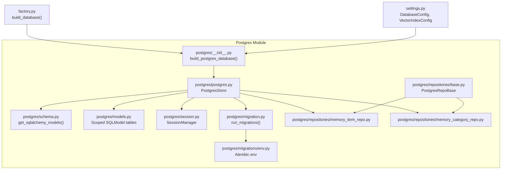
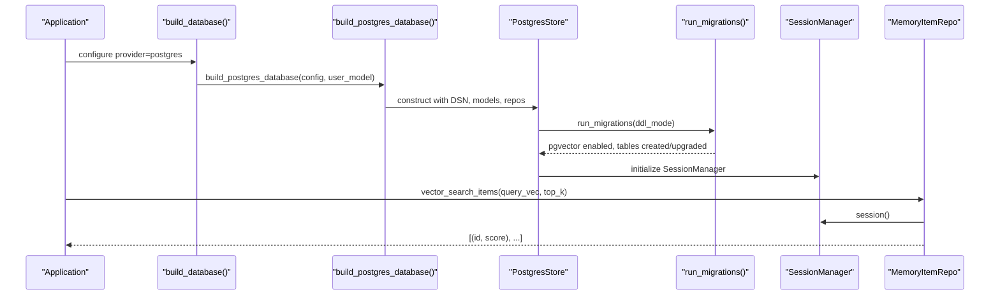
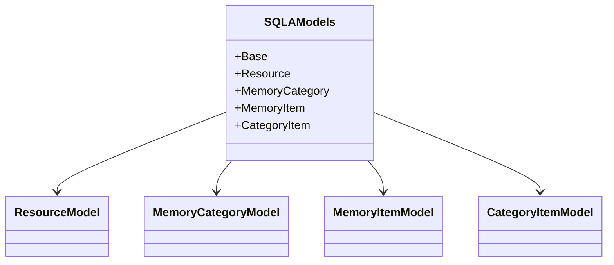
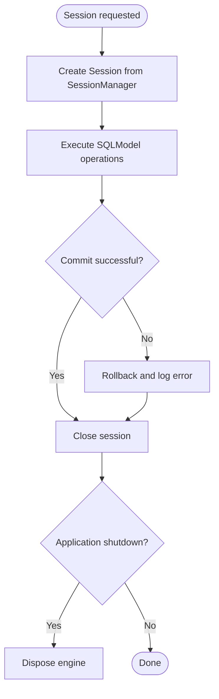
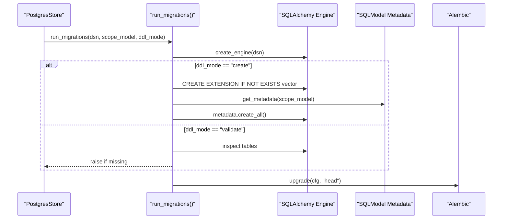
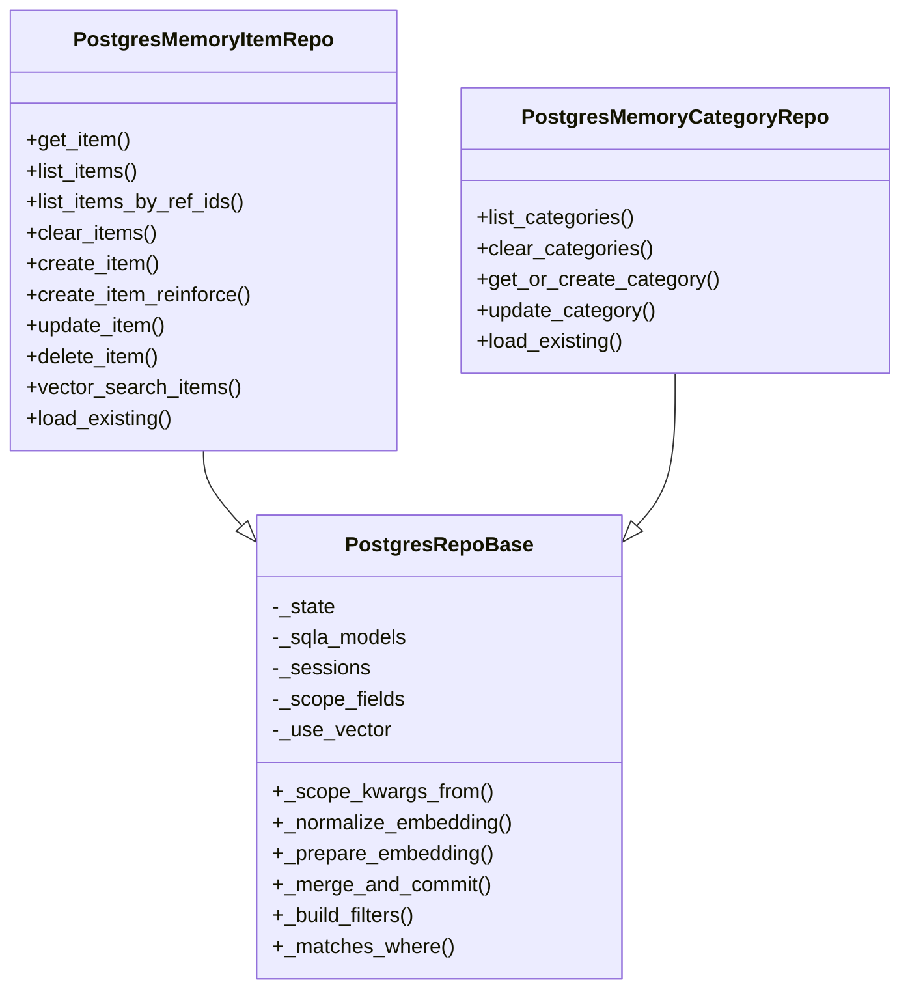
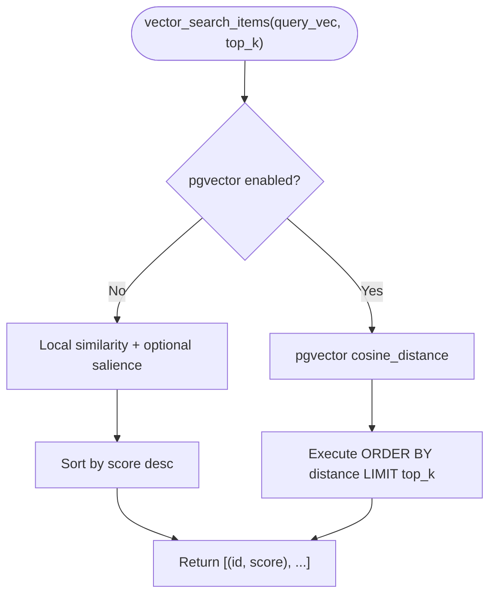
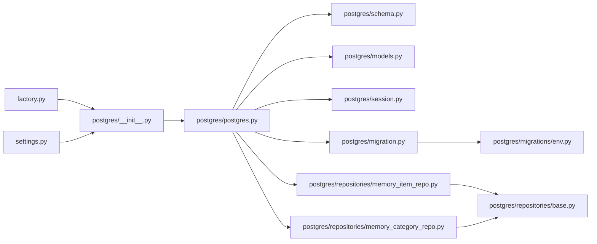

# PostgreSQL Storage

<cite>
**Referenced Files in This Document**
- [postgres/__init__.py](file://src/memu/database/postgres/__init__.py)
- [postgres/models.py](file://src/memu/database/postgres/models.py)
- [postgres/schema.py](file://src/memu/database/postgres/schema.py)
- [postgres/session.py](file://src/memu/database/postgres/session.py)
- [postgres/postgres.py](file://src/memu/database/postgres/postgres.py)
- [postgres/migration.py](file://src/memu/database/postgres/migration.py)
- [postgres/migrations/env.py](file://src/memu/database/postgres/migrations/env.py)
- [postgres/repositories/base.py](file://src/memu/database/postgres/repositories/base.py)
- [postgres/repositories/memory_item_repo.py](file://src/memu/database/postgres/repositories/memory_item_repo.py)
- [postgres/repositories/memory_category_repo.py](file://src/memu/database/postgres/repositories/memory_category_repo.py)
- [interfaces.py](file://src/memu/database/interfaces.py)
- [factory.py](file://src/memu/database/factory.py)
- [settings.py](file://src/memu/app/settings.py)
</cite>

## Table of Contents
1. [Introduction](#introduction)
2. [Project Structure](#project-structure)
3. [Core Components](#core-components)
4. [Architecture Overview](#architecture-overview)
5. [Detailed Component Analysis](#detailed-component-analysis)
6. [Dependency Analysis](#dependency-analysis)
7. [Performance Considerations](#performance-considerations)
8. [Troubleshooting Guide](#troubleshooting-guide)
9. [Conclusion](#conclusion)
10. [Appendices](#appendices)

## Introduction
This document explains the PostgreSQL storage implementation powering memU’s production-ready database solution with pgvector support. It covers PostgreSQL configuration, pgvector extension setup, vector similarity search, repository pattern implementation, connection/session management, and the Alembic-based migration system. It also provides practical guidance for environment configuration, deployment, vector index management, performance tuning, scaling, connection pooling, transactions, backups, security, monitoring, and operational best practices.

## Project Structure
The PostgreSQL storage module is organized around a repository pattern layered over SQLModel and SQLAlchemy. It dynamically builds scoped SQLModel tables, manages sessions via a dedicated manager, runs migrations with Alembic, and exposes typed repositories for resources, categories, items, and category-item relations.

**Diagram sources**
- [postgres/__init__.py](file://src/memu/database/postgres/__init__.py#L10-L37)
- [postgres/postgres.py](file://src/memu/database/postgres/postgres.py#L23-L109)
- [postgres/schema.py](file://src/memu/database/postgres/schema.py#L51-L107)
- [postgres/models.py](file://src/memu/database/postgres/models.py#L157-L181)
- [postgres/session.py](file://src/memu/database/postgres/session.py#L15-L35)
- [postgres/migration.py](file://src/memu/database/postgres/migration.py#L31-L83)
- [postgres/migrations/env.py](file://src/memu/database/postgres/migrations/env.py#L16-L56)
- [postgres/repositories/base.py](file://src/memu/database/postgres/repositories/base.py#L15-L114)
- [postgres/repositories/memory_item_repo.py](file://src/memu/database/postgres/repositories/memory_item_repo.py#L14-L402)
- [postgres/repositories/memory_category_repo.py](file://src/memu/database/postgres/repositories/memory_category_repo.py#L13-L163)
- [factory.py](file://src/memu/database/factory.py#L15-L44)
- [settings.py](file://src/memu/app/settings.py#L309-L322)

**Section sources**
- [postgres/__init__.py](file://src/memu/database/postgres/__init__.py#L1-L37)
- [postgres/postgres.py](file://src/memu/database/postgres/postgres.py#L1-L109)
- [postgres/schema.py](file://src/memu/database/postgres/schema.py#L1-L111)
- [postgres/models.py](file://src/memu/database/postgres/models.py#L1-L181)
- [postgres/session.py](file://src/memu/database/postgres/session.py#L1-L35)
- [postgres/migration.py](file://src/memu/database/postgres/migration.py#L1-L83)
- [postgres/migrations/env.py](file://src/memu/database/postgres/migrations/env.py#L1-L56)
- [postgres/repositories/base.py](file://src/memu/database/postgres/repositories/base.py#L1-L114)
- [postgres/repositories/memory_item_repo.py](file://src/memu/database/postgres/repositories/memory_item_repo.py#L1-L402)
- [postgres/repositories/memory_category_repo.py](file://src/memu/database/postgres/repositories/memory_category_repo.py#L1-L163)
- [factory.py](file://src/memu/database/factory.py#L1-L44)
- [settings.py](file://src/memu/app/settings.py#L309-L322)

## Core Components
- Factory and builder: The factory selects the backend provider and delegates to the PostgreSQL builder, which constructs a PostgresStore with scoped SQLModel tables and repositories.
- Schema and models: Dynamic scoped SQLModel classes are generated for resources, categories, items, and category-item relations, with optional pgvector vectors.
- Session management: A SessionManager encapsulates engine creation and session lifecycle with pre-ping enabled.
- Migration system: run_migrations ensures pgvector extension availability and applies SQLModel metadata and Alembic migrations.
- Repositories: Typed repositories implement CRUD and vector search with local fallback when pgvector is unavailable.

**Section sources**
- [factory.py](file://src/memu/database/factory.py#L15-L44)
- [postgres/__init__.py](file://src/memu/database/postgres/__init__.py#L10-L37)
- [postgres/postgres.py](file://src/memu/database/postgres/postgres.py#L23-L109)
- [postgres/schema.py](file://src/memu/database/postgres/schema.py#L51-L107)
- [postgres/models.py](file://src/memu/database/postgres/models.py#L157-L181)
- [postgres/session.py](file://src/memu/database/postgres/session.py#L15-L35)
- [postgres/migration.py](file://src/memu/database/postgres/migration.py#L31-L83)
- [postgres/repositories/base.py](file://src/memu/database/postgres/repositories/base.py#L15-L114)

## Architecture Overview
The PostgreSQL storage architecture integrates configuration-driven building, dynamic schema generation, robust session management, and a repository pattern for domain operations. Vector similarity search is supported via pgvector when enabled, otherwise falls back to local cosine similarity over cached embeddings.

**Diagram sources**
- [factory.py](file://src/memu/database/factory.py#L15-L44)
- [postgres/__init__.py](file://src/memu/database/postgres/__init__.py#L10-L37)
- [postgres/postgres.py](file://src/memu/database/postgres/postgres.py#L33-L109)
- [postgres/migration.py](file://src/memu/database/postgres/migration.py#L31-L83)
- [postgres/session.py](file://src/memu/database/postgres/session.py#L15-L35)
- [postgres/repositories/memory_item_repo.py](file://src/memu/database/postgres/repositories/memory_item_repo.py#L280-L309)

## Detailed Component Analysis

### PostgreSQL Configuration and Environment Setup
- Provider selection and defaults:
  - DatabaseConfig sets metadata_store.provider and vector_index.provider.
  - If vector_index is unspecified and metadata_store.provider is postgres, vector_index defaults to pgvector with the same DSN.
- Environment variables and DSN:
  - The DSN is required for postgres providers and passed through to the builder and migration system.
- Example configuration patterns:
  - Set metadata_store.provider to postgres and provide metadata_store.dsn.
  - Optionally set vector_index.provider to pgvector and ensure vector_index.dsn matches the metadata DSN.

**Section sources**
- [settings.py](file://src/memu/app/settings.py#L309-L322)
- [postgres/__init__.py](file://src/memu/database/postgres/__init__.py#L10-L37)

### pgvector Extension Setup
- Automatic extension enablement:
  - run_migrations attempts to create the vector extension and logs whether it was newly created or already present.
  - If creation fails, it raises a clear error instructing superuser to install the extension first.
- Prerequisites:
  - The database user must have permission to create extensions (typically superuser or a role with CREATEROLE/CREATEDB privileges).
  - The server must have the pgvector package installed.

**Section sources**
- [postgres/migration.py](file://src/memu/database/postgres/migration.py#L43-L61)

### Schema Generation and Scoped Models
- Dynamic scoped tables:
  - get_sqlalchemy_models builds scoped SQLModel classes for resources, categories, items, and category-items using a user-defined scope model.
  - Unique and composite indexes are applied, including scope-aware uniqueness constraints.
- Vector columns:
  - Embedding fields are declared as VECTOR when pgvector is enabled; otherwise, they are stored as lists.
- Model normalization and caching:
  - Models are cached by scope to avoid redundant construction.

**Diagram sources**
- [postgres/schema.py](file://src/memu/database/postgres/schema.py#L35-L101)
- [postgres/models.py](file://src/memu/database/postgres/models.py#L46-L74)

**Section sources**
- [postgres/schema.py](file://src/memu/database/postgres/schema.py#L51-L107)
- [postgres/models.py](file://src/memu/database/postgres/models.py#L157-L181)

### Connection Management and Session Lifecycle
- Engine and pooling:
  - SessionManager creates an SQLAlchemy engine with pool_pre_ping enabled to detect dead connections.
  - Sessions are opened per operation and committed automatically within repository methods.
- Graceful shutdown:
  - PostgresStore.close disposes the engine to release connections.

**Diagram sources**
- [postgres/session.py](file://src/memu/database/postgres/session.py#L15-L35)
- [postgres/postgres.py](file://src/memu/database/postgres/postgres.py#L101-L103)

**Section sources**
- [postgres/session.py](file://src/memu/database/postgres/session.py#L15-L35)
- [postgres/postgres.py](file://src/memu/database/postgres/postgres.py#L101-L103)

### Migration System Using Alembic
- Migration orchestration:
  - run_migrations validates or creates tables via SQLModel metadata and then upgrades with Alembic to head.
  - DDLMode supports “create” (ensure tables exist) and “validate” (check schema presence).
- Alembic environment:
  - env.py loads target metadata derived from the scoped models and runs migrations offline/online.

**Diagram sources**
- [postgres/migration.py](file://src/memu/database/postgres/migration.py#L31-L83)
- [postgres/migrations/env.py](file://src/memu/database/postgres/migrations/env.py#L24-L56)

**Section sources**
- [postgres/migration.py](file://src/memu/database/postgres/migration.py#L31-L83)
- [postgres/migrations/env.py](file://src/memu/database/postgres/migrations/env.py#L1-L56)

### Repository Pattern Implementation
- Base repository:
  - PostgresRepoBase centralizes session handling, filter building, embedding normalization/serialization, and UTC timestamp management.
- Memory item repository:
  - Implements CRUD, vector similarity search using pgvector cosine_distance, and a salience-aware ranking fallback.
  - Supports reinforcement counting and recency decay for relevance.
- Memory category repository:
  - Provides category CRUD and upsert-like behavior keyed by scope-aware fields.

**Diagram sources**
- [postgres/repositories/base.py](file://src/memu/database/postgres/repositories/base.py#L15-L114)
- [postgres/repositories/memory_item_repo.py](file://src/memu/database/postgres/repositories/memory_item_repo.py#L14-L402)
- [postgres/repositories/memory_category_repo.py](file://src/memu/database/postgres/repositories/memory_category_repo.py#L13-L163)

**Section sources**
- [postgres/repositories/base.py](file://src/memu/database/postgres/repositories/base.py#L15-L114)
- [postgres/repositories/memory_item_repo.py](file://src/memu/database/postgres/repositories/memory_item_repo.py#L14-L402)
- [postgres/repositories/memory_category_repo.py](file://src/memu/database/postgres/repositories/memory_category_repo.py#L13-L163)

### Vector Similarity Search and Ranking
- pgvector-enabled search:
  - vector_search_items computes cosine distance and orders by ascending distance, returning top-k item ids with scores normalized to [0, 1].
- Local fallback:
  - When pgvector is disabled or ranking is “salience”, the repository computes cosine similarity locally and optionally applies salience weighting based on reinforcement count and recency decay.
- Salience scoring:
  - Combines similarity, logarithmic reinforcement factor, and exponential recency decay with a half-life configurable via retrieval settings.

**Diagram sources**
- [postgres/repositories/memory_item_repo.py](file://src/memu/database/postgres/repositories/memory_item_repo.py#L280-L354)

**Section sources**
- [postgres/repositories/memory_item_repo.py](file://src/memu/database/postgres/repositories/memory_item_repo.py#L280-L374)

### Production Deployment Considerations
- Connection string and credentials:
  - Use a dedicated service account with minimal required privileges.
  - Prefer SSL connections and strong passwords; avoid storing secrets in plaintext.
- Pool sizing and timeouts:
  - Configure engine pool_recycle and pool_pre_ping; tune pool_size and max_overflow according to workload.
- Migration safety:
  - Use DDLMode “validate” in CI to prevent accidental schema changes.
  - Back up before running migrations in production.
- pgvector installation:
  - Ensure the extension is installed at the database level and accessible to the application user.
- Monitoring and observability:
  - Track query latency, pool utilization, and migration execution times.

[No sources needed since this section provides general guidance]

## Dependency Analysis
The PostgreSQL storage module exhibits low coupling between components, with clear separation of concerns:
- Factory and builder decouple provider selection from instantiation.
- PostgresStore composes repositories and shares a single SessionManager and scoped models.
- Repositories depend on shared base utilities and SQLModel abstractions.

**Diagram sources**
- [factory.py](file://src/memu/database/factory.py#L15-L44)
- [postgres/__init__.py](file://src/memu/database/postgres/__init__.py#L10-L37)
- [postgres/postgres.py](file://src/memu/database/postgres/postgres.py#L23-L109)
- [postgres/schema.py](file://src/memu/database/postgres/schema.py#L51-L107)
- [postgres/models.py](file://src/memu/database/postgres/models.py#L157-L181)
- [postgres/session.py](file://src/memu/database/postgres/session.py#L15-L35)
- [postgres/migration.py](file://src/memu/database/postgres/migration.py#L31-L83)
- [postgres/migrations/env.py](file://src/memu/database/postgres/migrations/env.py#L16-L56)
- [postgres/repositories/base.py](file://src/memu/database/postgres/repositories/base.py#L15-L114)
- [postgres/repositories/memory_item_repo.py](file://src/memu/database/postgres/repositories/memory_item_repo.py#L14-L402)
- [postgres/repositories/memory_category_repo.py](file://src/memu/database/postgres/repositories/memory_category_repo.py#L13-L163)
- [settings.py](file://src/memu/app/settings.py#L309-L322)

**Section sources**
- [factory.py](file://src/memu/database/factory.py#L1-L44)
- [postgres/postgres.py](file://src/memu/database/postgres/postgres.py#L1-L109)
- [postgres/migration.py](file://src/memu/database/postgres/migration.py#L1-L83)

## Performance Considerations
- Vector index management:
  - Ensure pgvector extension is installed and available.
  - Use appropriate vector dimensions aligned with embedding model outputs.
- Query performance:
  - Prefer pgvector-backed similarity search over local fallback for large datasets.
  - Use targeted filters and limit top_k appropriately.
- Caching and deduplication:
  - The repositories cache items/categories in-memory to reduce round-trips; leverage this for repeated reads.
  - Deduplicate items using content hashing and reinforcement counters to avoid redundant writes.
- Scaling strategies:
  - Horizontal scaling: run multiple application instances behind a load balancer; ensure shared PostgreSQL backend.
  - Read replicas: offload read-heavy vector searches to replicas if supported by your infrastructure.
- Connection pooling:
  - Tune pool_size and pool_recycle; monitor wait times and timeouts.
- Transaction management:
  - Keep transactions short; commit immediately after write operations to minimize contention.

[No sources needed since this section provides general guidance]

## Troubleshooting Guide
- pgvector extension errors:
  - Symptom: Failure to create vector extension during migrations.
  - Resolution: Install the extension as a superuser or grant appropriate privileges; verify installation via a direct SQL check.
- Missing tables after migration:
  - Symptom: Validation failure indicating missing tables.
  - Resolution: Run migrations again with DDLMode “create”; confirm SQLModel metadata matches expected schema.
- Connection failures:
  - Symptom: Operational errors when opening sessions.
  - Resolution: Verify DSN correctness, network connectivity, and credentials; enable pool_pre_ping and monitor pool exhaustion.
- Unexpected vector search results:
  - Symptom: Empty or poor-quality results.
  - Resolution: Confirm embeddings are populated and normalized; verify pgvector availability; adjust top_k and filters.
- Reinforcement and salience anomalies:
  - Symptom: Scores not reflecting expected recency or reinforcement.
  - Resolution: Check stored timestamps and reinforcement counts; validate salience decay parameters.

**Section sources**
- [postgres/migration.py](file://src/memu/database/postgres/migration.py#L43-L75)
- [postgres/session.py](file://src/memu/database/postgres/session.py#L15-L35)
- [postgres/repositories/memory_item_repo.py](file://src/memu/database/postgres/repositories/memory_item_repo.py#L280-L374)

## Conclusion
The PostgreSQL storage implementation in memU provides a robust, production-ready foundation for persistent memory with optional pgvector-powered vector similarity search. Its modular design, dynamic schema generation, Alembic-based migrations, and repository pattern enable maintainability, scalability, and operability. By following the configuration, deployment, and operational guidance herein, teams can confidently run PostgreSQL-backed memory systems in production.

[No sources needed since this section summarizes without analyzing specific files]

## Appendices

### A. Environment Configuration Examples
- Minimal PostgreSQL configuration:
  - metadata_store.provider: postgres
  - metadata_store.dsn: a valid PostgreSQL connection string
  - vector_index.provider: pgvector (optional; defaults to pgvector when metadata_store.provider is postgres)
- Alembic CLI usage:
  - Upgrade to head: alembic -c <path_to_env> upgrade head
  - Stamp current revision: alembic -c <path_to_env> stamp head

[No sources needed since this section provides general guidance]

### B. Backup and Restore Procedures
- Logical backup:
  - Use logical dump tools to export schema and data; schedule regular incremental backups.
- Point-in-time recovery:
  - Combine base backups with archived WAL segments to restore to a specific moment.
- Testing restores:
  - Validate backups by restoring to a staging environment before production rollouts.

[No sources needed since this section provides general guidance]

### C. Security Considerations
- Least privilege:
  - Grant only necessary permissions to the application database user.
- Secrets management:
  - Store DSNs and API keys in secure secret stores; avoid hardcoding.
- Network security:
  - Enforce TLS for database connections; restrict network access to trusted subnets.

[No sources needed since this section provides general guidance]

### D. Monitoring and Observability
- Metrics:
  - Track database connection pool metrics, query latency, and migration durations.
- Logs:
  - Capture migration logs and repository operation traces for diagnostics.
- Health checks:
  - Implement readiness/liveness probes against database connectivity.

[No sources needed since this section provides general guidance]