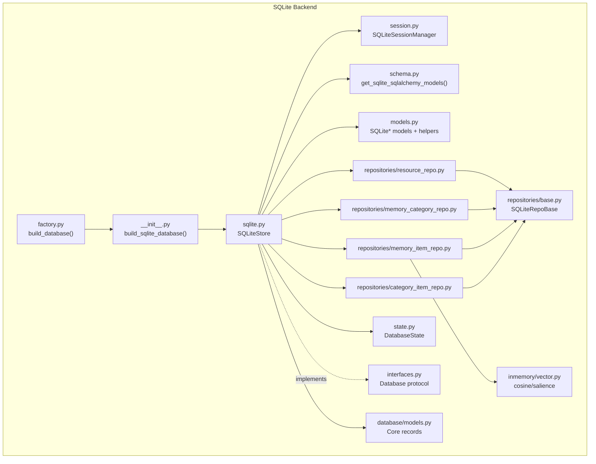
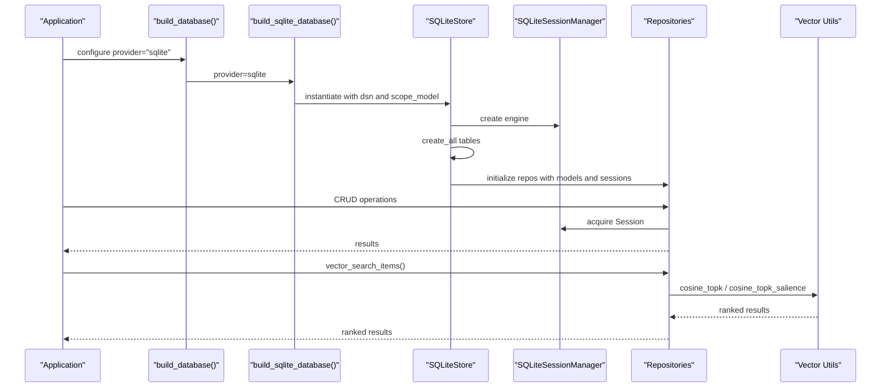
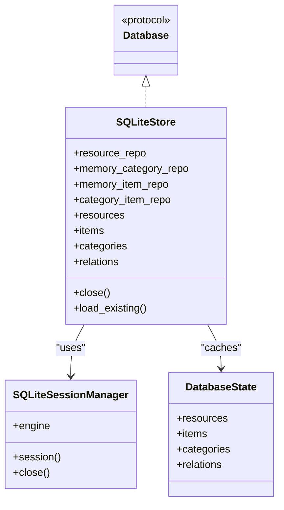
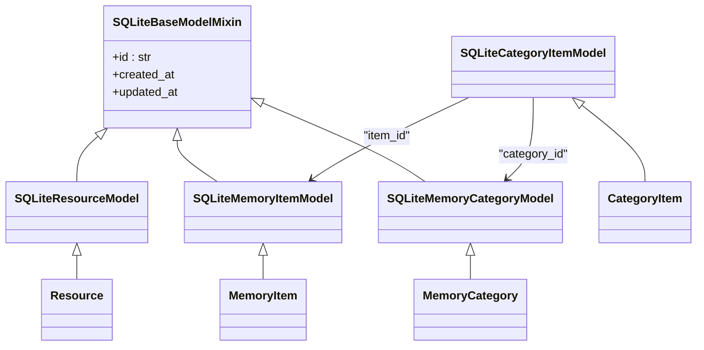
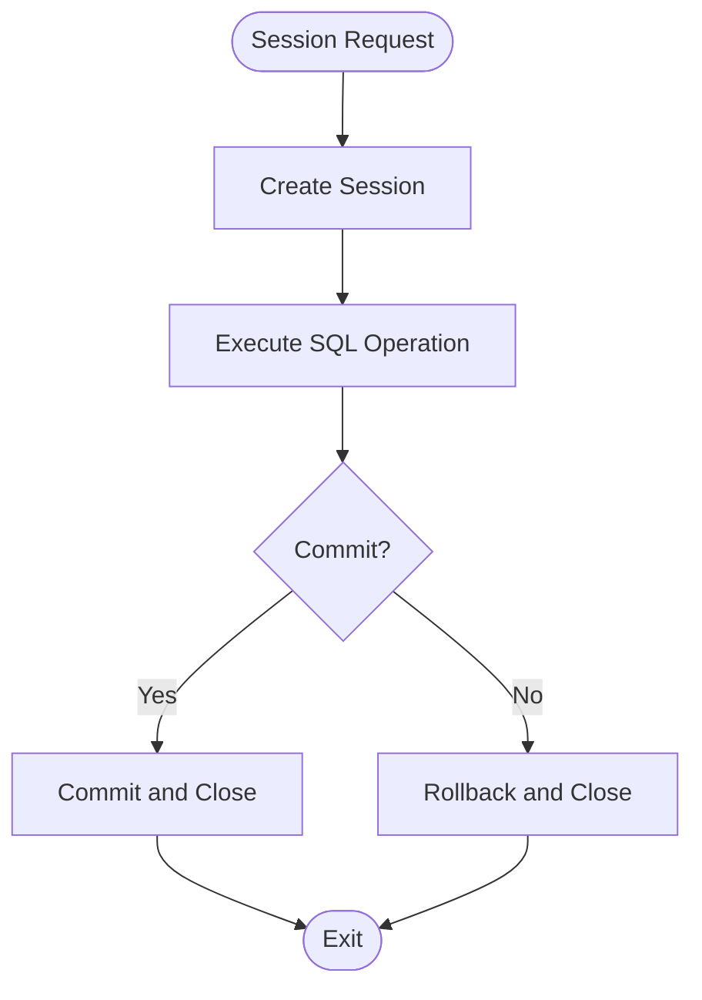
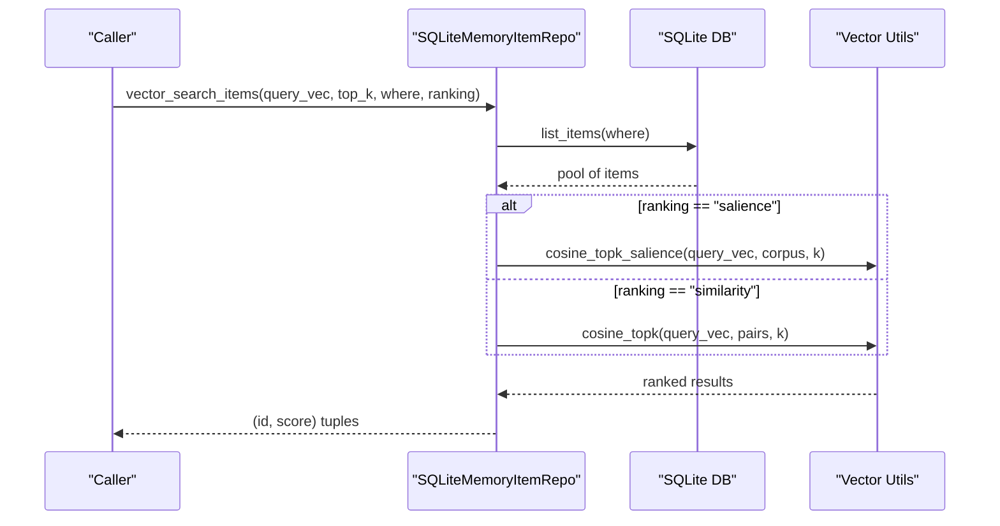
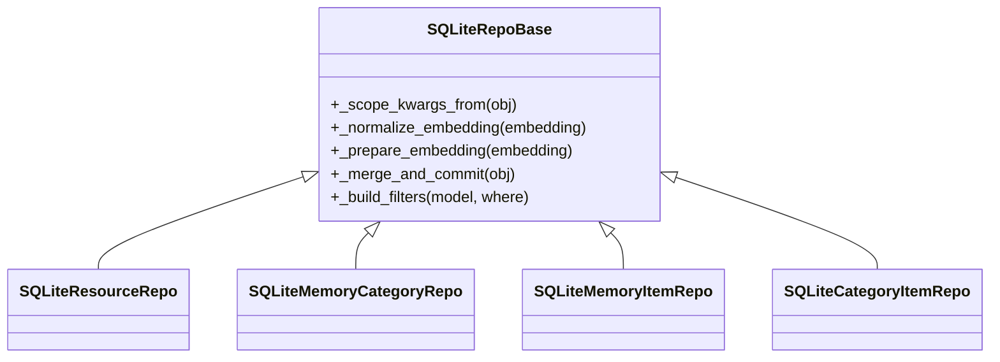
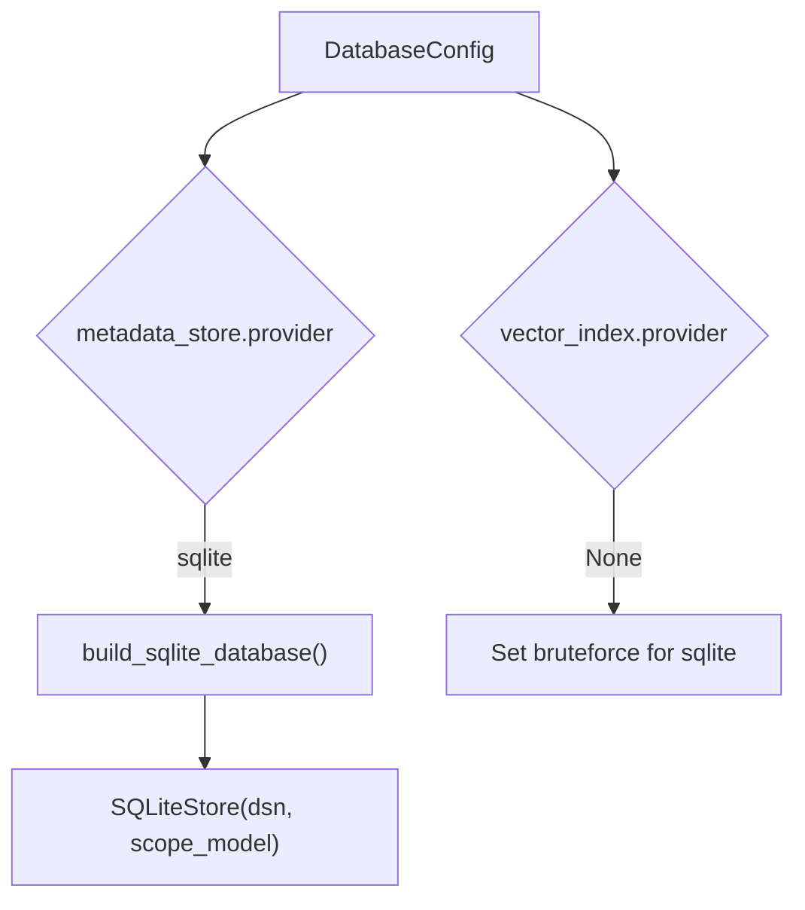
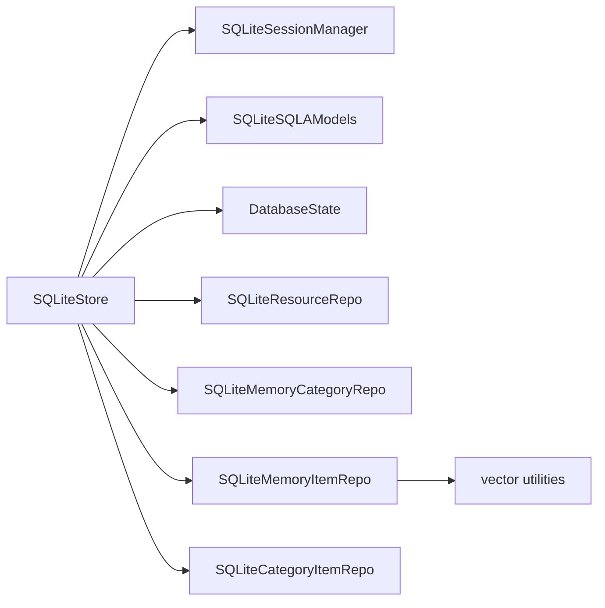

# SQLite Storage

<cite>
**Referenced Files in This Document**
- [sqlite.py](file://src/memu/database/sqlite/sqlite.py)
- [__init__.py](file://src/memu/database/sqlite/__init__.py)
- [models.py](file://src/memu/database/sqlite/models.py)
- [schema.py](file://src/memu/database/sqlite/schema.py)
- [session.py](file://src/memu/database/sqlite/session.py)
- [base.py](file://src/memu/database/sqlite/repositories/base.py)
- [resource_repo.py](file://src/memu/database/sqlite/repositories/resource_repo.py)
- [memory_category_repo.py](file://src/memu/database/sqlite/repositories/memory_category_repo.py)
- [memory_item_repo.py](file://src/memu/database/sqlite/repositories/memory_item_repo.py)
- [category_item_repo.py](file://src/memu/database/sqlite/repositories/category_item_repo.py)
- [interfaces.py](file://src/memu/database/interfaces.py)
- [state.py](file://src/memu/database/state.py)
- [models.py](file://src/memu/database/models.py)
- [vector.py](file://src/memu/database/inmemory/vector.py)
- [factory.py](file://src/memu/database/factory.py)
- [settings.py](file://src/memu/app/settings.py)
- [test_sqlite.py](file://tests/test_sqlite.py)
</cite>

## Table of Contents
1. [Introduction](#introduction)
2. [Project Structure](#project-structure)
3. [Core Components](#core-components)
4. [Architecture Overview](#architecture-overview)
5. [Detailed Component Analysis](#detailed-component-analysis)
6. [Dependency Analysis](#dependency-analysis)
7. [Performance Considerations](#performance-considerations)
8. [Troubleshooting Guide](#troubleshooting-guide)
9. [Conclusion](#conclusion)
10. [Appendices](#appendices)

## Introduction
This document explains the SQLite storage implementation in memU, focusing on its lightweight, portable, file-based design. It covers configuration, schema generation, repository implementations, session management, transactions, vector similarity search via brute-force cosine similarity, indexing strategies, and operational guidance for file-based storage, backups, and maintenance. It also provides troubleshooting tips and best practices for deployment and scaling.

## Project Structure
The SQLite backend is organized under a dedicated package with clear separation of concerns:
- Factory and builder: initialization and provider selection
- Schema and models: SQLModel definitions and dynamic model assembly
- Session management: engine and session lifecycle
- Repositories: CRUD and vector search operations
- Interfaces and state: shared contracts and in-memory caches

**Diagram sources**
- [factory.py](file://src/memu/database/factory.py#L15-L44)
- [__init__.py](file://src/memu/database/sqlite/__init__.py#L11-L36)
- [sqlite.py](file://src/memu/database/sqlite/sqlite.py#L25-L146)
- [session.py](file://src/memu/database/sqlite/session.py#L14-L49)
- [schema.py](file://src/memu/database/sqlite/schema.py#L35-L107)
- [models.py](file://src/memu/database/sqlite/models.py#L28-L238)
- [base.py](file://src/memu/database/sqlite/repositories/base.py#L18-L129)
- [resource_repo.py](file://src/memu/database/sqlite/repositories/resource_repo.py#L21-L196)
- [memory_category_repo.py](file://src/memu/database/sqlite/repositories/memory_category_repo.py#L21-L261)
- [memory_item_repo.py](file://src/memu/database/sqlite/repositories/memory_item_repo.py#L23-L541)
- [category_item_repo.py](file://src/memu/database/sqlite/repositories/category_item_repo.py#L21-L181)
- [interfaces.py](file://src/memu/database/interfaces.py#L12-L36)
- [state.py](file://src/memu/database/state.py#L8-L17)
- [models.py](file://src/memu/database/models.py#L68-L149)
- [vector.py](file://src/memu/database/inmemory/vector.py#L56-L138)

**Section sources**
- [factory.py](file://src/memu/database/factory.py#L15-L44)
- [__init__.py](file://src/memu/database/sqlite/__init__.py#L11-L36)
- [sqlite.py](file://src/memu/database/sqlite/sqlite.py#L25-L146)

## Core Components
- SQLiteStore: orchestrates schema creation, repository instantiation, and cache wiring. It implements the backend-agnostic Database protocol.
- SQLiteSessionManager: manages SQLAlchemy engine and session creation with thread-safe settings for SQLite.
- SQLiteSQLAModels and schema builders: dynamically assemble scoped SQLModel classes and metadata for SQLite tables.
- SQLite* models: typed SQLAlchemy models for resources, memory items, categories, and category-item relations, with JSON-backed vector fields.
- Repositories: CRUD and vector search implementations for each entity, with caching and filter support.
- DatabaseState: shared in-memory caches for resources, items, categories, and relations.
- Vector utilities: brute-force cosine similarity and salience-aware ranking.

**Section sources**
- [sqlite.py](file://src/memu/database/sqlite/sqlite.py#L25-L146)
- [session.py](file://src/memu/database/sqlite/session.py#L14-L49)
- [schema.py](file://src/memu/database/sqlite/schema.py#L35-L107)
- [models.py](file://src/memu/database/sqlite/models.py#L28-L238)
- [interfaces.py](file://src/memu/database/interfaces.py#L12-L36)
- [state.py](file://src/memu/database/state.py#L8-L17)
- [vector.py](file://src/memu/database/inmemory/vector.py#L56-L138)

## Architecture Overview
The SQLite backend follows a layered architecture:
- Application layer builds the Database via factory and provider selection.
- Store layer initializes the engine, creates tables, and wires repositories.
- Repository layer encapsulates SQLModel operations, caching, and vector search.
- Vector utilities provide brute-force similarity ranking.

**Diagram sources**
- [factory.py](file://src/memu/database/factory.py#L15-L44)
- [__init__.py](file://src/memu/database/sqlite/__init__.py#L11-L36)
- [sqlite.py](file://src/memu/database/sqlite/sqlite.py#L52-L146)
- [session.py](file://src/memu/database/sqlite/session.py#L14-L49)
- [memory_item_repo.py](file://src/memu/database/sqlite/repositories/memory_item_repo.py#L477-L520)
- [vector.py](file://src/memu/database/inmemory/vector.py#L56-L138)

## Detailed Component Analysis

### SQLiteStore and Initialization
- Accepts a DSN and optional scope model; defaults to an in-file database if none provided.
- Creates tables using both SQLModel metadata and custom metadata.
- Initializes repositories for resources, categories, items, and relations.
- Wires shared caches from DatabaseState.

**Diagram sources**
- [interfaces.py](file://src/memu/database/interfaces.py#L12-L36)
- [sqlite.py](file://src/memu/database/sqlite/sqlite.py#L25-L146)
- [session.py](file://src/memu/database/sqlite/session.py#L14-L49)
- [state.py](file://src/memu/database/state.py#L8-L17)

**Section sources**
- [sqlite.py](file://src/memu/database/sqlite/sqlite.py#L52-L146)
- [__init__.py](file://src/memu/database/sqlite/__init__.py#L11-L36)

### Schema Design and Scoped Models
- SQLite models extend a base mixin and core record models, adding UUID primary keys, timestamps, and JSON-backed vector fields.
- Dynamic scoped models are built with indexes for scope and uniqueness, ensuring isolation across user contexts.
- Unique constraints combine scope fields with business keys (e.g., category name) to prevent collisions.

**Diagram sources**
- [models.py](file://src/memu/database/sqlite/models.py#L28-L238)
- [models.py](file://src/memu/database/models.py#L68-L149)

**Section sources**
- [models.py](file://src/memu/database/sqlite/models.py#L28-L238)
- [schema.py](file://src/memu/database/sqlite/schema.py#L35-L107)

### Session Management and Transactions
- Engine is created with multi-threading enabled for SQLite.
- Sessions are short-lived and commit around each operation.
- Explicit transactions are not used; each operation runs inside a session with commit.

**Diagram sources**
- [session.py](file://src/memu/database/sqlite/session.py#L14-L49)
- [base.py](file://src/memu/database/sqlite/repositories/base.py#L70-L75)

**Section sources**
- [session.py](file://src/memu/database/sqlite/session.py#L14-L49)
- [base.py](file://src/memu/database/sqlite/repositories/base.py#L70-L75)

### Vector Similarity Search Implementation
- SQLite lacks native vector types; embeddings are stored as JSON strings.
- Vector search uses brute-force cosine similarity computed in-memory using vector utilities.
- Ranking supports two modes:
  - similarity: pure cosine similarity
  - salience: similarity × log(reinforcement_count) × recency decay

**Diagram sources**
- [memory_item_repo.py](file://src/memu/database/sqlite/repositories/memory_item_repo.py#L477-L520)
- [vector.py](file://src/memu/database/inmemory/vector.py#L56-L138)

**Section sources**
- [memory_item_repo.py](file://src/memu/database/sqlite/repositories/memory_item_repo.py#L477-L520)
- [vector.py](file://src/memu/database/inmemory/vector.py#L56-L138)

### Repository Implementations
- Base repository provides:
  - Scope-aware filter building
  - Embedding normalization and serialization
  - Session management and commit patterns
- Resource repository: CRUD for resources with optional caching.
- Memory category repository: CRUD plus get-or-create by name with scope.
- Memory item repository: CRUD, deduplication by content hash, and vector search.
- Category-item repository: link/unlink items to categories with de-duplication.

**Diagram sources**
- [base.py](file://src/memu/database/sqlite/repositories/base.py#L18-L129)
- [resource_repo.py](file://src/memu/database/sqlite/repositories/resource_repo.py#L21-L196)
- [memory_category_repo.py](file://src/memu/database/sqlite/repositories/memory_category_repo.py#L21-L261)
- [memory_item_repo.py](file://src/memu/database/sqlite/repositories/memory_item_repo.py#L23-L541)
- [category_item_repo.py](file://src/memu/database/sqlite/repositories/category_item_repo.py#L21-L181)

**Section sources**
- [base.py](file://src/memu/database/sqlite/repositories/base.py#L18-L129)
- [resource_repo.py](file://src/memu/database/sqlite/repositories/resource_repo.py#L21-L196)
- [memory_category_repo.py](file://src/memu/database/sqlite/repositories/memory_category_repo.py#L21-L261)
- [memory_item_repo.py](file://src/memu/database/sqlite/repositories/memory_item_repo.py#L23-L541)
- [category_item_repo.py](file://src/memu/database/sqlite/repositories/category_item_repo.py#L21-L181)

### Configuration and Setup
- Provider selection: "sqlite" routes to SQLiteStore via the factory.
- DSN defaults to an in-file database if not provided.
- Vector index provider defaults to "bruteforce" for SQLite.
- Example usage demonstrates setting DSN and vector index provider in tests.

**Diagram sources**
- [factory.py](file://src/memu/database/factory.py#L15-L44)
- [__init__.py](file://src/memu/database/sqlite/__init__.py#L11-L36)
- [settings.py](file://src/memu/app/settings.py#L310-L322)
- [test_sqlite.py](file://tests/test_sqlite.py#L40-L51)

**Section sources**
- [factory.py](file://src/memu/database/factory.py#L15-L44)
- [__init__.py](file://src/memu/database/sqlite/__init__.py#L11-L36)
- [settings.py](file://src/memu/app/settings.py#L310-L322)
- [test_sqlite.py](file://tests/test_sqlite.py#L40-L51)

## Dependency Analysis
- SQLiteStore depends on:
  - SQLiteSessionManager for engine and sessions
  - SQLiteSQLAModels for table definitions
  - Repositories for domain operations
  - DatabaseState for caching
- Repositories depend on:
  - SQLiteRepoBase for shared logic
  - SQLModel for ORM operations
  - Vector utilities for similarity ranking
- The design minimizes cross-repo coupling by centralizing operations in repositories and sharing state via DatabaseState.

**Diagram sources**
- [sqlite.py](file://src/memu/database/sqlite/sqlite.py#L74-L146)
- [memory_item_repo.py](file://src/memu/database/sqlite/repositories/memory_item_repo.py#L23-L541)
- [vector.py](file://src/memu/database/inmemory/vector.py#L56-L138)

**Section sources**
- [sqlite.py](file://src/memu/database/sqlite/sqlite.py#L74-L146)

## Performance Considerations
- Vector search is brute-force due to SQLite’s lack of native vector support. Performance scales with corpus size.
- Recommendations:
  - Keep the corpus bounded (filter by where clauses) to reduce comparisons.
  - Use salience ranking to prioritize high-value memories without increasing dimensionality.
  - Ensure appropriate indexes on scope and business keys (e.g., category name) to speed up lookups.
  - Batch operations where possible to reduce round-trips.
  - Monitor SQLite page size and WAL settings for write-heavy workloads.

[No sources needed since this section provides general guidance]

## Troubleshooting Guide
Common issues and resolutions:
- Connection errors
  - Verify DSN correctness and file path permissions.
  - Ensure multi-threading is enabled for the engine.
- Transaction failures
  - Confirm that each operation commits within its session.
  - Avoid long-running sessions; keep them short-lived.
- Vector search returns empty
  - Confirm embeddings are stored as JSON strings and can be parsed.
  - Narrow the search with where filters to ensure a non-empty corpus.
- Deduplication not working
  - Ensure content hash is computed and stored in extra fields.
  - Check scope fields are included in deduplication filters.
- Cache inconsistencies
  - Call load_existing to populate caches after bulk operations.

**Section sources**
- [session.py](file://src/memu/database/sqlite/session.py#L14-L49)
- [memory_item_repo.py](file://src/memu/database/sqlite/repositories/memory_item_repo.py#L285-L387)
- [base.py](file://src/memu/database/sqlite/repositories/base.py#L46-L69)

## Conclusion
The SQLite backend in memU offers a lightweight, portable, and easy-to-deploy storage solution. It leverages SQLModel for schema generation, scoped models for user isolation, and brute-force vector similarity for retrieval. With proper configuration, indexing, and operational practices, it delivers reliable performance for small to medium-scale deployments.

[No sources needed since this section summarizes without analyzing specific files]

## Appendices

### SQLite Setup Examples
- Provider selection and DSN:
  - Configure provider to "sqlite" and optionally set a DSN.
  - If DSN is omitted, a default in-file database is used.
- Vector index provider:
  - For SQLite, the vector index provider defaults to "bruteforce".

**Section sources**
- [__init__.py](file://src/memu/database/sqlite/__init__.py#L25-L33)
- [settings.py](file://src/memu/app/settings.py#L310-L322)
- [test_sqlite.py](file://tests/test_sqlite.py#L40-L51)

### Migration Processes
- Schema creation:
  - Tables are created automatically during store initialization.
  - Both SQLModel metadata and custom metadata are used to ensure completeness.
- Versioning:
  - No explicit migration framework is present; schema changes require recreating tables or applying manual ALTER TABLE statements as needed.

**Section sources**
- [sqlite.py](file://src/memu/database/sqlite/sqlite.py#L126-L131)
- [schema.py](file://src/memu/database/sqlite/schema.py#L35-L107)

### Configuration Options
- DatabaseConfig
  - metadata_store.provider: "sqlite"
  - metadata_store.dsn: connection string (optional)
  - metadata_store.ddl_mode: "create" or "validate"
  - vector_index.provider: "bruteforce" (default for sqlite)
  - vector_index.dsn: required when provider=pgvector

**Section sources**
- [settings.py](file://src/memu/app/settings.py#L299-L322)

### File-Based Storage, Backup, and Maintenance
- File-based storage:
  - SQLite persists to a single file; ensure the path is writable and backed up regularly.
- Backup:
  - Use SQLite’s online backup APIs or copy the database file while the application is shut down.
- Maintenance:
  - Periodically vacuum and optimize the database.
  - Monitor file size growth and prune old data as needed.

[No sources needed since this section provides general guidance]

### Best Practices for Deployment and Scaling
- Deployment
  - Use a persistent volume for the SQLite file in containerized environments.
  - Set read/write permissions appropriately.
- Scaling
  - SQLite is single-writer; avoid concurrent writers.
  - For higher concurrency, consider migrating to a server-based backend or sharding by scope.
- Monitoring
  - Track query latency and cache hit rates.
  - Watch for disk space and file lock contention.

[No sources needed since this section provides general guidance]