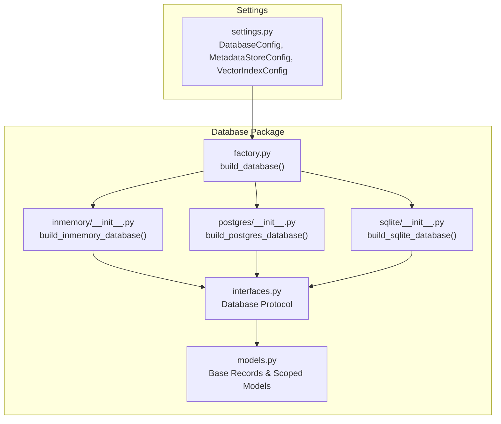
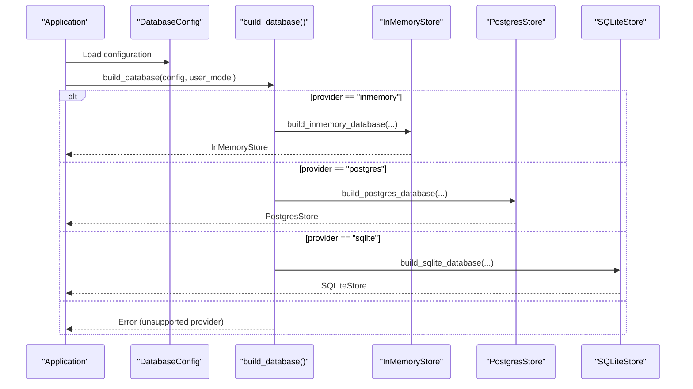
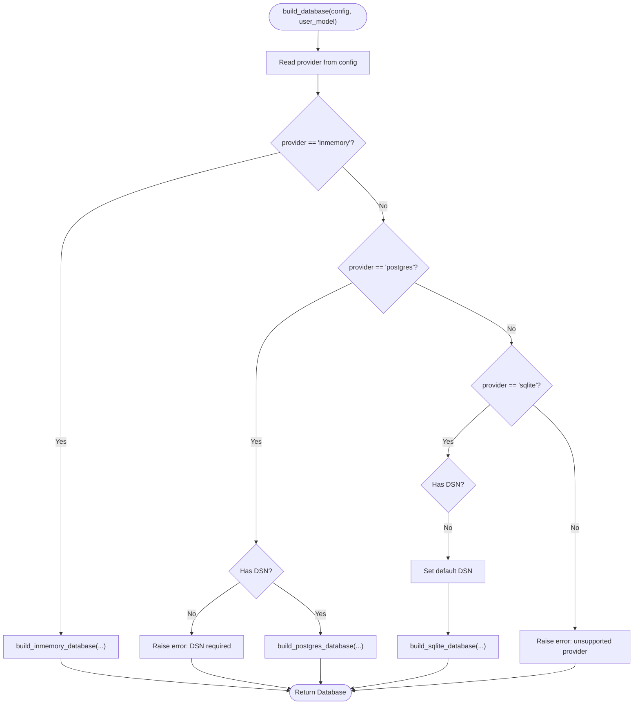
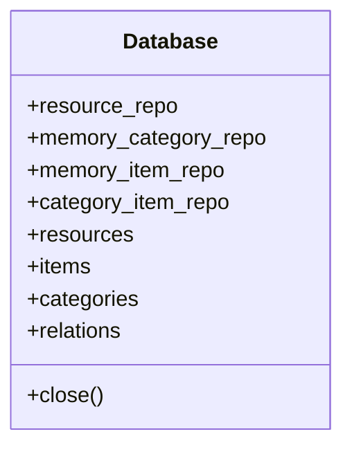
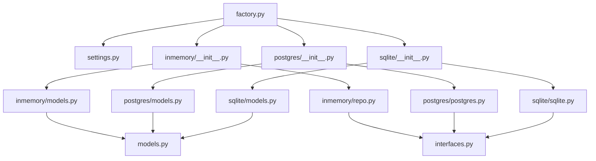

# Storage Backends Overview

<cite>
**Referenced Files in This Document**
- [factory.py](file://src/memu/database/factory.py)
- [interfaces.py](file://src/memu/database/interfaces.py)
- [__init__.py](file://src/memu/database/__init__.py)
- [settings.py](file://src/memu/app/settings.py)
- [models.py](file://src/memu/database/models.py)
- [inmemory/__init__.py](file://src/memu/database/inmemory/__init__.py)
- [inmemory/models.py](file://src/memu/database/inmemory/models.py)
- [inmemory/repo.py](file://src/memu/database/inmemory/repo.py)
- [postgres/__init__.py](file://src/memu/database/postgres/__init__.py)
- [postgres/models.py](file://src/memu/database/postgres/models.py)
- [postgres/postgres.py](file://src/memu/database/postgres/postgres.py)
- [sqlite/__init__.py](file://src/memu/database/sqlite/__init__.py)
- [sqlite/models.py](file://src/memu/database/sqlite/models.py)
- [sqlite/sqlite.py](file://src/memu/database/sqlite/sqlite.py)
</cite>

## Table of Contents
1. [Introduction](#introduction)
2. [Project Structure](#project-structure)
3. [Core Components](#core-components)
4. [Architecture Overview](#architecture-overview)
5. [Detailed Component Analysis](#detailed-component-analysis)
6. [Dependency Analysis](#dependency-analysis)
7. [Performance Considerations](#performance-considerations)
8. [Troubleshooting Guide](#troubleshooting-guide)
9. [Conclusion](#conclusion)

## Introduction
This document explains memU’s pluggable storage backends architecture with a focus on the factory pattern for backend selection, the unified Database interface contract, and how different storage providers are initialized and configured. It covers the three supported backends—In-Memory, PostgreSQL, and SQLite—detailing their use cases, performance characteristics, deployment requirements, provider selection logic, configuration parameters, and runtime initialization process. Practical examples of backend switching and configuration options are included, along with the abstraction layer that enables seamless backend replacement and its implications for application code.

## Project Structure
MemU organizes storage backends under a shared database package with a clear separation of concerns:
- Factory module selects the backend based on configuration.
- A protocol defines the unified Database interface contract.
- Backend-specific modules implement stores and repositories.
- Settings define configuration schemas for metadata store and vector index.
- Shared models and repository abstractions provide a consistent domain model across backends.

**Diagram sources**
- [factory.py](file://src/memu/database/factory.py#L15-L44)
- [interfaces.py](file://src/memu/database/interfaces.py#L12-L27)
- [models.py](file://src/memu/database/models.py#L35-L148)
- [inmemory/__init__.py](file://src/memu/database/inmemory/__init__.py#L10-L22)
- [postgres/__init__.py](file://src/memu/database/postgres/__init__.py#L10-L33)
- [sqlite/__init__.py](file://src/memu/database/sqlite/__init__.py#L11-L33)
- [settings.py](file://src/memu/app/settings.py#L299-L322)

**Section sources**
- [factory.py](file://src/memu/database/factory.py#L1-L44)
- [interfaces.py](file://src/memu/database/interfaces.py#L1-L36)
- [__init__.py](file://src/memu/database/__init__.py#L1-L29)
- [settings.py](file://src/memu/app/settings.py#L299-L322)

## Core Components
- Database factory: Selects and initializes the appropriate backend store based on configuration.
- Database protocol: Defines a stable interface for repositories and caches, enabling backend substitution.
- Backend stores: InMemoryStore, PostgresStore, and SQLiteStore implement the Database protocol.
- Configuration models: DatabaseConfig, MetadataStoreConfig, and VectorIndexConfig define provider selection and parameters.
- Shared models: BaseRecord and scoped models unify data representation across backends.

Key responsibilities:
- Provider selection: The factory reads provider from configuration and dispatches to the matching builder.
- Initialization: Builders validate required parameters (e.g., DSN for PostgreSQL/SQLite) and construct store instances with repositories and caches.
- Abstraction: The Database protocol ensures application code depends only on repository interfaces and cached collections.

**Section sources**
- [factory.py](file://src/memu/database/factory.py#L15-L44)
- [interfaces.py](file://src/memu/database/interfaces.py#L12-L27)
- [settings.py](file://src/memu/app/settings.py#L299-L322)
- [models.py](file://src/memu/database/models.py#L35-L148)

## Architecture Overview
The storage backends architecture follows a factory pattern with a protocol-driven abstraction:

**Diagram sources**
- [factory.py](file://src/memu/database/factory.py#L15-L44)
- [inmemory/__init__.py](file://src/memu/database/inmemory/__init__.py#L10-L22)
- [postgres/__init__.py](file://src/memu/database/postgres/__init__.py#L10-L33)
- [sqlite/__init__.py](file://src/memu/database/sqlite/__init__.py#L11-L33)

## Detailed Component Analysis

### Database Factory and Provider Selection
The factory function centralizes backend selection and delegates to provider-specific builders. It supports:
- inmemory: No persistence, suitable for ephemeral environments.
- postgres: Requires a DSN; supports pgvector when configured.
- sqlite: Requires a DSN; defaults to a local file if none provided.

Provider selection logic:
- Reads provider from configuration.
- Validates required parameters (e.g., DSN for postgres/sqlite).
- Lazily imports backend modules to avoid unnecessary dependencies.

**Diagram sources**
- [factory.py](file://src/memu/database/factory.py#L15-L44)
- [postgres/__init__.py](file://src/memu/database/postgres/__init__.py#L15-L18)
- [sqlite/__init__.py](file://src/memu/database/sqlite/__init__.py#L25-L28)

**Section sources**
- [factory.py](file://src/memu/database/factory.py#L15-L44)
- [postgres/__init__.py](file://src/memu/database/postgres/__init__.py#L15-L18)
- [sqlite/__init__.py](file://src/memu/database/sqlite/__init__.py#L25-L28)

### Unified Database Interface Contract
The Database protocol defines the contract that all stores must satisfy:
- Repository attributes: resource_repo, memory_category_repo, memory_item_repo, category_item_repo.
- Cached collections: resources, items, categories, relations.
- Lifecycle: close() to release resources.

This contract enables application code to depend on repositories and cached collections without binding to a specific backend.

**Diagram sources**
- [interfaces.py](file://src/memu/database/interfaces.py#L12-L27)

**Section sources**
- [interfaces.py](file://src/memu/database/interfaces.py#L12-L27)

### In-Memory Backend
The in-memory backend is designed for ephemeral or testing scenarios:
- Uses in-memory state and dictionaries for caching.
- Builds scoped models by merging user scope with base records.
- Provides repository implementations backed by in-memory state.

Initialization and configuration:
- Builder composes scoped models and constructs InMemoryStore.
- Store sets up repositories and cached collections.
- No external dependencies required.

Use cases:
- Unit/integration tests.
- Local development without persistent storage.
- Short-lived sessions or demos.

Performance characteristics:
- Fast reads/writes due to in-memory nature.
- No disk I/O overhead.
- Not suitable for production persistence.

**Section sources**
- [inmemory/__init__.py](file://src/memu/database/inmemory/__init__.py#L10-L22)
- [inmemory/models.py](file://src/memu/database/inmemory/models.py#L30-L45)
- [inmemory/repo.py](file://src/memu/database/inmemory/repo.py#L20-L61)

### PostgreSQL Backend
The PostgreSQL backend supports scalable persistence and vector search:
- Requires a DSN; validates presence.
- Supports pgvector for native vector operations when configured.
- Uses SQLAlchemy/SQLModel with scoped table models.

Initialization and configuration:
- Builder validates DSN and constructs PostgresStore.
- Store runs migrations based on DDL mode and initializes repositories.
- Vector provider influences whether to use pgvector types.

Use cases:
- Production-grade deployments.
- Applications requiring robust relational storage and vector search.
- Multi-tenant or enterprise environments.

Performance characteristics:
- Strong ACID guarantees and concurrency control.
- Vector search performance depends on pgvector availability and indexing.
- Network latency considerations apply for remote databases.

**Section sources**
- [postgres/__init__.py](file://src/memu/database/postgres/__init__.py#L10-L33)
- [postgres/models.py](file://src/memu/database/postgres/models.py#L46-L76)
- [postgres/postgres.py](file://src/memu/database/postgres/postgres.py#L23-L103)

### SQLite Backend
The SQLite backend offers a lightweight, file-based solution:
- Accepts a DSN; defaults to a local file if omitted.
- Creates tables on startup and uses brute-force similarity for vector search (no native vector type).
- Stores embeddings as JSON strings to accommodate SQLite limitations.

Initialization and configuration:
- Builder validates DSN and constructs SQLiteStore.
- Store creates tables via SQLModel metadata and initializes repositories.
- Scope-aware queries leverage indexes built from the user scope model.

Use cases:
- Single-user or small-scale deployments.
- Edge devices or environments without a separate database server.
- Prototyping and development where simplicity is preferred.

Performance characteristics:
- Lower overhead than PostgreSQL for small datasets.
- Brute-force vector search is acceptable for modest sizes but may degrade with large vectors.
- Portable and self-contained.

**Section sources**
- [sqlite/__init__.py](file://src/memu/database/sqlite/__init__.py#L11-L33)
- [sqlite/models.py](file://src/memu/database/sqlite/models.py#L48-L144)
- [sqlite/sqlite.py](file://src/memu/database/sqlite/sqlite.py#L25-L143)

### Configuration Parameters and Runtime Initialization
Configuration is defined in settings and controls provider selection and behavior:
- DatabaseConfig: Top-level container for metadata store and vector index.
- MetadataStoreConfig: provider, ddl_mode, and dsn.
- VectorIndexConfig: provider and optional dsn (inherits from metadata store when missing).

Runtime initialization:
- The factory reads provider and dsn from DatabaseConfig.
- Builders validate required parameters and construct stores with repositories and cached collections.
- Stores initialize sessions, run migrations (PostgreSQL), or create tables (SQLite), then expose repositories and caches.

Practical examples of backend switching:
- Switch provider by changing the metadata_store.provider value in configuration.
- Provide a DSN for PostgreSQL or SQLite; omit for in-memory.
- Configure vector index provider and dsn for PostgreSQL-backed vector operations.

**Section sources**
- [settings.py](file://src/memu/app/settings.py#L299-L322)
- [factory.py](file://src/memu/database/factory.py#L15-L44)
- [postgres/__init__.py](file://src/memu/database/postgres/__init__.py#L15-L18)
- [sqlite/__init__.py](file://src/memu/database/sqlite/__init__.py#L25-L28)

## Dependency Analysis
The database package exhibits clean separation of concerns:
- Factory depends on settings and backend builders.
- Backends depend on shared models and repositories.
- Repositories depend on stores and session managers.
- Settings define configuration contracts used by the factory.

**Diagram sources**
- [factory.py](file://src/memu/database/factory.py#L15-L44)
- [settings.py](file://src/memu/app/settings.py#L299-L322)
- [inmemory/__init__.py](file://src/memu/database/inmemory/__init__.py#L10-L22)
- [inmemory/models.py](file://src/memu/database/inmemory/models.py#L30-L45)
- [inmemory/repo.py](file://src/memu/database/inmemory/repo.py#L20-L61)
- [postgres/__init__.py](file://src/memu/database/postgres/__init__.py#L10-L33)
- [postgres/models.py](file://src/memu/database/postgres/models.py#L46-L76)
- [postgres/postgres.py](file://src/memu/database/postgres/postgres.py#L23-L103)
- [sqlite/__init__.py](file://src/memu/database/sqlite/__init__.py#L11-L33)
- [sqlite/models.py](file://src/memu/database/sqlite/models.py#L48-L144)
- [sqlite/sqlite.py](file://src/memu/database/sqlite/sqlite.py#L25-L143)
- [interfaces.py](file://src/memu/database/interfaces.py#L12-L27)
- [models.py](file://src/memu/database/models.py#L35-L148)

**Section sources**
- [factory.py](file://src/memu/database/factory.py#L15-L44)
- [interfaces.py](file://src/memu/database/interfaces.py#L12-L27)
- [models.py](file://src/memu/database/models.py#L35-L148)

## Performance Considerations
- In-memory backend: Highest throughput for read/write operations with minimal latency; unsuitable for persistence.
- PostgreSQL: Best for production scale; vector performance improves with pgvector; consider indexing and connection pooling.
- SQLite: Good balance of simplicity and portability; brute-force vector search may become a bottleneck as dataset grows; consider moving to PostgreSQL for larger workloads.

[No sources needed since this section provides general guidance]

## Troubleshooting Guide
Common issues and resolutions:
- Unsupported provider: Ensure provider is one of inmemory, postgres, or sqlite.
- Missing DSN for PostgreSQL/SQLite: Provide a valid DSN; PostgreSQL requires a DSN; SQLite accepts a default if omitted.
- pgvector import errors (PostgreSQL): Install pgvector support or switch vector provider to bruteforce.
- Scope field conflicts: Ensure user scope model does not overlap with core model fields when building scoped models.

**Section sources**
- [factory.py](file://src/memu/database/factory.py#L42-L43)
- [postgres/__init__.py](file://src/memu/database/postgres/__init__.py#L15-L18)
- [sqlite/__init__.py](file://src/memu/database/sqlite/__init__.py#L25-L28)
- [postgres/models.py](file://src/memu/database/postgres/models.py#L9-L13)
- [models.py](file://src/memu/database/models.py#L108-L121)

## Conclusion
memU’s storage backends architecture leverages a factory pattern and a unified Database protocol to provide a flexible, pluggable system. Application code interacts with repositories and cached collections, enabling seamless backend replacement. Choose the backend based on deployment requirements: inmemory for ephemeral environments, PostgreSQL for production with vector capabilities, and SQLite for lightweight, portable setups. Configuration is centralized in settings, ensuring consistent behavior across providers.