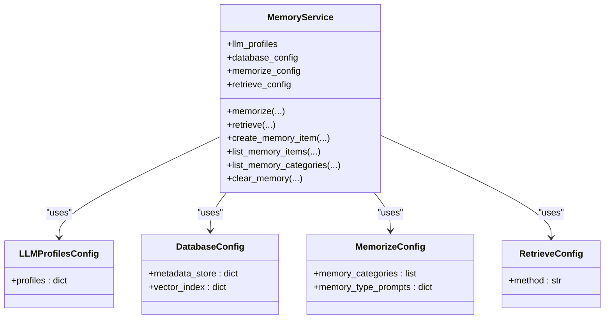

# Getting Started

<cite>
**Referenced Files in This Document**
- [README_en.md](file://readme/README_en.md)
- [README.md](file://README.md)
- [getting_started.md](file://docs/tutorials/getting_started.md)
- [pyproject.toml](file://pyproject.toml)
- [Makefile](file://Makefile)
- [src/memu/__init__.py](file://src/memu/__init__.py)
- [src/memu/app/service.py](file://src/memu/app/service.py)
- [examples/getting_started_robust.py](file://examples/getting_started_robust.py)
- [examples/example_1_conversation_memory.py](file://examples/example_1_conversation_memory.py)
- [examples/example_2_skill_extraction.py](file://examples/example_2_skill_extraction.py)
- [examples/example_3_multimodal_memory.py](file://examples/example_3_multimodal_memory.py)
- [tests/test_inmemory.py](file://tests/test_inmemory.py)
- [tests/test_postgres.py](file://tests/test_postgres.py)
</cite>

## Table of Contents
1. [Introduction](#introduction)
2. [Installation](#installation)
3. [Environment Setup](#environment-setup)
4. [Basic Configuration](#basic-configuration)
5. [Quick Start Examples](#quick-start-examples)
6. [Architecture Overview](#architecture-overview)
7. [Troubleshooting Guide](#troubleshooting-guide)
8. [Verification Steps](#verification-steps)
9. [Next Steps](#next-steps)

## Introduction
MemU is a proactive memory framework designed for 24/7 AI agents. It continuously captures and understands user intent, reducing LLM token costs while enabling always-on, evolving agents. This getting started guide helps you install MemU (cloud or self-hosted), configure the environment, and run your first successful memory operations.

## Installation
Choose one of the following installation methods:

- Cloud version (recommended for first-time users):
  - Try the hosted service at [memu.so](https://memu.so) with 7×24 continuous learning.
  - Enterprise deployments with custom workflows are available upon request.

- Self-hosted installation:
  - Install the editable package:
    ```bash
    pip install -e .
    ```
  - Or use uv for faster dependency resolution:
    ```bash
    uv add memu
    ```

**Section sources**
- [README_en.md](file://readme/README_en.md#L247-L316)
- [README.md](file://README.md#L247-L316)
- [pyproject.toml](file://pyproject.toml#L1-L31)

## Environment Setup
MemU requires Python 3.13+ and a valid LLM API key. The simplest path for first-time users is OpenAI:

- Ensure Python 3.13+ is installed.
- Obtain an OpenAI API key and set it as an environment variable:
  - Linux/macOS/Git Bash:
    ```bash
    export OPENAI_API_KEY=sk-proj-your-api-key
    ```
  - Windows PowerShell:
    ```powershell
    $env:OPENAI_API_KEY="sk-proj-your-api-key"
    ```

Optional: Use uv for development workflows:
- Install dependencies and pre-commit hooks:
  ```bash
  make install
  ```
- Run quality checks:
  ```bash
  make check
  ```

**Section sources**
- [README_en.md](file://readme/README_en.md#L598-L617)
- [README.md](file://README.md#L599-L618)
- [Makefile](file://Makefile#L1-L23)
- [pyproject.toml](file://pyproject.toml#L10-L31)

## Basic Configuration
MemU uses a configuration-driven approach. At minimum, you need to specify:
- LLM profiles (required): Defines the LLM backend and credentials.
- Optional: Database configuration for persistence (in-memory by default).
- Optional: Memory categories and prompts for structured extraction.

Key configuration points:
- LLM profiles: Provide at least a "default" profile with api_key and chat_model.
- Database: Defaults to in-memory; PostgreSQL requires a DSN and optional ddl_mode.
- Memory categories: Define high-level categories to guide extraction and retrieval.

Public API alias:
- The public alias MemUService is available for convenience.

**Section sources**
- [src/memu/app/service.py](file://src/memu/app/service.py#L49-L95)
- [src/memu/__init__.py](file://src/memu/__init__.py#L1-L10)

## Quick Start Examples
These examples demonstrate the most common workflows. Run them after setting OPENAI_API_KEY.

### Example 1: Conversation Memory
Process multiple conversation files and generate memory categories:
```bash
export OPENAI_API_KEY=your_api_key
python examples/example_1_conversation_memory.py
```

What it does:
- Initializes MemoryService with OpenAI.
- Processes conversation JSON files.
- Extracts memory categories and writes them to Markdown files.

**Section sources**
- [examples/example_1_conversation_memory.py](file://examples/example_1_conversation_memory.py#L1-L118)

### Example 2: Skill Extraction
Extract skills from agent execution logs and produce a production-ready guide:
```bash
export OPENAI_API_KEY=your_api_key
python examples/example_2_skill_extraction.py
```

What it does:
- Demonstrates incremental learning by processing logs sequentially.
- Updates categories and generates evolving skill guides.

**Section sources**
- [examples/example_2_skill_extraction.py](file://examples/example_2_skill_extraction.py#L1-L275)

### Example 3: Multimodal Memory
Unify memory across different input types (documents, images):
```bash
export OPENAI_API_KEY=your_api_key
python examples/example_3_multimodal_memory.py
```

What it does:
- Processes documents and images.
- Generates unified memory categories across modalities.

**Section sources**
- [examples/example_3_multimodal_memory.py](file://examples/example_3_multimodal_memory.py#L1-L138)

### Robust Getting Started Script
A production-ready example covering initialization, memory injection, retrieval, and error handling:
```bash
export OPENAI_API_KEY=your_api_key
python examples/getting_started_robust.py
```

What it does:
- Validates API key presence.
- Initializes MemoryService with a predefined category.
- Creates a memory item and retrieves it using natural language queries.

**Section sources**
- [examples/getting_started_robust.py](file://examples/getting_started_robust.py#L1-L108)

## Architecture Overview
MemU’s core API surface centers around MemoryService, which orchestrates:
- Memory ingestion (memorize)
- Dual-mode retrieval (RAG and LLM-based)
- CRUD operations on memory items and categories
- Pluggable LLM providers and storage backends



**Diagram sources**
- [src/memu/app/service.py](file://src/memu/app/service.py#L49-L95)

**Section sources**
- [src/memu/app/service.py](file://src/memu/app/service.py#L49-L95)

## Troubleshooting Guide
Common setup issues and resolutions:

- Missing OPENAI_API_KEY:
  - Symptom: Error indicating the environment variable is not set.
  - Resolution: Export the key in your current terminal session.
    - Linux/macOS: export OPENAI_API_KEY=sk-...
    - Windows PowerShell: $env:OPENAI_API_KEY="sk-..."

- Python version mismatch:
  - Symptom: Installation or runtime errors.
  - Resolution: Ensure Python 3.13+ is installed and active in your environment.

- PostgreSQL connectivity (self-hosted):
  - Symptom: Connection failures when using PostgreSQL.
  - Resolution: Verify the DSN and that the database is reachable. See the PostgreSQL test for expected format.

- Provider configuration:
  - Symptom: Unexpected provider behavior.
  - Resolution: Confirm llm_profiles includes a "default" profile with api_key and chat_model. For custom providers, ensure base_url, provider, and model names are correct.

**Section sources**
- [docs/tutorials/getting_started.md](file://docs/tutorials/getting_started.md#L159-L171)
- [tests/test_postgres.py](file://tests/test_postgres.py#L10-L11)

## Verification Steps
After installation and configuration, verify your setup with the provided tests:

- In-memory test (default):
  - Requires OPENAI_API_KEY.
  - Demonstrates continuous learning, auto-extraction, and proactive retrieval.
  - Run:
    ```bash
    cd tests
    python test_inmemory.py
    ```

- PostgreSQL test (persistent storage):
  - Requires OPENAI_API_KEY and a running PostgreSQL instance with pgvector.
  - Docker example included in the repository.
  - Run:
    ```bash
    cd tests
    python test_postgres.py
    ```

Expected outcomes:
- Successful memory ingestion and category generation.
- Retrieval results containing relevant items and resources.
- No exceptions thrown during the workflow.

**Section sources**
- [tests/test_inmemory.py](file://tests/test_inmemory.py#L1-L90)
- [tests/test_postgres.py](file://tests/test_postgres.py#L1-L83)
- [README_en.md](file://readme/README_en.md#L285-L315)
- [README.md](file://README.md#L283-L316)

## Next Steps
Once the basics are working:
- Explore advanced configuration: custom LLM providers, embedding providers, and vector stores.
- Integrate MemU into your agent framework using MemoryService.
- Review the core APIs: memorize() for continuous learning and retrieve() for dual-mode intelligence.
- Experiment with proactive filtering using where scopes for user or agent coordination.

**Section sources**
- [README_en.md](file://readme/README_en.md#L403-L489)
- [README.md](file://README.md#L405-L490)