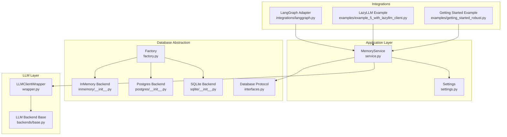
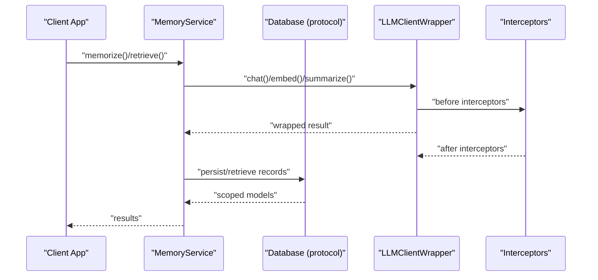
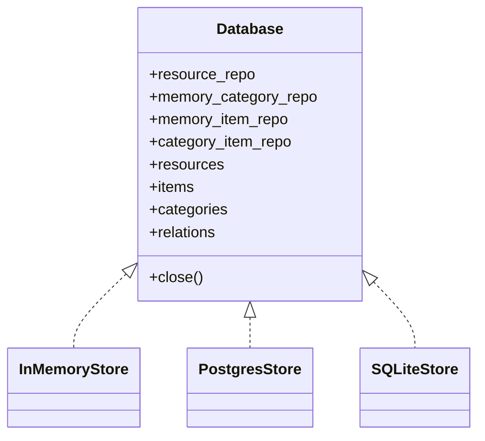
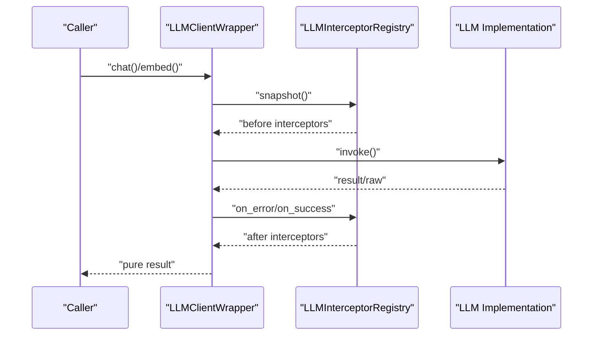
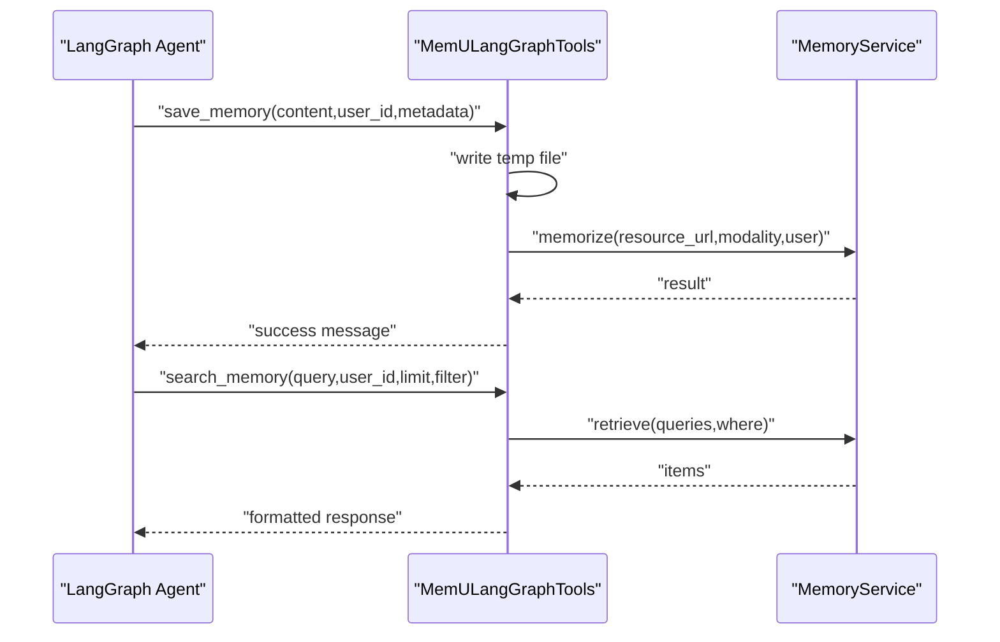
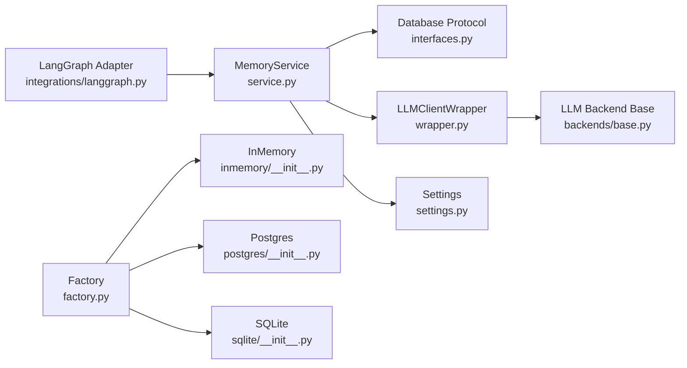

# Custom Integration Patterns

<cite>
**Referenced Files in This Document**
- [__init__.py](file://src/memu/__init__.py)
- [_core.pyi](file://src/memu/_core.pyi)
- [service.py](file://src/memu/app/service.py)
- [settings.py](file://src/memu/app/settings.py)
- [interfaces.py](file://src/memu/database/interfaces.py)
- [factory.py](file://src/memu/database/factory.py)
- [models.py](file://src/memu/database/models.py)
- [inmemory/__init__.py](file://src/memu/database/inmemory/__init__.py)
- [postgres/__init__.py](file://src/memu/database/postgres/__init__.py)
- [sqlite/__init__.py](file://src/memu/database/sqlite/__init__.py)
- [wrapper.py](file://src/memu/llm/wrapper.py)
- [base.py](file://src/memu/llm/backends/base.py)
- [langgraph.py](file://src/memu/integrations/langgraph.py)
- [example_5_with_lazyllm_client.py](file://examples/example_5_with_lazyllm_client.py)
- [getting_started_robust.py](file://examples/getting_started_robust.py)
</cite>

## Table of Contents
1. [Introduction](#introduction)
2. [Project Structure](#project-structure)
3. [Core Components](#core-components)
4. [Architecture Overview](#architecture-overview)
5. [Detailed Component Analysis](#detailed-component-analysis)
6. [Dependency Analysis](#dependency-analysis)
7. [Performance Considerations](#performance-considerations)
8. [Troubleshooting Guide](#troubleshooting-guide)
9. [Conclusion](#conclusion)
10. [Appendices](#appendices)

## Introduction
This document explains how to implement custom integrations with memU beyond the built-in framework adapters. It focuses on the core abstractions that enable extensibility: the MemoryService API, database backend interfaces, and LLM client contracts. You will learn the adapter pattern used to integrate external systems, how to implement custom database backends, and how to extend LLM provider support. Step-by-step guides are provided for integrating with LangChain, LlamaIndex, and custom AI applications. Advanced topics include custom retrieval strategies, specialized memory formatting, performance optimization, templates for common patterns, testing strategies, and maintenance guidelines.

## Project Structure
The memU codebase organizes integration concerns into cohesive modules:
- Application service layer: orchestrates memory lifecycle and workflow execution
- Database abstraction: protocol-driven backends with pluggable storage providers
- LLM client layer: unified wrapper and interceptor registry for LLM interactions
- Integrations: adapters for LangGraph and examples for LazyLLM
- Examples: end-to-end demonstrations of custom integrations

**Diagram sources**
- [service.py](file://src/memu/app/service.py#L49-L427)
- [settings.py](file://src/memu/app/settings.py#L102-L322)
- [interfaces.py](file://src/memu/database/interfaces.py#L12-L36)
- [factory.py](file://src/memu/database/factory.py#L15-L44)
- [inmemory/__init__.py](file://src/memu/database/inmemory/__init__.py#L10-L26)
- [postgres/__init__.py](file://src/memu/database/postgres/__init__.py#L10-L37)
- [sqlite/__init__.py](file://src/memu/database/sqlite/__init__.py#L11-L37)
- [wrapper.py](file://src/memu/llm/wrapper.py#L226-L773)
- [base.py](file://src/memu/llm/backends/base.py#L6-L31)
- [langgraph.py](file://src/memu/integrations/langgraph.py#L53-L164)
- [example_5_with_lazyllm_client.py](file://examples/example_5_with_lazyllm_client.py#L220-L251)
- [getting_started_robust.py](file://examples/getting_started_robust.py#L30-L108)

**Section sources**
- [service.py](file://src/memu/app/service.py#L49-L427)
- [settings.py](file://src/memu/app/settings.py#L102-L322)
- [interfaces.py](file://src/memu/database/interfaces.py#L12-L36)
- [factory.py](file://src/memu/database/factory.py#L15-L44)
- [wrapper.py](file://src/memu/llm/wrapper.py#L226-L773)
- [base.py](file://src/memu/llm/backends/base.py#L6-L31)
- [langgraph.py](file://src/memu/integrations/langgraph.py#L53-L164)
- [example_5_with_lazyllm_client.py](file://examples/example_5_with_lazyllm_client.py#L220-L251)
- [getting_started_robust.py](file://examples/getting_started_robust.py#L30-L108)

## Core Components
This section documents the primary interfaces and abstractions enabling custom integrations.

- MemoryService
  - Central orchestrator for memory lifecycle, retrieval, and workflow execution
  - Provides LLM client initialization, interception, and pipeline registration
  - Exposes CRUD and retrieval APIs for memory items and categories
  - See [MemoryService](file://src/memu/app/service.py#L49-L427)

- Database Abstraction
  - Protocol-driven interface for storage backends
  - Factory resolves provider-specific implementations (in-memory, PostgreSQL, SQLite)
  - Models define user-scoped records and hashing for deduplication
  - See [Database Protocol](file://src/memu/database/interfaces.py#L12-L36), [Factory](file://src/memu/database/factory.py#L15-L44), [Models](file://src/memu/database/models.py#L35-L149)

- LLM Client Contracts
  - LLMClientWrapper standardizes chat, summarize, embed, vision, and transcription calls
  - Interceptor registry enables cross-cutting concerns (metrics, tracing, retries)
  - Backends define payload construction and response parsing for HTTP providers
  - See [LLMClientWrapper](file://src/memu/llm/wrapper.py#L226-L773), [LLM Backend Base](file://src/memu/llm/backends/base.py#L6-L31)

- Settings and Profiles
  - LLM profiles, database configuration, and retrieval controls
  - Enables multi-profile LLM routing and per-step selection
  - See [LLMConfig](file://src/memu/app/settings.py#L102-L139), [DatabaseConfig](file://src/memu/app/settings.py#L310-L322), [LLMProfilesConfig](file://src/memu/app/settings.py#L263-L297)

**Section sources**
- [service.py](file://src/memu/app/service.py#L49-L427)
- [interfaces.py](file://src/memu/database/interfaces.py#L12-L36)
- [factory.py](file://src/memu/database/factory.py#L15-L44)
- [models.py](file://src/memu/database/models.py#L35-L149)
- [wrapper.py](file://src/memu/llm/wrapper.py#L226-L773)
- [base.py](file://src/memu/llm/backends/base.py#L6-L31)
- [settings.py](file://src/memu/app/settings.py#L102-L139)
- [settings.py](file://src/memu/app/settings.py#L310-L322)
- [settings.py](file://src/memu/app/settings.py#L263-L297)

## Architecture Overview
The integration architecture follows a layered design:
- Application layer composes MemoryService with configurable LLM profiles and database backends
- Database layer abstracts storage behind a protocol and factory pattern
- LLM layer wraps client calls with standardized methods and interceptors
- Integration adapters translate external frameworks into memU primitives

**Diagram sources**
- [service.py](file://src/memu/app/service.py#L49-L427)
- [wrapper.py](file://src/memu/llm/wrapper.py#L226-L773)
- [interfaces.py](file://src/memu/database/interfaces.py#L12-L36)

## Detailed Component Analysis

### MemoryService API
MemoryService is the primary integration surface. It:
- Initializes and caches LLM clients per profile
- Wraps clients with LLMClientWrapper and registers interceptors
- Builds and runs pipelines for memorize, retrieve, and CRUD operations
- Exposes helpers for extracting JSON blobs and escaping prompt values

Key capabilities:
- LLM client selection by step context
- Pipeline configuration and dynamic step insertion
- Provider summary for diagnostics

Integration patterns:
- Wrap external LLM clients using LLMClientWrapper
- Register interceptors for telemetry, retries, and tracing
- Compose MemoryService with custom database backends via the Database protocol

**Section sources**
- [service.py](file://src/memu/app/service.py#L49-L427)
- [wrapper.py](file://src/memu/llm/wrapper.py#L226-L773)

### Database Backend Interfaces
The Database protocol defines the contract for storage backends:
- Repositories for resources, categories, items, and category-item relations
- In-memory, PostgreSQL, and SQLite backends are supported

Implementation pattern:
- Implement the Database protocol and return scoped models via build_scoped_models
- Use the factory to wire your backend into MemoryService

**Diagram sources**
- [interfaces.py](file://src/memu/database/interfaces.py#L12-L36)
- [inmemory/__init__.py](file://src/memu/database/inmemory/__init__.py#L10-L26)
- [postgres/__init__.py](file://src/memu/database/postgres/__init__.py#L10-L37)
- [sqlite/__init__.py](file://src/memu/database/sqlite/__init__.py#L11-L37)

**Section sources**
- [interfaces.py](file://src/memu/database/interfaces.py#L12-L36)
- [factory.py](file://src/memu/database/factory.py#L15-L44)
- [models.py](file://src/memu/database/models.py#L108-L149)
- [inmemory/__init__.py](file://src/memu/database/inmemory/__init__.py#L10-L26)
- [postgres/__init__.py](file://src/memu/database/postgres/__init__.py#L10-L37)
- [sqlite/__init__.py](file://src/memu/database/sqlite/__init__.py#L11-L37)

### LLM Client Contracts and Interceptors
The LLM layer provides:
- Unified methods: chat, summarize, embed, vision, transcribe
- Request/response views and usage metrics extraction
- Interceptor registry for before/after/error hooks
- Filter-based interceptor targeting

Integration pattern:
- Implement a client conforming to the wrapped methods
- Instantiate LLMClientWrapper with your client and register interceptors
- Use step context to select profiles and enrich telemetry

**Diagram sources**
- [wrapper.py](file://src/memu/llm/wrapper.py#L226-L773)

**Section sources**
- [wrapper.py](file://src/memu/llm/wrapper.py#L226-L773)
- [base.py](file://src/memu/llm/backends/base.py#L6-L31)

### Adapter Pattern: LangGraph Integration
The LangGraph adapter exposes MemU as structured tools:
- save_memory: writes content to a temporary file and triggers memorize
- search_memory: retrieves relevant memories filtered by user_id and optional metadata

Integration steps:
- Initialize MemULangGraphTools with a MemoryService instance
- Register tools in a LangGraph agent
- Handle exceptions and cleanup temporary files

**Diagram sources**
- [langgraph.py](file://src/memu/integrations/langgraph.py#L53-L164)
- [service.py](file://src/memu/app/service.py#L49-L427)

**Section sources**
- [langgraph.py](file://src/memu/integrations/langgraph.py#L53-L164)

### Custom LLM Provider Support
To add a new LLM provider:
- Implement a client with the required methods (chat, embed, summarize, vision, transcribe)
- Optionally implement a backend class that builds payloads and parses responses
- Initialize the client in MemoryService and wrap it with LLMClientWrapper
- Register interceptors for monitoring and error handling

Reference implementations:
- LazyLLM integration example demonstrates multi-modal and embedding workflows
- Built-in backends illustrate payload construction and response parsing

**Section sources**
- [example_5_with_lazyllm_client.py](file://examples/example_5_with_lazyllm_client.py#L220-L251)
- [base.py](file://src/memu/llm/backends/base.py#L6-L31)
- [wrapper.py](file://src/memu/llm/wrapper.py#L226-L773)

### Custom Retrieval Strategies and Specialized Formatting
Custom retrieval can be achieved by:
- Extending MemoryService with custom mixins for specialized ranking or reranking
- Using step context to select retrieval profiles and override defaults
- Implementing custom prompts and memory type configurations

Patterns:
- Override retrieval behavior per step using step_config fields
- Use category references and reinforcement tracking for richer summaries
- Apply metadata filters and relevance thresholds in integrations

**Section sources**
- [service.py](file://src/memu/app/service.py#L202-L226)
- [models.py](file://src/memu/database/models.py#L35-L149)
- [settings.py](file://src/memu/app/settings.py#L175-L202)

### Performance Optimization for Large-Scale Integrations
Recommendations:
- Batch embedding calls using embed_batch_size
- Use interceptors for retry and circuit-breaking logic
- Prefer vector index providers (e.g., pgvector) for large datasets
- Cache LLM clients per profile and reuse across requests
- Minimize unnecessary conversions and hashing by leveraging content hashes

**Section sources**
- [settings.py](file://src/memu/app/settings.py#L119-L126)
- [factory.py](file://src/memu/database/factory.py#L15-L44)
- [wrapper.py](file://src/memu/llm/wrapper.py#L653-L703)

## Dependency Analysis
The following diagram shows key dependencies among core components:

**Diagram sources**
- [service.py](file://src/memu/app/service.py#L49-L427)
- [interfaces.py](file://src/memu/database/interfaces.py#L12-L36)
- [factory.py](file://src/memu/database/factory.py#L15-L44)
- [inmemory/__init__.py](file://src/memu/database/inmemory/__init__.py#L10-L26)
- [postgres/__init__.py](file://src/memu/database/postgres/__init__.py#L10-L37)
- [sqlite/__init__.py](file://src/memu/database/sqlite/__init__.py#L11-L37)
- [wrapper.py](file://src/memu/llm/wrapper.py#L226-L773)
- [base.py](file://src/memu/llm/backends/base.py#L6-L31)
- [langgraph.py](file://src/memu/integrations/langgraph.py#L53-L164)

**Section sources**
- [service.py](file://src/memu/app/service.py#L49-L427)
- [interfaces.py](file://src/memu/database/interfaces.py#L12-L36)
- [factory.py](file://src/memu/database/factory.py#L15-L44)
- [wrapper.py](file://src/memu/llm/wrapper.py#L226-L773)
- [base.py](file://src/memu/llm/backends/base.py#L6-L31)
- [langgraph.py](file://src/memu/integrations/langgraph.py#L53-L164)

## Performance Considerations
- Token usage extraction is best-effort and supports common response shapes
- Embedding batching reduces API overhead; tune embed_batch_size accordingly
- Vector index selection impacts retrieval speed; choose providers aligned with scale
- Interceptors add overhead; use filters to minimize invocation frequency
- Deduplication via content hashing prevents redundant processing

[No sources needed since this section provides general guidance]

## Troubleshooting Guide
Common issues and resolutions:
- Unknown LLM client backend or profile: verify configuration keys and provider names
- Missing API keys or invalid endpoints: ensure llm_profiles are correctly set
- Unsupported database provider: confirm provider string and required DSN for PostgreSQL/SQLite
- Interceptor failures: enable strict mode selectively and review interceptor filters
- Temporary file cleanup: ensure cleanup logic is executed in adapters

**Section sources**
- [service.py](file://src/memu/app/service.py#L97-L136)
- [service.py](file://src/memu/app/service.py#L228-L296)
- [factory.py](file://src/memu/database/factory.py#L41-L44)
- [wrapper.py](file://src/memu/llm/wrapper.py#L128-L224)
- [langgraph.py](file://src/memu/integrations/langgraph.py#L93-L101)

## Conclusion
memU’s architecture cleanly separates concerns across the application, database, and LLM layers. By adhering to the Database protocol, wrapping LLM clients with LLMClientWrapper, and using the adapter pattern, you can integrate memU with diverse frameworks and providers. The provided examples and patterns serve as templates for building robust, scalable integrations while maintaining compatibility across updates.

[No sources needed since this section summarizes without analyzing specific files]

## Appendices

### Step-by-Step: Integrating with LangChain
- Install required packages and import MemoryService
- Create MemULangGraphTools with a MemoryService instance
- Register save_memory and search_memory tools in your agent
- Handle exceptions and clean up temporary files

**Section sources**
- [langgraph.py](file://src/memu/integrations/langgraph.py#L53-L164)
- [getting_started_robust.py](file://examples/getting_started_robust.py#L30-L108)

### Step-by-Step: Integrating with LlamaIndex
- Initialize MemoryService with desired LLM profiles and database config
- Use MemoryService.memorize for ingestion and retrieve for querying
- Apply metadata filters and relevance thresholds in your retrieval pipeline
- Wrap external LLM clients with LLMClientWrapper for consistent telemetry

**Section sources**
- [service.py](file://src/memu/app/service.py#L49-L427)
- [wrapper.py](file://src/memu/llm/wrapper.py#L226-L773)
- [settings.py](file://src/memu/app/settings.py#L102-L139)

### Step-by-Step: Custom AI Applications
- Implement a client with chat, embed, summarize, vision, transcribe
- Initialize via MemoryService and wrap with LLMClientWrapper
- Register interceptors for observability and resilience
- Use step context to select profiles and enrich traces

**Section sources**
- [service.py](file://src/memu/app/service.py#L97-L194)
- [wrapper.py](file://src/memu/llm/wrapper.py#L226-L773)

### Templates and Boilerplate
- Database backend template: implement Database protocol and scoped models; wire via factory
- LLM client template: implement required methods; wrap with LLMClientWrapper; register interceptors
- Adapter template: translate external tool signatures to MemU primitives; manage temporary files and cleanup

**Section sources**
- [interfaces.py](file://src/memu/database/interfaces.py#L12-L36)
- [models.py](file://src/memu/database/models.py#L108-L149)
- [factory.py](file://src/memu/database/factory.py#L15-L44)
- [wrapper.py](file://src/memu/llm/wrapper.py#L226-L773)
- [langgraph.py](file://src/memu/integrations/langgraph.py#L53-L164)

### Testing Strategies
- Unit tests for interceptors: mock LLMClientWrapper and assert interceptor invocations
- Integration tests: run MemoryService with in-memory database and minimal LLM client
- End-to-end tests: use examples as test harnesses; validate JSON blob extraction and prompt escaping

**Section sources**
- [wrapper.py](file://src/memu/llm/wrapper.py#L128-L224)
- [service.py](file://src/memu/app/service.py#L362-L378)
- [getting_started_robust.py](file://examples/getting_started_robust.py#L30-L108)

### Maintenance Guidelines
- Keep LLM profiles synchronized with provider defaults; update base URLs and models as needed
- Validate database provider compatibility and DDL modes before production rollout
- Review interceptor filters periodically to reduce overhead
- Monitor token usage extraction and adjust parsing logic for new provider formats

**Section sources**
- [settings.py](file://src/memu/app/settings.py#L128-L139)
- [factory.py](file://src/memu/database/factory.py#L15-L44)
- [wrapper.py](file://src/memu/llm/wrapper.py#L653-L703)