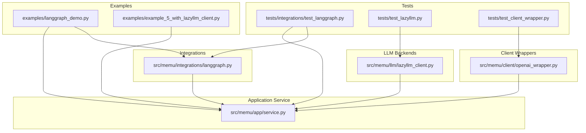
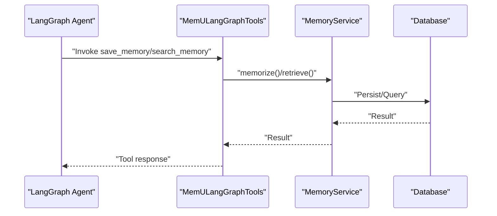
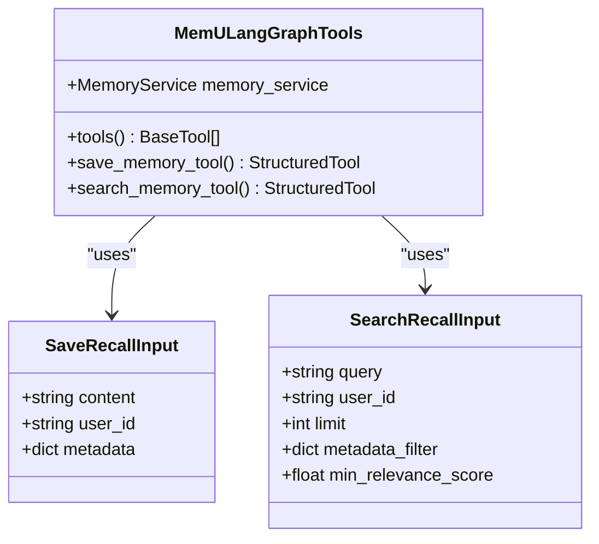
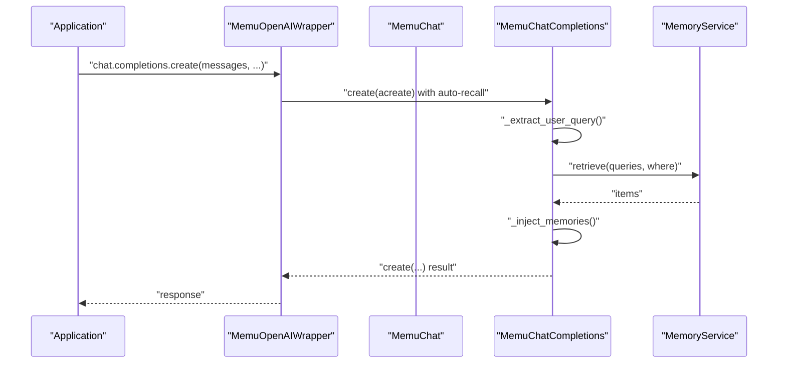
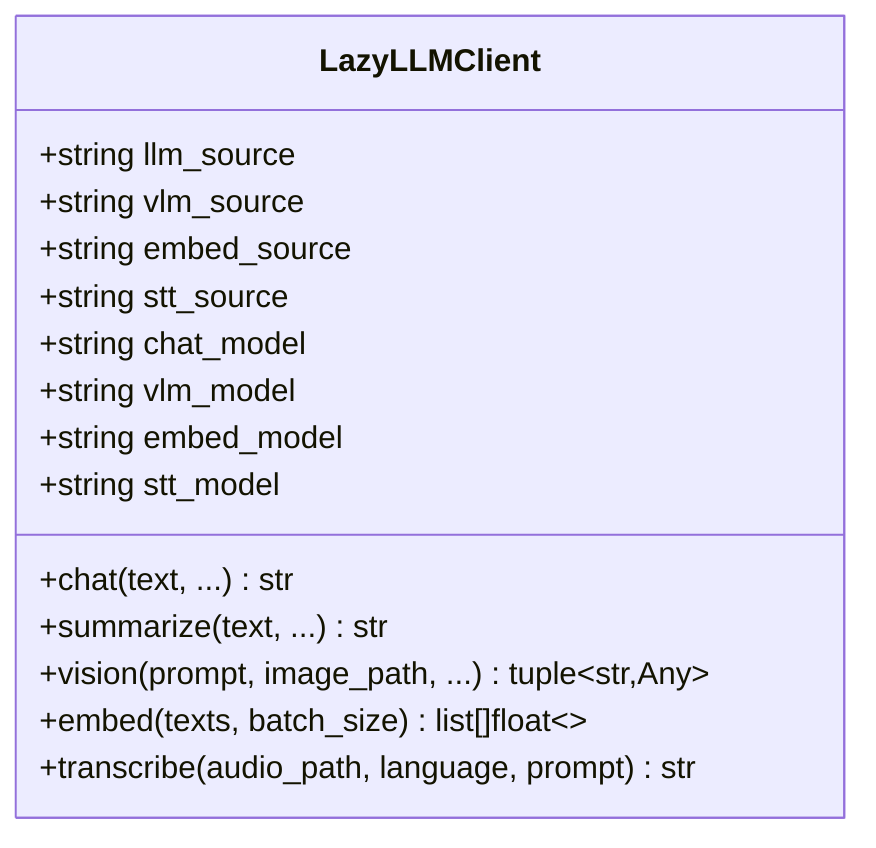
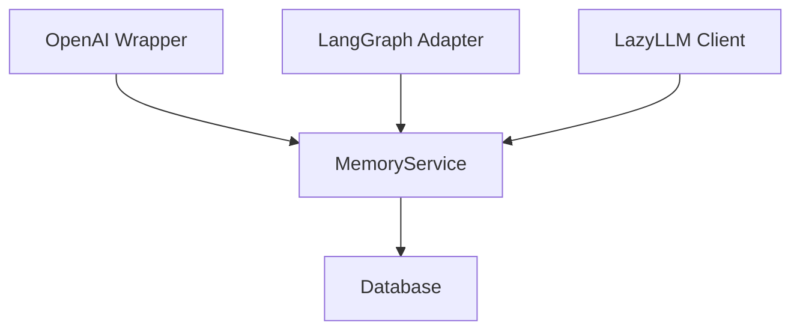

# Integration Guides

<cite>
**Referenced Files in This Document**
- [README.md](file://README.md)
- [docs/architecture.md](file://docs/architecture.md)
- [docs/langgraph_integration.md](file://docs/langgraph_integration.md)
- [src/memu/integrations/langgraph.py](file://src/memu/integrations/langgraph.py)
- [src/memu/client/openai_wrapper.py](file://src/memu/client/openai_wrapper.py)
- [src/memu/llm/lazyllm_client.py](file://src/memu/llm/lazyllm_client.py)
- [src/memu/app/service.py](file://src/memu/app/service.py)
- [examples/langgraph_demo.py](file://examples/langgraph_demo.py)
- [examples/example_5_with_lazyllm_client.py](file://examples/example_5_with_lazyllm_client.py)
- [tests/integrations/test_langgraph.py](file://tests/integrations/test_langgraph.py)
- [tests/test_lazyllm.py](file://tests/test_lazyllm.py)
- [tests/test_client_wrapper.py](file://tests/test_client_wrapper.py)
</cite>

## Table of Contents
1. [Introduction](#introduction)
2. [Project Structure](#project-structure)
3. [Core Components](#core-components)
4. [Architecture Overview](#architecture-overview)
5. [Detailed Component Analysis](#detailed-component-analysis)
6. [Dependency Analysis](#dependency-analysis)
7. [Performance Considerations](#performance-considerations)
8. [Troubleshooting Guide](#troubleshooting-guide)
9. [Conclusion](#conclusion)
10. [Appendices](#appendices)

## Introduction
This document provides integration guides for connecting memU with popular AI frameworks and tools. It focuses on:
- LangGraph integration: exposing memU’s memory capabilities as LangChain/LangGraph tools
- OpenAI client wrapper: auto-injection of recalled memories into OpenAI chat prompts
- LazyLLM compatibility: using memU with the LazyLLM backend for LLM, VLM, embedding, and STT operations

The guide explains integration patterns, API adaptations, compatibility considerations, and practical examples drawn from the codebase. It also covers troubleshooting, performance optimization, and migration strategies.

## Project Structure
The integration-related components live under:
- Integrations: LangGraph adapter
- Client wrappers: OpenAI client wrapper
- LLM backends: LazyLLM client
- Application service: MemoryService orchestrating pipelines and tooling

**Diagram sources**
- [src/memu/integrations/langgraph.py](file://src/memu/integrations/langgraph.py#L1-L164)
- [src/memu/client/openai_wrapper.py](file://src/memu/client/openai_wrapper.py#L1-L269)
- [src/memu/llm/lazyllm_client.py](file://src/memu/llm/lazyllm_client.py#L1-L160)
- [src/memu/app/service.py](file://src/memu/app/service.py#L1-L427)
- [examples/langgraph_demo.py](file://examples/langgraph_demo.py#L1-L77)
- [examples/example_5_with_lazyllm_client.py](file://examples/example_5_with_lazyllm_client.py#L1-L251)
- [tests/integrations/test_langgraph.py](file://tests/integrations/test_langgraph.py#L1-L81)
- [tests/test_lazyllm.py](file://tests/test_lazyllm.py#L1-L92)
- [tests/test_client_wrapper.py](file://tests/test_client_wrapper.py#L1-L131)

**Section sources**
- [docs/architecture.md](file://docs/architecture.md#L1-L170)
- [README.md](file://README.md#L1-L665)

## Core Components
- LangGraph adapter: Provides StructuredTools for saving and searching memories, compatible with LangChain/LangGraph
- OpenAI client wrapper: Proxies OpenAI chat.completions and injects recalled memories into system prompts
- LazyLLM client: Thin wrapper around LazyLLM OnlineModule for chat, summarize, vision, embed, and transcribe

Key integration surfaces:
- LangGraph: MemULangGraphTools exposes save_memory and search_memory tools
- OpenAI: MemuOpenAIWrapper wraps an OpenAI client and auto-injects memories
- LazyLLM: LazyLLMClient integrates with LazyLLM namespaces and models

**Section sources**
- [docs/architecture.md](file://docs/architecture.md#L153-L157)
- [src/memu/integrations/langgraph.py](file://src/memu/integrations/langgraph.py#L53-L164)
- [src/memu/client/openai_wrapper.py](file://src/memu/client/openai_wrapper.py#L155-L269)
- [src/memu/llm/lazyllm_client.py](file://src/memu/llm/lazyllm_client.py#L9-L160)

## Architecture Overview
The integrations plug into MemoryService, which orchestrates ingestion, retrieval, and CRUD operations. The adapter and wrapper layers translate framework-native APIs into memU-compatible calls.

**Diagram sources**
- [src/memu/integrations/langgraph.py](file://src/memu/integrations/langgraph.py#L73-L163)
- [src/memu/app/service.py](file://src/memu/app/service.py#L350-L361)

**Section sources**
- [docs/architecture.md](file://docs/architecture.md#L1-L170)

## Detailed Component Analysis

### LangGraph Integration
The LangGraph adapter exposes two tools:
- save_memory: persists content as a memory item for a user
- search_memory: retrieves relevant memories for a user based on a query

Implementation highlights:
- Uses StructuredTool with Pydantic input schemas
- Calls MemoryService.memorize and MemoryService.retrieve
- Handles async execution and cleanup of temporary files for save_memory
- Supports filtering by metadata and minimum relevance score

**Diagram sources**
- [src/memu/integrations/langgraph.py](file://src/memu/integrations/langgraph.py#L53-L164)

Integration patterns:
- Initialize MemoryService and wrap it with MemULangGraphTools
- Pass tools to LangGraph StateGraph or ToolNode
- Use save_memory to persist user preferences or facts
- Use search_memory to retrieve contextual memories for agent decisions

API adaptations:
- Inputs are typed via Pydantic models
- search_memory supports limit, metadata_filter, and min_relevance_score
- Results are formatted as a human-readable string

Compatibility considerations:
- Requires langchain-core and langgraph extras
- Tool names and signatures are compatible with LangChain’s BaseTool and StructuredTool

Common integration challenges:
- Missing langgraph/langchain-core dependencies
- Incorrect user_id or metadata structure passed to tools
- Temporary file handling during save_memory

Performance optimization:
- Use metadata_filter to narrow retrieval scope
- Tune limit and min_relevance_score to balance recall and latency
- Prefer RAG retrieval for fast proactive context loading

Debugging strategies:
- Enable logging in the adapter
- Inspect tool inputs and MemoryService calls
- Validate user scope and where filters

**Section sources**
- [docs/langgraph_integration.md](file://docs/langgraph_integration.md#L1-L98)
- [src/memu/integrations/langgraph.py](file://src/memu/integrations/langgraph.py#L53-L164)
- [examples/langgraph_demo.py](file://examples/langgraph_demo.py#L1-L77)
- [tests/integrations/test_langgraph.py](file://tests/integrations/test_langgraph.py#L1-L81)

### OpenAI Client Wrapper
The OpenAI client wrapper auto-injects recalled memories into prompts:
- Extracts the latest user query from messages
- Retrieves relevant memories via MemoryService.retrieve
- Injects memories into a system prompt block
- Works in both sync and async contexts

**Diagram sources**
- [src/memu/client/openai_wrapper.py](file://src/memu/client/openai_wrapper.py#L85-L124)

Integration patterns:
- Wrap an existing OpenAI client with MemuOpenAIWrapper
- Provide user_data (user_id, agent_id, session_id) to scope retrieval
- Choose ranking strategy and top_k for memory retrieval
- Use either sync create() or async acreate()

API adaptations:
- Transparent proxy for chat.completions
- Auto-injection of memories into system prompt
- Graceful fallback when retrieval fails

Compatibility considerations:
- Works with any OpenAI-compatible provider
- Supports both sync and async invocation
- Maintains backward compatibility (opt-in)

Common integration challenges:
- Event loop handling in mixed sync/async environments
- Ensuring user_data is correctly populated for scoping
- Handling content arrays for vision models

Performance optimization:
- Use appropriate ranking and top_k
- Avoid excessive retrieval overhead by limiting queries
- Cache or reuse MemoryService instances

Debugging strategies:
- Log retrieval results and injected context
- Validate user_data and where filters
- Confirm MemoryService.retrieve returns expected items

**Section sources**
- [src/memu/client/openai_wrapper.py](file://src/memu/client/openai_wrapper.py#L155-L269)
- [tests/test_client_wrapper.py](file://tests/test_client_wrapper.py#L1-L131)

### LazyLLM Compatibility
The LazyLLM client integrates with LazyLLM OnlineModule:
- chat and summarize: text-only operations
- vision: accepts prompt and image path
- embed: batched embeddings
- transcribe: speech-to-text

**Diagram sources**
- [src/memu/llm/lazyllm_client.py](file://src/memu/llm/lazyllm_client.py#L9-L160)

Integration patterns:
- Configure llm_profiles with client_backend "lazyllm_backend"
- Provide LazyLLM source and model configurations
- Use MemoryService.llm_client to call LazyLLM operations
- Combine with memU workflows for multimodal and skill extraction

API adaptations:
- Maps memU operations to LazyLLM OnlineModule calls
- Handles async execution via asyncio.to_thread
- Supports batching for embeddings

Compatibility considerations:
- Requires LazyLLM installation and configured providers
- Ensure environment variables for provider credentials are set
- Respect LazyLLM model capabilities (LLM, VLM, embed, STT)

Common integration challenges:
- Provider credentials and model availability
- Image and audio file paths for vision and STT
- Batch size tuning for embeddings

Performance optimization:
- Tune batch_size for embeddings
- Use appropriate models for each modality
- Leverage async execution for throughput

Debugging strategies:
- Verify LazyLLMClient initialization
- Check provider logs and model responses
- Validate file paths and permissions

**Section sources**
- [src/memu/llm/lazyllm_client.py](file://src/memu/llm/lazyllm_client.py#L1-L160)
- [examples/example_5_with_lazyllm_client.py](file://examples/example_5_with_lazyllm_client.py#L1-L251)
- [tests/test_lazyllm.py](file://tests/test_lazyllm.py#L1-L92)

## Dependency Analysis
The integrations depend on MemoryService and operate at the application boundary. They adapt framework-native APIs to memU’s internal workflows.

**Diagram sources**
- [src/memu/client/openai_wrapper.py](file://src/memu/client/openai_wrapper.py#L155-L269)
- [src/memu/integrations/langgraph.py](file://src/memu/integrations/langgraph.py#L53-L164)
- [src/memu/llm/lazyllm_client.py](file://src/memu/llm/lazyllm_client.py#L9-L160)
- [src/memu/app/service.py](file://src/memu/app/service.py#L49-L427)

**Section sources**
- [docs/architecture.md](file://docs/architecture.md#L138-L157)

## Performance Considerations
- LangGraph
  - Narrow retrieval scope with metadata_filter
  - Adjust limit and min_relevance_score to reduce payload size
  - Use RAG retrieval for low-latency proactive context
- OpenAI Wrapper
  - Choose appropriate ranking and top_k
  - Avoid repeated retrieval by caching MemoryService results when safe
  - Ensure efficient event loop handling in async contexts
- LazyLLM
  - Tune batch_size for embeddings
  - Select appropriate models for each modality
  - Use async execution to maximize throughput

[No sources needed since this section provides general guidance]

## Troubleshooting Guide
- LangGraph
  - Missing langgraph/langchain-core: install extras and verify environment
  - Tool signature mismatches: ensure inputs match SaveRecallInput/SearchRecallInput
  - User scope errors: confirm user_id and metadata structure
- OpenAI Wrapper
  - Event loop errors: handle mixed sync/async contexts carefully
  - Missing memories: verify user_data and MemoryService.retrieve behavior
  - Vision content parsing: ensure content arrays are handled for vision models
- LazyLLM
  - Provider credentials: ensure environment variables are set
  - Model availability: confirm models exist on the configured provider
  - File paths: verify image/audio paths are accessible

**Section sources**
- [docs/langgraph_integration.md](file://docs/langgraph_integration.md#L92-L98)
- [tests/integrations/test_langgraph.py](file://tests/integrations/test_langgraph.py#L76-L81)
- [tests/test_client_wrapper.py](file://tests/test_client_wrapper.py#L1-L131)
- [tests/test_lazyllm.py](file://tests/test_lazyllm.py#L1-L92)

## Conclusion
memU offers robust integration surfaces for popular AI frameworks:
- LangGraph adapter seamlessly exposes memory operations as tools
- OpenAI client wrapper auto-injects memories into prompts
- LazyLLM client integrates with LazyLLM for diverse modalities

By following the integration patterns, API adaptations, and compatibility considerations outlined here, you can connect memU to LangChain workflows, LazyLLM agents, and custom AI applications effectively. Use the troubleshooting strategies and performance tips to maintain reliability and efficiency across framework updates.

[No sources needed since this section summarizes without analyzing specific files]

## Appendices

### Migration Paths from Other Memory Systems
- From in-memory memory stores: migrate to memU by replacing memory reads/writes with MemoryService.memorize and MemoryService.retrieve calls
- From external vector databases: configure memU’s database backend (SQLite/PostgreSQL) and import existing embeddings using memU’s ingestion pipeline
- From custom retrieval logic: replace with memU’s retrieve API and leverage built-in ranking strategies (RAG vs LLM)

[No sources needed since this section provides general guidance]

### Version Compatibility and Supported Features
- LangGraph: Requires langgraph and langchain-core extras
- OpenAI: Works with any OpenAI-compatible provider; supports both sync and async
- LazyLLM: Requires LazyLLM installation and configured provider credentials

[No sources needed since this section provides general guidance]

### Implementing Custom Integrations
- Define a thin adapter that translates framework-native calls into MemoryService.memorize and MemoryService.retrieve
- Use Pydantic models for input validation and consistent tool schemas
- Handle async execution and resource cleanup appropriately
- Add logging and error handling to surface issues clearly

[No sources needed since this section provides general guidance]