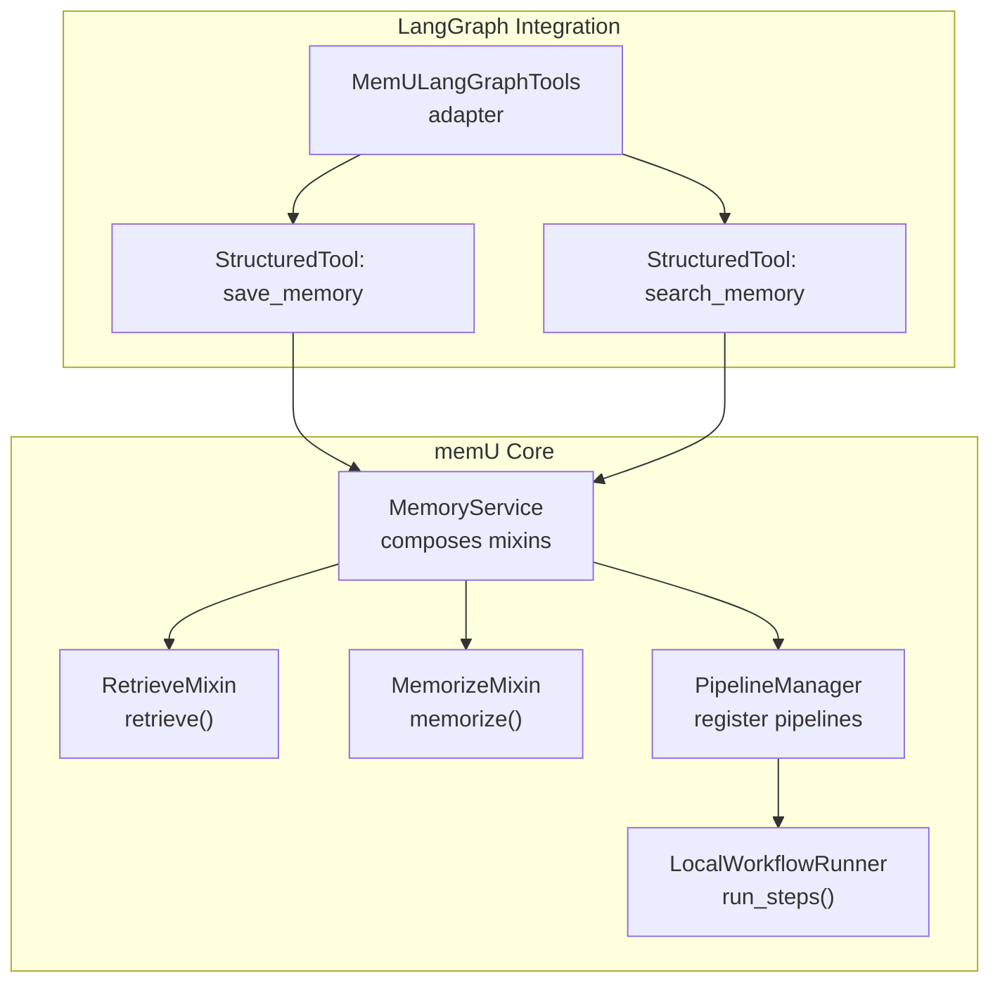
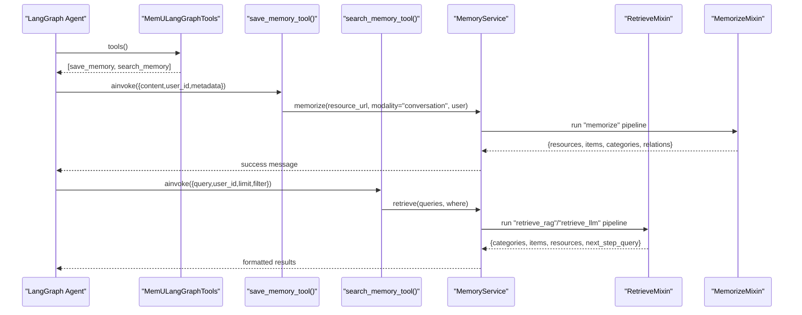
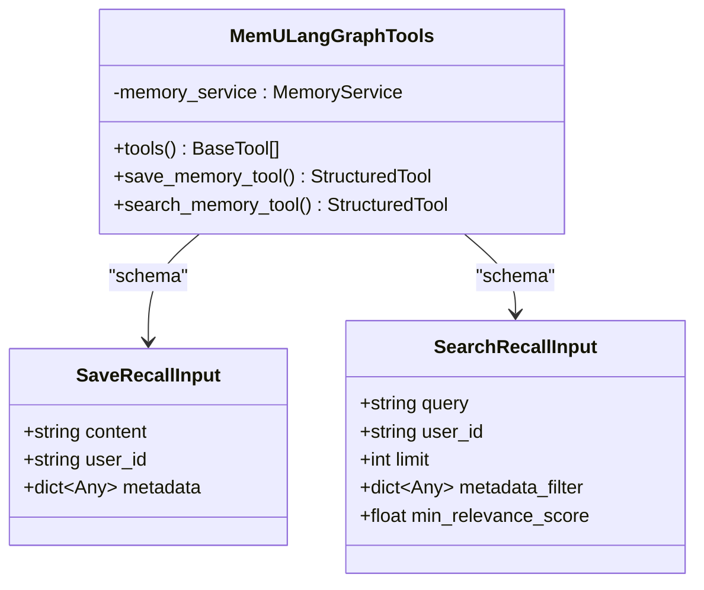
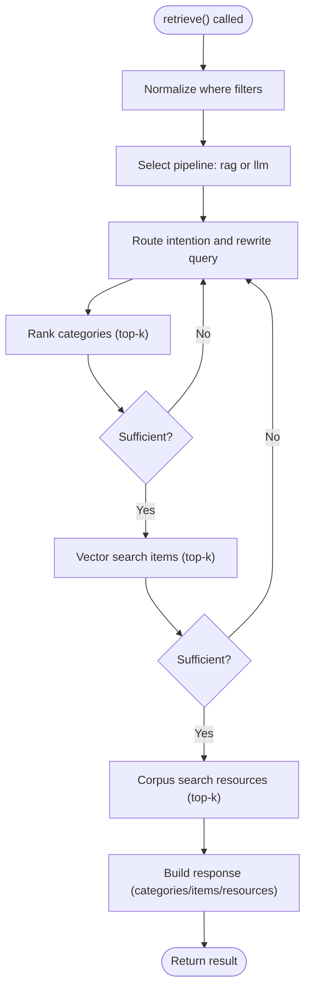
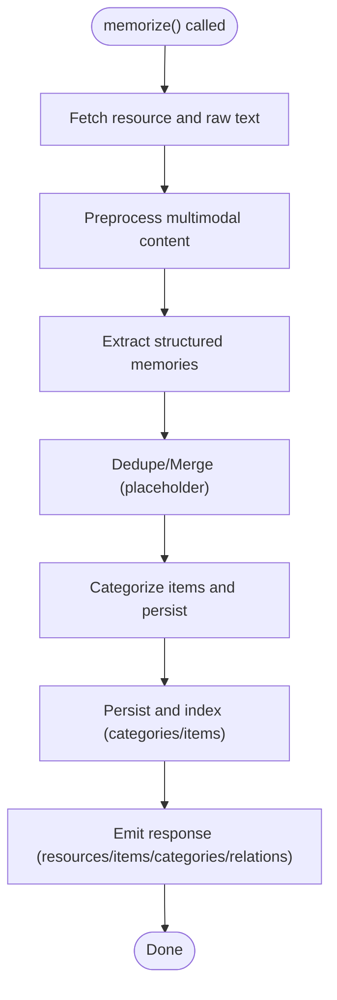
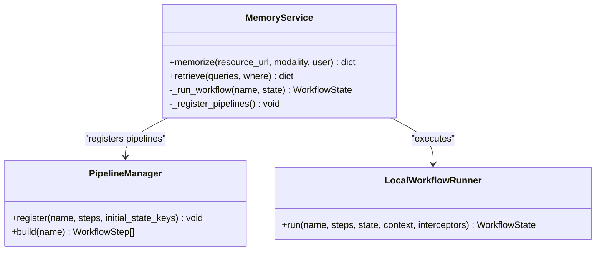
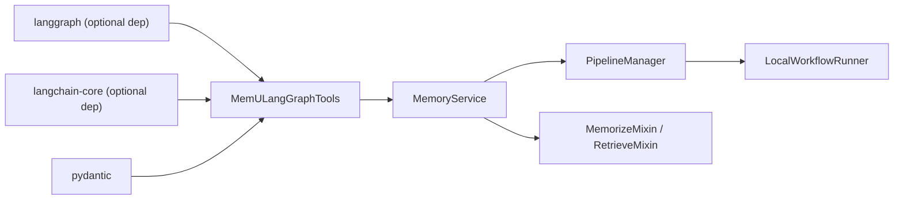

# LangGraph Integration

<cite>
**Referenced Files in This Document**
- [langgraph.py](file://src/memu/integrations/langgraph.py)
- [langgraph_integration.md](file://docs/langgraph_integration.md)
- [service.py](file://src/memu/app/service.py)
- [retrieve.py](file://src/memu/app/retrieve.py)
- [memorize.py](file://src/memu/app/memorize.py)
- [langgraph_demo.py](file://examples/langgraph_demo.py)
- [test_langgraph.py](file://tests/integrations/test_langgraph.py)
- [pipeline.py](file://src/memu/workflow/pipeline.py)
- [runner.py](file://src/memu/workflow/runner.py)
- [step.py](file://src/memu/workflow/step.py)
- [settings.py](file://src/memu/app/settings.py)
</cite>

## Table of Contents
1. [Introduction](#introduction)
2. [Project Structure](#project-structure)
3. [Core Components](#core-components)
4. [Architecture Overview](#architecture-overview)
5. [Detailed Component Analysis](#detailed-component-analysis)
6. [Dependency Analysis](#dependency-analysis)
7. [Performance Considerations](#performance-considerations)
8. [Troubleshooting Guide](#troubleshooting-guide)
9. [Conclusion](#conclusion)
10. [Appendices](#appendices)

## Introduction
This document explains how to integrate memU’s MemoryService with LangGraph workflows and agents. It focuses on adapter patterns that bridge memU’s retrieval and memorizing APIs to LangGraph’s tooling and state management. You will learn how to:
- Build memory-aware graphs that persist and recall information
- Manage conversational context across graph executions
- Inject memory automatically into graph nodes
- Handle memory state transitions and scope filtering
- Optimize performance and manage errors in memory-heavy workflows
- Migrate existing LangGraph workflows and maintain compatibility across versions

## Project Structure
The integration centers around a small adapter that exposes memU’s MemoryService as LangChain/LangGraph tools. Behind the scenes, memU orchestrates retrieval and memorization through configurable workflows and a runner.

**Diagram sources**
- [langgraph.py](file://src/memu/integrations/langgraph.py#L53-L164)
- [service.py](file://src/memu/app/service.py#L49-L427)
- [retrieve.py](file://src/memu/app/retrieve.py#L42-L85)
- [memorize.py](file://src/memu/app/memorize.py#L65-L95)
- [pipeline.py](file://src/memu/workflow/pipeline.py#L21-L46)
- [runner.py](file://src/memu/workflow/runner.py#L28-L39)

**Section sources**
- [langgraph.py](file://src/memu/integrations/langgraph.py#L1-L164)
- [langgraph_integration.md](file://docs/langgraph_integration.md#L1-L98)

## Core Components
- MemULangGraphTools: Adapter exposing save_memory and search_memory as LangChain StructuredTools. It wraps a MemoryService instance and translates LangGraph/LangChain tool invocations into memU operations.
- MemoryService: Orchestrates memory workflows. It composes MemorizeMixin and RetrieveMixin and runs them through a PipelineManager and WorkflowRunner.
- RetrieveMixin: Implements retrieval with configurable strategies (RAG vs LLM), intent routing, sufficiency checks, and multi-stage recall across categories, items, and resources.
- MemorizeMixin: Implements ingestion, multimodal preprocessing, extraction, categorization, persistence, and indexing of new memories.
- PipelineManager and LocalWorkflowRunner: Provide the execution engine for memU workflows, enabling step-wise state transitions and capability-based routing.

Key integration points:
- Tool invocation maps to MemoryService.memorize and MemoryService.retrieve
- MemoryService.normalize and filter inputs by user scope before retrieval
- Workflows are built dynamically and executed synchronously by default

**Section sources**
- [langgraph.py](file://src/memu/integrations/langgraph.py#L53-L164)
- [service.py](file://src/memu/app/service.py#L49-L427)
- [retrieve.py](file://src/memu/app/retrieve.py#L42-L85)
- [memorize.py](file://src/memu/app/memorize.py#L65-L95)
- [pipeline.py](file://src/memu/workflow/pipeline.py#L21-L46)
- [runner.py](file://src/memu/workflow/runner.py#L28-L39)

## Architecture Overview
The adapter pattern cleanly separates LangGraph tool semantics from memU internals. Tools are typed and async-compatible, while memU handles complex retrieval and memorization workflows under the hood.

**Diagram sources**
- [langgraph.py](file://src/memu/integrations/langgraph.py#L105-L163)
- [service.py](file://src/memu/app/service.py#L350-L361)
- [retrieve.py](file://src/memu/app/retrieve.py#L42-L85)
- [memorize.py](file://src/memu/app/memorize.py#L65-L95)

## Detailed Component Analysis

### Adapter: MemULangGraphTools
Responsibilities:
- Expose save_memory and search_memory as LangChain StructuredTools
- Translate tool inputs to memU operations
- Handle async execution, temporary file creation for text inputs, and cleanup
- Wrap exceptions into a domain-specific error type for predictable tool behavior

Important behaviors:
- save_memory_tool writes content to a temporary file and calls MemoryService.memorize with user scope
- search_memory_tool builds a query list and applies where filters (e.g., user_id) before delegating to MemoryService.retrieve
- Results are aggregated into a human-readable response with scores and summaries

**Diagram sources**
- [langgraph.py](file://src/memu/integrations/langgraph.py#L53-L164)

**Section sources**
- [langgraph.py](file://src/memu/integrations/langgraph.py#L53-L164)

### Retrieval Workflow: RetrieveMixin
Retrieval supports two strategies:
- RAG: Embeddings-driven vector search across categories/items/resources with sufficiency checks
- LLM: Intent routing and ranking delegated to LLMs

Key stages:
- Route intention: decide if retrieval is needed and rewrite the query
- Category recall: rank categories by summary embeddings
- Sufficiency checks: evaluate if more tiers are needed
- Item recall: vector search over items with salience-aware ranking
- Resource recall: corpus-based retrieval over resources
- Build context: assemble final response with materials and next-step suggestions

**Diagram sources**
- [retrieve.py](file://src/memu/app/retrieve.py#L42-L85)
- [retrieve.py](file://src/memu/app/retrieve.py#L106-L210)
- [retrieve.py](file://src/memu/app/retrieve.py#L454-L536)

**Section sources**
- [retrieve.py](file://src/memu/app/retrieve.py#L42-L85)
- [retrieve.py](file://src/memu/app/retrieve.py#L106-L210)
- [retrieve.py](file://src/memu/app/retrieve.py#L454-L536)

### Memorization Workflow: MemorizeMixin
Memorization is a multi-stage pipeline:
- Ingest resource and preprocess (multimodal-aware)
- Extract structured memories per memory type
- Dedupe and merge (placeholder)
- Categorize items and link to categories
- Persist and index (including category summaries and item references)
- Emit final response with created resources, items, categories, and relations

**Diagram sources**
- [memorize.py](file://src/memu/app/memorize.py#L65-L95)
- [memorize.py](file://src/memu/app/memorize.py#L97-L166)

**Section sources**
- [memorize.py](file://src/memu/app/memorize.py#L65-L95)
- [memorize.py](file://src/memu/app/memorize.py#L97-L166)

### MemoryService Orchestration
MemoryService composes mixins and registers pipelines for memorize, retrieve_rag, retrieve_llm, and CRUD operations. It resolves a workflow runner and executes pipelines with step-wise state transitions.

**Diagram sources**
- [service.py](file://src/memu/app/service.py#L49-L427)
- [pipeline.py](file://src/memu/workflow/pipeline.py#L21-L46)
- [runner.py](file://src/memu/workflow/runner.py#L28-L39)

**Section sources**
- [service.py](file://src/memu/app/service.py#L315-L348)
- [service.py](file://src/memu/app/service.py#L350-L361)
- [pipeline.py](file://src/memu/workflow/pipeline.py#L21-L46)
- [runner.py](file://src/memu/workflow/runner.py#L28-L39)

### LangGraph Integration Patterns
- Tool-based memory: Use MemULangGraphTools to inject save_memory and search_memory into agents
- Stateless tool calls: Tools accept user_id and metadata to scope retrieval and memorization
- Automatic memory injection: Agents can call search_memory before reasoning to enrich context
- Graph nodes as adapters: Wrap tool calls inside graph nodes to orchestrate multi-step memory workflows

Practical example references:
- Quick start and API reference: [langgraph_integration.md](file://docs/langgraph_integration.md#L21-L91)
- Demo script invoking tools: [langgraph_demo.py](file://examples/langgraph_demo.py#L24-L76)
- Unit tests validating tool behavior: [test_langgraph.py](file://tests/integrations/test_langgraph.py#L30-L81)

**Section sources**
- [langgraph_integration.md](file://docs/langgraph_integration.md#L21-L91)
- [langgraph_demo.py](file://examples/langgraph_demo.py#L24-L76)
- [test_langgraph.py](file://tests/integrations/test_langgraph.py#L30-L81)

## Dependency Analysis
The adapter depends on LangChain Core for tooling and Pydantic for input schemas. memU’s internal workflows depend on:
- LLM clients for intent routing and ranking
- Vector clients for embeddings
- Database and repository abstractions for persistence
- Interceptors and runners for extensibility

**Diagram sources**
- [langgraph.py](file://src/memu/integrations/langgraph.py#L12-L22)
- [service.py](file://src/memu/app/service.py#L315-L348)
- [pipeline.py](file://src/memu/workflow/pipeline.py#L21-L46)
- [runner.py](file://src/memu/workflow/runner.py#L28-L39)

**Section sources**
- [langgraph.py](file://src/memu/integrations/langgraph.py#L12-L22)
- [service.py](file://src/memu/app/service.py#L315-L348)

## Performance Considerations
- Retrieval strategy selection:
  - RAG: Faster, embedding-based vector search; suitable for real-time suggestions
  - LLM: Deeper reasoning with intent prediction and query evolution; higher cost and latency
- Top-K tuning: Adjust per-stage top_k to balance recall quality and latency
- Embedding batching: Use appropriate batch sizes for embedding clients
- Scope filtering: Apply where filters early to reduce search space
- Asynchronous execution: Tools are async; ensure agent runtime can handle concurrency
- Temporary file I/O: save_memory writes to disk; consider memory-backed alternatives if needed

[No sources needed since this section provides general guidance]

## Troubleshooting Guide
Common issues and resolutions:
- Missing optional dependencies:
  - Install langgraph and langchain-core to use the adapter
  - See installation instructions and quick start in the integration guide
- Tool invocation failures:
  - Exceptions are caught and wrapped; inspect logged messages for details
  - Validate inputs against tool schemas (e.g., user_id presence)
- Retrieval scope errors:
  - Unknown filter fields raise validation errors; ensure where keys match user scope fields
- Workflow misconfiguration:
  - Steps require specific state keys; ensure prior steps produce required keys or initial_state_keys include them

**Section sources**
- [langgraph_integration.md](file://docs/langgraph_integration.md#L13-L20)
- [langgraph.py](file://src/memu/integrations/langgraph.py#L93-L101)
- [retrieve.py](file://src/memu/app/retrieve.py#L87-L104)
- [pipeline.py](file://src/memu/workflow/pipeline.py#L131-L164)

## Conclusion
The memU LangGraph integration provides a robust adapter to bring persistent, contextual memory into LangGraph agents. By leveraging MemULangGraphTools, you can:
- Persist and recall memories with typed tools
- Control memory scope via user_id and metadata filters
- Compose retrieval and memorization into multi-step graph workflows
- Benefit from configurable retrieval strategies and strong error handling

Adopt the patterns outlined here to build reliable, memory-aware agents that scale across single-user and multi-agent scenarios.

[No sources needed since this section summarizes without analyzing specific files]

## Appendices

### API Reference
- MemULangGraphTools(memory_service)
  - save_memory_tool(): StructuredTool
    - Inputs: content (str), user_id (str), metadata (dict, optional)
    - Description: Save a piece of information, conversation snippet, or memory for a user
  - search_memory_tool(): StructuredTool
    - Inputs: query (str), user_id (str), limit (int, default=5), metadata_filter (dict, optional), min_relevance_score (float, default=0.0)
    - Description: Search for relevant memories or information for a user based on a query

**Section sources**
- [langgraph.py](file://src/memu/integrations/langgraph.py#L73-L163)
- [langgraph_integration.md](file://docs/langgraph_integration.md#L72-L91)

### Migration and Compatibility Notes
- Dependencies:
  - Ensure langgraph and langchain-core are installed for tooling compatibility
- Version compatibility:
  - The adapter targets LangChain Core tool interfaces; align your LangGraph version accordingly
- Existing workflows:
  - Replace ad-hoc memory calls with save_memory/search_memory tools
  - Introduce where filters to scope memory operations by user_id and other fields
- Multi-agent considerations:
  - Use distinct user_id per agent or session
  - Consider metadata_filter to isolate agent-relevant memories

**Section sources**
- [langgraph_integration.md](file://docs/langgraph_integration.md#L13-L20)
- [retrieve.py](file://src/memu/app/retrieve.py#L87-L104)