# LazyLLM Compatibility

<cite>
**Referenced Files in This Document**
- [lazyllm_client.py](file://src/memu/llm/lazyllm_client.py)
- [service.py](file://src/memu/app/service.py)
- [settings.py](file://src/memu/app/settings.py)
- [wrapper.py](file://src/memu/llm/wrapper.py)
- [openai_wrapper.py](file://src/memu/client/openai_wrapper.py)
- [interfaces.py](file://src/memu/database/interfaces.py)
- [models.py](file://src/memu/database/models.py)
- [example_5_with_lazyllm_client.py](file://examples/example_5_with_lazyllm_client.py)
- [test_lazyllm.py](file://tests/test_lazyllm.py)
- [architecture.md](file://docs/architecture.md)
- [README.md](file://README.md)
</cite>

## Table of Contents
1. [Introduction](#introduction)
2. [Project Structure](#project-structure)
3. [Core Components](#core-components)
4. [Architecture Overview](#architecture-overview)
5. [Detailed Component Analysis](#detailed-component-analysis)
6. [Dependency Analysis](#dependency-analysis)
7. [Performance Considerations](#performance-considerations)
8. [Troubleshooting Guide](#troubleshooting-guide)
9. [Conclusion](#conclusion)
10. [Appendices](#appendices)

## Introduction
This document explains how memU integrates with LazyLLM to power agent workflows with memory-aware LLM capabilities. It covers the LazyLLM client wrapper, provider registration patterns, memory-aware agent construction, multi-provider routing, and memory persistence in distributed setups. It also details compatibility layers between memU’s retrieval API and LazyLLM’s provider interface, data transformation requirements, and state management considerations. Practical examples show how to integrate memU with LazyLLM’s agent framework, manage memory scope across agent interactions, and optimize performance for memory-heavy workflows.

## Project Structure
The integration centers on:
- A LazyLLM client wrapper that adapts memU’s LLM operations to LazyLLM’s OnlineModule interface
- A MemoryService that orchestrates memory ingestion, retrieval, and CRUD operations, with LLM client caching and interception
- Configuration models that define LLM profiles and LazyLLM source mappings
- Example scripts demonstrating end-to-end usage with LazyLLM backends

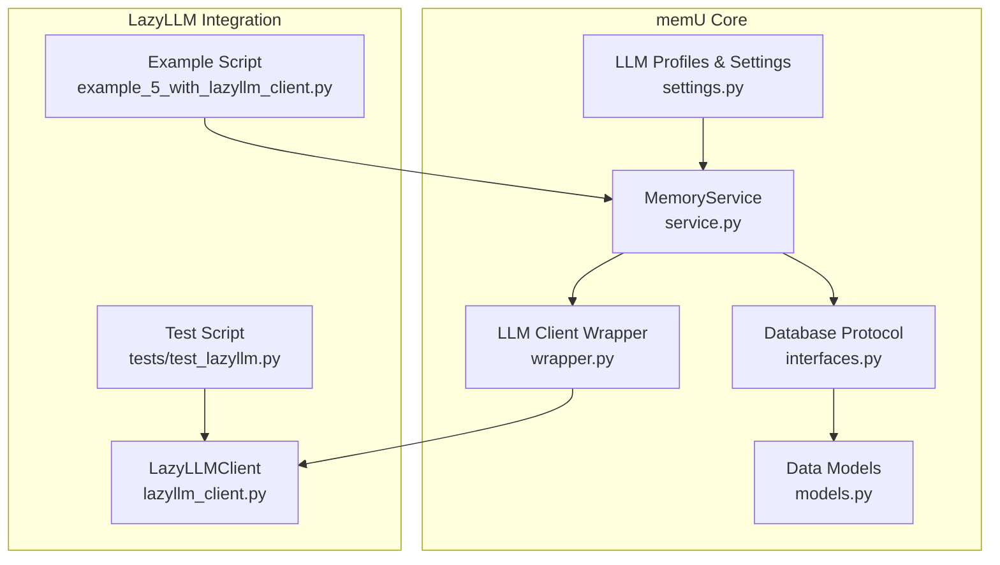

**Diagram sources**
- [service.py](file://src/memu/app/service.py#L49-L194)
- [settings.py](file://src/memu/app/settings.py#L92-L127)
- [wrapper.py](file://src/memu/llm/wrapper.py#L226-L484)
- [interfaces.py](file://src/memu/database/interfaces.py#L12-L26)
- [models.py](file://src/memu/database/models.py#L68-L106)
- [lazyllm_client.py](file://src/memu/llm/lazyllm_client.py#L9-L160)
- [example_5_with_lazyllm_client.py](file://examples/example_5_with_lazyllm_client.py#L220-L251)
- [test_lazyllm.py](file://tests/test_lazyllm.py#L21-L92)

**Section sources**
- [architecture.md](file://docs/architecture.md#L1-L170)
- [README.md](file://README.md#L1-L665)

## Core Components
- LazyLLMClient: Async client that creates LazyLLM OnlineModule instances for chat, summarize, vision, embed, and transcribe, and delegates calls via thread pools to avoid blocking the event loop.
- MemoryService: Orchestrates memory workflows, initializes LLM clients (including LazyLLM), wraps them with interceptors, and exposes llm_client property for agent workflows.
- LLMConfig and LazyLLMSource: Define provider selection and model mapping for LazyLLM backends.
- LLMClientWrapper: Adds interception hooks and usage metadata extraction around LLM calls.
- Example and test scripts: Demonstrate initialization, memory processing, and LLM operations with LazyLLM.

**Section sources**
- [lazyllm_client.py](file://src/memu/llm/lazyllm_client.py#L9-L160)
- [service.py](file://src/memu/app/service.py#L49-L194)
- [settings.py](file://src/memu/app/settings.py#L92-L127)
- [wrapper.py](file://src/memu/llm/wrapper.py#L226-L484)
- [example_5_with_lazyllm_client.py](file://examples/example_5_with_lazyllm_client.py#L220-L251)
- [test_lazyllm.py](file://tests/test_lazyllm.py#L21-L92)

## Architecture Overview
The LazyLLM integration fits into memU’s layered architecture:
- MemoryService composes typed configs, storage backends, and workflow pipelines
- LLM clients are lazily initialized and cached per profile
- LLMClientWrapper adds interception and usage telemetry around chat/summarize/vision/embed/transcribe
- LazyLLMClient maps memU’s LLM operations to LazyLLM OnlineModule invocations

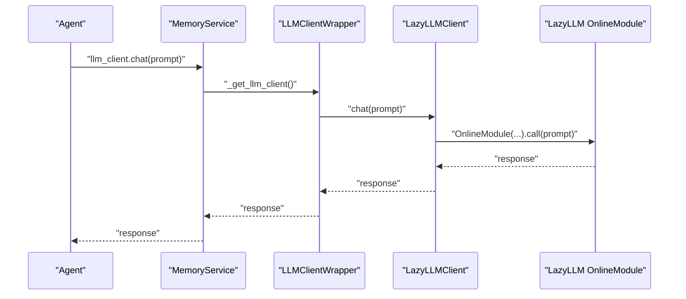

**Diagram sources**
- [service.py](file://src/memu/app/service.py#L187-L194)
- [wrapper.py](file://src/memu/llm/wrapper.py#L274-L306)
- [lazyllm_client.py](file://src/memu/llm/lazyllm_client.py#L44-L67)

**Section sources**
- [architecture.md](file://docs/architecture.md#L138-L157)
- [service.py](file://src/memu/app/service.py#L120-L132)

## Detailed Component Analysis

### LazyLLMClient
Responsibilities:
- Provide async chat, summarize, vision, embed, and transcribe methods
- Construct LazyLLM OnlineModule instances with configured sources and models
- Use asyncio.to_thread to run blocking calls safely

Key behaviors:
- chat/summarize: Build a prompt from system_prompt and text, then call OnlineModule
- vision: Pass prompt and image_path via lazyllm_files
- embed: Use batch_size for vector embedding calls
- transcribe: Call OnlineModule with audio_path

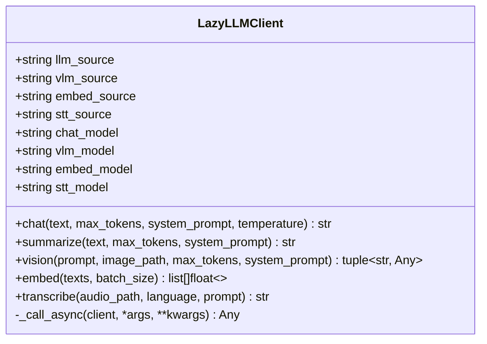

**Diagram sources**
- [lazyllm_client.py](file://src/memu/llm/lazyllm_client.py#L9-L160)

**Section sources**
- [lazyllm_client.py](file://src/memu/llm/lazyllm_client.py#L35-L42)
- [lazyllm_client.py](file://src/memu/llm/lazyllm_client.py#L44-L67)
- [lazyllm_client.py](file://src/memu/llm/lazyllm_client.py#L69-L91)
- [lazyllm_client.py](file://src/memu/llm/lazyllm_client.py#L93-L117)
- [lazyllm_client.py](file://src/memu/llm/lazyllm_client.py#L119-L138)
- [lazyllm_client.py](file://src/memu/llm/lazyllm_client.py#L140-L159)

### MemoryService and Provider Registration
Responsibilities:
- Initialize and cache LLM clients per profile
- Select LazyLLM backend via client_backend "lazyllm_backend"
- Build LazyLLMClient with LazyLLMSource mapping
- Expose llm_client property for agent workflows
- Support step-level profile routing for chat and embedding tasks

Integration highlights:
- _init_llm_client detects client_backend "lazyllm_backend" and instantiates LazyLLMClient
- _get_llm_base_client caches clients by profile name
- _get_llm_client wraps base client with LLMClientWrapper and metadata
- _get_step_llm_client and _get_step_embedding_client select profiles from step_context

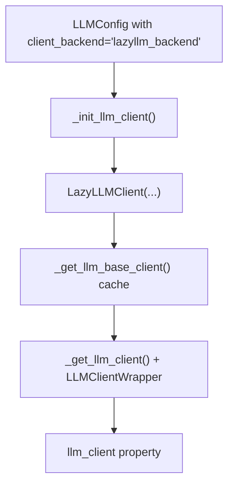

**Diagram sources**
- [service.py](file://src/memu/app/service.py#L97-L132)
- [service.py](file://src/memu/app/service.py#L137-L151)
- [service.py](file://src/memu/app/service.py#L187-L194)

**Section sources**
- [service.py](file://src/memu/app/service.py#L97-L132)
- [service.py](file://src/memu/app/service.py#L137-L151)
- [service.py](file://src/memu/app/service.py#L187-L194)
- [settings.py](file://src/memu/app/settings.py#L92-L127)

### LLMClientWrapper and Interceptors
Responsibilities:
- Wrap any LLM client to add before/after/on_error interceptors
- Build LLMCallContext with profile, trace_id, operation, step_id, provider, model, tags
- Extract usage metrics from raw provider responses
- Support async calls and handle tuple responses (pure, raw)

Key behaviors:
- chat/summarize/vision/embed/transcribe methods delegate to underlying client
- _invoke coordinates interceptor lifecycle and usage extraction
- Response builders construct LLMResponseView for telemetry

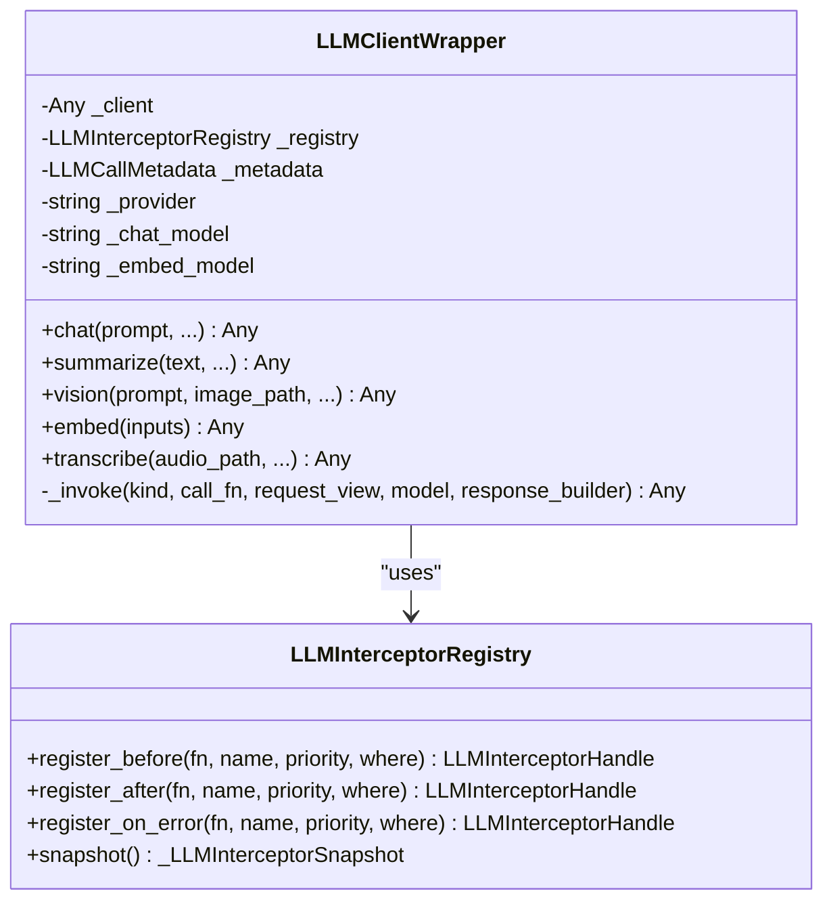

**Diagram sources**
- [wrapper.py](file://src/memu/llm/wrapper.py#L226-L484)
- [wrapper.py](file://src/memu/llm/wrapper.py#L128-L224)

**Section sources**
- [wrapper.py](file://src/memu/llm/wrapper.py#L226-L484)
- [wrapper.py](file://src/memu/llm/wrapper.py#L387-L436)

### MemoryAware Agent Construction and Examples
Examples demonstrate:
- Creating MemoryService with llm_profiles specifying "lazyllm_backend" and LazyLLMSource
- Using service.llm_client.chat for summarization and guidance generation
- Running multi-part workflows: conversation memory, skill extraction, multimodal processing

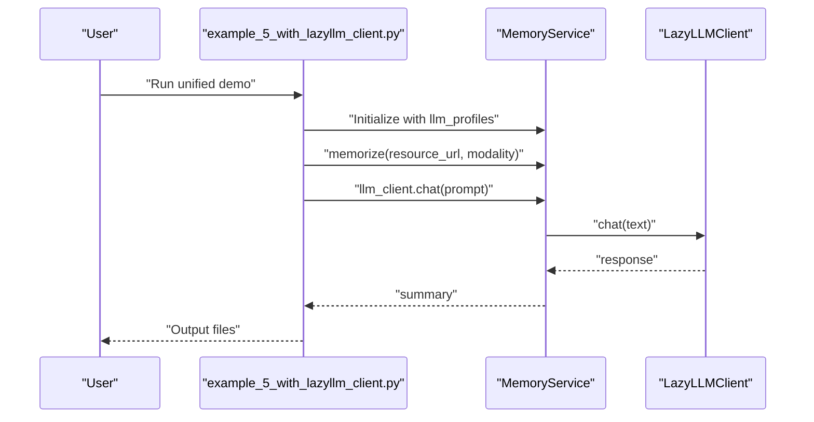

**Diagram sources**
- [example_5_with_lazyllm_client.py](file://examples/example_5_with_lazyllm_client.py#L220-L251)
- [example_5_with_lazyllm_client.py](file://examples/example_5_with_lazyllm_client.py#L203-L213)
- [service.py](file://src/memu/app/service.py#L191-L194)

**Section sources**
- [example_5_with_lazyllm_client.py](file://examples/example_5_with_lazyllm_client.py#L220-L251)
- [example_5_with_lazyllm_client.py](file://examples/example_5_with_lazyllm_client.py#L203-L213)

### Compatibility Layers and Data Transformation
Compatibility between memU and LazyLLM:
- Provider interface: LazyLLMClient implements chat, summarize, vision, embed, transcribe methods mirroring memU’s LLMClientWrapper expectations
- Data transformation: memU expects text inputs for embed; LazyLLM OnlineModule embed accepts lists of strings
- State management: LLMClientWrapper builds LLMCallContext with profile, trace_id, operation, step_id, provider, model, tags for observability and routing

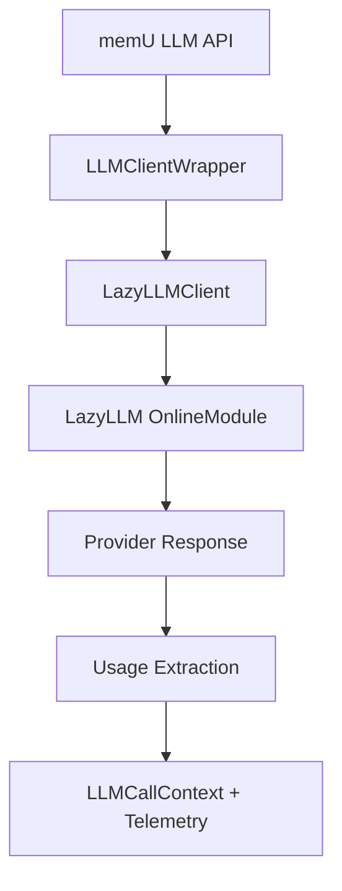

**Diagram sources**
- [wrapper.py](file://src/memu/llm/wrapper.py#L387-L436)
- [lazyllm_client.py](file://src/memu/llm/lazyllm_client.py#L119-L138)

**Section sources**
- [wrapper.py](file://src/memu/llm/wrapper.py#L387-L436)
- [lazyllm_client.py](file://src/memu/llm/lazyllm_client.py#L119-L138)

### Multi-Provider Routing and Fallback Mechanisms
- Profile-based routing: MemoryService selects profiles from step_context (chat_llm_profile, embed_llm_profile, llm_profile)
- Provider selection: LLMConfig.provider controls HTTP client behavior; LazyLLM backend is selected via client_backend
- Fallback: LazyLLMClient uses configured sources and models; if a source/model is missing, defaults apply

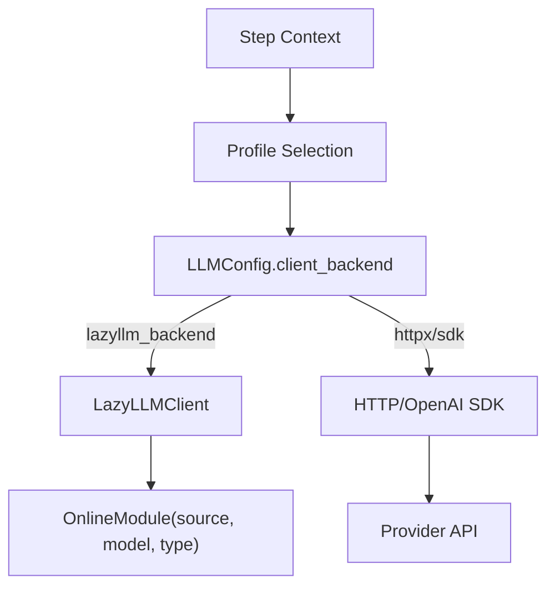

**Diagram sources**
- [service.py](file://src/memu/app/service.py#L202-L226)
- [settings.py](file://src/memu/app/settings.py#L102-L127)
- [service.py](file://src/memu/app/service.py#L120-L132)

**Section sources**
- [service.py](file://src/memu/app/service.py#L202-L226)
- [settings.py](file://src/memu/app/settings.py#L102-L127)
- [service.py](file://src/memu/app/service.py#L120-L132)

### Memory Scope Across Agent Interactions
- User scoping: MemoryService uses UserConfig.model to merge scope fields into records; filters in retrieve() validate against user_model fields
- Multi-agent and multi-session: OpenAI wrapper supports user_data with user_id, agent_id, session_id for selective memory retrieval
- Distributed setups: Database backends (inmemory, sqlite, postgres) persist memory state; LazyLLMClient remains stateless

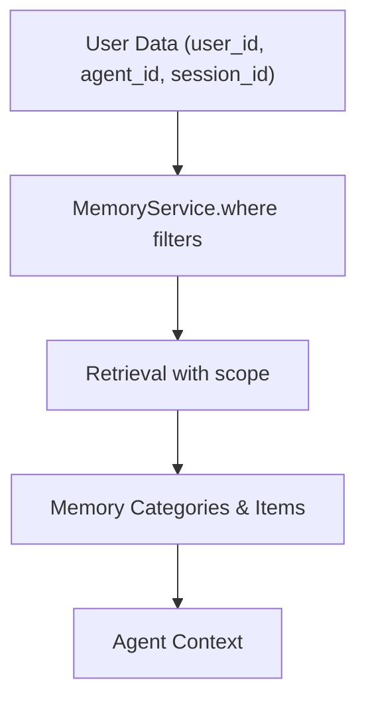

**Diagram sources**
- [models.py](file://src/memu/database/models.py#L108-L134)
- [openai_wrapper.py](file://src/memu/client/openai_wrapper.py#L217-L268)

**Section sources**
- [models.py](file://src/memu/database/models.py#L108-L134)
- [openai_wrapper.py](file://src/memu/client/openai_wrapper.py#L217-L268)

### Memory Persistence in Distributed Setups
- Storage backends: inmemory, sqlite, postgres with optional pgvector
- Startup behavior: build_database selects backend; Postgres migrates and ensures vector extension
- Lazy indexing: categories are initialized lazily with embeddings and mapped by normalized names

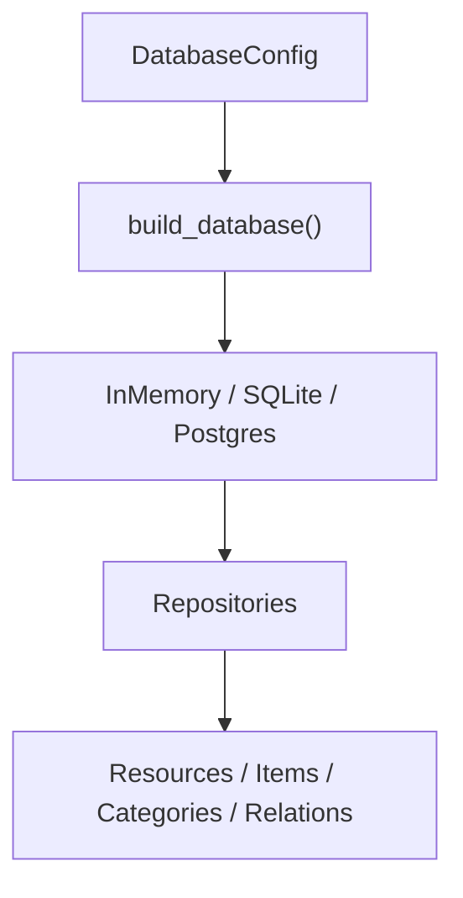

**Diagram sources**
- [architecture.md](file://docs/architecture.md#L122-L136)
- [interfaces.py](file://src/memu/database/interfaces.py#L12-L26)
- [models.py](file://src/memu/database/models.py#L68-L106)

**Section sources**
- [architecture.md](file://docs/architecture.md#L122-L136)
- [interfaces.py](file://src/memu/database/interfaces.py#L12-L26)
- [models.py](file://src/memu/database/models.py#L68-L106)

## Dependency Analysis
- MemoryService depends on LLM profiles, database factory, and workflow runner
- LazyLLMClient depends on LazyLLM OnlineModule and uses asyncio.to_thread for safe execution
- LLMClientWrapper depends on interceptor registry and metadata to instrument calls
- Example and test scripts depend on MemoryService and LazyLLMClient

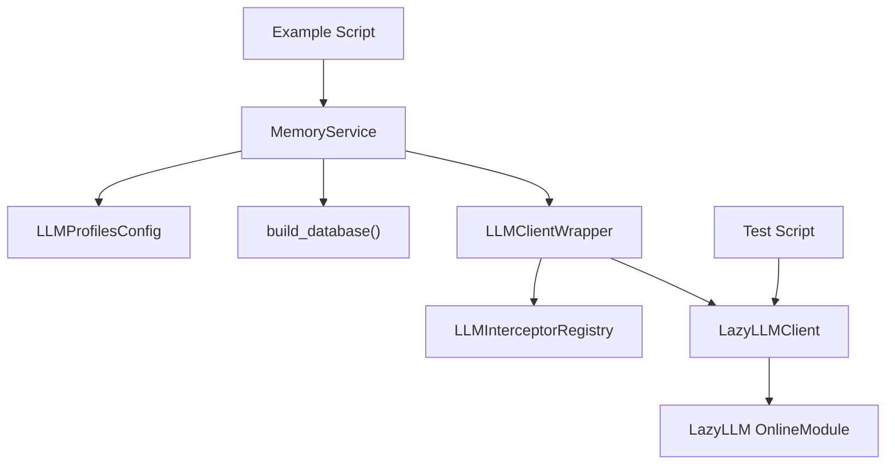

**Diagram sources**
- [service.py](file://src/memu/app/service.py#L49-L96)
- [wrapper.py](file://src/memu/llm/wrapper.py#L226-L243)
- [lazyllm_client.py](file://src/memu/llm/lazyllm_client.py#L9-L160)
- [example_5_with_lazyllm_client.py](file://examples/example_5_with_lazyllm_client.py#L220-L251)
- [test_lazyllm.py](file://tests/test_lazyllm.py#L21-L92)

**Section sources**
- [service.py](file://src/memu/app/service.py#L49-L96)
- [wrapper.py](file://src/memu/llm/wrapper.py#L226-L243)
- [lazyllm_client.py](file://src/memu/llm/lazyllm_client.py#L9-L160)

## Performance Considerations
- Asynchronous execution: LazyLLMClient uses asyncio.to_thread to prevent blocking the event loop during provider calls
- Embedding batching: embed() accepts batch_size to reduce overhead for vectorization
- Interceptor overhead: LLMClientWrapper adds minimal overhead; keep interceptors efficient and selective
- Memory-heavy workflows: Prefer RAG retrieval for fast proactive context; reserve LLM-based retrieval for deep reasoning
- Distributed persistence: Use Postgres with pgvector for scalable vector search; fall back to brute-force for portability

[No sources needed since this section provides general guidance]

## Troubleshooting Guide
Common issues and strategies:
- Initialization failures: Verify llm_profiles include client_backend "lazyllm_backend" and LazyLLMSource fields
- Missing API keys: Ensure environment variables for LazyLLM sources are configured
- Embedding dimension mismatches: Confirm embed_model alignment with provider expectations
- Interceptor errors: Use strict mode carefully; disable strict or fix interceptor logic
- Retrieval scope errors: Ensure where filters match user_model fields; validate user_data presence

**Section sources**
- [test_lazyllm.py](file://tests/test_lazyllm.py#L21-L92)
- [service.py](file://src/memu/app/service.py#L120-L132)
- [wrapper.py](file://src/memu/llm/wrapper.py#L760-L773)

## Conclusion
memU’s LazyLLM integration provides a robust, extensible bridge between memU’s memory-centric APIs and LazyLLM’s provider ecosystem. By leveraging MemoryService’s profile-based routing, LLMClientWrapper’s interception, and LazyLLMClient’s OnlineModule abstraction, developers can build memory-aware agents that scale across single and distributed deployments. The compatibility layers, data transformations, and state management patterns outlined here enable seamless multi-provider configurations and optimized memory-heavy workflows.

[No sources needed since this section summarizes without analyzing specific files]

## Appendices

### Best Practices for Memory Scope Management
- Use user_data with user_id, agent_id, session_id to scope retrieval and persistence
- Keep scope fields disjoint from core models to avoid conflicts
- Validate where filters against user_model fields before querying

**Section sources**
- [models.py](file://src/memu/database/models.py#L108-L134)
- [openai_wrapper.py](file://src/memu/client/openai_wrapper.py#L217-L268)

### Error Handling Strategies for Memory Operations
- Wrap LLM calls with try/except; use interceptors for on_error handling
- Extract usage from raw responses for observability; handle missing fields gracefully
- Fail fast on invalid profiles; log and recover for transient provider errors

**Section sources**
- [wrapper.py](file://src/memu/llm/wrapper.py#L387-L436)
- [wrapper.py](file://src/memu/llm/wrapper.py#L486-L504)

### Debugging Techniques for Memory-Related Issues
- Enable logging for LazyLLMClient and LLMClientWrapper
- Inspect LLMCallContext and usage telemetry for anomalies
- Validate database backend connectivity and migrations

**Section sources**
- [lazyllm_client.py](file://src/memu/llm/lazyllm_client.py#L62-L67)
- [wrapper.py](file://src/memu/llm/wrapper.py#L437-L448)
- [architecture.md](file://docs/architecture.md#L122-L136)