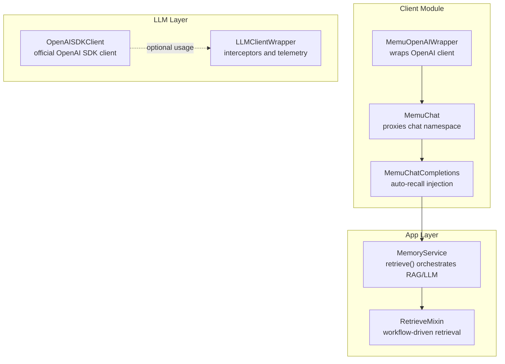
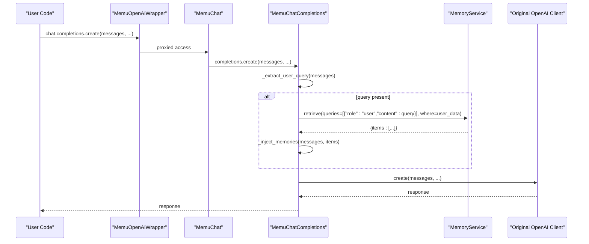
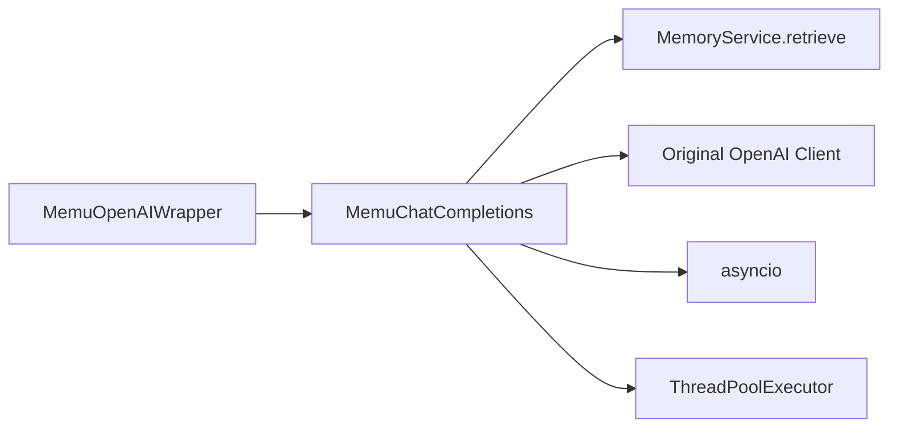

# OpenAI Client Wrapper

<cite>
**Referenced Files in This Document**
- [openai_wrapper.py](file://src/memu/client/openai_wrapper.py)
- [service.py](file://src/memu/app/service.py)
- [retrieve.py](file://src/memu/app/retrieve.py)
- [openai_sdk.py](file://src/memu/llm/openai_sdk.py)
- [wrapper.py](file://src/memu/llm/wrapper.py)
- [test_client_wrapper.py](file://tests/test_client_wrapper.py)
- [example_3_multimodal_memory.py](file://examples/example_3_multimodal_memory.py)
</cite>

## Table of Contents
1. [Introduction](#introduction)
2. [Project Structure](#project-structure)
3. [Core Components](#core-components)
4. [Architecture Overview](#architecture-overview)
5. [Detailed Component Analysis](#detailed-component-analysis)
6. [Dependency Analysis](#dependency-analysis)
7. [Performance Considerations](#performance-considerations)
8. [Troubleshooting Guide](#troubleshooting-guide)
9. [Conclusion](#conclusion)
10. [Appendices](#appendices)

## Introduction
This document explains the OpenAI client wrapper that enables automatic memory injection into OpenAI chat completions. It focuses on the MemuOpenAIWrapper class and its components MemuChat and MemuChatCompletions, detailing how the wrapper extracts user queries, retrieves relevant memories via the MemoryService, and injects them into the system message before invoking the underlying OpenAI client. It covers synchronous and asynchronous execution patterns, event loop handling, thread safety, memory injection format, system message modification, context preservation, multimodal integration, batch processing considerations, error handling, troubleshooting, and compatibility notes.

## Project Structure
The wrapper resides in the client module and integrates with the MemoryService for retrieval. The LLM wrapper and OpenAI SDK client are provided for broader LLM orchestration and SDK usage respectively.

**Diagram sources**
- [openai_wrapper.py](file://src/memu/client/openai_wrapper.py#L155-L214)
- [service.py](file://src/memu/app/service.py#L49-L86)
- [retrieve.py](file://src/memu/app/retrieve.py#L42-L85)
- [openai_sdk.py](file://src/memu/llm/openai_sdk.py#L20-L37)
- [wrapper.py](file://src/memu/llm/wrapper.py#L226-L245)

**Section sources**
- [openai_wrapper.py](file://src/memu/client/openai_wrapper.py#L1-L269)
- [service.py](file://src/memu/app/service.py#L49-L194)
- [openai_sdk.py](file://src/memu/llm/openai_sdk.py#L20-L37)
- [wrapper.py](file://src/memu/llm/wrapper.py#L226-L245)

## Core Components
- MemuOpenAIWrapper: Top-level wrapper that proxies non-chat attributes to the original client and exposes a wrapped chat namespace.
- MemuChat: Wraps the OpenAI chat namespace and delegates completions to MemuChatCompletions.
- MemuChatCompletions: Implements auto-recall by extracting the latest user query, retrieving memories via MemoryService, and injecting them into the system message before calling the original completions.create or acreate.

Key configuration:
- user_data: User scope filters passed to MemoryService.retrieve (e.g., user_id, agent_id, session_id).
- ranking: Retrieval ranking strategy ("similarity" or "salience").
- top_k: Number of memories to retrieve.

Behavior:
- Extraction: The latest user message’s text is extracted from messages.
- Retrieval: MemoryService.retrieve is invoked asynchronously; failures are handled gracefully.
- Injection: Memories are formatted and appended to the system message or inserted as a new system message.
- Execution: Original create/acreate is called with the augmented messages.

**Section sources**
- [openai_wrapper.py](file://src/memu/client/openai_wrapper.py#L17-L127)
- [openai_wrapper.py](file://src/memu/client/openai_wrapper.py#L155-L214)
- [openai_wrapper.py](file://src/memu/client/openai_wrapper.py#L217-L268)

## Architecture Overview
The wrapper sits between the user’s OpenAI client and the underlying OpenAI SDK. On each chat.completions call, it:
1. Extracts the user query from messages.
2. Retrieves relevant memories using MemoryService.retrieve.
3. Injects the memories into the system message.
4. Invokes the original OpenAI client method.

**Diagram sources**
- [openai_wrapper.py](file://src/memu/client/openai_wrapper.py#L85-L108)
- [openai_wrapper.py](file://src/memu/client/openai_wrapper.py#L73-L83)
- [service.py](file://src/memu/app/service.py#L42-L85)

## Detailed Component Analysis

### MemuOpenAIWrapper
Responsibilities:
- Proxies non-chat attributes to the original client.
- Exposes a wrapped chat namespace configured with user_data, ranking, and top_k.

Initialization:
- Stores the original client, MemoryService, user_data, ranking, and top_k.
- Instantiates MemuChat with the same parameters.

Usage:
- After wrapping, call wrapped.chat.completions.create(...) as usual; the wrapper injects memories automatically.

Thread safety:
- The wrapper itself is stateless aside from the original client reference; thread safety is inherited from the underlying OpenAI client.

**Section sources**
- [openai_wrapper.py](file://src/memu/client/openai_wrapper.py#L155-L214)

### MemuChat
Responsibilities:
- Proxies non-chat attributes to the original chat namespace.
- Provides a wrapped completions object (MemuChatCompletions) configured with user_data, ranking, and top_k.

**Section sources**
- [openai_wrapper.py](file://src/memu/client/openai_wrapper.py#L130-L153)

### MemuChatCompletions
Responsibilities:
- Extracts the latest user query from messages.
- Retrieves memories via MemoryService.retrieve.
- Injects memories into the system message.
- Calls the original completions.create or acreate.

Key methods:
- _extract_user_query(messages): Extracts the most recent user message content. Handles plain text and multimodal content lists (e.g., vision models).
- _inject_memories(messages, memories): Formats memories and injects them into the system message or creates one if absent.
- _retrieve_memories(query): Calls MemoryService.retrieve and handles exceptions by returning an empty list.
- create(**kwargs): Synchronous wrapper that runs retrieval in the current event loop context using a thread pool if needed.
- acreate(**kwargs): Asynchronous wrapper that awaits retrieval and then calls the original acreate or falls back to create.

Event loop handling:
- If an event loop is running, retrieval is executed in a ThreadPoolExecutor to avoid blocking the loop.
- If no loop is running, retrieval is awaited synchronously.
- If no loop exists, asyncio.run is used to execute the coroutine.

Memory injection format:
- Memories are formatted as a bullet list under a special tag block.
- The system message is either appended to or created with the injected context.

System message modification:
- If a system message exists, the injected context is appended.
- Otherwise, a new system message is inserted at the beginning.

Context preservation:
- Messages are cloned before modification to avoid mutating the caller’s list.
- Only the system message is modified; other roles remain unchanged.

**Section sources**
- [openai_wrapper.py](file://src/memu/client/openai_wrapper.py#L17-L127)

### MemoryService.retrieve Integration
The wrapper delegates memory retrieval to MemoryService.retrieve, which orchestrates a workflow (RAG or LLM-based) depending on configuration. The wrapper passes:
- queries: A single-element list containing the latest user query.
- where: The user scope filters (user_data).

The retrieval result is expected to contain items that the wrapper injects into the system message.

**Section sources**
- [openai_wrapper.py](file://src/memu/client/openai_wrapper.py#L73-L83)
- [service.py](file://src/memu/app/service.py#L42-L85)
- [retrieve.py](file://src/memu/app/retrieve.py#L42-L85)

### Synchronous and Asynchronous Patterns
- Synchronous create: Attempts to get the current event loop. If running, executes retrieval in a thread pool; otherwise runs until completion or falls back to asyncio.run.
- Asynchronous acreate: Awaits retrieval and then calls the original acreate if available, otherwise falls back to create.

Thread safety considerations:
- The wrapper avoids sharing mutable state across threads.
- Retrieval is performed in a controlled manner using a thread pool when needed.

**Section sources**
- [openai_wrapper.py](file://src/memu/client/openai_wrapper.py#L85-L123)

### Multimodal Content and Vision-Language Models
The wrapper supports multimodal content by extracting text from the most recent user message, even when content is a list (e.g., text and image parts). This enables memory injection for vision-language models.

Integration example:
- The example demonstrates multimodal processing with images and documents, which can be combined with the wrapper to enrich LLM prompts with contextual memories.

**Section sources**
- [openai_wrapper.py](file://src/memu/client/openai_wrapper.py#L34-L46)
- [example_3_multimodal_memory.py](file://examples/example_3_multimodal_memory.py#L58-L134)

### Batch Processing Considerations
- The wrapper operates per-request, retrieving memories for the latest user query.
- Batch processing of multiple requests should reuse the same wrapper instance; each call performs independent retrieval.
- Embedding and retrieval are handled by MemoryService.retrieve, which manages vector search and ranking internally.

**Section sources**
- [openai_wrapper.py](file://src/memu/client/openai_wrapper.py#L85-L123)
- [service.py](file://src/memu/app/service.py#L42-L85)

### Error Handling for Memory Retrieval Failures
- Retrieval failures are caught and logged; the wrapper continues with the original call without memories.
- This ensures robustness: the LLM call is not interrupted by memory retrieval errors.

**Section sources**
- [openai_wrapper.py](file://src/memu/client/openai_wrapper.py#L73-L83)

### Configuration and Customization
- Ranking strategy: "similarity" or "salience".
- top_k: Number of memories to retrieve.
- User scope: user_id, agent_id, session_id, and any other fields supported by the user model.

Convenience function:
- wrap_openai(client, service, user_data=None, user_id=None, agent_id=None, session_id=None, ranking="salience", top_k=5) returns a wrapped client.

**Section sources**
- [openai_wrapper.py](file://src/memu/client/openai_wrapper.py#L179-L210)
- [openai_wrapper.py](file://src/memu/client/openai_wrapper.py#L217-L268)

## Dependency Analysis
The wrapper depends on:
- MemoryService.retrieve for memory retrieval.
- The original OpenAI client for chat.completions.create/acreate.
- asyncio and concurrent.futures for event loop handling and thread pool execution.

**Diagram sources**
- [openai_wrapper.py](file://src/memu/client/openai_wrapper.py#L85-L123)
- [service.py](file://src/memu/app/service.py#L42-L85)

**Section sources**
- [openai_wrapper.py](file://src/memu/client/openai_wrapper.py#L85-L123)
- [service.py](file://src/memu/app/service.py#L42-L85)

## Performance Considerations
- Retrieval latency: Retrieval adds network and computation overhead; tune top_k and ranking to balance relevance and speed.
- Event loop contention: Using a thread pool prevents blocking the event loop during retrieval.
- Memory injection cost: Formatting and injecting memories is lightweight compared to retrieval.
- Embedding costs: Retrieval uses embeddings; consider batching and caching where applicable.

[No sources needed since this section provides general guidance]

## Troubleshooting Guide
Common issues and resolutions:
- Memory injection conflicts:
  - Ensure the system message is not excessively long; consider summarizing or truncating context.
  - Verify that the wrapper is not inadvertently duplicating context if a system message already exists.
- Unexpected empty memories:
  - Confirm user_data filters match stored memory scopes.
  - Check that MemoryService.retrieve returns items for the given query.
- Event loop errors:
  - If encountering runtime errors when no loop exists, the wrapper falls back to asyncio.run; ensure the environment supports it.
- Multimodal content:
  - For vision-language models, ensure the user message contains text parts; the wrapper extracts text from multimodal content lists.

Validation and tests:
- Tests cover query extraction, memory injection into existing system messages, creation of system messages, and attribute proxying.

**Section sources**
- [test_client_wrapper.py](file://tests/test_client_wrapper.py#L13-L131)
- [openai_wrapper.py](file://src/memu/client/openai_wrapper.py#L34-L71)

## Conclusion
The OpenAI client wrapper provides seamless, opt-in memory injection for OpenAI chat completions. It preserves backward compatibility, supports both synchronous and asynchronous patterns, and integrates with MemoryService for robust retrieval. By configuring user scope data and tuning retrieval parameters, developers can enhance LLM responses with relevant memories while maintaining reliability and performance.

[No sources needed since this section summarizes without analyzing specific files]

## Appendices

### API Reference: MemuOpenAIWrapper
- chat: Wrapped chat namespace exposing completions with auto-recall.
- __getattr__: Proxies non-chat attributes to the original client.

**Section sources**
- [openai_wrapper.py](file://src/memu/client/openai_wrapper.py#L155-L214)

### API Reference: MemuChat
- completions: Wrapped MemuChatCompletions instance.
- __getattr__: Proxies non-chat attributes to the original chat namespace.

**Section sources**
- [openai_wrapper.py](file://src/memu/client/openai_wrapper.py#L130-L153)

### API Reference: MemuChatCompletions
- create(**kwargs): Synchronous wrapper with auto-recall injection.
- acreate(**kwargs): Asynchronous wrapper with auto-recall injection.
- __getattr__: Proxies other attributes to the original completions.

**Section sources**
- [openai_wrapper.py](file://src/memu/client/openai_wrapper.py#L85-L127)

### Retrieval Workflow Integration
- MemoryService.retrieve orchestrates retrieval via RAG or LLM-based workflows.
- The wrapper passes the latest user query and user scope filters to retrieve memories.

**Section sources**
- [service.py](file://src/memu/app/service.py#L42-L85)
- [retrieve.py](file://src/memu/app/retrieve.py#L42-L85)

### Compatibility Notes
- The wrapper is designed to be fully opt-in and backward compatible.
- It proxies non-chat attributes to the original client, preserving existing APIs.
- Works with both sync and async OpenAI clients.

**Section sources**
- [openai_wrapper.py](file://src/memu/client/openai_wrapper.py#L155-L214)
- [openai_wrapper.py](file://src/memu/client/openai_wrapper.py#L217-L268)