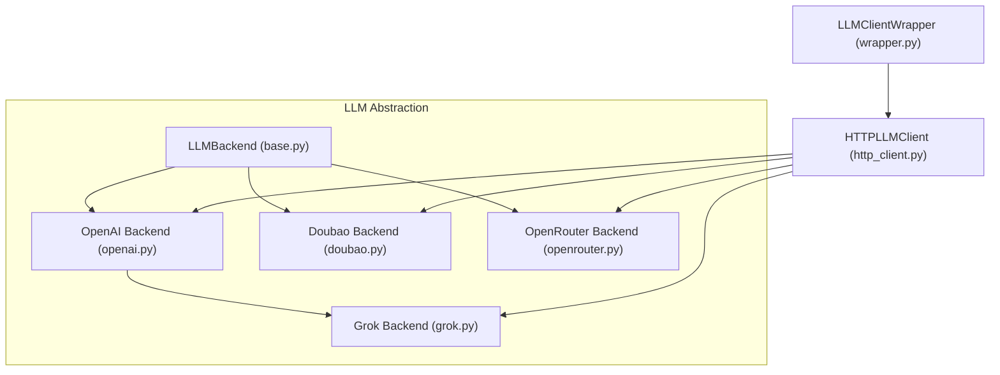
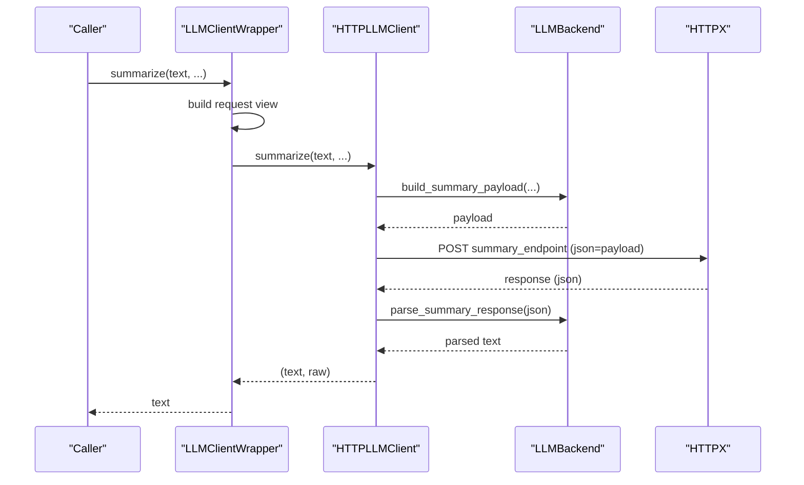
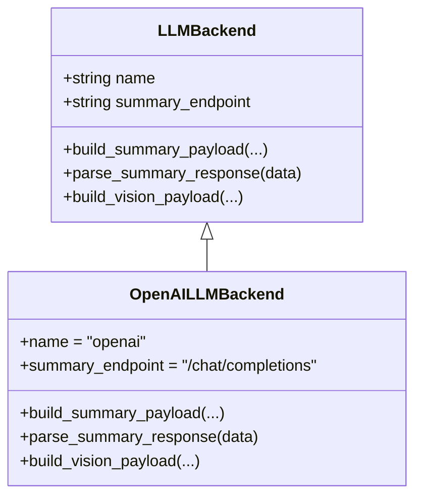
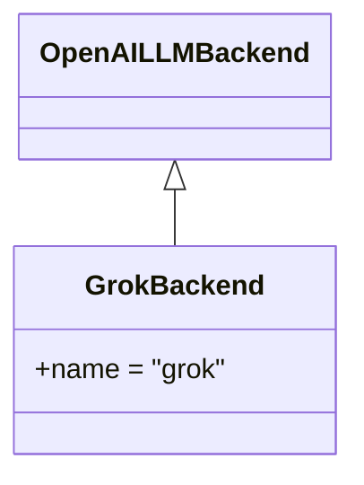
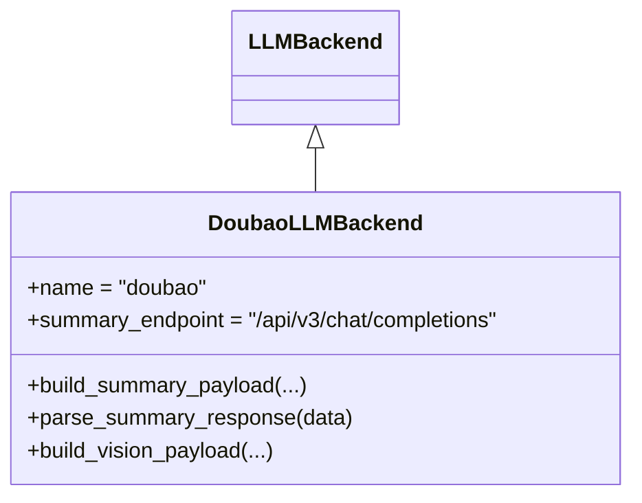
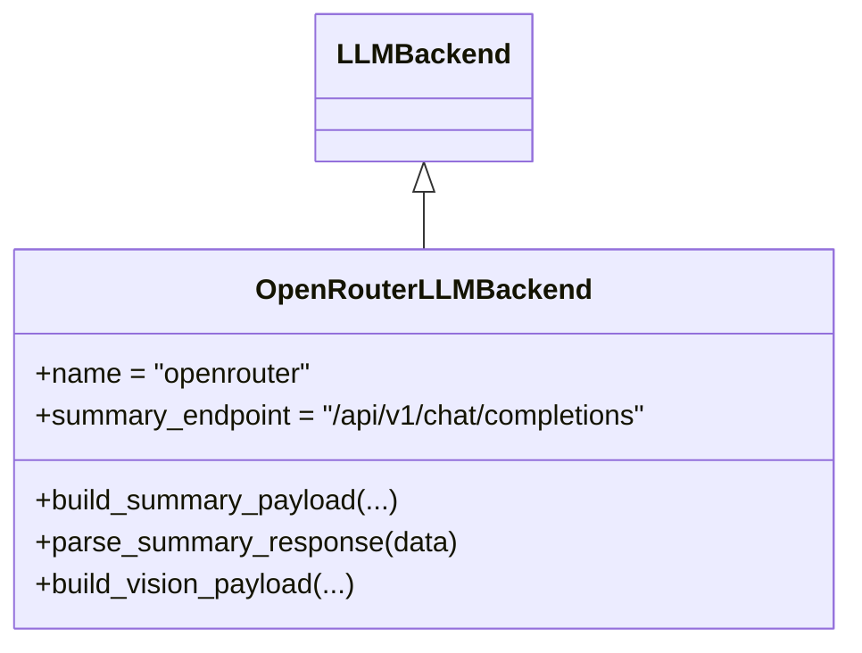
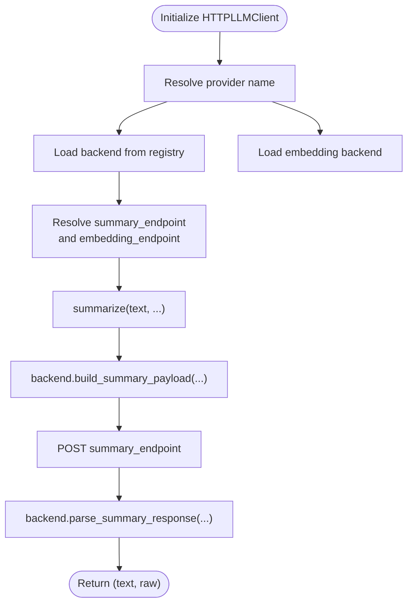
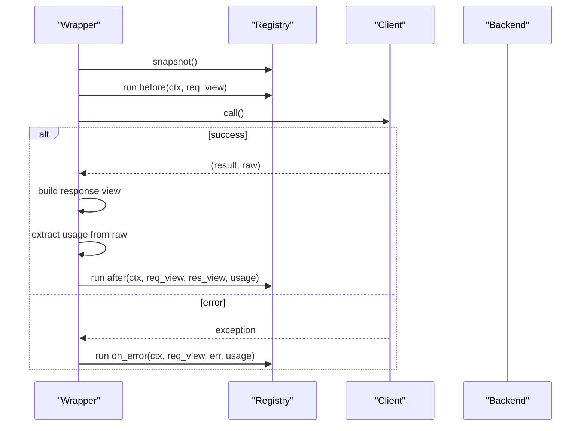
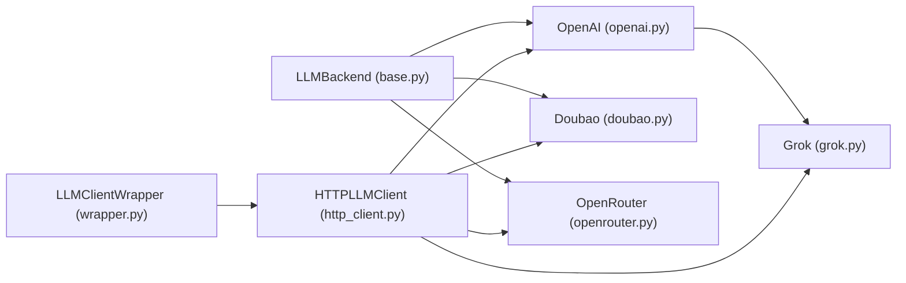

# Backend Abstraction Layer

<cite>
**Referenced Files in This Document**
- [base.py](file://src/memu/llm/backends/base.py)
- [openai.py](file://src/memu/llm/backends/openai.py)
- [grok.py](file://src/memu/llm/backends/grok.py)
- [doubao.py](file://src/memu/llm/backends/doubao.py)
- [openrouter.py](file://src/memu/llm/backends/openrouter.py)
- [http_client.py](file://src/memu/llm/http_client.py)
- [wrapper.py](file://src/memu/llm/wrapper.py)
- [settings.py](file://src/memu/app/settings.py)
- [test_grok_provider.py](file://tests/llm/test_grok_provider.py)
- [test_openrouter.py](file://tests/test_openrouter.py)
- [grok.md](file://docs/providers/grok.md)
- [test_nebius_provider.py](file://examples/test_nebius_provider.py)
</cite>

## Table of Contents
1. [Introduction](#introduction)
2. [Project Structure](#project-structure)
3. [Core Components](#core-components)
4. [Architecture Overview](#architecture-overview)
5. [Detailed Component Analysis](#detailed-component-analysis)
6. [Dependency Analysis](#dependency-analysis)
7. [Performance Considerations](#performance-considerations)
8. [Troubleshooting Guide](#troubleshooting-guide)
9. [Conclusion](#conclusion)
10. [Appendices](#appendices)

## Introduction
This document explains the LLM backend abstraction layer that enables provider-agnostic integration across multiple LLM providers. It covers the base interface, provider-specific backends, the HTTP client that orchestrates requests and responses, and the wrapper that adds observability and usage extraction. It also documents how to add new providers, compatibility considerations, and migration strategies between providers.

## Project Structure
The LLM abstraction lives under the LLM module and is composed of:
- Backends: provider-specific implementations of the base interface
- HTTP client: orchestrates provider selection, endpoint mapping, request building, and response parsing
- Wrapper: adds telemetry, request/response views, and usage extraction
- Settings: provider defaults and configuration model

**Diagram sources**
- [base.py](file://src/memu/llm/backends/base.py#L6-L31)
- [openai.py](file://src/memu/llm/backends/openai.py#L8-L65)
- [grok.py](file://src/memu/llm/backends/grok.py#L6-L12)
- [doubao.py](file://src/memu/llm/backends/doubao.py#L8-L70)
- [openrouter.py](file://src/memu/llm/backends/openrouter.py#L8-L71)
- [http_client.py](file://src/memu/llm/http_client.py#L80-L301)
- [wrapper.py](file://src/memu/llm/wrapper.py#L226-L505)

**Section sources**
- [base.py](file://src/memu/llm/backends/base.py#L6-L31)
- [openai.py](file://src/memu/llm/backends/openai.py#L8-L65)
- [grok.py](file://src/memu/llm/backends/grok.py#L6-L12)
- [doubao.py](file://src/memu/llm/backends/doubao.py#L8-L70)
- [openrouter.py](file://src/memu/llm/backends/openrouter.py#L8-L71)
- [http_client.py](file://src/memu/llm/http_client.py#L80-L301)
- [wrapper.py](file://src/memu/llm/wrapper.py#L226-L505)

## Core Components
- LLMBackend: Defines the contract for provider-agnostic chat, vision, and endpoint mapping.
- Provider backends: Implement payload construction and response parsing for each provider.
- HTTPLLMClient: Factory-driven backend selection, endpoint resolution, request execution, and response parsing.
- LLMClientWrapper: Adds telemetry, request/response views, and usage extraction around the underlying client.

Key responsibilities:
- Payload construction: build_summary_payload and build_vision_payload
- Response parsing: parse_summary_response
- Endpoint mapping: summary_endpoint and optional overrides
- Factory pattern: LLM_BACKENDS registry and dynamic backend instantiation

**Section sources**
- [base.py](file://src/memu/llm/backends/base.py#L6-L31)
- [http_client.py](file://src/memu/llm/http_client.py#L72-L118)
- [http_client.py](file://src/memu/llm/http_client.py#L282-L301)
- [wrapper.py](file://src/memu/llm/wrapper.py#L226-L505)

## Architecture Overview
The abstraction layer separates concerns:
- Backends encapsulate provider-specific request/response formats
- HTTPLLMClient centralizes endpoint resolution and HTTP transport
- Wrapper adds cross-cutting concerns like usage extraction and interception

**Diagram sources**
- [wrapper.py](file://src/memu/llm/wrapper.py#L247-L352)
- [http_client.py](file://src/memu/llm/http_client.py#L148-L159)
- [base.py](file://src/memu/llm/backends/base.py#L12-L18)

**Section sources**
- [wrapper.py](file://src/memu/llm/wrapper.py#L247-L352)
- [http_client.py](file://src/memu/llm/http_client.py#L148-L159)
- [base.py](file://src/memu/llm/backends/base.py#L12-L18)

## Detailed Component Analysis

### Base LLMBackend Interface
- Responsibilities:
  - Define provider name and default summary endpoint
  - Build provider-agnostic payloads for text summarization and vision
  - Parse provider-agnostic response shape for summary results
- Contract:
  - build_summary_payload: constructs a request payload dictionary
  - parse_summary_response: extracts the textual response from provider JSON
  - build_vision_payload: constructs a request payload for multimodal inputs

Implementation pattern:
- Each provider backend implements the interface and adapts to provider-specific fields (e.g., max_tokens placement, message structure).

**Section sources**
- [base.py](file://src/memu/llm/backends/base.py#L6-L31)

### OpenAI Backend
- Characteristics:
  - Uses OpenAI-compatible payload structure
  - Includes system prompt, user prompt, model, temperature, and optional max_tokens
  - Parses response from choices[0].message.content
- Vision payload:
  - Composes a messages array with role=user and content as a mixed array of text and image_url
  - Supports optional system prompt

**Diagram sources**
- [base.py](file://src/memu/llm/backends/base.py#L6-L31)
- [openai.py](file://src/memu/llm/backends/openai.py#L8-L65)

**Section sources**
- [openai.py](file://src/memu/llm/backends/openai.py#L8-L65)

### Grok Backend
- Characteristics:
  - Grok is treated as OpenAI-compatible
  - Inherits OpenAI payload structure and response parsing
  - Defaults are managed by configuration (base URL, model, API key)
- Implementation:
  - Minimal subclass that reuses OpenAI backend behavior

**Diagram sources**
- [openai.py](file://src/memu/llm/backends/openai.py#L8-L65)
- [grok.py](file://src/memu/llm/backends/grok.py#L6-L12)

**Section sources**
- [grok.py](file://src/memu/llm/backends/grok.py#L6-L12)
- [test_grok_provider.py](file://tests/llm/test_grok_provider.py#L9-L47)
- [grok.md](file://docs/providers/grok.md#L1-L67)

### Doubao Backend
- Characteristics:
  - Uses an OpenAI-compatible endpoint with a provider-specific path
  - Similar payload structure to OpenAI, with optional max_tokens
  - Parses response from choices[0].message.content
- Vision payload:
  - Mirrors OpenAI’s nested content structure for text and image_url

**Diagram sources**
- [base.py](file://src/memu/llm/backends/base.py#L6-L31)
- [doubao.py](file://src/memu/llm/backends/doubao.py#L8-L70)

**Section sources**
- [doubao.py](file://src/memu/llm/backends/doubao.py#L8-L70)

### OpenRouter Backend
- Characteristics:
  - Uses an OpenAI-compatible endpoint with a provider-specific path
  - Similar payload structure to OpenAI, with optional max_tokens
  - Parses response from choices[0].message.content
- Vision payload:
  - Mirrors OpenAI’s nested content structure for text and image_url

**Diagram sources**
- [base.py](file://src/memu/llm/backends/base.py#L6-L31)
- [openrouter.py](file://src/memu/llm/backends/openrouter.py#L8-L71)

**Section sources**
- [openrouter.py](file://src/memu/llm/backends/openrouter.py#L8-L71)
- [test_openrouter.py](file://tests/test_openrouter.py#L86-L162)

### HTTPLLMClient: Factory Pattern and Endpoint Resolution
- Factory registry:
  - LLM_BACKENDS maps provider names to backend constructors
- Endpoint resolution:
  - summary_endpoint and embedding_endpoint are resolved from backend defaults or overrides
  - Overrides accept keys like "chat", "summary", "embeddings", "embedding", "embed"
- Request orchestration:
  - Builds provider-specific payloads via backend
  - Sends HTTP POST with Authorization header
  - Parses response via backend
  - Supports vision and generic chat flows
- Embedding backends:
  - Separate embedding endpoint and payload construction per provider

**Diagram sources**
- [http_client.py](file://src/memu/llm/http_client.py#L72-L118)
- [http_client.py](file://src/memu/llm/http_client.py#L148-L159)
- [http_client.py](file://src/memu/llm/http_client.py#L282-L301)

**Section sources**
- [http_client.py](file://src/memu/llm/http_client.py#L72-L118)
- [http_client.py](file://src/memu/llm/http_client.py#L148-L159)
- [http_client.py](file://src/memu/llm/http_client.py#L282-L301)

### LLMClientWrapper: Observability and Usage Extraction
- Adds:
  - Request/response views for telemetry
  - Interceptor registry with before/after/on_error hooks
  - Usage extraction from raw responses (best-effort)
- Invocation flow:
  - Builds request view
  - Runs before interceptors
  - Executes underlying client call
  - On success: builds response view and usage, runs after interceptors
  - On error: runs on_error interceptors
- Usage extraction supports:
  - Finish reason
  - Input/output/total tokens
  - Token breakdown and cached input tokens (when present)

**Diagram sources**
- [wrapper.py](file://src/memu/llm/wrapper.py#L387-L436)
- [wrapper.py](file://src/memu/llm/wrapper.py#L450-L504)
- [wrapper.py](file://src/memu/llm/wrapper.py#L653-L703)

**Section sources**
- [wrapper.py](file://src/memu/llm/wrapper.py#L226-L505)
- [wrapper.py](file://src/memu/llm/wrapper.py#L653-L703)

## Dependency Analysis
- Backends depend on the base interface contract
- HTTPLLMClient depends on all concrete backends and registers them in LLM_BACKENDS
- Wrapper depends on HTTPLLMClient and uses interceptors for cross-cutting concerns
- Settings provide provider defaults and environment variable mapping

**Diagram sources**
- [base.py](file://src/memu/llm/backends/base.py#L6-L31)
- [openai.py](file://src/memu/llm/backends/openai.py#L8-L65)
- [grok.py](file://src/memu/llm/backends/grok.py#L6-L12)
- [doubao.py](file://src/memu/llm/backends/doubao.py#L8-L70)
- [openrouter.py](file://src/memu/llm/backends/openrouter.py#L8-L71)
- [http_client.py](file://src/memu/llm/http_client.py#L72-L77)
- [wrapper.py](file://src/memu/llm/wrapper.py#L226-L246)

**Section sources**
- [http_client.py](file://src/memu/llm/http_client.py#L72-L77)
- [settings.py](file://src/memu/app/settings.py#L102-L139)

## Performance Considerations
- Asynchronous HTTP client: Uses httpx.AsyncClient to minimize latency
- Proxy support: Respects MEMU_HTTP_PROXY/HTTP_PROXY/HTTPS_PROXY environment variables
- Endpoint normalization: Ensures base_url ends with "/" and strips leading "/" from endpoints to avoid path resolution issues
- Token usage extraction: Best-effort mapping from provider responses to unified usage metrics

[No sources needed since this section provides general guidance]

## Troubleshooting Guide
Common issues and resolutions:
- Unsupported provider: Ensure provider name exists in the LLM_BACKENDS registry
- Endpoint conflicts: Use endpoint_overrides to align with provider-specific paths
- Response parsing failures: Confirm provider response shape matches expected OpenAI-compatible structure
- Embedding mismatch: Verify embedding backend selection matches provider defaults

Operational tips:
- Enable debug logging to inspect raw responses
- Validate base_url and API key configuration
- For Grok/OpenRouter/Doubao, confirm model availability and permissions

**Section sources**
- [http_client.py](file://src/memu/llm/http_client.py#L282-L301)
- [http_client.py](file://src/memu/llm/http_client.py#L104-L114)
- [wrapper.py](file://src/memu/llm/wrapper.py#L404-L408)

## Conclusion
The LLM backend abstraction layer cleanly separates provider-specific logic behind a shared interface, enabling seamless switching among OpenAI, Grok, Doubao, and OpenRouter. The HTTP client and wrapper layers provide robust request orchestration, endpoint mapping, and observability. Adding a new provider requires implementing the base interface and registering it in the factory.

## Appendices

### How to Add a New Provider
Steps:
1. Implement a new backend class inheriting from LLMBackend and define:
   - name
   - summary_endpoint
   - build_summary_payload
   - parse_summary_response
   - build_vision_payload
2. Register the provider in the LLM_BACKENDS mapping in the HTTP client
3. If the provider has a distinct embedding API, add an embedding backend and register it in the embedding backend loader
4. Update configuration defaults if needed (optional)
5. Write tests to validate payload construction and response parsing

Compatibility considerations:
- Prefer OpenAI-compatible payloads for consistency
- Normalize max_tokens placement and optional inclusion
- Ensure response parsing targets the standardized choices[0].message.content structure

Migration strategies:
- Switch providers by changing the provider field and base_url
- Use endpoint_overrides to adapt to provider-specific paths
- Validate token usage extraction and adjust if provider returns different fields

**Section sources**
- [base.py](file://src/memu/llm/backends/base.py#L6-L31)
- [http_client.py](file://src/memu/llm/http_client.py#L72-L77)
- [http_client.py](file://src/memu/llm/http_client.py#L289-L300)
- [settings.py](file://src/memu/app/settings.py#L128-L139)

### Provider-Specific Notes and Examples
- Grok:
  - Defaults: base_url, model, and API key are set when provider="grok"
  - Inherits OpenAI-compatible payload and response parsing
- OpenRouter:
  - Full workflow tested end-to-end with MemoryService
  - Supports chat and embedding models as configured
- Doubao:
  - Uses provider-specific endpoint path
  - Mirrors OpenAI payload/response structure
- Nebius:
  - Demonstrates OpenAI-compatible integration via SDK client backend
  - Useful reference for adding OpenAI-compatible providers

**Section sources**
- [test_grok_provider.py](file://tests/llm/test_grok_provider.py#L9-L47)
- [grok.md](file://docs/providers/grok.md#L1-L67)
- [test_openrouter.py](file://tests/test_openrouter.py#L86-L162)
- [test_nebius_provider.py](file://examples/test_nebius_provider.py#L1-L229)