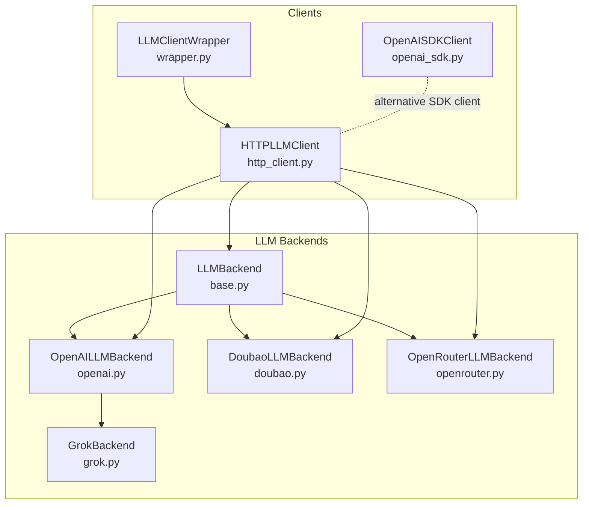
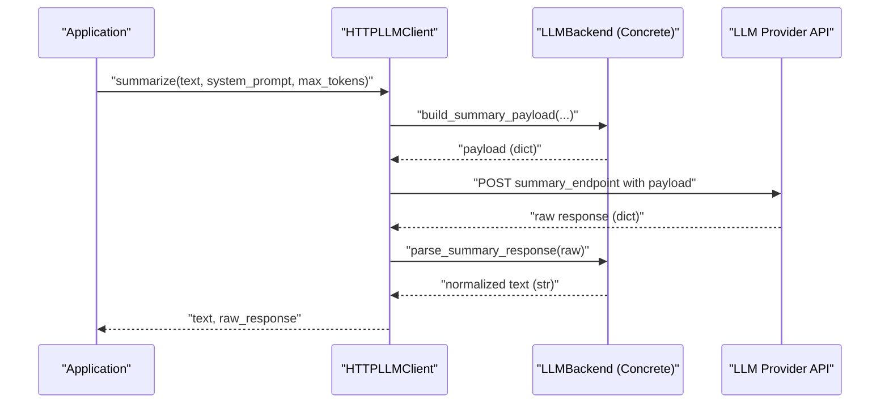
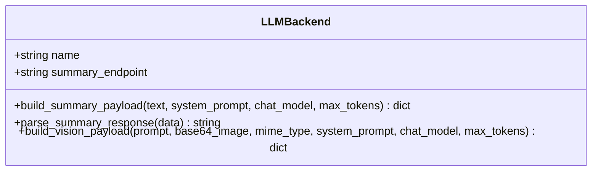
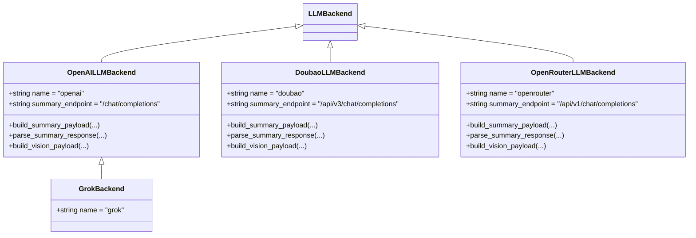
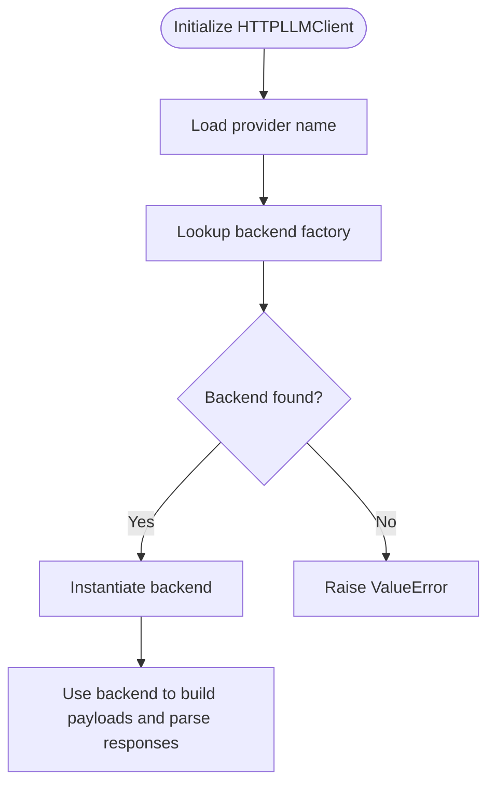
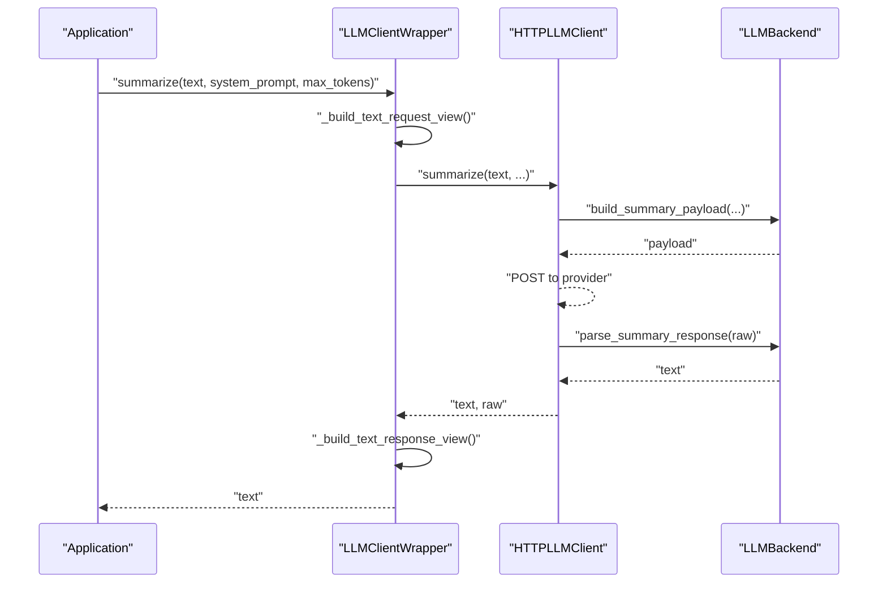
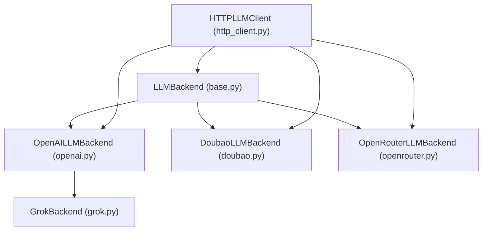

# Base Backend Interface

<cite>
**Referenced Files in This Document**
- [base.py](file://src/memu/llm/backends/base.py)
- [__init__.py](file://src/memu/llm/backends/__init__.py)
- [openai.py](file://src/memu/llm/backends/openai.py)
- [doubao.py](file://src/memu/llm/backends/doubao.py)
- [openrouter.py](file://src/memu/llm/backends/openrouter.py)
- [grok.py](file://src/memu/llm/backends/grok.py)
- [http_client.py](file://src/memu/llm/http_client.py)
- [wrapper.py](file://src/memu/llm/wrapper.py)
- [openai_sdk.py](file://src/memu/llm/openai_sdk.py)
- [test_grok_provider.py](file://tests/llm/test_grok_provider.py)
</cite>

## Table of Contents
1. [Introduction](#introduction)
2. [Project Structure](#project-structure)
3. [Core Components](#core-components)
4. [Architecture Overview](#architecture-overview)
5. [Detailed Component Analysis](#detailed-component-analysis)
6. [Dependency Analysis](#dependency-analysis)
7. [Performance Considerations](#performance-considerations)
8. [Troubleshooting Guide](#troubleshooting-guide)
9. [Conclusion](#conclusion)

## Introduction
This document explains the LLMBackend base class interface that defines the contract for all LLM provider implementations in the system. It documents the abstract methods that must be implemented by concrete backends, the required attributes, method signatures, parameter types, and expected return values. It also demonstrates how the base interface ensures consistency across different providers while allowing for provider-specific customizations, and how it enables a provider-agnostic architecture that makes adding new LLM providers straightforward.

## Project Structure
The LLM backend abstraction resides under the llm/backends package and is complemented by an HTTP client that orchestrates provider selection and request/response handling. The wrapper module provides instrumentation and usage tracking around LLM calls.

**Diagram sources**
- [base.py](file://src/memu/llm/backends/base.py#L6-L31)
- [openai.py](file://src/memu/llm/backends/openai.py#L8-L65)
- [doubao.py](file://src/memu/llm/backends/doubao.py#L8-L70)
- [openrouter.py](file://src/memu/llm/backends/openrouter.py#L8-L71)
- [grok.py](file://src/memu/llm/backends/grok.py#L6-L12)
- [http_client.py](file://src/memu/llm/http_client.py#L80-L301)
- [openai_sdk.py](file://src/memu/llm/openai_sdk.py#L20-L219)
- [wrapper.py](file://src/memu/llm/wrapper.py#L226-L485)

**Section sources**
- [base.py](file://src/memu/llm/backends/base.py#L1-L31)
- [__init__.py](file://src/memu/llm/backends/__init__.py#L1-L8)

## Core Components
The LLMBackend base class defines the provider-agnostic contract that all LLM providers must implement. It consists of two primary responsibilities:
- Building provider-specific request payloads for text summarization and multimodal vision tasks
- Parsing provider-specific response payloads into a normalized string

Key elements:
- Attributes
  - name: A string identifier for the provider
  - summary_endpoint: The default endpoint path for chat/completions-like operations
- Methods
  - build_summary_payload(): Builds a provider-specific payload for text summarization
  - parse_summary_response(): Parses a provider-specific response into a normalized string
  - build_vision_payload(): Builds a provider-specific payload for vision tasks

These methods are intentionally abstract in the base class and must be implemented by each concrete backend.

**Section sources**
- [base.py](file://src/memu/llm/backends/base.py#L6-L31)

## Architecture Overview
The provider-agnostic architecture is achieved by:
- Defining a common interface (LLMBackend) that all providers implement
- Selecting a provider backend at runtime via a factory mapping
- Using the selected backend to build payloads and parse responses
- Optionally wrapping the client with instrumentation and usage tracking

**Diagram sources**
- [http_client.py](file://src/memu/llm/http_client.py#L148-L159)
- [base.py](file://src/memu/llm/backends/base.py#L12-L30)

**Section sources**
- [http_client.py](file://src/memu/llm/http_client.py#L80-L160)
- [base.py](file://src/memu/llm/backends/base.py#L6-L31)

## Detailed Component Analysis

### LLMBackend Base Class
The base class establishes the contract that all LLM providers must fulfill. It defines:
- Required attributes: name and summary_endpoint
- Abstract methods: build_summary_payload(), parse_summary_response(), build_vision_payload()

Implementation expectations:
- build_summary_payload(): Must return a dictionary representing the provider-specific request payload
- parse_summary_response(): Must accept a provider-specific response dictionary and return a normalized string
- build_vision_payload(): Must return a dictionary representing the provider-specific request payload for vision tasks

**Diagram sources**
- [base.py](file://src/memu/llm/backends/base.py#L6-L31)

**Section sources**
- [base.py](file://src/memu/llm/backends/base.py#L6-L31)

### Concrete Backends

#### OpenAI-Compatible Backends
OpenAI, Doubao, and OpenRouter backends inherit the same payload structure and response parsing logic. They differ primarily in endpoint paths and minor payload differences.

**Diagram sources**
- [openai.py](file://src/memu/llm/backends/openai.py#L8-L65)
- [doubao.py](file://src/memu/llm/backends/doubao.py#L8-L70)
- [openrouter.py](file://src/memu/llm/backends/openrouter.py#L8-L71)
- [grok.py](file://src/memu/llm/backends/grok.py#L6-L12)
- [base.py](file://src/memu/llm/backends/base.py#L6-L31)

Implementation specifics:
- OpenAI backend: Uses OpenAI-compatible payload structure and response parsing
- Doubao backend: Uses OpenAI-compatible payload structure with provider-specific endpoint and optional max_tokens handling
- OpenRouter backend: Uses OpenAI-compatible payload structure with provider-specific endpoint and optional max_tokens handling
- Grok backend: Inherits OpenAI-compatible behavior by extending OpenAILLMBackend

**Section sources**
- [openai.py](file://src/memu/llm/backends/openai.py#L8-L65)
- [doubao.py](file://src/memu/llm/backends/doubao.py#L8-L70)
- [openrouter.py](file://src/memu/llm/backends/openrouter.py#L8-L71)
- [grok.py](file://src/memu/llm/backends/grok.py#L6-L12)

### Provider Selection and Factory Pattern
The HTTP client uses a factory mapping to select the appropriate backend based on the provider name. This enables adding new providers without changing client code.

**Diagram sources**
- [http_client.py](file://src/memu/llm/http_client.py#L72-L118)
- [http_client.py](file://src/memu/llm/http_client.py#L282-L287)

**Section sources**
- [http_client.py](file://src/memu/llm/http_client.py#L72-L118)
- [http_client.py](file://src/memu/llm/http_client.py#L282-L287)

### Method Signatures and Expected Behavior

#### build_summary_payload
Purpose: Construct a provider-specific request payload for text summarization.

Parameters:
- text: The input text to summarize
- system_prompt: Optional system prompt to guide the model
- chat_model: The model identifier to use
- max_tokens: Optional maximum tokens for the response

Returns:
- A dictionary representing the provider-specific payload

Expected behavior:
- Include model, messages, and any provider-specific fields
- Respect optional parameters (system_prompt, max_tokens)

Examples of implementations:
- OpenAI/Doubao/OpenRouter backends include model, messages, temperature, and optional max_tokens
- Grok backend inherits OpenAI-compatible payload structure

**Section sources**
- [base.py](file://src/memu/llm/backends/base.py#L12-L16)
- [openai.py](file://src/memu/llm/backends/openai.py#L14-L26)
- [doubao.py](file://src/memu/llm/backends/doubao.py#L14-L29)
- [openrouter.py](file://src/memu/llm/backends/openrouter.py#L14-L29)
- [grok.py](file://src/memu/llm/backends/grok.py#L6-L12)

#### parse_summary_response
Purpose: Convert a provider-specific response into a normalized string.

Parameters:
- data: The raw response dictionary from the provider

Returns:
- A string containing the model's response text

Expected behavior:
- Extract the response text from the provider's response structure
- Handle missing content gracefully

Examples of implementations:
- OpenAI/Doubao/OpenRouter backends extract content from choices[0].message.content
- Grok backend inherits OpenAI-compatible parsing

**Section sources**
- [base.py](file://src/memu/llm/backends/base.py#L17-L18)
- [openai.py](file://src/memu/llm/backends/openai.py#L28-L29)
- [doubao.py](file://src/memu/llm/backends/doubao.py#L31-L32)
- [openrouter.py](file://src/memu/llm/backends/openrouter.py#L31-L33)
- [grok.py](file://src/memu/llm/backends/grok.py#L6-L12)

#### build_vision_payload
Purpose: Construct a provider-specific request payload for vision tasks.

Parameters:
- prompt: The text prompt associated with the image
- base64_image: The base64-encoded image data
- mime_type: The MIME type of the image
- system_prompt: Optional system prompt to guide the model
- chat_model: The model identifier to use
- max_tokens: Optional maximum tokens for the response

Returns:
- A dictionary representing the provider-specific payload

Expected behavior:
- Include model, messages with text and image parts, and any provider-specific fields
- Respect optional parameters (system_prompt, max_tokens)

Examples of implementations:
- OpenAI/Doubao/OpenRouter backends construct messages with text and image_url parts
- Grok backend inherits OpenAI-compatible vision payload structure

**Section sources**
- [base.py](file://src/memu/llm/backends/base.py#L20-L29)
- [openai.py](file://src/memu/llm/backends/openai.py#L31-L64)
- [doubao.py](file://src/memu/llm/backends/doubao.py#L34-L69)
- [openrouter.py](file://src/memu/llm/backends/openrouter.py#L35-L70)
- [grok.py](file://src/memu/llm/backends/grok.py#L6-L12)

### Provider-Specific Customizations
While the base interface enforces consistency, concrete backends can customize:
- Endpoint paths (e.g., Doubao and OpenRouter use provider-specific endpoints)
- Payload construction details (e.g., optional max_tokens handling)
- Response parsing logic (e.g., extracting content from provider-specific structures)

This flexibility allows the same client interface to work with diverse providers while preserving a uniform developer experience.

**Section sources**
- [doubao.py](file://src/memu/llm/backends/doubao.py#L11-L12)
- [openrouter.py](file://src/memu/llm/backends/openrouter.py#L11-L12)
- [openai.py](file://src/memu/llm/backends/openai.py#L11-L12)
- [grok.py](file://src/memu/llm/backends/grok.py#L9-L11)

### Integration with Client Wrappers and Instrumentation
The LLMClientWrapper adds instrumentation and usage tracking around LLM calls. It delegates actual LLM operations to the underlying client (e.g., HTTPLLMClient) while capturing request/response views and usage metrics.

**Diagram sources**
- [wrapper.py](file://src/memu/llm/wrapper.py#L247-L272)
- [http_client.py](file://src/memu/llm/http_client.py#L148-L159)
- [base.py](file://src/memu/llm/backends/base.py#L12-L18)

**Section sources**
- [wrapper.py](file://src/memu/llm/wrapper.py#L226-L485)
- [http_client.py](file://src/memu/llm/http_client.py#L148-L159)

## Dependency Analysis
The base backend interface creates a clean separation between provider selection and payload/response handling. Concrete backends depend on the base interface, while the HTTP client depends on the backend factory mapping.

**Diagram sources**
- [base.py](file://src/memu/llm/backends/base.py#L6-L31)
- [openai.py](file://src/memu/llm/backends/openai.py#L8-L65)
- [doubao.py](file://src/memu/llm/backends/doubao.py#L8-L70)
- [openrouter.py](file://src/memu/llm/backends/openrouter.py#L8-L71)
- [grok.py](file://src/memu/llm/backends/grok.py#L6-L12)
- [http_client.py](file://src/memu/llm/http_client.py#L72-L77)

**Section sources**
- [__init__.py](file://src/memu/llm/backends/__init__.py#L1-L8)
- [http_client.py](file://src/memu/llm/http_client.py#L72-L77)

## Performance Considerations
- Payload construction and response parsing are lightweight operations; performance is primarily determined by provider latency and token usage
- The base interface avoids heavy computation, keeping overhead minimal
- Provider-specific differences (e.g., optional max_tokens) are handled efficiently in concrete backends

[No sources needed since this section provides general guidance]

## Troubleshooting Guide
Common issues and resolutions:
- Unsupported provider: Ensure the provider name matches one of the registered backends
- Incorrect endpoint path: Verify that summary_endpoint is correctly set for the chosen provider
- Response parsing failures: Confirm that parse_summary_response extracts content from the correct provider-specific structure
- Vision payload issues: Ensure build_vision_payload constructs messages with text and image parts according to the provider's expected format

Validation examples:
- Tests demonstrate that GrokBackend inherits OpenAI-compatible response parsing behavior
- Tests assert that OpenAISDKClient initializes with the correct base URL for Grok

**Section sources**
- [http_client.py](file://src/memu/llm/http_client.py#L282-L287)
- [test_grok_provider.py](file://tests/llm/test_grok_provider.py#L9-L47)

## Conclusion
The LLMBackend base class interface provides a robust foundation for a provider-agnostic LLM architecture. By defining a clear contract for payload construction and response parsing, it ensures consistent behavior across diverse providers while allowing for provider-specific customizations. The factory-based provider selection and client wrapper instrumentation enable seamless integration and extensibility, making it straightforward to add new LLM providers without disrupting existing functionality.