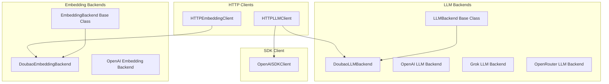
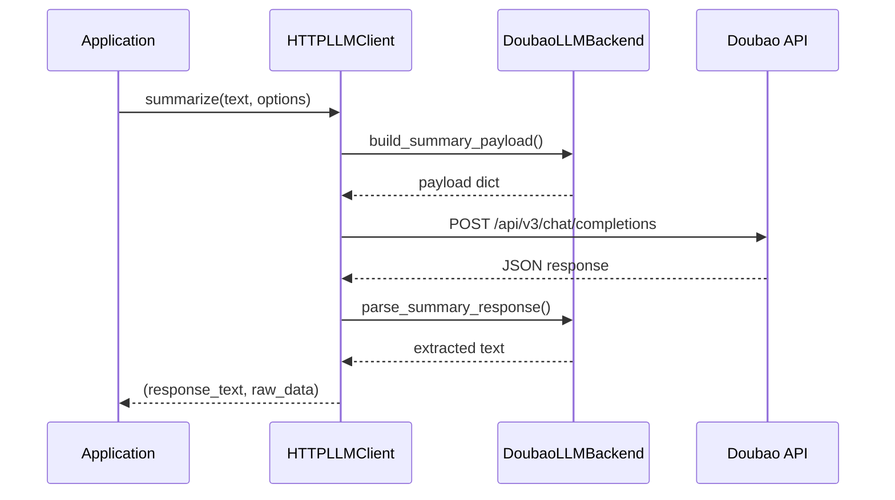
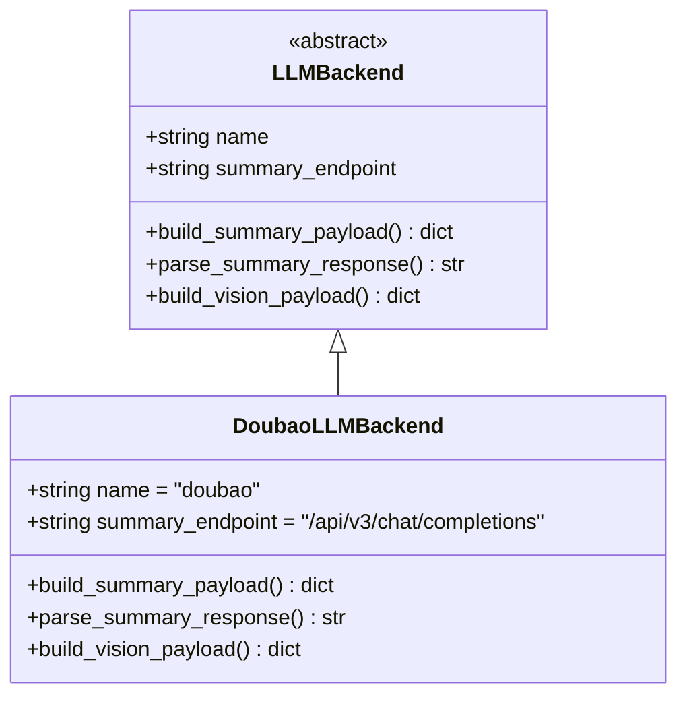
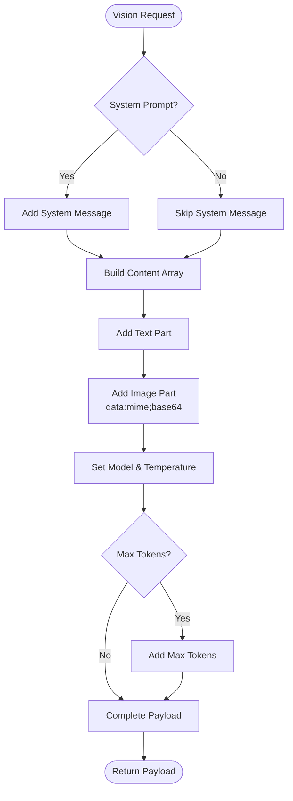
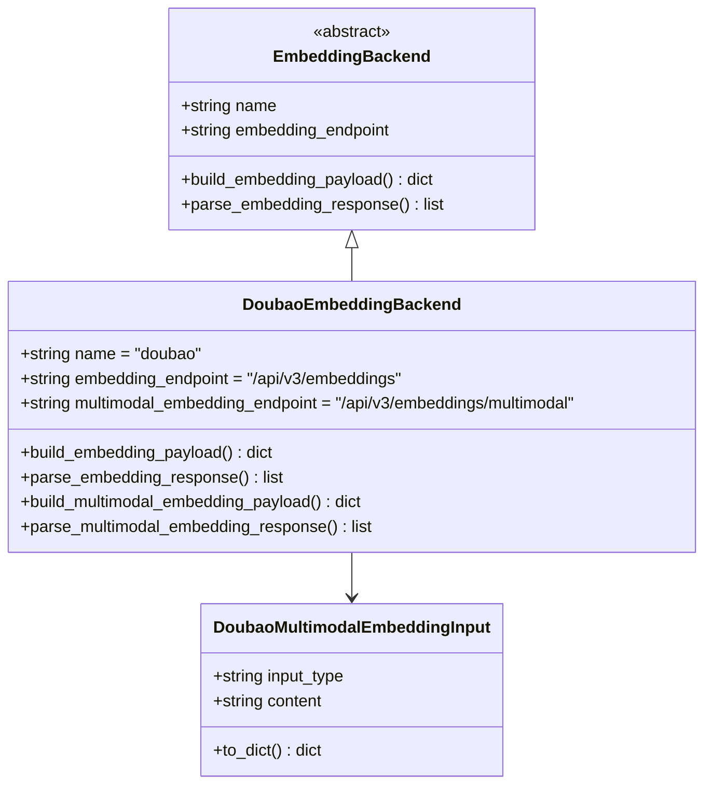
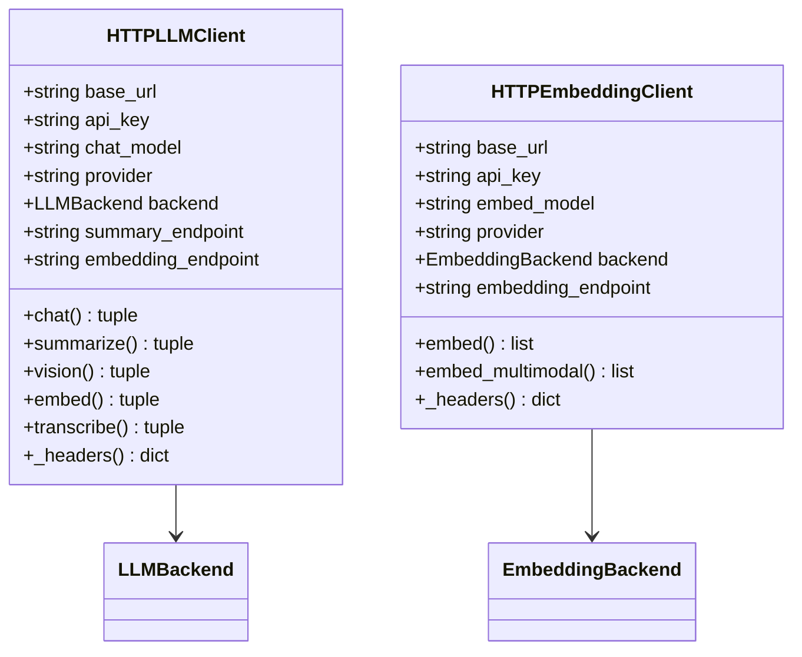
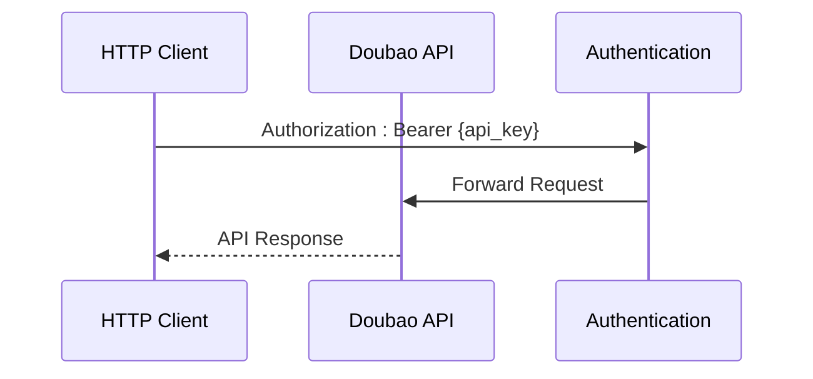
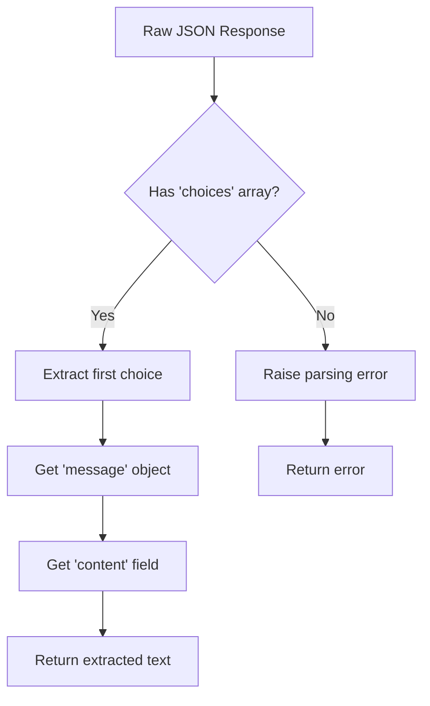

# Doubao Backend Implementation

<cite>
**Referenced Files in This Document**
- [doubao.py](file://src/memu/llm/backends/doubao.py)
- [base.py](file://src/memu/llm/backends/base.py)
- [http_client.py](file://src/memu/llm/http_client.py)
- [doubao.py](file://src/memu/embedding/backends/doubao.py)
- [base.py](file://src/memu/embedding/backends/base.py)
- [http_client.py](file://src/memu/embedding/http_client.py)
- [openai_sdk.py](file://src/memu/llm/openai_sdk.py)
</cite>

## Table of Contents
1. [Introduction](#introduction)
2. [Project Structure](#project-structure)
3. [Core Components](#core-components)
4. [Architecture Overview](#architecture-overview)
5. [Detailed Component Analysis](#detailed-component-analysis)
6. [Regional Considerations](#regional-considerations)
7. [Authentication and Configuration](#authentication-and-configuration)
8. [Provider-Specific Payload Construction](#provider-specific-payload-construction)
9. [Response Parsing Mechanisms](#response-parsing-mechanisms)
10. [Integration Patterns](#integration-patterns)
11. [Performance Considerations](#performance-considerations)
12. [Troubleshooting Guide](#troubleshooting-guide)
13. [Conclusion](#conclusion)

## Introduction

The Doubao backend implementation provides integration with ByteDance's Doubao (MiniMax) AI service within the MemU framework. This implementation follows a provider-agnostic architecture while adapting to Doubao's specific API characteristics, request/response formats, and authentication mechanisms.

Doubao serves as ByteDance's AI model platform, offering both language model capabilities and multimodal embedding functionality. The implementation leverages OpenAI-compatible APIs for seamless integration while maintaining provider-specific adaptations for optimal performance.

## Project Structure

The Doubao implementation is organized within the MemU framework's modular architecture:



**Diagram sources**
- [doubao.py](file://src/memu/llm/backends/doubao.py#L8-L32)
- [base.py](file://src/memu/llm/backends/base.py#L6-L31)
- [http_client.py](file://src/memu/llm/http_client.py#L80-L118)

**Section sources**
- [doubao.py](file://src/memu/llm/backends/doubao.py#L1-L70)
- [base.py](file://src/memu/llm/backends/base.py#L1-L31)
- [http_client.py](file://src/memu/llm/http_client.py#L1-L301)

## Core Components

The Doubao backend implementation consists of several key components that work together to provide comprehensive AI service integration:

### LLM Backend Implementation

The DoubaoLLMBackend extends the base LLMBackend class and implements provider-specific logic for both text generation and vision capabilities.

### Embedding Backend Implementation

The DoubaoEmbeddingBackend provides specialized embedding functionality including support for multimodal inputs (text, images, videos).

### HTTP Client Integration

The HTTPLLMClient and HTTPEmbeddingClient provide unified interfaces for interacting with Doubao services while maintaining compatibility with other providers.

**Section sources**
- [doubao.py](file://src/memu/llm/backends/doubao.py#L8-L70)
- [doubao.py](file://src/memu/embedding/backends/doubao.py#L31-L73)
- [http_client.py](file://src/memu/llm/http_client.py#L80-L118)

## Architecture Overview

The Doubao backend follows a layered architecture pattern that separates concerns between API communication, payload construction, and response parsing:



**Diagram sources**
- [http_client.py](file://src/memu/llm/http_client.py#L148-L159)
- [doubao.py](file://src/memu/llm/backends/doubao.py#L14-L32)

The architecture ensures that:

1. **Provider Abstraction**: Common interfaces hide provider-specific implementations
2. **Payload Construction**: Provider-specific payload builders handle API differences
3. **Response Parsing**: Consistent response extraction across providers
4. **Error Handling**: Unified error handling and logging

## Detailed Component Analysis

### DoubaoLLMBackend Analysis

The DoubaoLLMBackend implements the core language model functionality with OpenAI-compatible API support:



**Diagram sources**
- [base.py](file://src/memu/llm/backends/base.py#L6-L31)
- [doubao.py](file://src/memu/llm/backends/doubao.py#L8-L32)

#### Text Summarization Payload Construction

The build_summary_payload method constructs OpenAI-compatible request payloads with provider-specific defaults:

Key characteristics:
- Uses `/api/v3/chat/completions` endpoint
- Sets default temperature to 0.2 for consistent responses
- Supports optional system prompts with fallback behavior
- Includes max_tokens parameter when provided

#### Vision Payload Construction

The build_vision_payload method handles multimodal input processing:



**Diagram sources**
- [doubao.py](file://src/memu/llm/backends/doubao.py#L34-L69)

**Section sources**
- [doubao.py](file://src/memu/llm/backends/doubao.py#L8-L70)

### DoubaoEmbeddingBackend Analysis

The DoubaoEmbeddingBackend provides comprehensive embedding functionality with multimodal support:



**Diagram sources**
- [base.py](file://src/memu/embedding/backends/base.py#L6-L17)
- [doubao.py](file://src/memu/embedding/backends/doubao.py#L31-L73)

#### Standard Embedding Payload Construction

The build_embedding_payload method creates OpenAI-compatible embedding requests:

Key features:
- Uses `/api/v3/embeddings` endpoint
- Sets encoding_format to "float" for consistent vector output
- Supports batch processing of multiple inputs
- Maintains provider-specific parameter naming

#### Multimodal Embedding Payload Construction

The build_multimodal_embedding_payload method handles mixed input types:

Supported input types:
- **text**: Plain text content
- **image_url**: External image URLs
- **video_url**: External video URLs

Each input type is converted to the appropriate OpenAI-compatible format using the DoubaoMultimodalEmbeddingInput wrapper class.

**Section sources**
- [doubao.py](file://src/memu/embedding/backends/doubao.py#L31-L73)

### HTTP Client Integration

The HTTP client layer provides unified access to Doubao services while maintaining compatibility with other providers:



**Diagram sources**
- [http_client.py](file://src/memu/llm/http_client.py#L80-L118)
- [http_client.py](file://src/memu/embedding/http_client.py#L27-L58)

**Section sources**
- [http_client.py](file://src/memu/llm/http_client.py#L80-L301)
- [http_client.py](file://src/memu/embedding/http_client.py#L27-L150)

## Regional Considerations

Doubao operates under ByteDance's regional infrastructure with specific endpoint considerations:

### Endpoint Configuration

The implementation supports regional endpoint customization through the base_url parameter. The default configuration uses the standard Doubao endpoint structure:

- **Chat Completions**: `/api/v3/chat/completions`
- **Standard Embeddings**: `/api/v3/embeddings`
- **Multimodal Embeddings**: `/api/v3/embeddings/multimodal`

### Regional Deployment

ByteDance's infrastructure may require regional endpoint selection based on deployment location. The architecture supports flexible base_url configuration to accommodate different regional endpoints.

**Section sources**
- [doubao.py](file://src/memu/llm/backends/doubao.py#L12-L36)
- [http_client.py](file://src/memu/llm/http_client.py#L94-L97)

## Authentication and Configuration

### Authentication Mechanism

Doubao integration uses standard Bearer token authentication following OpenAI-compatible patterns:



**Diagram sources**
- [http_client.py](file://src/memu/llm/http_client.py#L279-L280)
- [http_client.py](file://src/memu/embedding/http_client.py#L141-L142)

### Configuration Parameters

The implementation supports comprehensive configuration through constructor parameters:

| Parameter | Type | Description | Default |
|-----------|------|-------------|---------|
| base_url | string | API endpoint base URL | Required |
| api_key | string | Authentication token | Required |
| chat_model | string | Language model identifier | Required |
| embed_model | string | Embedding model identifier | Same as chat_model |
| provider | string | Provider name ("doubao") | "openai" |
| endpoint_overrides | dict | Custom endpoint mappings | None |
| timeout | int | Request timeout in seconds | 60 |

### Environment Variable Support

The system supports proxy configuration through standard environment variables:
- `MEMU_HTTP_PROXY`
- `HTTP_PROXY` 
- `HTTPS_PROXY`

**Section sources**
- [http_client.py](file://src/memu/llm/http_client.py#L83-L118)
- [http_client.py](file://src/memu/embedding/http_client.py#L30-L58)

## Provider-Specific Payload Construction

### LLM Payload Adaptations

The DoubaoLLMBackend implements OpenAI-compatible payload construction with provider-specific optimizations:

#### Text Summarization Payload Structure

```python
{
    "model": chat_model,
    "messages": [
        {"role": "system", "content": system_prompt or fallback},
        {"role": "user", "content": text}
    ],
    "temperature": 0.2,
    "max_tokens": max_tokens  # Optional
}
```

#### Vision Payload Structure

```python
{
    "model": chat_model,
    "messages": [
        {"role": "system", "content": system_prompt},  # Optional
        {
            "role": "user", 
            "content": [
                {"type": "text", "text": prompt},
                {
                    "type": "image_url", 
                    "image_url": {
                        "url": f"data:{mime_type};base64,{base64_image}"
                    }
                }
            ]
        }
    ],
    "temperature": 0.2,
    "max_tokens": max_tokens  # Optional
}
```

### Embedding Payload Adaptations

#### Standard Embedding Payload

```python
{
    "model": embed_model,
    "input": inputs,  # List of strings
    "encoding_format": "float"
}
```

#### Multimodal Embedding Payload

```python
{
    "model": embed_model,
    "encoding_format": encoding_format,
    "input": [
        {"type": "text", "text": content},
        {"type": "image_url", "image_url": {"url": url}},
        {"type": "video_url", "video_url": {"url": url}}
    ]
}
```

**Section sources**
- [doubao.py](file://src/memu/llm/backends/doubao.py#L14-L69)
- [doubao.py](file://src/memu/embedding/backends/doubao.py#L38-L68)

## Response Parsing Mechanisms

### LLM Response Parsing

The DoubaoLLMBackend extracts text responses from OpenAI-compatible JSON structures:



**Diagram sources**
- [doubao.py](file://src/memu/llm/backends/doubao.py#L31-L32)

### Embedding Response Parsing

Both standard and multimodal embedding responses follow consistent parsing patterns:

#### Vector Extraction Pattern

```python
[
    [float, float, float, ...],  # First embedding vector
    [float, float, float, ...],  # Second embedding vector
    # ... more vectors
]
```

The implementation uses consistent casting and list comprehension patterns to extract numerical vectors from provider responses.

**Section sources**
- [doubao.py](file://src/memu/llm/backends/doubao.py#L31-L32)
- [doubao.py](file://src/memu/embedding/backends/doubao.py#L42-L72)

## Integration Patterns

### Provider-Agnostic Architecture

The implementation maintains compatibility with other providers through a shared interface pattern:

```mermaid
graph LR
subgraph "Provider Backends"
OpenAI[OpenAI Backend]
Doubao[Doubao Backend]
Grok[Grok Backend]
OpenRouter[OpenRouter Backend]
end
subgraph "Shared Interfaces"
LLMInterface[LLMBackend Interface]
EmbeddingInterface[EmbeddingBackend Interface]
end
subgraph "Client Layer"
LLMClient[HTTPLLMClient]
EmbeddingClient[HTTPEmbeddingClient]
end
LLMInterface <- --> OpenAI
LLMInterface <- --> Doubao
LLMInterface <- --> Grok
LLMInterface <- --> OpenRouter
EmbeddingInterface <- --> OpenAI
EmbeddingInterface <- --> Doubao
LLMClient --> LLMInterface
EmbeddingClient --> EmbeddingInterface
```

**Diagram sources**
- [http_client.py](file://src/memu/llm/http_client.py#L72-L77)
- [http_client.py](file://src/memu/embedding/http_client.py#L21-L24)

### Usage Patterns

#### Basic Text Summarization

```python
client = HTTPLLMClient(
    base_url="https://ark.cn-beijing.volces.com",
    api_key="your-doubao-api-key",
    chat_model="doubao-chat-model",
    provider="doubao"
)

response_text, raw_data = await client.summarize(
    text="Your input text here",
    system_prompt="Custom system prompt",
    max_tokens=150
)
```

#### Vision Processing

```python
response_text, raw_data = await client.vision(
    prompt="Describe the image content",
    image_path="/path/to/image.jpg",
    system_prompt="You are a helpful assistant",
    max_tokens=200
)
```

#### Embedding Generation

```python
# Standard embeddings
embedding_client = HTTPEmbeddingClient(
    base_url="https://ark.cn-beijing.volces.com",
    api_key="your-doubao-api-key",
    embed_model="doubao-embedding-model",
    provider="doubao"
)

embeddings = await embedding_client.embed([
    "First text to embed",
    "Second text to embed"
])

# Multimodal embeddings
multimodal_embeddings = await embedding_client.embed_multimodal([
    ("text", "What is in the image?"),
    ("image_url", "https://example.com/image.jpg"),
    ("video_url", "https://example.com/video.mp4")
])
```

**Section sources**
- [http_client.py](file://src/memu/llm/http_client.py#L148-L219)
- [http_client.py](file://src/memu/embedding/http_client.py#L60-L139)

## Performance Considerations

### Request Optimization

The implementation includes several performance optimizations:

1. **Connection Reuse**: HTTPX async clients maintain persistent connections
2. **Batch Processing**: Embedding operations support batch processing for efficiency
3. **Timeout Management**: Configurable timeouts prevent hanging requests
4. **Proxy Support**: Built-in proxy configuration for network optimization

### Memory Management

- Base64 encoding is performed efficiently for image processing
- Response data is parsed incrementally to minimize memory footprint
- Logging is configurable to reduce overhead in production

### Error Handling

The implementation provides comprehensive error handling:
- HTTP status code validation
- JSON parsing error recovery
- Timeout and network failure handling
- Detailed logging for debugging

## Troubleshooting Guide

### Common Issues and Solutions

#### Authentication Failures

**Symptoms**: 401 Unauthorized errors
**Causes**: Invalid or missing API key
**Solutions**:
- Verify API key configuration
- Check base_url endpoint correctness
- Ensure proper Bearer token format

#### Payload Construction Errors

**Symptoms**: 400 Bad Request errors
**Causes**: Incorrect parameter formats or missing required fields
**Solutions**:
- Validate model names match provider requirements
- Check payload structure against OpenAI-compatible specifications
- Verify encoding_format values ("float" or "base64")

#### Response Parsing Failures

**Symptoms**: KeyError exceptions during response processing
**Causes**: Unexpected response format from API
**Solutions**:
- Log raw response data for debugging
- Verify provider response format consistency
- Check for API version compatibility

#### Network Connectivity Issues

**Symptoms**: Timeout errors or connection failures
**Solutions**:
- Configure proxy settings if behind corporate firewall
- Adjust timeout values for slower networks
- Verify base_url accessibility from deployment environment

### Debugging Tools

The implementation includes comprehensive logging:
- Request/response logging with debug level
- Error stack traces for exception debugging
- Performance metrics collection
- Configuration validation feedback

**Section sources**
- [http_client.py](file://src/memu/llm/http_client.py#L70-L70)
- [http_client.py](file://src/memu/embedding/http_client.py#L19-L19)

## Conclusion

The Doubao backend implementation provides robust integration with ByteDance's Doubao AI services while maintaining the framework's provider-agnostic architecture. Key strengths include:

1. **OpenAI-Compatible Integration**: Leverages familiar OpenAI API patterns for seamless adoption
2. **Provider-Specific Optimizations**: Tailored payload construction and response parsing for Doubao's unique requirements
3. **Comprehensive Feature Support**: Full coverage of text summarization, vision processing, and multimodal embeddings
4. **Regional Flexibility**: Support for different regional endpoints and configurations
5. **Production-Ready Design**: Robust error handling, logging, and performance optimizations

The implementation successfully bridges the gap between provider-specific API requirements and the framework's abstraction layer, enabling developers to leverage Doubao's capabilities without sacrificing architectural consistency or code maintainability.

Future enhancements could include support for additional Doubao-specific features, expanded regional endpoint support, and advanced caching mechanisms for improved performance in production environments.