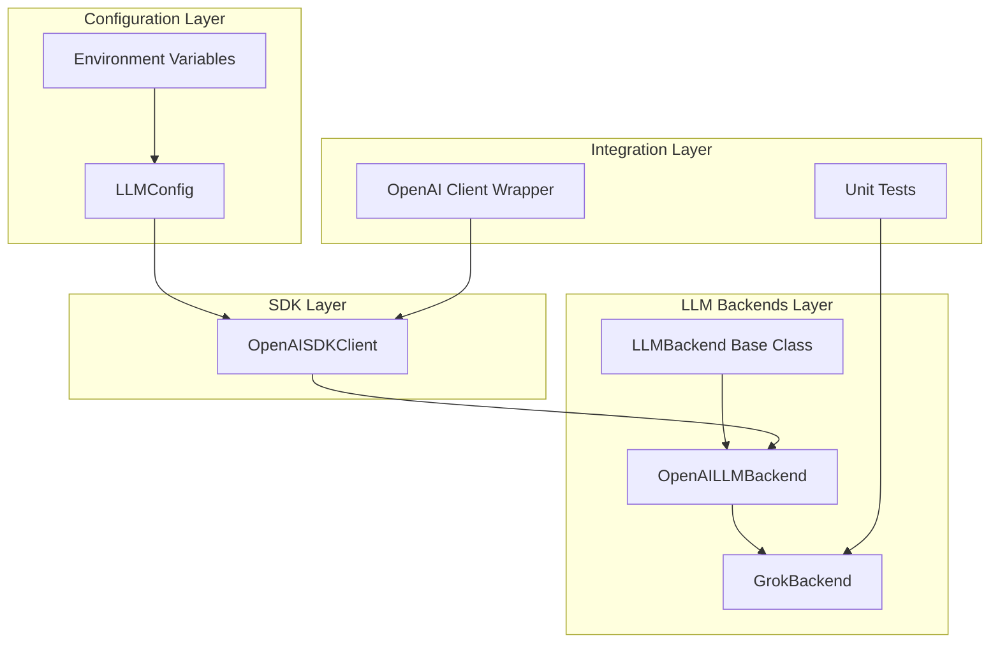
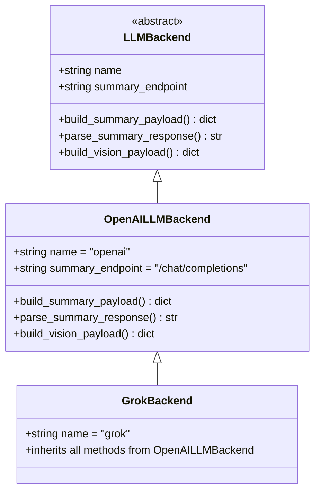
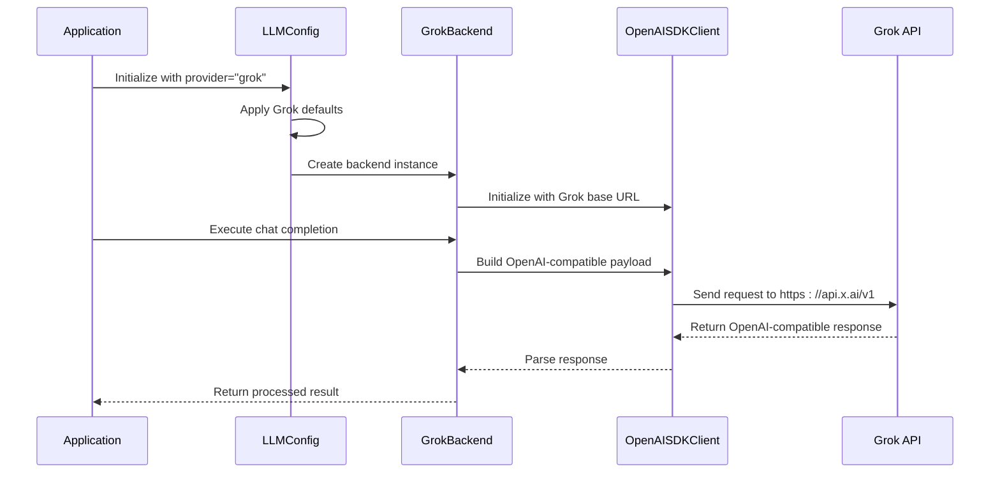
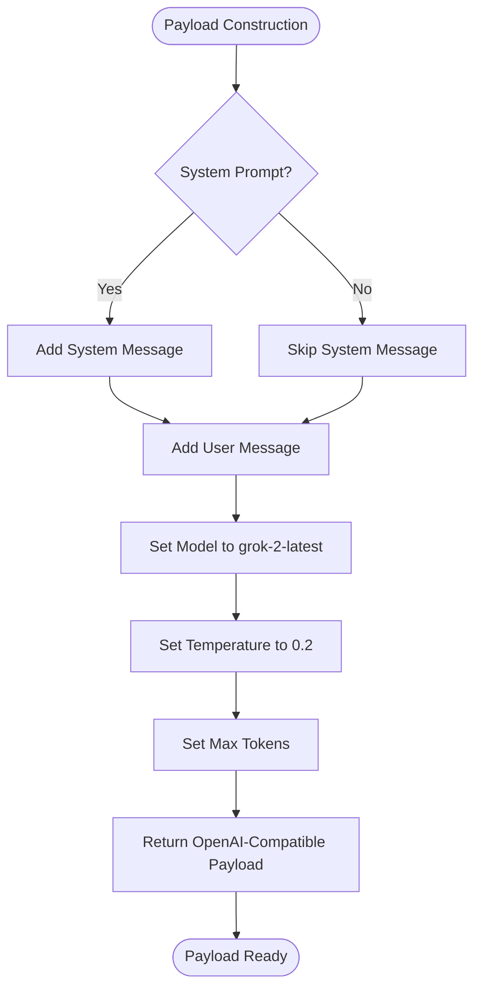
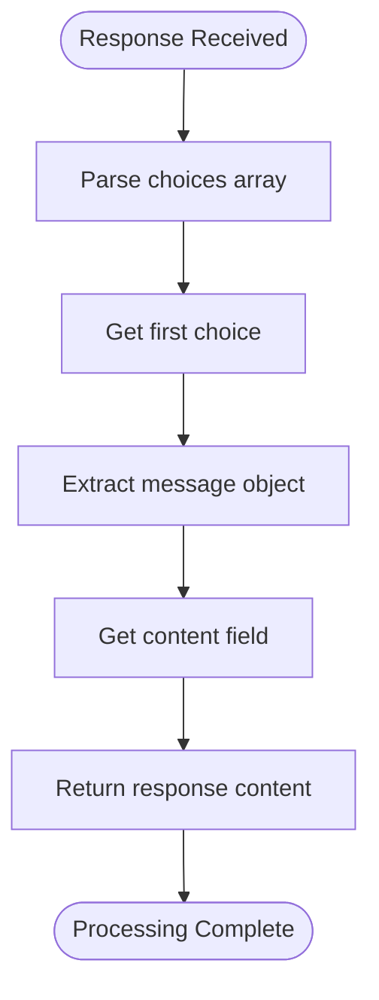

# Grok Backend Implementation

<cite>
**Referenced Files in This Document**
- [grok.py](file://src/memu/llm/backends/grok.py)
- [openai.py](file://src/memu/llm/backends/openai.py)
- [base.py](file://src/memu/llm/backends/base.py)
- [openai_sdk.py](file://src/memu/llm/openai_sdk.py)
- [settings.py](file://src/memu/app/settings.py)
- [grok.md](file://docs/providers/grok.md)
- [grok.md](file://docs/integrations/grok.md)
- [test_grok_provider.py](file://tests/llm/test_grok_provider.py)
- [openai_wrapper.py](file://src/memu/client/openai_wrapper.py)
</cite>

## Table of Contents
1. [Introduction](#introduction)
2. [Project Structure](#project-structure)
3. [Core Components](#core-components)
4. [Architecture Overview](#architecture-overview)
5. [Detailed Component Analysis](#detailed-component-analysis)
6. [Grok-Specific Features and Limitations](#grok-specific-features-and-limitations)
7. [Configuration and Authentication](#configuration-and-authentication)
8. [Compatibility Considerations](#compatibility-considerations)
9. [Migration Guide](#migration-guide)
10. [Troubleshooting Guide](#troubleshooting-guide)
11. [Conclusion](#conclusion)

## Introduction

The Grok backend implementation in memU provides seamless integration with xAI's Grok AI service, offering developers a drop-in replacement for OpenAI-compatible APIs. This implementation leverages the existing OpenAI-compatible infrastructure while introducing Grok-specific configurations and defaults.

Grok, developed by Elon Musk's xAI, represents a unique approach to AI assistance with distinct characteristics that differentiate it from standard OpenAI services. The memU implementation recognizes these differences while maintaining API compatibility to minimize migration effort for existing applications.

## Project Structure

The Grok backend implementation follows a modular architecture that extends the existing OpenAI-compatible infrastructure:



**Diagram sources**
- [grok.py](file://src/memu/llm/backends/grok.py#L1-L12)
- [openai.py](file://src/memu/llm/backends/openai.py#L1-L65)
- [base.py](file://src/memu/llm/backends/base.py#L1-L31)
- [openai_sdk.py](file://src/memu/llm/openai_sdk.py#L1-L219)
- [settings.py](file://src/memu/app/settings.py#L128-L138)

**Section sources**
- [grok.py](file://src/memu/llm/backends/grok.py#L1-L12)
- [openai.py](file://src/memu/llm/backends/openai.py#L1-L65)
- [base.py](file://src/memu/llm/backends/base.py#L1-L31)

## Core Components

### GrokBackend Class

The GrokBackend class serves as a specialized implementation that inherits all functionality from the OpenAILLMBackend while providing Grok-specific defaults and configuration.



**Diagram sources**
- [base.py](file://src/memu/llm/backends/base.py#L6-L31)
- [openai.py](file://src/memu/llm/backends/openai.py#L8-L65)
- [grok.py](file://src/memu/llm/backends/grok.py#L6-L12)

### OpenAISDKClient

The OpenAISDKClient provides the foundation for all OpenAI-compatible API interactions, including Grok integration:

- **Asynchronous Operations**: Built on top of the official AsyncOpenAI client
- **Standard Payload Format**: Uses OpenAI-compatible request structures
- **Response Parsing**: Handles standardized response formats
- **Batch Processing**: Supports embedding batch operations

**Section sources**
- [openai_sdk.py](file://src/memu/llm/openai_sdk.py#L20-L38)

## Architecture Overview

The Grok backend architecture maintains strict compatibility with OpenAI's API while introducing Grok-specific configurations:



**Diagram sources**
- [settings.py](file://src/memu/app/settings.py#L128-L138)
- [grok.py](file://src/memu/llm/backends/grok.py#L6-L12)
- [openai_sdk.py](file://src/memu/llm/openai_sdk.py#L37-L64)

## Detailed Component Analysis

### Configuration Management

The LLMConfig class automatically applies Grok-specific defaults when the provider is set to "grok":

| Configuration Parameter | OpenAI Default | Grok Default |
|------------------------|----------------|--------------|
| Base URL | `https://api.openai.com/v1` | `https://api.x.ai/v1` |
| API Key Environment | `OPENAI_API_KEY` | `XAI_API_KEY` |
| Chat Model | `gpt-4o-mini` | `grok-2-latest` |

**Section sources**
- [settings.py](file://src/memu/app/settings.py#L128-L138)

### Payload Construction

Grok maintains full OpenAI-compatible payload structure, enabling seamless migration:



**Diagram sources**
- [openai.py](file://src/memu/llm/backends/openai.py#L14-L26)

### Response Processing

Grok responses follow the standard OpenAI format, ensuring compatibility:



**Diagram sources**
- [openai.py](file://src/memu/llm/backends/openai.py#L28-L29)

**Section sources**
- [openai.py](file://src/memu/llm/backends/openai.py#L14-L29)

### Testing Framework

The implementation includes comprehensive unit tests validating Grok-specific behavior:

- **Default Configuration**: Verifies automatic Grok defaults application
- **Client Initialization**: Ensures proper base URL configuration
- **Response Parsing**: Validates OpenAI-compatible response handling

**Section sources**
- [test_grok_provider.py](file://tests/llm/test_grok_provider.py#L9-L46)

## Grok-Specific Features and Limitations

### Unique Characteristics

1. **API Endpoint**: Uses `https://api.x.ai/v1` instead of OpenAI's `https://api.openai.com/v1`
2. **Authentication**: Requires `XAI_API_KEY` environment variable
3. **Model Selection**: Defaults to `grok-2-latest` instead of OpenAI models
4. **Response Format**: Maintains full OpenAI-compatible response structure

### Current Model Support

The implementation currently supports:
- **grok-2-latest** (Default)

### Limitations

- **Vision Capabilities**: Not explicitly documented in current implementation
- **Audio Processing**: Not supported in current integration
- **Custom Endpoints**: Limited to standard chat completions

**Section sources**
- [grok.md](file://docs/providers/grok.md#L27-L30)
- [grok.md](file://docs/integrations/grok.md#L49-L52)

## Configuration and Authentication

### Environment Setup

Grok requires a single environment variable for authentication:

```bash
export XAI_API_KEY="xai-YOUR_ACTUAL_API_KEY_HERE"
```

### Configuration Options

Applications can configure Grok through multiple approaches:

1. **Direct Configuration**: Set provider to "grok" in LLMConfig
2. **Environment Variables**: Use XAI_API_KEY for API key
3. **Manual Overrides**: Override defaults when needed

### Default Values

When provider is set to "grok", the system automatically applies:

- **Base URL**: `https://api.x.ai/v1`
- **API Key**: `XAI_API_KEY`
- **Chat Model**: `grok-2-latest`

**Section sources**
- [grok.md](file://docs/providers/grok.md#L17-L30)
- [grok.md](file://docs/integrations/grok.md#L10-L24)
- [settings.py](file://src/memu/app/settings.py#L128-L138)

## Compatibility Considerations

### OpenAI vs Grok Differences

| Aspect | OpenAI | Grok |
|--------|--------|------|
| **Base URL** | `https://api.openai.com/v1` | `https://api.x.ai/v1` |
| **API Key Var** | `OPENAI_API_KEY` | `XAI_API_KEY` |
| **Default Model** | `gpt-4o-mini` | `grok-2-latest` |
| **Endpoint** | `/v1/chat/completions` | `/v1/chat/completions` |
| **Response Format** | Standard OpenAI | Standard OpenAI |

### Migration Benefits

1. **Zero Code Changes**: Same API surface as OpenAI
2. **Automatic Configuration**: Seamless default switching
3. **Full Compatibility**: Existing OpenAI code works unchanged

### Potential Compatibility Issues

1. **Model Availability**: Grok models may have different availability
2. **Rate Limits**: Different rate limiting policies apply
3. **Feature Parity**: Some OpenAI-specific features may not be available

**Section sources**
- [settings.py](file://src/memu/app/settings.py#L128-L138)

## Migration Guide

### From OpenAI to Grok

1. **Update Provider Configuration**:
   ```python
   # Change from:
   config = LLMConfig(provider="openai")
   
   # To:
   config = LLMConfig(provider="grok")
   ```

2. **Update Environment Variables**:
   ```bash
   # Change from:
   export OPENAI_API_KEY="sk-..."
   
   # To:
   export XAI_API_KEY="xai-..."
   ```

3. **Verify Defaults**: Confirm automatic configuration changes

### From Grok to OpenAI

1. **Reverse Provider Configuration**:
   ```python
   config = LLMConfig(provider="openai")
   ```

2. **Reverse Environment Variables**:
   ```bash
   export OPENAI_API_KEY="sk-..."
   ```

3. **Maintain API Compatibility**: No code changes required

### Best Practices

1. **Environment Management**: Use separate environment files for different providers
2. **Testing**: Validate migration with unit tests
3. **Monitoring**: Track response times and error rates
4. **Fallback Strategy**: Implement graceful degradation if Grok becomes unavailable

## Troubleshooting Guide

### Common Issues

#### Authentication Problems
- **Issue**: `401 Unauthorized` errors
- **Solution**: Verify `XAI_API_KEY` environment variable is set correctly
- **Verification**: Test API key validity through xAI console

#### Connection Issues
- **Issue**: Unable to reach `https://api.x.ai/v1`
- **Solution**: Check network connectivity and firewall settings
- **Verification**: Test with curl command to the base URL

#### Model Availability
- **Issue**: `404 Model not found` errors
- **Solution**: Override model name in configuration
- **Example**: Use `grok-beta` or other available models

### Debugging Steps

1. **Verify Configuration**: Check LLMConfig defaults
2. **Test API Connectivity**: Validate base URL accessibility
3. **Monitor Response Times**: Track API latency
4. **Review Logs**: Check for detailed error messages

**Section sources**
- [grok.md](file://docs/providers/grok.md#L51-L66)

## Conclusion

The Grok backend implementation in memU provides a seamless bridge between OpenAI-compatible applications and xAI's Grok service. By leveraging inheritance from the OpenAILLMBackend, the implementation maintains full API compatibility while introducing Grok-specific configurations through the LLMConfig system.

Key benefits of this approach include:

- **Zero Migration Effort**: Existing OpenAI code works unchanged
- **Automatic Configuration**: Intelligent default switching based on provider selection
- **Comprehensive Testing**: Unit tests validate all Grok-specific functionality
- **Flexible Deployment**: Support for both environment variables and programmatic configuration

The implementation successfully addresses the unique characteristics of Grok while maintaining the reliability and compatibility that developers expect from OpenAI-compatible services. As Grok continues to evolve, the modular architecture ensures that future enhancements can be integrated with minimal disruption to existing applications.