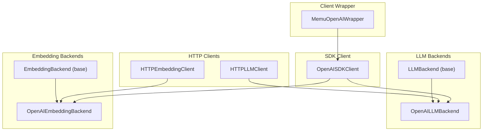
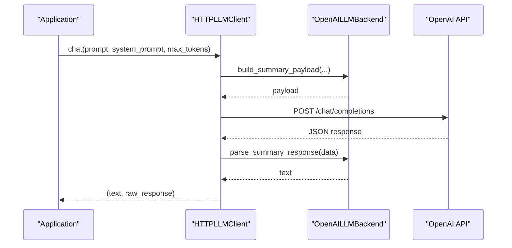
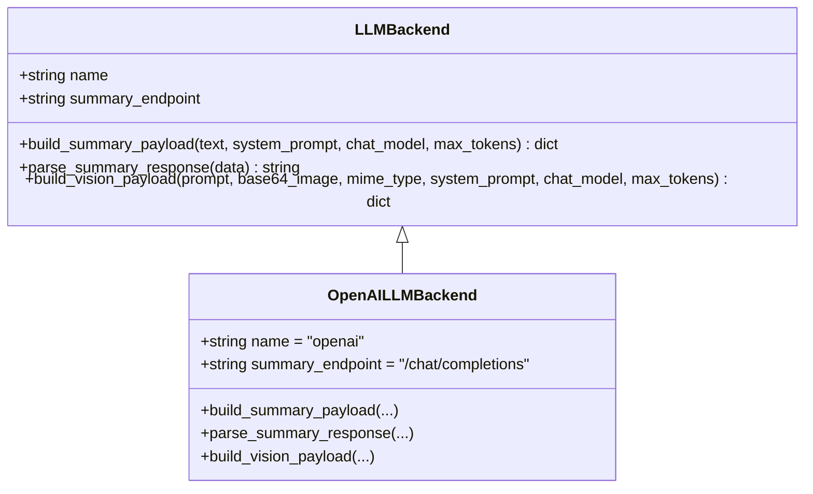
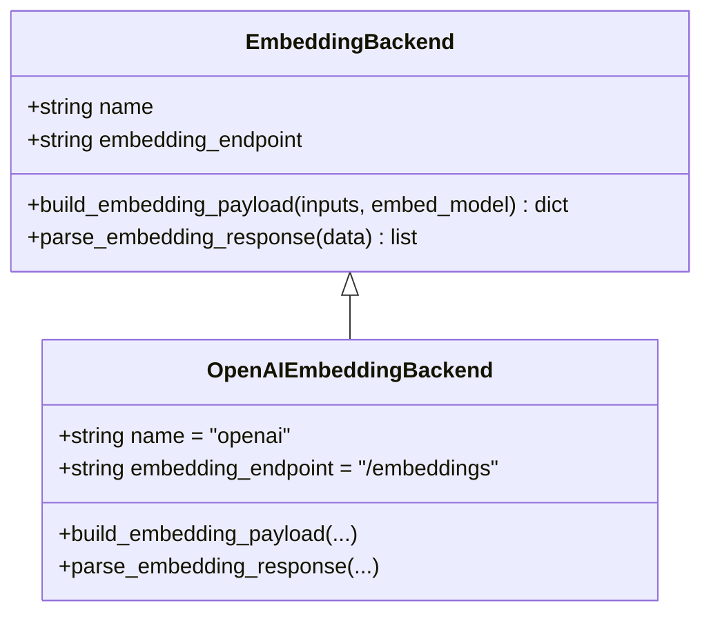
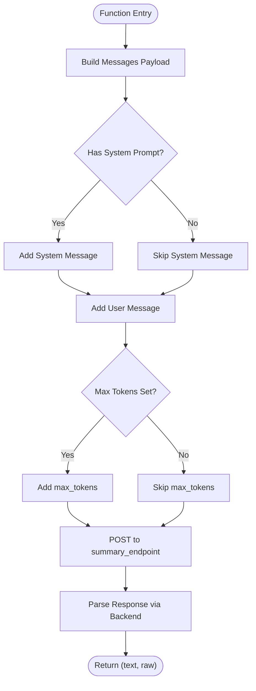
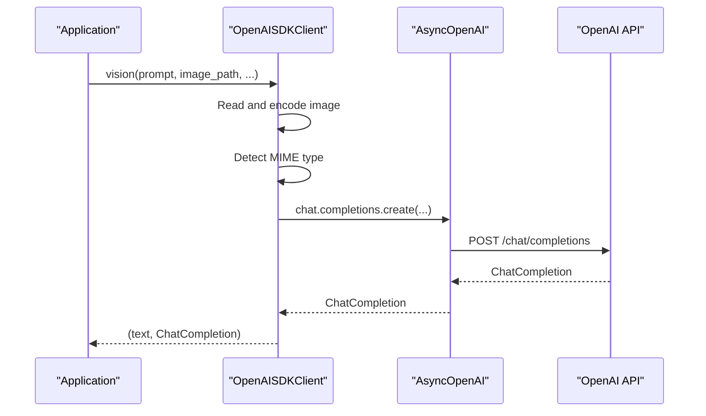
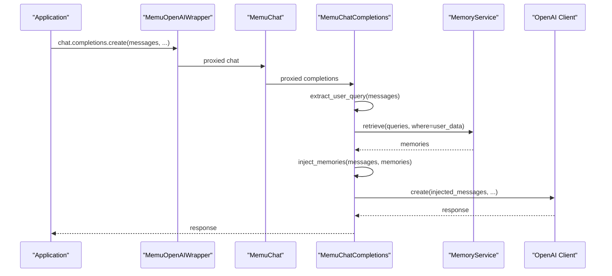
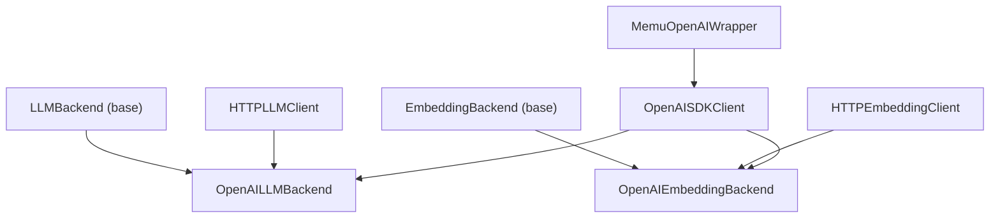

# OpenAI Backend Implementation

<cite>
**Referenced Files in This Document**
- [openai.py](file://src/memu/llm/backends/openai.py)
- [openai_sdk.py](file://src/memu/llm/openai_sdk.py)
- [openai.py](file://src/memu/embedding/backends/openai.py)
- [base.py](file://src/memu/llm/backends/base.py)
- [base.py](file://src/memu/embedding/backends/base.py)
- [http_client.py](file://src/memu/llm/http_client.py)
- [http_client.py](file://src/memu/embedding/http_client.py)
- [openai_wrapper.py](file://src/memu/client/openai_wrapper.py)
- [getting_started.md](file://docs/tutorials/getting_started.md)
- [README.md](file://README.md)
</cite>

## Table of Contents
1. [Introduction](#introduction)
2. [Project Structure](#project-structure)
3. [Core Components](#core-components)
4. [Architecture Overview](#architecture-overview)
5. [Detailed Component Analysis](#detailed-component-analysis)
6. [Dependency Analysis](#dependency-analysis)
7. [Performance Considerations](#performance-considerations)
8. [Troubleshooting Guide](#troubleshooting-guide)
9. [Conclusion](#conclusion)

## Introduction
This document provides comprehensive technical documentation for the OpenAI backend implementation within the memU framework. It explains how the system integrates with OpenAI-compatible APIs for text completion and vision capabilities, details payload construction and response parsing, and covers authentication, endpoint configuration, and rate-limiting considerations. Practical configuration examples and best practices are included to help developers integrate OpenAI APIs seamlessly within memU.

## Project Structure
The OpenAI backend implementation spans several modules:
- LLM backends: Define OpenAI-compatible payload construction and response parsing for chat completions and vision.
- Embedding backends: Provide OpenAI-compatible embedding payload construction and response parsing.
- HTTP clients: Encapsulate HTTP communication, endpoint routing, authentication, and response handling for both LLM and embedding APIs.
- SDK client: Leverages the official OpenAI Python SDK for advanced features like audio transcription.
- Client wrapper: Adds automatic memory recall injection to OpenAI chat completions.

**Diagram sources**
- [openai.py](file://src/memu/llm/backends/openai.py#L8-L65)
- [openai.py](file://src/memu/embedding/backends/openai.py#L8-L19)
- [http_client.py](file://src/memu/llm/http_client.py#L80-L301)
- [http_client.py](file://src/memu/embedding/http_client.py#L27-L150)
- [openai_sdk.py](file://src/memu/llm/openai_sdk.py#L20-L219)
- [openai_wrapper.py](file://src/memu/client/openai_wrapper.py#L155-L269)

**Section sources**
- [openai.py](file://src/memu/llm/backends/openai.py#L1-L65)
- [openai.py](file://src/memu/embedding/backends/openai.py#L1-L19)
- [http_client.py](file://src/memu/llm/http_client.py#L1-L301)
- [http_client.py](file://src/memu/embedding/http_client.py#L1-L150)
- [openai_sdk.py](file://src/memu/llm/openai_sdk.py#L1-L219)
- [openai_wrapper.py](file://src/memu/client/openai_wrapper.py#L1-L269)

## Core Components
- OpenAILLMBackend: Implements OpenAI-compatible payload construction for chat summarization and vision, and response parsing for text completions.
- OpenAIEmbeddingBackend: Implements OpenAI-compatible embedding payload construction and response parsing.
- HTTPLLMClient: HTTP client for LLM APIs (chat, vision, transcription) with endpoint routing, authentication, and response handling.
- HTTPEmbeddingClient: HTTP client for embedding APIs with endpoint routing and response handling.
- OpenAISDKClient: Official OpenAI SDK client for advanced features like audio transcription and structured response handling.
- MemuOpenAIWrapper: Wraps OpenAI client to inject recalled memories into prompts automatically.

Key responsibilities:
- Parameter mapping from generic interface to OpenAI-specific formats.
- Authentication via Authorization header with API key.
- Endpoint configuration for chat, embeddings, and audio transcription.
- Response parsing for extracting generated text from OpenAI JSON responses.
- Rate limiting considerations through timeouts and optional proxy support.

**Section sources**
- [openai.py](file://src/memu/llm/backends/openai.py#L8-L65)
- [openai.py](file://src/memu/embedding/backends/openai.py#L8-L19)
- [http_client.py](file://src/memu/llm/http_client.py#L80-L301)
- [http_client.py](file://src/memu/embedding/http_client.py#L27-L150)
- [openai_sdk.py](file://src/memu/llm/openai_sdk.py#L20-L219)
- [openai_wrapper.py](file://src/memu/client/openai_wrapper.py#L155-L269)

## Architecture Overview
The OpenAI backend architecture consists of two primary pathways:
- HTTP-based integration via HTTPLLMClient and HTTPEmbeddingClient for standard OpenAI-compatible endpoints.
- SDK-based integration via OpenAISDKClient for advanced features requiring the official SDK.

**Diagram sources**
- [http_client.py](file://src/memu/llm/http_client.py#L119-L146)
- [openai.py](file://src/memu/llm/backends/openai.py#L14-L29)

**Section sources**
- [http_client.py](file://src/memu/llm/http_client.py#L80-L160)
- [openai.py](file://src/memu/llm/backends/openai.py#L8-L30)

## Detailed Component Analysis

### OpenAILLMBackend
Implements OpenAI-compatible payload construction and response parsing:
- build_summary_payload: Creates a minimal chat payload with system and user messages, sets temperature and max_tokens.
- parse_summary_response: Extracts generated text from choices[0].message.content.
- build_vision_payload: Constructs a multi-part user message containing text and image_url parts, with proper MIME type and base64 encoding.

**Diagram sources**
- [base.py](file://src/memu/llm/backends/base.py#L6-L31)
- [openai.py](file://src/memu/llm/backends/openai.py#L8-L65)

**Section sources**
- [openai.py](file://src/memu/llm/backends/openai.py#L14-L65)
- [base.py](file://src/memu/llm/backends/base.py#L6-L31)

### OpenAIEmbeddingBackend
Implements OpenAI-compatible embedding payload construction and response parsing:
- build_embedding_payload: Returns a payload with model and input array.
- parse_embedding_response: Extracts embedding vectors from data[].embedding.

**Diagram sources**
- [base.py](file://src/memu/embedding/backends/base.py#L6-L17)
- [openai.py](file://src/memu/embedding/backends/openai.py#L8-L19)

**Section sources**
- [openai.py](file://src/memu/embedding/backends/openai.py#L14-L19)
- [base.py](file://src/memu/embedding/backends/base.py#L6-L17)

### HTTPLLMClient
HTTP client for LLM APIs:
- chat: Builds a minimal messages payload and posts to summary_endpoint.
- summarize: Uses OpenAILLMBackend to construct payload and parse response.
- vision: Reads image, detects MIME type, builds multi-part payload, posts to summary_endpoint.
- transcribe: Posts to /v1/audio/transcriptions with multipart/form-data.
- Authentication: Sets Authorization header with API key.
- Endpoint configuration: Supports endpoint overrides for chat and embeddings.

**Diagram sources**
- [http_client.py](file://src/memu/llm/http_client.py#L119-L146)
- [openai.py](file://src/memu/llm/backends/openai.py#L14-L29)

**Section sources**
- [http_client.py](file://src/memu/llm/http_client.py#L80-L278)

### HTTPEmbeddingClient
HTTP client for embedding APIs:
- embed: Posts to embedding_endpoint with model and input array.
- Supports provider-specific embedding backends and endpoint overrides.

**Section sources**
- [http_client.py](file://src/memu/embedding/http_client.py#L27-L150)

### OpenAISDKClient
SDK-based client leveraging the official OpenAI Python SDK:
- chat: Creates chat completions with system and user messages.
- summarize: Creates chat completions with a system prompt derived from input.
- vision: Encodes image as base64, detects MIME type, constructs multi-part message, creates chat completion.
- embed: Creates embeddings via SDK with configurable batch size.
- transcribe: Uses OpenAI Audio API for transcription with configurable response format.

**Diagram sources**
- [openai_sdk.py](file://src/memu/llm/openai_sdk.py#L89-L153)

**Section sources**
- [openai_sdk.py](file://src/memu/llm/openai_sdk.py#L20-L219)

### MemuOpenAIWrapper
Wrapper that injects recalled memories into OpenAI chat completions:
- Extracts the latest user query from messages.
- Retrieves relevant memories via MemoryService.
- Injects memories into the system prompt or creates a new system message.
- Supports both synchronous and asynchronous completion calls.

**Diagram sources**
- [openai_wrapper.py](file://src/memu/client/openai_wrapper.py#L85-L124)

**Section sources**
- [openai_wrapper.py](file://src/memu/client/openai_wrapper.py#L17-L269)

## Dependency Analysis
The OpenAI backend components depend on shared base classes and HTTP clients:
- LLMBackend and EmbeddingBackend define the provider-agnostic interfaces.
- HTTPLLMClient and HTTPEmbeddingClient encapsulate HTTP communication and delegate payload construction and parsing to provider-specific backends.
- OpenAISDKClient depends on the official OpenAI SDK for advanced features.

**Diagram sources**
- [base.py](file://src/memu/llm/backends/base.py#L6-L31)
- [base.py](file://src/memu/embedding/backends/base.py#L6-L17)
- [openai.py](file://src/memu/llm/backends/openai.py#L8-L65)
- [openai.py](file://src/memu/embedding/backends/openai.py#L8-L19)
- [http_client.py](file://src/memu/llm/http_client.py#L80-L301)
- [http_client.py](file://src/memu/embedding/http_client.py#L27-L150)
- [openai_sdk.py](file://src/memu/llm/openai_sdk.py#L20-L219)
- [openai_wrapper.py](file://src/memu/client/openai_wrapper.py#L155-L269)

**Section sources**
- [http_client.py](file://src/memu/llm/http_client.py#L72-L77)
- [http_client.py](file://src/memu/embedding/http_client.py#L21-L24)

## Performance Considerations
- Timeout configuration: Both HTTP clients accept a timeout parameter to prevent hanging requests.
- Proxy support: HTTP clients load proxy settings from environment variables for network reliability.
- Batched embeddings: OpenAISDKClient supports configurable batch sizes for embedding requests.
- Token limits: Payload builders set max_tokens when provided, helping control costs and latency.
- Asynchronous operations: SDK client methods are async, enabling efficient concurrency.

[No sources needed since this section provides general guidance]

## Troubleshooting Guide
Common integration issues and resolutions:
- Missing API key: Ensure OPENAI_API_KEY is set in the environment. The HTTP client sets Authorization: Bearer <api_key>.
- Incorrect base URL: Verify base_url ends with "/" to avoid path resolution issues. The HTTP clients normalize base_url.
- Unsupported provider: Provider selection is validated; ensure provider is supported (e.g., "openai").
- Vision payload issues: Confirm image encoding and MIME type detection; the vision methods handle base64 encoding and MIME type mapping.
- Transcription format: The transcribe method supports multiple response formats; ensure the correct format is selected.

**Section sources**
- [http_client.py](file://src/memu/llm/http_client.py#L279-L287)
- [http_client.py](file://src/memu/llm/http_client.py#L94-L97)
- [http_client.py](file://src/memu/embedding/http_client.py#L43-L44)
- [openai_sdk.py](file://src/memu/llm/openai_sdk.py#L172-L219)

## Conclusion
The OpenAI backend implementation in memU provides a robust, extensible foundation for integrating OpenAI-compatible APIs. It offers both HTTP and SDK-based pathways, supports text completion and vision capabilities, and includes memory recall injection for enhanced contextual awareness. With clear payload construction, standardized response parsing, and comprehensive configuration options, developers can confidently deploy OpenAI-powered features within memU while adhering to best practices for authentication, endpoint configuration, and performance.