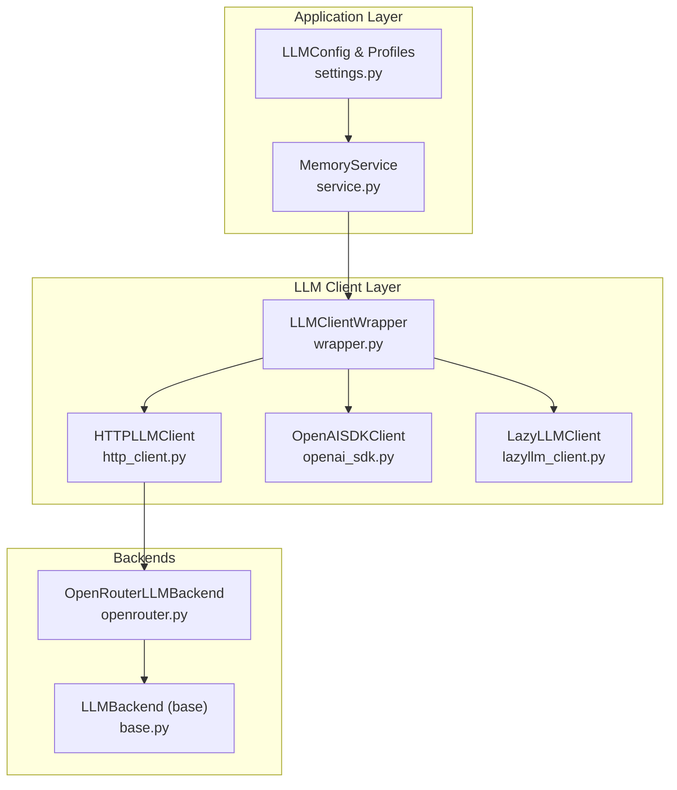
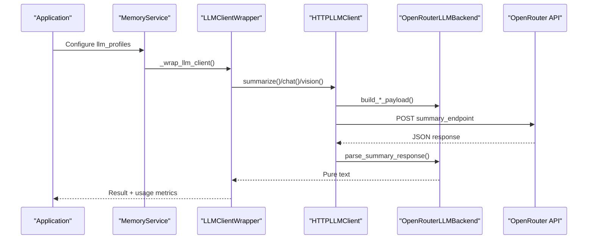
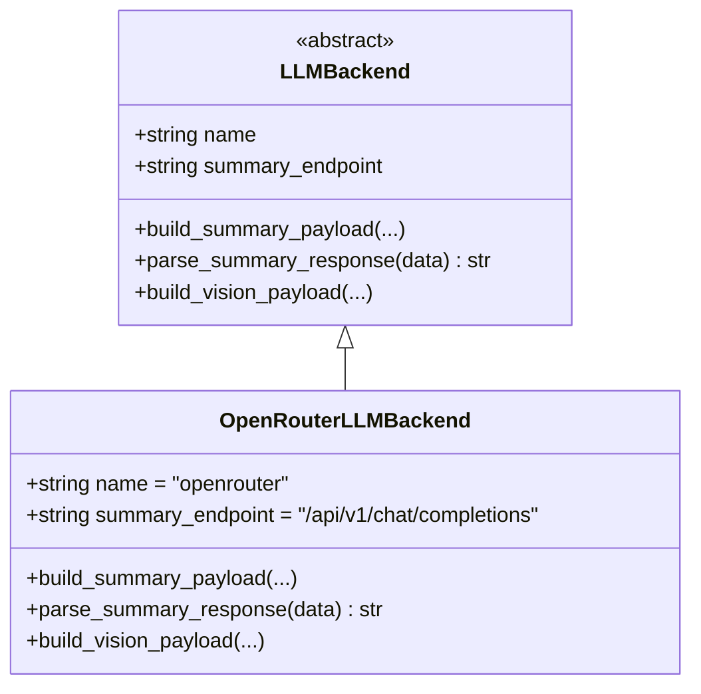
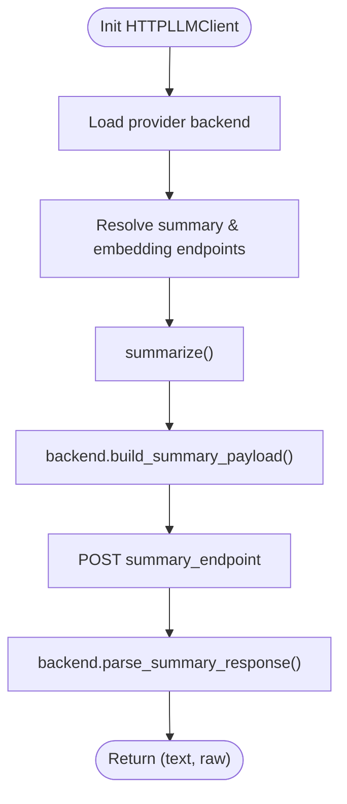
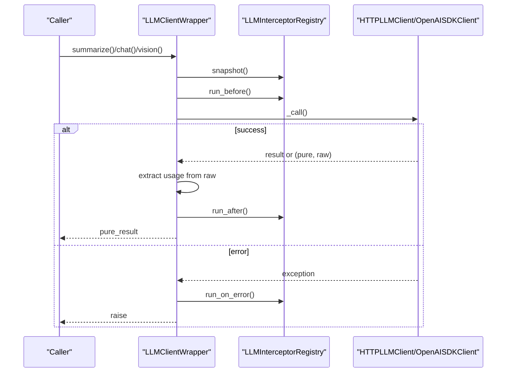
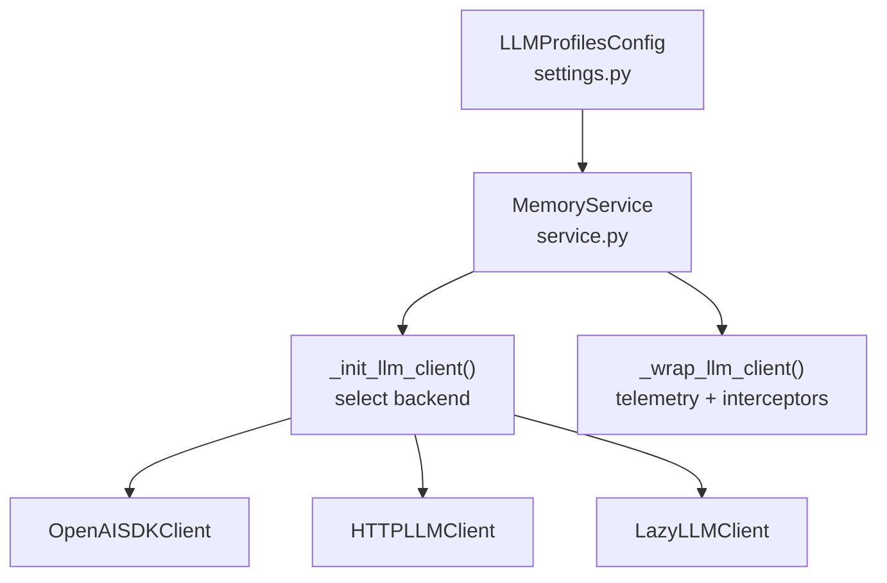
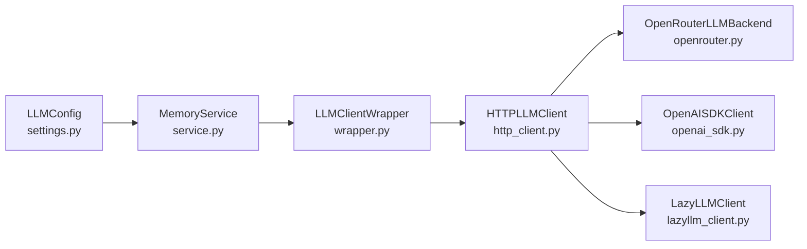

# OpenRouter Backend Implementation

<cite>
**Referenced Files in This Document**
- [openrouter.py](file://src/memu/llm/backends/openrouter.py)
- [base.py](file://src/memu/llm/backends/base.py)
- [http_client.py](file://src/memu/llm/http_client.py)
- [wrapper.py](file://src/memu/llm/wrapper.py)
- [openai_sdk.py](file://src/memu/llm/openai_sdk.py)
- [lazyllm_client.py](file://src/memu/llm/lazyllm_client.py)
- [service.py](file://src/memu/app/service.py)
- [settings.py](file://src/memu/app/settings.py)
- [test_openrouter.py](file://tests/test_openrouter.py)
- [example_4_openrouter_memory.py](file://examples/example_4_openrouter_memory.py)
</cite>

## Table of Contents
1. [Introduction](#introduction)
2. [Project Structure](#project-structure)
3. [Core Components](#core-components)
4. [Architecture Overview](#architecture-overview)
5. [Detailed Component Analysis](#detailed-component-analysis)
6. [Dependency Analysis](#dependency-analysis)
7. [Performance Considerations](#performance-considerations)
8. [Troubleshooting Guide](#troubleshooting-guide)
9. [Conclusion](#conclusion)

## Introduction
This document explains the OpenRouter backend implementation that provides unified access to multiple Large Language Model (LLM) providers through the OpenRouter marketplace API. The backend abstracts provider differences behind a consistent interface, enabling multi-provider routing, flexible configuration, and consistent response handling. It supports chat, summarization, vision, embeddings, and audio transcription with provider-specific payload construction and response parsing.

Key capabilities:
- Unified provider abstraction via pluggable backends
- OpenAI-compatible payload construction and response parsing
- Flexible client backends (HTTPX, SDK, LazyLLM)
- Interceptor-based telemetry and observability
- Configurable provider selection and endpoint overrides

## Project Structure
The OpenRouter integration spans several modules:
- Backends define provider-specific payload construction and response parsing
- HTTP client orchestrates provider selection and endpoint routing
- Wrapper adds telemetry, usage extraction, and interceptor hooks
- Service composes clients, profiles, and workflows
- Settings define configuration schemas for providers and clients

**Diagram sources**
- [service.py](file://src/memu/app/service.py#L97-L136)
- [wrapper.py](file://src/memu/llm/wrapper.py#L226-L353)
- [http_client.py](file://src/memu/llm/http_client.py#L80-L118)
- [openai_sdk.py](file://src/memu/llm/openai_sdk.py#L20-L37)
- [lazyllm_client.py](file://src/memu/llm/lazyllm_client.py#L9-L34)
- [base.py](file://src/memu/llm/backends/base.py#L6-L31)
- [openrouter.py](file://src/memu/llm/backends/openrouter.py#L8-L34)

**Section sources**
- [service.py](file://src/memu/app/service.py#L97-L136)
- [settings.py](file://src/memu/app/settings.py#L102-L127)

## Core Components
- OpenRouterLLMBackend: Implements OpenAI-compatible payload construction and response parsing for chat, summarization, and vision.
- HTTPLLMClient: Selects provider backend, builds endpoints, and executes HTTP requests with configurable timeouts and proxies.
- LLMClientWrapper: Adds telemetry, usage extraction, and interceptor hooks around client calls.
- MemoryService: Composes LLM profiles, initializes clients, and exposes interceptors for observability.
- LLMConfig: Defines provider, base_url, API key, models, and client backend configuration.

Provider selection and routing:
- Provider is chosen via LLMConfig.provider and mapped to a backend factory.
- Endpoint overrides allow targeting OpenRouter marketplace endpoints while preserving compatibility.

**Section sources**
- [openrouter.py](file://src/memu/llm/backends/openrouter.py#L8-L34)
- [http_client.py](file://src/memu/llm/http_client.py#L72-L118)
- [wrapper.py](file://src/memu/llm/wrapper.py#L226-L436)
- [service.py](file://src/memu/app/service.py#L97-L136)
- [settings.py](file://src/memu/app/settings.py#L102-L127)

## Architecture Overview
The OpenRouter backend integrates with the broader LLM stack through a layered design:
- Application layer (MemoryService) manages configuration and client lifecycle
- Wrapper layer adds telemetry and usage extraction
- Client layer executes HTTP calls or SDK invocations
- Backend layer adapts payloads and parses responses

**Diagram sources**
- [service.py](file://src/memu/app/service.py#L168-L189)
- [wrapper.py](file://src/memu/llm/wrapper.py#L247-L272)
- [http_client.py](file://src/memu/llm/http_client.py#L148-L159)
- [openrouter.py](file://src/memu/llm/backends/openrouter.py#L14-L33)

## Detailed Component Analysis

### OpenRouterLLMBackend
Implements provider-specific payload construction and response parsing:
- build_summary_payload: Creates OpenAI-compatible chat payload with system prompt and max_tokens
- parse_summary_response: Extracts assistant text from OpenAI-style choices
- build_vision_payload: Builds multimodal payload with base64 image data and optional system prompt

**Diagram sources**
- [base.py](file://src/memu/llm/backends/base.py#L6-L31)
- [openrouter.py](file://src/memu/llm/backends/openrouter.py#L8-L71)

**Section sources**
- [openrouter.py](file://src/memu/llm/backends/openrouter.py#L14-L71)

### HTTPLLMClient
Provides HTTP-based LLM access with provider selection and endpoint resolution:
- Provider selection via LLM_BACKENDS mapping
- Endpoint resolution with overrides for chat/summary and embeddings
- Payload construction delegated to backend; response parsing delegated to backend
- Embedding backends support OpenAI-compatible endpoints

**Diagram sources**
- [http_client.py](file://src/memu/llm/http_client.py#L80-L118)
- [http_client.py](file://src/memu/llm/http_client.py#L148-L159)
- [openrouter.py](file://src/memu/llm/backends/openrouter.py#L14-L33)

**Section sources**
- [http_client.py](file://src/memu/llm/http_client.py#L72-L118)
- [http_client.py](file://src/memu/llm/http_client.py#L148-L219)

### LLMClientWrapper
Adds telemetry, usage extraction, and interceptor hooks:
- Request/response lifecycle with before/after/on_error interceptors
- Usage extraction from raw responses (tokens, latency, finish reason)
- Support for tuple responses (pure_result, raw_response)

**Diagram sources**
- [wrapper.py](file://src/memu/llm/wrapper.py#L387-L436)
- [wrapper.py](file://src/memu/llm/wrapper.py#L450-L504)
- [wrapper.py](file://src/memu/llm/wrapper.py#L653-L703)

**Section sources**
- [wrapper.py](file://src/memu/llm/wrapper.py#L226-L436)
- [wrapper.py](file://src/memu/llm/wrapper.py#L653-L703)

### MemoryService and Configuration
- MemoryService initializes clients per profile and wraps them with telemetry
- LLMProfilesConfig supports multiple named profiles and default fallback
- Client backend selection among sdk, httpx, and lazyllm_backend

**Diagram sources**
- [settings.py](file://src/memu/app/settings.py#L263-L297)
- [service.py](file://src/memu/app/service.py#L97-L136)
- [service.py](file://src/memu/app/service.py#L168-L189)

**Section sources**
- [service.py](file://src/memu/app/service.py#L97-L136)
- [settings.py](file://src/memu/app/settings.py#L102-L127)

## Dependency Analysis
Provider and client dependencies:
- HTTPLLMClient depends on LLM_BACKENDS for provider selection
- OpenRouterLLMBackend extends LLMBackend contract
- Wrapper depends on registry and interceptor infrastructure
- MemoryService composes configuration, clients, and interceptors

**Diagram sources**
- [settings.py](file://src/memu/app/settings.py#L102-L127)
- [service.py](file://src/memu/app/service.py#L97-L136)
- [wrapper.py](file://src/memu/llm/wrapper.py#L226-L353)
- [http_client.py](file://src/memu/llm/http_client.py#L72-L118)
- [openrouter.py](file://src/memu/llm/backends/openrouter.py#L8-L34)

**Section sources**
- [http_client.py](file://src/memu/llm/http_client.py#L72-L118)
- [openrouter.py](file://src/memu/llm/backends/openrouter.py#L8-L34)

## Performance Considerations
- HTTP client timeouts and proxy support reduce latency spikes and improve reliability
- Usage extraction from raw responses enables cost and performance monitoring
- Embedding backends support batching and streaming where applicable
- LazyLLM backend leverages asynchronous execution for improved throughput

[No sources needed since this section provides general guidance]

## Troubleshooting Guide
Common issues and resolutions:
- Unsupported provider: Ensure provider is registered in LLM_BACKENDS and available in configuration
- Endpoint mismatches: Use endpoint_overrides to align with OpenRouter marketplace paths
- Proxy connectivity: Set MEMU_HTTP_PROXY/HTTP_PROXY/HTTPS_PROXY environment variables
- Usage extraction failures: Raw response parsing is best-effort; errors are logged and ignored

**Section sources**
- [http_client.py](file://src/memu/llm/http_client.py#L282-L300)
- [http_client.py](file://src/memu/llm/http_client.py#L19-L21)
- [wrapper.py](file://src/memu/llm/wrapper.py#L699-L703)

## Conclusion
The OpenRouter backend implementation provides a robust, extensible foundation for multi-provider LLM integration. By abstracting provider differences behind a consistent interface, it enables flexible routing, reliable error handling, and comprehensive observability. The combination of pluggable backends, configurable clients, and interceptor-driven telemetry makes it straightforward to adapt to evolving provider ecosystems while maintaining predictable behavior and performance.