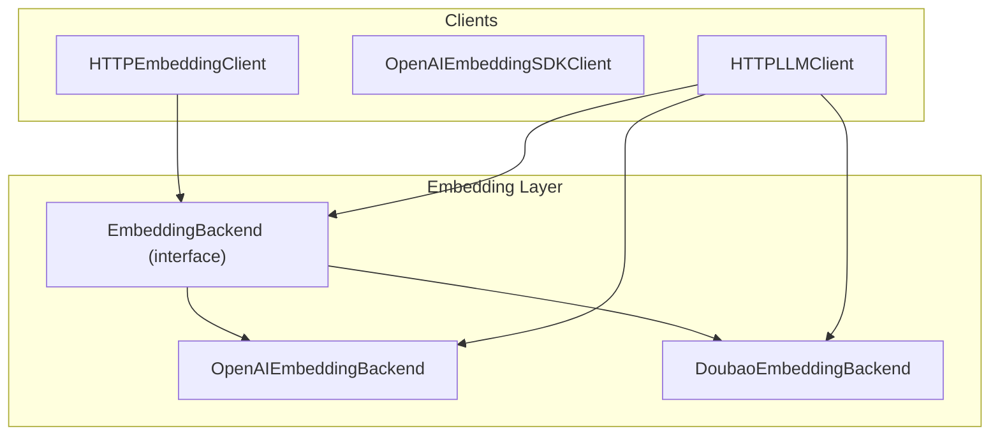
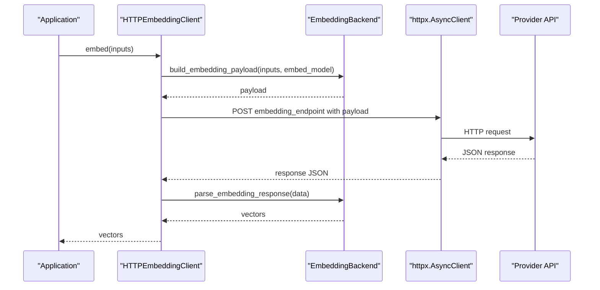
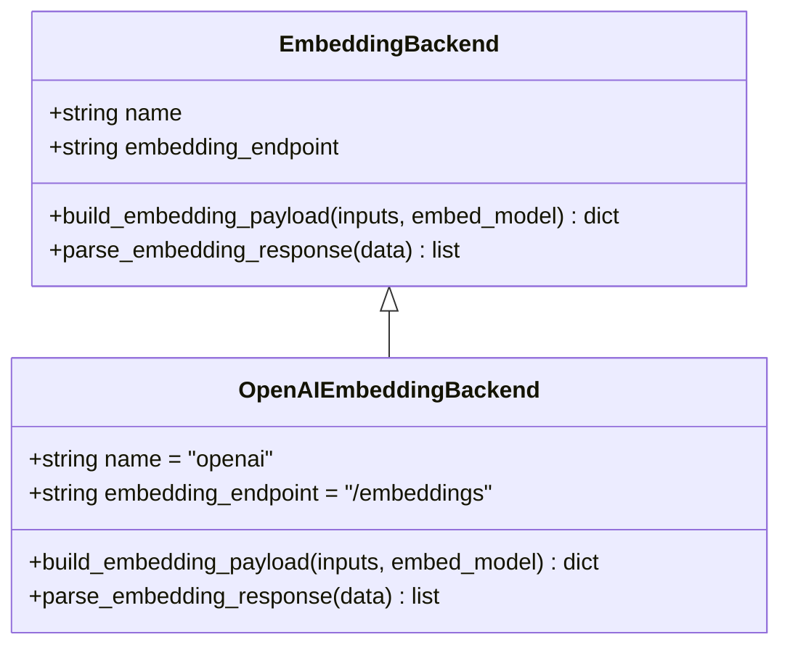
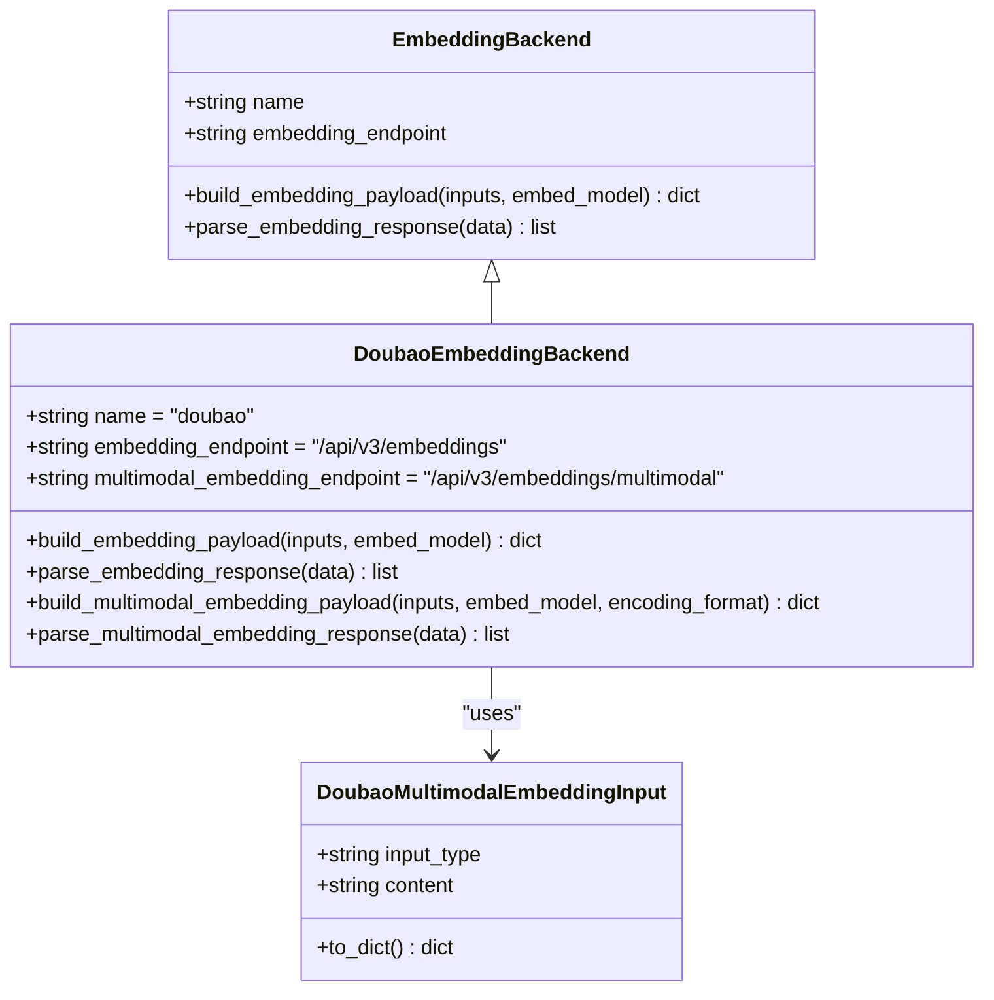
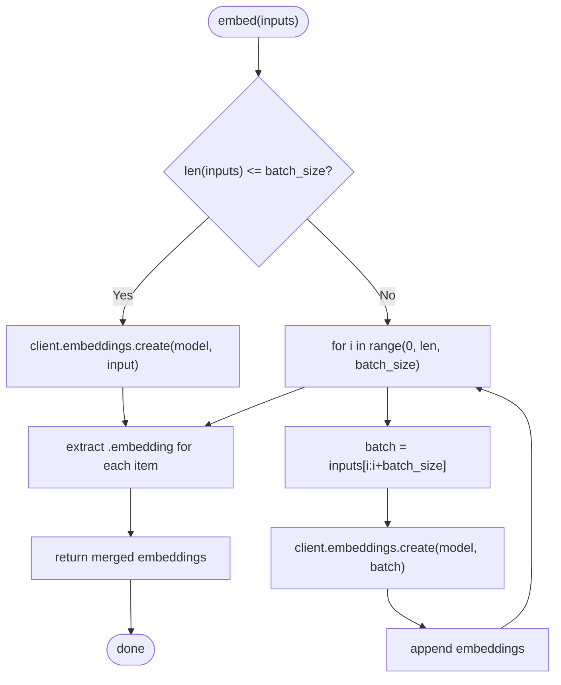
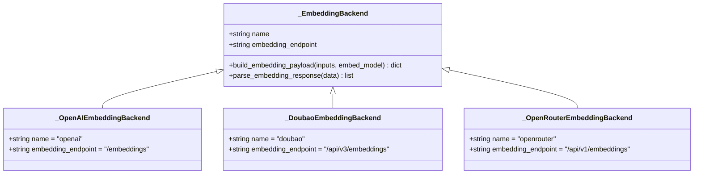
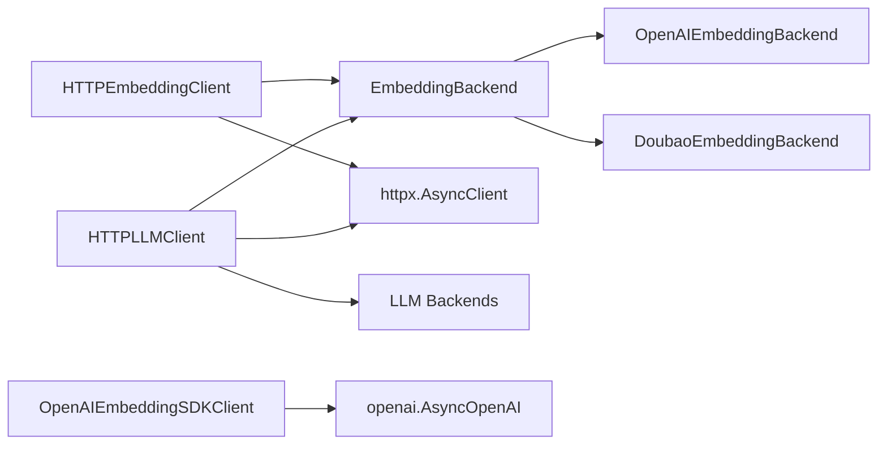

# Embedding Backend System

<cite>
**Referenced Files in This Document**
- [base.py](file://src/memu/embedding/backends/base.py)
- [openai.py](file://src/memu/embedding/backends/openai.py)
- [doubao.py](file://src/memu/embedding/backends/doubao.py)
- [http_client.py](file://src/memu/embedding/http_client.py)
- [openai_sdk.py](file://src/memu/embedding/openai_sdk.py)
- [http_client.py](file://src/memu/llm/http_client.py)
- [_openai.py](file://src/memu/llm/backends/openai.py)
- [_doubao.py](file://src/memu/llm/backends/doubao.py)
- [_openrouter.py](file://src/memu/llm/backends/openrouter.py)
- [test_nebius_provider.py](file://examples/test_nebius_provider.py)
</cite>

## Table of Contents
1. [Introduction](#introduction)
2. [Project Structure](#project-structure)
3. [Core Components](#core-components)
4. [Architecture Overview](#architecture-overview)
5. [Detailed Component Analysis](#detailed-component-analysis)
6. [Dependency Analysis](#dependency-analysis)
7. [Performance Considerations](#performance-considerations)
8. [Troubleshooting Guide](#troubleshooting-guide)
9. [Conclusion](#conclusion)
10. [Appendices](#appendices)

## Introduction
This document describes the embedding backend system that generates vector embeddings across multiple providers. It covers the shared interface, provider-specific implementations for OpenAI-compatible, Doubao, and OpenRouter-compatible APIs, payload construction patterns, response parsing logic, endpoint configuration, and integration with the LLM HTTP client. It also provides guidance on batch processing, performance optimization, embedding dimension consistency, model selection strategies, cost optimization, and troubleshooting.

## Project Structure
The embedding subsystem is organized into:
- Backends: provider-specific implementations of the embedding interface
- HTTP client: asynchronous HTTP client for provider APIs
- OpenAI SDK client: synchronous SDK-based client with built-in batching
- LLM HTTP client: dual-purpose client supporting both LLM and embedding endpoints

**Diagram sources**
- [base.py](file://src/memu/embedding/backends/base.py#L6-L16)
- [openai.py](file://src/memu/embedding/backends/openai.py#L8-L18)
- [doubao.py](file://src/memu/embedding/backends/doubao.py#L31-L72)
- [http_client.py](file://src/memu/embedding/http_client.py#L27-L149)
- [openai_sdk.py](file://src/memu/embedding/openai_sdk.py#L9-L44)
- [http_client.py](file://src/memu/llm/http_client.py#L80-L300)

**Section sources**
- [base.py](file://src/memu/embedding/backends/base.py#L1-L17)
- [openai.py](file://src/memu/embedding/backends/openai.py#L1-L19)
- [doubao.py](file://src/memu/embedding/backends/doubao.py#L1-L73)
- [http_client.py](file://src/memu/embedding/http_client.py#L1-L150)
- [openai_sdk.py](file://src/memu/embedding/openai_sdk.py#L1-L44)
- [http_client.py](file://src/memu/llm/http_client.py#L1-L301)

## Core Components
- EmbeddingBackend: defines the provider-agnostic interface for building payloads and parsing responses
- OpenAIEmbeddingBackend: OpenAI-compatible payload/response handling
- DoubaoEmbeddingBackend: standard and multimodal embedding support with dedicated endpoints
- HTTPEmbeddingClient: asynchronous HTTP client with provider selection, endpoint override, and proxy support
- OpenAIEmbeddingSDKClient: SDK-based client with internal batching for large input lists
- HTTPLLMClient: LLM client that also exposes embedding capability via a minimal internal embedding backend

Key responsibilities:
- Payload construction: transform a list of input strings and a model identifier into provider-specific JSON bodies
- Response parsing: extract embedding vectors from provider responses
- Endpoint resolution: derive endpoints from backend defaults or overrides
- Provider selection: choose backend implementation by provider name
- Multimodal support: Doubao backend supports mixed text/image/video inputs

**Section sources**
- [base.py](file://src/memu/embedding/backends/base.py#L6-L16)
- [openai.py](file://src/memu/embedding/backends/openai.py#L8-L18)
- [doubao.py](file://src/memu/embedding/backends/doubao.py#L31-L72)
- [http_client.py](file://src/memu/embedding/http_client.py#L27-L149)
- [openai_sdk.py](file://src/memu/embedding/openai_sdk.py#L9-L44)
- [http_client.py](file://src/memu/llm/http_client.py#L23-L67)

## Architecture Overview
The embedding system supports two execution modes:
- Standalone HTTP client: HTTPEmbeddingClient for pure embedding tasks
- Integrated LLM client: HTTPLLMClient that also performs embeddings using a minimal internal embedding backend

**Diagram sources**
- [http_client.py](file://src/memu/embedding/http_client.py#L60-L76)
- [base.py](file://src/memu/embedding/backends/base.py#L12-L16)

## Detailed Component Analysis

### EmbeddingBackend Interface
- Purpose: define the contract for provider-specific embedding implementations
- Methods:
  - build_embedding_payload: construct request body from inputs and model
  - parse_embedding_response: extract embedding vectors from response JSON

Implementation notes:
- The interface is provider-agnostic and delegates payload/response handling to concrete backends

**Section sources**
- [base.py](file://src/memu/embedding/backends/base.py#L6-L16)

### OpenAI-Compatible Embedding Backend
- Provider: OpenAI and compatible providers (e.g., Nebius)
- Endpoint: /embeddings
- Payload: {"model": embed_model, "input": inputs}
- Response parsing: extracts "embedding" from each element under "data"

**Diagram sources**
- [base.py](file://src/memu/embedding/backends/base.py#L6-L16)
- [openai.py](file://src/memu/embedding/backends/openai.py#L8-L18)

**Section sources**
- [openai.py](file://src/memu/embedding/backends/openai.py#L8-L18)

### Doubao Embedding Backend
- Providers: Doubao (Volcengine)
- Endpoints:
  - Standard: /api/v3/embeddings
  - Multimodal: /api/v3/embeddings/multimodal
- Payload (standard): {"model": embed_model, "input": inputs, "encoding_format": "float"}
- Payload (multimodal): {"model": embed_model, "encoding_format": encoding_format, "input": [...]}
- Response parsing: same as standard
- Multimodal input builder: DoubaoMultimodalEmbeddingInput converts tuples to provider-specific structures

**Diagram sources**
- [base.py](file://src/memu/embedding/backends/base.py#L6-L16)
- [doubao.py](file://src/memu/embedding/backends/doubao.py#L8-L72)

**Section sources**
- [doubao.py](file://src/memu/embedding/backends/doubao.py#L31-L72)

### HTTPEmbeddingClient
- Responsibilities:
  - Select backend by provider name
  - Resolve endpoint via overrides or backend default
  - Send HTTP requests with Authorization header
  - Parse responses using backend-specific parser
  - Support multimodal embeddings via Doubao backend
- Endpoint override logic:
  - Supports keys: "embeddings", "embedding", "embed"
  - Falls back to backend.default_endpoint
- Proxy support:
  - Loads from MEMU_HTTP_PROXY, HTTP_PROXY, HTTPS_PROXY
- Timeout and base_url normalization:
  - Ensures trailing slash for proper path joining

**Diagram sources**
- [http_client.py](file://src/memu/embedding/http_client.py#L60-L76)

**Section sources**
- [http_client.py](file://src/memu/embedding/http_client.py#L27-L149)

### OpenAIEmbeddingSDKClient
- Purpose: SDK-based client leveraging the official OpenAI async client
- Batch processing:
  - Splits input list into chunks sized by batch_size
  - Processes each chunk and merges results
- Use cases: when provider supports OpenAI-compatible API and you prefer SDK convenience

**Diagram sources**
- [openai_sdk.py](file://src/memu/embedding/openai_sdk.py#L19-L43)

**Section sources**
- [openai_sdk.py](file://src/memu/embedding/openai_sdk.py#L9-L44)

### HTTPLLMClient Embedding Integration
- Internal embedding backends:
  - _OpenAIEmbeddingBackend
  - _DoubaoEmbeddingBackend
  - _OpenRouterEmbeddingBackend (OpenAI-compatible)
- Provider mapping for embedding:
  - "openai": _OpenAIEmbeddingBackend
  - "doubao": _DoubaoEmbeddingBackend
  - "openrouter": _OpenRouterEmbeddingBackend
  - "grok": _OpenAIEmbeddingBackend
- Endpoint resolution mirrors standalone client behavior

**Diagram sources**
- [http_client.py](file://src/memu/llm/http_client.py#L23-L67)

**Section sources**
- [http_client.py](file://src/memu/llm/http_client.py#L23-L67)
- [http_client.py](file://src/memu/llm/http_client.py#L289-L300)

## Dependency Analysis
- Backends depend on the EmbeddingBackend interface
- HTTPEmbeddingClient depends on:
  - EmbeddingBackend implementations
  - httpx.AsyncClient
  - Environment proxy configuration
- HTTPLLMClient depends on:
  - Internal _EmbeddingBackend implementations
  - LLM backends
  - httpx.AsyncClient
- OpenAIEmbeddingSDKClient depends on:
  - openai.AsyncOpenAI

**Diagram sources**
- [base.py](file://src/memu/embedding/backends/base.py#L6-L16)
- [openai.py](file://src/memu/embedding/backends/openai.py#L8-L18)
- [doubao.py](file://src/memu/embedding/backends/doubao.py#L31-L72)
- [http_client.py](file://src/memu/embedding/http_client.py#L10-L12)
- [http_client.py](file://src/memu/llm/http_client.py#L12-L16)
- [openai_sdk.py](file://src/memu/embedding/openai_sdk.py#L4)

**Section sources**
- [http_client.py](file://src/memu/embedding/http_client.py#L10-L12)
- [http_client.py](file://src/memu/llm/http_client.py#L12-L16)
- [openai_sdk.py](file://src/memu/embedding/openai_sdk.py#L4)

## Performance Considerations
- Batch processing:
  - SDK client: configurable batch_size to avoid provider limits
  - HTTP client: no automatic batching; caller should chunk inputs
- Endpoint override:
  - Use endpoint_overrides to target provider-specific endpoints for optimal throughput
- Timeout and proxy:
  - Adjust timeout for slow networks
  - Configure proxy via environment variables for enterprise environments
- Multimodal embeddings:
  - Doubao supports mixed modalities in a single request; leverage when appropriate to reduce round-trips

[No sources needed since this section provides general guidance]

## Troubleshooting Guide
Common issues and resolutions:
- Unsupported provider:
  - Symptom: ValueError indicating unsupported embedding provider
  - Resolution: Use supported provider names ("openai", "doubao", "openrouter", "grok")
- Multimodal embedding misuse:
  - Symptom: TypeError stating multimodal embedding is only supported by "doubao"
  - Resolution: Switch to Doubao provider or use standard embed method
- Endpoint misconfiguration:
  - Symptom: 404 or unexpected response
  - Resolution: Verify base_url and endpoint_overrides; ensure leading slash stripping behavior
- Authentication failure:
  - Symptom: 401 Unauthorized
  - Resolution: Confirm API key and provider base_url correctness
- Proxy connectivity:
  - Symptom: Timeout or connection errors
  - Resolution: Set MEMU_HTTP_PROXY/HTTP_PROXY/HTTPS_PROXY environment variables

**Section sources**
- [http_client.py](file://src/memu/embedding/http_client.py#L144-L149)
- [http_client.py](file://src/memu/embedding/http_client.py#L115-L120)

## Conclusion
The embedding backend system provides a clean abstraction over multiple providers, enabling consistent payload construction and response parsing. The standalone HTTPEmbeddingClient and integrated HTTPLLMClient offer flexible deployment options, while the SDK client simplifies OpenAI-compatible workflows with built-in batching. Proper endpoint configuration, batch sizing, and provider selection are key to achieving performance and cost efficiency.

[No sources needed since this section summarizes without analyzing specific files]

## Appendices

### Provider-Specific Configuration Examples
- OpenAI-compatible providers (e.g., Nebius):
  - Base URL: provider endpoint
  - Embed model: model identifier (e.g., multilingual or dense models)
  - Example reference: [test_nebius_provider.py](file://examples/test_nebius_provider.py#L28-L40)
- Doubao:
  - Base URL: Doubao endpoint
  - Embed model: Doubao embedding model identifier
  - Multimodal: use embed_multimodal with mixed inputs
  - Reference: [doubao.py](file://src/memu/embedding/backends/doubao.py#L31-L72), [http_client.py](file://src/memu/embedding/http_client.py#L78-L139)

### Endpoint Configuration Patterns
- Override embedding endpoint:
  - Use endpoint_overrides with keys "embeddings", "embedding", or "embed"
  - Reference: [http_client.py](file://src/memu/embedding/http_client.py#L48-L56), [http_client.py](file://src/memu/llm/http_client.py#L104-L114)

### Embedding Dimension Consistency
- Choose models with consistent dimensions for downstream similarity/search
- Example models and dimensions are demonstrated in the Nebius test script
  - Reference: [test_nebius_provider.py](file://examples/test_nebius_provider.py#L35-L40)

### Model Selection Strategies
- Cost vs. quality trade-offs:
  - Smaller/cheaper models for bulk indexing
  - Larger/higher-quality models for precision retrieval
- Multilingual vs. monolingual:
  - Select based on corpus language distribution
- Provider compatibility:
  - Prefer OpenAI-compatible APIs for broad ecosystem support

[No sources needed since this section provides general guidance]