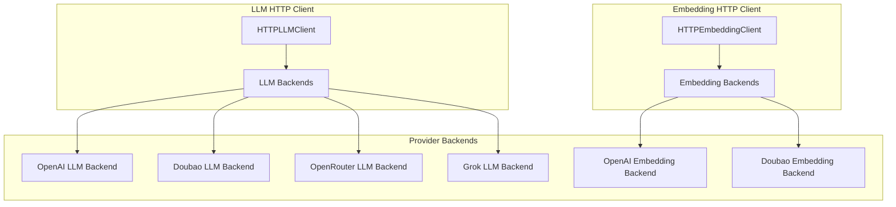
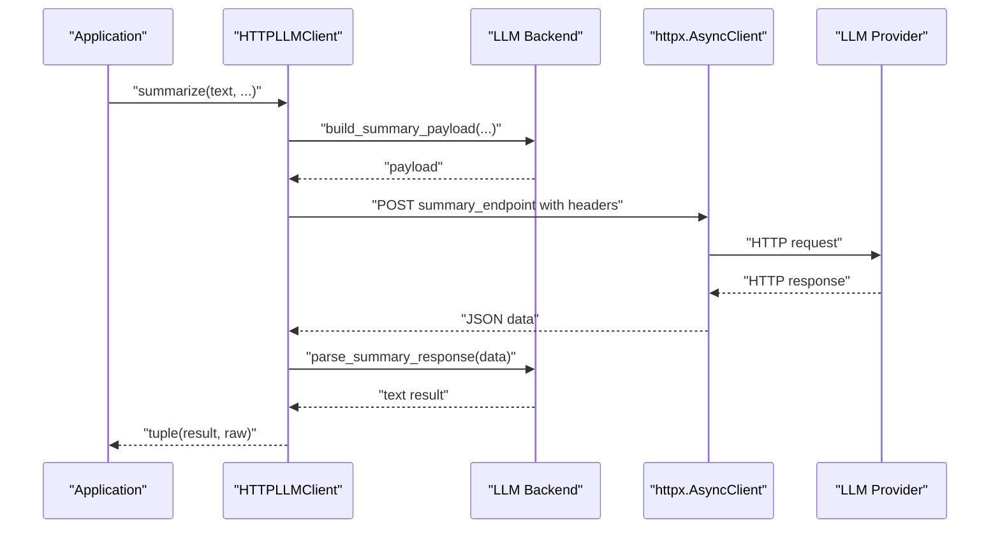
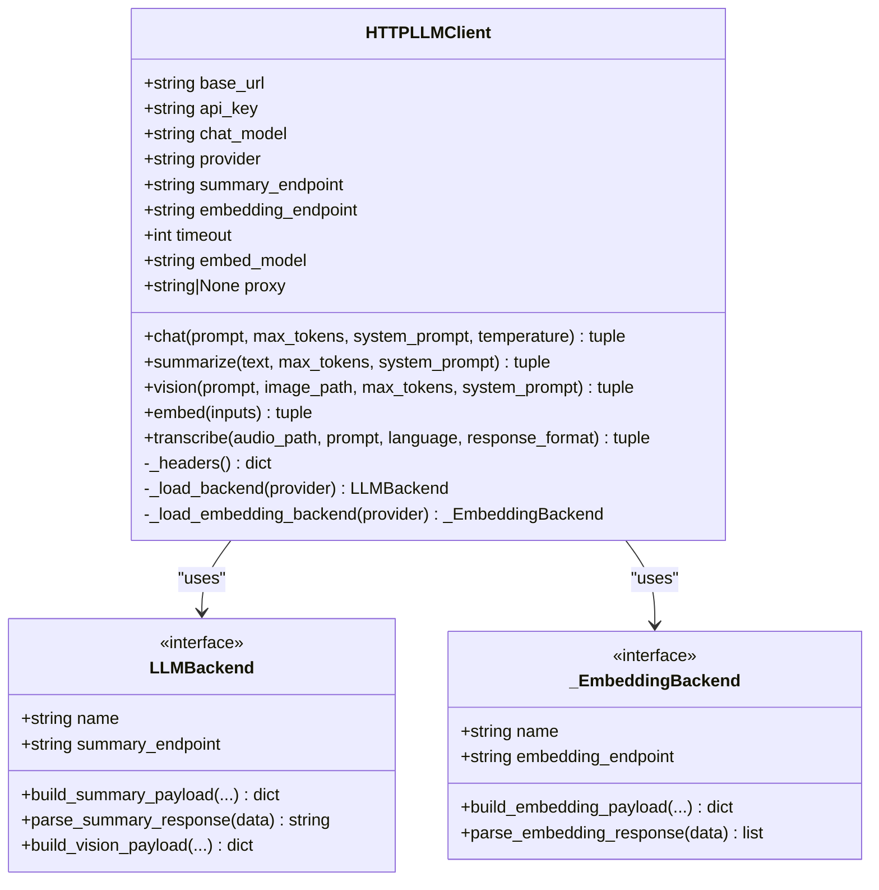
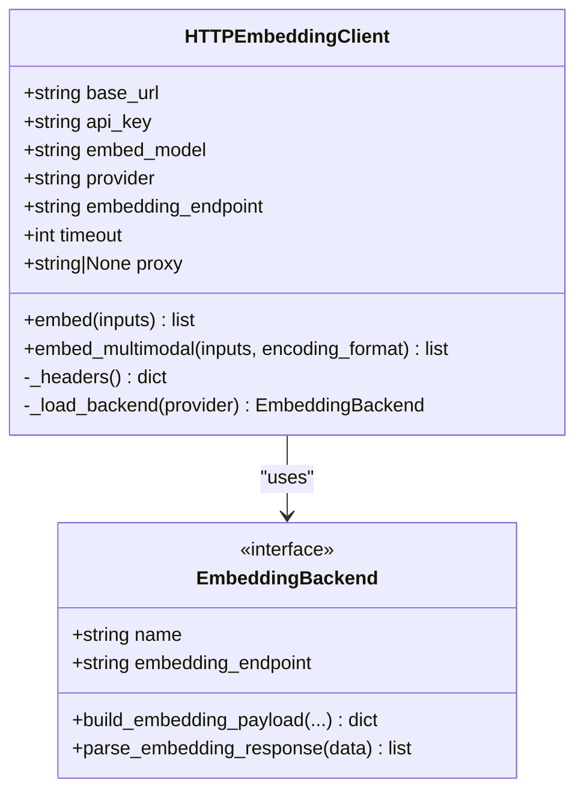
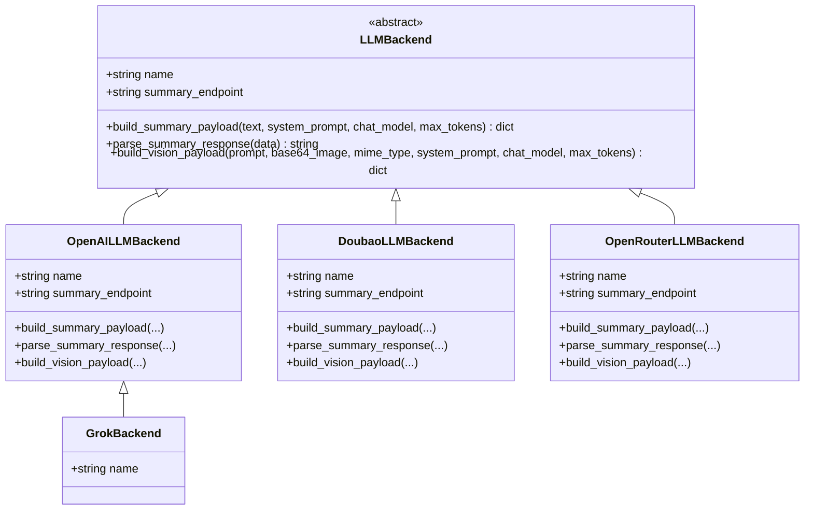
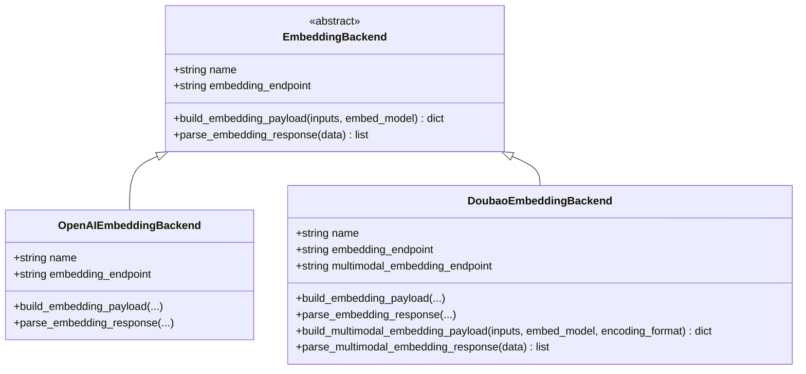
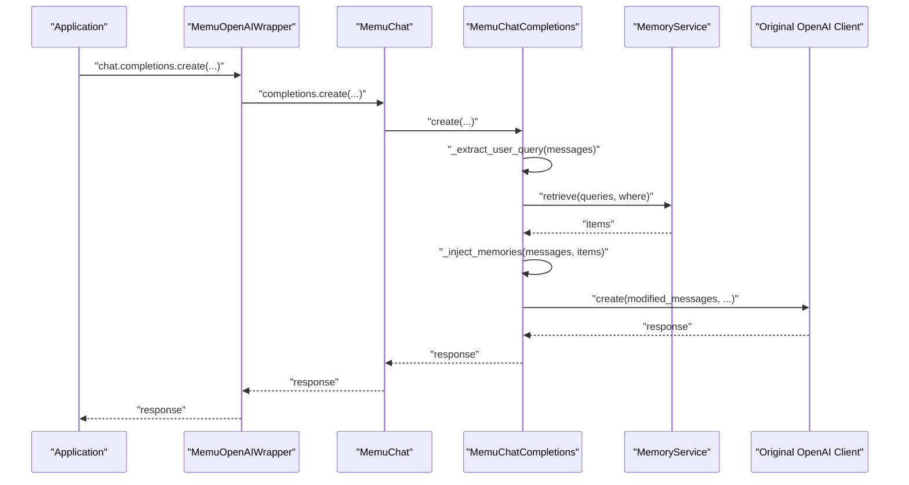
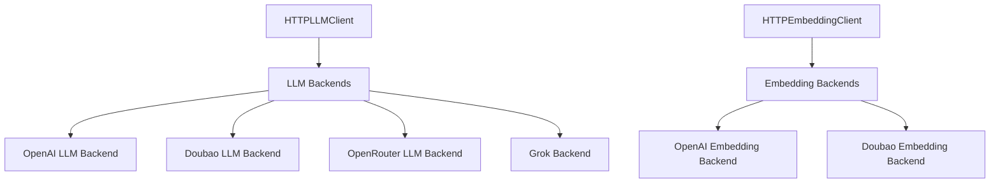

# HTTP Client Implementation

<cite>
**Referenced Files in This Document**
- [http_client.py](file://src/memu/llm/http_client.py)
- [http_client.py](file://src/memu/embedding/http_client.py)
- [openai_wrapper.py](file://src/memu/client/openai_wrapper.py)
- [base.py](file://src/memu/llm/backends/base.py)
- [openai.py](file://src/memu/llm/backends/openai.py)
- [doubao.py](file://src/memu/llm/backends/doubao.py)
- [openrouter.py](file://src/memu/llm/backends/openrouter.py)
- [base.py](file://src/memu/embedding/backends/base.py)
- [openai.py](file://src/memu/embedding/backends/openai.py)
- [doubao.py](file://src/memu/embedding/backends/doubao.py)
- [test_nebius_provider.py](file://examples/test_nebius_provider.py)
- [example_5_with_lazyllm_client.py](file://examples/example_5_with_lazyllm_client.py)
- [test_client_wrapper.py](file://tests/test_client_wrapper.py)
</cite>

## Table of Contents
1. [Introduction](#introduction)
2. [Project Structure](#project-structure)
3. [Core Components](#core-components)
4. [Architecture Overview](#architecture-overview)
5. [Detailed Component Analysis](#detailed-component-analysis)
6. [Dependency Analysis](#dependency-analysis)
7. [Performance Considerations](#performance-considerations)
8. [Troubleshooting Guide](#troubleshooting-guide)
9. [Conclusion](#conclusion)
10. [Appendices](#appendices)

## Introduction
This document provides comprehensive documentation for the HTTP client implementations used in memU’s LLM integration. It focuses on:
- The HTTPLLMClient class architecture, initialization parameters, endpoint configuration, and proxy support
- Supported operations: chat completions, summarization, vision processing, text embeddings, and audio transcription
- Async design patterns, timeout handling, and error management strategies
- Practical configuration examples for different providers, authentication header handling, and response format management
- Performance considerations, connection pooling, and rate limiting strategies
- Troubleshooting guidance for common HTTP client issues and network connectivity problems

## Project Structure
The HTTP client ecosystem consists of:
- LLM HTTP client with provider-specific backends
- Embedding HTTP client with provider-specific backends
- An OpenAI client wrapper for auto-recall memory injection
- Backend modules for OpenAI-compatible providers and specialized providers (e.g., Doubao, OpenRouter, Grok)

**Diagram sources**
- [http_client.py](file://src/memu/llm/http_client.py#L80-L301)
- [http_client.py](file://src/memu/embedding/http_client.py#L27-L150)
- [base.py](file://src/memu/llm/backends/base.py#L6-L31)
- [openai.py](file://src/memu/llm/backends/openai.py#L8-L65)
- [doubao.py](file://src/memu/llm/backends/doubao.py#L8-L70)
- [openrouter.py](file://src/memu/llm/backends/openrouter.py#L8-L71)
- [base.py](file://src/memu/embedding/backends/base.py#L6-L17)
- [openai.py](file://src/memu/embedding/backends/openai.py#L8-L19)
- [doubao.py](file://src/memu/embedding/backends/doubao.py#L31-L73)

**Section sources**
- [http_client.py](file://src/memu/llm/http_client.py#L80-L301)
- [http_client.py](file://src/memu/embedding/http_client.py#L27-L150)

## Core Components
- HTTPLLMClient: Asynchronous HTTP client for LLM operations (chat, vision, transcription) and embeddings. Supports provider-specific backends and endpoint overrides.
- HTTPEmbeddingClient: Asynchronous HTTP client dedicated to text and multimodal embeddings with provider-specific backends.
- Provider Backends: Specialized payload builders and response parsers for OpenAI-compatible providers and specialized providers (Doubao, OpenRouter, Grok).
- OpenAI Client Wrapper: Optional wrapper that injects recalled memories into OpenAI chat requests.

Key capabilities:
- Async HTTP operations using httpx.AsyncClient
- Proxy support via environment variables
- Endpoint override configuration
- Authentication via Authorization header
- Provider-specific payload/response handling

**Section sources**
- [http_client.py](file://src/memu/llm/http_client.py#L80-L301)
- [http_client.py](file://src/memu/embedding/http_client.py#L27-L150)
- [openai_wrapper.py](file://src/memu/client/openai_wrapper.py#L17-L269)

## Architecture Overview
The HTTPLLMClient orchestrates HTTP calls to provider endpoints. It delegates:
- Payload construction and response parsing to LLM backends
- Embedding payload construction and response parsing to embedding backends
- Proxy and timeout configuration to httpx.AsyncClient

**Diagram sources**
- [http_client.py](file://src/memu/llm/http_client.py#L148-L159)
- [base.py](file://src/memu/llm/backends/base.py#L12-L18)
- [openai.py](file://src/memu/llm/backends/openai.py#L14-L29)

**Section sources**
- [http_client.py](file://src/memu/llm/http_client.py#L148-L159)
- [base.py](file://src/memu/llm/backends/base.py#L12-L18)
- [openai.py](file://src/memu/llm/backends/openai.py#L14-L29)

## Detailed Component Analysis

### HTTPLLMClient
Responsibilities:
- Initialize with base_url, api_key, chat_model, provider, endpoint_overrides, timeout, embed_model
- Manage provider-specific backends for LLM and embeddings
- Support chat, summarize, vision, embed, and transcribe operations
- Apply proxy and timeout to httpx.AsyncClient
- Construct Authorization header

Initialization parameters:
- base_url: Base URL for provider API
- api_key: Authentication key
- chat_model: Model name for chat operations
- provider: Provider identifier (openai, doubao, grok, openrouter)
- endpoint_overrides: Dict to override default endpoints
- timeout: Request timeout in seconds
- embed_model: Model name for embeddings (defaults to chat_model)

Supported operations:
- chat(prompt, max_tokens, system_prompt, temperature): Generic chat completion
- summarize(text, max_tokens, system_prompt): Summarization using provider backend
- vision(prompt, image_path, max_tokens, system_prompt): Vision processing with image encoding
- embed(inputs): Text embeddings using embedding backend
- transcribe(audio_path, prompt, language, response_format): Audio transcription with configurable response format

Endpoint configuration:
- summary_endpoint: Derived from provider backend or overrides
- embedding_endpoint: Derived from embedding backend or overrides
- Leading slash normalization ensures httpx resolves relative to base_url

Proxy support:
- Loads proxy from MEMU_HTTP_PROXY, HTTP_PROXY, or HTTPS_PROXY environment variables

Timeout handling:
- Uses timeout for httpx.AsyncClient
- Transcription operation increases timeout by a factor of 3

Error management:
- Raises-for-status on HTTP responses
- Exceptions logged with debug-level logging
- Transcription operation wraps exceptions and re-raises after logging

**Diagram sources**
- [http_client.py](file://src/memu/llm/http_client.py#L80-L301)
- [base.py](file://src/memu/llm/backends/base.py#L6-L31)

**Section sources**
- [http_client.py](file://src/memu/llm/http_client.py#L80-L301)

### HTTPEmbeddingClient
Responsibilities:
- Initialize with base_url, api_key, embed_model, provider, endpoint_overrides, timeout
- Manage provider-specific embedding backends
- Support text embeddings and multimodal embeddings (Doubao only)

Initialization parameters:
- base_url: Base URL for provider API
- api_key: Authentication key
- embed_model: Model name for embeddings
- provider: Provider identifier (openai, doubao)
- endpoint_overrides: Dict to override default embedding endpoints
- timeout: Request timeout in seconds

Supported operations:
- embed(inputs): Text embeddings using embedding backend
- embed_multimodal(inputs, encoding_format): Multimodal embeddings (Doubao only)

Error management:
- Raises-for-status on HTTP responses
- Exceptions logged with debug-level logging

**Diagram sources**
- [http_client.py](file://src/memu/embedding/http_client.py#L27-L150)
- [base.py](file://src/memu/embedding/backends/base.py#L6-L17)

**Section sources**
- [http_client.py](file://src/memu/embedding/http_client.py#L27-L150)

### Provider Backends (LLM)
- OpenAILLMBackend: OpenAI-compatible chat and vision payloads
- DoubaoLLMBackend: Doubao-compatible chat and vision payloads
- OpenRouterLLMBackend: OpenRouter-compatible chat and vision payloads
- GrokBackend: Inherits OpenAI-compatible behavior

Payload construction and response parsing are delegated to backend implementations, enabling provider-specific customization while maintaining a unified client interface.

**Diagram sources**
- [base.py](file://src/memu/llm/backends/base.py#L6-L31)
- [openai.py](file://src/memu/llm/backends/openai.py#L8-L65)
- [doubao.py](file://src/memu/llm/backends/doubao.py#L8-L70)
- [openrouter.py](file://src/memu/llm/backends/openrouter.py#L8-L71)
- [grok.py](file://src/memu/llm/backends/grok.py#L6-L12)

**Section sources**
- [base.py](file://src/memu/llm/backends/base.py#L6-L31)
- [openai.py](file://src/memu/llm/backends/openai.py#L8-L65)
- [doubao.py](file://src/memu/llm/backends/doubao.py#L8-L70)
- [openrouter.py](file://src/memu/llm/backends/openrouter.py#L8-L71)
- [grok.py](file://src/memu/llm/backends/grok.py#L6-L12)

### Provider Backends (Embedding)
- OpenAIEmbeddingBackend: Standard text embeddings
- DoubaoEmbeddingBackend: Standard and multimodal embeddings with Doubao-specific endpoints and input formats

**Diagram sources**
- [base.py](file://src/memu/embedding/backends/base.py#L6-L17)
- [openai.py](file://src/memu/embedding/backends/openai.py#L8-L19)
- [doubao.py](file://src/memu/embedding/backends/doubao.py#L31-L73)

**Section sources**
- [base.py](file://src/memu/embedding/backends/base.py#L6-L17)
- [openai.py](file://src/memu/embedding/backends/openai.py#L8-L19)
- [doubao.py](file://src/memu/embedding/backends/doubao.py#L31-L73)

### OpenAI Client Wrapper (Auto-Recall)
The OpenAI client wrapper optionally injects recalled memories into OpenAI chat requests. It:
- Extracts the user query from messages
- Retrieves relevant memories via MemoryService
- Injects memories into the system prompt
- Supports both synchronous and asynchronous invocation patterns

**Diagram sources**
- [openai_wrapper.py](file://src/memu/client/openai_wrapper.py#L17-L128)

**Section sources**
- [openai_wrapper.py](file://src/memu/client/openai_wrapper.py#L17-L128)

## Dependency Analysis
- HTTPLLMClient depends on:
  - LLMBackend implementations for payload building and response parsing
  - httpx.AsyncClient for HTTP operations
  - Environment variables for proxy configuration
- HTTPEmbeddingClient depends on:
  - EmbeddingBackend implementations for payload building and response parsing
  - httpx.AsyncClient for HTTP operations
  - Environment variables for proxy configuration
- Provider backends encapsulate provider-specific logic, minimizing coupling in clients

**Diagram sources**
- [http_client.py](file://src/memu/llm/http_client.py#L72-L77)
- [http_client.py](file://src/memu/embedding/http_client.py#L21-L24)

**Section sources**
- [http_client.py](file://src/memu/llm/http_client.py#L72-L77)
- [http_client.py](file://src/memu/embedding/http_client.py#L21-L24)

## Performance Considerations
- Async design: Both clients use httpx.AsyncClient to enable non-blocking I/O and efficient concurrency.
- Timeout tuning: Configure timeout per operation; transcription uses extended timeout to accommodate larger audio files.
- Proxy usage: Automatic proxy detection via environment variables reduces latency in proxied environments.
- Endpoint overrides: Allow targeting custom or optimized endpoints without modifying client code.
- Connection pooling: httpx.AsyncClient manages connection reuse internally; keep client instances alive for repeated calls to benefit from pooling.
- Rate limiting: Implement retry with exponential backoff and jitter when encountering provider rate limits. Consider batching embedding requests where supported by the provider.

[No sources needed since this section provides general guidance]

## Troubleshooting Guide
Common issues and resolutions:
- Authentication failures:
  - Verify api_key is set and Authorization header is applied correctly.
  - Confirm provider supports Bearer token authentication.
- Endpoint resolution errors:
  - Ensure base_url ends with a trailing slash to prevent httpx from discarding path components.
  - Use endpoint_overrides to specify correct paths for provider-specific APIs.
- Proxy connectivity:
  - Set MEMU_HTTP_PROXY, HTTP_PROXY, or HTTPS_PROXY environment variables.
  - Validate proxy address and credentials.
- Timeout errors:
  - Increase timeout for long-running operations (e.g., transcription).
  - Consider reducing payload sizes or splitting large requests.
- Provider mismatch:
  - Confirm provider value matches supported backends (openai, doubao, grok, openrouter).
  - Embedding provider must match supported backends (openai, doubao).
- Multimodal embedding restrictions:
  - embed_multimodal is only supported by Doubao backend; attempting on other providers raises a TypeError.
- Logging:
  - Enable debug logging to inspect raw responses and payloads.

Concrete examples:
- Configuring HTTPLLMClient for OpenAI-compatible providers:
  - Set base_url to provider endpoint, api_key to your key, provider to "openai", and chat_model to desired model.
  - Use endpoint_overrides for custom endpoints if needed.
- Configuring HTTPEmbeddingClient for Doubao:
  - Set provider to "doubao", embed_model to Doubao embedding model, and use embed_multimodal for mixed modalities.
- Using environment variables:
  - Set NEBIUS_API_KEY and NEBIUS_BASE_URL to test with Nebius provider as shown in the example script.
- Verifying wrapper behavior:
  - Tests demonstrate query extraction, memory injection, and attribute proxying.

**Section sources**
- [http_client.py](file://src/memu/llm/http_client.py#L94-L97)
- [http_client.py](file://src/memu/llm/http_client.py#L113-L114)
- [http_client.py](file://src/memu/llm/http_client.py#L117-L117)
- [http_client.py](file://src/memu/llm/http_client.py#L255-L257)
- [http_client.py](file://src/memu/embedding/http_client.py#L15-L16)
- [http_client.py](file://src/memu/embedding/http_client.py#L115-L120)
- [test_nebius_provider.py](file://examples/test_nebius_provider.py#L107-L134)
- [test_client_wrapper.py](file://tests/test_client_wrapper.py#L13-L40)

## Conclusion
The memU HTTP client implementations provide a robust, extensible foundation for interacting with LLM and embedding providers. The HTTPLLMClient and HTTPEmbeddingClient leverage provider-specific backends to maintain compatibility across diverse APIs while offering a consistent async interface. With proper configuration of base_url, api_key, provider, and endpoint overrides, applications can integrate multiple providers seamlessly. The OpenAI client wrapper further enhances usability by injecting contextual memories into chat requests. By following the performance and troubleshooting guidance, developers can achieve reliable, high-throughput integrations.

[No sources needed since this section summarizes without analyzing specific files]

## Appendices

### Operation Reference
- chat(prompt, max_tokens=None, system_prompt=None, temperature=0.2)
- summarize(text, max_tokens=None, system_prompt=None)
- vision(prompt, image_path, max_tokens=None, system_prompt=None)
- embed(inputs: list[str])
- transcribe(audio_path, prompt=None, language=None, response_format="text")

### Provider Reference
- LLM providers: openai, doubao, grok, openrouter
- Embedding providers: openai, doubao

### Configuration Examples
- Nebius integration example demonstrates setting base_url, api_key, and provider configuration for both LLM and embeddings.

**Section sources**
- [test_nebius_provider.py](file://examples/test_nebius_provider.py#L27-L41)
- [test_nebius_provider.py](file://examples/test_nebius_provider.py#L107-L134)
- [example_5_with_lazyllm_client.py](file://examples/example_5_with_lazyllm_client.py#L224-L241)