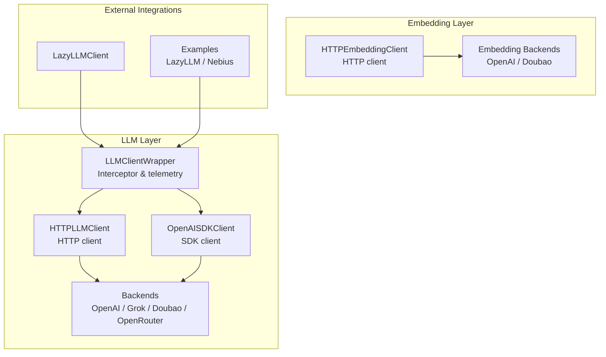
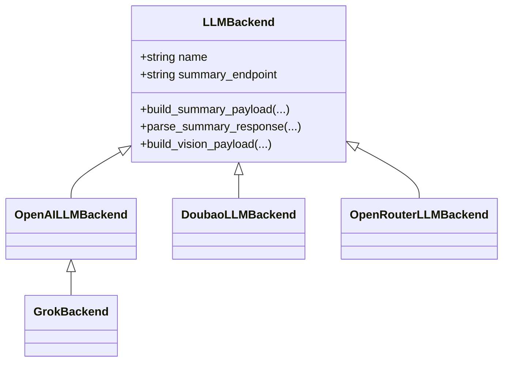
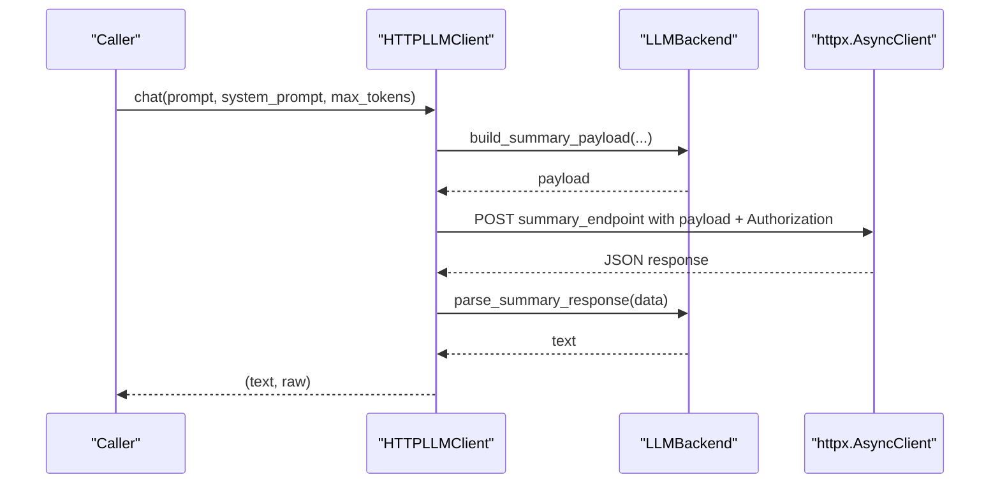
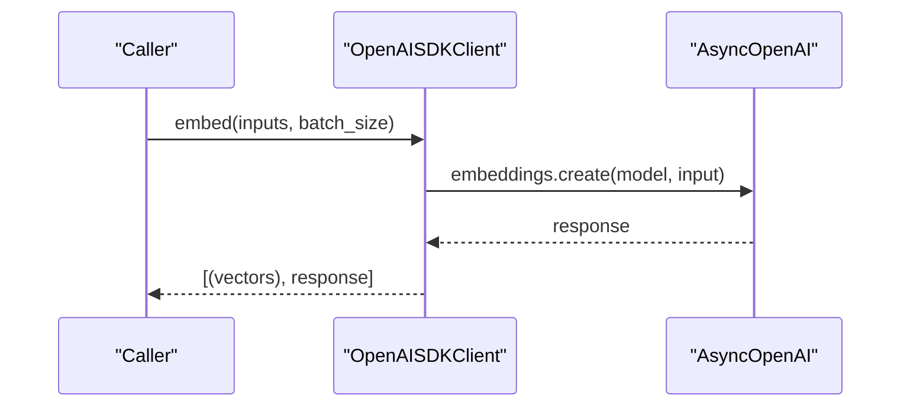
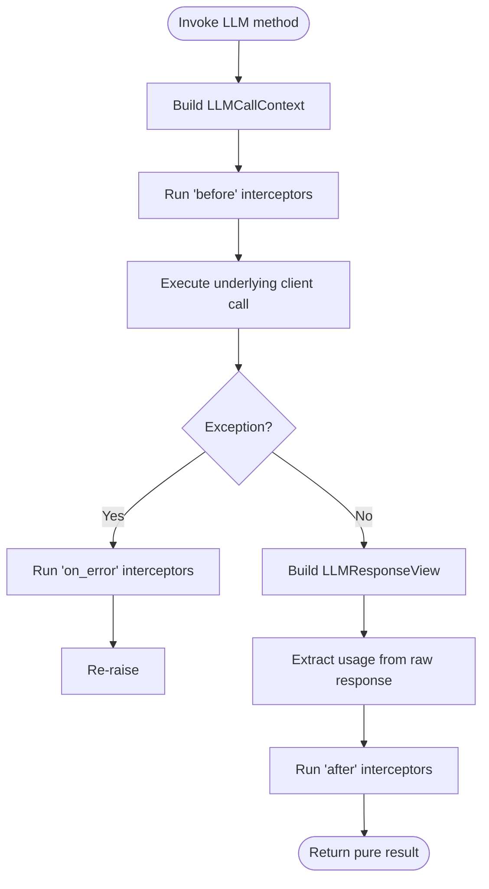
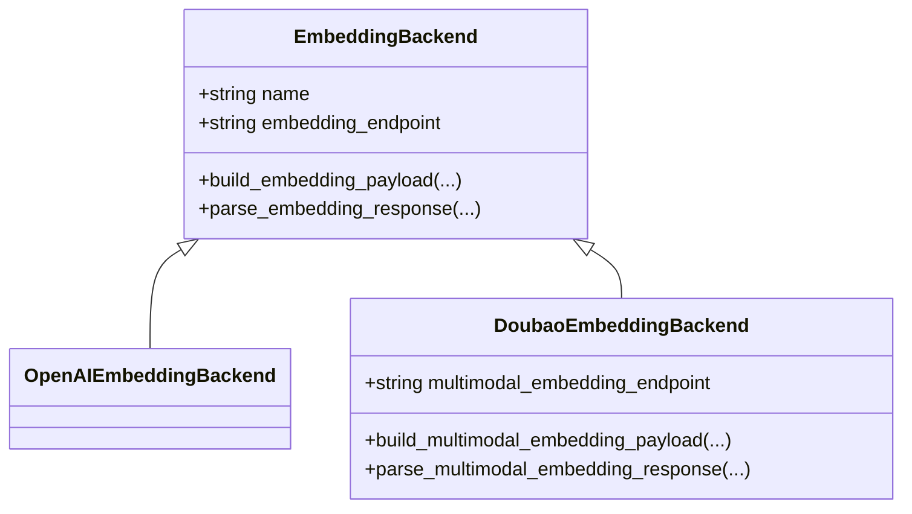
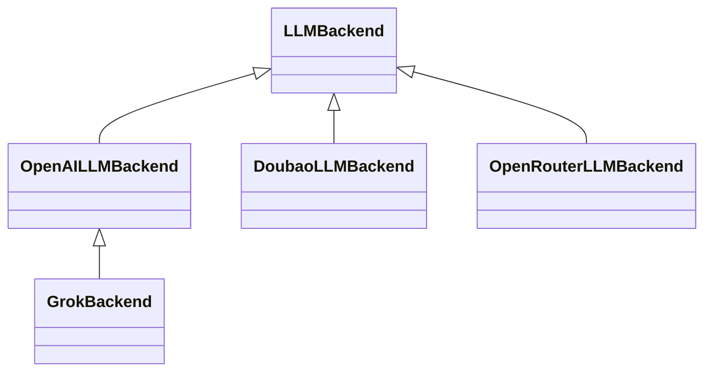
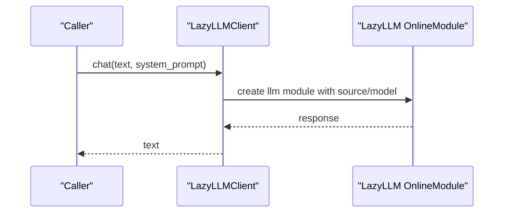
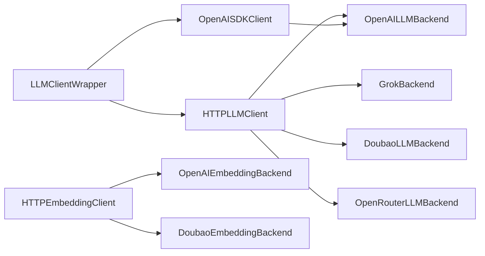
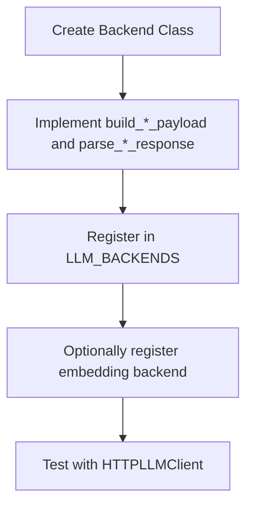

# LLM Integration

<cite>
**Referenced Files in This Document**
- [base.py](file://src/memu/llm/backends/base.py)
- [openai.py](file://src/memu/llm/backends/openai.py)
- [grok.py](file://src/memu/llm/backends/grok.py)
- [doubao.py](file://src/memu/llm/backends/doubao.py)
- [openrouter.py](file://src/memu/llm/backends/openrouter.py)
- [http_client.py](file://src/memu/llm/http_client.py)
- [openai_sdk.py](file://src/memu/llm/openai_sdk.py)
- [wrapper.py](file://src/memu/llm/wrapper.py)
- [lazyllm_client.py](file://src/memu/llm/lazyllm_client.py)
- [base.py](file://src/memu/embedding/backends/base.py)
- [openai.py](file://src/memu/embedding/backends/openai.py)
- [doubao.py](file://src/memu/embedding/backends/doubao.py)
- [http_client.py](file://src/memu/embedding/http_client.py)
- [example_5_with_lazyllm_client.py](file://examples/example_5_with_lazyllm_client.py)
- [test_nebius_provider.py](file://examples/test_nebius_provider.py)
</cite>

## Table of Contents
1. [Introduction](#introduction)
2. [Project Structure](#project-structure)
3. [Core Components](#core-components)
4. [Architecture Overview](#architecture-overview)
5. [Detailed Component Analysis](#detailed-component-analysis)
6. [Dependency Analysis](#dependency-analysis)
7. [Performance Considerations](#performance-considerations)
8. [Troubleshooting Guide](#troubleshooting-guide)
9. [Conclusion](#conclusion)
10. [Appendices](#appendices)

## Introduction
This document explains memU’s provider-agnostic LLM integration. It covers the HTTP client implementation, SDK wrappers, backend abstraction, supported providers (OpenAI, Grok, Doubao, OpenRouter), embedding backends, configuration, authentication, error handling, and integration with external libraries such as LazyLLM and Nebius. The goal is to help beginners get started quickly while providing advanced customization guidance for experienced developers.

## Project Structure
The LLM integration spans two primary areas:
- LLM clients and backends under src/memu/llm
- Embedding clients and backends under src/memu/embedding

Key modules:
- LLM HTTP client and SDK client
- Provider backends (OpenAI, Grok, Doubao, OpenRouter)
- LLM interceptor wrapper for telemetry and usage extraction
- Embedding HTTP client and provider backends (OpenAI, Doubao)
- LazyLLM client adapter
- Examples demonstrating integration patterns

**Diagram sources**
- [http_client.py](file://src/memu/llm/http_client.py#L80-L301)
- [openai_sdk.py](file://src/memu/llm/openai_sdk.py#L20-L219)
- [wrapper.py](file://src/memu/llm/wrapper.py#L226-L505)
- [openai.py](file://src/memu/llm/backends/openai.py#L8-L65)
- [grok.py](file://src/memu/llm/backends/grok.py#L6-L12)
- [doubao.py](file://src/memu/llm/backends/doubao.py#L8-L70)
- [openrouter.py](file://src/memu/llm/backends/openrouter.py#L8-L71)
- [http_client.py](file://src/memu/embedding/http_client.py#L27-L150)
- [openai.py](file://src/memu/embedding/backends/openai.py#L8-L19)
- [doubao.py](file://src/memu/embedding/backends/doubao.py#L31-L73)
- [lazyllm_client.py](file://src/memu/llm/lazyllm_client.py#L9-L160)
- [example_5_with_lazyllm_client.py](file://examples/example_5_with_lazyllm_client.py#L220-L251)
- [test_nebius_provider.py](file://examples/test_nebius_provider.py#L107-L186)

**Section sources**
- [http_client.py](file://src/memu/llm/http_client.py#L80-L301)
- [openai_sdk.py](file://src/memu/llm/openai_sdk.py#L20-L219)
- [wrapper.py](file://src/memu/llm/wrapper.py#L226-L505)
- [http_client.py](file://src/memu/embedding/http_client.py#L27-L150)

## Core Components
- HTTPLLMClient: Provider-agnostic HTTP client for chat, vision, embeddings, and audio transcription. It selects provider backends dynamically and handles endpoint overrides, timeouts, and optional proxies.
- OpenAISDKClient: Uses the official OpenAI SDK for chat, vision, embeddings, and audio transcription, enabling richer response objects and SDK-native features.
- LLMClientWrapper: Adds interceptors, telemetry, usage extraction, and structured request/response views around either HTTP or SDK clients.
- Embedding clients and backends: Separate HTTP embedding client and backends for OpenAI and Doubao, including multimodal embedding support for Doubao.
- LazyLLMClient: Adapter to integrate with the LazyLLM framework for LLM/VLM/Embedding/STT.

**Section sources**
- [http_client.py](file://src/memu/llm/http_client.py#L80-L301)
- [openai_sdk.py](file://src/memu/llm/openai_sdk.py#L20-L219)
- [wrapper.py](file://src/memu/llm/wrapper.py#L226-L505)
- [http_client.py](file://src/memu/embedding/http_client.py#L27-L150)
- [lazyllm_client.py](file://src/memu/llm/lazyllm_client.py#L9-L160)

## Architecture Overview
The system separates concerns into clients, backends, and wrappers:
- Backends define provider-specific payload construction and response parsing.
- Clients encapsulate HTTP or SDK calls and select appropriate backends.
- Wrapper adds cross-cutting concerns like interceptors, usage extraction, and telemetry.
- Embedding subsystem mirrors the LLM design with its own backends and client.

**Diagram sources**
- [base.py](file://src/memu/llm/backends/base.py#L6-L31)
- [openai.py](file://src/memu/llm/backends/openai.py#L8-L65)
- [grok.py](file://src/memu/llm/backends/grok.py#L6-L12)
- [doubao.py](file://src/memu/llm/backends/doubao.py#L8-L70)
- [openrouter.py](file://src/memu/llm/backends/openrouter.py#L8-L71)

## Detailed Component Analysis

### HTTP LLM Client
The HTTP client centralizes provider-agnostic LLM calls:
- Initializes base_url, api_key, chat_model, provider, endpoint overrides, timeout, embed_model, and proxy.
- Selects provider backends and embedding backends by provider name.
- Provides methods for chat, summarize, vision, embed, and transcribe.
- Applies Authorization header and respects endpoint overrides.

**Diagram sources**
- [http_client.py](file://src/memu/llm/http_client.py#L119-L159)
- [base.py](file://src/memu/llm/backends/base.py#L12-L18)

**Section sources**
- [http_client.py](file://src/memu/llm/http_client.py#L80-L301)

### SDK Client (OpenAI)
The SDK client leverages the official OpenAI async client:
- Supports chat, summarize, vision, embed, and transcribe.
- Uses SDK-native response objects for richer metadata.
- Includes batching for embeddings.

**Diagram sources**
- [openai_sdk.py](file://src/memu/llm/openai_sdk.py#L155-L171)

**Section sources**
- [openai_sdk.py](file://src/memu/llm/openai_sdk.py#L20-L219)

### LLM Interceptor Wrapper
The wrapper adds telemetry and usage extraction:
- Builds request/response views for telemetry.
- Extracts token usage from raw responses (best-effort).
- Supports before/after/on-error interceptors with filters and priorities.
- Emits structured usage metrics including latency, finish reason, and token breakdowns.

**Diagram sources**
- [wrapper.py](file://src/memu/llm/wrapper.py#L387-L436)

**Section sources**
- [wrapper.py](file://src/memu/llm/wrapper.py#L226-L505)

### Embedding Subsystem
Embedding follows a similar pattern:
- HTTPEmbeddingClient builds payloads and parses responses via EmbeddingBackend implementations.
- Backends for OpenAI and Doubao define provider-specific endpoints and payload/response handling.
- Doubao supports multimodal embedding payloads and responses.

**Diagram sources**
- [base.py](file://src/memu/embedding/backends/base.py#L6-L17)
- [openai.py](file://src/memu/embedding/backends/openai.py#L8-L19)
- [doubao.py](file://src/memu/embedding/backends/doubao.py#L31-L73)

**Section sources**
- [http_client.py](file://src/memu/embedding/http_client.py#L27-L150)
- [openai.py](file://src/memu/embedding/backends/openai.py#L8-L19)
- [doubao.py](file://src/memu/embedding/backends/doubao.py#L31-L73)

### Provider Backends
- OpenAI: Standard OpenAI-compatible chat and vision payloads; inherits summary and vision payload builders.
- Grok: Inherits OpenAI-compatible backend; shares payload structure.
- Doubao: OpenAI-compatible chat and vision endpoints; defines provider-specific endpoints and payloads.
- OpenRouter: OpenAI-compatible chat and vision endpoints; defines provider-specific endpoints and payloads.

**Diagram sources**
- [base.py](file://src/memu/llm/backends/base.py#L6-L31)
- [openai.py](file://src/memu/llm/backends/openai.py#L8-L65)
- [grok.py](file://src/memu/llm/backends/grok.py#L6-L12)
- [doubao.py](file://src/memu/llm/backends/doubao.py#L8-L70)
- [openrouter.py](file://src/memu/llm/backends/openrouter.py#L8-L71)

**Section sources**
- [openai.py](file://src/memu/llm/backends/openai.py#L8-L65)
- [grok.py](file://src/memu/llm/backends/grok.py#L6-L12)
- [doubao.py](file://src/memu/llm/backends/doubao.py#L8-L70)
- [openrouter.py](file://src/memu/llm/backends/openrouter.py#L8-L71)

### LazyLLM Integration
The LazyLLM client adapts memU to LazyLLM’s OnlineModule ecosystem:
- Supports LLM, VLM, Embedding, and STT modules.
- Uses namespace “MEMU” and configured sources/models.
- Provides async wrappers for chat, summarize, vision, embed, and transcribe.

**Diagram sources**
- [lazyllm_client.py](file://src/memu/llm/lazyllm_client.py#L44-L91)

**Section sources**
- [lazyllm_client.py](file://src/memu/llm/lazyllm_client.py#L9-L160)
- [example_5_with_lazyllm_client.py](file://examples/example_5_with_lazyllm_client.py#L220-L251)

### External Provider Integration (Nebius)
Nebius demonstrates OpenAI-compatible provider usage:
- Configures base_url, api_key, chat_model, embed_model.
- Uses OpenAI SDK client backend.
- Validates chat and embeddings endpoints.

**Section sources**
- [test_nebius_provider.py](file://examples/test_nebius_provider.py#L107-L186)

## Dependency Analysis
- HTTPLLMClient depends on provider backend factories and embedding backend factories.
- Backends depend only on the base backend interface.
- LLMClientWrapper composes either HTTP or SDK clients.
- Embedding clients mirror LLM client design with separate backends.
- LazyLLMClient is decoupled and integrates via adapters.

**Diagram sources**
- [http_client.py](file://src/memu/llm/http_client.py#L72-L77)
- [openai.py](file://src/memu/llm/backends/openai.py#L8-L65)
- [grok.py](file://src/memu/llm/backends/grok.py#L6-L12)
- [doubao.py](file://src/memu/llm/backends/doubao.py#L8-L70)
- [openrouter.py](file://src/memu/llm/backends/openrouter.py#L8-L71)
- [openai_sdk.py](file://src/memu/llm/openai_sdk.py#L20-L37)
- [wrapper.py](file://src/memu/llm/wrapper.py#L226-L243)
- [http_client.py](file://src/memu/embedding/http_client.py#L21-L24)
- [openai.py](file://src/memu/embedding/backends/openai.py#L8-L19)
- [doubao.py](file://src/memu/embedding/backends/doubao.py#L31-L73)

**Section sources**
- [http_client.py](file://src/memu/llm/http_client.py#L72-L77)
- [http_client.py](file://src/memu/embedding/http_client.py#L21-L24)

## Performance Considerations
- Prefer SDK clients when rich response objects and batching are needed (e.g., embeddings batching).
- Use HTTP clients for custom providers or when avoiding SDK dependencies is desired.
- Leverage embedding backends’ provider-specific endpoints to minimize conversion overhead.
- Use interceptors to capture latency and token usage for cost monitoring.
- Configure timeouts appropriately; embedding calls may be larger and slower.
- Proxy support enables controlled network routing in restricted environments.

[No sources needed since this section provides general guidance]

## Troubleshooting Guide
Common issues and remedies:
- Unsupported provider: Ensure provider name matches registered backends. The HTTP client raises a clear error listing available providers.
- Endpoint mismatches: Use endpoint_overrides to align with provider-specific paths.
- Authentication failures: Verify Authorization header is applied and API keys are set correctly.
- Timeout errors: Increase timeout or reduce payload sizes; consider batching for embeddings.
- Usage extraction failures: The wrapper performs best-effort extraction; missing fields are handled gracefully.

**Section sources**
- [http_client.py](file://src/memu/llm/http_client.py#L282-L300)
- [http_client.py](file://src/memu/llm/http_client.py#L103-L117)
- [wrapper.py](file://src/memu/llm/wrapper.py#L653-L703)

## Conclusion
memU’s LLM integration is designed for flexibility and extensibility. By separating HTTP and SDK clients, provider backends, and a robust interceptor wrapper, it supports multiple providers and external frameworks while maintaining consistent interfaces. Use the HTTP client for custom providers, SDK clients for richer response handling, and interceptors for observability and cost insights.

[No sources needed since this section summarizes without analyzing specific files]

## Appendices

### Supported Providers and Capabilities
- OpenAI: Chat, Vision, Embeddings, Transcription (via SDK or HTTP).
- Grok: Inherits OpenAI-compatible chat and vision.
- Doubao: OpenAI-compatible chat and vision; HTTP embeddings; multimodal embeddings.
- OpenRouter: OpenAI-compatible chat and vision.

**Section sources**
- [openai.py](file://src/memu/llm/backends/openai.py#L8-L65)
- [grok.py](file://src/memu/llm/backends/grok.py#L6-L12)
- [doubao.py](file://src/memu/llm/backends/doubao.py#L8-L70)
- [openrouter.py](file://src/memu/llm/backends/openrouter.py#L8-L71)
- [http_client.py](file://src/memu/llm/http_client.py#L72-L77)

### Configuration Requirements
- Base URL: Provider base URL ending with “/” to avoid path resolution issues.
- API Key: Authorization header applied automatically.
- Chat Model: Used for chat and vision calls.
- Embed Model: Used for embeddings; defaults to chat model if not provided.
- Provider: One of the supported provider names.
- Endpoint Overrides: Override default endpoints per operation (e.g., chat, summary, embeddings).
- Timeout: Global timeout for HTTP calls.
- Proxy: Optional proxy via environment variables.

**Section sources**
- [http_client.py](file://src/memu/llm/http_client.py#L83-L118)
- [http_client.py](file://src/memu/embedding/http_client.py#L30-L58)

### Authentication Methods
- HTTP client: Authorization header with Bearer token.
- SDK client: API key passed to AsyncOpenAI constructor.
- LazyLLM: Uses configured sources/models; API keys managed by LazyLLM.

**Section sources**
- [http_client.py](file://src/memu/llm/http_client.py#L279-L280)
- [openai_sdk.py](file://src/memu/llm/openai_sdk.py#L32-L37)
- [lazyllm_client.py](file://src/memu/llm/lazyllm_client.py#L25-L34)

### Rate Limiting and Cost Optimization
- Use interceptors to collect token usage and latency for cost tracking.
- Batch embeddings when supported by the provider or SDK client.
- Prefer smaller models for low-cost tasks; increase max_tokens carefully.
- Monitor finish reasons and token breakdowns for optimization.

**Section sources**
- [wrapper.py](file://src/memu/llm/wrapper.py#L420-L432)
- [openai_sdk.py](file://src/memu/llm/openai_sdk.py#L155-L171)

### Implementing Custom Provider Backends
Steps:
- Define a new backend class inheriting from the base backend and implement payload builders and response parsers.
- Register the backend in the HTTP client’s backend factory mapping.
- For embeddings, implement an embedding backend and register it similarly.
- Test with a minimal client configuration and verify payloads and responses.

**Diagram sources**
- [base.py](file://src/memu/llm/backends/base.py#L12-L18)
- [http_client.py](file://src/memu/llm/http_client.py#L72-L77)
- [http_client.py](file://src/memu/llm/http_client.py#L289-L300)

**Section sources**
- [base.py](file://src/memu/llm/backends/base.py#L6-L31)
- [http_client.py](file://src/memu/llm/http_client.py#L72-L77)
- [http_client.py](file://src/memu/llm/http_client.py#L289-L300)

### Example: LazyLLM Profile Configuration
- Configure llm_profiles with client_backend set to the LazyLLM backend.
- Provide models for LLM, VLM, Embedding, and STT.
- Use the service to invoke summarization and multimodal processing.

**Section sources**
- [example_5_with_lazyllm_client.py](file://examples/example_5_with_lazyllm_client.py#L220-L251)

### Example: Nebius Provider Setup
- Set NEBIUS_API_KEY.
- Configure base_url, chat_model, embed_model.
- Use OpenAI SDK client backend for compatibility.

**Section sources**
- [test_nebius_provider.py](file://examples/test_nebius_provider.py#L107-L186)