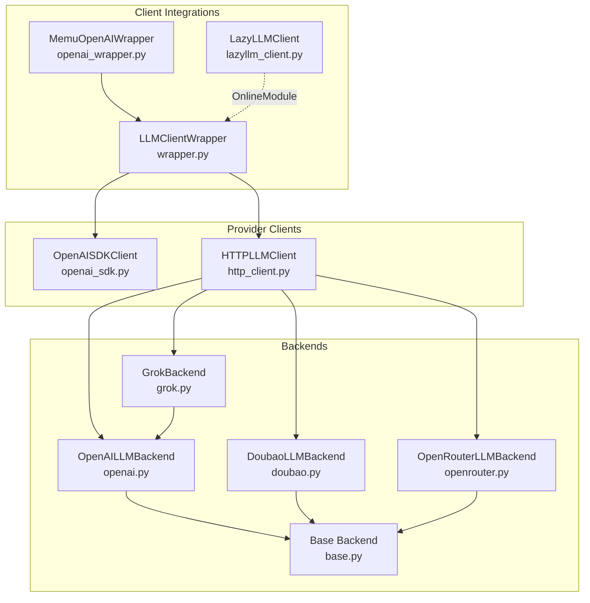
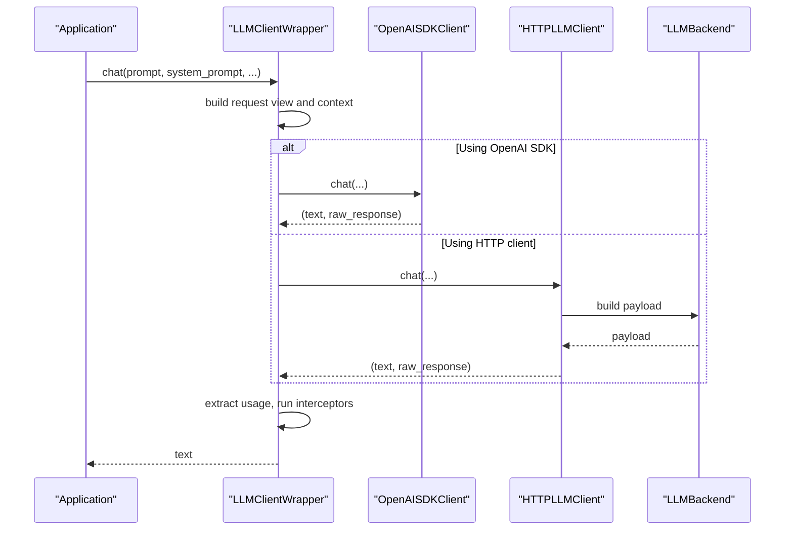
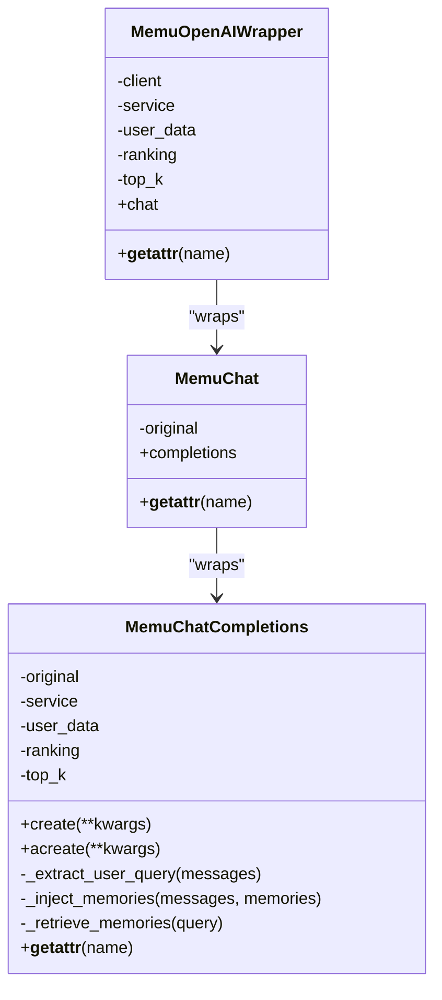
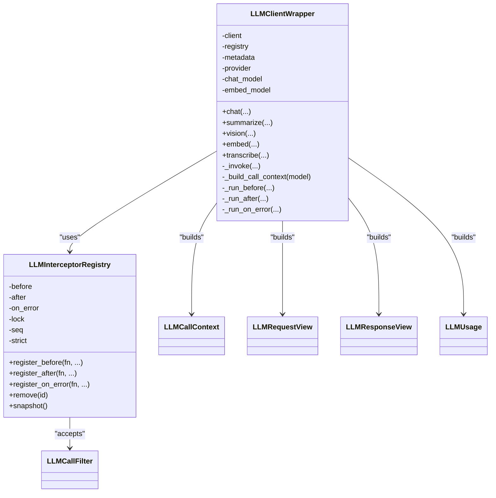
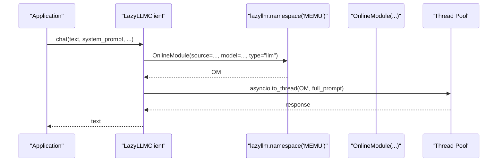
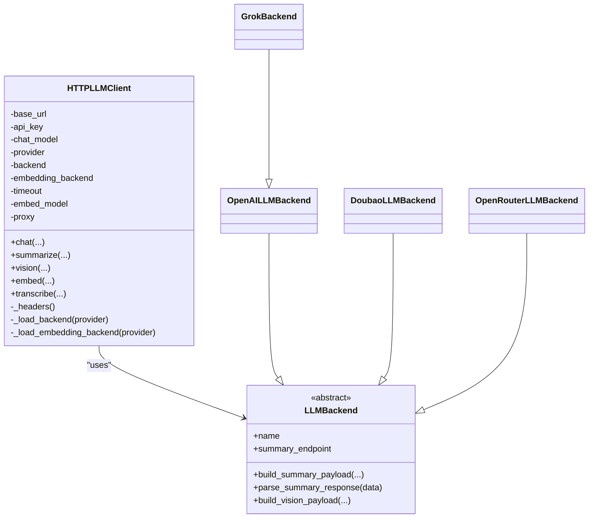
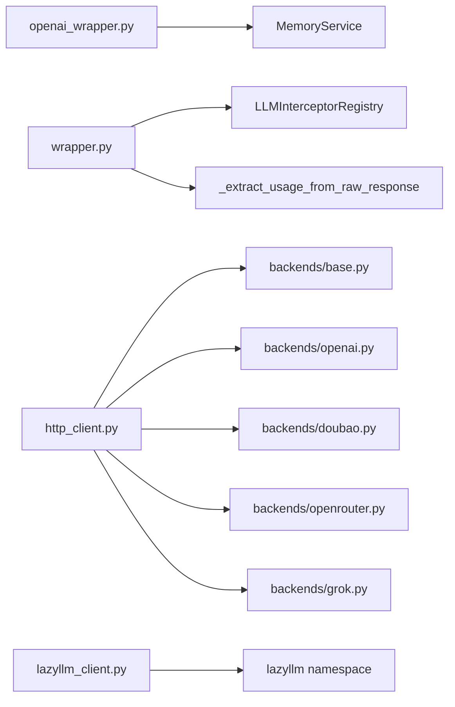

# SDK Wrappers and Integration

<cite>
**Referenced Files in This Document**
- [openai_wrapper.py](file://src/memu/client/openai_wrapper.py)
- [wrapper.py](file://src/memu/llm/wrapper.py)
- [lazyllm_client.py](file://src/memu/llm/lazyllm_client.py)
- [openai_sdk.py](file://src/memu/llm/openai_sdk.py)
- [http_client.py](file://src/memu/llm/http_client.py)
- [base.py](file://src/memu/llm/backends/base.py)
- [openai.py](file://src/memu/llm/backends/openai.py)
- [doubao.py](file://src/memu/llm/backends/doubao.py)
- [openrouter.py](file://src/memu/llm/backends/openrouter.py)
- [grok.py](file://src/memu/llm/backends/grok.py)
- [example_5_with_lazyllm_client.py](file://examples/example_5_with_lazyllm_client.py)
- [example_4_openrouter_memory.py](file://examples/example_4_openrouter_memory.py)
</cite>

## Table of Contents
1. [Introduction](#introduction)
2. [Project Structure](#project-structure)
3. [Core Components](#core-components)
4. [Architecture Overview](#architecture-overview)
5. [Detailed Component Analysis](#detailed-component-analysis)
6. [Dependency Analysis](#dependency-analysis)
7. [Performance Considerations](#performance-considerations)
8. [Troubleshooting Guide](#troubleshooting-guide)
9. [Conclusion](#conclusion)
10. [Appendices](#appendices)

## Introduction
This document explains the SDK wrapper implementations that enable seamless integration with external LLM libraries in memU. It covers:
- The OpenAI SDK wrapper that injects recalled memories into prompts
- A generic LLM client wrapper with interceptor registry for unified telemetry and control
- The LazyLLM client integration for Qwen-based online modules
- Provider-agnostic HTTP clients and backend adapters for OpenAI, OpenRouter, Doubao, and Grok
- Factory-style patterns, compatibility layers, and migration strategies
- Authentication handling, performance implications, resource management, and production best practices

## Project Structure
The SDK wrapper ecosystem spans three primary areas:
- Client-side OpenAI integration with memory recall
- Unified LLM client wrapper with interceptors and usage extraction
- Provider-agnostic HTTP client with pluggable backends and LazyLLM integration

**Diagram sources**
- [openai_wrapper.py](file://src/memu/client/openai_wrapper.py#L155-L269)
- [wrapper.py](file://src/memu/llm/wrapper.py#L226-L773)
- [lazyllm_client.py](file://src/memu/llm/lazyllm_client.py#L9-L160)
- [openai_sdk.py](file://src/memu/llm/openai_sdk.py#L20-L219)
- [http_client.py](file://src/memu/llm/http_client.py#L80-L301)
- [openai.py](file://src/memu/llm/backends/openai.py#L8-L65)
- [doubao.py](file://src/memu/llm/backends/doubao.py#L8-L70)
- [openrouter.py](file://src/memu/llm/backends/openrouter.py#L8-L71)
- [grok.py](file://src/memu/llm/backends/grok.py#L6-L12)
- [base.py](file://src/memu/llm/backends/base.py#L6-L31)

**Section sources**
- [openai_wrapper.py](file://src/memu/client/openai_wrapper.py#L1-L269)
- [wrapper.py](file://src/memu/llm/wrapper.py#L1-L773)
- [lazyllm_client.py](file://src/memu/llm/lazyllm_client.py#L1-L160)
- [openai_sdk.py](file://src/memu/llm/openai_sdk.py#L1-L219)
- [http_client.py](file://src/memu/llm/http_client.py#L1-L301)
- [openai.py](file://src/memu/llm/backends/openai.py#L1-L65)
- [doubao.py](file://src/memu/llm/backends/doubao.py#L1-L70)
- [openrouter.py](file://src/memu/llm/backends/openrouter.py#L1-L71)
- [grok.py](file://src/memu/llm/backends/grok.py#L1-L12)
- [base.py](file://src/memu/llm/backends/base.py#L1-L31)

## Core Components
- OpenAI SDK wrapper: Adds automatic memory recall injection into chat.completions calls while remaining fully backward compatible.
- Generic LLM client wrapper: Provides a unified interface for chat, summarize, vision, embed, and transcribe with an interceptor registry and usage extraction.
- LazyLLM client: Bridges memU to LazyLLM OnlineModule for LLM/VLM/Embedding/STT with async thread pooling.
- HTTP client with backends: Encapsulates provider differences behind a single interface supporting OpenAI, OpenRouter, Doubao, and Grok.

Key capabilities:
- Unified telemetry and filtering via LLMInterceptorRegistry
- Best-effort token usage extraction from provider responses
- Configurable provider selection and endpoint overrides
- Async-first design with graceful fallbacks

**Section sources**
- [openai_wrapper.py](file://src/memu/client/openai_wrapper.py#L155-L269)
- [wrapper.py](file://src/memu/llm/wrapper.py#L226-L773)
- [lazyllm_client.py](file://src/memu/llm/lazyllm_client.py#L9-L160)
- [http_client.py](file://src/memu/llm/http_client.py#L80-L301)

## Architecture Overview
The wrappers form layered abstractions:
- Application code interacts with a unified LLM client interface
- The LLM client wrapper delegates to either the OpenAI SDK client or the HTTP client
- The HTTP client selects a backend adapter per provider
- The LazyLLM client integrates with the LazyLLM framework for online modules

**Diagram sources**
- [wrapper.py](file://src/memu/llm/wrapper.py#L274-L306)
- [openai_sdk.py](file://src/memu/llm/openai_sdk.py#L39-L87)
- [http_client.py](file://src/memu/llm/http_client.py#L119-L146)
- [openai.py](file://src/memu/llm/backends/openai.py#L14-L26)

## Detailed Component Analysis

### OpenAI SDK Wrapper
Purpose:
- Wrap an OpenAI client to inject recalled memories into prompts automatically
- Preserve backward compatibility and support both sync and async invocation

Key behaviors:
- Extracts the latest user query from messages
- Retrieves relevant memories via a MemoryService scoped by user_data
- Injects memories into the system prompt or prepends a new system message
- Handles both sync create and async acreate methods
- Fallback to silent failure if memory retrieval fails

**Diagram sources**
- [openai_wrapper.py](file://src/memu/client/openai_wrapper.py#L155-L269)
- [openai_wrapper.py](file://src/memu/client/openai_wrapper.py#L17-L127)

**Section sources**
- [openai_wrapper.py](file://src/memu/client/openai_wrapper.py#L17-L127)
- [openai_wrapper.py](file://src/memu/client/openai_wrapper.py#L155-L269)

### Generic LLM Client Wrapper and Interceptor Registry
Purpose:
- Provide a unified interface for chat, summarize, vision, embed, and transcribe
- Enforce consistent telemetry, usage extraction, and error handling
- Allow before/after/on_error interception with filters and priorities

Highlights:
- Request/response views capture content length and hashes
- Usage extraction supports OpenAI-like responses and JSON dicts
- Interceptors are sorted by priority and insertion order
- Strict mode controls whether interceptor failures abort the call

**Diagram sources**
- [wrapper.py](file://src/memu/llm/wrapper.py#L226-L773)

**Section sources**
- [wrapper.py](file://src/memu/llm/wrapper.py#L17-L87)
- [wrapper.py](file://src/memu/llm/wrapper.py#L128-L224)
- [wrapper.py](file://src/memu/llm/wrapper.py#L226-L505)
- [wrapper.py](file://src/memu/llm/wrapper.py#L507-L773)

### LazyLLM Client Integration
Purpose:
- Integrate memU with LazyLLM OnlineModule for LLM, VLM, Embedding, and STT
- Provide async execution via thread pools to accommodate blocking calls

Capabilities:
- Chat and summarize with optional system prompts
- Vision processing with image files
- Batched embedding with configurable batch size
- Speech-to-text transcription

**Diagram sources**
- [lazyllm_client.py](file://src/memu/llm/lazyllm_client.py#L44-L67)

**Section sources**
- [lazyllm_client.py](file://src/memu/llm/lazyllm_client.py#L9-L160)

### Provider-Agnostic HTTP Client and Backends
Purpose:
- Abstract provider differences behind a single interface
- Support OpenAI, OpenRouter, Doubao, and Grok with minimal configuration

Key features:
- Endpoint override support for chat and embeddings
- Proxy loading from environment variables
- Separate embedding backend adapters
- Payload construction and response parsing per backend

**Diagram sources**
- [http_client.py](file://src/memu/llm/http_client.py#L80-L301)
- [base.py](file://src/memu/llm/backends/base.py#L6-L31)
- [openai.py](file://src/memu/llm/backends/openai.py#L8-L65)
- [doubao.py](file://src/memu/llm/backends/doubao.py#L8-L70)
- [openrouter.py](file://src/memu/llm/backends/openrouter.py#L8-L71)
- [grok.py](file://src/memu/llm/backends/grok.py#L6-L12)

**Section sources**
- [http_client.py](file://src/memu/llm/http_client.py#L80-L301)
- [base.py](file://src/memu/llm/backends/base.py#L6-L31)
- [openai.py](file://src/memu/llm/backends/openai.py#L8-L65)
- [doubao.py](file://src/memu/llm/backends/doubao.py#L8-L70)
- [openrouter.py](file://src/memu/llm/backends/openrouter.py#L8-L71)
- [grok.py](file://src/memu/llm/backends/grok.py#L6-L12)

### OpenAI SDK Client
Purpose:
- Provide a thin async wrapper around the official OpenAI SDK
- Offer convenience methods for chat, summarize, vision, embed, and transcribe
- Return both parsed text and raw responses for usage extraction

Highlights:
- Image encoding and MIME-type detection for vision
- Batched embeddings with aggregated results
- Transcription with flexible response formats

**Section sources**
- [openai_sdk.py](file://src/memu/llm/openai_sdk.py#L20-L219)

## Dependency Analysis
- OpenAI wrapper depends on MemoryService for recall and exposes a drop-in replacement for OpenAI’s chat.completions
- LLM client wrapper depends on an interceptor registry and usage extraction helpers
- HTTP client depends on backend factories and embedding backend factories
- LazyLLM client depends on the LazyLLM framework and uses thread pools for async compatibility

**Diagram sources**
- [openai_wrapper.py](file://src/memu/client/openai_wrapper.py#L155-L269)
- [wrapper.py](file://src/memu/llm/wrapper.py#L387-L505)
- [http_client.py](file://src/memu/llm/http_client.py#L282-L301)
- [openai.py](file://src/memu/llm/backends/openai.py#L8-L65)
- [doubao.py](file://src/memu/llm/backends/doubao.py#L8-L70)
- [openrouter.py](file://src/memu/llm/backends/openrouter.py#L8-L71)
- [grok.py](file://src/memu/llm/backends/grok.py#L6-L12)
- [lazyllm_client.py](file://src/memu/llm/lazyllm_client.py#L9-L160)

**Section sources**
- [openai_wrapper.py](file://src/memu/client/openai_wrapper.py#L155-L269)
- [wrapper.py](file://src/memu/llm/wrapper.py#L387-L505)
- [http_client.py](file://src/memu/llm/http_client.py#L282-L301)
- [lazyllm_client.py](file://src/memu/llm/lazyllm_client.py#L9-L160)

## Performance Considerations
- Memory recall retrieval: The OpenAI wrapper performs retrieval in-process; ensure retrieval is fast and resilient to failures to avoid impacting latency.
- Interceptor overhead: Each registered interceptor adds latency; keep interceptors efficient and use filters to limit scope.
- Usage extraction: Best-effort parsing avoids breaking calls but may miss token counts; ensure raw responses are preserved when needed.
- HTTP client timeouts: Configure appropriate timeouts for chat, summarize, and transcription; transcription may require extended timeouts.
- LazyLLM thread pool: Offloads blocking calls; tune thread pool size and consider connection pooling at the framework level.
- Embedding batching: Use batch sizes appropriate for provider limits and memory constraints.

[No sources needed since this section provides general guidance]

## Troubleshooting Guide
Common issues and remedies:
- Memory recall injection not applied:
  - Verify user_data scope and that the wrapper is used instead of the raw OpenAI client
  - Confirm retrieval succeeds; the wrapper falls back silently on errors
- Token usage missing:
  - Ensure raw responses are passed through for usage extraction
  - Provider responses may vary; adjust extraction logic if needed
- HTTP client errors:
  - Check provider name and endpoint overrides
  - Validate base_url and API key; confirm proxy settings if applicable
- LazyLLM integration:
  - Ensure environment variables for provider keys are set
  - Confirm OnlineModule source and model names match provider configurations

**Section sources**
- [openai_wrapper.py](file://src/memu/client/openai_wrapper.py#L73-L108)
- [wrapper.py](file://src/memu/llm/wrapper.py#L653-L703)
- [http_client.py](file://src/memu/llm/http_client.py#L279-L287)
- [lazyllm_client.py](file://src/memu/llm/lazyllm_client.py#L62-L91)

## Conclusion
The SDK wrapper ecosystem in memU provides:
- Seamless integration with OpenAI and other providers via unified interfaces
- Extensible interceptor-based telemetry and control
- Compatibility layers for HTTP and LazyLLM backends
- Practical patterns for authentication, batching, and error handling

Adopting these wrappers enables consistent behavior across providers and simplifies migration between SDK approaches.

[No sources needed since this section summarizes without analyzing specific files]

## Appendices

### Configuration Examples and Migration Strategies
- OpenAI wrapper configuration:
  - Wrap an OpenAI client with a MemoryService and user scope; all chat.completions calls will auto-inject memories
  - Reference: [wrap_openai](file://src/memu/client/openai_wrapper.py#L217-L269)
- OpenRouter integration:
  - Configure MemoryService with provider "openrouter", base_url, and API key; use HTTP client backend
  - Reference: [example_4_openrouter_memory.py](file://examples/example_4_openrouter_memory.py#L64-L76)
- LazyLLM integration:
  - Configure llm profiles with "lazyllm_backend" and specify source/model mappings; use service.llm_client
  - Reference: [example_5_with_lazyllm_client.py](file://examples/example_5_with_lazyllm_client.py#L224-L241)
- Migration from OpenAI SDK to HTTP client:
  - Replace OpenAISDKClient with HTTPLLMClient; select provider backend and set base_url and API key
  - Reference: [openai_sdk.py](file://src/memu/llm/openai_sdk.py#L20-L38), [http_client.py](file://src/memu/llm/http_client.py#L83-L117)
- Migration to LazyLLM:
  - Switch llm profile to "lazyllm_backend"; configure OnlineModule sources and models
  - Reference: [lazyllm_client.py](file://src/memu/llm/lazyllm_client.py#L14-L33), [example_5_with_lazyllm_client.py](file://examples/example_5_with_lazyllm_client.py#L225-L241)

**Section sources**
- [openai_wrapper.py](file://src/memu/client/openai_wrapper.py#L217-L269)
- [example_4_openrouter_memory.py](file://examples/example_4_openrouter_memory.py#L64-L76)
- [example_5_with_lazyllm_client.py](file://examples/example_5_with_lazyllm_client.py#L224-L241)
- [openai_sdk.py](file://src/memu/llm/openai_sdk.py#L20-L38)
- [http_client.py](file://src/memu/llm/http_client.py#L83-L117)
- [lazyllm_client.py](file://src/memu/llm/lazyllm_client.py#L14-L33)