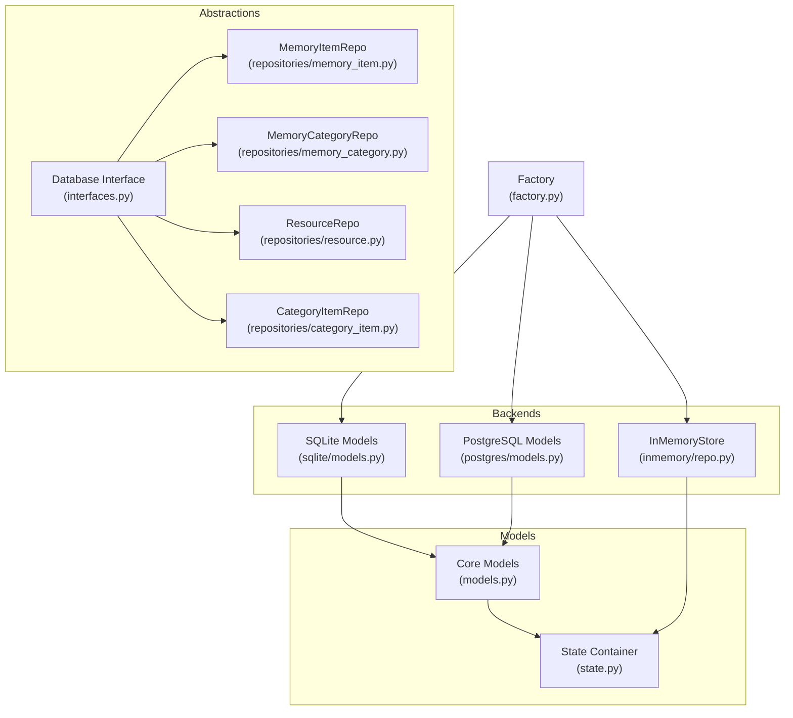
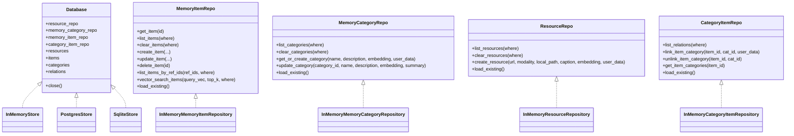
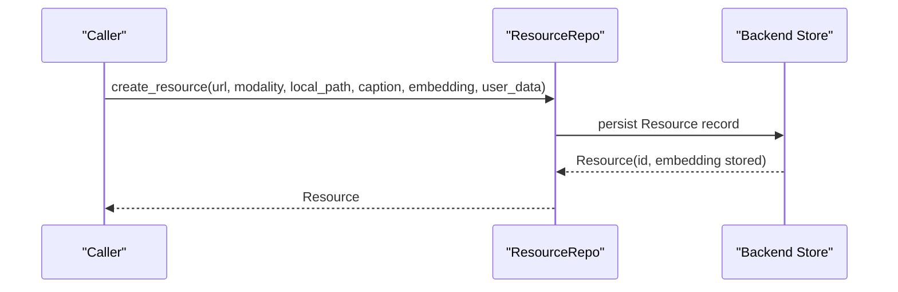
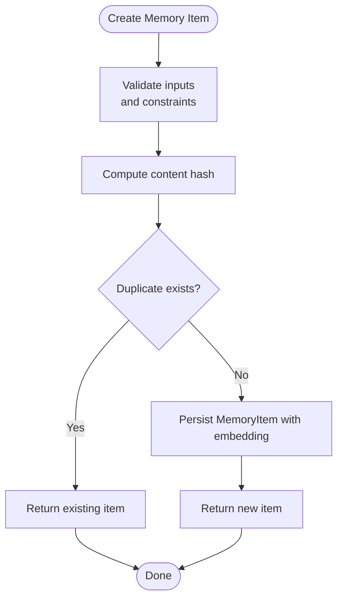
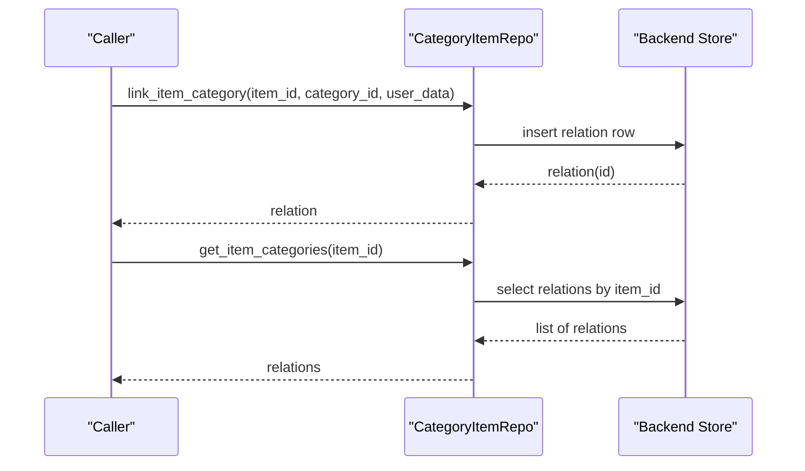
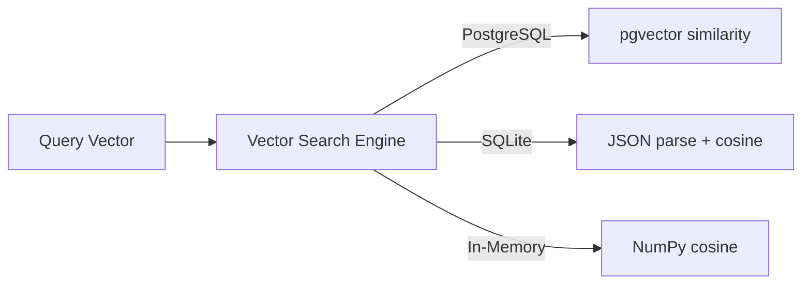
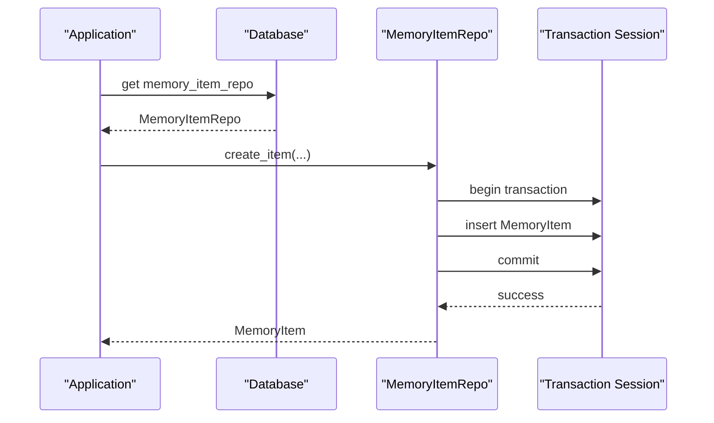
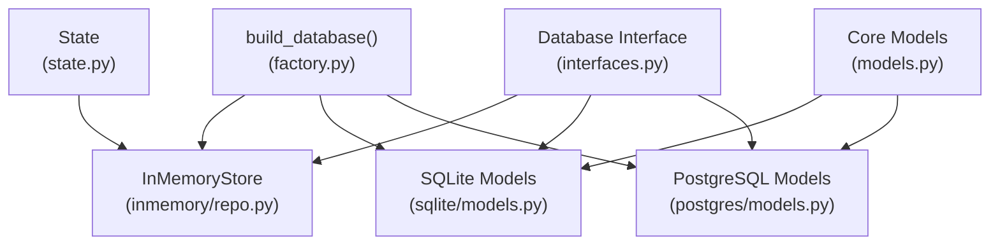

# Database Persistence and Indexing

<cite>
**Referenced Files in This Document**
- [database/__init__.py](file://src/memu/database/__init__.py)
- [database/models.py](file://src/memu/database/models.py)
- [database/interfaces.py](file://src/memu/database/interfaces.py)
- [database/state.py](file://src/memu/database/state.py)
- [database/factory.py](file://src/memu/database/factory.py)
- [database/repositories/memory_item.py](file://src/memu/database/repositories/memory_item.py)
- [database/repositories/memory_category.py](file://src/memu/database/repositories/memory_category.py)
- [database/repositories/resource.py](file://src/memu/database/repositories/resource.py)
- [database/repositories/category_item.py](file://src/memu/database/repositories/category_item.py)
- [database/sqlite/models.py](file://src/memu/database/sqlite/models.py)
- [database/postgres/models.py](file://src/memu/database/postgres/models.py)
- [database/inmemory/repo.py](file://src/memu/database/inmemory/repo.py)
- [database/inmemory/vector.py](file://src/memu/database/inmemory/vector.py)
</cite>

## Table of Contents
1. [Introduction](#introduction)
2. [Project Structure](#project-structure)
3. [Core Components](#core-components)
4. [Architecture Overview](#architecture-overview)
5. [Detailed Component Analysis](#detailed-component-analysis)
6. [Dependency Analysis](#dependency-analysis)
7. [Performance Considerations](#performance-considerations)
8. [Troubleshooting Guide](#troubleshooting-guide)
9. [Conclusion](#conclusion)

## Introduction
This document explains how memU persists extracted memories and maintains efficient retrieval indexes across pluggable database backends. It covers the resource creation process, memory item persistence, category-item relationships, and embedding storage mechanisms. It documents the repository pattern implementation, transaction management, index maintenance strategies, and backend-specific behaviors for SQLite and PostgreSQL. It also describes data validation, constraint enforcement, batch processing capabilities, cleanup procedures, category update mechanisms, and summary maintenance.

## Project Structure
MemU organizes persistence and indexing under a unified database abstraction with pluggable backends:
- A backend-agnostic model layer defines records for resources, memory items, categories, and relations.
- A repository protocol layer defines CRUD and vector-search APIs.
- Backend-specific implementations (in-memory, SQLite, PostgreSQL) implement the protocols and define schema/indexes/embedding storage.
- A factory builds the appropriate backend given configuration.

**Diagram sources**
- [database/interfaces.py](file://src/memu/database/interfaces.py#L12-L27)
- [database/repositories/memory_item.py](file://src/memu/database/repositories/memory_item.py#L9-L55)
- [database/repositories/memory_category.py](file://src/memu/database/repositories/memory_category.py#L9-L34)
- [database/repositories/resource.py](file://src/memu/database/repositories/resource.py#L9-L31)
- [database/repositories/category_item.py](file://src/memu/database/repositories/category_item.py#L9-L24)
- [database/models.py](file://src/memu/database/models.py#L35-L148)
- [database/state.py](file://src/memu/database/state.py#L8-L16)
- [database/inmemory/repo.py](file://src/memu/database/inmemory/repo.py#L20-L61)
- [database/sqlite/models.py](file://src/memu/database/sqlite/models.py#L28-L237)
- [database/postgres/models.py](file://src/memu/database/postgres/models.py#L28-L181)
- [database/factory.py](file://src/memu/database/factory.py#L15-L44)

**Section sources**
- [database/__init__.py](file://src/memu/database/__init__.py#L1-L29)
- [database/factory.py](file://src/memu/database/factory.py#L15-L44)

## Core Components
- Records and Scoping
  - BaseRecord provides UUID id and timestamps; derived records include Resource, MemoryItem, MemoryCategory, and CategoryItem.
  - Utility functions build scoped models that merge user-defined scope models with core records, ensuring field uniqueness.
  - Deduplication helpers normalize content for hashing to prevent duplicate memories.

- Repository Protocols
  - MemoryItemRepo: create, update, delete, list, vector search, and reference-based lookup.
  - MemoryCategoryRepo: list, get-or-create, update, and summary maintenance.
  - ResourceRepo: create and list resources; supports embedding storage per backend.
  - CategoryItemRepo: manage many-to-many links between items and categories.

- Backend Contracts
  - Database Protocol exposes typed repositories and in-memory caches for fast iteration.
  - InMemoryStore implements the Database protocol using in-memory dicts/lists and delegates to in-memory repositories.

**Section sources**
- [database/models.py](file://src/memu/database/models.py#L35-L148)
- [database/repositories/memory_item.py](file://src/memu/database/repositories/memory_item.py#L9-L55)
- [database/repositories/memory_category.py](file://src/memu/database/repositories/memory_category.py#L9-L34)
- [database/repositories/resource.py](file://src/memu/database/repositories/resource.py#L9-L31)
- [database/repositories/category_item.py](file://src/memu/database/repositories/category_item.py#L9-L24)
- [database/interfaces.py](file://src/memu/database/interfaces.py#L12-L27)
- [database/inmemory/repo.py](file://src/memu/database/inmemory/repo.py#L20-L61)

## Architecture Overview
The persistence architecture separates concerns:
- Abstraction: Database interface and repository protocols define the API surface.
- Implementation: Backends implement repositories and models; in-memory uses pure Python structures; SQLite/PostgreSQL use SQLModel with schema/index definitions.
- Embeddings: Stored as native vector types (PostgreSQL) or serialized JSON (SQLite); in-memory stores lists directly.
- Indexing: Unique constraints on category names; composite unique indexes on item-category relations; scope-aware indexes for user scoping.

**Diagram sources**
- [database/interfaces.py](file://src/memu/database/interfaces.py#L12-L27)
- [database/inmemory/repo.py](file://src/memu/database/inmemory/repo.py#L20-L61)
- [database/repositories/memory_item.py](file://src/memu/database/repositories/memory_item.py#L9-L55)
- [database/repositories/memory_category.py](file://src/memu/database/repositories/memory_category.py#L9-L34)
- [database/repositories/resource.py](file://src/memu/database/repositories/resource.py#L9-L31)
- [database/repositories/category_item.py](file://src/memu/database/repositories/category_item.py#L9-L24)

## Detailed Component Analysis

### Resource Creation and Embedding Storage
- Resource creation is performed via ResourceRepo.create_resource, accepting URL, modality, local path, optional caption, optional embedding, and user data.
- Embedding storage varies by backend:
  - PostgreSQL: Uses a native vector type column for efficient similarity indexing.
  - SQLite: Stores embeddings as JSON strings; properties serialize/deserialize safely with logging on parse errors.
  - In-memory: Stores embedding as a list of floats directly.

**Diagram sources**
- [database/repositories/resource.py](file://src/memu/database/repositories/resource.py#L19-L28)
- [database/sqlite/models.py](file://src/memu/database/sqlite/models.py#L48-L76)
- [database/postgres/models.py](file://src/memu/database/postgres/models.py#L46-L51)
- [database/inmemory/repo.py](file://src/memu/database/inmemory/repo.py#L50-L57)

**Section sources**
- [database/repositories/resource.py](file://src/memu/database/repositories/resource.py#L19-L28)
- [database/sqlite/models.py](file://src/memu/database/sqlite/models.py#L48-L76)
- [database/postgres/models.py](file://src/memu/database/postgres/models.py#L46-L51)

### Memory Item Persistence and Deduplication
- Memory items are created via MemoryItemRepo.create_item, taking resource_id, memory_type, summary, embedding, and user data.
- Deduplication is supported by computing a content hash on normalized summary and memory_type to detect near-duplicate memories.
- Extra metadata can include reinforcement tracking, reference IDs, and tool-call histories.

**Diagram sources**
- [database/repositories/memory_item.py](file://src/memu/database/repositories/memory_item.py#L21-L31)
- [database/models.py](file://src/memu/database/models.py#L15-L32)

**Section sources**
- [database/repositories/memory_item.py](file://src/memu/database/repositories/memory_item.py#L21-L31)
- [database/models.py](file://src/memu/database/models.py#L15-L32)

### Category-Item Relationships and Cross-References
- CategoryItemRepo manages many-to-many relationships between items and categories.
- link_item_category enforces a unique composite index on (item_id, category_id) to prevent duplicates.
- get_item_categories retrieves all relations for a given item ID.
- Unlink removes a specific relation; clear operations can remove all relations matching filters.

**Diagram sources**
- [database/repositories/category_item.py](file://src/memu/database/repositories/category_item.py#L17-L21)
- [database/sqlite/models.py](file://src/memu/database/sqlite/models.py#L138-L144)
- [database/postgres/models.py](file://src/memu/database/postgres/models.py#L70-L74)

**Section sources**
- [database/repositories/category_item.py](file://src/memu/database/repositories/category_item.py#L17-L21)
- [database/sqlite/models.py](file://src/memu/database/sqlite/models.py#L138-L144)
- [database/postgres/models.py](file://src/memu/database/postgres/models.py#L70-L74)

### Embedding Storage Mechanisms and Vector Similarity Indexing
- PostgreSQL
  - Embeddings are stored as native vector type, enabling efficient vector similarity operations and GIN/HNSW-like indexes via pgvector.
  - Models define embedding fields on resources, memory items, and categories.
- SQLite
  - Embeddings are stored as JSON strings; properties serialize/deserialize with safe parsing and warnings on failure.
  - Indexes are defined at the ORM level; composite unique indexes prevent duplicate item-category pairs.
- In-Memory
  - Embeddings are stored as plain float lists; vector similarity ranking is computed in-memory.

**Diagram sources**
- [database/postgres/models.py](file://src/memu/database/postgres/models.py#L46-L67)
- [database/sqlite/models.py](file://src/memu/database/sqlite/models.py#L58-L76)
- [database/inmemory/vector.py](file://src/memu/database/inmemory/vector.py#L56-L91)

**Section sources**
- [database/postgres/models.py](file://src/memu/database/postgres/models.py#L46-L67)
- [database/sqlite/models.py](file://src/memu/database/sqlite/models.py#L58-L76)
- [database/inmemory/vector.py](file://src/memu/database/inmemory/vector.py#L56-L91)

### Repository Pattern Implementation and Transaction Management
- Repositories encapsulate persistence logic behind typed protocols, enabling backend switching without changing application code.
- InMemoryStore provides an in-memory cache (resources/items/categories/relations) and delegates to in-memory repositories.
- SQLite and PostgreSQL backends rely on SQLModel sessions for transactions; operations are atomic per method call.
- Cleanup and clearing methods allow removing records by filters, supporting batch operations.

**Diagram sources**
- [database/interfaces.py](file://src/memu/database/interfaces.py#L12-L27)
- [database/inmemory/repo.py](file://src/memu/database/inmemory/repo.py#L20-L61)
- [database/repositories/memory_item.py](file://src/memu/database/repositories/memory_item.py#L21-L31)

**Section sources**
- [database/interfaces.py](file://src/memu/database/interfaces.py#L12-L27)
- [database/inmemory/repo.py](file://src/memu/database/inmemory/repo.py#L20-L61)
- [database/repositories/memory_item.py](file://src/memu/database/repositories/memory_item.py#L21-L31)

### Index Maintenance Strategies
- Unique Constraints
  - Category name uniqueness enforced at the database level for consistent categorization.
  - Composite unique index on item-category relation prevents duplicate links.
- Scope-Aware Indexes
  - Backends build indexes that include user scope fields to optimize queries for tenant/partitioned data.
- Embedding Indexing
  - PostgreSQL leverages vector indexes for similarity search.
  - SQLite relies on JSON parsing and cosine similarity ranking; consider adding virtual tables or external indexing for large datasets.

**Section sources**
- [database/postgres/models.py](file://src/memu/database/postgres/models.py#L163-L168)
- [database/sqlite/models.py](file://src/memu/database/sqlite/models.py#L204-L207)
- [database/sqlite/models.py](file://src/memu/database/sqlite/models.py#L144)

### Category Update Mechanisms and Summary Maintenance
- MemoryCategoryRepo.update_category allows updating name, description, embedding, and summary.
- Summary maintenance is part of category updates; summaries can be recomputed or set during category lifecycle.
- Unique constraints on category names ensure consistent taxonomy.

**Section sources**
- [database/repositories/memory_category.py](file://src/memu/database/repositories/memory_category.py#L23-L31)
- [database/postgres/models.py](file://src/memu/database/postgres/models.py#L63-L67)

### Data Validation, Constraint Enforcement, and Batch Processing
- Validation
  - Pydantic models enforce field types and presence; extra fields are allowed via scoped model merging.
  - Safe parsing of embeddings in SQLite with logging on parse failures.
- Constraints
  - Unique indexes on category names and item-category pairs.
  - Foreign keys cascade deletes to maintain referential integrity.
- Batch Operations
  - Clear methods accept filters to remove multiple records efficiently.
  - Vector search returns top-k matches; salience-aware ranking combines similarity, reinforcement count, and recency.

**Section sources**
- [database/models.py](file://src/memu/database/models.py#L108-L134)
- [database/sqlite/models.py](file://src/memu/database/sqlite/models.py#L144)
- [database/postgres/models.py](file://src/memu/database/postgres/models.py#L70-L74)
- [database/inmemory/vector.py](file://src/memu/database/inmemory/vector.py#L94-L127)

### Cleanup Procedures
- Clear methods in repositories enable bulk deletion filtered by conditions.
- In-memory state can be reset by reloading existing data or clearing internal caches.
- Backend-specific cleanup includes dropping tables or truncating rows depending on configuration.

**Section sources**
- [database/repositories/memory_item.py](file://src/memu/database/repositories/memory_item.py#L19)
- [database/repositories/memory_category.py](file://src/memu/database/repositories/memory_category.py#L17)
- [database/repositories/resource.py](file://src/memu/database/repositories/resource.py#L17)
- [database/repositories/category_item.py](file://src/memu/database/repositories/category_item.py#L15)

## Dependency Analysis
The database module exhibits clean separation of concerns:
- Factory selects backend based on configuration.
- Interfaces define contracts; implementations vary by backend.
- Models unify schema and embedding semantics; scoped models integrate user-defined fields.
- Repositories isolate persistence logic and expose vector search capabilities.

**Diagram sources**
- [database/factory.py](file://src/memu/database/factory.py#L15-L44)
- [database/interfaces.py](file://src/memu/database/interfaces.py#L12-L27)
- [database/inmemory/repo.py](file://src/memu/database/inmemory/repo.py#L20-L61)
- [database/sqlite/models.py](file://src/memu/database/sqlite/models.py#L28-L237)
- [database/postgres/models.py](file://src/memu/database/postgres/models.py#L28-L181)
- [database/models.py](file://src/memu/database/models.py#L35-L148)
- [database/state.py](file://src/memu/database/state.py#L8-L16)

**Section sources**
- [database/factory.py](file://src/memu/database/factory.py#L15-L44)
- [database/interfaces.py](file://src/memu/database/interfaces.py#L12-L27)

## Performance Considerations
- Vector Similarity
  - PostgreSQL: Native vector types enable efficient similarity scans; leverage vector indexes for large-scale retrieval.
  - SQLite: JSON-based embeddings require parsing; consider external indexing or limiting dataset size for performance.
  - In-memory: NumPy-based vectorized cosine similarity with argpartition for top-k selection.
- Salience Ranking
  - Combine similarity, reinforcement count, and recency decay to prioritize relevant memories.
- Indexing
  - Unique indexes on category names and item-category pairs reduce duplicate inserts and speed lookups.
  - Scope-aware indexes improve partitioned queries.
- Transactions
  - Use atomic operations per repository method to ensure consistency; batch writes where supported by backend.

[No sources needed since this section provides general guidance]

## Troubleshooting Guide
- Embedding Parsing Failures (SQLite)
  - Symptoms: None returned for embedding fields.
  - Cause: Malformed JSON in embedding storage.
  - Resolution: Verify embedding serialization; check logs for warnings; re-ingest data.
- Missing pgvector (PostgreSQL)
  - Symptoms: Import error when importing pgvector.
  - Cause: Optional dependency not installed.
  - Resolution: Install pgvector support as required by backend.
- Duplicate Categories or Relations
  - Symptoms: Integrity errors on insert.
  - Cause: Missing unique constraints or duplicate keys.
  - Resolution: Enforce unique indexes; use get-or-create/update flows.
- Salience Score Issues
  - Symptoms: Unexpected ordering in ranked results.
  - Cause: Incorrect reinforcement counts or recency decay configuration.
  - Resolution: Validate extra metadata fields and decay parameters.

**Section sources**
- [database/sqlite/models.py](file://src/memu/database/sqlite/models.py#L63-L67)
- [database/postgres/models.py](file://src/memu/database/postgres/models.py#L9-L13)
- [database/sqlite/models.py](file://src/memu/database/sqlite/models.py#L144)
- [database/inmemory/vector.py](file://src/memu/database/inmemory/vector.py#L94-L127)

## Conclusion
MemU’s persistence and indexing design cleanly separates abstraction from implementation, enabling pluggable backends while maintaining consistent APIs for memory creation, embedding storage, and vector similarity retrieval. Unique constraints, scope-aware indexes, and salience-aware ranking deliver robust and efficient memory management across SQLite, PostgreSQL, and in-memory scenarios. The repository pattern and typed interfaces simplify integration, testing, and future backend extensions.