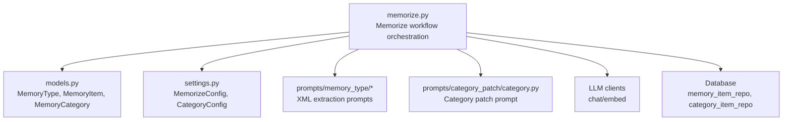
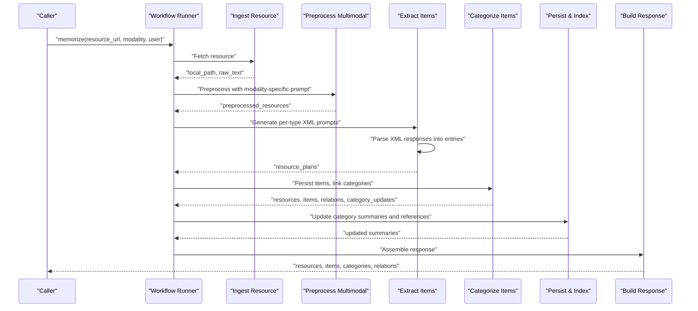
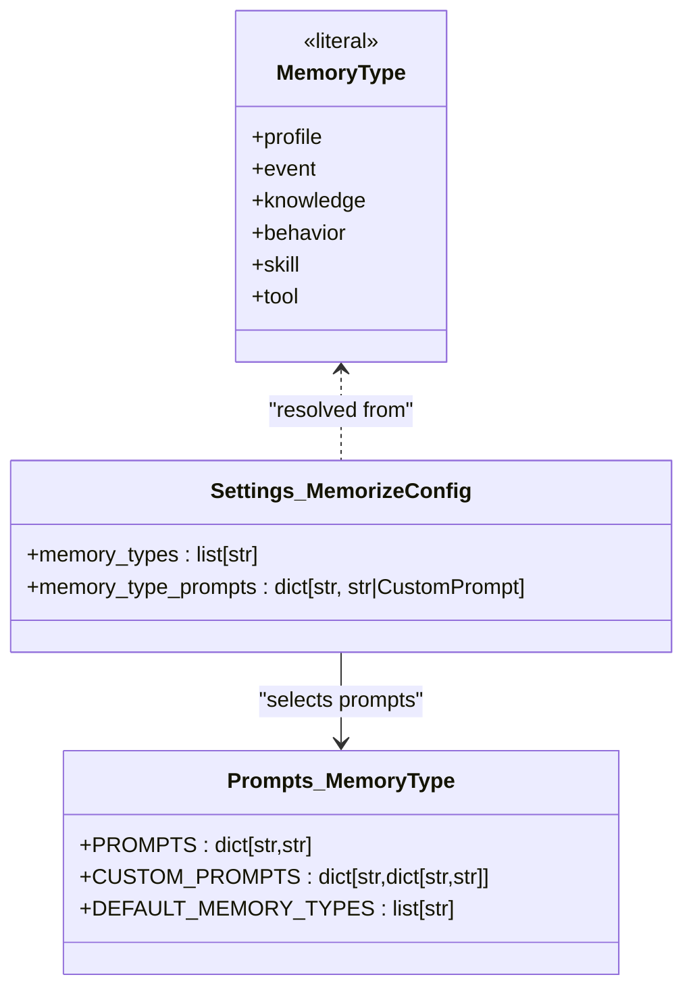
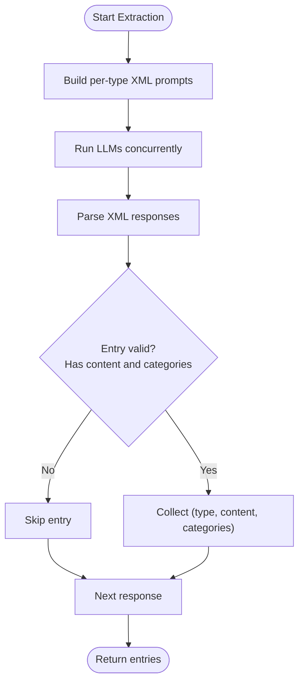
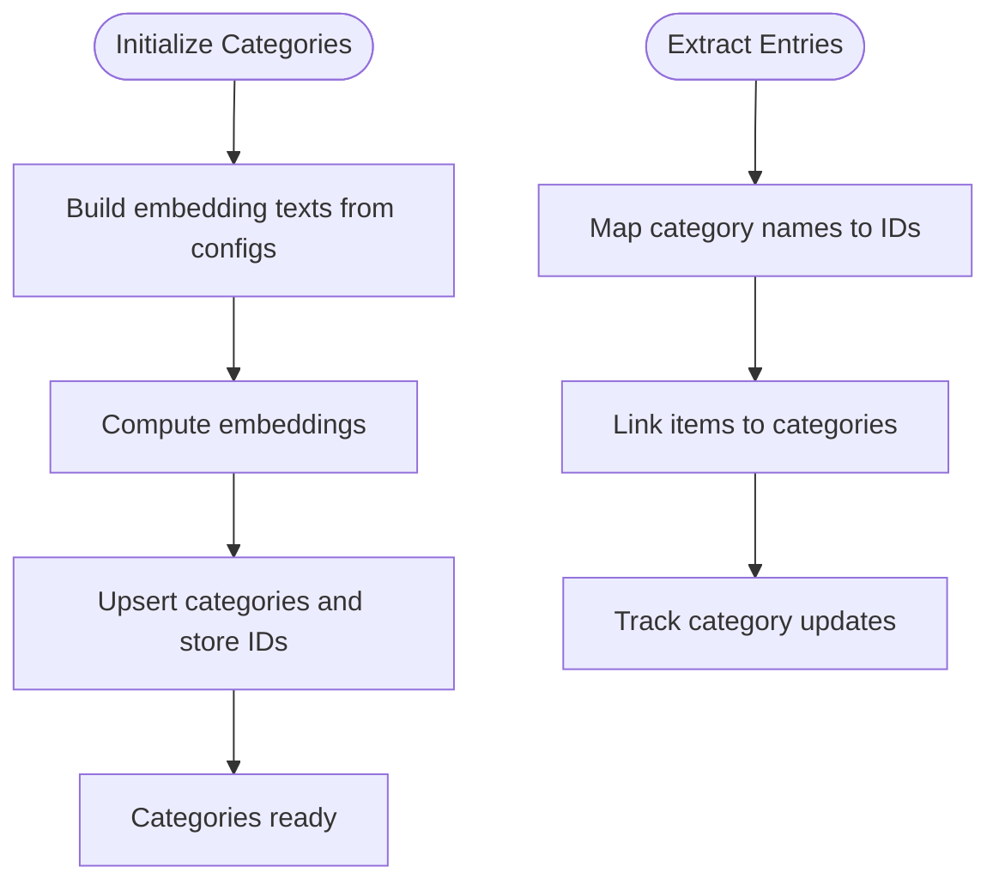
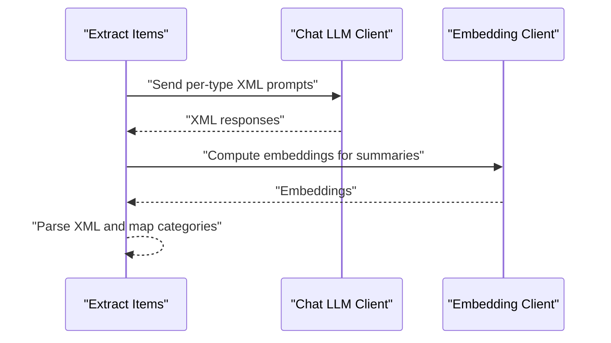
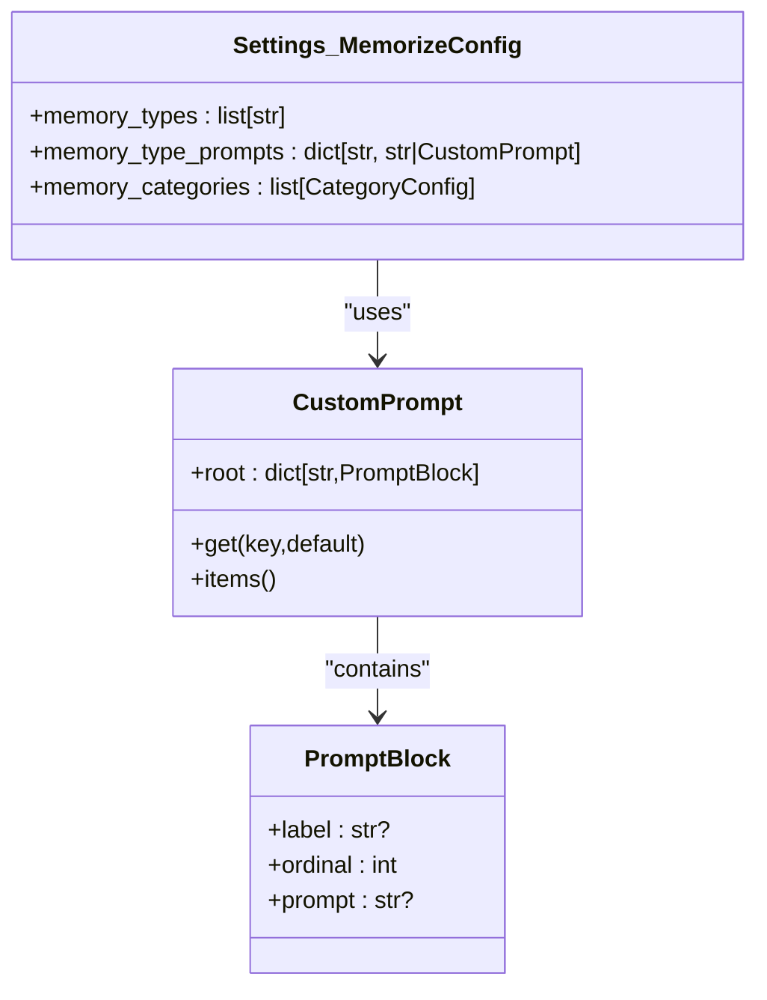
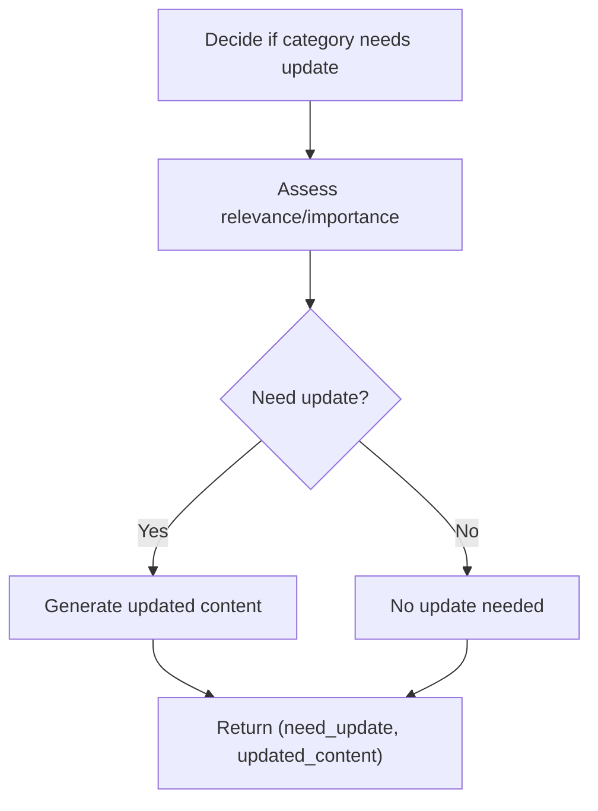
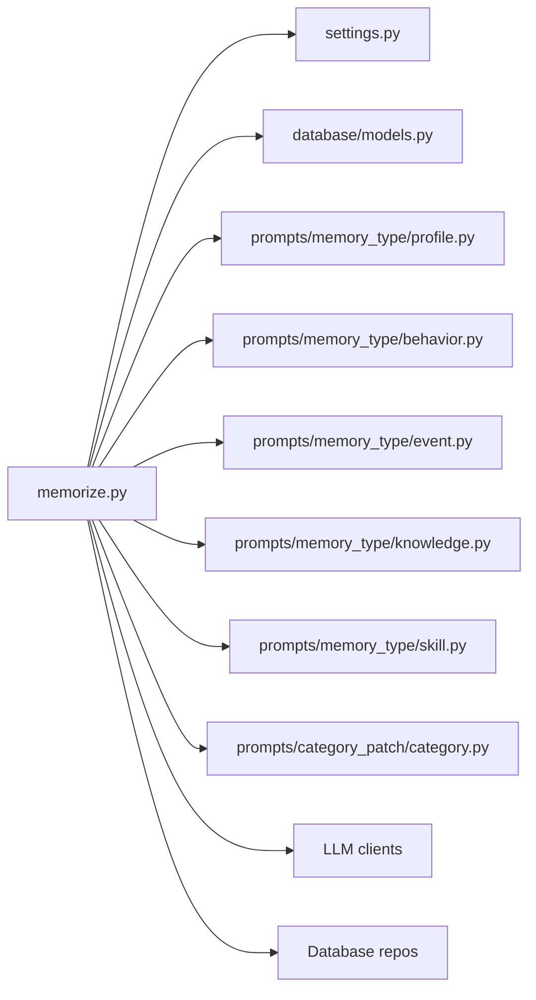

# Memory Extraction and Structuring

<cite>
**Referenced Files in This Document**
- [memorize.py](file://src/memu/app/memorize.py)
- [models.py](file://src/memu/database/models.py)
- [settings.py](file://src/memu/app/settings.py)
- [__init__.py](file://src/memu/prompts/memory_type/__init__.py)
- [profile.py](file://src/memu/prompts/memory_type/profile.py)
- [behavior.py](file://src/memu/prompts/memory_type/behavior.py)
- [event.py](file://src/memu/prompts/memory_type/event.py)
- [knowledge.py](file://src/memu/prompts/memory_type/knowledge.py)
- [skill.py](file://src/memu/prompts/memory_type/skill.py)
- [category.py](file://src/memu/prompts/category_patch/category.py)
</cite>

## Table of Contents
1. [Introduction](#introduction)
2. [Project Structure](#project-structure)
3. [Core Components](#core-components)
4. [Architecture Overview](#architecture-overview)
5. [Detailed Component Analysis](#detailed-component-analysis)
6. [Dependency Analysis](#dependency-analysis)
7. [Performance Considerations](#performance-considerations)
8. [Troubleshooting Guide](#troubleshooting-guide)
9. [Conclusion](#conclusion)

## Introduction
This document explains how memU transforms preprocessed content into structured memory items. It covers the memory type classification system, XML-based extraction prompts, structured entry generation, category mapping, validation, and integration with LLM clients. It also describes fallback mechanisms, quality assurance measures, custom memory type configuration, category patch systems, and workflow engine integration.

## Project Structure
The memory extraction and structuring pipeline lives primarily in the application layer and prompt modules:
- Application orchestration and workflow steps: src/memu/app/memorize.py
- Data models and memory types: src/memu/database/models.py
- Configuration and customization: src/memu/app/settings.py
- Memory type prompts: src/memu/prompts/memory_type/*
- Category patch prompt: src/memu/prompts/category_patch/category.py

**Diagram sources**
- [memorize.py](file://src/memu/app/memorize.py#L97-L166)
- [models.py](file://src/memu/database/models.py#L12-L149)
- [settings.py](file://src/memu/app/settings.py#L204-L243)
- [__init__.py](file://src/memu/prompts/memory_type/__init__.py#L1-L47)
- [category.py](file://src/memu/prompts/category_patch/category.py#L1-L46)

**Section sources**
- [memorize.py](file://src/memu/app/memorize.py#L97-L166)
- [models.py](file://src/memu/database/models.py#L12-L149)
- [settings.py](file://src/memu/app/settings.py#L204-L243)
- [__init__.py](file://src/memu/prompts/memory_type/__init__.py#L1-L47)

## Core Components
- Memory types: profile, event, knowledge, behavior, skill, tool are supported and represented as a literal type.
- Workflow pipeline: ingest, preprocess, extract, dedupe/merge, categorize, persist/index, emit response.
- Structured extraction: Each memory type has an XML-based prompt that requests a specific XML envelope containing multiple memory entries.
- Category mapping: Categories are initialized once and mapped by name to IDs; extraction outputs include category names that are mapped to category IDs.
- Validation: XML parsing enforces presence of content and categories; optional deduplication and reinforcement are configurable.

**Section sources**
- [models.py](file://src/memu/database/models.py#L12-L149)
- [memorize.py](file://src/memu/app/memorize.py#L97-L166)
- [memorize.py](file://src/memu/app/memorize.py#L519-L553)
- [memorize.py](file://src/memu/app/memorize.py#L648-L687)

## Architecture Overview
The memory extraction pipeline is a workflow with explicit steps and roles. The extract step builds per-type prompts and invokes LLM clients to produce XML responses, which are parsed into structured entries. The categorize step persists items and links them to categories.

**Diagram sources**
- [memorize.py](file://src/memu/app/memorize.py#L65-L95)
- [memorize.py](file://src/memu/app/memorize.py#L97-L166)
- [memorize.py](file://src/memu/app/memorize.py#L181-L325)

## Detailed Component Analysis

### Memory Type Classification System
- Supported types: profile, event, knowledge, behavior, skill, tool.
- Default selection is configurable; the resolver returns the configured list as typed values.
- Each type has a dedicated XML-based prompt that defines:
  - Objective
  - Workflow
  - Rules and forbidden content
  - Output format (XML envelope with multiple memory entries)
  - Examples and input placeholder

**Diagram sources**
- [models.py](file://src/memu/database/models.py#L12-L149)
- [settings.py](file://src/memu/app/settings.py#L204-L243)
- [__init__.py](file://src/memu/prompts/memory_type/__init__.py#L1-L47)

**Section sources**
- [models.py](file://src/memu/database/models.py#L12-L149)
- [settings.py](file://src/memu/app/settings.py#L204-L243)
- [__init__.py](file://src/memu/prompts/memory_type/__init__.py#L1-L47)

### XML-Based Extraction Prompts and Structured Entry Generation
- Per-type prompts define an XML envelope that contains multiple memory entries.
- Each memory entry includes:
  - content: the extracted memory text
  - categories: a list of category names
- The extractor builds one prompt per memory type, runs them concurrently, and parses the XML responses into a uniform list of (memory_type, content, categories) tuples.
- Parsing validates that both content and categories are present; empty or invalid entries are skipped.

**Diagram sources**
- [memorize.py](file://src/memu/app/memorize.py#L519-L553)
- [memorize.py](file://src/memu/app/memorize.py#L1290-L1310)

**Section sources**
- [memorize.py](file://src/memu/app/memorize.py#L519-L553)
- [memorize.py](file://src/memu/app/memorize.py#L1290-L1310)
- [profile.py](file://src/memu/prompts/memory_type/profile.py#L109-L126)
- [behavior.py](file://src/memu/prompts/memory_type/behavior.py#L100-L117)
- [event.py](file://src/memu/prompts/memory_type/event.py#L112-L129)
- [knowledge.py](file://src/memu/prompts/memory_type/knowledge.py#L99-L116)
- [skill.py](file://src/memu/prompts/memory_type/skill.py#L434-L484)

### Category Mapping Mechanism
- Categories are initialized at startup using embeddings derived from category names and descriptions.
- A mapping from category name (lowercased and stripped) to category ID is maintained.
- During extraction, category names returned by the LLM are mapped to category IDs; duplicates are de-duplicated by ID.

**Diagram sources**
- [memorize.py](file://src/memu/app/memorize.py#L648-L687)
- [memorize.py](file://src/memu/app/memorize.py#L578-L623)

**Section sources**
- [memorize.py](file://src/memu/app/memorize.py#L648-L687)
- [memorize.py](file://src/memu/app/memorize.py#L578-L623)

### Content Validation Processes
- XML parsing enforces that each memory entry contains both content and categories; otherwise it is ignored.
- Additional validation rules are embedded in each memory type prompt (e.g., word limits, forbidden content, merging/replacement rules).
- Optional reinforcement tracking and deduplication can be enabled via configuration.

**Section sources**
- [memorize.py](file://src/memu/app/memorize.py#L1290-L1310)
- [profile.py](file://src/memu/prompts/memory_type/profile.py#L73-L102)
- [behavior.py](file://src/memu/prompts/memory_type/behavior.py#L62-L93)
- [event.py](file://src/memu/prompts/memory_type/event.py#L74-L105)
- [knowledge.py](file://src/memu/prompts/memory_type/knowledge.py#L88-L92)
- [skill.py](file://src/memu/prompts/memory_type/skill.py#L370-L427)
- [settings.py](file://src/memu/app/settings.py#L239-L242)

### Relationship with LLM Clients for Structured Extraction
- Extraction uses a chat LLM profile to request XML outputs.
- Embeddings are computed via an embedding client for item vectors.
- Preprocessing uses a separate chat LLM profile; multimodal preprocessing prompts can be customized.

**Diagram sources**
- [memorize.py](file://src/memu/app/memorize.py#L519-L553)
- [memorize.py](file://src/memu/app/memorize.py#L595-L597)

**Section sources**
- [memorize.py](file://src/memu/app/memorize.py#L519-L553)
- [memorize.py](file://src/memu/app/memorize.py#L595-L597)
- [settings.py](file://src/memu/app/settings.py#L204-L243)

### Fallback Mechanisms for Extraction Failures
- If no text is available for a resource, extraction is skipped for that resource.
- If a segment-based conversation yields no entries, a fallback entry can be constructed for the segment.
- A no-result fallback entry can be produced when extraction returns no structured content.

Note: Some fallback helpers exist but are currently commented out in the code; the current parser skips invalid entries rather than falling back to raw text.

**Section sources**
- [memorize.py](file://src/memu/app/memorize.py#L438-L455)
- [memorize.py](file://src/memu/app/memorize.py#L566-L577)
- [memorize.py](file://src/memu/app/memorize.py#L541-L553)

### Quality Assurance Measures
- XML parsing ensures content and categories are present.
- Prompt-defined rules enforce content quality (word limits, forbidden topics, merging/replacement).
- Optional item reinforcement and deduplication reduce noise and improve recall.
- Optional item references in category summaries enable traceability.

**Section sources**
- [memorize.py](file://src/memu/app/memorize.py#L1290-L1310)
- [settings.py](file://src/memu/app/settings.py#L235-L242)

### Custom Memory Type Configuration
- Default memory types and prompts are provided; users can override per-type prompts and specify a custom order.
- Custom prompts support ordered blocks (objective, workflow, rules, category, output, examples, input) with ordinal ordering.
- Category configurations define category names, descriptions, and optional custom prompts for category summaries.

**Diagram sources**
- [settings.py](file://src/memu/app/settings.py#L38-L64)
- [settings.py](file://src/memu/app/settings.py#L204-L243)

**Section sources**
- [settings.py](file://src/memu/app/settings.py#L38-L64)
- [settings.py](file://src/memu/app/settings.py#L204-L243)

### Category Patch Systems
- Category summaries can be updated when new memories are added.
- A category patch prompt determines whether an existing profile needs updating and produces an updated version when appropriate.
- The patch response is parsed to extract a boolean flag and updated content.

**Diagram sources**
- [category.py](file://src/memu/prompts/category_patch/category.py#L1-L46)
- [memorize.py](file://src/memu/app/memorize.py#L283-L297)

**Section sources**
- [category.py](file://src/memu/prompts/category_patch/category.py#L1-L46)
- [memorize.py](file://src/memu/app/memorize.py#L283-L297)

### Integration with the Workflow Engine
- The memorize operation constructs a workflow state and executes a fixed sequence of steps:
  - Ingest resource
  - Preprocess multimodal
  - Extract items (XML-based)
  - Dedupe/Merge (placeholder)
  - Categorize items (persist and link)
  - Persist and index (update summaries and references)
  - Build response
- Steps declare required and produced keys and capabilities, enabling modular orchestration.

**Section sources**
- [memorize.py](file://src/memu/app/memorize.py#L65-L95)
- [memorize.py](file://src/memu/app/memorize.py#L97-L166)
- [memorize.py](file://src/memu/app/memorize.py#L299-L325)

## Dependency Analysis
- The application module depends on:
  - Database models for typed memory items and categories
  - Settings for configuration and custom prompts
  - Prompt modules for memory type extraction
  - LLM clients for chat and embedding
  - Database repositories for persistence

**Diagram sources**
- [memorize.py](file://src/memu/app/memorize.py#L15-L36)
- [settings.py](file://src/memu/app/settings.py#L1-L322)
- [models.py](file://src/memu/database/models.py#L1-L149)
- [__init__.py](file://src/memu/prompts/memory_type/__init__.py#L1-L47)

**Section sources**
- [memorize.py](file://src/memu/app/memorize.py#L15-L36)
- [settings.py](file://src/memu/app/settings.py#L1-L322)
- [models.py](file://src/memu/database/models.py#L1-L149)
- [__init__.py](file://src/memu/prompts/memory_type/__init__.py#L1-L47)

## Performance Considerations
- Concurrent LLM calls: Extraction sends one prompt per memory type and awaits all responses concurrently to minimize latency.
- Batch embeddings: Summaries are embedded in a single batch when available.
- Preprocessing: Modality-specific preprocessing reduces downstream noise and improves extraction quality.
- Optional reinforcement and references: Enable richer retrieval but add computational overhead.

[No sources needed since this section provides general guidance]

## Troubleshooting Guide
- Extraction returns no entries:
  - Verify that the resource contains text and that preprocessing succeeded.
  - Check that the LLM returned valid XML with content and categories.
  - Confirm that category names in the response match initialized categories.
- Category mapping issues:
  - Ensure category names are properly lowercased and stripped.
  - Verify that categories were initialized before extraction.
- Custom prompts:
  - Ensure all required prompt blocks are provided when using custom prompts.
  - Confirm ordinal ordering for block composition.
- LLM failures:
  - Retry with a different profile or adjust temperature/top-p.
  - Validate endpoint overrides and credentials.

**Section sources**
- [memorize.py](file://src/memu/app/memorize.py#L1290-L1310)
- [memorize.py](file://src/memu/app/memorize.py#L648-L687)
- [settings.py](file://src/memu/app/settings.py#L38-L64)

## Conclusion
memU’s memory extraction and structuring pipeline converts preprocessed content into atomic, categorized memories using XML-based prompts tailored per memory type. The system supports customization via configurable memory types and prompts, robust category mapping, and quality controls enforced by prompts and XML parsing. Integration with the workflow engine and LLM clients enables scalable, structured memory ingestion suitable for downstream retrieval and summarization.