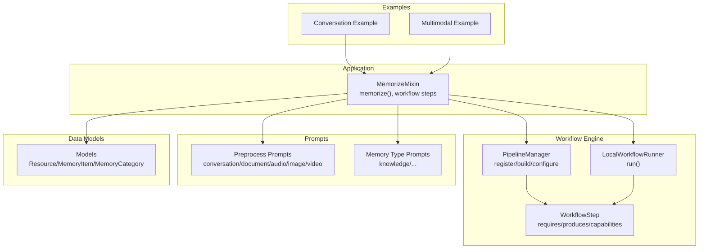
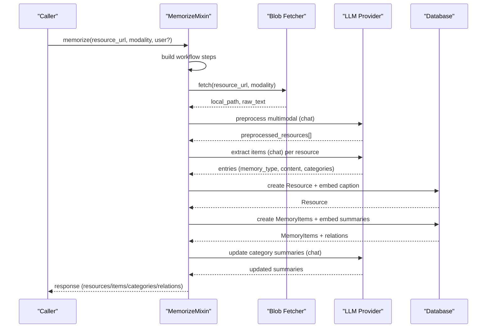
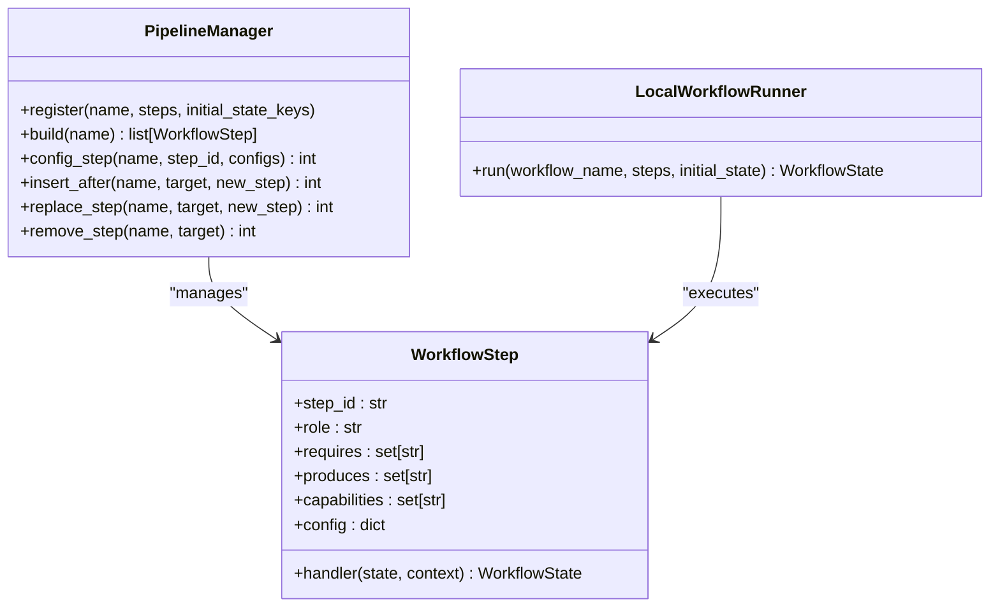
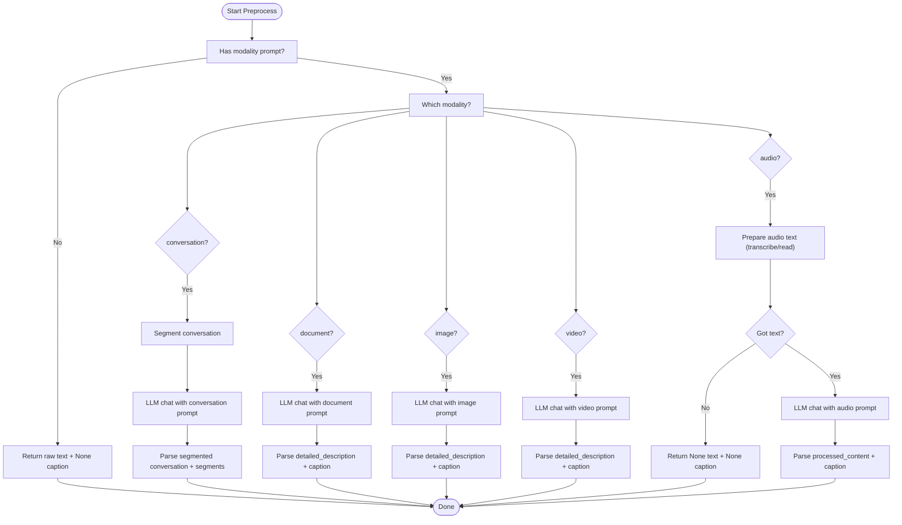
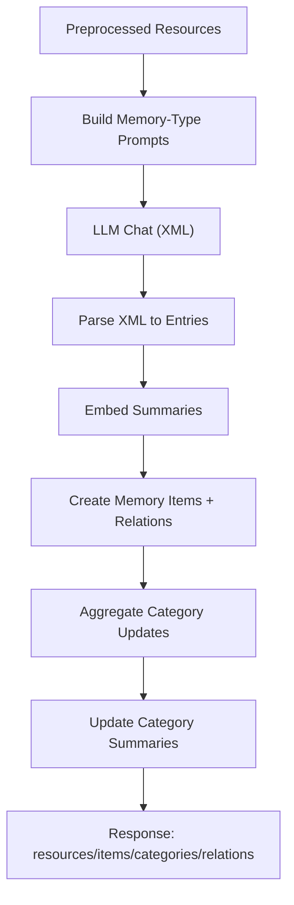
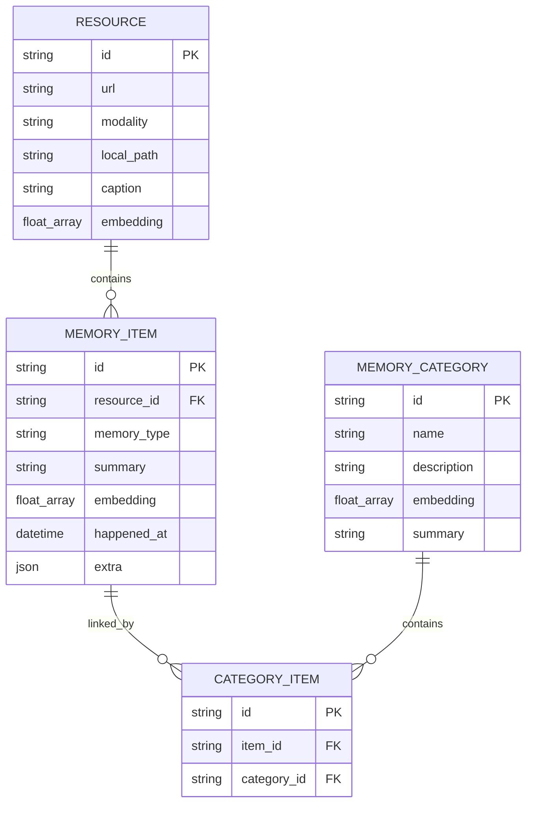
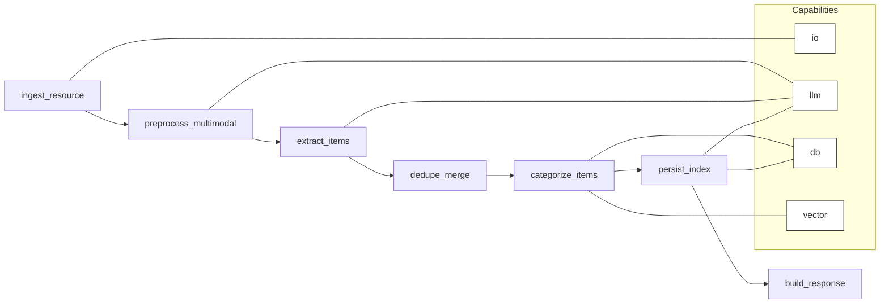

# Memory Ingestion Pipeline

<cite>
**Referenced Files in This Document**
- [memorize.py](file://src/memu/app/memorize.py)
- [pipeline.py](file://src/memu/workflow/pipeline.py)
- [runner.py](file://src/memu/workflow/runner.py)
- [step.py](file://src/memu/workflow/step.py)
- [models.py](file://src/memu/database/models.py)
- [conversation.py](file://src/memu/prompts/preprocess/conversation.py)
- [document.py](file://src/memu/prompts/preprocess/document.py)
- [audio.py](file://src/memu/prompts/preprocess/audio.py)
- [image.py](file://src/memu/prompts/preprocess/image.py)
- [video.py](file://src/memu/prompts/preprocess/video.py)
- [knowledge.py](file://src/memu/prompts/memory_type/knowledge.py)
- [example_1_conversation_memory.py](file://examples/example_1_conversation_memory.py)
- [example_3_multimodal_memory.py](file://examples/example_3_multimodal_memory.py)
</cite>

## Table of Contents
1. [Introduction](#introduction)
2. [Project Structure](#project-structure)
3. [Core Components](#core-components)
4. [Architecture Overview](#architecture-overview)
5. [Detailed Component Analysis](#detailed-component-analysis)
6. [Dependency Analysis](#dependency-analysis)
7. [Performance Considerations](#performance-considerations)
8. [Troubleshooting Guide](#troubleshooting-guide)
9. [Conclusion](#conclusion)
10. [Appendices](#appendices)

## Introduction
This document explains the memory ingestion pipeline in memU: how raw inputs (conversation, document, image, video, audio) are fetched, preprocessed, transformed into structured memories, categorized, persisted, and made available for retrieval. It covers the workflow engine integration, provider-backed LLM extraction, multimodal processing, automatic category generation, batching, error handling, and practical examples from the codebase.

## Project Structure
The memory ingestion pipeline spans several modules:
- Application orchestration and memory creation logic
- Workflow engine for step sequencing and capability routing
- Prompt templates for preprocessing and memory extraction
- Data models for resources, memory items, and categories
- Example scripts demonstrating end-to-end usage

**Diagram sources**
- [memorize.py](file://src/memu/app/memorize.py#L65-L166)
- [pipeline.py](file://src/memu/workflow/pipeline.py#L21-L46)
- [runner.py](file://src/memu/workflow/runner.py#L28-L39)
- [step.py](file://src/memu/workflow/step.py#L16-L48)
- [conversation.py](file://src/memu/prompts/preprocess/conversation.py#L1-L44)
- [document.py](file://src/memu/prompts/preprocess/document.py#L1-L36)
- [audio.py](file://src/memu/prompts/preprocess/audio.py#L1-L36)
- [image.py](file://src/memu/prompts/preprocess/image.py#L1-L35)
- [video.py](file://src/memu/prompts/preprocess/video.py#L1-L36)
- [knowledge.py](file://src/memu/prompts/memory_type/knowledge.py#L154-L162)
- [models.py](file://src/memu/database/models.py#L68-L106)
- [example_1_conversation_memory.py](file://examples/example_1_conversation_memory.py#L51-L118)
- [example_3_multimodal_memory.py](file://examples/example_3_multimodal_memory.py#L58-L138)

**Section sources**
- [memorize.py](file://src/memu/app/memorize.py#L65-L166)
- [pipeline.py](file://src/memu/workflow/pipeline.py#L21-L46)
- [runner.py](file://src/memu/workflow/runner.py#L28-L39)
- [step.py](file://src/memu/workflow/step.py#L16-L48)
- [models.py](file://src/memu/database/models.py#L68-L106)
- [conversation.py](file://src/memu/prompts/preprocess/conversation.py#L1-L44)
- [document.py](file://src/memu/prompts/preprocess/document.py#L1-L36)
- [audio.py](file://src/memu/prompts/preprocess/audio.py#L1-L36)
- [image.py](file://src/memu/prompts/preprocess/image.py#L1-L35)
- [video.py](file://src/memu/prompts/preprocess/video.py#L1-L36)
- [knowledge.py](file://src/memu/prompts/memory_type/knowledge.py#L154-L162)
- [example_1_conversation_memory.py](file://examples/example_1_conversation_memory.py#L51-L118)
- [example_3_multimodal_memory.py](file://examples/example_3_multimodal_memory.py#L58-L138)

## Core Components
- Memory ingestion orchestrator: builds and runs the “memorize” workflow, manages state, and coordinates preprocessing, extraction, categorization, persistence, and response building.
- Workflow engine: registers pipelines, validates step dependencies and capabilities, and executes steps locally or via pluggable runners.
- Preprocessing prompts: modality-specific templates for conversation segmentation, document condensation, media descriptions, and audio cleaning.
- Memory type prompts: structured extraction prompts for memory types (e.g., knowledge) with XML output expectations.
- Data models: Resource, MemoryItem, MemoryCategory, and CategoryItem define the persistent schema and relationships.
- Examples: demonstrate end-to-end usage for conversation and multimodal scenarios.

**Section sources**
- [memorize.py](file://src/memu/app/memorize.py#L65-L166)
- [pipeline.py](file://src/memu/workflow/pipeline.py#L21-L46)
- [runner.py](file://src/memu/workflow/runner.py#L28-L39)
- [step.py](file://src/memu/workflow/step.py#L16-L48)
- [models.py](file://src/memu/database/models.py#L68-L106)
- [conversation.py](file://src/memu/prompts/preprocess/conversation.py#L1-L44)
- [document.py](file://src/memu/prompts/preprocess/document.py#L1-L36)
- [audio.py](file://src/memu/prompts/preprocess/audio.py#L1-L36)
- [image.py](file://src/memu/prompts/preprocess/image.py#L1-L35)
- [video.py](file://src/memu/prompts/preprocess/video.py#L1-L36)
- [knowledge.py](file://src/memu/prompts/memory_type/knowledge.py#L154-L162)
- [example_1_conversation_memory.py](file://examples/example_1_conversation_memory.py#L51-L118)
- [example_3_multimodal_memory.py](file://examples/example_3_multimodal_memory.py#L58-L138)

## Architecture Overview
The pipeline is a five-stage workflow orchestrated by MemorizeMixin and executed by the workflow engine. It ingests a resource, preprocesses it per modality, extracts structured memories, deduplicates and merges, categorizes and persists, updates category summaries, and emits a consolidated response.

**Diagram sources**
- [memorize.py](file://src/memu/app/memorize.py#L65-L166)
- [memorize.py](file://src/memu/app/memorize.py#L181-L197)
- [memorize.py](file://src/memu/app/memorize.py#L199-L227)
- [memorize.py](file://src/memu/app/memorize.py#L234-L281)
- [memorize.py](file://src/memu/app/memorize.py#L283-L297)
- [memorize.py](file://src/memu/app/memorize.py#L299-L325)
- [step.py](file://src/memu/workflow/step.py#L40-L47)
- [runner.py](file://src/memu/workflow/runner.py#L28-L39)

## Detailed Component Analysis

### Workflow Engine and Execution
- PipelineManager registers named pipelines with ordered steps, validates dependencies and capabilities, and supports mutation to evolve steps.
- LocalWorkflowRunner executes steps sequentially, enforcing required state keys and invoking before/after/on-error interceptors.
- WorkflowStep defines requires/produces sets and capabilities, enabling capability-aware routing and LLM profile resolution.

**Diagram sources**
- [pipeline.py](file://src/memu/workflow/pipeline.py#L21-L122)
- [step.py](file://src/memu/workflow/step.py#L16-L48)
- [runner.py](file://src/memu/workflow/runner.py#L28-L39)

**Section sources**
- [pipeline.py](file://src/memu/workflow/pipeline.py#L21-L122)
- [step.py](file://src/memu/workflow/step.py#L16-L48)
- [runner.py](file://src/memu/workflow/runner.py#L28-L39)

### Preprocessing Stages by Modality
- Conversation: Segments long conversations into topic-coherent segments using a modality-specific prompt, then optionally processes each segment.
- Document: Condenses text and generates a one-sentence caption.
- Image/Video: Produces detailed descriptions and captions.
- Audio: Cleans and formats transcriptions and generates a one-sentence caption.
- Audio transcription fallback: If raw text is absent, attempts transcription or reads pre-transcribed text files.

**Diagram sources**
- [memorize.py](file://src/memu/app/memorize.py#L689-L794)
- [memorize.py](file://src/memu/app/memorize.py#L737-L770)
- [conversation.py](file://src/memu/prompts/preprocess/conversation.py#L1-L44)
- [document.py](file://src/memu/prompts/preprocess/document.py#L1-L36)
- [audio.py](file://src/memu/prompts/preprocess/audio.py#L1-L36)
- [image.py](file://src/memu/prompts/preprocess/image.py#L1-L35)
- [video.py](file://src/memu/prompts/preprocess/video.py#L1-L36)

**Section sources**
- [memorize.py](file://src/memu/app/memorize.py#L689-L794)
- [memorize.py](file://src/memu/app/memorize.py#L737-L770)
- [conversation.py](file://src/memu/prompts/preprocess/conversation.py#L1-L44)
- [document.py](file://src/memu/prompts/preprocess/document.py#L1-L36)
- [audio.py](file://src/memu/prompts/preprocess/audio.py#L1-L36)
- [image.py](file://src/memu/prompts/preprocess/image.py#L1-L35)
- [video.py](file://src/memu/prompts/preprocess/video.py#L1-L36)

### Memory Extraction and Categorization
- Structured extraction: For each preprocessed resource, the system builds per-memory-type prompts and asks the LLM to return XML-wrapped memories with content and category lists.
- Parsing: Extracted XML is parsed into (memory_type, content, categories) tuples; empty or invalid entries are skipped.
- Persistence: Creates Resource and MemoryItem records, computes embeddings for captions and summaries, links items to categories, and tracks category memory updates for summary refresh.
- Category summaries: Updates category summaries using LLM prompts and collects (item_id, summary) tuples for reference support.

**Diagram sources**
- [memorize.py](file://src/memu/app/memorize.py#L424-L534)
- [memorize.py](file://src/memu/app/memorize.py#L578-L623)
- [memorize.py](file://src/memu/app/memorize.py#L1118-L1139)
- [knowledge.py](file://src/memu/prompts/memory_type/knowledge.py#L154-L162)

**Section sources**
- [memorize.py](file://src/memu/app/memorize.py#L424-L534)
- [memorize.py](file://src/memu/app/memorize.py#L578-L623)
- [memorize.py](file://src/memu/app/memorize.py#L1118-L1139)
- [knowledge.py](file://src/memu/prompts/memory_type/knowledge.py#L154-L162)

### Data Model Relationships
Resources link to MemoryItems; MemoryItems link to MemoryCategories via CategoryItem relations. Embeddings enable semantic indexing and retrieval.

**Diagram sources**
- [models.py](file://src/memu/database/models.py#L68-L106)

**Section sources**
- [models.py](file://src/memu/database/models.py#L68-L106)

### End-to-End Examples
- Conversation example: Demonstrates processing multiple conversation files, extracting memories, and generating category markdown outputs.
- Multimodal example: Shows processing documents and images with custom categories, then writing category summaries to files.

**Section sources**
- [example_1_conversation_memory.py](file://examples/example_1_conversation_memory.py#L51-L118)
- [example_3_multimodal_memory.py](file://examples/example_3_multimodal_memory.py#L58-L138)

## Dependency Analysis
- Workflow dependency graph: Steps must declare required state keys; PipelineManager enforces this and capability availability.
- Capability routing: Steps specify capabilities (e.g., io, llm, db, vector) to ensure only compatible handlers run.
- LLM profile resolution: Steps can reference llm_profile names validated against registered profiles.

**Diagram sources**
- [memorize.py](file://src/memu/app/memorize.py#L97-L166)
- [pipeline.py](file://src/memu/workflow/pipeline.py#L131-L164)

**Section sources**
- [memorize.py](file://src/memu/app/memorize.py#L97-L166)
- [pipeline.py](file://src/memu/workflow/pipeline.py#L131-L164)

## Performance Considerations
- Batched LLM calls: Structured extraction dispatches one prompt per memory type and uses asynchronous gathering to reduce latency.
- Embedding computation: Summaries and captions are embedded in batches; ensure provider rate limits are considered.
- Segment-based conversation processing: Breaking long conversations into segments reduces context size and improves extraction quality.
- Deduplication and merging: Future dedupe_merge step can reduce redundant items and lower storage costs.
- Asynchronous workflow execution: LocalWorkflowRunner executes steps asynchronously with interceptors, minimizing blocking.

[No sources needed since this section provides general guidance]

## Troubleshooting Guide
- Missing required state keys: PipelineManager raises errors if a step’s requires are not satisfied by prior steps or initial state.
- Unknown capabilities or LLM profiles: Validation fails early if steps request unavailable capabilities or unknown llm_profile names.
- Audio transcription failures: Preprocessing logs exceptions during transcription and falls back to None content.
- Empty or invalid LLM responses: Parsing skips empty content and uses fallback caption logic when needed.
- Workflow step handler errors: On exceptions, on-error interceptors are invoked before propagating errors.

**Section sources**
- [pipeline.py](file://src/memu/workflow/pipeline.py#L131-L164)
- [runner.py](file://src/memu/workflow/runner.py#L61-L81)
- [memorize.py](file://src/memu/app/memorize.py#L748-L756)
- [memorize.py](file://src/memu/app/memorize.py#L1146-L1171)

## Conclusion
The memory ingestion pipeline in memU provides a robust, extensible framework for transforming raw inputs into structured, categorized memories. Through a capability-aware workflow engine, modality-specific preprocessing, provider-backed extraction, and persistent data models, it supports diverse input types and scales to multimodal use cases. The examples illustrate practical integration, while built-in validations and interceptors help ensure reliability.

[No sources needed since this section summarizes without analyzing specific files]

## Appendices

### How Different Inputs Are Handled
- Conversation: Segmented into topic-coherent chunks; each segment is processed separately for better extraction granularity.
- Document: Condensed and summarized with a one-sentence caption.
- Image/Video: Detailed descriptions and captions generated via modality-specific prompts.
- Audio: Transcribed or read from text files; cleaned and summarized with a one-sentence caption.
- Fallbacks: If transcription fails or no text is available, the system proceeds with None content and relies on caption fallback logic.

**Section sources**
- [memorize.py](file://src/memu/app/memorize.py#L796-L800)
- [conversation.py](file://src/memu/prompts/preprocess/conversation.py#L1-L44)
- [document.py](file://src/memu/prompts/preprocess/document.py#L1-L36)
- [audio.py](file://src/memu/prompts/preprocess/audio.py#L1-L36)
- [image.py](file://src/memu/prompts/preprocess/image.py#L1-L35)
- [video.py](file://src/memu/prompts/preprocess/video.py#L1-L36)
- [memorize.py](file://src/memu/app/memorize.py#L737-L770)

### Memory Item Structure and Categories
- MemoryItem fields include resource linkage, memory type, summary, embedding, optional timestamp, and extra metadata for reinforcement and references.
- Category mapping: Names are normalized and mapped to category IDs; duplicates are deduplicated to avoid repeated relations.
- Automatic category generation: Categories are initialized once per user scope; embeddings are computed to seed category vectors.

**Section sources**
- [models.py](file://src/memu/database/models.py#L76-L94)
- [memorize.py](file://src/memu/app/memorize.py#L676-L687)
- [memorize.py](file://src/memu/app/memorize.py#L648-L668)

### Relationship with the Workflow Engine and Providers
- Workflow registration: The “memorize” pipeline is registered with steps and initial state keys; capabilities and LLM profiles are enforced.
- Provider integration: LLM clients are resolved per step; embedding clients are used for vectorization; chat clients for extraction and summarization.
- Interceptors: Optional before/after/on-error hooks can wrap step execution for monitoring and error handling.

**Section sources**
- [memorize.py](file://src/memu/app/memorize.py#L97-L166)
- [pipeline.py](file://src/memu/workflow/pipeline.py#L21-L46)
- [runner.py](file://src/memu/workflow/runner.py#L28-L39)
- [step.py](file://src/memu/workflow/step.py#L40-L47)

### Cross-Referencing with Existing Memories
- Reinforcement: When enabled, items can be reinforced with counts and timestamps; duplicates are skipped to prevent redundant persistence.
- References: Category memory updates track (item_id, summary) tuples to support reference-based retrieval and updates.

**Section sources**
- [memorize.py](file://src/memu/app/memorize.py#L603-L623)