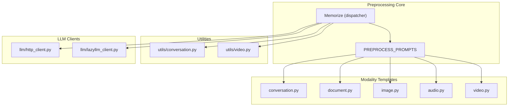
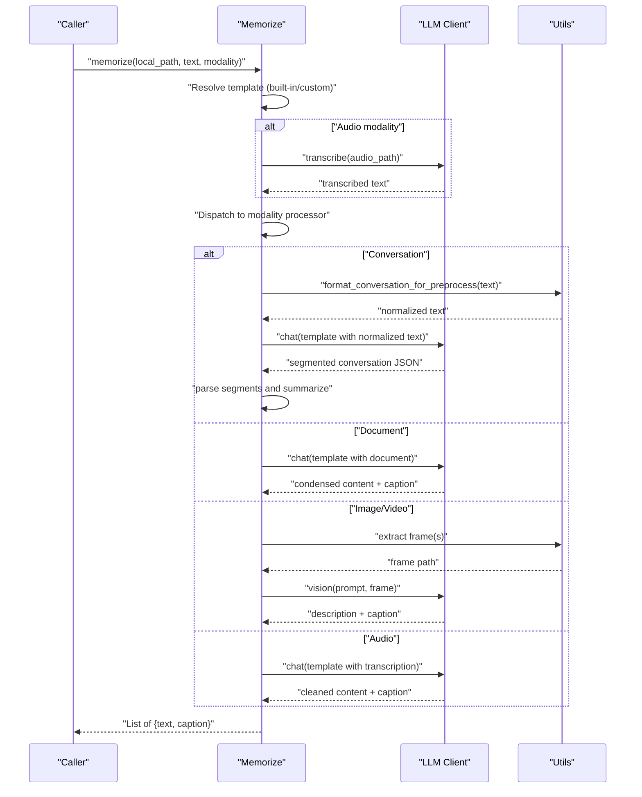
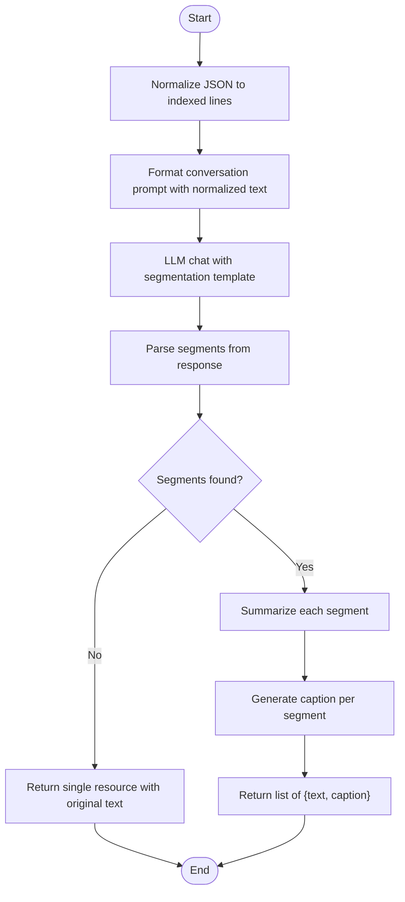
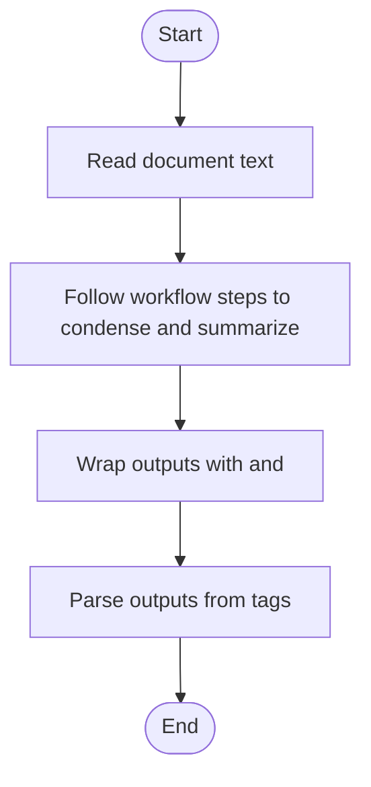
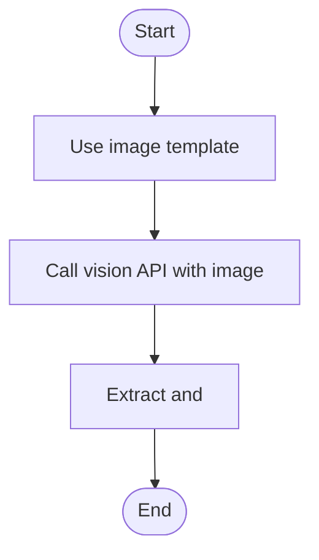
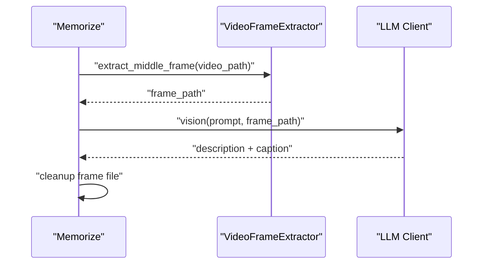
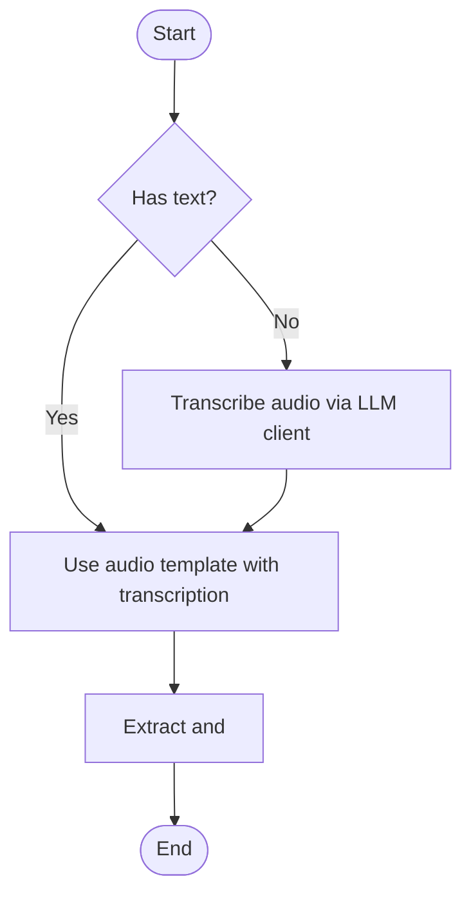
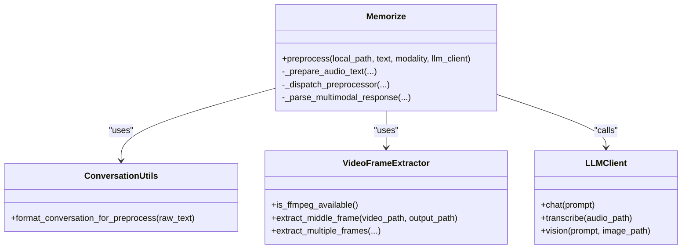
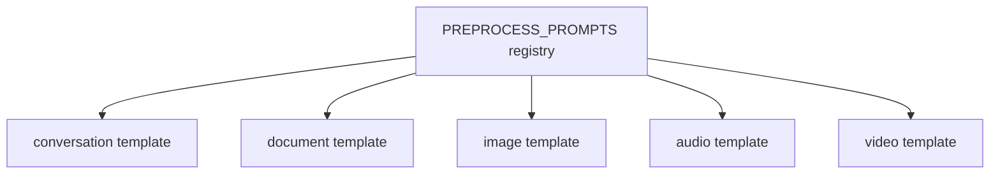

# Resource Preprocessing

<cite>
**Referenced Files in This Document**
- [memorize.py](file://src/memu/app/memorize.py)
- [conversation.py](file://src/memu/utils/conversation.py)
- [video.py](file://src/memu/utils/video.py)
- [__init__.py](file://src/memu/prompts/preprocess/__init__.py)
- [conversation.py](file://src/memu/prompts/preprocess/conversation.py)
- [document.py](file://src/memu/prompts/preprocess/document.py)
- [image.py](file://src/memu/prompts/preprocess/image.py)
- [audio.py](file://src/memu/prompts/preprocess/audio.py)
- [video.py](file://src/memu/prompts/preprocess/video.py)
- [settings.py](file://src/memu/app/settings.py)
- [lazyllm_client.py](file://src/memu/llm/lazyllm_client.py)
- [http_client.py](file://src/memu/llm/http_client.py)
- [openai_wrapper.py](file://src/memu/client/openai_wrapper.py)
- [conv1.json](file://examples/resources/conversations/conv1.json)
- [doc1.txt](file://examples/resources/docs/doc1.txt)
</cite>

## Table of Contents
1. [Introduction](#introduction)
2. [Project Structure](#project-structure)
3. [Core Components](#core-components)
4. [Architecture Overview](#architecture-overview)
5. [Detailed Component Analysis](#detailed-component-analysis)
6. [Dependency Analysis](#dependency-analysis)
7. [Performance Considerations](#performance-considerations)
8. [Troubleshooting Guide](#troubleshooting-guide)
9. [Conclusion](#conclusion)
10. [Appendices](#appendices)

## Introduction
This document explains how memU transforms raw inputs from different modalities into structured text representations during resource preprocessing. It covers the preprocessing pipeline for each modality, including conversation formatting, document parsing, image captioning, video frame extraction, and audio transcription. It also documents preprocessing templates, segmentation strategies, multimodal handling mechanisms, integration with LLM clients, error handling for unsupported formats, and performance optimization techniques. Finally, it describes custom preprocessing prompt configuration and integration with external providers.

## Project Structure
The preprocessing logic is centered around a dispatcher in the memory service that routes resources to modality-specific processors. Templates for each modality are defined under a shared prompts module. Utilities handle specialized tasks such as conversation normalization and video frame extraction. LLM clients provide the underlying capabilities for text processing, transcription, and vision-language analysis.

**Diagram sources**
- [memorize.py](file://src/memu/app/memorize.py#L690-L794)
- [__init__.py](file://src/memu/prompts/preprocess/__init__.py#L1-L12)
- [conversation.py](file://src/memu/prompts/preprocess/conversation.py#L1-L44)
- [document.py](file://src/memu/prompts/preprocess/document.py#L1-L36)
- [image.py](file://src/memu/prompts/preprocess/image.py#L1-L35)
- [audio.py](file://src/memu/prompts/preprocess/audio.py#L1-L36)
- [video.py](file://src/memu/prompts/preprocess/video.py#L1-L36)
- [conversation.py](file://src/memu/utils/conversation.py#L1-L90)
- [video.py](file://src/memu/utils/video.py#L1-L272)
- [http_client.py](file://src/memu/llm/http_client.py#L199-L290)
- [lazyllm_client.py](file://src/memu/llm/lazyllm_client.py#L134-L159)

**Section sources**
- [memorize.py](file://src/memu/app/memorize.py#L690-L794)
- [__init__.py](file://src/memu/prompts/preprocess/__init__.py#L1-L12)

## Core Components
- Preprocessing dispatcher: Selects the appropriate processor based on modality and available content, resolves prompts, and orchestrates multimodal operations.
- Modality templates: Structured prompt templates for conversation segmentation, document summarization, image captioning, audio transcription cleanup, and video description.
- Utilities:
  - Conversation normalization: Converts JSON conversation formats into a standardized line-based format with indices and roles.
  - Video frame extraction: Uses ffmpeg to extract representative frames for vision-language analysis.
- LLM client integration: Provides text processing, transcription, and vision-language capabilities via HTTP or lazyLLM backends.

**Section sources**
- [memorize.py](file://src/memu/app/memorize.py#L690-L794)
- [conversation.py](file://src/memu/utils/conversation.py#L1-L90)
- [video.py](file://src/memu/utils/video.py#L1-L272)
- [__init__.py](file://src/memu/prompts/preprocess/__init__.py#L1-L12)

## Architecture Overview
The preprocessing pipeline follows a consistent flow:
- Resolve modality-specific prompt template (either built-in or custom).
- Prepare text content when required (audio transcription, file read).
- Dispatch to modality-specific processor:
  - Conversation: Normalize, segment, and summarize each segment.
  - Document: Condense and generate a one-sentence caption.
  - Image/Video: Analyze with vision-language models to produce description and caption.
  - Audio: Clean and format transcription, then generate a one-sentence caption.
- Parse and extract structured outputs from LLM responses.

**Diagram sources**
- [memorize.py](file://src/memu/app/memorize.py#L690-L794)
- [memorize.py](file://src/memu/app/memorize.py#L737-L770)
- [memorize.py](file://src/memu/app/memorize.py#L796-L843)
- [memorize.py](file://src/memu/app/memorize.py#L845-L889)
- [conversation.py](file://src/memu/utils/conversation.py#L1-L90)
- [video.py](file://src/memu/utils/video.py#L1-L272)
- [lazyllm_client.py](file://src/memu/llm/lazyllm_client.py#L134-L159)
- [http_client.py](file://src/memu/llm/http_client.py#L199-L290)

## Detailed Component Analysis

### Conversation Preprocessing
- Normalization: Converts JSON conversation formats into a line-based format with indexed entries and roles. This ensures consistent input for segmentation.
- Segmentation: Uses a structured prompt to identify topic changes, time gaps, and natural breaks, returning segment boundaries.
- Segment summarization: Generates a concise caption for each segment using a dedicated summarization prompt.
- Output: Returns one resource per segment with the segment’s text and caption, or a single resource if no segments are detected.

**Diagram sources**
- [memorize.py](file://src/memu/app/memorize.py#L796-L843)
- [conversation.py](file://src/memu/prompts/preprocess/conversation.py#L1-L44)
- [conversation.py](file://src/memu/utils/conversation.py#L1-L90)

**Section sources**
- [memorize.py](file://src/memu/app/memorize.py#L796-L843)
- [conversation.py](file://src/memu/utils/conversation.py#L1-L90)
- [conversation.py](file://src/memu/prompts/preprocess/conversation.py#L1-L44)

### Document Preprocessing
- Purpose: Produce a concise, structured summary while preserving key information and generate a one-sentence caption.
- Template: Defines workflow steps to identify main points, remove redundancy, and rewrite content clearly.
- Output: Two parts wrapped in XML-like tags for extraction: processed content and caption.

**Diagram sources**
- [document.py](file://src/memu/prompts/preprocess/document.py#L1-L36)
- [memorize.py](file://src/memu/app/memorize.py#L1147-L1171)

**Section sources**
- [document.py](file://src/memu/prompts/preprocess/document.py#L1-L36)
- [memorize.py](file://src/memu/app/memorize.py#L1147-L1171)

### Image Preprocessing
- Purpose: Generate a detailed description and a one-sentence caption from an image.
- Template: Guides the model to describe subjects, actions, setting, visible text, colors, lighting, composition, and overall mood.
- Output: Two parts extracted from the response using XML-like tags.

**Diagram sources**
- [image.py](file://src/memu/prompts/preprocess/image.py#L1-L35)
- [memorize.py](file://src/memu/app/memorize.py#L891-L908)
- [memorize.py](file://src/memu/app/memorize.py#L1147-L1171)

**Section sources**
- [image.py](file://src/memu/prompts/preprocess/image.py#L1-L35)
- [memorize.py](file://src/memu/app/memorize.py#L891-L908)
- [memorize.py](file://src/memu/app/memorize.py#L1147-L1171)

### Video Preprocessing
- Frame extraction: Uses ffmpeg to extract a representative frame (middle frame or evenly spaced frames).
- Vision-language analysis: Sends the extracted frame to a vision-language model to produce a detailed description and a one-sentence caption.
- Cleanup: Removes temporary frame files after processing.

**Diagram sources**
- [memorize.py](file://src/memu/app/memorize.py#L845-L889)
- [video.py](file://src/memu/utils/video.py#L1-L272)

**Section sources**
- [memorize.py](file://src/memu/app/memorize.py#L845-L889)
- [video.py](file://src/memu/utils/video.py#L1-L272)

### Audio Preprocessing
- Preparation: If no text is provided, transcribes audio using the configured STT backend (HTTP client or lazyLLM client). Supports common audio extensions and pre-transcribed text files.
- Processing: Cleans and formats the transcription, adds paragraph breaks, and generates a one-sentence caption.
- Output: Two parts extracted from the response using XML-like tags.

**Diagram sources**
- [memorize.py](file://src/memu/app/memorize.py#L737-L770)
- [audio.py](file://src/memu/prompts/preprocess/audio.py#L1-L36)
- [lazyllm_client.py](file://src/memu/llm/lazyllm_client.py#L134-L159)
- [http_client.py](file://src/memu/llm/http_client.py#L221-L277)

**Section sources**
- [memorize.py](file://src/memu/app/memorize.py#L737-L770)
- [audio.py](file://src/memu/prompts/preprocess/audio.py#L1-L36)
- [lazyllm_client.py](file://src/memu/llm/lazyllm_client.py#L134-L159)
- [http_client.py](file://src/memu/llm/http_client.py#L221-L277)

### Multimodal Handling Mechanisms
- Unified dispatcher: Routes to modality-specific processors based on input modality and content availability.
- Prompt resolution: Supports built-in templates or custom prompts per modality. Custom prompts must provide all required prompt blocks.
- Response parsing: Extracts structured outputs using XML-like tags with fallbacks to raw content and first-sentence captions.

**Diagram sources**
- [memorize.py](file://src/memu/app/memorize.py#L690-L794)
- [conversation.py](file://src/memu/utils/conversation.py#L1-L90)
- [video.py](file://src/memu/utils/video.py#L1-L272)

**Section sources**
- [memorize.py](file://src/memu/app/memorize.py#L690-L794)
- [memorize.py](file://src/memu/app/memorize.py#L1147-L1171)

## Dependency Analysis
- Built-in templates are exposed via a central registry and selected by modality.
- The dispatcher depends on:
  - Conversation normalization utility for text-based modalities.
  - Video frame extractor for media modalities requiring frame analysis.
  - LLM clients for chat, transcription, and vision-language tasks.
- Settings define how custom prompts are resolved and validated.

**Diagram sources**
- [__init__.py](file://src/memu/prompts/preprocess/__init__.py#L1-L12)
- [conversation.py](file://src/memu/prompts/preprocess/conversation.py#L1-L44)
- [document.py](file://src/memu/prompts/preprocess/document.py#L1-L36)
- [image.py](file://src/memu/prompts/preprocess/image.py#L1-L35)
- [audio.py](file://src/memu/prompts/preprocess/audio.py#L1-L36)
- [video.py](file://src/memu/prompts/preprocess/video.py#L1-L36)

**Section sources**
- [__init__.py](file://src/memu/prompts/preprocess/__init__.py#L1-L12)
- [settings.py](file://src/memu/app/settings.py#L204-L243)

## Performance Considerations
- Minimize redundant LLM calls:
  - Reuse a single LLM client instance across preprocessing steps.
  - Batch embedding operations when applicable.
- Optimize media processing:
  - Prefer extracting a single representative frame for video when high throughput is required.
  - Validate ffmpeg availability to avoid repeated failures.
- Reduce I/O overhead:
  - Cache intermediate results where feasible.
  - Use temporary files judiciously and clean up promptly.
- Prompt efficiency:
  - Keep templates concise and focused to reduce token usage and latency.
- Client backend selection:
  - Choose the appropriate LLM client backend (HTTP vs. SDK vs. lazyLLM) based on provider and feature requirements.

[No sources needed since this section provides general guidance]

## Troubleshooting Guide
- Unsupported audio formats:
  - The audio preparation step checks file extensions and returns None for unknown types. Ensure the file extension is supported or provide pre-transcribed text.
- Missing ffmpeg:
  - Video preprocessing requires ffmpeg. If unavailable, the processor logs a warning and returns None for both text and caption.
- Invalid conversation JSON:
  - If the conversation cannot be parsed as JSON, normalization falls back to the original text.
- LLM response parsing:
  - If XML-like tags are missing, the parser falls back to using the raw response as content and the first sentence as caption.
- Transcription failures:
  - Audio transcription exceptions are logged and the function returns None. Verify credentials and provider configuration.

**Section sources**
- [memorize.py](file://src/memu/app/memorize.py#L737-L770)
- [memorize.py](file://src/memu/app/memorize.py#L845-L889)
- [conversation.py](file://src/memu/utils/conversation.py#L1-L90)
- [memorize.py](file://src/memu/app/memorize.py#L1147-L1171)
- [lazyllm_client.py](file://src/memu/llm/lazyllm_client.py#L134-L159)
- [http_client.py](file://src/memu/llm/http_client.py#L221-L277)

## Conclusion
memU’s preprocessing pipeline converts heterogeneous inputs into structured, LLM-friendly representations tailored by modality. It leverages standardized templates, robust utilities, and flexible LLM client integrations to deliver reliable, scalable preprocessing for conversations, documents, images, videos, and audio. With clear error handling, fallback strategies, and customization hooks, it supports both out-of-the-box usage and advanced configurations.

[No sources needed since this section summarizes without analyzing specific files]

## Appendices

### Preprocessing Templates Overview
- Conversation: Segmentation and indexing for coherent topic groups.
- Document: Condensation and one-sentence caption generation.
- Image: Detailed description and caption extraction.
- Audio: Transcription cleaning and caption generation.
- Video: Frame extraction followed by vision-language description and caption.

**Section sources**
- [conversation.py](file://src/memu/prompts/preprocess/conversation.py#L1-L44)
- [document.py](file://src/memu/prompts/preprocess/document.py#L1-L36)
- [image.py](file://src/memu/prompts/preprocess/image.py#L1-L35)
- [audio.py](file://src/memu/prompts/preprocess/audio.py#L1-L36)
- [video.py](file://src/memu/prompts/preprocess/video.py#L1-L36)

### Custom Preprocessing Prompt Configuration
- Per-modality overrides: Configure custom prompts via settings to replace built-in templates.
- Custom prompt blocks: Provide all required prompt blocks when supplying a custom prompt object.
- Validation: The system validates custom prompts and falls back to empty templates if invalid.

**Section sources**
- [settings.py](file://src/memu/app/settings.py#L204-L243)
- [memorize.py](file://src/memu/app/memorize.py#L404-L420)

### Integration with External Providers
- HTTP client: Supports OpenAI-compatible endpoints and other providers via base URL and endpoint overrides.
- lazyLLM client: Enables integration with Qwen, Doubao, SiliconFlow, and other providers for chat, embedding, vision-language, and speech-to-text.
- Provider-specific defaults: Some providers adjust defaults (e.g., base URL, model) automatically.

**Section sources**
- [http_client.py](file://src/memu/llm/http_client.py#L199-L290)
- [lazyllm_client.py](file://src/memu/llm/lazyllm_client.py#L134-L159)
- [settings.py](file://src/memu/app/settings.py#L102-L139)

### Concrete Examples
- Conversation formatting:
  - Input JSON conversation is normalized into indexed lines with roles and optional timestamps.
  - Example input: [conv1.json](file://examples/resources/conversations/conv1.json#L1-L55)
- Document parsing and segmentation:
  - Input document text is condensed and summarized into a one-sentence caption.
  - Example input: [doc1.txt](file://examples/resources/docs/doc1.txt#L1-L331)
- Image processing:
  - Vision-language model produces a detailed description and a one-sentence caption.
- Audio transcription:
  - Audio is transcribed and then cleaned and formatted with a one-sentence caption.
- Video processing:
  - Middle frame is extracted and analyzed to produce a detailed description and a one-sentence caption.

**Section sources**
- [conversation.py](file://src/memu/utils/conversation.py#L1-L90)
- [document.py](file://src/memu/prompts/preprocess/document.py#L1-L36)
- [audio.py](file://src/memu/prompts/preprocess/audio.py#L1-L36)
- [video.py](file://src/memu/utils/video.py#L1-L272)
- [conv1.json](file://examples/resources/conversations/conv1.json#L1-L55)
- [doc1.txt](file://examples/resources/docs/doc1.txt#L1-L331)