# Workflow Integration

<cite>
**Referenced Files in This Document**
- [pipeline.py](file://src/memu/workflow/pipeline.py)
- [runner.py](file://src/memu/workflow/runner.py)
- [step.py](file://src/memu/workflow/step.py)
- [interceptor.py](file://src/memu/workflow/interceptor.py)
- [memorize.py](file://src/memu/app/memorize.py)
- [service.py](file://src/memu/app/service.py)
- [interfaces.py](file://src/memu/database/interfaces.py)
- [wrapper.py](file://src/memu/llm/wrapper.py)
- [openai_sdk.py](file://src/memu/embedding/openai_sdk.py)
- [architecture.md](file://docs/architecture.md)
- [conversation.py](file://src/memu/prompts/preprocess/conversation.py)
- [knowledge.py](file://src/memu/prompts/memory_type/knowledge.py)
- [example_1_conversation_memory.py](file://examples/example_1_conversation_memory.py)
</cite>

## Table of Contents
1. [Introduction](#introduction)
2. [Project Structure](#project-structure)
3. [Core Components](#core-components)
4. [Architecture Overview](#architecture-overview)
5. [Detailed Component Analysis](#detailed-component-analysis)
6. [Dependency Analysis](#dependency-analysis)
7. [Performance Considerations](#performance-considerations)
8. [Troubleshooting Guide](#troubleshooting-guide)
9. [Conclusion](#conclusion)
10. [Appendices](#appendices)

## Introduction
This document explains how memU’s memory ingestion pipeline integrates with the workflow engine. It details the six-step workflow architecture for memory ingestion, step dependencies, capability requirements, and state management. It also covers the workflow runner, step execution order, error propagation, state transformations, and the build_response mechanism. Practical examples illustrate how resources flow through each stage, how capabilities are resolved, and how errors are handled. Finally, it addresses customization, step configuration, interceptor integration, and performance monitoring.

## Project Structure
The workflow integration spans several modules:
- Workflow engine: pipeline definition, runner resolution, step execution, and interceptors
- Application layer: memory ingestion pipeline definition and handlers
- Infrastructure: database abstraction, LLM client wrapper, and embedding client
- Prompts and examples: multimodal preprocessing and memory extraction prompts, plus usage examples

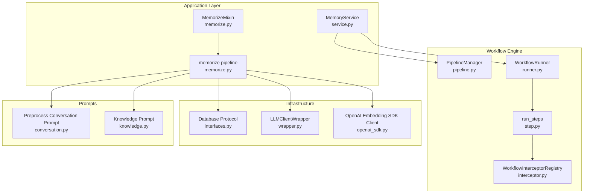

**Diagram sources**
- [pipeline.py](file://src/memu/workflow/pipeline.py#L21-L171)
- [runner.py](file://src/memu/workflow/runner.py#L28-L82)
- [step.py](file://src/memu/workflow/step.py#L50-L102)
- [interceptor.py](file://src/memu/workflow/interceptor.py#L56-L219)
- [service.py](file://src/memu/app/service.py#L49-L200)
- [memorize.py](file://src/memu/app/memorize.py#L65-L166)
- [interfaces.py](file://src/memu/database/interfaces.py#L12-L36)
- [wrapper.py](file://src/memu/llm/wrapper.py#L226-L504)
- [openai_sdk.py](file://src/memu/embedding/openai_sdk.py#L9-L44)
- [conversation.py](file://src/memu/prompts/preprocess/conversation.py#L1-L44)
- [knowledge.py](file://src/memu/prompts/memory_type/knowledge.py#L1-L173)

**Section sources**
- [pipeline.py](file://src/memu/workflow/pipeline.py#L21-L171)
- [runner.py](file://src/memu/workflow/runner.py#L28-L82)
- [step.py](file://src/memu/workflow/step.py#L50-L102)
- [interceptor.py](file://src/memu/workflow/interceptor.py#L56-L219)
- [memorize.py](file://src/memu/app/memorize.py#L65-L166)
- [service.py](file://src/memu/app/service.py#L49-L200)
- [interfaces.py](file://src/memu/database/interfaces.py#L12-L36)
- [wrapper.py](file://src/memu/llm/wrapper.py#L226-L504)
- [openai_sdk.py](file://src/memu/embedding/openai_sdk.py#L9-L44)
- [conversation.py](file://src/memu/prompts/preprocess/conversation.py#L1-L44)
- [knowledge.py](file://src/memu/prompts/memory_type/knowledge.py#L1-L173)

## Core Components
- PipelineManager: registers pipelines, validates step dependencies, and supports runtime mutations (config_step, insert_before/after, replace_step, remove_step). It enforces capability availability, LLM profile validity, and required/produced state keys.
- WorkflowRunner: protocol for executing workflows; default LocalWorkflowRunner runs steps sequentially via run_steps.
- WorkflowStep: defines step_id, role, handler, requires/produces state keys, capabilities, and per-step config (e.g., llm_profile).
- run_steps: orchestrates step execution, validates prerequisites, builds step context, and invokes before/after/on_error interceptors.
- WorkflowInterceptorRegistry: manages workflow interceptors (before/after/on_error) around each step, supporting strict mode and snapshot-based invocation.
- Memory ingestion pipeline: a seven-step pipeline (ingest, preprocess, extract, dedupe_merge, categorize, persist_index, build_response) implemented in MemorizeMixin and executed by MemoryService.

**Section sources**
- [pipeline.py](file://src/memu/workflow/pipeline.py#L21-L171)
- [runner.py](file://src/memu/workflow/runner.py#L28-L82)
- [step.py](file://src/memu/workflow/step.py#L16-L102)
- [interceptor.py](file://src/memu/workflow/interceptor.py#L56-L219)
- [memorize.py](file://src/memu/app/memorize.py#L97-L166)

## Architecture Overview
The memory ingestion pipeline is a workflow orchestrated by the workflow engine. MemoryService initializes clients, databases, and the workflow runner, then delegates execution to the memorize pipeline. The pipeline stages transform state progressively, invoking LLM clients for extraction and embedding clients for vectorization, while persisting results to the database.

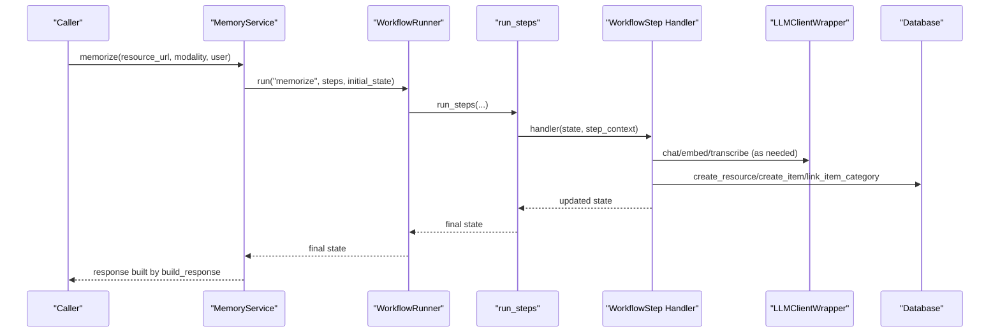

**Diagram sources**
- [service.py](file://src/memu/app/service.py#L49-L200)
- [runner.py](file://src/memu/workflow/runner.py#L28-L82)
- [step.py](file://src/memu/workflow/step.py#L50-L102)
- [memorize.py](file://src/memu/app/memorize.py#L65-L96)
- [wrapper.py](file://src/memu/llm/wrapper.py#L226-L504)
- [interfaces.py](file://src/memu/database/interfaces.py#L12-L36)

## Detailed Component Analysis

### Six-Step Workflow Architecture (Ingestion)
The memory ingestion pipeline is defined in MemorizeMixin and executed as a workflow. The documented six-step workflow corresponds to the first six stages of the seven-stage pipeline, with “persist” and “build_response” included for completeness.

- ingest_resource: Fetches the resource locally and populates raw_text and local_path.
- preprocess_multimodal: Applies modality-specific preprocessing; may invoke LLM for segmentation or transcription.
- extract_items: Generates structured memory entries per memory type using LLM prompts.
- dedupe_merge: Placeholder stage; currently pass-through.
- categorize_items: Persists resources, memory items, and category relations; computes embeddings.
- persist_index: Updates category summaries and optionally persists item references.
- build_response: Formats final output with resources, items, categories, and relations.

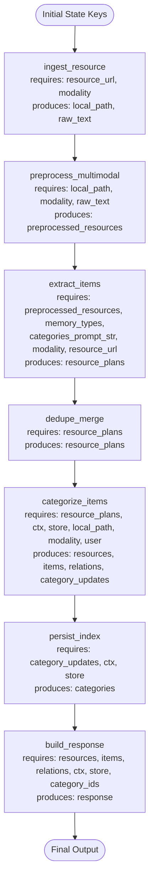

**Diagram sources**
- [memorize.py](file://src/memu/app/memorize.py#L97-L166)

**Section sources**
- [memorize.py](file://src/memu/app/memorize.py#L97-L166)
- [architecture.md](file://docs/architecture.md#L73-L85)

### Step Dependencies and Capability Requirements
- PipelineManager enforces:
  - Unique step_id across a pipeline
  - Known capabilities against available set
  - Valid LLM profile names
  - Required state keys produced by prior steps or provided via initial_state_keys
- Each WorkflowStep declares:
  - step_id, role, handler
  - requires: set of state keys required by the step
  - produces: set of state keys emitted by the step
  - capabilities: set of capability tags (e.g., io, llm, db, vector)
  - config: per-step configuration (e.g., llm_profile)

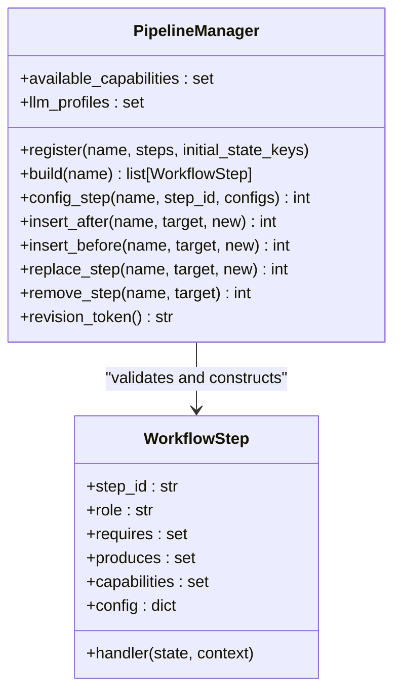

**Diagram sources**
- [pipeline.py](file://src/memu/workflow/pipeline.py#L21-L171)
- [step.py](file://src/memu/workflow/step.py#L16-L39)

**Section sources**
- [pipeline.py](file://src/memu/workflow/pipeline.py#L131-L165)
- [step.py](file://src/memu/workflow/step.py#L16-L39)

### State Management and Transformation
- Initial state keys include resource_url, modality, memory_types, categories_prompt_str, ctx, store, category_ids, user.
- Each step augments state with keys declared in produces and reads keys from requires.
- The final step (build_response) formats the response and writes it under the response key.

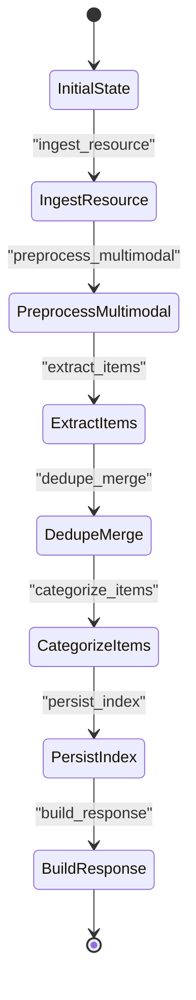

**Diagram sources**
- [memorize.py](file://src/memu/app/memorize.py#L79-L96)
- [memorize.py](file://src/memu/app/memorize.py#L97-L166)

**Section sources**
- [memorize.py](file://src/memu/app/memorize.py#L79-L96)
- [memorize.py](file://src/memu/app/memorize.py#L168-L179)

### Capability Resolution and LLM/Embedding Clients
- Capability tags on steps guide which clients are available during execution.
- MemoryService resolves LLM clients per profile and wraps them with LLMClientWrapper for interception and usage tracking.
- Embedding generation is performed via embedding clients (e.g., OpenAI Embedding SDK client) during resource and item persistence.

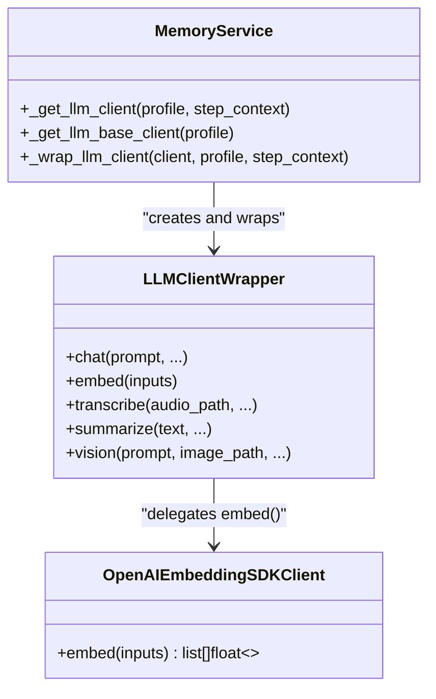

**Diagram sources**
- [service.py](file://src/memu/app/service.py#L137-L194)
- [wrapper.py](file://src/memu/llm/wrapper.py#L226-L504)
- [openai_sdk.py](file://src/memu/embedding/openai_sdk.py#L9-L44)

**Section sources**
- [service.py](file://src/memu/app/service.py#L137-L194)
- [wrapper.py](file://src/memu/llm/wrapper.py#L226-L504)
- [openai_sdk.py](file://src/memu/embedding/openai_sdk.py#L9-L44)

### Database Operations and Persistence
- Database is abstracted via a protocol with repositories for resources, memory items, categories, and relations.
- During categorization, resources are created with optional captions and embeddings; memory items are persisted with embeddings; category-item relations are linked.
- Category summaries are updated and optionally item references are persisted.

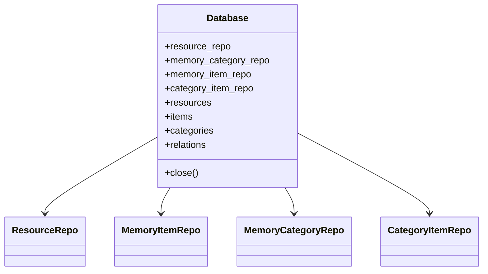

**Diagram sources**
- [interfaces.py](file://src/memu/database/interfaces.py#L12-L36)

**Section sources**
- [interfaces.py](file://src/memu/database/interfaces.py#L12-L36)
- [memorize.py](file://src/memu/app/memorize.py#L234-L297)

### Step Execution Order and Error Propagation
- run_steps iterates steps in order, validating requires against current state keys.
- Before each step, before interceptors are invoked; after execution, after interceptors are invoked in reverse order.
- On step exceptions, on_error interceptors are invoked in reverse order and then the exception propagates.

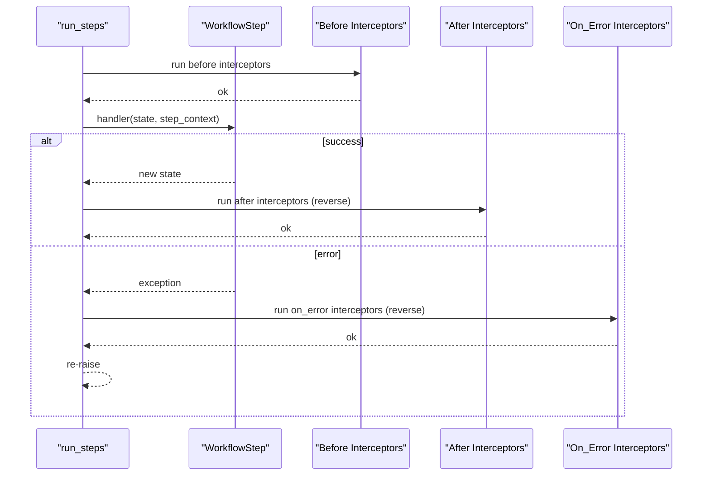

**Diagram sources**
- [step.py](file://src/memu/workflow/step.py#L50-L102)
- [interceptor.py](file://src/memu/workflow/interceptor.py#L168-L219)

**Section sources**
- [step.py](file://src/memu/workflow/step.py#L50-L102)
- [interceptor.py](file://src/memu/workflow/interceptor.py#L168-L219)

### Concrete Examples: Resource Flow Through Stages
- Example: Processing conversation files and generating memory categories.
  - Initializes MemoryService with LLM profiles.
  - Calls memorize for each conversation file.
  - Aggregates items and categories from the response.

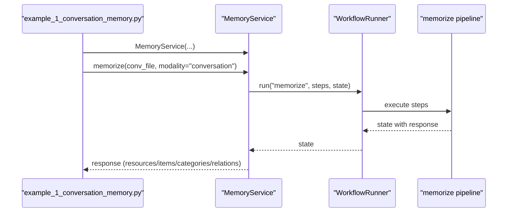

**Diagram sources**
- [example_1_conversation_memory.py](file://examples/example_1_conversation_memory.py#L70-L117)
- [service.py](file://src/memu/app/service.py#L49-L200)
- [memorize.py](file://src/memu/app/memorize.py#L65-L96)

**Section sources**
- [example_1_conversation_memory.py](file://examples/example_1_conversation_memory.py#L70-L117)
- [memorize.py](file://src/memu/app/memorize.py#L65-L96)

### Relationship Between Preprocessing and Extraction Prompts
- Preprocessing prompts define how to segment conversations and prepare text for extraction.
- Memory extraction prompts instruct the LLM to produce structured entries categorized by memory types.

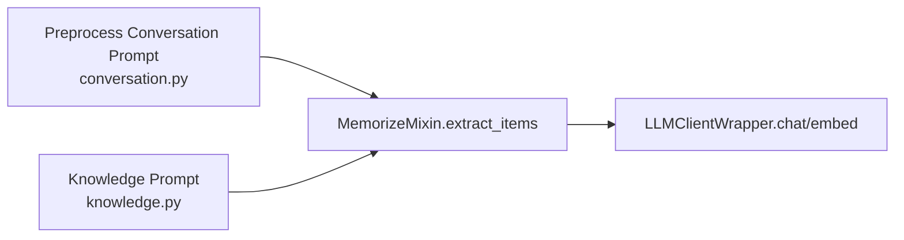

**Diagram sources**
- [conversation.py](file://src/memu/prompts/preprocess/conversation.py#L1-L44)
- [knowledge.py](file://src/memu/prompts/memory_type/knowledge.py#L1-L173)
- [memorize.py](file://src/memu/app/memorize.py#L199-L227)
- [wrapper.py](file://src/memu/llm/wrapper.py#L274-L306)

**Section sources**
- [conversation.py](file://src/memu/prompts/preprocess/conversation.py#L1-L44)
- [knowledge.py](file://src/memu/prompts/memory_type/knowledge.py#L1-L173)
- [memorize.py](file://src/memu/app/memorize.py#L199-L227)

### Workflow Customization and Step Configuration
- PipelineManager supports:
  - config_step: update a step’s config (e.g., llm_profile)
  - insert_before/insert_after: add steps around a target
  - replace_step: swap a step
  - remove_step: delete a step
- Validation ensures capability availability, profile existence, and required state keys.

**Section sources**
- [pipeline.py](file://src/memu/workflow/pipeline.py#L51-L122)
- [pipeline.py](file://src/memu/workflow/pipeline.py#L131-L165)

### Interceptor Integration and Observability
- Workflow interceptors:
  - register_before/register_after/register_on_error
  - strict mode controls whether interceptor exceptions propagate
  - snapshot captures interceptor sets at execution time
- LLM interceptors (separate system) wrap LLM calls for telemetry and filtering.

**Section sources**
- [interceptor.py](file://src/memu/workflow/interceptor.py#L56-L219)
- [architecture.md](file://docs/architecture.md#L64-L72)

### Performance Monitoring
- LLMClientWrapper tracks latency, token usage, and extracts usage metadata from provider responses.
- Usage is captured per call kind (chat, embed, transcribe, etc.) and surfaced via interceptors.

**Section sources**
- [wrapper.py](file://src/memu/llm/wrapper.py#L387-L504)

## Dependency Analysis
The workflow engine depends on the application pipeline and infrastructure components. The pipeline enforces capability and state dependencies; the runner executes steps; interceptors provide observability; and the application layer coordinates LLM and embedding clients with database persistence.

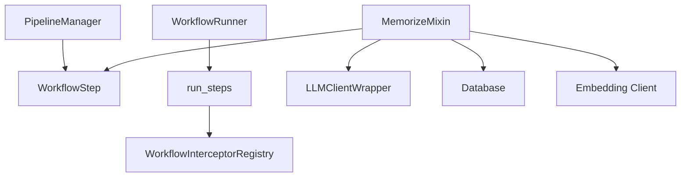

**Diagram sources**
- [pipeline.py](file://src/memu/workflow/pipeline.py#L21-L171)
- [runner.py](file://src/memu/workflow/runner.py#L28-L82)
- [step.py](file://src/memu/workflow/step.py#L50-L102)
- [interceptor.py](file://src/memu/workflow/interceptor.py#L56-L219)
- [memorize.py](file://src/memu/app/memorize.py#L97-L166)
- [service.py](file://src/memu/app/service.py#L137-L194)
- [interfaces.py](file://src/memu/database/interfaces.py#L12-L36)
- [openai_sdk.py](file://src/memu/embedding/openai_sdk.py#L9-L44)

**Section sources**
- [pipeline.py](file://src/memu/workflow/pipeline.py#L21-L171)
- [runner.py](file://src/memu/workflow/runner.py#L28-L82)
- [step.py](file://src/memu/workflow/step.py#L50-L102)
- [interceptor.py](file://src/memu/workflow/interceptor.py#L56-L219)
- [memorize.py](file://src/memu/app/memorize.py#L97-L166)
- [service.py](file://src/memu/app/service.py#L137-L194)
- [interfaces.py](file://src/memu/database/interfaces.py#L12-L36)
- [openai_sdk.py](file://src/memu/embedding/openai_sdk.py#L9-L44)

## Performance Considerations
- Embedding batching: embedding clients process inputs in batches to respect provider limits.
- Asynchronous LLM calls: chat, embed, transcribe, and summarize are awaited to maximize throughput.
- Interceptor overhead: keep interceptors efficient; use strict mode judiciously to avoid masking failures.
- State minimization: only produce necessary keys to reduce downstream processing.

[No sources needed since this section provides general guidance]

## Troubleshooting Guide
Common issues and resolutions:
- Missing required state keys: run_steps raises a KeyError if a step’s requires are not satisfied by current state.
- Unknown capability or profile: PipelineManager validates capabilities and LLM profiles; ensure they are registered and correct.
- Step handler return type: WorkflowStep.run expects a Mapping; otherwise a TypeError is raised.
- Interceptor failures:
  - Workflow interceptors: if strict is False, exceptions are logged; if True, they propagate.
  - LLM interceptors: similarly controlled by strict mode; ensure filters and priorities are configured as intended.

**Section sources**
- [step.py](file://src/memu/workflow/step.py#L40-L47)
- [step.py](file://src/memu/workflow/step.py#L68-L72)
- [pipeline.py](file://src/memu/workflow/pipeline.py#L141-L154)
- [interceptor.py](file://src/memu/workflow/interceptor.py#L174-L219)
- [wrapper.py](file://src/memu/llm/wrapper.py#L450-L504)

## Conclusion
The memory ingestion pipeline leverages a robust workflow engine to orchestrate multimodal preprocessing, structured extraction, deduplication, categorization, persistence, and response building. PipelineManager enforces correctness, WorkflowRunner executes steps deterministically, and interceptors provide observability. MemoryService coordinates LLM and embedding clients with database persistence, enabling scalable and configurable memory ingestion tailored to diverse resource modalities.

[No sources needed since this section summarizes without analyzing specific files]

## Appendices

### Appendix A: Six-Step Workflow Summary
- ingest_resource: resource ingestion
- preprocess_multimodal: modality-aware preprocessing
- extract_items: structured memory extraction
- dedupe_merge: de-duplication and merging
- categorize_items: persistence and embeddings
- persist_index: category summary updates and optional references
- build_response: final output formatting

**Section sources**
- [memorize.py](file://src/memu/app/memorize.py#L97-L166)
- [architecture.md](file://docs/architecture.md#L73-L85)