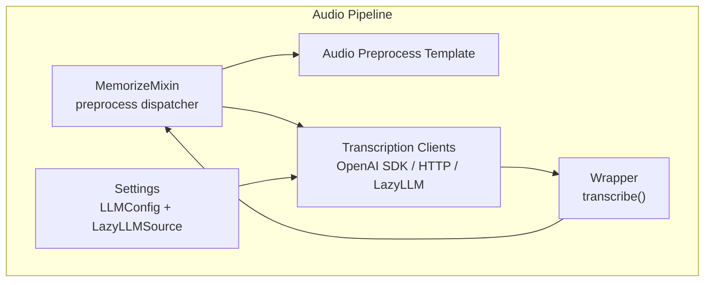
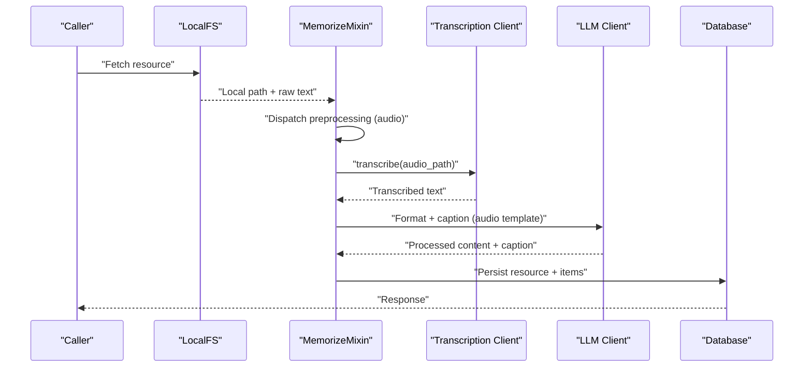
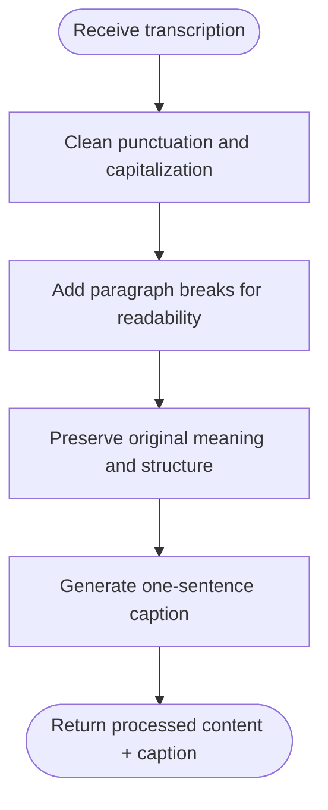
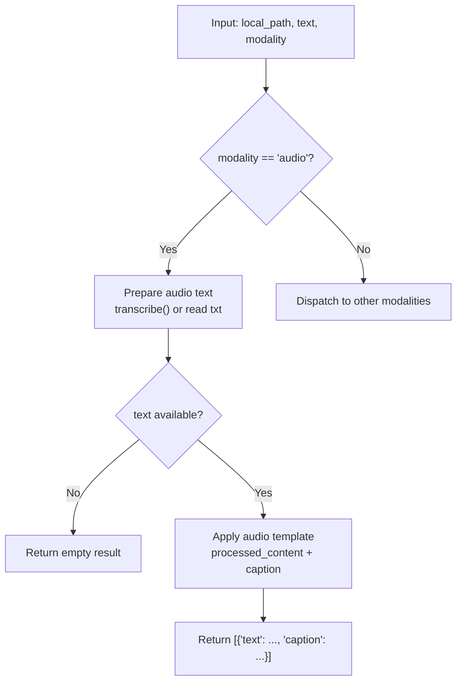
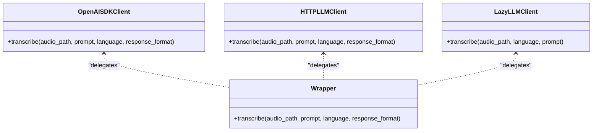
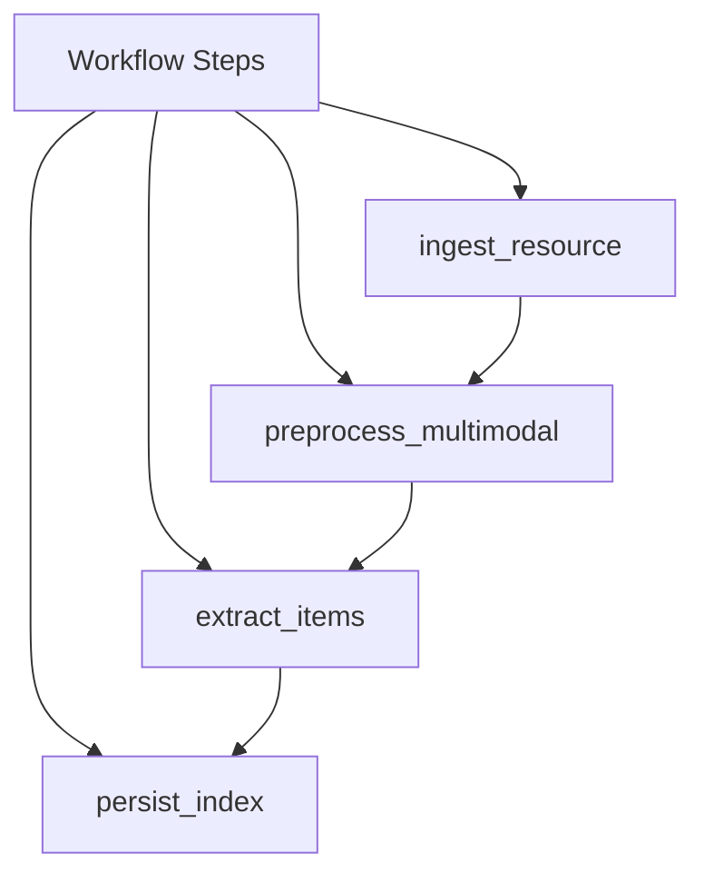
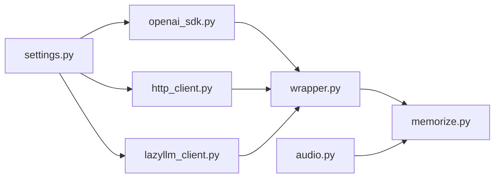

# Audio Processing

<cite>
**Referenced Files in This Document**
- [memorize.py](file://src/memu/app/memorize.py)
- [audio.py](file://src/memu/prompts/preprocess/audio.py)
- [__init__.py](file://src/memu/prompts/preprocess/__init__.py)
- [openai_sdk.py](file://src/memu/llm/openai_sdk.py)
- [http_client.py](file://src/memu/llm/http_client.py)
- [lazyllm_client.py](file://src/memu/llm/lazyllm_client.py)
- [wrapper.py](file://src/memu/llm/wrapper.py)
- [settings.py](file://src/memu/app/settings.py)
- [workflow.py](file://src/memu/workflow/pipeline.py)
- [step.py](file://src/memu/workflow/step.py)
- [interceptor.py](file://src/memu/workflow/interceptor.py)
- [runner.py](file://src/memu/workflow/runner.py)
</cite>

## Table of Contents
1. [Introduction](#introduction)
2. [Project Structure](#project-structure)
3. [Core Components](#core-components)
4. [Architecture Overview](#architecture-overview)
5. [Detailed Component Analysis](#detailed-component-analysis)
6. [Dependency Analysis](#dependency-analysis)
7. [Performance Considerations](#performance-considerations)
8. [Troubleshooting Guide](#troubleshooting-guide)
9. [Conclusion](#conclusion)

## Introduction
This document explains memU’s audio processing pipeline with a focus on transcription and analysis for conversational memory building. It covers supported audio formats, transcription integration, post-processing into clean text and captions, and how the processed content feeds into memory extraction. It also documents integration with external transcription services, performance optimization strategies, batch processing, error handling, and quality considerations.

## Project Structure
The audio processing capability is implemented as part of the multimodal preprocessing workflow. Key components include:
- Audio preprocessing prompt template
- Preprocessing dispatcher and audio-specific processor
- Transcription clients (OpenAI SDK, HTTP client, LazyLLM client)
- Wrapper around transcription clients
- Settings enabling pluggable STT backends
- Workflow orchestration for ingestion, preprocessing, extraction, and persistence

**Diagram sources**
- [memorize.py](file://src/memu/app/memorize.py#L689-L794)
- [audio.py](file://src/memu/prompts/preprocess/audio.py#L1-L35)
- [openai_sdk.py](file://src/memu/llm/openai_sdk.py#L172-L218)
- [http_client.py](file://src/memu/llm/http_client.py#L221-L277)
- [lazyllm_client.py](file://src/memu/llm/lazyllm_client.py#L140-L159)
- [wrapper.py](file://src/memu/llm/wrapper.py#L354-L385)
- [settings.py](file://src/memu/app/settings.py#L92-L127)

**Section sources**
- [memorize.py](file://src/memu/app/memorize.py#L689-L794)
- [audio.py](file://src/memu/prompts/preprocess/audio.py#L1-L35)
- [settings.py](file://src/memu/app/settings.py#L92-L127)

## Core Components
- Audio preprocessing template: Defines how transcriptions are cleaned, formatted, and summarized into a one-sentence caption.
- Preprocessing dispatcher: Routes audio resources to transcription and then to the audio-specific processor.
- Transcription clients: Support OpenAI Audio API via SDK, HTTP client, and LazyLLM STT backend.
- Wrapper: Adds request metadata and standardized invocation for transcription.
- Settings: Configure provider, endpoints, and STT model/source.

Key behaviors:
- Supported audio extensions: mp3, mp4, mpeg, mpga, m4a, wav, webm
- Supported text extensions for pre-transcribed content: txt, text
- Post-processing: Clean transcription, add paragraph breaks, preserve original meaning, generate one-sentence caption

**Section sources**
- [memorize.py](file://src/memu/app/memorize.py#L737-L770)
- [audio.py](file://src/memu/prompts/preprocess/audio.py#L1-L35)
- [wrapper.py](file://src/memu/llm/wrapper.py#L354-L385)

## Architecture Overview
The audio processing pipeline integrates with the broader multimodal workflow. Audio resources are ingested, transcribed, cleaned, captioned, and then used for memory extraction and categorization.

**Diagram sources**
- [memorize.py](file://src/memu/app/memorize.py#L181-L197)
- [memorize.py](file://src/memu/app/memorize.py#L721-L735)
- [memorize.py](file://src/memu/app/memorize.py#L920-L928)
- [openai_sdk.py](file://src/memu/llm/openai_sdk.py#L172-L218)
- [http_client.py](file://src/memu/llm/http_client.py#L221-L277)
- [lazyllm_client.py](file://src/memu/llm/lazyllm_client.py#L140-L159)

## Detailed Component Analysis

### Audio Preprocessing Template
The audio template instructs the LLM to:
- Clean punctuation, capitalization, and artifacts
- Improve readability with paragraph breaks
- Preserve original meaning and speaker structure
- Produce a single-sentence caption

**Diagram sources**
- [audio.py](file://src/memu/prompts/preprocess/audio.py#L1-L35)

**Section sources**
- [audio.py](file://src/memu/prompts/preprocess/audio.py#L1-L35)
- [__init__.py](file://src/memu/prompts/preprocess/__init__.py#L1-L11)

### Preprocessing Dispatcher and Audio Processor
The dispatcher routes audio resources to transcription and then applies the audio template to produce processed content and a caption.

**Diagram sources**
- [memorize.py](file://src/memu/app/memorize.py#L689-L794)
- [memorize.py](file://src/memu/app/memorize.py#L920-L928)

**Section sources**
- [memorize.py](file://src/memu/app/memorize.py#L689-L794)
- [memorize.py](file://src/memu/app/memorize.py#L920-L928)

### Transcription Clients
Three transcription backends are supported:
- OpenAI SDK client: Uses the official OpenAI async client with gpt-4o-mini-transcribe model
- HTTP client: Sends multipart/form-data to /v1/audio/transcriptions with configurable provider
- LazyLLM client: Delegates to a pluggable STT backend (e.g., qwen-audio-turbo) via OnlineModule

**Diagram sources**
- [openai_sdk.py](file://src/memu/llm/openai_sdk.py#L172-L218)
- [http_client.py](file://src/memu/llm/http_client.py#L221-L277)
- [lazyllm_client.py](file://src/memu/llm/lazyllm_client.py#L140-L159)
- [wrapper.py](file://src/memu/llm/wrapper.py#L354-L385)

**Section sources**
- [openai_sdk.py](file://src/memu/llm/openai_sdk.py#L172-L218)
- [http_client.py](file://src/memu/llm/http_client.py#L221-L277)
- [lazyllm_client.py](file://src/memu/llm/lazyllm_client.py#L140-L159)
- [wrapper.py](file://src/memu/llm/wrapper.py#L354-L385)

### Settings and Backends
- Provider selection: openai, grok, doubao, openrouter
- Endpoint overrides for chat/embeddings
- LazyLLMSource supports separate sources/models for LLM, VLM, Embedding, and STT
- Default STT model configured for LazyLLM client

**Section sources**
- [settings.py](file://src/memu/app/settings.py#L102-L127)
- [settings.py](file://src/memu/app/settings.py#L92-L100)

### Workflow Integration
The audio pipeline participates in the multimodal workflow:
- ingest_resource: fetches local path and raw text
- preprocess_multimodal: runs preprocessing (including audio transcription)
- extract_items: generates structured memory entries from processed text
- persist_index: persists resources, items, and category updates

**Diagram sources**
- [memorize.py](file://src/memu/app/memorize.py#L97-L166)

**Section sources**
- [memorize.py](file://src/memu/app/memorize.py#L97-L166)

## Dependency Analysis
- Preprocessing depends on:
  - Audio template for formatting and caption generation
  - Transcription client for converting audio to text
  - LLM client for applying the audio template
- Transcription clients depend on:
  - Provider configuration (base URL, API key, model)
  - HTTP client or SDK transport
- Settings influence which backend is selected and how endpoints are resolved

**Diagram sources**
- [settings.py](file://src/memu/app/settings.py#L102-L127)
- [openai_sdk.py](file://src/memu/llm/openai_sdk.py#L172-L218)
- [http_client.py](file://src/memu/llm/http_client.py#L221-L277)
- [lazyllm_client.py](file://src/memu/llm/lazyllm_client.py#L140-L159)
- [wrapper.py](file://src/memu/llm/wrapper.py#L354-L385)
- [memorize.py](file://src/memu/app/memorize.py#L689-L794)
- [audio.py](file://src/memu/prompts/preprocess/audio.py#L1-L35)

**Section sources**
- [settings.py](file://src/memu/app/settings.py#L102-L127)
- [memorize.py](file://src/memu/app/memorize.py#L689-L794)

## Performance Considerations
- Transcription model choice: gpt-4o-mini-transcribe is used for cost/performance balance.
- Timeout tuning: HTTP client increases timeout for transcription requests.
- Batch embedding: While not directly for transcription, embedding batching reduces overhead for downstream memory indexing.
- Streaming vs. file uploads: HTTP client streams audio bytes via multipart/form-data.
- LazyLLM offloading: Delegates STT to pluggable backends, enabling heterogeneous providers.

Recommendations:
- For large files, consider splitting audio into shorter segments prior to ingestion to reduce transcription latency and cost.
- Use response_format appropriately; text-only responses avoid parsing JSON overhead when not needed.
- Configure provider timeouts and retry policies at the HTTP client level for robustness.

**Section sources**
- [openai_sdk.py](file://src/memu/llm/openai_sdk.py#L192-L205)
- [http_client.py](file://src/memu/llm/http_client.py#L255-L263)
- [http_client.py](file://src/memu/llm/http_client.py#L221-L277)
- [lazyllm_client.py](file://src/memu/llm/lazyllm_client.py#L140-L159)

## Troubleshooting Guide
Common issues and resolutions:
- Unsupported or unknown audio extension: The pipeline skips transcription and returns None for audio content. Ensure the file extension is among mp3, mp4, mpeg, mpga, m4a, wav, webm.
- Corrupted or unreadable audio: Transcription client exceptions are logged and re-raised; inspect logs for underlying causes (network, invalid file, provider errors).
- Missing text file: If a .txt/.text file cannot be read, the pipeline logs and returns None.
- Provider misconfiguration: Verify base_url, API key, and model settings in LLMConfig and LazyLLMSource.
- Large audio files: Consider pre-segmentation to meet provider limits and reduce latency.

Operational tips:
- Enable logging to capture transcription failures and metadata.
- Validate audio file integrity before ingestion.
- For HTTP client, confirm endpoint overrides and proxy settings if applicable.

**Section sources**
- [memorize.py](file://src/memu/app/memorize.py#L737-L770)
- [openai_sdk.py](file://src/memu/llm/openai_sdk.py#L214-L218)
- [http_client.py](file://src/memu/llm/http_client.py#L273-L277)
- [lazyllm_client.py](file://src/memu/llm/lazyllm_client.py#L140-L159)

## Conclusion
memU’s audio processing pipeline converts audio into clean, readable text and concise captions, feeding directly into memory extraction and categorization. It supports multiple transcription backends, integrates with a flexible workflow, and provides mechanisms for performance optimization and robust error handling. By leveraging the audio preprocessing template and pluggable STT clients, the system scales across diverse providers and use cases while maintaining quality and reliability for conversational memory building.