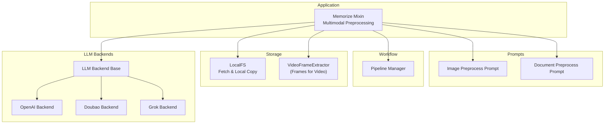
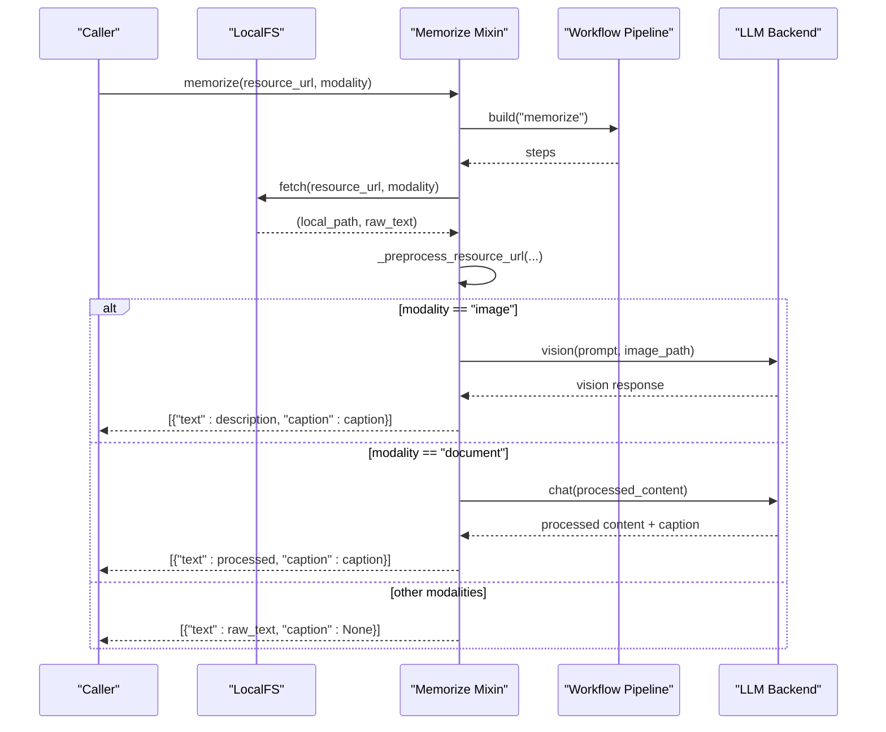
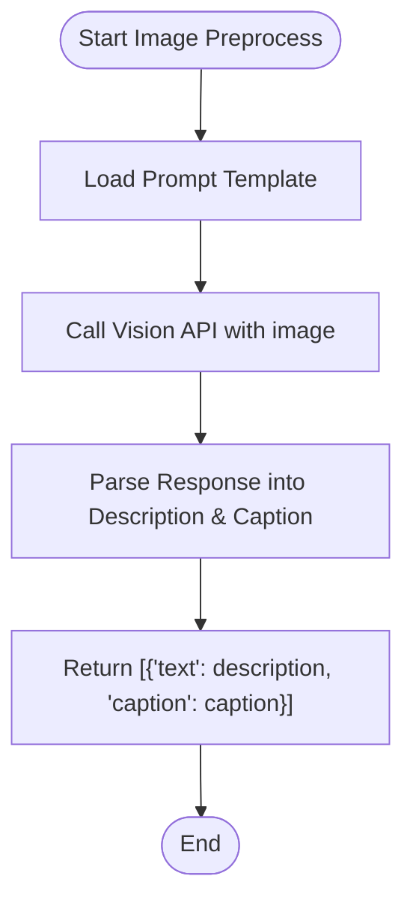
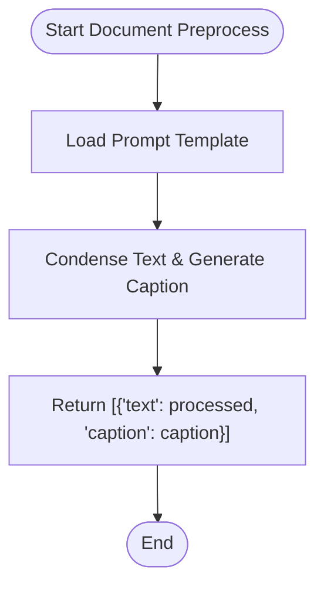
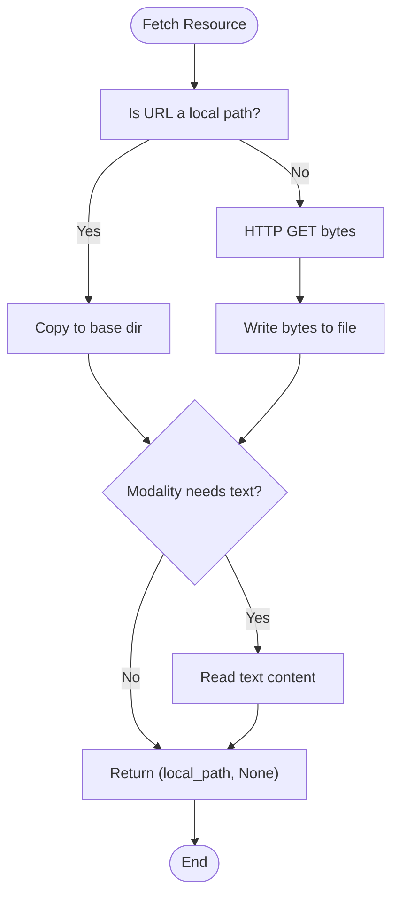
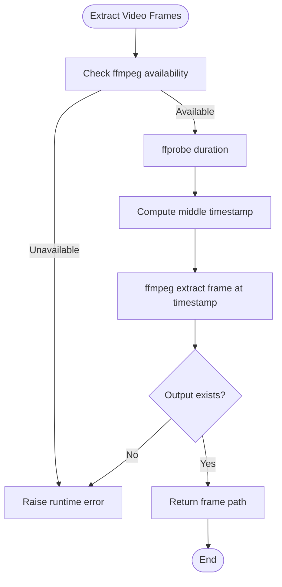
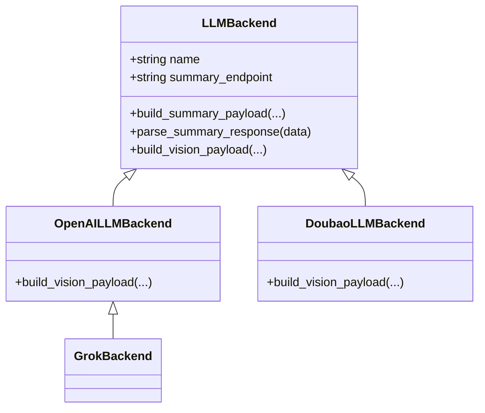
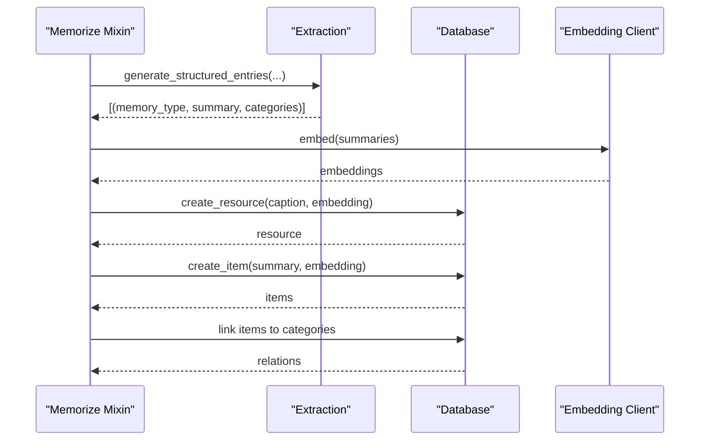
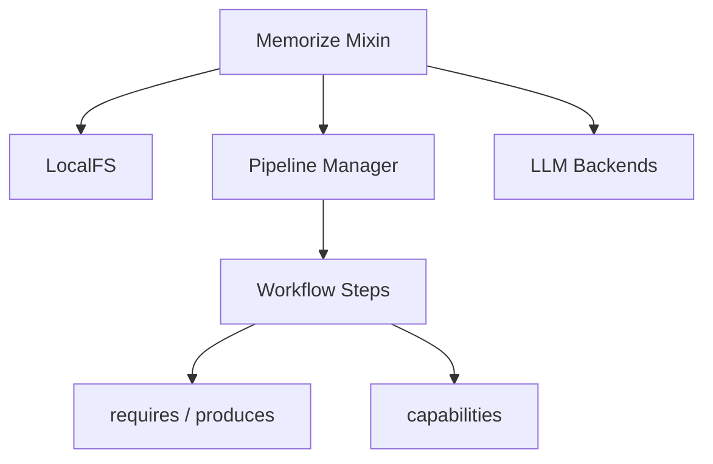

# Image and Document Processing

<cite>
**Referenced Files in This Document**
- [memorize.py](file://src/memu/app/memorize.py)
- [image.py](file://src/memu/prompts/preprocess/image.py)
- [document.py](file://src/memu/prompts/preprocess/document.py)
- [pipeline.py](file://src/memu/workflow/pipeline.py)
- [local_fs.py](file://src/memu/blob/local_fs.py)
- [video.py](file://src/memu/utils/video.py)
- [base.py](file://src/memu/llm/backends/base.py)
- [openai.py](file://src/memu/llm/backends/openai.py)
- [doubao.py](file://src/memu/llm/backends/doubao.py)
- [grok.py](file://src/memu/llm/backends/grok.py)
- [doc1.txt](file://examples/resources/docs/doc1.txt)
</cite>

## Table of Contents
1. [Introduction](#introduction)
2. [Project Structure](#project-structure)
3. [Core Components](#core-components)
4. [Architecture Overview](#architecture-overview)
5. [Detailed Component Analysis](#detailed-component-analysis)
6. [Dependency Analysis](#dependency-analysis)
7. [Performance Considerations](#performance-considerations)
8. [Troubleshooting Guide](#troubleshooting-guide)
9. [Conclusion](#conclusion)
10. [Appendices](#appendices)

## Introduction
This document explains memU’s visual content analysis and document extraction capabilities. It focuses on the preprocessing pipeline for images and documents, including multimodal vision-language model integration, optional OCR pathways, and how processed content is transformed into structured text for memory construction. It also covers supported modalities, metadata preservation, batch processing strategies, and troubleshooting guidance.

## Project Structure
The image and document processing pipeline spans several modules:
- Application orchestration and multimodal preprocessing
- Prompt templates for image and document preprocessing
- Workflow pipeline definition and validation
- File ingestion and local storage
- Video utilities for frame extraction (affects multimodal image handling)
- LLM backends for vision and text processing

**Diagram sources**
- [memorize.py](file://src/memu/app/memorize.py#L69)
- [image.py](file://src/memu/prompts/preprocess/image.py#L1-L35)
- [document.py](file://src/memu/prompts/preprocess/document.py#L1-L36)
- [pipeline.py](file://src/memu/workflow/pipeline.py#L21-L171)
- [local_fs.py](file://src/memu/blob/local_fs.py#L10-L81)
- [video.py](file://src/memu/utils/video.py#L15-L272)
- [base.py](file://src/memu/llm/backends/base.py#L6-L31)
- [openai.py](file://src/memu/llm/backends/openai.py#L8-L65)
- [doubao.py](file://src/memu/llm/backends/doubao.py#L8-L70)
- [grok.py](file://src/memu/llm/backends/grok.py#L6-L12)

**Section sources**
- [memorize.py](file://src/memu/app/memorize.py#L65-L166)
- [pipeline.py](file://src/memu/workflow/pipeline.py#L21-L171)
- [local_fs.py](file://src/memu/blob/local_fs.py#L10-L81)
- [video.py](file://src/memu/utils/video.py#L15-L272)
- [image.py](file://src/memu/prompts/preprocess/image.py#L1-L35)
- [document.py](file://src/memu/prompts/preprocess/document.py#L1-L36)
- [base.py](file://src/memu/llm/backends/base.py#L6-L31)
- [openai.py](file://src/memu/llm/backends/openai.py#L8-L65)
- [doubao.py](file://src/memu/llm/backends/doubao.py#L8-L70)
- [grok.py](file://src/memu/llm/backends/grok.py#L6-L12)

## Core Components
- Multimodal preprocessing dispatcher: routes resources by modality and orchestrates preprocessing.
- Image preprocessing: vision-language model-driven description and caption extraction.
- Document preprocessing: text condensation and caption generation.
- File ingestion: local or remote resource fetching with filename inference.
- Workflow pipeline: step-based orchestration with capability and profile validation.
- LLM backends: OpenAI-compatible vision/text payloads and response parsing.

Key responsibilities:
- Ingestion: fetches and materializes resources locally for processing.
- Preprocessing: transforms raw content into structured text and captions.
- Extraction: generates memory-type-specific entries from processed content.
- Persistence: stores resources, items, and category relations with embeddings.

**Section sources**
- [memorize.py](file://src/memu/app/memorize.py#L69-L166)
- [memorize.py](file://src/memu/app/memorize.py#L689-L794)
- [memorize.py](file://src/memu/app/memorize.py#L186-L197)
- [local_fs.py](file://src/memu/blob/local_fs.py#L57-L81)
- [pipeline.py](file://src/memu/workflow/pipeline.py#L21-L171)
- [base.py](file://src/memu/llm/backends/base.py#L6-L31)

## Architecture Overview
The multimodal processing workflow is step-based and validated by the pipeline manager. The preprocessing step invokes modality-specific handlers that integrate with LLM backends supporting vision.

**Diagram sources**
- [memorize.py](file://src/memu/app/memorize.py#L65-L166)
- [memorize.py](file://src/memu/app/memorize.py#L186-L197)
- [memorize.py](file://src/memu/app/memorize.py#L689-L794)
- [local_fs.py](file://src/memu/blob/local_fs.py#L57-L81)
- [openai.py](file://src/memu/llm/backends/openai.py#L31-L65)
- [doubao.py](file://src/memu/llm/backends/doubao.py#L34-L70)

## Detailed Component Analysis

### Image Preprocessing Pipeline
- Dispatcher selects image preprocessing when modality is image.
- Uses a vision-capable LLM backend to analyze the image and produce:
  - A detailed description
  - A one-sentence caption
- The prompt template defines the objective, workflow, rules, and output structure for image analysis.

**Diagram sources**
- [memorize.py](file://src/memu/app/memorize.py#L891-L908)
- [image.py](file://src/memu/prompts/preprocess/image.py#L1-L35)
- [openai.py](file://src/memu/llm/backends/openai.py#L31-L65)
- [doubao.py](file://src/memu/llm/backends/doubao.py#L34-L70)

**Section sources**
- [memorize.py](file://src/memu/app/memorize.py#L891-L908)
- [image.py](file://src/memu/prompts/preprocess/image.py#L1-L35)
- [openai.py](file://src/memu/llm/backends/openai.py#L31-L65)
- [doubao.py](file://src/memu/llm/backends/doubao.py#L34-L70)

### Document Preprocessing Pipeline
- Dispatcher selects document preprocessing when modality is document and text is available.
- Uses a prompt template to:
  - Condense the document text while preserving key information
  - Produce a one-sentence caption summarizing the document
- The resulting processed content and caption are returned for downstream extraction and memory creation.

**Diagram sources**
- [memorize.py](file://src/memu/app/memorize.py#L910-L920)
- [document.py](file://src/memu/prompts/preprocess/document.py#L1-L36)

**Section sources**
- [memorize.py](file://src/memu/app/memorize.py#L910-L920)
- [document.py](file://src/memu/prompts/preprocess/document.py#L1-L36)

### File Ingestion and Local Storage
- Supports local files and HTTP URLs.
- Infers filenames from URLs and query parameters; falls back to modality-based extensions when needed.
- Reads text content for text-based modalities during ingestion.

**Diagram sources**
- [local_fs.py](file://src/memu/blob/local_fs.py#L57-L81)

**Section sources**
- [local_fs.py](file://src/memu/blob/local_fs.py#L10-L81)

### Video Frame Extraction (Impact on Image Processing)
- Video resources can be converted into still frames using ffmpeg/ffprobe.
- Frame extraction is used internally to obtain representative images for vision processing.

**Diagram sources**
- [video.py](file://src/memu/utils/video.py#L45-L118)
- [video.py](file://src/memu/utils/video.py#L157-L221)

**Section sources**
- [video.py](file://src/memu/utils/video.py#L15-L272)

### LLM Backends and Vision Payloads
- Vision-capable backends accept a prompt and an image (via base64 MIME URL) and return structured text.
- Backends include OpenAI-compatible and Doubao variants; Grok inherits OpenAI-compatible behavior.

**Diagram sources**
- [base.py](file://src/memu/llm/backends/base.py#L6-L31)
- [openai.py](file://src/memu/llm/backends/openai.py#L8-L65)
- [doubao.py](file://src/memu/llm/backends/doubao.py#L8-L70)
- [grok.py](file://src/memu/llm/backends/grok.py#L6-L12)

**Section sources**
- [base.py](file://src/memu/llm/backends/base.py#L6-L31)
- [openai.py](file://src/memu/llm/backends/openai.py#L8-L65)
- [doubao.py](file://src/memu/llm/backends/doubao.py#L8-L70)
- [grok.py](file://src/memu/llm/backends/grok.py#L6-L12)

### Multimodal Memory Construction
- After preprocessing, the system generates structured entries per memory type and persists items with embeddings.
- Resources are created with optional captions and embeddings; category relations are established.

**Diagram sources**
- [memorize.py](file://src/memu/app/memorize.py#L578-L623)
- [memorize.py](file://src/memu/app/memorize.py#L234-L281)

**Section sources**
- [memorize.py](file://src/memu/app/memorize.py#L424-L534)
- [memorize.py](file://src/memu/app/memorize.py#L578-L623)
- [memorize.py](file://src/memu/app/memorize.py#L234-L281)

## Dependency Analysis
- The preprocessing dispatcher depends on:
  - Modality detection
  - Prompt template resolution
  - LLM backend availability
  - File ingestion results
- The workflow manager validates step capabilities and required state keys, ensuring correct pipeline composition.

**Diagram sources**
- [memorize.py](file://src/memu/app/memorize.py#L97-L166)
- [pipeline.py](file://src/memu/workflow/pipeline.py#L131-L164)

**Section sources**
- [memorize.py](file://src/memu/app/memorize.py#L97-L166)
- [pipeline.py](file://src/memu/workflow/pipeline.py#L131-L164)

## Performance Considerations
- High-resolution images:
  - Resolution handling is not explicitly implemented in the codebase. Consider downscaling images before vision processing to reduce latency and cost when integrating with external vision APIs.
- Batch processing:
  - The extraction phase uses concurrent LLM calls for multiple memory type prompts. This improves throughput when generating structured entries.
- Quality optimization:
  - Use appropriate LLM models and temperature settings for deterministic outputs.
  - For OCR-heavy documents, consider pre-extraction of text (e.g., PDF parsing) before applying document preprocessing prompts.

[No sources needed since this section provides general guidance]

## Troubleshooting Guide
Common issues and resolutions:
- Video preprocessing failures:
  - Ensure ffmpeg and ffprobe are installed and accessible. The extractor checks availability and raises runtime errors if missing.
- Vision API failures:
  - Verify LLM backend configuration and credentials. Confirm the backend supports vision payloads and that the prompt template is correctly applied.
- Missing text for text-based modalities:
  - For document and conversation modalities, ensure the ingestion step reads text content. If raw text is not provided, preprocessing may fall back to returning None.
- Filename inference problems:
  - When URLs lack extensions or contain generic filenames, the system infers extensions from query parameters or modality defaults. Validate URLs and query parameters for predictable results.

**Section sources**
- [video.py](file://src/memu/utils/video.py#L45-L47)
- [video.py](file://src/memu/utils/video.py#L107-L118)
- [local_fs.py](file://src/memu/blob/local_fs.py#L34-L55)
- [memorize.py](file://src/memu/app/memorize.py#L726-L735)

## Conclusion
memU’s image and document processing integrates multimodal vision-language models with a robust preprocessing pipeline. Images are described and captioned using vision APIs, while documents are condensed and summarized. The system supports flexible ingestion, step-based workflows, and structured memory creation with embeddings and categories. For high-resolution images and OCR-heavy documents, consider upstream optimization and pre-processing to improve performance and accuracy.

[No sources needed since this section summarizes without analyzing specific files]

## Appendices

### Supported Modalities and Preprocessing Behavior
- Image: Vision analysis yields description and caption.
- Document: Text condensation and caption generation.
- Conversation: Text-based preprocessing with optional segmentation.
- Audio: Transcription followed by text-based preprocessing.
- Video: Frame extraction (middle or multiple frames) for subsequent image preprocessing.

**Section sources**
- [memorize.py](file://src/memu/app/memorize.py#L775-L794)
- [memorize.py](file://src/memu/app/memorize.py#L784-L800)
- [memorize.py](file://src/memu/app/memorize.py#L721-L770)
- [video.py](file://src/memu/utils/video.py#L31-L118)

### Example: How Documents Are Processed
- A document is fetched and ingested as text.
- The document preprocessing prompt is applied to condense content and generate a caption.
- The resulting structured text and caption are used to generate memory-type-specific entries and persist items.

**Section sources**
- [memorize.py](file://src/memu/app/memorize.py#L910-L920)
- [document.py](file://src/memu/prompts/preprocess/document.py#L1-L36)
- [local_fs.py](file://src/memu/blob/local_fs.py#L77-L80)

### Example: How Images Are Analyzed
- An image is fetched and passed to the vision backend with the image preprocessing prompt.
- The response is parsed into a detailed description and a one-sentence caption.

**Section sources**
- [memorize.py](file://src/memu/app/memorize.py#L891-L908)
- [image.py](file://src/memu/prompts/preprocess/image.py#L1-L35)
- [openai.py](file://src/memu/llm/backends/openai.py#L31-L65)