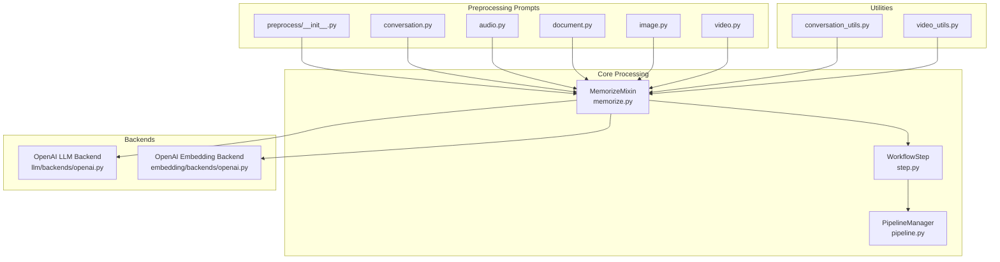
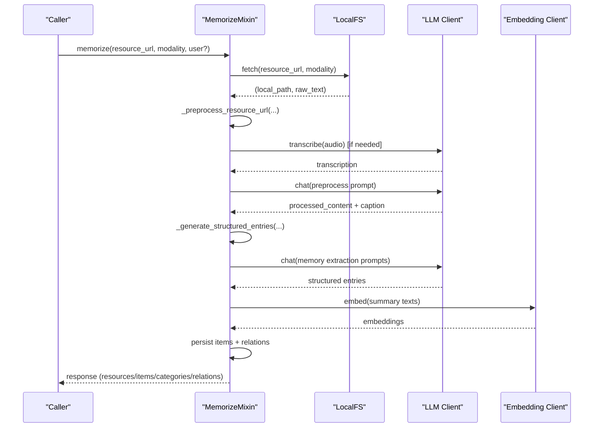
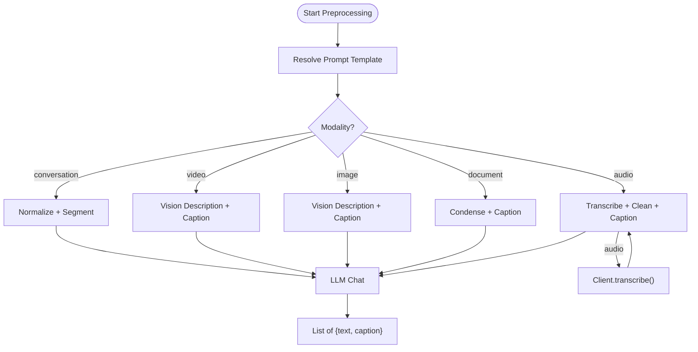
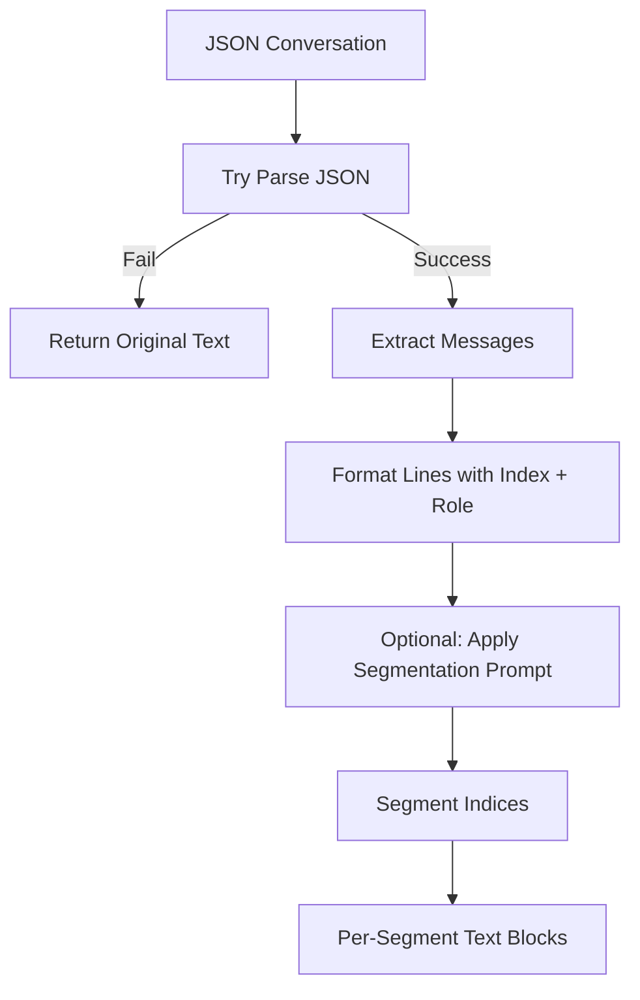
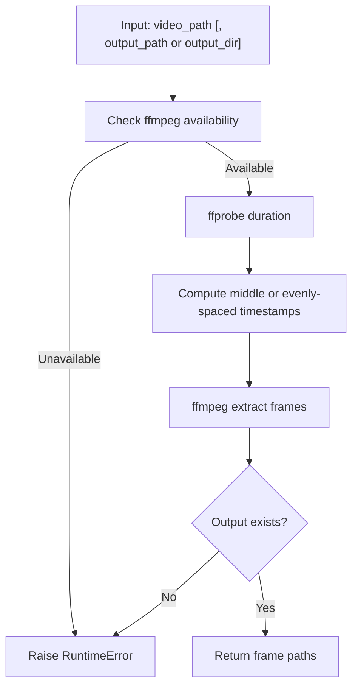
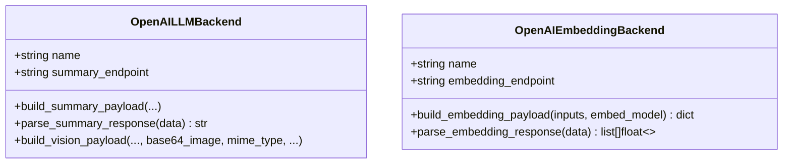
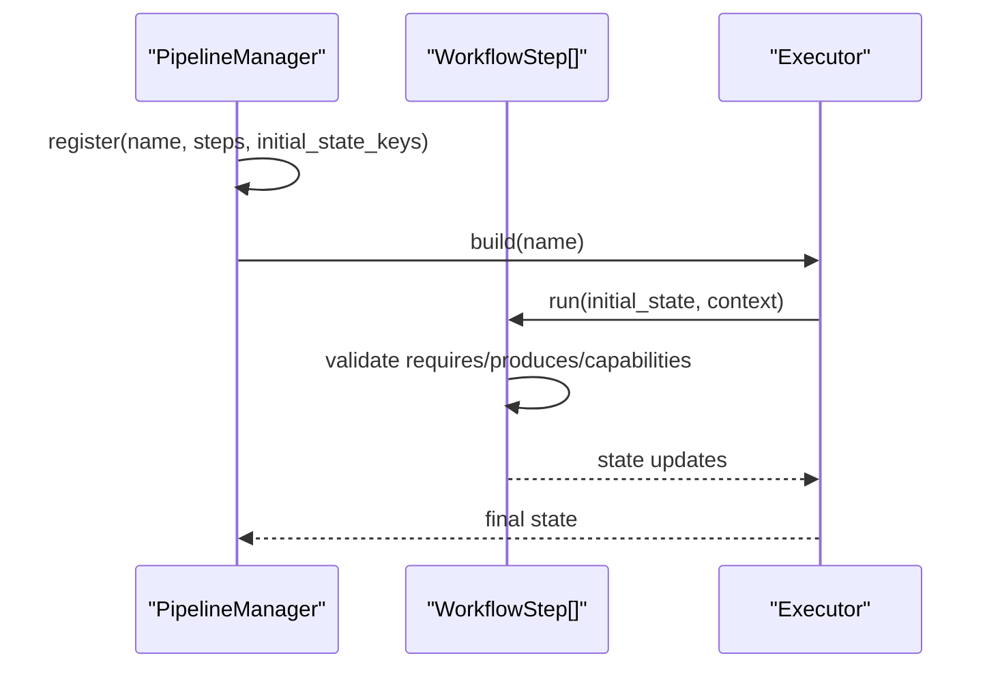
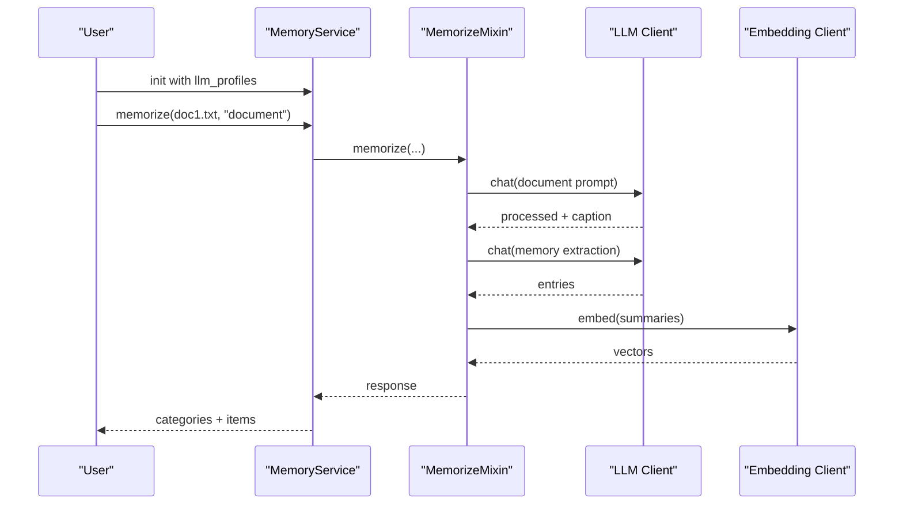
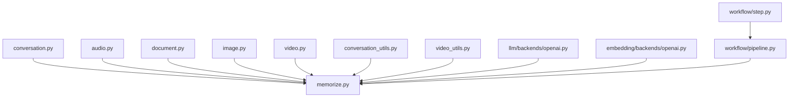

# Multi-modal Processing

<cite>
**Referenced Files in This Document**
- [memorize.py](file://src/memu/app/memorize.py)
- [__init__.py](file://src/memu/prompts/preprocess/__init__.py)
- [audio.py](file://src/memu/prompts/preprocess/audio.py)
- [conversation.py](file://src/memu/prompts/preprocess/conversation.py)
- [document.py](file://src/memu/prompts/preprocess/document.py)
- [image.py](file://src/memu/prompts/preprocess/image.py)
- [video.py](file://src/memu/prompts/preprocess/video.py)
- [openai.py](file://src/memu/llm/backends/openai.py)
- [openai.py](file://src/memu/embedding/backends/openai.py)
- [conversation_utils.py](file://src/memu/utils/conversation.py)
- [video_utils.py](file://src/memu/utils/video.py)
- [pipeline.py](file://src/memu/workflow/pipeline.py)
- [step.py](file://src/memu/workflow/step.py)
- [example_3_multimodal_memory.py](file://examples/example_3_multimodal_memory.py)
- [conv1.json](file://examples/resources/conversations/conv1.json)
</cite>

## Table of Contents
1. [Introduction](#introduction)
2. [Project Structure](#project-structure)
3. [Core Components](#core-components)
4. [Architecture Overview](#architecture-overview)
5. [Detailed Component Analysis](#detailed-component-analysis)
6. [Dependency Analysis](#dependency-analysis)
7. [Performance Considerations](#performance-considerations)
8. [Troubleshooting Guide](#troubleshooting-guide)
9. [Conclusion](#conclusion)
10. [Appendices](#appendices)

## Introduction
This document explains memU’s multi-modal processing pipeline with a focus on how different input types are handled: text conversations, audio, images, and video. It covers the preprocessing stages, integration with vision-language models and audio transcription systems, multimodal embedding strategies, and how modalities are unified into coherent memory representations. It also provides guidance on supported formats, constraints, performance tuning, and extending the system with custom modalities.

## Project Structure
The multi-modal pipeline centers around a workflow-driven architecture that ingests resources, preprocesses them according to modality, extracts structured memories, and persists them with embeddings. Key areas:
- Preprocessing prompts for each modality
- Utilities for conversation normalization and video frame extraction
- LLM and embedding backends
- Workflow pipeline and step execution engine
- Example usage demonstrating multimodal memory generation

**Diagram sources**
- [memorize.py](file://src/memu/app/memorize.py#L97-L166)
- [__init__.py](file://src/memu/prompts/preprocess/__init__.py#L1-L12)
- [conversation.py](file://src/memu/prompts/preprocess/conversation.py#L1-L44)
- [audio.py](file://src/memu/prompts/preprocess/audio.py#L1-L36)
- [document.py](file://src/memu/prompts/preprocess/document.py#L1-L36)
- [image.py](file://src/memu/prompts/preprocess/image.py#L1-L35)
- [video.py](file://src/memu/prompts/preprocess/video.py#L1-L36)
- [conversation_utils.py](file://src/memu/utils/conversation.py#L1-L90)
- [video_utils.py](file://src/memu/utils/video.py#L1-L272)
- [openai.py](file://src/memu/llm/backends/openai.py#L1-L65)
- [openai.py](file://src/memu/embedding/backends/openai.py#L1-L19)
- [step.py](file://src/memu/workflow/step.py#L1-L102)
- [pipeline.py](file://src/memu/workflow/pipeline.py#L1-L171)

**Section sources**
- [memorize.py](file://src/memu/app/memorize.py#L97-L166)
- [__init__.py](file://src/memu/prompts/preprocess/__init__.py#L1-L12)

## Core Components
- Preprocessing prompts: Modality-specific prompts define how each input is transformed into processed content and a concise caption.
- Conversation normalization: Converts JSON conversation formats into a line-based indexable structure for downstream processing.
- Video frame extraction: Extracts representative frames using ffmpeg for image-based analysis when needed.
- LLM and embedding backends: Provide chat completions, vision payloads, and embeddings via OpenAI-compatible APIs.
- Workflow engine: Executes a fixed pipeline of steps with capability gating and state transitions.

Key responsibilities:
- Ingest resource and raw text
- Dispatch preprocessing based on modality
- Segment conversations when applicable
- Generate structured memory entries
- Persist items with embeddings and category relations
- Produce unified response with resources, items, categories, and relations

**Section sources**
- [memorize.py](file://src/memu/app/memorize.py#L65-L95)
- [memorize.py](file://src/memu/app/memorize.py#L181-L197)
- [memorize.py](file://src/memu/app/memorize.py#L199-L227)
- [memorize.py](file://src/memu/app/memorize.py#L234-L281)
- [memorize.py](file://src/memu/app/memorize.py#L283-L297)
- [memorize.py](file://src/memu/app/memorize.py#L299-L325)

## Architecture Overview
The multi-modal pipeline is a workflow composed of ordered steps. Each step declares required and produced state keys and optional capabilities. The engine enforces correctness and runs handlers asynchronously.

**Diagram sources**
- [memorize.py](file://src/memu/app/memorize.py#L65-L95)
- [memorize.py](file://src/memu/app/memorize.py#L181-L197)
- [memorize.py](file://src/memu/app/memorize.py#L186-L197)
- [memorize.py](file://src/memu/app/memorize.py#L729-L794)
- [memorize.py](file://src/memu/app/memorize.py#L424-L455)
- [memorize.py](file://src/memu/app/memorize.py#L578-L623)
- [openai.py](file://src/memu/llm/backends/openai.py#L14-L29)
- [openai.py](file://src/memu/embedding/backends/openai.py#L14-L18)

## Detailed Component Analysis

### Preprocessing Prompts and Dispatch
- Prompt registry aggregates modality-specific prompts for conversation, video, image, document, and audio.
- Dispatcher selects the appropriate preprocessor based on modality and available text/caption.
- Conversation preprocessing normalizes JSON to a line-indexed format and supports segmentation.

**Diagram sources**
- [__init__.py](file://src/memu/prompts/preprocess/__init__.py#L1-L12)
- [conversation.py](file://src/memu/prompts/preprocess/conversation.py#L1-L44)
- [video.py](file://src/memu/prompts/preprocess/video.py#L1-L36)
- [image.py](file://src/memu/prompts/preprocess/image.py#L1-L35)
- [document.py](file://src/memu/prompts/preprocess/document.py#L1-L36)
- [audio.py](file://src/memu/prompts/preprocess/audio.py#L1-L36)
- [memorize.py](file://src/memu/app/memorize.py#L689-L794)
- [memorize.py](file://src/memu/app/memorize.py#L737-L770)

**Section sources**
- [__init__.py](file://src/memu/prompts/preprocess/__init__.py#L1-L12)
- [conversation.py](file://src/memu/prompts/preprocess/conversation.py#L1-L44)
- [video.py](file://src/memu/prompts/preprocess/video.py#L1-L36)
- [image.py](file://src/memu/prompts/preprocess/image.py#L1-L35)
- [document.py](file://src/memu/prompts/preprocess/document.py#L1-L36)
- [audio.py](file://src/memu/prompts/preprocess/audio.py#L1-L36)
- [memorize.py](file://src/memu/app/memorize.py#L689-L794)
- [memorize.py](file://src/memu/app/memorize.py#L737-L770)

### Conversation Normalization and Segmentation
- Converts JSON conversation formats into a normalized line-based representation with indexed markers and optional timestamps.
- Uses a dedicated prompt to segment long conversations into meaningful chunks for better memory extraction.

**Diagram sources**
- [conversation_utils.py](file://src/memu/utils/conversation.py#L7-L36)
- [conversation_utils.py](file://src/memu/utils/conversation.py#L39-L57)
- [conversation_utils.py](file://src/memu/utils/conversation.py#L60-L69)
- [conversation.py](file://src/memu/prompts/preprocess/conversation.py#L1-L44)
- [memorize.py](file://src/memu/app/memorize.py#L467-L482)

**Section sources**
- [conversation_utils.py](file://src/memu/utils/conversation.py#L1-L90)
- [conversation.py](file://src/memu/prompts/preprocess/conversation.py#L1-L44)
- [memorize.py](file://src/memu/app/memorize.py#L467-L482)

### Video Frame Extraction
- Extracts a middle frame or multiple evenly spaced frames using ffmpeg/ffprobe.
- Validates availability of ffmpeg binaries and handles errors gracefully.

**Diagram sources**
- [video_utils.py](file://src/memu/utils/video.py#L15-L272)

**Section sources**
- [video_utils.py](file://src/memu/utils/video.py#L15-L272)

### LLM and Embedding Backends
- OpenAI LLM backend supports chat completions and vision payloads with base64 image attachments.
- OpenAI embedding backend builds and parses embedding payloads compatible with OpenAI-style APIs.

**Diagram sources**
- [openai.py](file://src/memu/llm/backends/openai.py#L1-L65)
- [openai.py](file://src/memu/embedding/backends/openai.py#L1-L19)

**Section sources**
- [openai.py](file://src/memu/llm/backends/openai.py#L1-L65)
- [openai.py](file://src/memu/embedding/backends/openai.py#L1-L19)

### Workflow Engine
- Steps declare required/produced keys and capabilities; the manager validates pipeline integrity.
- Execution runs handlers asynchronously and supports interceptors and error handling.

**Diagram sources**
- [pipeline.py](file://src/memu/workflow/pipeline.py#L21-L171)
- [step.py](file://src/memu/workflow/step.py#L40-L102)

**Section sources**
- [pipeline.py](file://src/memu/workflow/pipeline.py#L1-L171)
- [step.py](file://src/memu/workflow/step.py#L1-L102)

### Example: Multimodal Memory Generation
- Demonstrates processing documents and images, generating memory categories, and writing outputs to markdown.
- Shows initialization with llm_profiles and category configuration.

**Diagram sources**
- [example_3_multimodal_memory.py](file://examples/example_3_multimodal_memory.py#L58-L137)
- [memorize.py](file://src/memu/app/memorize.py#L65-L95)
- [memorize.py](file://src/memu/app/memorize.py#L424-L455)
- [memorize.py](file://src/memu/app/memorize.py#L578-L623)

**Section sources**
- [example_3_multimodal_memory.py](file://examples/example_3_multimodal_memory.py#L1-L138)

## Dependency Analysis
- Preprocessing prompts are referenced by the preprocessing dispatcher in the core mixin.
- Conversation normalization is used during conversation preprocessing.
- Video frame extraction is used when processing video modalities.
- LLM and embedding backends are invoked for transcription, vision, and embeddings.
- The workflow engine orchestrates step execution and enforces capability and state contracts.

**Diagram sources**
- [memorize.py](file://src/memu/app/memorize.py#L689-L794)
- [conversation_utils.py](file://src/memu/utils/conversation.py#L1-L90)
- [video_utils.py](file://src/memu/utils/video.py#L1-L272)
- [openai.py](file://src/memu/llm/backends/openai.py#L1-L65)
- [openai.py](file://src/memu/embedding/backends/openai.py#L1-L19)
- [step.py](file://src/memu/workflow/step.py#L1-L102)
- [pipeline.py](file://src/memu/workflow/pipeline.py#L1-L171)

**Section sources**
- [memorize.py](file://src/memu/app/memorize.py#L689-L794)
- [step.py](file://src/memu/workflow/step.py#L1-L102)
- [pipeline.py](file://src/memu/workflow/pipeline.py#L1-L171)

## Performance Considerations
- Audio transcription cost and latency: Prefer shorter audio clips or pre-transcribed text files when available. Batch operations where feasible.
- Video frame extraction: Extract only necessary frames (e.g., middle frame) to reduce compute; avoid excessive multiple-frame extraction unless required.
- Embedding costs: Consolidate summary texts and batch embedding calls to minimize API overhead.
- Conversation segmentation: Breaking long conversations improves memory granularity and retrieval relevance; ensure segment sizes meet minimum thresholds.
- Concurrency: The workflow uses asynchronous handlers; ensure underlying clients support concurrent requests and configure timeouts appropriately.
- I/O throughput: Local filesystem fetch and temporary file creation for video frames should be on fast storage to avoid bottlenecks.

[No sources needed since this section provides general guidance]

## Troubleshooting Guide
Common issues and resolutions:
- ffmpeg not available: Video processing raises runtime errors if ffmpeg/ffprobe are missing. Install ffmpeg and ensure executables are discoverable.
- Audio transcription failures: If transcription fails, the system logs exceptions and skips audio preprocessing. Verify audio file formats and client credentials.
- Missing required state keys: Workflow validation errors indicate steps requiring keys that were not produced by previous steps. Ensure earlier steps produce required keys.
- Unknown LLM profile: If a step references a non-existent llm_profile, validation fails. Confirm profile names match registered profiles.
- Empty or invalid conversation JSON: If JSON parsing fails, the system falls back to original text. Validate conversation JSON structure and encoding.

**Section sources**
- [video_utils.py](file://src/memu/utils/video.py#L21-L28)
- [memorize.py](file://src/memu/app/memorize.py#L748-L756)
- [pipeline.py](file://src/memu/workflow/pipeline.py#L131-L164)

## Conclusion
memU’s multi-modal processing pipeline unifies diverse input types through standardized preprocessing prompts, robust utilities for normalization and frame extraction, and pluggable LLM and embedding backends. The workflow-driven architecture ensures reliable execution, while the modality-specific strategies enable high-quality memory extraction and embedding. By following the guidance in this document, users can optimize performance, troubleshoot common issues, and extend the system to support additional modalities.

[No sources needed since this section summarizes without analyzing specific files]

## Appendices

### Supported Modalities and Typical Workflows
- Conversation: Normalize JSON to indexed lines, optionally segment into topics, then extract structured memories.
- Document: Condense text and generate a one-sentence caption.
- Image: Generate detailed description and one-sentence caption via vision-capable LLM.
- Video: Extract representative frames and generate description + caption; optionally use audio if available.
- Audio: Transcribe audio to text, then apply text preprocessing and caption generation.

**Section sources**
- [conversation.py](file://src/memu/prompts/preprocess/conversation.py#L1-L44)
- [document.py](file://src/memu/prompts/preprocess/document.py#L1-L36)
- [image.py](file://src/memu/prompts/preprocess/image.py#L1-L35)
- [video.py](file://src/memu/prompts/preprocess/video.py#L1-L36)
- [audio.py](file://src/memu/prompts/preprocess/audio.py#L1-L36)
- [memorize.py](file://src/memu/app/memorize.py#L729-L794)

### Integration with External Services
- Audio transcription: Uses client.transcribe() to convert audio files to text.
- Vision-language models: Uses client.chat() with vision payloads containing base64-encoded images.
- Embeddings: Uses client.embed() to compute dense vectors for captions and memory summaries.

**Section sources**
- [memorize.py](file://src/memu/app/memorize.py#L748-L756)
- [openai.py](file://src/memu/llm/backends/openai.py#L31-L64)
- [openai.py](file://src/memu/embedding/backends/openai.py#L14-L18)

### Implementing Custom Modalities
To add a new modality:
- Define a preprocessing prompt and add it to the prompt registry.
- Extend the preprocessing dispatcher to route to a new handler.
- Implement any required utilities (e.g., normalization or extraction helpers).
- Integrate with LLM and embedding backends as needed.
- Update the workflow if new capabilities or state keys are required.

**Section sources**
- [__init__.py](file://src/memu/prompts/preprocess/__init__.py#L1-L12)
- [memorize.py](file://src/memu/app/memorize.py#L775-L794)

### Example Inputs and Outputs
- Conversation example input: See [conv1.json](file://examples/resources/conversations/conv1.json#L1-L55)
- Multimodal example usage: See [example_3_multimodal_memory.py](file://examples/example_3_multimodal_memory.py#L58-L137)

**Section sources**
- [conv1.json](file://examples/resources/conversations/conv1.json#L1-L55)
- [example_3_multimodal_memory.py](file://examples/example_3_multimodal_memory.py#L58-L137)