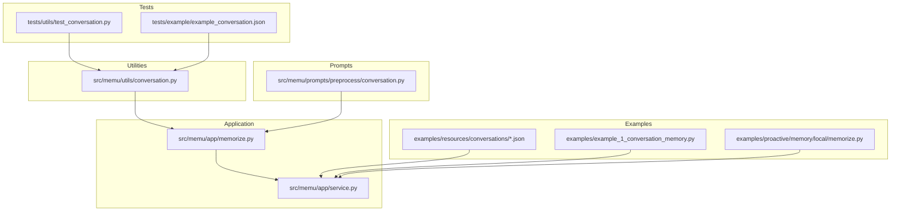
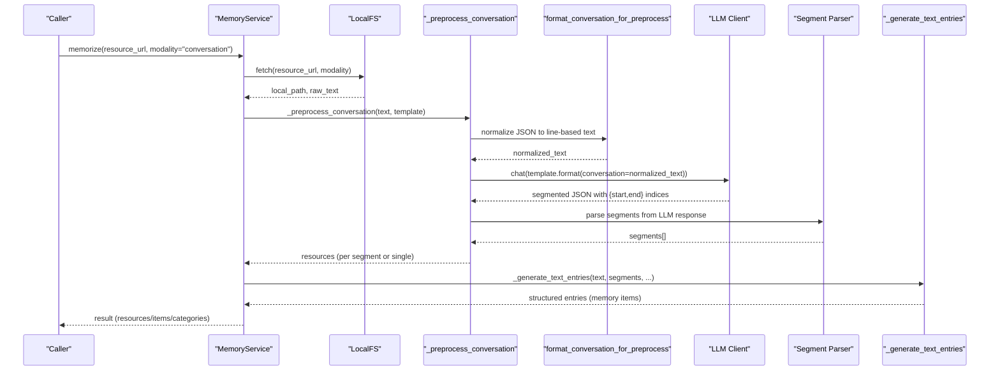
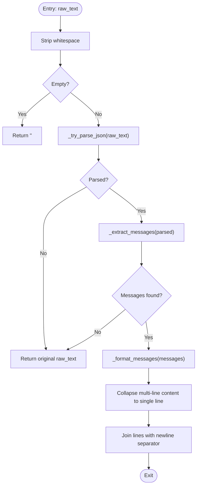
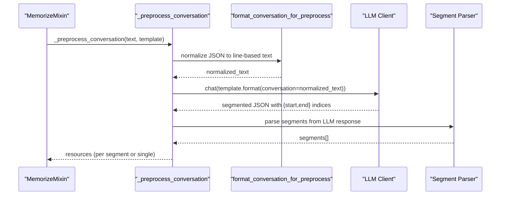
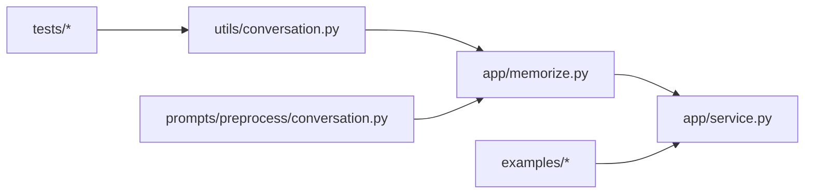

# Text and Conversation Processing

<cite>
**Referenced Files in This Document**
- [conversation.py](file://src/memu/utils/conversation.py)
- [conversation_preprocess_prompt.py](file://src/memu/prompts/preprocess/conversation.py)
- [memorize.py](file://src/memu/app/memorize.py)
- [service.py](file://src/memu/app/service.py)
- [test_conversation.py](file://tests/utils/test_conversation.py)
- [conv1.json](file://examples/resources/conversations/conv1.json)
- [conv2.json](file://examples/resources/conversations/conv2.json)
- [conv3.json](file://examples/resources/conversations/conv3.json)
- [example_conversation.json](file://tests/example/example_conversation.json)
- [example_1_conversation_memory.py](file://examples/example_1_conversation_memory.py)
- [memorize.py (local proactive)](file://examples/proactive/memory/local/memorize.py)
</cite>

## Table of Contents
1. [Introduction](#introduction)
2. [Project Structure](#project-structure)
3. [Core Components](#core-components)
4. [Architecture Overview](#architecture-overview)
5. [Detailed Component Analysis](#detailed-component-analysis)
6. [Dependency Analysis](#dependency-analysis)
7. [Performance Considerations](#performance-considerations)
8. [Troubleshooting Guide](#troubleshooting-guide)
9. [Conclusion](#conclusion)

## Introduction
This document explains memU’s text and conversation processing pipeline with a focus on conversation normalization and preprocessing. It details how the format_conversation_for_preprocess function transforms diverse conversation formats (JSON arrays and JSON objects with content lists) into a line-based format suitable for downstream LLM processing. It also covers supported input formats, JSON parsing logic, message extraction patterns, output formatting conventions, and the relationship between conversation processing and memory extraction. Practical examples illustrate role-based formatting, timestamp handling, and content extraction from nested JSON structures. Finally, it provides performance guidance for large conversations, integration with multimodal workflows, and troubleshooting tips for malformed inputs.

## Project Structure
The conversation processing capability spans several modules:
- Utilities for conversation normalization
- Preprocessing prompts for conversation segmentation
- Application-level preprocessing and memory extraction
- Example resources and tests validating behavior

**Diagram sources**
- [conversation.py](file://src/memu/utils/conversation.py#L1-L90)
- [conversation_preprocess_prompt.py](file://src/memu/prompts/preprocess/conversation.py#L1-L44)
- [memorize.py](file://src/memu/app/memorize.py#L784-L830)
- [service.py](file://src/memu/app/service.py#L1-L427)
- [conv1.json](file://examples/resources/conversations/conv1.json#L1-L55)
- [conv2.json](file://examples/resources/conversations/conv2.json#L1-L68)
- [conv3.json](file://examples/resources/conversations/conv3.json#L1-L68)
- [example_conversation.json](file://tests/example/example_conversation.json#L1-L705)
- [test_conversation.py](file://tests/utils/test_conversation.py#L1-L92)
- [example_1_conversation_memory.py](file://examples/example_1_conversation_memory.py#L1-L118)
- [memorize.py (local proactive)](file://examples/proactive/memory/local/memorize.py#L1-L38)

**Section sources**
- [conversation.py](file://src/memu/utils/conversation.py#L1-L90)
- [conversation_preprocess_prompt.py](file://src/memu/prompts/preprocess/conversation.py#L1-L44)
- [memorize.py](file://src/memu/app/memorize.py#L784-L830)
- [service.py](file://src/memu/app/service.py#L1-L427)
- [conv1.json](file://examples/resources/conversations/conv1.json#L1-L55)
- [conv2.json](file://examples/resources/conversations/conv2.json#L1-L68)
- [conv3.json](file://examples/resources/conversations/conv3.json#L1-L68)
- [example_conversation.json](file://tests/example/example_conversation.json#L1-L705)
- [test_conversation.py](file://tests/utils/test_conversation.py#L1-L92)
- [example_1_conversation_memory.py](file://examples/example_1_conversation_memory.py#L1-L118)
- [memorize.py (local proactive)](file://examples/proactive/memory/local/memorize.py#L1-L38)

## Core Components
- format_conversation_for_preprocess: Normalizes raw conversation text into a line-based format with index markers, roles, timestamps, and single-line content.
- Conversation preprocessing prompt: Guides LLM segmentation of normalized conversations into coherent topics.
- Application preprocessing pipeline: Orchestrates ingestion, normalization, segmentation, and memory extraction for conversation modalities.
- Tests and examples: Validate supported formats, edge cases, and integration flows.

Key responsibilities:
- Accept JSON arrays or JSON objects with a content list.
- Extract role, content, and optional created_at fields.
- Collapse multi-line content into a single line.
- Produce one message per line with index and role markers.
- Preserve timestamps when present.

**Section sources**
- [conversation.py](file://src/memu/utils/conversation.py#L7-L90)
- [conversation_preprocess_prompt.py](file://src/memu/prompts/preprocess/conversation.py#L1-L44)
- [memorize.py](file://src/memu/app/memorize.py#L796-L830)
- [test_conversation.py](file://tests/utils/test_conversation.py#L8-L92)

## Architecture Overview
The conversation processing pipeline integrates normalization, segmentation, and memory extraction:

**Diagram sources**
- [memorize.py](file://src/memu/app/memorize.py#L65-L96)
- [memorize.py](file://src/memu/app/memorize.py#L186-L198)
- [memorize.py](file://src/memu/app/memorize.py#L784-L830)
- [memorize.py](file://src/memu/app/memorize.py#L457-L482)
- [conversation.py](file://src/memu/utils/conversation.py#L7-L90)
- [conversation_preprocess_prompt.py](file://src/memu/prompts/preprocess/conversation.py#L1-L44)

## Detailed Component Analysis

### format_conversation_for_preprocess
Purpose:
- Convert JSON-based conversation data into a line-based format optimized for LLM processing.

Supported input formats:
- JSON array of message objects: [{"role": "...", "content": "...", "created_at": "..."}]
- JSON object with a "content" list: {"content": [ ...messages... ]}

Output format conventions:
- One message per line.
- Index marker: "[{idx}]"
- Optional timestamp: included after index when present.
- Role marker: "[{role}]"
- Content: single line with newlines collapsed to spaces.

Behavior highlights:
- Graceful fallback: returns original text if JSON parsing fails.
- Message extraction: filters to dictionaries and supports nested content with "text".
- Timestamp handling: preserves stringified timestamps when present.

**Diagram sources**
- [conversation.py](file://src/memu/utils/conversation.py#L7-L90)

**Section sources**
- [conversation.py](file://src/memu/utils/conversation.py#L7-L90)
- [test_conversation.py](file://tests/utils/test_conversation.py#L19-L92)

### Conversation Preprocessing Prompt
Purpose:
- Instructs the LLM to segment a normalized conversation into coherent topic-based segments with inclusive start/end indices.

Rules and constraints:
- Segments must contain ≥ 20 messages.
- Segments must maintain coherent themes and clear boundaries.
- Output must be valid JSON with a "segments" array of {start, end} objects.

Integration:
- The normalized conversation text is injected into the prompt template.
- The LLM response is parsed to extract segment boundaries.

**Section sources**
- [conversation_preprocess_prompt.py](file://src/memu/prompts/preprocess/conversation.py#L1-L44)
- [memorize.py](file://src/memu/app/memorize.py#L796-L830)

### Application-Level Preprocessing and Memory Extraction
Responsibilities:
- Ingest resource and obtain raw text.
- Dispatch to conversation-specific preprocessor.
- Normalize conversation text using format_conversation_for_preprocess.
- Request segmentation from LLM using the conversation preprocessing prompt.
- Build per-segment resources with captions.
- Generate structured memory entries from each segment or the whole conversation.

Important design notes:
- Always use the original normalized text for downstream segmentation to preserve created_at and other fields.
- If no segments are produced, return a single resource.
- Segment boundaries are validated against the number of indexed lines.

**Diagram sources**
- [memorize.py](file://src/memu/app/memorize.py#L796-L830)
- [conversation.py](file://src/memu/utils/conversation.py#L7-L90)

**Section sources**
- [memorize.py](file://src/memu/app/memorize.py#L784-L830)
- [memorize.py](file://src/memu/app/memorize.py#L457-L482)

### Examples and Integration
- Example scripts demonstrate end-to-end processing of conversation JSON files and generation of memory categories.
- Proactive local memory helper converts in-memory message lists into a JSON resource compatible with the pipeline.

**Section sources**
- [example_1_conversation_memory.py](file://examples/example_1_conversation_memory.py#L82-L117)
- [memorize.py (local proactive)](file://examples/proactive/memory/local/memorize.py#L13-L38)

## Dependency Analysis
Relationships among components:
- format_conversation_for_preprocess is imported by the conversation preprocessor in the application layer.
- The conversation preprocessing prompt is used to construct the LLM request payload.
- MemoryService orchestrates the full workflow and delegates conversation preprocessing to the application module.

**Diagram sources**
- [conversation.py](file://src/memu/utils/conversation.py#L34-L34)
- [memorize.py](file://src/memu/app/memorize.py#L784-L830)
- [conversation_preprocess_prompt.py](file://src/memu/prompts/preprocess/conversation.py#L1-L44)
- [service.py](file://src/memu/app/service.py#L1-L427)
- [test_conversation.py](file://tests/utils/test_conversation.py#L5-L5)

**Section sources**
- [conversation.py](file://src/memu/utils/conversation.py#L34-L34)
- [memorize.py](file://src/memu/app/memorize.py#L784-L830)
- [conversation_preprocess_prompt.py](file://src/memu/prompts/preprocess/conversation.py#L1-L44)
- [service.py](file://src/memu/app/service.py#L1-L427)
- [test_conversation.py](file://tests/utils/test_conversation.py#L5-L5)

## Performance Considerations
- Normalization cost: Single-pass parsing and formatting; linear in number of messages.
- LLM segmentation cost: Dominated by the chat call; consider batching or limiting segment count for very long conversations.
- Memory extraction cost: Each segment incurs structured extraction prompts; reduce segment count or adjust memory types to control cost.
- Large conversations: Prefer segmentation to keep each segment above the minimum threshold and manageable for LLM reasoning.
- I/O: Ensure efficient file fetching and minimal redundant reads during preprocessing.

[No sources needed since this section provides general guidance]

## Troubleshooting Guide
Common issues and resolutions:
- Malformed JSON input:
  - Behavior: Function returns the original text unchanged.
  - Resolution: Validate JSON structure externally or sanitize before calling the function.
- Empty or whitespace-only input:
  - Behavior: Returns empty string.
  - Resolution: Guard callers to skip empty inputs.
- Unexpected JSON structure:
  - Behavior: Returns original text if message extraction fails.
  - Resolution: Ensure inputs conform to supported schemas (array of messages or object with "content" list).
- Missing role or content:
  - Behavior: Defaults role to "user" and treats missing content as empty text.
  - Resolution: Provide required fields in upstream data sources.
- Multi-line content:
  - Behavior: Collapsed to a single line to maintain consistent indexing.
  - Resolution: Keep content concise or pre-process to avoid excessive newlines.
- Timestamp handling:
  - Behavior: Preserved as-is when present; otherwise omitted.
  - Resolution: Ensure timestamps are present if needed for downstream analysis.

Validation references:
- Unit tests cover happy paths, edge cases, malformed JSON, and unexpected structures.

**Section sources**
- [conversation.py](file://src/memu/utils/conversation.py#L7-L90)
- [test_conversation.py](file://tests/utils/test_conversation.py#L66-L92)

## Conclusion
memU’s conversation processing pipeline normalizes diverse JSON conversation formats into a standardized line-based representation, enabling robust downstream segmentation and memory extraction. The format_conversation_for_preprocess function ensures consistent indexing, role labeling, and timestamp inclusion while gracefully handling malformed inputs. Together with the conversation preprocessing prompt and application-level orchestration, the system supports reliable multimodal workflows and scalable memory extraction for real-world conversation data.