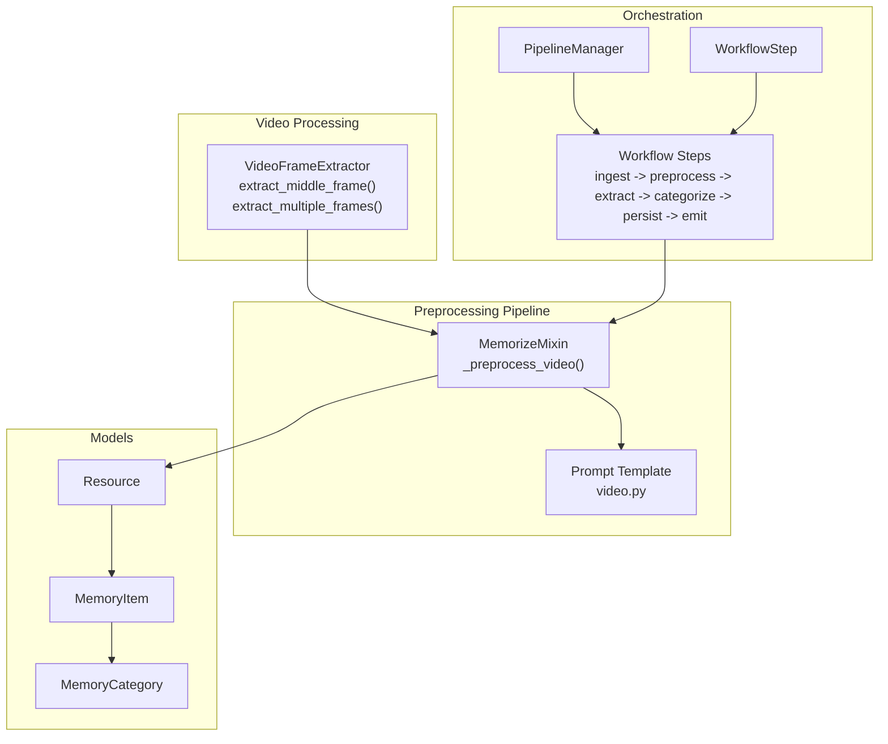
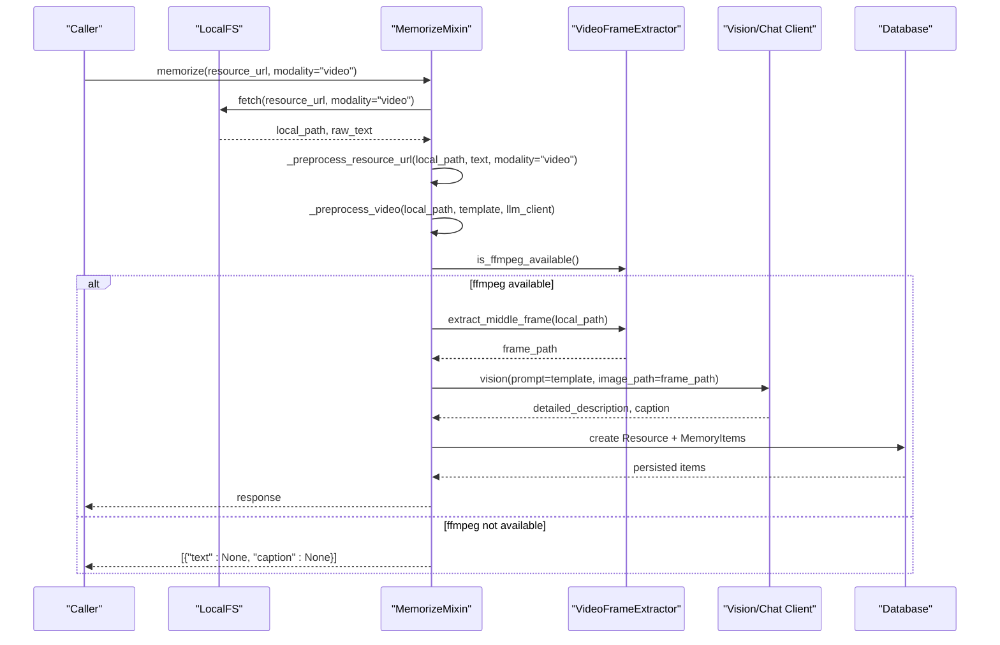
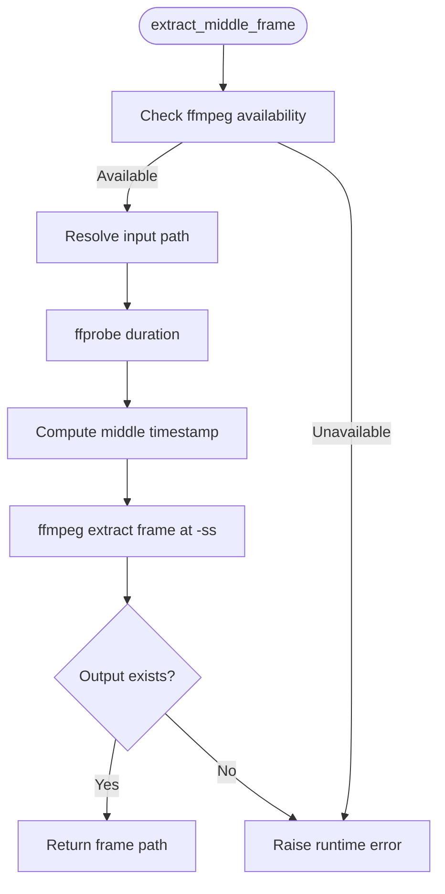
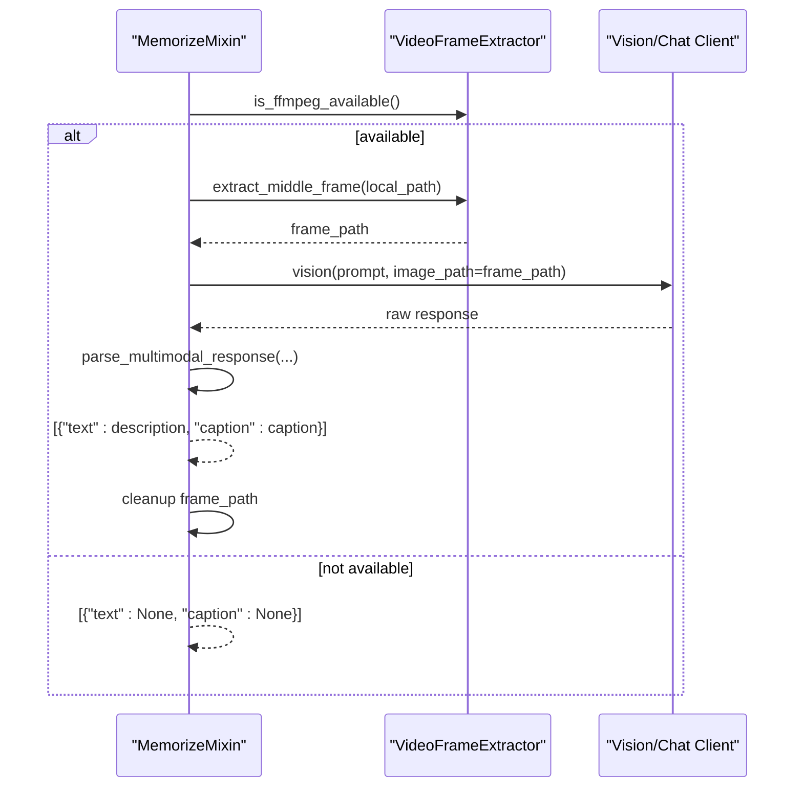
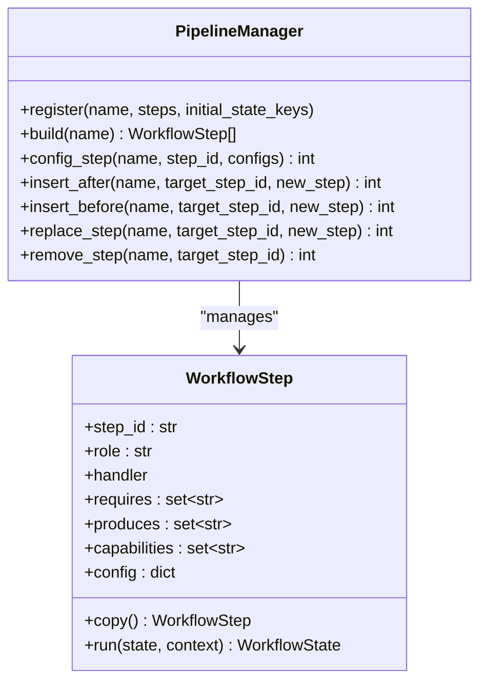
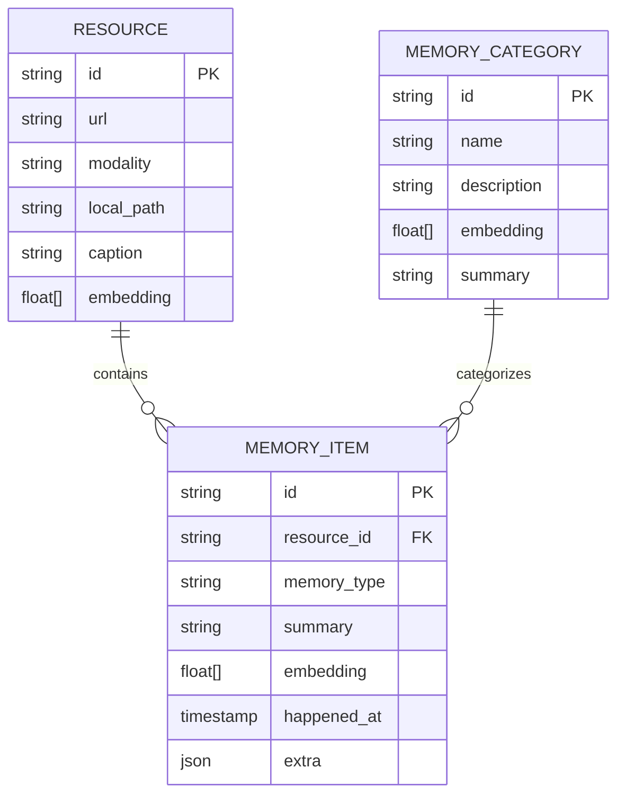
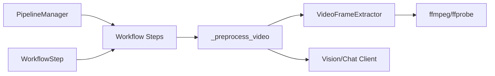

# Video Processing

<cite>
**Referenced Files in This Document**
- [video.py](file://src/memu/utils/video.py)
- [memorize.py](file://src/memu/app/memorize.py)
- [video.py](file://src/memu/prompts/preprocess/video.py)
- [pipeline.py](file://src/memu/workflow/pipeline.py)
- [step.py](file://src/memu/workflow/step.py)
- [settings.py](file://src/memu/app/settings.py)
- [models.py](file://src/memu/database/models.py)
</cite>

## Table of Contents
1. [Introduction](#introduction)
2. [Project Structure](#project-structure)
3. [Core Components](#core-components)
4. [Architecture Overview](#architecture-overview)
5. [Detailed Component Analysis](#detailed-component-analysis)
6. [Dependency Analysis](#dependency-analysis)
7. [Performance Considerations](#performance-considerations)
8. [Troubleshooting Guide](#troubleshooting-guide)
9. [Conclusion](#conclusion)
10. [Appendices](#appendices)

## Introduction
This document explains memU’s video processing capabilities with a focus on video analysis and temporal content handling. It covers the video preprocessing pipeline, including frame extraction, motion analysis, audio extraction, and temporal segmentation strategies. It also documents supported video formats, resolution handling, duration limits, compression considerations, integration with video processing libraries, frame sampling algorithms, temporal coherence preservation, performance optimization for long videos, parallel processing strategies, memory management, and troubleshooting guidance for common video processing challenges.

## Project Structure
The video processing capability is implemented as a small set of focused modules:
- Video frame extraction utilities powered by ffmpeg/ffprobe
- A multimodal preprocessing pipeline that orchestrates ingestion, preprocessing, extraction, categorization, persistence, and response building
- Prompt templates guiding vision-language models to analyze video frames and produce descriptions and captions
- Workflow orchestration supporting step-based execution, configuration, and error handling
- Settings enabling LLM/VLM/STT providers and related models
- Data models representing resources, memory items, and categories

**Diagram sources**
- [video.py](file://src/memu/utils/video.py#L15-L272)
- [memorize.py](file://src/memu/app/memorize.py#L845-L890)
- [video.py](file://src/memu/prompts/preprocess/video.py#L1-L36)
- [pipeline.py](file://src/memu/workflow/pipeline.py#L21-L171)
- [step.py](file://src/memu/workflow/step.py#L16-L102)
- [models.py](file://src/memu/database/models.py#L68-L106)

**Section sources**
- [video.py](file://src/memu/utils/video.py#L1-L272)
- [memorize.py](file://src/memu/app/memorize.py#L845-L890)
- [video.py](file://src/memu/prompts/preprocess/video.py#L1-L36)
- [pipeline.py](file://src/memu/workflow/pipeline.py#L21-L171)
- [step.py](file://src/memu/workflow/step.py#L16-L102)
- [models.py](file://src/memu/database/models.py#L68-L106)

## Core Components
- VideoFrameExtractor: Provides robust frame extraction using ffmpeg/ffprobe, with safety checks, CLI argument sanitization, and cleanup.
- _preprocess_video: Integrates frame extraction with a vision-language model to produce a detailed description and a one-sentence caption.
- Prompt template for video: Defines the instruction format for generating a detailed description and caption from a video frame.
- Workflow orchestration: A step-based pipeline that ingests resources, preprocesses them, extracts structured memories, persists them, and emits a response.
- Settings: Configure LLM/VLM/STT providers and models used during preprocessing and memory extraction.
- Data models: Represent resources, memory items, and categories persisted after video preprocessing.

**Section sources**
- [video.py](file://src/memu/utils/video.py#L15-L272)
- [memorize.py](file://src/memu/app/memorize.py#L845-L890)
- [video.py](file://src/memu/prompts/preprocess/video.py#L1-L36)
- [pipeline.py](file://src/memu/workflow/pipeline.py#L21-L171)
- [step.py](file://src/memu/workflow/step.py#L16-L102)
- [settings.py](file://src/memu/app/settings.py#L92-L127)
- [models.py](file://src/memu/database/models.py#L68-L106)

## Architecture Overview
The video processing architecture centers on extracting a representative frame from a video and analyzing it with a vision-language model to derive a description and caption. The workflow orchestrates this within a broader pipeline that handles ingestion, multimodal preprocessing, memory extraction, categorization, persistence, and response emission.

**Diagram sources**
- [memorize.py](file://src/memu/app/memorize.py#L65-L95)
- [memorize.py](file://src/memu/app/memorize.py#L181-L184)
- [memorize.py](file://src/memu/app/memorize.py#L845-L890)
- [video.py](file://src/memu/utils/video.py#L21-L28)
- [video.py](file://src/memu/utils/video.py#L31-L105)

## Detailed Component Analysis

### VideoFrameExtractor
- Purpose: Extract representative frames from video files using ffmpeg/ffprobe.
- Key capabilities:
  - Middle-frame extraction at t = duration/2
  - Evenly spaced multiple-frame extraction
  - Safety validations for CLI paths and executables
  - Timeout and error handling with cleanup
- Frame quality and format:
  - Uses JPEG output with high-quality encoding parameters
  - Creates temporary files when no output path is provided
- Temporal sampling:
  - Single middle frame for quick summarization
  - Multiple frames at evenly spaced timestamps for richer analysis

**Diagram sources**
- [video.py](file://src/memu/utils/video.py#L21-L28)
- [video.py](file://src/memu/utils/video.py#L31-L105)

**Section sources**
- [video.py](file://src/memu/utils/video.py#L15-L272)

### Video Preprocessing Pipeline (_preprocess_video)
- Purpose: Convert a video resource into a structured representation suitable for downstream memory extraction.
- Steps:
  - Validate ffmpeg availability
  - Extract a middle frame from the video
  - Send the frame to a vision-language model with a predefined prompt template
  - Parse the model response into a detailed description and a caption
  - Cleanup temporary frame file
- Output: A single resource with text (description) and caption for subsequent memory extraction.

**Diagram sources**
- [memorize.py](file://src/memu/app/memorize.py#L845-L890)
- [video.py](file://src/memu/utils/video.py#L21-L28)
- [video.py](file://src/memu/utils/video.py#L31-L105)

**Section sources**
- [memorize.py](file://src/memu/app/memorize.py#L845-L890)
- [video.py](file://src/memu/prompts/preprocess/video.py#L1-L36)

### Prompt Template for Video
- Defines the instruction format for generating a detailed description and a one-sentence caption from a video frame.
- Guides the model to analyze actions, objects, scenes, audio, and temporal progression while preserving factual accuracy.

**Section sources**
- [video.py](file://src/memu/prompts/preprocess/video.py#L1-L36)

### Workflow Orchestration
- The memorize workflow is composed of ordered steps:
  - ingest_resource
  - preprocess_multimodal
  - extract_items
  - dedupe_merge
  - categorize_items
  - persist_index
  - build_response
- Step requirements and produced outputs define data dependencies across the pipeline.
- PipelineManager supports registering, copying, mutating, and validating pipeline revisions.

**Diagram sources**
- [pipeline.py](file://src/memu/workflow/pipeline.py#L21-L171)
- [step.py](file://src/memu/workflow/step.py#L16-L102)

**Section sources**
- [pipeline.py](file://src/memu/workflow/pipeline.py#L21-L171)
- [step.py](file://src/memu/workflow/step.py#L16-L102)

### Data Models and Persistence
- Resource: Stores the URL, modality, local path, optional caption, and optional embedding.
- MemoryItem: Stores the associated resource ID, memory type, summary, embedding, optional timestamp, and extra metadata.
- MemoryCategory: Stores category metadata and optional summary.
- The preprocessing pipeline creates a Resource with a caption and embeds it when available, then persists MemoryItems linked to categories.

**Diagram sources**
- [models.py](file://src/memu/database/models.py#L68-L106)

**Section sources**
- [models.py](file://src/memu/database/models.py#L68-L106)

## Dependency Analysis
- Video processing depends on ffmpeg/ffprobe availability and proper installation on the host system.
- The preprocessing pipeline depends on a vision-language model client capable of accepting an image path and returning structured text.
- The workflow orchestrator enforces step dependencies and capability requirements, ensuring that steps only run when prerequisites are met.

**Diagram sources**
- [video.py](file://src/memu/utils/video.py#L21-L28)
- [memorize.py](file://src/memu/app/memorize.py#L845-L890)
- [pipeline.py](file://src/memu/workflow/pipeline.py#L21-L171)
- [step.py](file://src/memu/workflow/step.py#L16-L102)

**Section sources**
- [video.py](file://src/memu/utils/video.py#L21-L28)
- [memorize.py](file://src/memu/app/memorize.py#L845-L890)
- [pipeline.py](file://src/memu/workflow/pipeline.py#L21-L171)
- [step.py](file://src/memu/workflow/step.py#L16-L102)

## Performance Considerations
- Long videos:
  - The current implementation extracts a single middle frame, minimizing processing time and memory usage.
  - For longer content, consider extracting multiple evenly spaced frames to capture temporal changes, then aggregate descriptions into a unified narrative.
- Parallel processing:
  - Multiple videos can be processed concurrently by invoking the preprocessing pipeline in parallel tasks.
  - Frame extraction and vision-language model calls can be parallelized per video, bounded by CPU and I/O capacity.
- Memory management:
  - Temporary frame files are created and cleaned up automatically; ensure sufficient disk space for intermediate frames.
  - For very long videos, consider reducing JPEG quality or downsampling frames to reduce memory footprint.
- Throughput:
  - Batch embeddings for multiple items when available to reduce API overhead.
  - Tune LLM/VLM/STT provider configurations for latency and cost trade-offs.

[No sources needed since this section provides general guidance]

## Troubleshooting Guide
- ffmpeg not available:
  - Symptom: Runtime error indicating ffmpeg is not installed.
  - Resolution: Install ffmpeg/ffprobe and ensure they are on PATH.
- Codec compatibility:
  - Symptom: ffprobe/ffmpeg fails to probe or extract frames.
  - Resolution: Verify video container and codec support; re-encode if necessary.
- File corruption:
  - Symptom: Extraction fails or frame file not created.
  - Resolution: Validate input file integrity; retry with a verified copy.
- Timeout during extraction:
  - Symptom: Extraction or probing exceeds timeout.
  - Resolution: Increase timeouts cautiously; check system resources; split very long videos.
- Vision-language model errors:
  - Symptom: Parsing failures or empty responses.
  - Resolution: Validate prompt formatting; ensure the model supports image inputs; confirm client configuration.

**Section sources**
- [video.py](file://src/memu/utils/video.py#L21-L28)
- [video.py](file://src/memu/utils/video.py#L107-L118)
- [memorize.py](file://src/memu/app/memorize.py#L887-L889)

## Conclusion
memU’s video processing pipeline leverages ffmpeg for efficient frame extraction and integrates with a vision-language model to produce a detailed description and a concise caption. The workflow ensures robustness through safety checks, timeouts, and cleanup. While the current implementation focuses on a single middle frame for speed, the underlying architecture supports extension to multiple frames and temporal segmentation for richer analysis. Proper configuration of providers and careful memory management enable scalable processing of long videos and high-throughput scenarios.

[No sources needed since this section summarizes without analyzing specific files]

## Appendices

### Supported Video Formats and Resolutions
- The code relies on ffmpeg/ffprobe for probing and extraction. Supported formats depend on the installed ffmpeg build.
- Resolution handling:
  - The extractor does not resize frames; it extracts frames at the native resolution of the input video.
- Duration limits:
  - There are no explicit duration checks; extremely long videos may increase extraction time and memory usage.
- Compression considerations:
  - Frames are saved as JPEG with high-quality parameters; adjust quality or downsample frames if storage or bandwidth is constrained.

**Section sources**
- [video.py](file://src/memu/utils/video.py#L63-L72)
- [video.py](file://src/memu/utils/video.py#L82-L95)

### Integration with Video Processing Libraries
- ffmpeg/ffprobe commands are invoked directly with validated arguments and sanitized paths.
- The vision-language model client is used to analyze the extracted frame and produce structured outputs.

**Section sources**
- [video.py](file://src/memu/utils/video.py#L247-L272)
- [memorize.py](file://src/memu/app/memorize.py#L873-L874)

### Frame Sampling Algorithms
- Middle frame: Extracted at t = duration/2 for a single representative snapshot.
- Multiple frames: Extracted at evenly spaced timestamps to capture temporal changes.

**Section sources**
- [video.py](file://src/memu/utils/video.py#L77-L78)
- [video.py](file://src/memu/utils/video.py#L174-L175)

### Temporal Coherence Preservation
- Single middle frame preserves a static snapshot; for temporal coherence, extract multiple frames and synthesize a chronological description using the prompt template’s guidance.

**Section sources**
- [video.py](file://src/memu/prompts/preprocess/video.py#L7-L15)

### Dynamic Memory Updates and Fast-Paced Content
- Dynamic updates:
  - Resources and memory items are persisted after preprocessing; subsequent steps update categories and summaries.
- Fast-paced content:
  - Use multiple frames to capture rapid changes; aggregate descriptions to maintain coherence.

**Section sources**
- [memorize.py](file://src/memu/app/memorize.py#L234-L297)
- [models.py](file://src/memu/database/models.py#L68-L106)