# Architecture Overview

<cite>
**Referenced Files in This Document**
- [src/memu/__init__.py](file://src/memu/__init__.py)
- [src/memu/_core.pyi](file://src/memu/_core.pyi)
- [src/memu/app/service.py](file://src/memu/app/service.py)
- [src/memu/app/settings.py](file://src/memu/app/settings.py)
- [src/memu/app/memorize.py](file://src/memu/app/memorize.py)
- [src/memu/workflow/pipeline.py](file://src/memu/workflow/pipeline.py)
- [src/memu/workflow/runner.py](file://src/memu/workflow/runner.py)
- [src/memu/workflow/interceptor.py](file://src/memu/workflow/interceptor.py)
- [src/memu/database/factory.py](file://src/memu/database/factory.py)
- [src/memu/database/interfaces.py](file://src/memu/database/interfaces.py)
- [src/memu/database/inmemory/__init__.py](file://src/memu/database/inmemory/__init__.py)
- [src/memu/database/postgres/postgres.py](file://src/memu/database/postgres/postgres.py)
- [src/memu/database/sqlite/sqlite.py](file://src/memu/database/sqlite/sqlite.py)
- [src/memu/llm/wrapper.py](file://src/memu/llm/wrapper.py)
- [docs/architecture.md](file://docs/architecture.md)
</cite>

## Table of Contents
1. [Introduction](#introduction)
2. [Project Structure](#project-structure)
3. [Core Components](#core-components)
4. [Architecture Overview](#architecture-overview)
5. [Detailed Component Analysis](#detailed-component-analysis)
6. [Dependency Analysis](#dependency-analysis)
7. [Performance Considerations](#performance-considerations)
8. [Troubleshooting Guide](#troubleshooting-guide)
9. [Conclusion](#conclusion)

## Introduction
This document presents the architecture of the memU system with a focus on high-level design patterns and component interactions. The system is centered around MemoryService as the composition root, orchestrating a pipeline-based workflow engine, a pluggable database abstraction, and an LLM client wrapper system with interception and observability hooks. The architecture emphasizes modularity, allowing multiple storage backends (in-memory, SQLite, PostgreSQL) and multiple LLM providers, while supporting extensibility for production-grade deployments.

## Project Structure
The repository organizes functionality by domain and layer:
- Application layer: MemoryService and mixins for memorize, retrieve, and CRUD operations
- Workflow engine: pipeline definition, runner resolution, and interceptor registries
- Database abstraction: factory and protocol for pluggable storage backends
- LLM integration: client wrappers, interceptors, and provider backends
- Prompts and utilities: prompts for memory types and preprocessing
- Integrations: LangGraph adapter and optional OpenAI wrapper

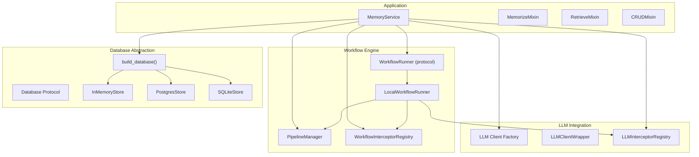

**Diagram sources**
- [src/memu/app/service.py](file://src/memu/app/service.py#L49-L95)
- [src/memu/workflow/pipeline.py](file://src/memu/workflow/pipeline.py#L21-L49)
- [src/memu/workflow/runner.py](file://src/memu/workflow/runner.py#L12-L39)
- [src/memu/workflow/interceptor.py](file://src/memu/workflow/interceptor.py#L56-L143)
- [src/memu/database/factory.py](file://src/memu/database/factory.py#L15-L43)
- [src/memu/database/interfaces.py](file://src/memu/database/interfaces.py#L12-L26)
- [src/memu/database/inmemory/__init__.py](file://src/memu/database/inmemory/__init__.py#L10-L22)
- [src/memu/database/postgres/postgres.py](file://src/memu/database/postgres/postgres.py#L23-L103)
- [src/memu/database/sqlite/sqlite.py](file://src/memu/database/sqlite/sqlite.py#L25-L145)
- [src/memu/llm/wrapper.py](file://src/memu/llm/wrapper.py#L226-L448)

**Section sources**
- [src/memu/app/service.py](file://src/memu/app/service.py#L49-L95)
- [src/memu/workflow/pipeline.py](file://src/memu/workflow/pipeline.py#L21-L49)
- [src/memu/workflow/runner.py](file://src/memu/workflow/runner.py#L12-L39)
- [src/memu/database/factory.py](file://src/memu/database/factory.py#L15-L43)
- [src/memu/database/interfaces.py](file://src/memu/database/interfaces.py#L12-L26)
- [src/memu/llm/wrapper.py](file://src/memu/llm/wrapper.py#L226-L448)

## Core Components
- MemoryService as composition root:
  - Initializes typed configurations, builds the database backend, sets up filesystem, LLM client cache and wrappers, workflow runner, and registers pipelines.
  - Provides interceptors for LLM calls and workflow steps.
  - Exposes public APIs via mixins: memorize, retrieve, and CRUD operations.
- PipelineManager:
  - Manages pipeline definitions with validation of step dependencies, capabilities, and initial state keys.
  - Supports runtime mutation (configure, insert, replace, remove steps) and revisioning.
- WorkflowRunner:
  - Pluggable protocol with default LocalWorkflowRunner executing steps sequentially.
  - Extensible via registration for external runners (Temporal, Burr).
- Database abstraction:
  - Factory selects backend by provider; Database protocol defines repositories and state accessors.
  - Backends: in-memory, SQLite, PostgreSQL (with optional pgvector).
- LLM client wrapper system:
  - LLMClientWrapper wraps underlying clients and exposes chat, summarize, vision, embed, transcribe.
  - Interceptors capture pre/post/on_error hooks with filtering and prioritization.
- Interceptor registries:
  - WorkflowInterceptorRegistry: ordered before/after/on_error hooks around each step.
  - LLMInterceptorRegistry: ordered before/after/on_error hooks around LLM calls with filters.

**Section sources**
- [src/memu/app/service.py](file://src/memu/app/service.py#L49-L95)
- [src/memu/workflow/pipeline.py](file://src/memu/workflow/pipeline.py#L21-L171)
- [src/memu/workflow/runner.py](file://src/memu/workflow/runner.py#L12-L82)
- [src/memu/database/factory.py](file://src/memu/database/factory.py#L15-L43)
- [src/memu/database/interfaces.py](file://src/memu/database/interfaces.py#L12-L26)
- [src/memu/llm/wrapper.py](file://src/memu/llm/wrapper.py#L128-L246)
- [src/memu/workflow/interceptor.py](file://src/memu/workflow/interceptor.py#L56-L165)

## Architecture Overview
The system follows a pipeline-based architecture where operations are modeled as sequences of steps with explicit contracts (requires/produces state keys) and capability tags. MemoryService composes subsystems and orchestrates execution through a runner while enabling interception and observability.

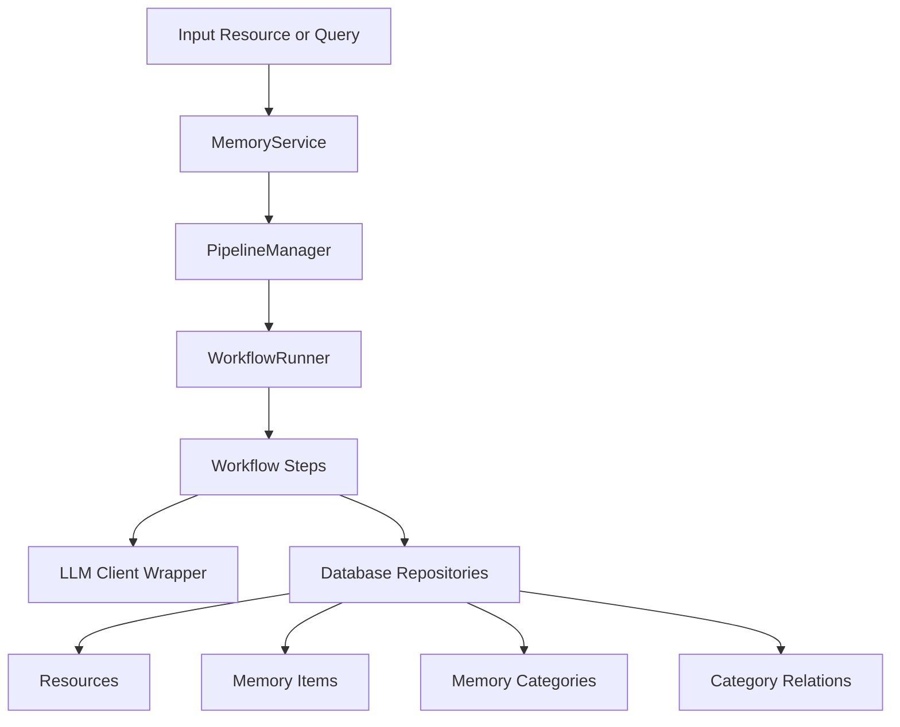

**Diagram sources**
- [docs/architecture.md](file://docs/architecture.md#L20-L30)
- [src/memu/app/service.py](file://src/memu/app/service.py#L315-L360)
- [src/memu/workflow/pipeline.py](file://src/memu/workflow/pipeline.py#L47-L49)
- [src/memu/workflow/runner.py](file://src/memu/workflow/runner.py#L28-L39)
- [src/memu/database/interfaces.py](file://src/memu/database/interfaces.py#L12-L26)

## Detailed Component Analysis

### MemoryService Orchestration
MemoryService initializes and owns:
- Typed configurations for LLM profiles, database, memorize/retrieve behavior, and user scope.
- Storage backend via build_database().
- Filesystem for resource ingestion.
- LLM client cache and wrappers with interceptors.
- Workflow runner and pipeline manager.
- Registers multiple pipelines for memorize, retrieve (RAG/LLM), and CRUD operations.

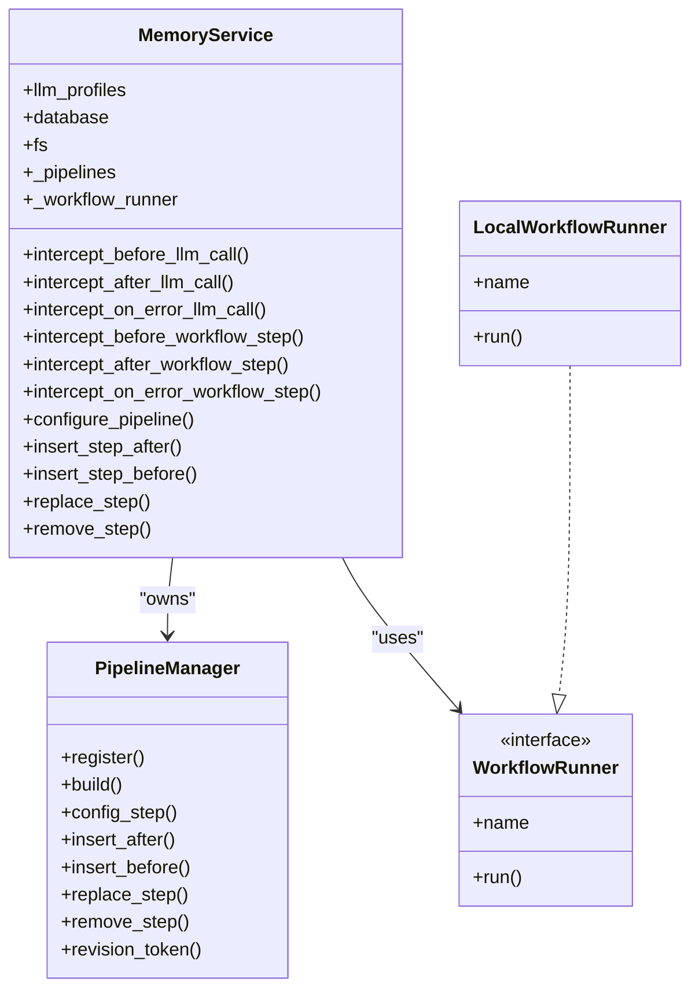

**Diagram sources**
- [src/memu/app/service.py](file://src/memu/app/service.py#L49-L95)
- [src/memu/workflow/pipeline.py](file://src/memu/workflow/pipeline.py#L21-L171)
- [src/memu/workflow/runner.py](file://src/memu/workflow/runner.py#L12-L39)

**Section sources**
- [src/memu/app/service.py](file://src/memu/app/service.py#L49-L95)
- [src/memu/workflow/pipeline.py](file://src/memu/workflow/pipeline.py#L21-L171)
- [src/memu/workflow/runner.py](file://src/memu/workflow/runner.py#L12-L82)

### Pipeline-Based Workflow Engine
- Step contracts:
  - requires: state keys needed by the step
  - produces: state keys emitted by the step
  - capabilities: tags indicating llm, vector, db, io, vision
  - config: per-step profile selection for chat/embed
- Validation:
  - Duplicate step IDs
  - Unknown capabilities
  - Unknown LLM profiles
  - Missing required state keys
- Mutation and revisioning:
  - Runtime editing of registered pipelines with revision tracking

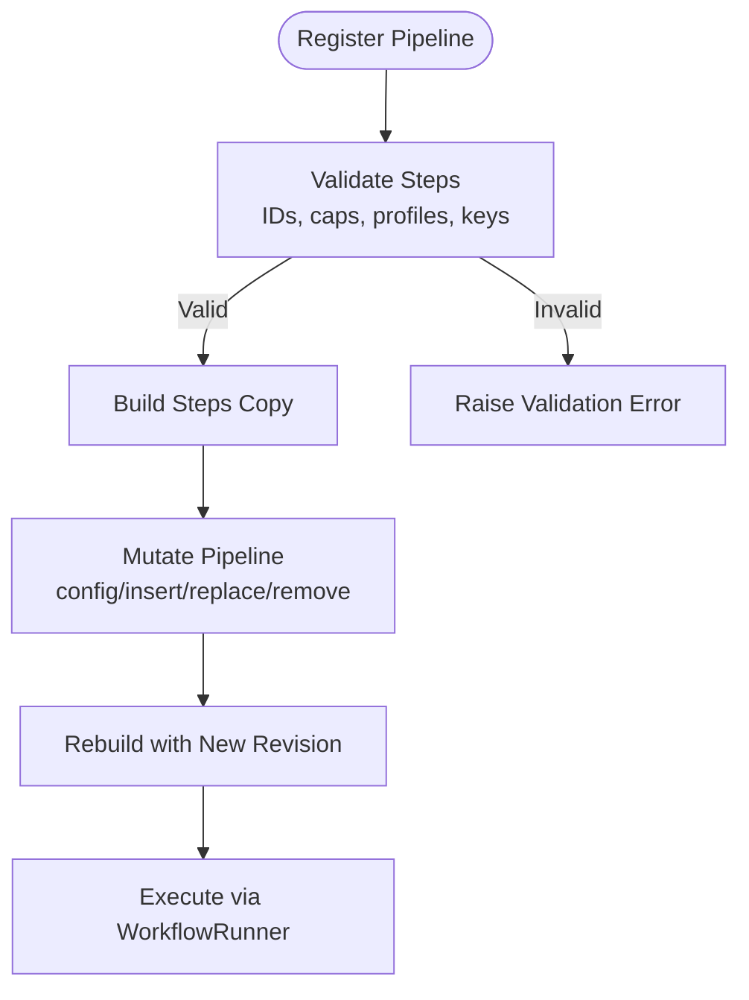

**Diagram sources**
- [src/memu/workflow/pipeline.py](file://src/memu/workflow/pipeline.py#L131-L171)

**Section sources**
- [src/memu/workflow/pipeline.py](file://src/memu/workflow/pipeline.py#L21-L171)

### Database Abstraction and Factory Pattern
- Factory function build_database selects backend by provider:
  - inmemory, postgres, sqlite
- Database protocol defines repositories and state accessors
- Backends:
  - InMemoryStore: in-process state
  - PostgresStore: SQLAlchemy-backed with optional pgvector
  - SQLiteStore: SQLModel-backed, brute-force vector search

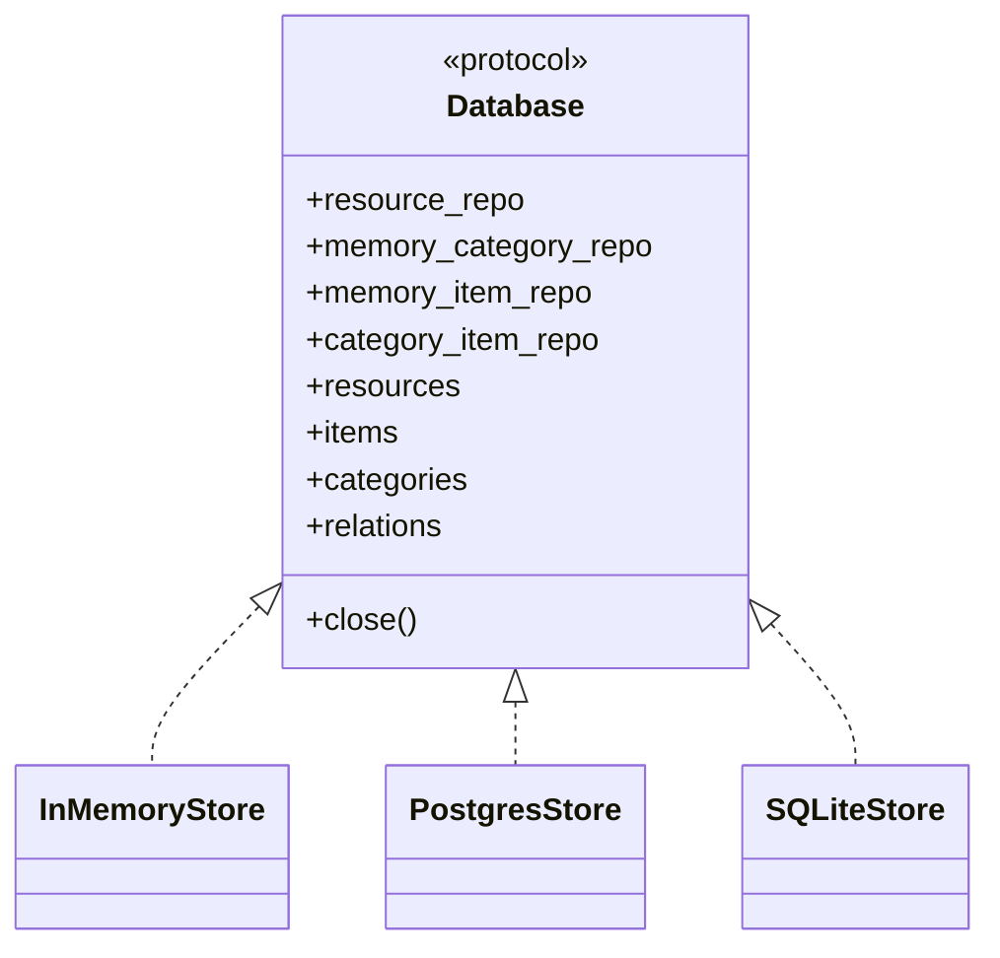

**Diagram sources**
- [src/memu/database/interfaces.py](file://src/memu/database/interfaces.py#L12-L26)
- [src/memu/database/inmemory/__init__.py](file://src/memu/database/inmemory/__init__.py#L10-L22)
- [src/memu/database/postgres/postgres.py](file://src/memu/database/postgres/postgres.py#L23-L103)
- [src/memu/database/sqlite/sqlite.py](file://src/memu/database/sqlite/sqlite.py#L25-L145)

**Section sources**
- [src/memu/database/factory.py](file://src/memu/database/factory.py#L15-L43)
- [src/memu/database/interfaces.py](file://src/memu/database/interfaces.py#L12-L26)
- [src/memu/database/inmemory/__init__.py](file://src/memu/database/inmemory/__init__.py#L10-L22)
- [src/memu/database/postgres/postgres.py](file://src/memu/database/postgres/postgres.py#L23-L103)
- [src/memu/database/sqlite/sqlite.py](file://src/memu/database/sqlite/sqlite.py#L25-L145)

### LLM Client Wrapper and Interceptor System
- LLMClientWrapper:
  - Wraps underlying clients and exposes chat, summarize, vision, embed, transcribe
  - Builds call context and usage metadata
  - Executes before/after/on_error interceptors
- LLMInterceptorRegistry:
  - Ordered by priority and insertion order
  - Filters by operations, step_ids, providers, models, statuses
- WorkflowInterceptorRegistry:
  - Ordered before/after/on_error around each step
  - Strict mode controls exception propagation

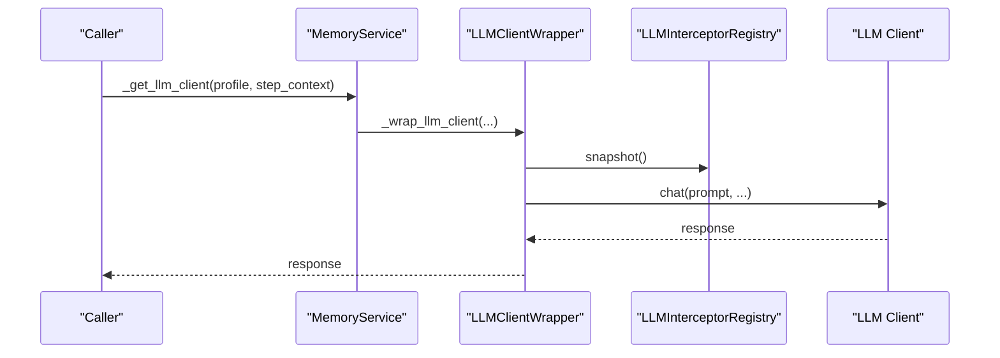

**Diagram sources**
- [src/memu/app/service.py](file://src/memu/app/service.py#L168-L189)
- [src/memu/llm/wrapper.py](file://src/memu/llm/wrapper.py#L226-L448)
- [src/memu/workflow/interceptor.py](file://src/memu/workflow/interceptor.py#L163-L202)

**Section sources**
- [src/memu/llm/wrapper.py](file://src/memu/llm/wrapper.py#L128-L246)
- [src/memu/llm/wrapper.py](file://src/memu/llm/wrapper.py#L226-L448)
- [src/memu/workflow/interceptor.py](file://src/memu/workflow/interceptor.py#L56-L165)

### Repository Pattern for Data Access
- Database protocol centralizes repository accessors and state caches.
- Each backend implements repositories for resources, memory items, categories, and relations.
- Mixins (MemorizeMixin, RetrieveMixin, CRUDMixin) operate on the Database interface, ensuring consistent data access across backends.

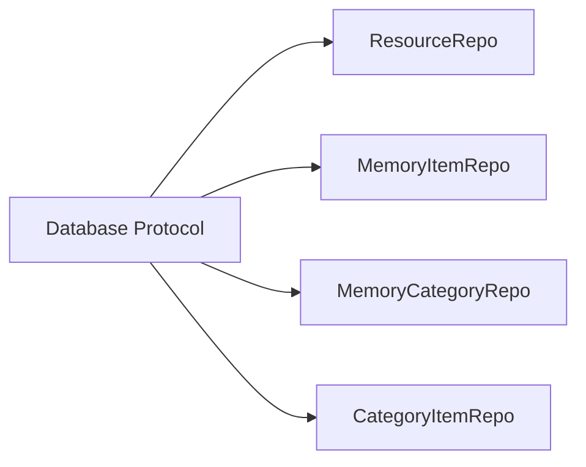

**Diagram sources**
- [src/memu/database/interfaces.py](file://src/memu/database/interfaces.py#L12-L26)

**Section sources**
- [src/memu/database/interfaces.py](file://src/memu/database/interfaces.py#L12-L26)

### Pluggable Storage Backends and LLM Providers
- Storage backends:
  - inmemory: default, no persistence
  - sqlite: portable, JSON embeddings, brute-force vector search
  - postgres: SQLModel-backed, optional pgvector extension
- LLM providers:
  - sdk: official OpenAI SDK
  - httpx: provider-adapted HTTP client (OpenAI, Doubao, Grok, OpenRouter)
  - lazyllm_backend: adapter for multiple sources (Qwen, Doubao, etc.)

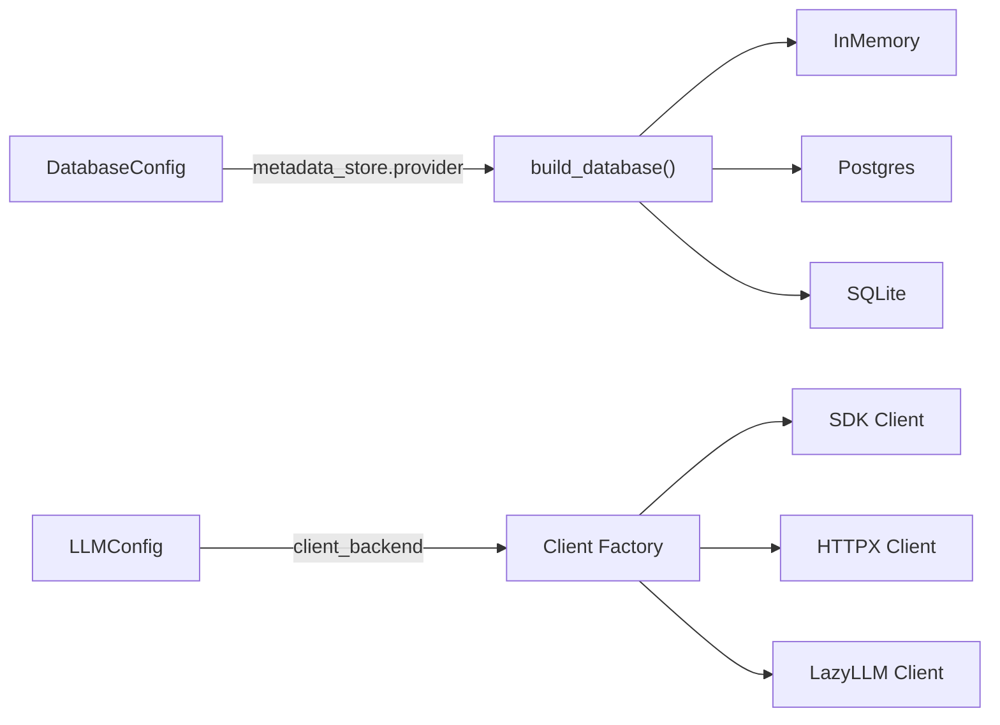

**Diagram sources**
- [src/memu/database/factory.py](file://src/memu/database/factory.py#L15-L43)
- [src/memu/app/settings.py](file://src/memu/app/settings.py#L102-L127)
- [src/memu/app/service.py](file://src/memu/app/service.py#L97-L135)

**Section sources**
- [src/memu/database/factory.py](file://src/memu/database/factory.py#L15-L43)
- [src/memu/app/settings.py](file://src/memu/app/settings.py#L102-L127)
- [src/memu/app/service.py](file://src/memu/app/service.py#L97-L135)

### Observer Pattern and Interceptor Registries
- WorkflowInterceptorRegistry:
  - Ordered execution around each step
  - Strict mode controls error propagation
- LLMInterceptorRegistry:
  - Priority and insertion-order sorting
  - Filter-based targeting by operation, step_id, provider, model, status
- Both registries support snapshotting and disposal handles

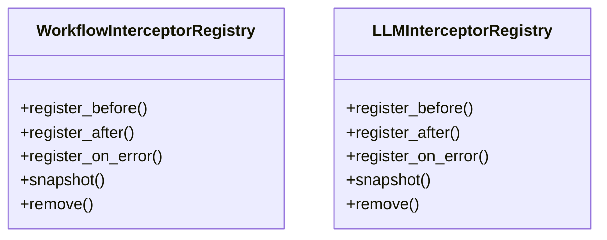

**Diagram sources**
- [src/memu/workflow/interceptor.py](file://src/memu/workflow/interceptor.py#L56-L165)
- [src/memu/llm/wrapper.py](file://src/memu/llm/wrapper.py#L128-L224)

**Section sources**
- [src/memu/workflow/interceptor.py](file://src/memu/workflow/interceptor.py#L56-L165)
- [src/memu/llm/wrapper.py](file://src/memu/llm/wrapper.py#L128-L224)

### System Context Diagrams
- MemoryService orchestrates workflow engine, database abstraction, and LLM integration.
- Retrieval and memorize pipelines demonstrate staged processing with capability tags and profile routing.

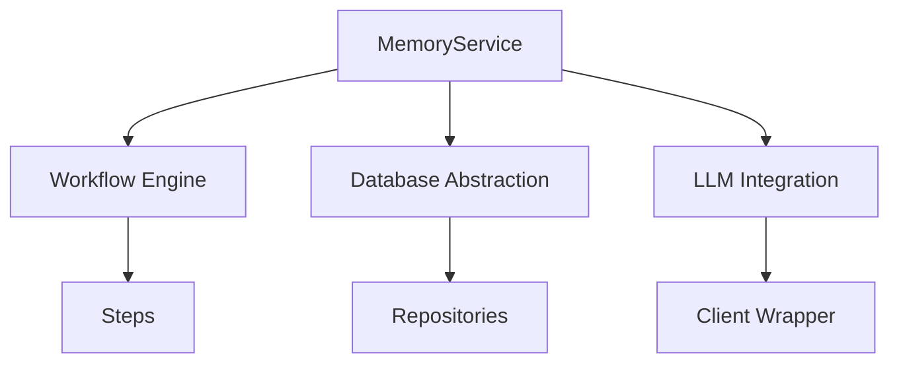

**Diagram sources**
- [docs/architecture.md](file://docs/architecture.md#L20-L30)
- [src/memu/app/service.py](file://src/memu/app/service.py#L315-L360)

**Section sources**
- [docs/architecture.md](file://docs/architecture.md#L9-L30)

## Dependency Analysis
- Composition root: MemoryService depends on:
  - PipelineManager for workflow definitions
  - WorkflowRunner for execution
  - Database factory for storage backend
  - LLM client factory and wrapper for LLM access
  - Interceptor registries for observability
- Backends depend on shared repository interfaces and state containers
- LLM wrapper depends on interceptor registries and call metadata builders

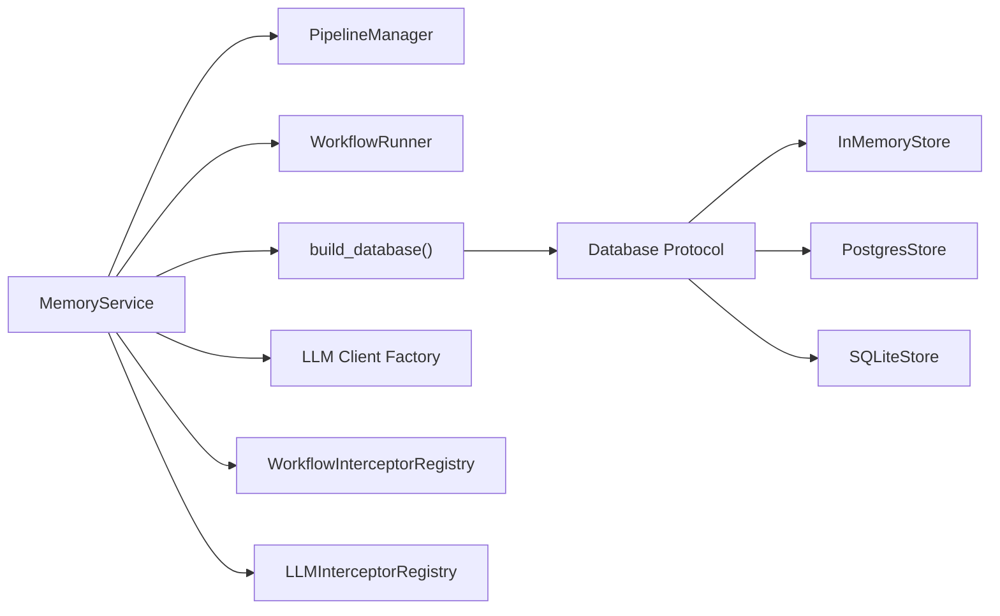

**Diagram sources**
- [src/memu/app/service.py](file://src/memu/app/service.py#L49-L95)
- [src/memu/database/factory.py](file://src/memu/database/factory.py#L15-L43)
- [src/memu/database/interfaces.py](file://src/memu/database/interfaces.py#L12-L26)

**Section sources**
- [src/memu/app/service.py](file://src/memu/app/service.py#L49-L95)
- [src/memu/database/factory.py](file://src/memu/database/factory.py#L15-L43)
- [src/memu/database/interfaces.py](file://src/memu/database/interfaces.py#L12-L26)

## Performance Considerations
- Vector search scalability:
  - SQLite and in-memory backends use brute-force cosine similarity; not optimal for large-scale vector indexing.
  - PostgreSQL with pgvector enables native vector operations and scaling.
- Embedding throughput:
  - Batch sizes configurable per LLM client backend.
- Asynchronous execution:
  - Workflow steps and LLM calls are asynchronous; ensure proper concurrency limits and resource pooling.
- Caching and lazy initialization:
  - LLM clients are cached per profile; filesystem resources cached locally during ingestion.
- Observability overhead:
  - Interceptors add minimal overhead; strict mode disables exception suppression.

[No sources needed since this section provides general guidance]

## Troubleshooting Guide
- Pipeline validation errors:
  - Missing required state keys or unknown step IDs during mutation
  - Unknown capabilities or LLM profiles
- Database backend issues:
  - PostgreSQL requires pgvector extension when enabled; ensure DSN and permissions
  - SQLite tables created on demand; verify file path and permissions
- LLM provider misconfiguration:
  - Ensure provider defaults are applied when switching providers (e.g., Grok defaults)
  - Verify endpoint overrides and model names
- Interceptor failures:
  - Strict mode propagates exceptions; otherwise logs failures and continues
  - Use snapshotting to isolate interceptor state during debugging

**Section sources**
- [src/memu/workflow/pipeline.py](file://src/memu/workflow/pipeline.py#L131-L171)
- [src/memu/database/postgres/postgres.py](file://src/memu/database/postgres/postgres.py#L57-L57)
- [src/memu/app/settings.py](file://src/memu/app/settings.py#L128-L138)
- [src/memu/workflow/interceptor.py](file://src/memu/workflow/interceptor.py#L215-L218)

## Conclusion
The memU architecture demonstrates a modular, pipeline-driven system with strong separation of concerns. MemoryService acts as the composition root, coordinating workflow execution, database abstraction, and LLM integration through factories and protocols. The interceptor registries provide robust observability and extensibility. While current backends favor portability and simplicity, production deployments should leverage PostgreSQL with pgvector for scalable vector operations and tune LLM client batching and concurrency for performance.