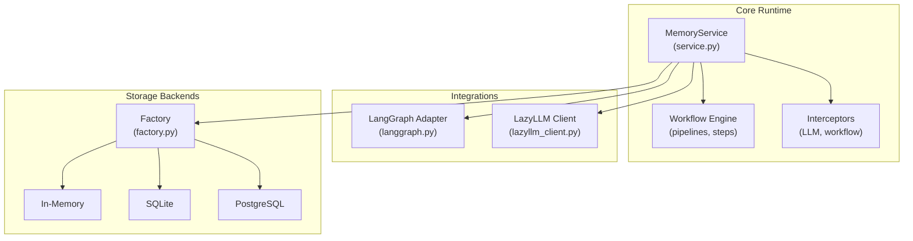
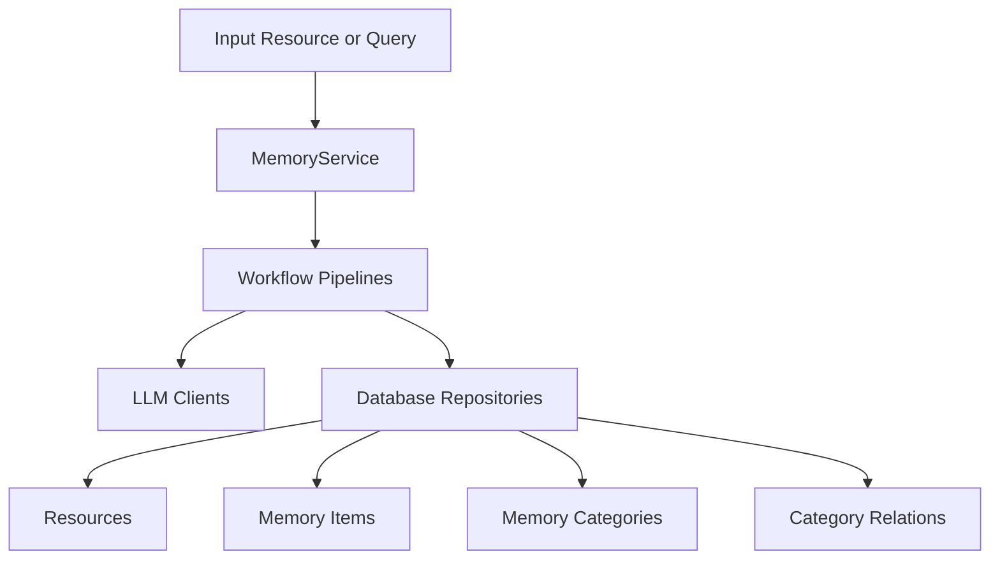
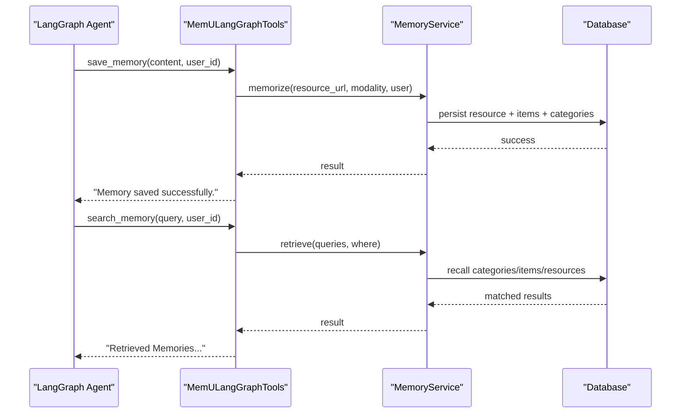
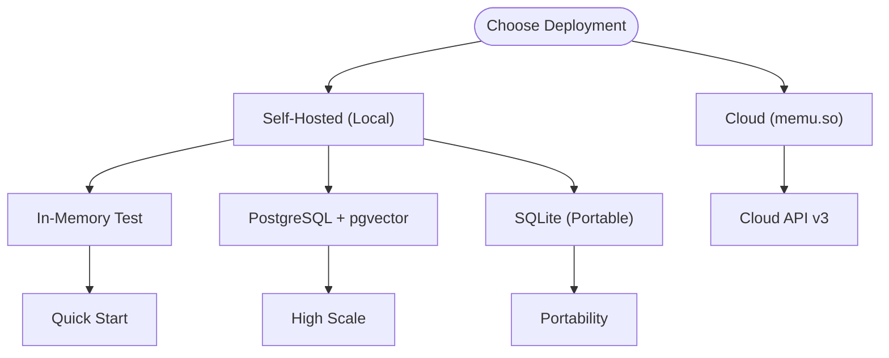
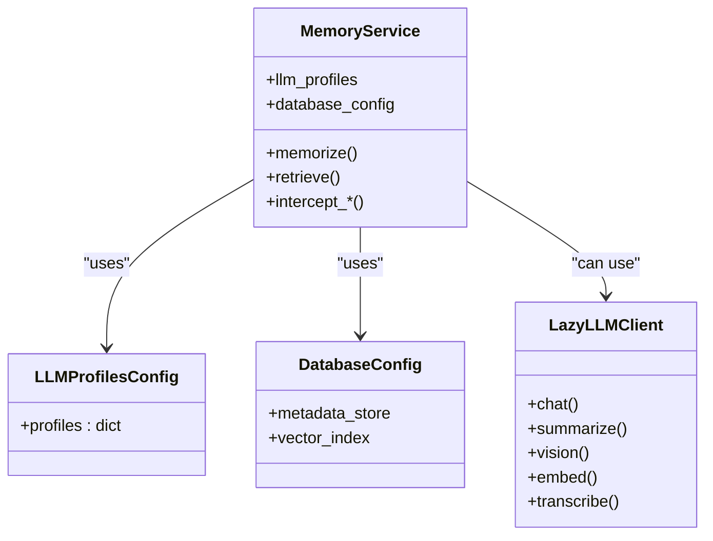
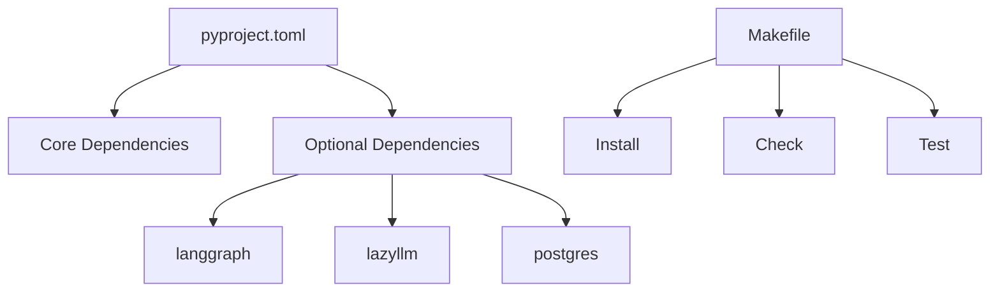

# Ecosystem Overview

<cite>
**Referenced Files in This Document**
- [README.md](file://README.md)
- [architecture.md](file://docs/architecture.md)
- [langgraph_integration.md](file://docs/langgraph_integration.md)
- [sqlite.md](file://docs/sqlite.md)
- [sealos-devbox-guide.md](file://docs/sealos-devbox-guide.md)
- [pyproject.toml](file://pyproject.toml)
- [Makefile](file://Makefile)
- [service.py](file://src/memu/app/service.py)
- [factory.py](file://src/memu/database/factory.py)
- [langgraph.py](file://src/memu/integrations/langgraph.py)
- [lazyllm_client.py](file://src/memu/llm/lazyllm_client.py)
- [grok.md](file://docs/providers/grok.md)
- [example_5_with_lazyllm_client.py](file://examples/example_5_with_lazyllm_client.py)
- [langgraph_demo.py](file://examples/langgraph_demo.py)
- [CONTRIBUTING.md](file://CONTRIBUTING.md)
</cite>

## Table of Contents
1. [Introduction](#introduction)
2. [Project Structure](#project-structure)
3. [Core Components](#core-components)
4. [Architecture Overview](#architecture-overview)
5. [Detailed Component Analysis](#detailed-component-analysis)
6. [Dependency Analysis](#dependency-analysis)
7. [Performance Considerations](#performance-considerations)
8. [Troubleshooting Guide](#troubleshooting-guide)
9. [Conclusion](#conclusion)
10. [Appendices](#appendices)

## Introduction
This document presents the memU ecosystem overview, explaining how memU, memU-server, and memU-ui collaborate to deliver a complete proactive memory solution. It also covers integrations with external systems such as LazyLLM, LangGraph, OpenAgents, and other AI frameworks, along with partner integrations including TEN Framework, Milvus, xRoute, and others. The document outlines cloud service offerings, API endpoints, and deployment options (self-hosted versus cloud), as well as extensibility points for custom LLM providers, embedding backends, and storage systems. Finally, it provides guidance on choosing deployment strategies and integration patterns, and highlights roadmap priorities, community involvement, and contribution opportunities.

## Project Structure
The memU repository is organized around a core Python package that implements the proactive memory runtime, alongside documentation, examples, and deployment guides. Key areas include:
- Core runtime and orchestration in the memu package
- Integrations with AI frameworks (LangGraph, LazyLLM)
- Storage backends (in-memory, SQLite, PostgreSQL)
- Cloud and self-hosted deployment guides
- Provider configurations and examples

**Diagram sources**
- [service.py](file://src/memu/app/service.py#L49-L95)
- [factory.py](file://src/memu/database/factory.py#L15-L43)
- [langgraph.py](file://src/memu/integrations/langgraph.py#L53-L71)
- [lazyllm_client.py](file://src/memu/llm/lazyllm_client.py#L9-L34)

**Section sources**
- [architecture.md](file://docs/architecture.md#L9-L30)
- [pyproject.toml](file://pyproject.toml#L1-L31)

## Core Components
- MemoryService: Composition root that orchestrates ingestion, retrieval, and CRUD operations across three memory layers: Resource, MemoryItem, and MemoryCategory. It manages LLM clients, workflow pipelines, interceptors, and storage backends.
- Workflow Engine: A staged pipeline system with explicit step contracts and capability tags, enabling modular and configurable processing.
- Storage Factory: Pluggable database backends (in-memory, SQLite, PostgreSQL) with vector index strategies.
- Integrations: LangGraph adapter exposing MemU’s memory capabilities as tools; LazyLLM client for provider-agnostic LLM and embedding access.

**Section sources**
- [service.py](file://src/memu/app/service.py#L49-L95)
- [factory.py](file://src/memu/database/factory.py#L15-L43)
- [architecture.md](file://docs/architecture.md#L52-L71)

## Architecture Overview
The memU architecture implements a layered memory system with three persistent layers and a workflow-driven ingestion and retrieval engine. The runtime integrates with LLM providers and storage backends through configurable profiles and clients.

**Diagram sources**
- [architecture.md](file://docs/architecture.md#L20-L30)
- [service.py](file://src/memu/app/service.py#L315-L348)

**Section sources**
- [architecture.md](file://docs/architecture.md#L9-L30)
- [service.py](file://src/memu/app/service.py#L315-L348)

## Detailed Component Analysis

### memU, memU-server, and memU-ui Ecosystem
- memU: Core proactive memory engine with continuous learning, auto-categorization, and dual-mode retrieval (RAG and LLM-driven).
- memU-server: Backend service that synchronizes memory continuously and supports webhooks for real-time updates.
- memU-ui: Visual dashboard for monitoring memory evolution and managing proactive contexts.

These components work together to provide a complete proactive memory solution: memU powers the core engine, memU-server ensures continuous synchronization, and memU-ui offers operational visibility.

**Section sources**
- [README.md](file://README.md#L558-L570)

### Integrations with AI Frameworks
- LangGraph Integration: Exposes MemU as LangGraph/LangChain tools for saving and searching memories. Provides structured tools compatible with ToolNode and agents.
- LazyLLM Integration: Enables using LazyLLM as a backend for LLM, vision-language, embeddings, and speech-to-text operations, with a unified client wrapper.

**Diagram sources**
- [langgraph.py](file://src/memu/integrations/langgraph.py#L73-L111)
- [langgraph.py](file://src/memu/integrations/langgraph.py#L113-L163)
- [service.py](file://src/memu/app/service.py#L350-L360)

**Section sources**
- [langgraph_integration.md](file://docs/langgraph_integration.md#L1-L98)
- [langgraph.py](file://src/memu/integrations/langgraph.py#L53-L163)
- [langgraph_demo.py](file://examples/langgraph_demo.py#L1-L77)

### Partner Integrations and Ecosystem Players
- TEN Framework, OpenAgents, Milvus, xRoute, Buddie, Bytebase, LazyLLM, Clawdchat, and others are highlighted as partners, indicating collaborative integrations and ecosystem participation.

**Section sources**
- [README.md](file://README.md#L573-L586)

### Cloud Services, API Endpoints, and Deployment Options
- Cloud API (v3): Base URL, authentication, and endpoints for continuous learning and retrieval.
- Self-hosted options: Installation via pip, in-memory and PostgreSQL-backed tests, and SQLite configuration for lightweight deployments.
- Deployment guides: One-click deployment on Sealos DevBox with FastAPI, including environment configuration and production deployment steps.

**Diagram sources**
- [README.md](file://README.md#L259-L273)
- [README.md](file://README.md#L276-L317)
- [sqlite.md](file://docs/sqlite.md#L1-L231)
- [sealos-devbox-guide.md](file://docs/sealos-devbox-guide.md#L1-L411)

**Section sources**
- [README.md](file://README.md#L259-L273)
- [README.md](file://README.md#L276-L317)
- [sqlite.md](file://docs/sqlite.md#L1-L231)
- [sealos-devbox-guide.md](file://docs/sealos-devbox-guide.md#L1-L411)

### Extensibility Points
- LLM Providers: Profile-based configuration supporting SDK, HTTP, and LazyLLM backends; examples include OpenAI, Doubao, Grok, OpenRouter, and others.
- Embedding Backends: Configurable embedding models and batch sizes; supports provider-specific HTTP adapters.
- Storage Systems: Pluggable metadata stores (in-memory, SQLite, PostgreSQL) with vector index strategies; migration and schema support included.
- Interceptors: LLM call and workflow step interceptors for observability and customization.

**Diagram sources**
- [service.py](file://src/memu/app/service.py#L50-L95)
- [service.py](file://src/memu/app/service.py#L120-L132)
- [lazyllm_client.py](file://src/memu/llm/lazyllm_client.py#L9-L160)

**Section sources**
- [service.py](file://src/memu/app/service.py#L101-L132)
- [factory.py](file://src/memu/database/factory.py#L15-L43)
- [grok.md](file://docs/providers/grok.md#L1-L67)
- [example_5_with_lazyllm_client.py](file://examples/example_5_with_lazyllm_client.py#L224-L241)

### Roadmap, Community, and Contributions
- Current priorities include multi-modal support, performance optimization, and additional LLM provider integrations.
- Community channels include Discord, GitHub Discussions, and Issues.
- Contribution process includes development setup, code style, testing, and PR guidelines.

**Section sources**
- [CONTRIBUTING.md](file://CONTRIBUTING.md#L158-L170)
- [CONTRIBUTING.md](file://CONTRIBUTING.md#L223-L231)
- [README.md](file://README.md#L591-L642)

## Dependency Analysis
The project defines core and optional dependencies, including LangGraph, LazyLLM, and PostgreSQL extras. The Makefile automates environment setup, checks, and testing.

**Diagram sources**
- [pyproject.toml](file://pyproject.toml#L20-L31)
- [pyproject.toml](file://pyproject.toml#L69-L72)
- [Makefile](file://Makefile#L1-L23)

**Section sources**
- [pyproject.toml](file://pyproject.toml#L20-L31)
- [pyproject.toml](file://pyproject.toml#L69-L72)
- [Makefile](file://Makefile#L1-L23)

## Performance Considerations
- SQLite uses brute-force vector search; suitable for moderate datasets but may be slow for larger ones.
- PostgreSQL with pgvector provides indexed vector search for high-scale deployments.
- Choosing the appropriate storage backend depends on concurrency, scale, and deployment constraints.

**Section sources**
- [sqlite.md](file://docs/sqlite.md#L70-L89)
- [sqlite.md](file://docs/sqlite.md#L156-L165)

## Troubleshooting Guide
- LangGraph Integration: Ensure optional dependencies are installed; verify virtual environment activation.
- SQLite Locked Errors: Single-writer limitation; consider PostgreSQL for concurrent access.
- Provider Configuration: Validate API keys and model names; consult provider-specific guides.

**Section sources**
- [langgraph_integration.md](file://docs/langgraph_integration.md#L92-L98)
- [sqlite.md](file://docs/sqlite.md#L206-L231)
- [grok.md](file://docs/providers/grok.md#L51-L67)

## Conclusion
The memU ecosystem delivers a cohesive proactive memory solution through its core runtime, integrations, and deployment flexibility. By leveraging pluggable LLM providers, embedding backends, and storage systems, teams can tailor memU to diverse environments—from lightweight local setups to production-grade cloud deployments. Strategic integrations with AI frameworks and ecosystem partners further expand its applicability, while clear contribution pathways and community resources support continued innovation.

## Appendices
- Deployment Strategy Guidance:
  - For rapid prototyping and demos: use in-memory or SQLite backends with minimal setup.
  - For production with persistence and scalability: choose PostgreSQL with pgvector and containerized deployment.
  - For managed cloud: use the hosted API for immediate access without infrastructure concerns.
- Integration Pattern Guidance:
  - Use LangGraph tools for agent-centric workflows requiring memory-aware actions.
  - Use LazyLLM client for unified access to multiple providers and modalities.
  - Combine memU-server for continuous synchronization and memU-ui for operational oversight.

[No sources needed since this section provides general guidance]