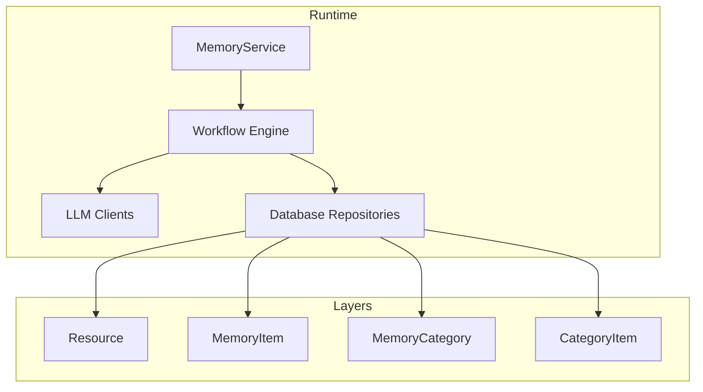
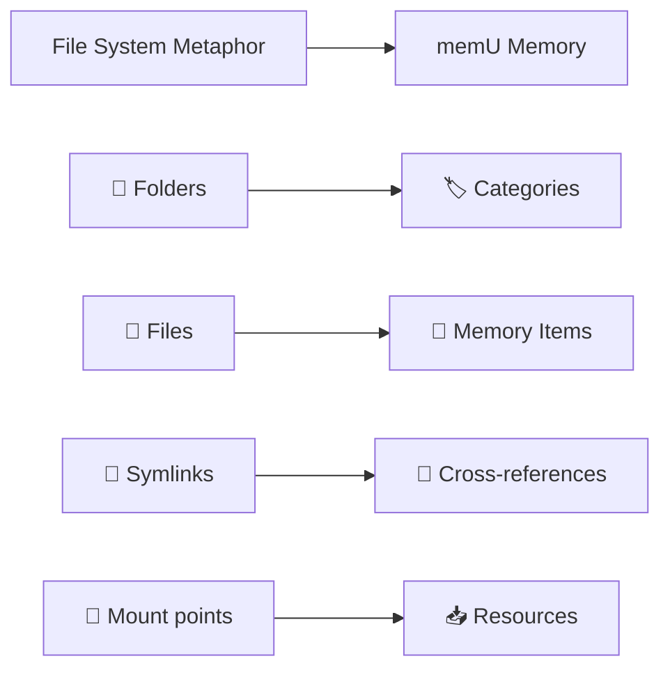
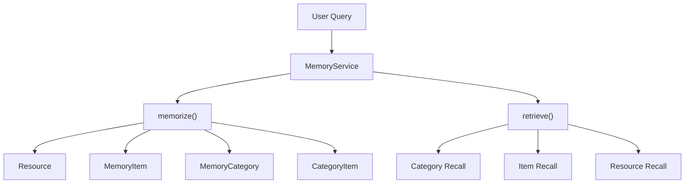
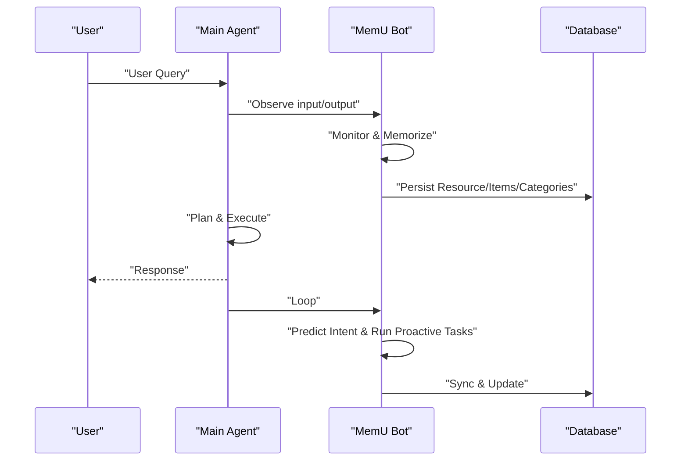
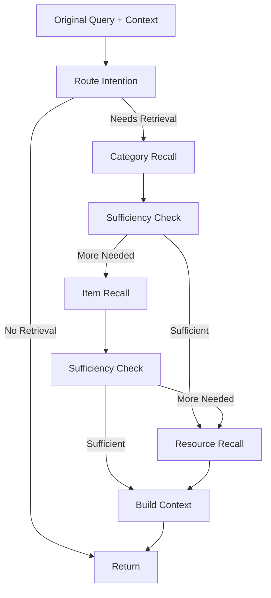
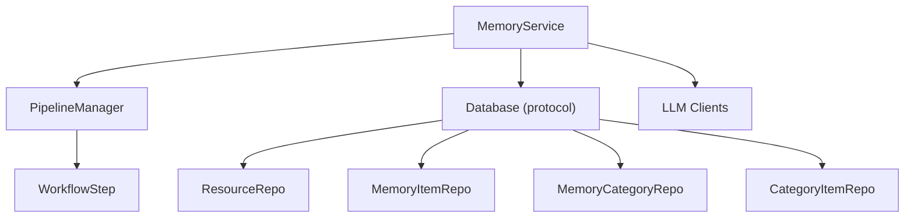

# Introduction and Core Concepts

<cite>
**Referenced Files in This Document**
- [README_en.md](file://readme/README_en.md)
- [architecture.md](file://docs/architecture.md)
- [service.py](file://src/memu/app/service.py)
- [memorize.py](file://src/memu/app/memorize.py)
- [retrieve.py](file://src/memu/app/retrieve.py)
- [models.py](file://src/memu/database/models.py)
- [interfaces.py](file://src/memu/database/interfaces.py)
- [pipeline.py](file://src/memu/workflow/pipeline.py)
- [example_1_conversation_memory.py](file://examples/example_1_conversation_memory.py)
- [example_2_skill_extraction.py](file://examples/example_2_skill_extraction.py)
- [example_3_multimodal_memory.py](file://examples/example_3_multimodal_memory.py)
- [proactive.py](file://examples/proactive/proactive.py)
</cite>

## Table of Contents
1. [Introduction](#introduction)
2. [Project Structure](#project-structure)
3. [Core Components](#core-components)
4. [Architecture Overview](#architecture-overview)
5. [Detailed Component Analysis](#detailed-component-analysis)
6. [Dependency Analysis](#dependency-analysis)
7. [Performance Considerations](#performance-considerations)
8. [Troubleshooting Guide](#troubleshooting-guide)
9. [Conclusion](#conclusion)

## Introduction
This document introduces memU’s paradigm shift from traditional memory systems to “memory as file system.” It explains how proactive intelligence enables 24/7 continuous learning without explicit memory commands, and how the three-layer memory architecture (Resource, Item, Category) powers both reactive queries and proactive context loading. Practical examples illustrate always-on assistants, self-improving agents, and multimodal context builders, while the technical details describe the dual-mode retrieval system and the underlying workflow engine.

## Project Structure
At a high level, memU organizes memory as a hierarchical, persistent system:
- Resource: raw source artifacts (conversation, document, image, video, audio)
- MemoryItem: extracted atomic memories with embeddings
- MemoryCategory: grouped topic summaries
- CategoryItem: item-to-category relations

The runtime is orchestrated by MemoryService, which composes LLM clients, storage backends, and workflow pipelines. Retrieval supports two modes: embedding-driven RAG and LLM-driven ranking, enabling fast context assembly or deep anticipatory reasoning.

**Diagram sources**
- [architecture.md](file://docs/architecture.md#L20-L30)
- [service.py](file://src/memu/app/service.py#L49-L95)

**Section sources**
- [architecture.md](file://docs/architecture.md#L11-L30)
- [README_en.md](file://readme/README_en.md#L41-L76)

## Core Components
- MemoryService: Composition root that builds and owns LLM profiles, storage backends, workflow pipelines, and public APIs (memorize, retrieve, CRUD).
- Workflow engine: PipelineManager registers and revises pipelines; WorkflowRunner executes steps with capability tags and profile routing.
- Retrieval: Two retrieval pipelines (RAG and LLM) share a staged pattern with sufficiency checks and early termination.
- Data model: Typed records for Resource, MemoryItem, MemoryCategory, and CategoryItem, with user scope merged into models for consistent filtering.

Key capabilities:
- Continuous learning via memorize() with multimodal preprocessing and structured extraction
- Dual-mode retrieval supporting proactive context loading and reactive querying
- Proactive context assembly with category/item/resource recall and sufficiency checks
- Pluggable storage backends (in-memory, SQLite, PostgreSQL/pgvector)

**Section sources**
- [service.py](file://src/memu/app/service.py#L49-L95)
- [memorize.py](file://src/memu/app/memorize.py#L65-L95)
- [retrieve.py](file://src/memu/app/retrieve.py#L42-L85)
- [models.py](file://src/memu/database/models.py#L68-L106)
- [interfaces.py](file://src/memu/database/interfaces.py#L12-L26)
- [architecture.md](file://docs/architecture.md#L34-L51)

## Architecture Overview
The “memory as file system” metaphor maps:
- Folders → Categories (auto-organized topics)
- Files → Memory Items (facts, preferences, skills)
- Symlinks → Cross-references (related memories)
- Mount points → Resources (conversations, documents, images)

This structure enables instant navigation, mounting new knowledge, cross-linking memories, and persistent portability.

**Diagram sources**
- [README_en.md](file://readme/README_en.md#L45-L56)

**Section sources**
- [README_en.md](file://readme/README_en.md#L41-L76)

## Detailed Component Analysis

### Paradigm Shift: Memory as File System
- Reactive navigation: drill down from broad categories to specific items, mirroring directory traversal.
- Proactive ingestion: mount new knowledge (documents, conversations, media) and immediately make them queryable.
- Cross-linking: build a connected knowledge graph by linking items and categories.
- Persistence: export, backup, and transfer memory like files.

Benefits:
- Intuitive mental model for organizing and retrieving knowledge
- Instant access patterns akin to file system navigation
- Seamless integration of heterogeneous inputs (text, images, videos, audio)

**Section sources**
- [README_en.md](file://readme/README_en.md#L41-L76)

### Three-Layer Memory Architecture
- Resource layer: raw artifacts with optional captions and embeddings
- Item layer: atomic memories with embeddings and metadata
- Category layer: topic summaries that auto-update and drive proactive context

Reactive vs. proactive:
- Reactive: targeted retrieval from Resource → Item → Category
- Proactive: continuous monitoring and auto-categorization, pattern detection, and context prediction

**Diagram sources**
- [architecture.md](file://docs/architecture.md#L20-L30)
- [memorize.py](file://src/memu/app/memorize.py#L97-L166)
- [retrieve.py](file://src/memu/app/retrieve.py#L106-L210)

**Section sources**
- [architecture.md](file://docs/architecture.md#L11-L30)
- [models.py](file://src/memu/database/models.py#L68-L106)

### Proactive Intelligence and Continuous Learning
Proactive memory operates a continuous loop:
- Monitor inputs/outputs and agent interactions
- Memorize and extract insights, facts, preferences
- Predict user intent and anticipate next steps
- Run proactive tasks to pre-fetch context and prepare recommendations

**Diagram sources**
- [README_en.md](file://readme/README_en.md#L106-L155)
- [proactive.py](file://examples/proactive/proactive.py#L97-L151)

**Section sources**
- [README_en.md](file://readme/README_en.md#L95-L155)
- [proactive.py](file://examples/proactive/proactive.py#L1-L199)

### Dual-Mode Retrieval System
- RAG-based retrieval: embedding-driven ranking for fast, proactive context assembly
- LLM-based retrieval: deep anticipatory reasoning for complex contexts with query evolution and early termination

**Diagram sources**
- [retrieve.py](file://src/memu/app/retrieve.py#L106-L210)
- [retrieve.py](file://src/memu/app/retrieve.py#L454-L536)

**Section sources**
- [README_en.md](file://readme/README_en.md#L433-L490)
- [retrieve.py](file://src/memu/app/retrieve.py#L42-L85)

### Practical Use Cases
- Always-on assistants: continuously learn from interactions to adapt communication style and surface relevant context
- Self-improving agents: learn from execution logs and suggest optimizations
- Multimodal context builders: unify memory across text, images, and documents for comprehensive understanding

Examples:
- Conversation memory processing to generate category summaries
- Skill extraction from deployment logs with evolving categories
- Multimodal processing of documents and images into unified categories

**Section sources**
- [example_1_conversation_memory.py](file://examples/example_1_conversation_memory.py#L51-L117)
- [example_2_skill_extraction.py](file://examples/example_2_skill_extraction.py#L134-L274)
- [example_3_multimodal_memory.py](file://examples/example_3_multimodal_memory.py#L58-L137)

## Dependency Analysis
The runtime composes multiple subsystems with clear contracts and capabilities:

**Diagram sources**
- [service.py](file://src/memu/app/service.py#L49-L95)
- [interfaces.py](file://src/memu/database/interfaces.py#L12-L26)
- [pipeline.py](file://src/memu/workflow/pipeline.py#L21-L49)

**Section sources**
- [service.py](file://src/memu/app/service.py#L49-L95)
- [interfaces.py](file://src/memu/database/interfaces.py#L12-L26)
- [pipeline.py](file://src/memu/workflow/pipeline.py#L21-L49)

## Performance Considerations
- Cost efficiency: proactive retrieval minimizes LLM usage by leveraging embeddings and category summaries
- Scalability: vector search backends vary (brute-force in-memory/SQLite; pgvector for PostgreSQL)
- Early termination: sufficiency checks reduce unnecessary retrieval rounds
- Incremental updates: categories evolve incrementally as new memories arrive

[No sources needed since this section provides general guidance]

## Troubleshooting Guide
Common issues and remedies:
- Unknown filter fields in where clauses: ensure fields match the user scope model
- Missing LLM profiles or capabilities: verify pipeline step configurations and available profiles
- Insufficient embeddings or vector index: confirm provider setup and extension availability (e.g., pgvector)
- Workflow step validation errors: check required state keys and capability tags

**Section sources**
- [retrieve.py](file://src/memu/app/retrieve.py#L87-L104)
- [service.py](file://src/memu/app/service.py#L191-L226)
- [pipeline.py](file://src/memu/workflow/pipeline.py#L131-L164)

## Conclusion
memU reimagines memory as a file system, enabling intuitive organization and instant access. Its three-layer architecture and dual-mode retrieval system deliver both reactive precision and proactive intelligence. Through continuous learning and automatic categorization, memU reduces operational costs, captures user intent, and builds evolving, context-aware agents suited for always-on applications.