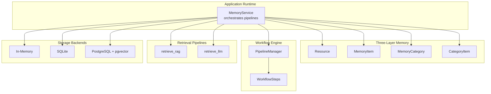
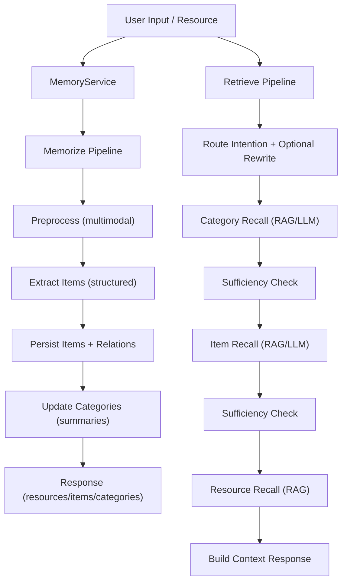
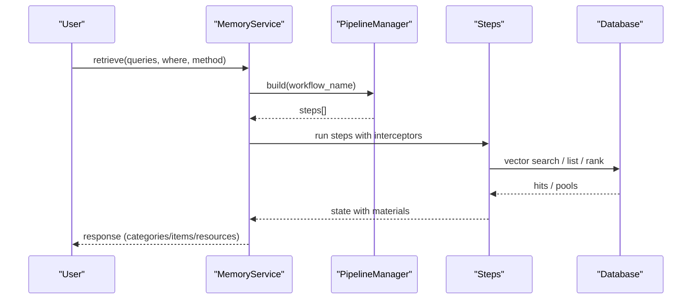
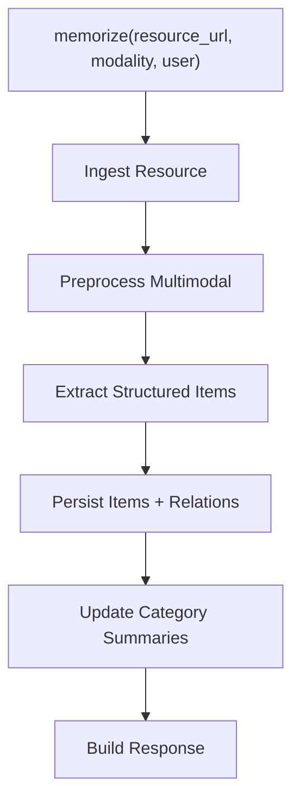
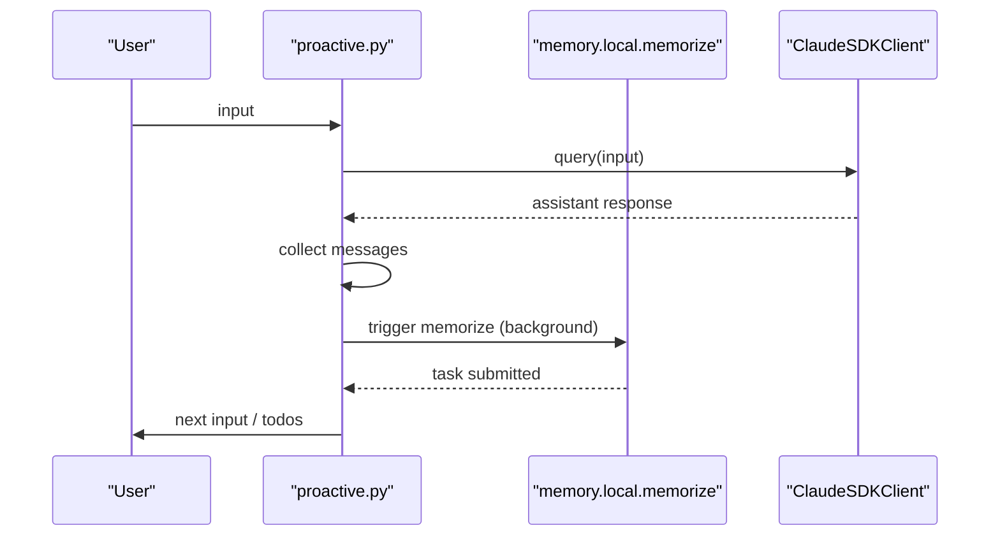
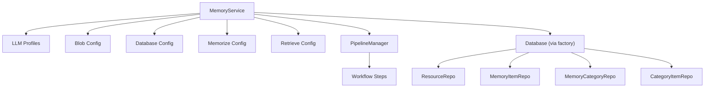

# Project Overview

<cite>
**Referenced Files in This Document**
- [README.md](file://README.md)
- [architecture.md](file://docs/architecture.md)
- [__init__.py](file://src/memu/__init__.py)
- [service.py](file://src/memu/app/service.py)
- [models.py](file://src/memu/database/models.py)
- [pipeline.py](file://src/memu/workflow/pipeline.py)
- [retrieve.py](file://src/memu/app/retrieve.py)
- [memorize.py](file://src/memu/app/memorize.py)
- [factory.py](file://src/memu/database/factory.py)
- [query_rewriter.py](file://src/memu/prompts/retrieve/query_rewriter.py)
- [proactive.py](file://examples/proactive/proactive.py)
- [example_1_conversation_memory.py](file://examples/example_1_conversation_memory.py)
- [example_2_skill_extraction.py](file://examples/example_2_skill_extraction.py)
- [example_3_multimodal_memory.py](file://examples/example_3_multimodal_memory.py)
</cite>

## Table of Contents
1. [Introduction](#introduction)
2. [Project Structure](#project-structure)
3. [Core Components](#core-components)
4. [Architecture Overview](#architecture-overview)
5. [Detailed Component Analysis](#detailed-component-analysis)
6. [Dependency Analysis](#dependency-analysis)
7. [Performance Considerations](#performance-considerations)
8. [Troubleshooting Guide](#troubleshooting-guide)
9. [Conclusion](#conclusion)
10. [Appendices](#appendices)

## Introduction
memU is a 24/7 proactive memory framework designed to enable always-on AI agents that continuously learn, anticipate user intent, and deliver cost-efficient, context-rich interactions. It introduces a “memory as file system” paradigm: memory is structured hierarchically across three layers (Resource, Item, Category), enabling both reactive queries and proactive context loading. The framework supports dual-mode retrieval (RAG-driven fast context assembly and LLM-driven deep reasoning) and integrates with popular LLM providers and storage backends.

Key benefits:
- Cost efficiency: reduces long-running token costs by caching insights and minimizing redundant LLM calls
- Continuous learning: proactive ingestion and summarization of interactions, logs, and multimodal content
- User intent capture: anticipatory reasoning and proactive context surfacing without explicit commands

Practical use cases:
- Always-on assistants that remember preferences and adapt communication style
- Self-improving agents that extract skills from execution logs and evolve strategies
- Multimodal context builders that unify text, images, and documents into coherent memory

## Project Structure
At a high level, memU consists of:
- Application runtime and orchestration (MemoryService)
- Three-layer memory models (Resource, MemoryItem, MemoryCategory, CategoryItem)
- Workflow engine with pluggable steps and capabilities
- Retrieval and memorize pipelines with dual-mode intelligence
- Storage factory supporting in-memory, SQLite, and PostgreSQL backends
- Prompts and utilities for query rewriting, ranking, and multimodal preprocessing
- Examples demonstrating proactive assistants, skill extraction, and multimodal memory

**Diagram sources**
- [service.py](file://src/memu/app/service.py#L49-L96)
- [models.py](file://src/memu/database/models.py#L68-L106)
- [pipeline.py](file://src/memu/workflow/pipeline.py#L21-L46)
- [retrieve.py](file://src/memu/app/retrieve.py#L106-L110)
- [memorize.py](file://src/memu/app/memorize.py#L97-L107)
- [factory.py](file://src/memu/database/factory.py#L15-L43)

**Section sources**
- [README.md](file://README.md#L23-L26)
- [architecture.md](file://docs/architecture.md#L9-L30)

## Core Components
- MemoryService: Composition root that wires LLM clients, storage, workflow pipelines, and public APIs (memorize, retrieve, CRUD).
- Three-layer memory models: Resource (original artifacts), MemoryItem (atomic facts with embeddings), MemoryCategory (topic summaries), and CategoryItem (item-category relations).
- Workflow engine: PipelineManager registers and revises pipelines; WorkflowRunner executes steps with capability tags (llm, vector, db, io, vision).
- Dual-mode retrieval: retrieve_rag (embedding-driven ranking) and retrieve_llm (LLM-driven ranking) share a staged pattern with sufficiency checks and optional query rewriting.
- Storage factory: Selects inmemory, sqlite, or postgres backends; supports vector index configuration.

**Section sources**
- [service.py](file://src/memu/app/service.py#L49-L96)
- [models.py](file://src/memu/database/models.py#L68-L106)
- [pipeline.py](file://src/memu/workflow/pipeline.py#L21-L46)
- [retrieve.py](file://src/memu/app/retrieve.py#L106-L110)
- [memorize.py](file://src/memu/app/memorize.py#L97-L107)
- [factory.py](file://src/memu/database/factory.py#L15-L43)

## Architecture Overview
The system follows the “memory as file system” concept: users mount new knowledge (Resources), which are processed into structured MemoryItems and grouped into MemoryCategories. Retrieval pipelines proactively assemble context across layers, while memorize pipelines continuously ingest and update memory.

**Diagram sources**
- [architecture.md](file://docs/architecture.md#L73-L110)
- [memorize.py](file://src/memu/app/memorize.py#L97-L166)
- [retrieve.py](file://src/memu/app/retrieve.py#L106-L210)

## Detailed Component Analysis

### Memory as File System Paradigm
memU structures memory like a file system:
- Folders → Categories (auto-organized topics)
- Files → Memory Items (extracted facts, preferences, skills)
- Symlinks → Cross-references (related memories linked)
- Mount points → Resources (conversations, documents, images)

Benefits:
- Navigate memories like browsing directories
- Mount new knowledge instantly
- Cross-link memories to build a connected knowledge graph
- Persistent and portable across environments

**Section sources**
- [README.md](file://README.md#L43-L76)

### Three-Layer Memory Architecture
The three-layer system enables both reactive queries and proactive context loading:
- Resource: Direct access to original data
- Item: Targeted fact retrieval
- Category: Summary-level overview

Proactive benefits:
- Auto-categorization: New memories self-organize into topics
- Pattern detection: System identifies recurring themes
- Context prediction: Anticipates what information will be needed next

**Diagram sources**
- [architecture.md](file://docs/architecture.md#L11-L16)
- [models.py](file://src/memu/database/models.py#L68-L106)

**Section sources**
- [README.md](file://README.md#L230-L246)
- [architecture.md](file://docs/architecture.md#L11-L16)

### Dual-Mode Retrieval System
memU supports two retrieval modes:
- RAG-based retrieval (retrieve_rag): Fast proactive context assembly using embeddings; suitable for real-time suggestions
- LLM-based retrieval (retrieve_llm): Deep anticipatory reasoning for complex contexts; suitable for triggered, in-depth context loading

Comparison highlights:
- Speed: RAG millisecond-level; LLM second-level
- Cost: RAG embedding-only; LLM inference-heavy
- Proactive use: Continuous monitoring (RAG); triggered context loading (LLM)
- Best for: Real-time suggestions (RAG); complex anticipation (LLM)

**Diagram sources**
- [retrieve.py](file://src/memu/app/retrieve.py#L42-L85)
- [pipeline.py](file://src/memu/workflow/pipeline.py#L47-L49)

**Section sources**
- [README.md](file://README.md#L433-L490)
- [retrieve.py](file://src/memu/app/retrieve.py#L106-L210)

### Continuous Learning and Proactive Intelligence
Continuous learning is achieved through the memorize pipeline:
- Ingest resource (local/remote)
- Preprocess multimodal content
- Extract structured items
- Persist items and relations
- Update category summaries
- Emit response with resources, items, categories, relations

Proactive intelligence:
- Zero-delay processing: memories available immediately
- Automatic categorization without manual tagging
- Cross-reference with existing memories for pattern detection

**Diagram sources**
- [memorize.py](file://src/memu/app/memorize.py#L65-L95)
- [memorize.py](file://src/memu/app/memorize.py#L97-L166)

**Section sources**
- [README.md](file://README.md#L407-L432)
- [memorize.py](file://src/memu/app/memorize.py#L97-L166)

### Practical Use Cases and Examples
- Always-on assistants: Automatically learn from every interaction and adapt communication style
- Self-improving agents: Extract skills from logs and evolve strategies over time
- Multimodal context builders: Unify memory across text, images, and documents

Examples:
- Example 1: Conversation memory → generates memory category files
- Example 2: Skill extraction from logs → incremental learning and evolving guides
- Example 3: Multimodal memory → unified categories across documents and images

**Section sources**
- [README.md](file://README.md#L492-L544)
- [example_1_conversation_memory.py](file://examples/example_1_conversation_memory.py#L51-L117)
- [example_2_skill_extraction.py](file://examples/example_2_skill_extraction.py#L134-L274)
- [example_3_multimodal_memory.py](file://examples/example_3_multimodal_memory.py#L58-L137)

### Proactive Assistant Demo
The proactive demo shows continuous memory ingestion during a conversation loop, with background memorization tasks and todo-based continuation.

**Diagram sources**
- [proactive.py](file://examples/proactive/proactive.py#L125-L151)
- [proactive.py](file://examples/proactive/proactive.py#L155-L199)

**Section sources**
- [proactive.py](file://examples/proactive/proactive.py#L1-L199)

## Dependency Analysis
The runtime composes multiple subsystems:
- MemoryService depends on LLM profiles, blob config, database config, memorize/retrieve configs, and workflow runner
- PipelineManager validates step dependencies and supports pipeline revisioning
- Storage factory selects backend (inmemory, sqlite, postgres) and initializes repositories
- Retrieval and memorize pipelines depend on vector clients, database repositories, and prompt utilities

**Diagram sources**
- [service.py](file://src/memu/app/service.py#L50-L96)
- [pipeline.py](file://src/memu/workflow/pipeline.py#L21-L46)
- [factory.py](file://src/memu/database/factory.py#L15-L43)

**Section sources**
- [service.py](file://src/memu/app/service.py#L49-L96)
- [pipeline.py](file://src/memu/workflow/pipeline.py#L124-L130)
- [factory.py](file://src/memu/database/factory.py#L15-L43)

## Performance Considerations
- RAG retrieval is optimized for speed with embedding similarity and optional sufficiency checks
- LLM retrieval provides deeper reasoning but at higher cost; suited for complex, triggered scenarios
- Vector search performance varies by backend: brute-force cosine search in SQLite/inmemory; vector index support in PostgreSQL
- Proactive filtering via where scopes ensures efficient retrieval and avoids unnecessary LLM calls

[No sources needed since this section provides general guidance]

## Troubleshooting Guide
Common issues and resolutions:
- Unknown filter field for user scope: ensure where filters correspond to configured user model fields
- Unsupported metadata_store provider: verify database provider is one of inmemory, postgres, or sqlite
- Step configuration errors: confirm step ids exist and required initial state keys are satisfied
- Missing LLM profile: ensure requested profile exists in llm_profiles

Operational tips:
- Use interceptors to wrap LLM calls and capture usage metadata
- Validate pipeline revisions and step dependencies before execution
- Scope retrievals with where filters to limit search space

**Section sources**
- [retrieve.py](file://src/memu/app/retrieve.py#L87-L104)
- [factory.py](file://src/memu/database/factory.py#L41-L43)
- [pipeline.py](file://src/memu/workflow/pipeline.py#L108-L122)
- [service.py](file://src/memu/app/service.py#L228-L295)

## Conclusion
memU delivers a robust, production-ready proactive memory framework that treats memory like a file system, enabling continuous learning, cost-efficient operations, and user intent capture. Its dual-mode retrieval system balances speed and depth, while the three-layer architecture supports both reactive queries and proactive context loading. With modular workflows, pluggable storage, and rich examples, memU is well-suited for always-on assistants, self-improving agents, and multimodal context builders.

[No sources needed since this section summarizes without analyzing specific files]

## Appendices
- Public alias: MemUService is exposed for convenience in documentation examples
- Provider integration: Supports multiple LLM providers and embedding backends via llm_profiles
- Storage backends: Choose inmemory for ephemeral testing, sqlite for lightweight portability, or postgres for scalable deployments

**Section sources**
- [__init__.py](file://src/memu/__init__.py#L4-L5)
- [architecture.md](file://docs/architecture.md#L138-L156)