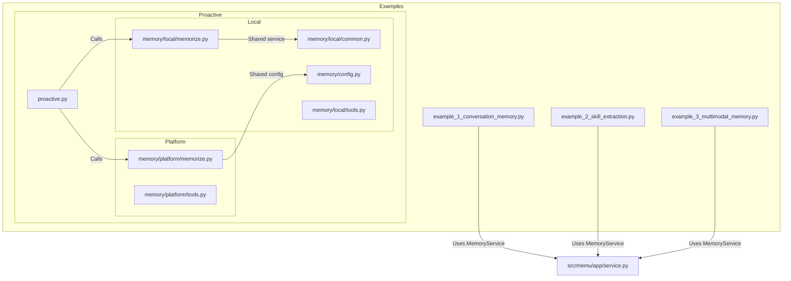
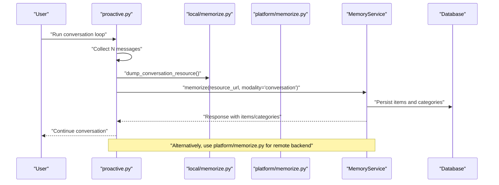
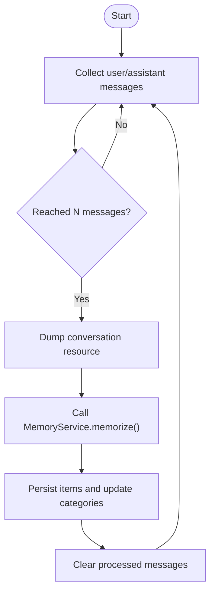
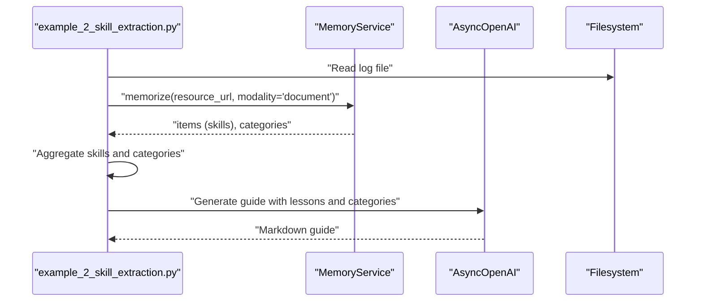
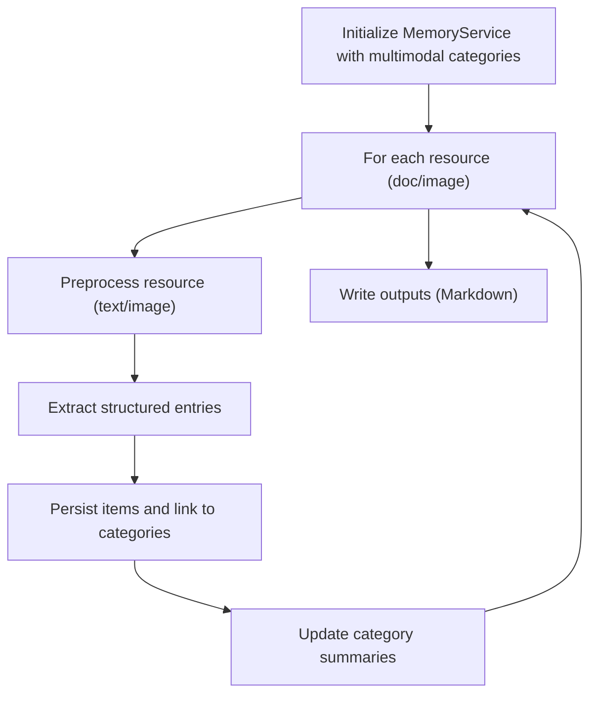
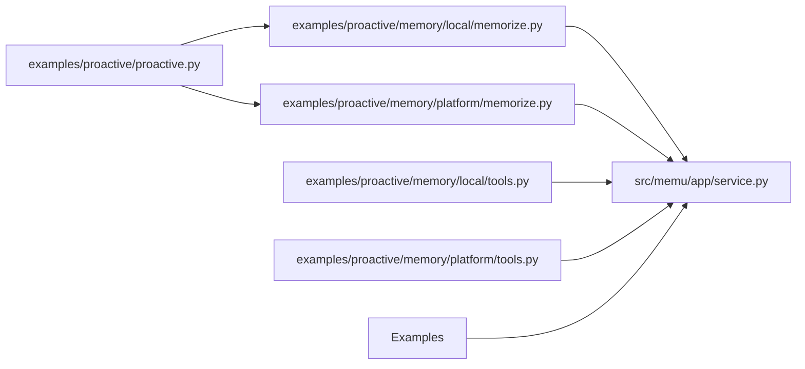

# Use Cases and Examples

<cite>
**Referenced Files in This Document**
- [proactive.py](file://examples/proactive/proactive.py)
- [config.py](file://examples/proactive/memory/config.py)
- [memorize.py](file://examples/proactive/memory/local/memorize.py)
- [tools.py](file://examples/proactive/memory/local/tools.py)
- [memorize.py](file://examples/proactive/memory/platform/memorize.py)
- [tools.py](file://examples/proactive/memory/platform/tools.py)
- [example_1_conversation_memory.py](file://examples/example_1_conversation_memory.py)
- [example_2_skill_extraction.py](file://examples/example_2_skill_extraction.py)
- [example_3_multimodal_memory.py](file://examples/example_3_multimodal_memory.py)
- [service.py](file://src/memu/app/service.py)
- [memorize.py](file://src/memu/app/memorize.py)
- [retrieve.py](file://src/memu/app/retrieve.py)
- [crud.py](file://src/memu/app/crud.py)
</cite>

## Table of Contents
1. [Introduction](#introduction)
2. [Project Structure](#project-structure)
3. [Core Components](#core-components)
4. [Architecture Overview](#architecture-overview)
5. [Detailed Component Analysis](#detailed-component-analysis)
6. [Dependency Analysis](#dependency-analysis)
7. [Performance Considerations](#performance-considerations)
8. [Troubleshooting Guide](#troubleshooting-guide)
9. [Conclusion](#conclusion)
10. [Appendices](#appendices)

## Introduction
This document presents practical use cases and examples for memU’s proactive memory capabilities. It focuses on three main scenarios:
- Always-learning assistants: continuous learning from ongoing conversations and logs
- Self-improving agents: iterative refinement of skills and procedures from execution feedback
- Multimodal context builders: unified memory across text, images, and other modalities

For each scenario, we explain proactive behaviors, implementation patterns, expected outcomes, performance characteristics, best practices, integration patterns, and common pitfalls with solutions. Concrete code references are provided to help you adapt these patterns to your own systems.

## Project Structure
The proactive memory examples are organized under examples/proactive and demonstrate:
- Local and platform-backed memory pipelines
- Tool integrations for retrieval and todo lists
- End-to-end workflows for conversation, skill extraction, and multimodal processing

**Diagram sources**
- [proactive.py](file://examples/proactive/proactive.py#L1-L199)
- [memorize.py](file://examples/proactive/memory/local/memorize.py#L1-L39)
- [tools.py](file://examples/proactive/memory/local/tools.py#L1-L43)
- [memorize.py](file://examples/proactive/memory/platform/memorize.py#L1-L32)
- [tools.py](file://examples/proactive/memory/platform/tools.py#L1-L53)
- [example_1_conversation_memory.py](file://examples/example_1_conversation_memory.py#L1-L118)
- [example_2_skill_extraction.py](file://examples/example_2_skill_extraction.py#L1-L275)
- [example_3_multimodal_memory.py](file://examples/example_3_multimodal_memory.py#L1-L138)
- [service.py](file://src/memu/app/service.py#L1-L427)

**Section sources**
- [proactive.py](file://examples/proactive/proactive.py#L1-L199)
- [memorize.py](file://examples/proactive/memory/local/memorize.py#L1-L39)
- [tools.py](file://examples/proactive/memory/local/tools.py#L1-L43)
- [memorize.py](file://examples/proactive/memory/platform/memorize.py#L1-L32)
- [tools.py](file://examples/proactive/memory/platform/tools.py#L1-L53)
- [example_1_conversation_memory.py](file://examples/example_1_conversation_memory.py#L1-L118)
- [example_2_skill_extraction.py](file://examples/example_2_skill_extraction.py#L1-L275)
- [example_3_multimodal_memory.py](file://examples/example_3_multimodal_memory.py#L1-L138)
- [service.py](file://src/memu/app/service.py#L1-L427)

## Core Components
- MemoryService orchestrates the entire lifecycle: ingestion, preprocessing, extraction, categorization, persistence, and summarization. It exposes memorize, retrieve, and CRUD APIs and runs workflows through a configurable runner.
- Proactive pipelines in examples show how to trigger memory updates proactively (e.g., after N conversation turns) and integrate retrieval tools for dynamic context building.

Key implementation patterns:
- Continuous learning: accumulate conversation messages, periodically trigger memorization, and clear processed messages to reduce overhead.
- Incremental skill extraction: process logs sequentially, update categories progressively, and generate evolving guides.
- Unified multimodal memory: process documents and images, derive cross-modal categories, and persist summaries.

**Section sources**
- [service.py](file://src/memu/app/service.py#L49-L427)
- [memorize.py](file://src/memu/app/memorize.py#L65-L95)
- [retrieve.py](file://src/memu/app/retrieve.py#L42-L85)
- [crud.py](file://src/memu/app/crud.py#L38-L98)

## Architecture Overview
The proactive memory architecture combines:
- Local and platform backends for memory operations
- MCP tooling for retrieval and todo list access
- Configurable memory types and categories
- Asynchronous workflows for ingestion, extraction, and persistence

**Diagram sources**
- [proactive.py](file://examples/proactive/proactive.py#L125-L152)
- [memorize.py](file://examples/proactive/memory/local/memorize.py#L13-L38)
- [memorize.py](file://examples/proactive/memory/platform/memorize.py#L13-L31)
- [service.py](file://src/memu/app/service.py#L65-L95)

## Detailed Component Analysis

### Always-learning Assistants
Proactive behavior: Trigger memory updates automatically after a threshold of conversation turns to continuously capture evolving context.

Implementation pattern:
- Accumulate conversation messages until a count threshold is met
- Dump messages to a temporary resource and call MemoryService.memorize with modality “conversation”
- Clear processed messages to keep the buffer small and responsive

Expected outcomes:
- Evolving categories reflecting recent tasks and plans
- Reduced manual curation through automated extraction
- Lower latency by batching updates

Performance characteristics:
- Batching reduces LLM calls and embedding computations
- Background task scheduling prevents blocking the conversation loop

Integration patterns:
- Use MCP tools to retrieve todos and memory summaries during the loop
- Configure memory types and categories to focus on actionable items

Common challenges and solutions:
- Race conditions: ensure only one memorization task runs at a time; skip if a task is already running
- Resource cleanup: clear processed messages after successful memorization
- API keys and profiles: ensure llm_profiles are configured for the service

**Section sources**
- [proactive.py](file://examples/proactive/proactive.py#L97-L123)
- [proactive.py](file://examples/proactive/proactive.py#L125-L152)
- [memorize.py](file://examples/proactive/memory/local/memorize.py#L13-L38)
- [tools.py](file://examples/proactive/memory/local/tools.py#L22-L39)
- [config.py](file://examples/proactive/memory/config.py#L1-L67)
- [service.py](file://src/memu/app/service.py#L65-L95)

### Self-improving Agents
Proactive behavior: Continuously refine skills and procedures by extracting lessons from agent execution logs and updating category summaries iteratively.

Implementation pattern:
- Process logs sequentially, calling MemoryService.memorize for each resource
- Extract “skill” memory items and aggregate them
- Generate evolving guides using LLM prompts that incorporate lessons and category summaries

Expected outcomes:
- A production-ready guide that evolves with each deployment attempt
- Structured lessons learned and action items
- Improved reliability and reduced trial-and-error cycles

Performance characteristics:
- Sequential processing ensures deterministic accumulation
- Prompt engineering controls verbosity and focus

Integration patterns:
- Define custom memory types and categories for skills
- Use category summaries to inform subsequent generations

Common challenges and solutions:
- Missing API keys: ensure OPENAI_API_KEY is set
- Prompt completeness: provide explicit instructions for extracting actions, outcomes, and lessons
- Output stability: use consistent frontmatter and structure to enable reliable parsing

**Section sources**
- [example_2_skill_extraction.py](file://examples/example_2_skill_extraction.py#L134-L271)
- [memorize.py](file://src/memu/app/memorize.py#L65-L95)
- [service.py](file://src/memu/app/service.py#L65-L95)

### Multimodal Context Builders
Proactive behavior: Build unified memory across different input modalities (documents, images) to create coherent context for downstream tasks.

Implementation pattern:
- Initialize MemoryService with custom categories for multimodal content
- Process each resource (document or image) with appropriate modality
- Persist items and update category summaries to reflect cross-modal insights

Expected outcomes:
- Unified categories across modalities (e.g., technical documentation, best practices, visual diagrams)
- Summaries that consolidate insights from diverse sources
- Reusable knowledge artifacts for teams and agents

Performance characteristics:
- Preprocessing dispatch handles modality-specific transformations
- Embedding and vector search enable efficient recall

Integration patterns:
- Use predefined multimodal preprocess prompts or customize prompts per modality
- Enable category reference updates to keep summaries current

Common challenges and solutions:
- Modality-specific preprocessing: ensure audio transcription or image captioning is handled
- Category alignment: align category names across modalities for consistent linking
- Output formatting: generate concise summaries and maintain readability

**Section sources**
- [example_3_multimodal_memory.py](file://examples/example_3_multimodal_memory.py#L58-L134)
- [memorize.py](file://src/memu/app/memorize.py#L689-L794)
- [service.py](file://src/memu/app/service.py#L65-L95)

## Dependency Analysis
The proactive examples depend on MemoryService and share configuration for memory types and categories. Local and platform backends expose similar APIs for memorization and retrieval.

**Diagram sources**
- [proactive.py](file://examples/proactive/proactive.py#L1-L199)
- [memorize.py](file://examples/proactive/memory/local/memorize.py#L1-L39)
- [memorize.py](file://examples/proactive/memory/platform/memorize.py#L1-L32)
- [tools.py](file://examples/proactive/memory/local/tools.py#L1-L43)
- [tools.py](file://examples/proactive/memory/platform/tools.py#L1-L53)
- [service.py](file://src/memu/app/service.py#L1-L427)

**Section sources**
- [proactive.py](file://examples/proactive/proactive.py#L1-L199)
- [memorize.py](file://examples/proactive/memory/local/memorize.py#L1-L39)
- [memorize.py](file://examples/proactive/memory/platform/memorize.py#L1-L32)
- [tools.py](file://examples/proactive/memory/local/tools.py#L1-L43)
- [tools.py](file://examples/proactive/memory/platform/tools.py#L1-L53)
- [service.py](file://src/memu/app/service.py#L1-L427)

## Performance Considerations
- Batching: Accumulate N messages before triggering memorization to reduce overhead
- Concurrency: Use asynchronous workflows and background tasks to avoid blocking
- Embeddings: Leverage embedding clients and vector search to scale retrieval
- Prompt engineering: Keep prompts concise and structured to minimize token usage and improve parsing
- Caching: Reuse LLM clients per profile and cache initialized components where appropriate

[No sources needed since this section provides general guidance]

## Troubleshooting Guide
Common issues and resolutions:
- API key errors: Ensure environment variables (e.g., OPENAI_API_KEY) are set before running examples
- Missing categories: Initialize categories explicitly or rely on automatic initialization via MemoryService
- Retrieval not triggered: Verify retrieve configuration (method, routing, sufficiency checks)
- MCP tool errors: Confirm MCP server registration and tool availability
- Platform backend: For platform mode, ensure Authorization header and endpoint configuration are correct

**Section sources**
- [example_1_conversation_memory.py](file://examples/example_1_conversation_memory.py#L64-L68)
- [example_2_skill_extraction.py](file://examples/example_2_skill_extraction.py#L147-L151)
- [tools.py](file://examples/proactive/memory/local/tools.py#L10-L19)
- [tools.py](file://examples/proactive/memory/platform/tools.py#L12-L23)
- [retrieve.py](file://src/memu/app/retrieve.py#L42-L85)

## Conclusion
memU’s proactive memory enables:
- Always-learning assistants that continuously capture evolving context
- Self-improving agents that refine skills from execution logs
- Multimodal context builders that unify knowledge across diverse inputs

By leveraging MemoryService workflows, MCP tools, and configurable memory types and categories, you can implement robust, scalable proactive memory systems tailored to your domain. Start with the provided examples, adapt configurations, and iterate based on your specific needs.

[No sources needed since this section summarizes without analyzing specific files]

## Appendices
- Best practices:
  - Define clear memory types and categories aligned to your workflows
  - Use structured prompts to improve extraction quality
  - Batch updates to balance freshness and cost
  - Monitor retrieval sufficiency to avoid unnecessary expansions
- Integration tips:
  - Use MCP tools for retrieval and todo access in conversational agents
  - Switch between local and platform backends based on deployment constraints
  - Employ category summaries to guide downstream generation and decision-making

[No sources needed since this section provides general guidance]