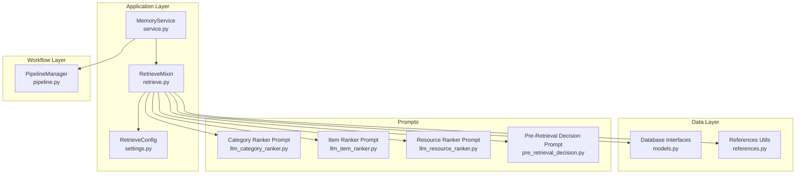
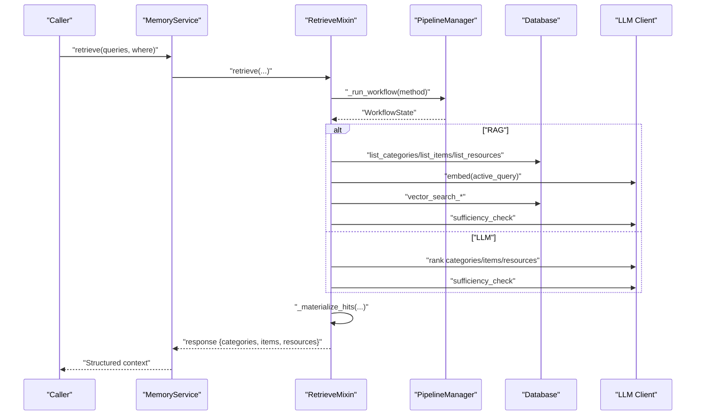
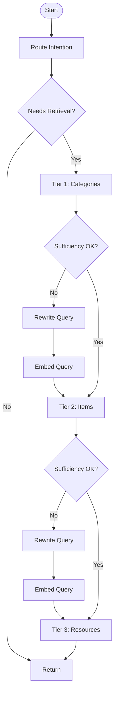
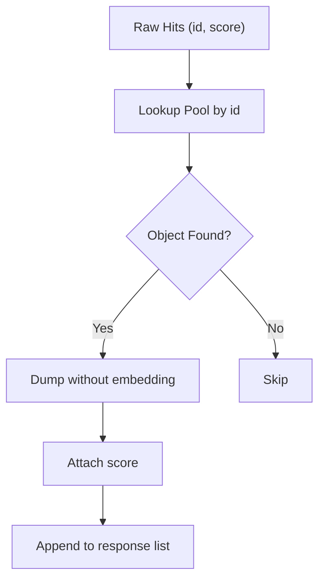
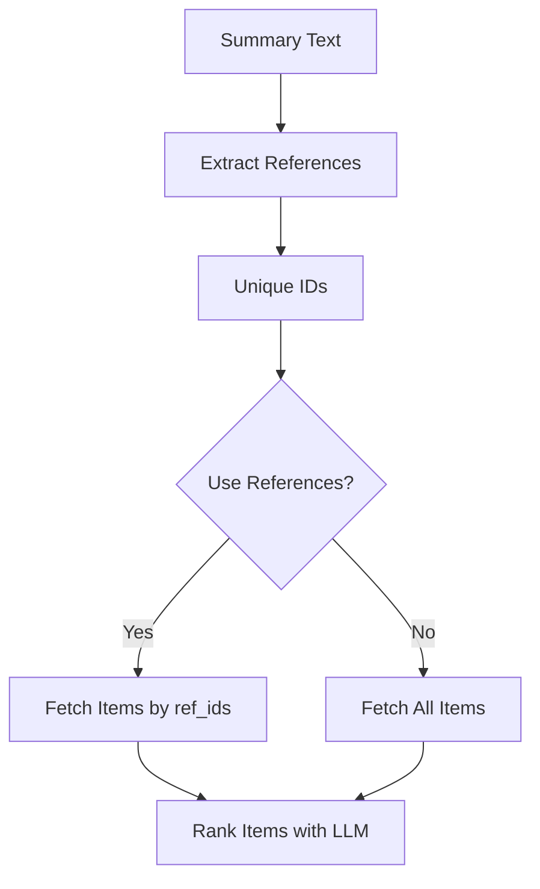
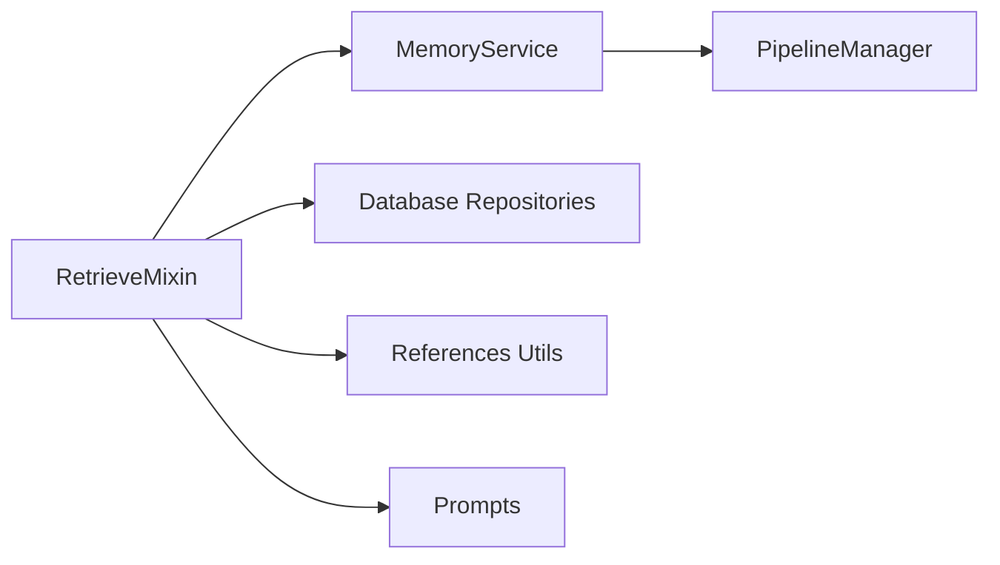

# Context Construction and Materialization

<cite>
**Referenced Files in This Document**
- [retrieve.py](file://src/memu/app/retrieve.py)
- [settings.py](file://src/memu/app/settings.py)
- [models.py](file://src/memu/database/models.py)
- [references.py](file://src/memu/utils/references.py)
- [service.py](file://src/memu/app/service.py)
- [pipeline.py](file://src/memu/workflow/pipeline.py)
- [llm_category_ranker.py](file://src/memu/prompts/retrieve/llm_category_ranker.py)
- [llm_item_ranker.py](file://src/memu/prompts/retrieve/llm_item_ranker.py)
- [llm_resource_ranker.py](file://src/memu/prompts/retrieve/llm_resource_ranker.py)
- [pre_retrieval_decision.py](file://src/memu/prompts/retrieve/pre_retrieval_decision.py)
</cite>

## Table of Contents
1. [Introduction](#introduction)
2. [Project Structure](#project-structure)
3. [Core Components](#core-components)
4. [Architecture Overview](#architecture-overview)
5. [Detailed Component Analysis](#detailed-component-analysis)
6. [Dependency Analysis](#dependency-analysis)
7. [Performance Considerations](#performance-considerations)
8. [Troubleshooting Guide](#troubleshooting-guide)
9. [Conclusion](#conclusion)

## Introduction
This document explains how retrieval results are transformed into usable context through two complementary workflows: RAG-based retrieval and LLM-based retrieval. It covers hit scoring, content formatting, reference extraction, and context assembly. It also documents how raw retrieval results are materialized into structured context objects with metadata and relationships, and how cross-references between categories and items are extracted and resolved. Finally, it outlines configuration options for formatting, content truncation, and performance optimization for large context assemblies.

## Project Structure
The retrieval and context construction logic is primarily implemented in the retrieve mixin and integrated with the service layer and workflow pipeline. Supporting components include configuration models, database models, and utilities for reference handling.



**Diagram sources**
- [service.py](file://src/memu/app/service.py#L49-L360)
- [retrieve.py](file://src/memu/app/retrieve.py#L42-L85)
- [settings.py](file://src/memu/app/settings.py#L175-L202)
- [pipeline.py](file://src/memu/workflow/pipeline.py#L21-L171)
- [models.py](file://src/memu/database/models.py#L68-L106)
- [references.py](file://src/memu/utils/references.py#L16-L173)
- [llm_category_ranker.py](file://src/memu/prompts/retrieve/llm_category_ranker.py#L1-L36)
- [llm_item_ranker.py](file://src/memu/prompts/retrieve/llm_item_ranker.py#L1-L41)
- [llm_resource_ranker.py](file://src/memu/prompts/retrieve/llm_resource_ranker.py#L1-L41)
- [pre_retrieval_decision.py](file://src/memu/prompts/retrieve/pre_retrieval_decision.py#L28-L53)

**Section sources**
- [service.py](file://src/memu/app/service.py#L49-L360)
- [retrieve.py](file://src/memu/app/retrieve.py#L42-L85)
- [settings.py](file://src/memu/app/settings.py#L175-L202)
- [pipeline.py](file://src/memu/workflow/pipeline.py#L21-L171)
- [models.py](file://src/memu/database/models.py#L68-L106)
- [references.py](file://src/memu/utils/references.py#L16-L173)
- [llm_category_ranker.py](file://src/memu/prompts/retrieve/llm_category_ranker.py#L1-L36)
- [llm_item_ranker.py](file://src/memu/prompts/retrieve/llm_item_ranker.py#L1-L41)
- [llm_resource_ranker.py](file://src/memu/prompts/retrieve/llm_resource_ranker.py#L1-L41)
- [pre_retrieval_decision.py](file://src/memu/prompts/retrieve/pre_retrieval_decision.py#L28-L53)

## Core Components
- RetrieveMixin orchestrates retrieval workflows, decides whether retrieval is needed, performs vector and LLM-based ranking, and materializes results into structured context objects.
- MemoryService integrates LLM clients, database access, and workflow pipelines, and exposes the retrieve API.
- RetrieveConfig defines retrieval behavior, including method selection, sufficiency checks, and per-stage top-k limits.
- Database models define MemoryCategory, MemoryItem, Resource, and CategoryItem relationships used during materialization.
- References utilities extract and format inline citations for cross-reference resolution.

**Section sources**
- [retrieve.py](file://src/memu/app/retrieve.py#L42-L85)
- [service.py](file://src/memu/app/service.py#L49-L360)
- [settings.py](file://src/memu/app/settings.py#L175-L202)
- [models.py](file://src/memu/database/models.py#L68-L106)
- [references.py](file://src/memu/utils/references.py#L16-L173)

## Architecture Overview
The retrieval system supports two strategies:
- RAG-based retrieval: Uses vector similarity for categories and items, and cosine similarity for resources. After each tier, a sufficiency check determines whether to continue to the next tier and optionally rewrite the query.
- LLM-based retrieval: Delegates ranking to LLM prompts with explicit JSON outputs, followed by parsing and optional sufficiency checks.

Both strategies converge on a shared materialization step that converts raw hits into structured context objects with scores and metadata.



**Diagram sources**
- [service.py](file://src/memu/app/service.py#L350-L360)
- [retrieve.py](file://src/memu/app/retrieve.py#L42-L85)
- [pipeline.py](file://src/memu/workflow/pipeline.py#L47-L49)

## Detailed Component Analysis

### Retrieval Workflows and Hit Scoring
- RAG-based workflow:
  - Route intention and optional query rewriting.
  - Category retrieval via embedding-based similarity with summary texts.
  - Sufficiency check after categories; if needed, embed rewritten query and continue.
  - Item retrieval via vector search with configurable ranking and recency decay.
  - Sufficiency check after items; if needed, embed rewritten query and continue.
  - Resource retrieval via cosine similarity over resource embeddings.
  - Final context assembly with materialized hits.
- LLM-based workflow:
  - Category ranking via LLM prompt with JSON output parsing.
  - Item ranking constrained to relevant categories with JSON output parsing.
  - Resource ranking guided by context info (categories and items).
  - Optional sufficiency checks after each tier.



**Diagram sources**
- [retrieve.py](file://src/memu/app/retrieve.py#L106-L210)
- [retrieve.py](file://src/memu/app/retrieve.py#L454-L536)
- [retrieve.py](file://src/memu/app/retrieve.py#L746-L784)

**Section sources**
- [retrieve.py](file://src/memu/app/retrieve.py#L106-L210)
- [retrieve.py](file://src/memu/app/retrieve.py#L454-L536)
- [retrieve.py](file://src/memu/app/retrieve.py#L746-L784)

### Content Formatting and Context Assembly
- Category content formatting combines category name, summary, and score for sufficiency checks and final assembly.
- Item content formatting includes memory type and summary with score.
- Resource content formatting includes caption or URL with score.
- Final assembly uses a materialization step that attaches a numeric score to each returned object and excludes embeddings.



**Diagram sources**
- [retrieve.py](file://src/memu/app/retrieve.py#L943-L952)
- [retrieve.py](file://src/memu/app/retrieve.py#L954-L981)
- [retrieve.py](file://src/memu/app/retrieve.py#L983-L994)

**Section sources**
- [retrieve.py](file://src/memu/app/retrieve.py#L943-L952)
- [retrieve.py](file://src/memu/app/retrieve.py#L954-L981)
- [retrieve.py](file://src/memu/app/retrieve.py#L983-L994)

### Reference Extraction and Resolution
- Inline citations in category summaries follow the pattern [ref:ITEM_ID] and can include comma-separated IDs.
- Utilities extract referenced IDs, strip references for clean display, convert to numbered citations, and fetch referenced items from storage.
- During LLM-based item retrieval, category summaries can be scanned for references to pre-filter items by ID.



**Diagram sources**
- [references.py](file://src/memu/utils/references.py#L20-L49)
- [references.py](file://src/memu/utils/references.py#L118-L146)
- [retrieve.py](file://src/memu/app/retrieve.py#L626-L640)
- [retrieve.py](file://src/memu/app/retrieve.py#L324-L344)

**Section sources**
- [references.py](file://src/memu/utils/references.py#L20-L49)
- [references.py](file://src/memu/utils/references.py#L118-L146)
- [retrieve.py](file://src/memu/app/retrieve.py#L626-L640)
- [retrieve.py](file://src/memu/app/retrieve.py#L324-L344)

### Structured Context Objects and Metadata
- Categories: materialized with id, name, description, embedding, summary, created_at, updated_at, and score.
- Items: materialized with id, resource_id, memory_type, summary, embedding, happened_at, extra, created_at, updated_at, and score.
- Resources: materialized with id, url, modality, local_path, caption, embedding, created_at, updated_at, and score.
- Relationships: CategoryItem links items to categories; during LLM ranking, relations inform context.

```mermaid
erDiagram
MEMORY_CATEGORY {
string id PK
string name
string description
list float embedding
string summary
datetime created_at
datetime updated_at
}
MEMORY_ITEM {
string id PK
string resource_id
string memory_type
string summary
list float embedding
datetime happened_at
json extra
datetime created_at
datetime updated_at
}
CATEGORY_ITEM {
string id PK
string item_id FK
string category_id FK
}
RESOURCE {
string id PK
string url
string modality
string local_path
string caption
list float embedding
datetime created_at
datetime updated_at
}
MEMORY_CATEGORY ||--o{ CATEGORY_ITEM : "links"
MEMORY_ITEM ||--o{ CATEGORY_ITEM : "belongs_to"
```

**Diagram sources**
- [models.py](file://src/memu/database/models.py#L68-L106)
- [models.py](file://src/memu/database/models.py#L103-L106)

**Section sources**
- [models.py](file://src/memu/database/models.py#L68-L106)

### Configuration Options for Context Formatting and Performance
- Method selection: "rag" or "llm".
- Per-tier toggles: category.enabled, item.enabled, resource.enabled.
- Top-K controls: category.top_k, item.top_k, resource.top_k.
- Ranking strategy: item.ranking supports "similarity" or "salience" with recency_decay_days.
- Sufficiency checks: route_intention, sufficiency_check, sufficiency_check_prompt, sufficiency_check_llm_profile, llm_ranking_llm_profile.
- Reference-aware item retrieval: item.use_category_references enables fetching items by ref_ids extracted from category summaries.
- LLM prompts: category/item/resource rankers and pre-retrieval decision prompts are configurable via prompt blocks.

**Section sources**
- [settings.py](file://src/memu/app/settings.py#L146-L202)
- [llm_category_ranker.py](file://src/memu/prompts/retrieve/llm_category_ranker.py#L1-L36)
- [llm_item_ranker.py](file://src/memu/prompts/retrieve/llm_item_ranker.py#L1-L41)
- [llm_resource_ranker.py](file://src/memu/prompts/retrieve/llm_resource_ranker.py#L1-L41)
- [pre_retrieval_decision.py](file://src/memu/prompts/retrieve/pre_retrieval_decision.py#L28-L53)

### Examples: Category, Item, and Resource Materialization
- Category materialization: Produces a list of category objects with name, description, summary, and score. Summaries can include inline references that are later resolved to items.
- Item materialization: Produces a list of memory items with memory_type, summary, and score. Extra metadata may include reinforcement tracking fields.
- Resource materialization: Produces a list of resources with url, modality, caption, and score. Resources are scored via cosine similarity over embeddings.

**Section sources**
- [retrieve.py](file://src/memu/app/retrieve.py#L426-L452)
- [retrieve.py](file://src/memu/app/retrieve.py#L943-L952)
- [retrieve.py](file://src/memu/app/retrieve.py#L983-L994)

## Dependency Analysis
- RetrieveMixin depends on MemoryService for LLM clients, database access, and workflow orchestration.
- PipelineManager validates step dependencies and capability availability before execution.
- Database interfaces provide typed repositories for categories, items, resources, and category-item relations.
- Reference utilities are used for extracting and formatting citations.



**Diagram sources**
- [retrieve.py](file://src/memu/app/retrieve.py#L42-L85)
- [service.py](file://src/memu/app/service.py#L350-L360)
- [pipeline.py](file://src/memu/workflow/pipeline.py#L131-L165)
- [references.py](file://src/memu/utils/references.py#L16-L173)

**Section sources**
- [retrieve.py](file://src/memu/app/retrieve.py#L42-L85)
- [service.py](file://src/memu/app/service.py#L350-L360)
- [pipeline.py](file://src/memu/workflow/pipeline.py#L131-L165)
- [references.py](file://src/memu/utils/references.py#L16-L173)

## Performance Considerations
- Vector similarity search:
  - Use appropriate top_k to limit context size and reduce downstream processing cost.
  - For items, choose ranking strategy "salience" with tuned recency_decay_days to emphasize recent and reinforced memories.
- LLM-based ranking:
  - Reduce top_k to minimize JSON parsing overhead and prompt size.
  - Use sufficiency checks to avoid unnecessary tiers.
- Embedding costs:
  - Reuse embeddings when possible (e.g., after query rewriting).
  - Batch embedding calls where supported by the client backend.
- Context assembly:
  - Exclude embeddings from final context objects to reduce payload size.
  - Truncate long summaries in reference maps and citations to keep prompts concise.

[No sources needed since this section provides general guidance]

## Troubleshooting Guide
- Empty or missing results:
  - Verify where filters and user scope are correctly applied.
  - Confirm that category and item pools are populated.
- Parsing failures:
  - LLM ranking responses must return valid JSON with arrays of IDs; otherwise, the system logs warnings and returns empty results.
- Insufficient context:
  - Enable sufficiency checks and adjust prompts to encourage query rewriting.
  - Increase top_k for tiers where recall is low.
- Reference resolution:
  - Ensure category summaries include properly formatted [ref:ID] citations.
  - Validate that referenced item IDs exist in the item pool.

**Section sources**
- [retrieve.py](file://src/memu/app/retrieve.py#L1325-L1347)
- [retrieve.py](file://src/memu/app/retrieve.py#L1349-L1371)
- [retrieve.py](file://src/memu/app/retrieve.py#L1373-L1395)
- [retrieve.py](file://src/memu/app/retrieve.py#L746-L784)

## Conclusion
The retrieval system transforms raw hits into structured, scored context objects while supporting both deterministic vector-based and flexible LLM-based ranking. Cross-references enable targeted item retrieval from category summaries, and configuration options allow tuning for accuracy, cost, and performance. The materialization step ensures consistent metadata and relationships across categories, items, and resources, enabling robust downstream reasoning and prompting.