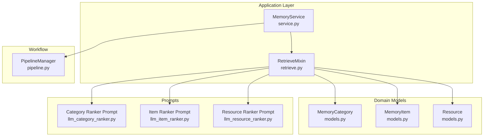
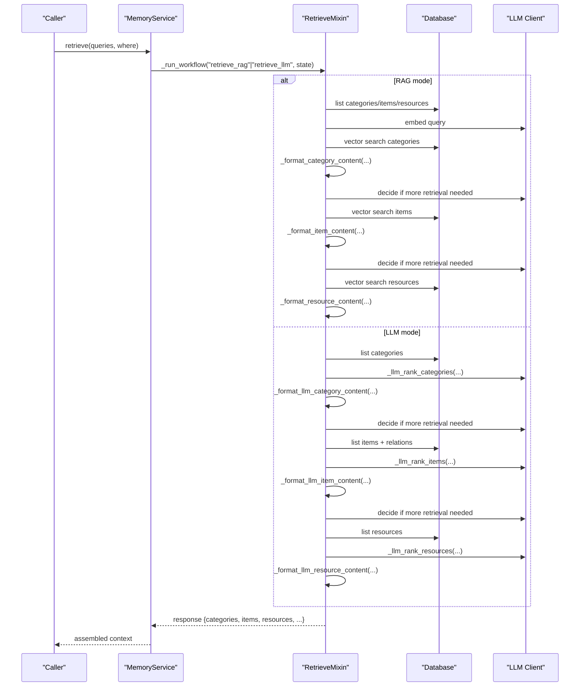
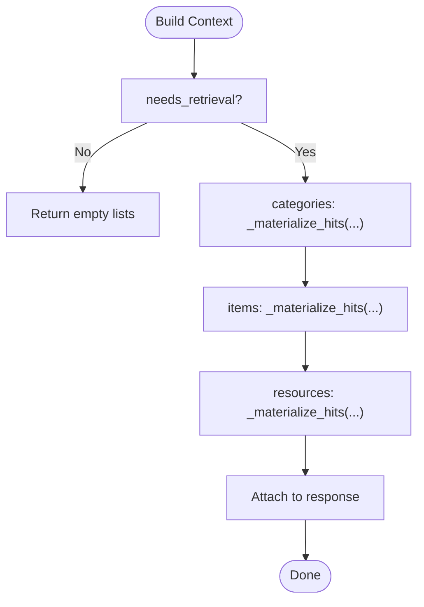
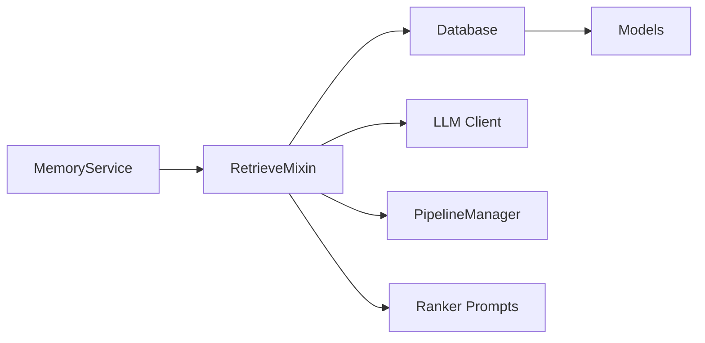

# Context Formatting and Assembly

<cite>
**Referenced Files in This Document**
- [retrieve.py](file://src/memu/app/retrieve.py)
- [service.py](file://src/memu/app/service.py)
- [models.py](file://src/memu/database/models.py)
- [llm_category_ranker.py](file://src/memu/prompts/retrieve/llm_category_ranker.py)
- [llm_item_ranker.py](file://src/memu/prompts/retrieve/llm_item_ranker.py)
- [llm_resource_ranker.py](file://src/memu/prompts/retrieve/llm_resource_ranker.py)
- [pipeline.py](file://src/memu/workflow/pipeline.py)
</cite>

## Table of Contents
1. [Introduction](#introduction)
2. [Project Structure](#project-structure)
3. [Core Components](#core-components)
4. [Architecture Overview](#architecture-overview)
5. [Detailed Component Analysis](#detailed-component-analysis)
6. [Dependency Analysis](#dependency-analysis)
7. [Performance Considerations](#performance-considerations)
8. [Troubleshooting Guide](#troubleshooting-guide)
9. [Conclusion](#conclusion)

## Introduction
This document explains how retrieved content is transformed into structured, formatted context for downstream reasoning and generation. It focuses on three core formatting functions:
- _format_category_content: Formats vector-search category results with confidence scores and metadata
- _format_item_content: Formats vector-search item results with confidence scores and metadata
- _format_llm_*_content: Formats LLM-ranked results (categories/items/resources) for judgment and assembly

It also documents the context assembly workflow that merges categories, items, and resources into unified context structures, along with content truncation strategies, formatting options, and performance optimizations for large-scale retrieval.

## Project Structure
The retrieval and formatting logic resides primarily in the RetrieveMixin class, with orchestration via the MemoryService and workflow pipelines. Data models define the shapes of categories, items, and resources.

**Diagram sources**
- [service.py](file://src/memu/app/service.py#L49-L95)
- [retrieve.py](file://src/memu/app/retrieve.py#L27-L85)
- [models.py](file://src/memu/database/models.py#L68-L106)
- [llm_category_ranker.py](file://src/memu/prompts/retrieve/llm_category_ranker.py#L1-L36)
- [llm_item_ranker.py](file://src/memu/prompts/retrieve/llm_item_ranker.py#L1-L41)
- [llm_resource_ranker.py](file://src/memu/prompts/retrieve/llm_resource_ranker.py#L1-L41)
- [pipeline.py](file://src/memu/workflow/pipeline.py#L21-L46)

**Section sources**
- [service.py](file://src/memu/app/service.py#L49-L95)
- [retrieve.py](file://src/memu/app/retrieve.py#L27-L85)
- [models.py](file://src/memu/database/models.py#L68-L106)
- [pipeline.py](file://src/memu/workflow/pipeline.py#L21-L46)

## Core Components
- RetrieveMixin: Implements retrieval workflows (RAG and LLM-based), formatting helpers, and context assembly.
- MemoryService: Provides LLM clients, database access, and orchestrates workflow execution.
- Data models: Define MemoryCategory, MemoryItem, and Resource with fields used during formatting.
- Prompts: LLM prompts for ranking categories, items, and resources.

Key formatting functions:
- _format_category_content: Vector-search category results with score and metadata
- _format_item_content: Vector-search item results with score and metadata
- _format_resource_content: Vector-search resource results with score and metadata
- _format_llm_category_content: LLM-ranked category results for judgment
- _format_llm_item_content: LLM-ranked item results for judgment
- _format_llm_resource_content: LLM-ranked resource results for judgment

**Section sources**
- [retrieve.py](file://src/memu/app/retrieve.py#L954-L994)
- [retrieve.py](file://src/memu/app/retrieve.py#L1397-L1418)
- [models.py](file://src/memu/database/models.py#L68-L106)

## Architecture Overview
Two retrieval modes produce context:
- RAG retrieval: Uses vector similarity with confidence scores; formats via _format_category_content, _format_item_content, _format_resource_content.
- LLM retrieval: Uses LLM ranking; formats via _format_llm_*_content functions.

Both modes assemble unified context structures containing categories, items, and resources.

**Diagram sources**
- [service.py](file://src/memu/app/service.py#L350-L361)
- [retrieve.py](file://src/memu/app/retrieve.py#L426-L452)
- [retrieve.py](file://src/memu/app/retrieve.py#L867-L941)
- [retrieve.py](file://src/memu/app/retrieve.py#L1021-L1117)

## Detailed Component Analysis

### Vector-Search Context Formatting Functions
- _format_category_content
  - Purpose: Transform vector-search category hits into a readable summary with confidence scores and metadata.
  - Inputs: hits (list of (id, score)), summaries (id->summary), store, categories pool.
  - Output: newline-separated formatted blocks including category name, summary, and score.
  - Example usage: appended to content sections for sufficiency checks.

- _format_item_content
  - Purpose: Transform vector-search item hits into a readable summary with confidence scores and metadata.
  - Inputs: hits (list of (id, score)), store, optional items pool.
  - Output: newline-separated formatted blocks including memory type, summary, and score.

- _format_resource_content
  - Purpose: Transform vector-search resource hits into a readable summary with confidence scores and metadata.
  - Inputs: hits (list of (id, score)), store, optional resources pool.
  - Output: newline-separated formatted blocks including caption or URL and score.

Formatting options:
- Category: name, description, summary, score
- Item: memory_type, summary, score
- Resource: caption or URL, modality, score

Confidence scoring:
- Score is included for each entry; RAG retrieval uses cosine_topk scores; LLM retrieval relies on LLM ranking order.

**Section sources**
- [retrieve.py](file://src/memu/app/retrieve.py#L954-L994)
- [models.py](file://src/memu/database/models.py#L68-L106)

### LLM-Ranked Context Formatting Functions
- _format_llm_category_content
  - Purpose: Produce concise, judgment-friendly text for ranked categories.
  - Output: newline-separated blocks with category name and summary/description.

- _format_llm_item_content
  - Purpose: Produce concise, judgment-friendly text for ranked items.
  - Output: newline-separated blocks with memory type and summary.

- _format_llm_resource_content
  - Purpose: Produce concise, judgment-friendly text for ranked resources.
  - Output: newline-separated blocks with caption or URL.

LLM ranking prompts:
- Category ranking prompt defines JSON output with categories array.
- Item ranking prompt defines JSON output with items array.
- Resource ranking prompt defines JSON output with resources array.

Parsing:
- Responses are parsed to extract ordered IDs and materialized into structured results.

**Section sources**
- [retrieve.py](file://src/memu/app/retrieve.py#L1397-L1418)
- [llm_category_ranker.py](file://src/memu/prompts/retrieve/llm_category_ranker.py#L1-L36)
- [llm_item_ranker.py](file://src/memu/prompts/retrieve/llm_item_ranker.py#L1-L41)
- [llm_resource_ranker.py](file://src/memu/prompts/retrieve/llm_resource_ranker.py#L1-L41)

### Context Assembly Workflow
Unified context assembly:
- RAG build context: Materializes hits into structured records and attaches them under categories, items, resources.
- LLM build context: Passes through ranked results as-is for downstream use.

Materialization:
- _materialize_hits adds score to each record and excludes embeddings for compactness.

**Diagram sources**
- [retrieve.py](file://src/memu/app/retrieve.py#L426-L452)
- [retrieve.py](file://src/memu/app/retrieve.py#L943-L952)

**Section sources**
- [retrieve.py](file://src/memu/app/retrieve.py#L426-L452)
- [retrieve.py](file://src/memu/app/retrieve.py#L943-L952)

### Concrete Examples

- Category summary formatting with confidence:
  - Input: category hits with ids and scores, summary lookup
  - Output: blocks like "Category: <name>\nSummary: 
\nScore: <value>"
  - Used in sufficiency checks to decide whether to continue retrieval.

- Item content extraction with attribution:
  - Input: item hits with ids and scores, item pool
  - Output: blocks like "Memory Item (<type>): 
\nScore: <value>"
  - Includes memory_type and summary for attribution.

- LLM-ranked results formatting:
  - Input: ranked lists from LLM category/item/resource ranking
  - Output: judgment-friendly blocks without explicit scores (ranking order implies relevance)
  - Used to drive subsequent tiers and decisions.

**Section sources**
- [retrieve.py](file://src/memu/app/retrieve.py#L954-L994)
- [retrieve.py](file://src/memu/app/retrieve.py#L1397-L1418)
- [models.py](file://src/memu/database/models.py#L76-L94)

## Dependency Analysis
- RetrieveMixin depends on:
  - MemoryService for LLM clients, database access, and workflow orchestration
  - Data models for typed records
  - Prompts for LLM ranking tasks
- Workflow pipelines validate step capabilities and required state keys, ensuring correct execution order.

**Diagram sources**
- [service.py](file://src/memu/app/service.py#L350-L361)
- [retrieve.py](file://src/memu/app/retrieve.py#L27-L85)
- [pipeline.py](file://src/memu/workflow/pipeline.py#L131-L165)
- [models.py](file://src/memu/database/models.py#L68-L106)

**Section sources**
- [service.py](file://src/memu/app/service.py#L350-L361)
- [pipeline.py](file://src/memu/workflow/pipeline.py#L131-L165)

## Performance Considerations
- Embedding-based retrieval:
  - Uses vector search with top-k selection; scores are computed via cosine_topk.
  - Materialization excludes embeddings to reduce payload size.

- LLM-based retrieval:
  - Ranks categories/items/resources via LLM; parsing extracts ordered IDs and materializes results.
  - Decision-making loop rewrites queries and re-embeds when needed, minimizing unnecessary calls.

- Formatting overhead:
  - String concatenation is linear in number of hits; keep top_k reasonable.
  - Avoid redundant formatting by caching formatted strings when appropriate.

- Truncation strategies:
  - For long summaries/captions, truncate to a fixed length before formatting.
  - Limit top_k per tier to cap total context size.

[No sources needed since this section provides general guidance]

## Troubleshooting Guide
Common issues and resolutions:
- Empty or missing formatted content:
  - Verify that hits are non-empty and pools are populated.
  - Check that _materialize_hits is applied to include scores.

- Parsing failures for LLM rankings:
  - Ensure LLM responses contain valid JSON with arrays for categories/items/resources.
  - Log warnings when parsing fails; fallback to empty results is handled.

- Query rewriting and sufficiency checks:
  - If retrieval is not needed, next_step_query may be unchanged; confirm decision extraction logic.

- Workflow validation errors:
  - Ensure required state keys are produced by previous steps and capabilities are available.

**Section sources**
- [retrieve.py](file://src/memu/app/retrieve.py#L1325-L1347)
- [retrieve.py](file://src/memu/app/retrieve.py#L1349-L1371)
- [retrieve.py](file://src/memu/app/retrieve.py#L1373-L1395)
- [pipeline.py](file://src/memu/workflow/pipeline.py#L131-L165)

## Conclusion
The context formatting and assembly pipeline transforms raw retrieval results into structured, judgment-friendly strings and unified context objects. Vector-search results include confidence scores, while LLM-ranked results rely on ordering. The assembly workflow materializes hits into compact records and integrates them into a cohesive context for downstream use. By tuning top_k, applying truncation, and leveraging decision loops, the system balances relevance and performance effectively.