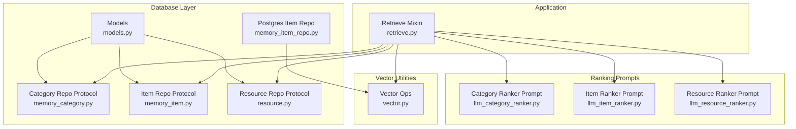
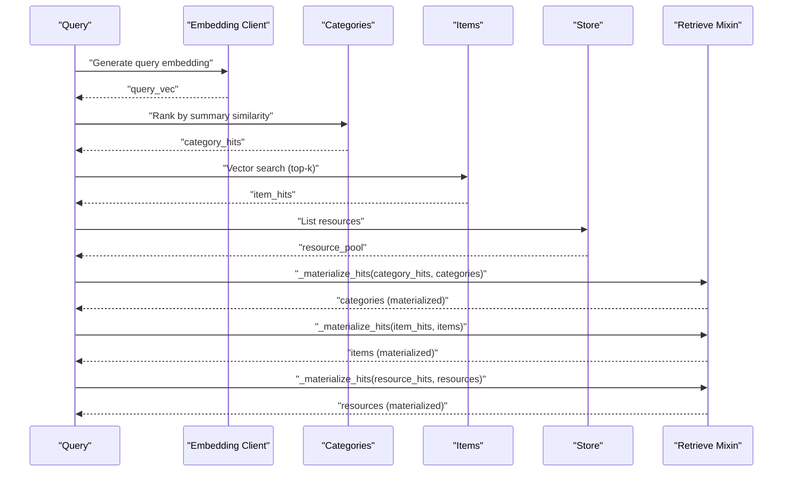
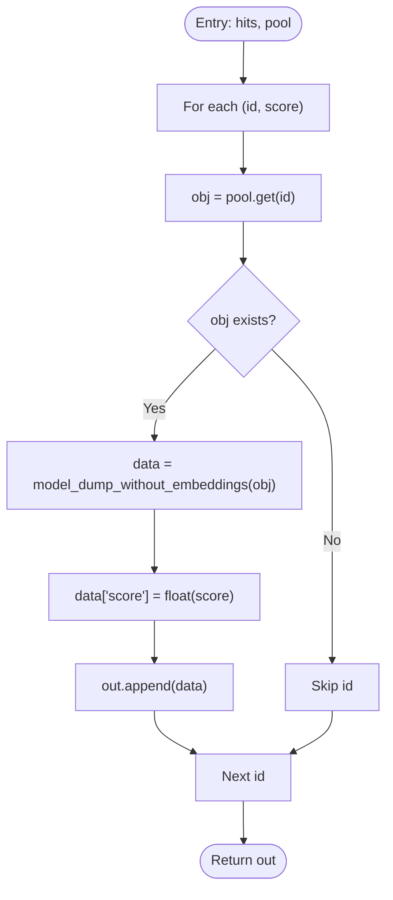
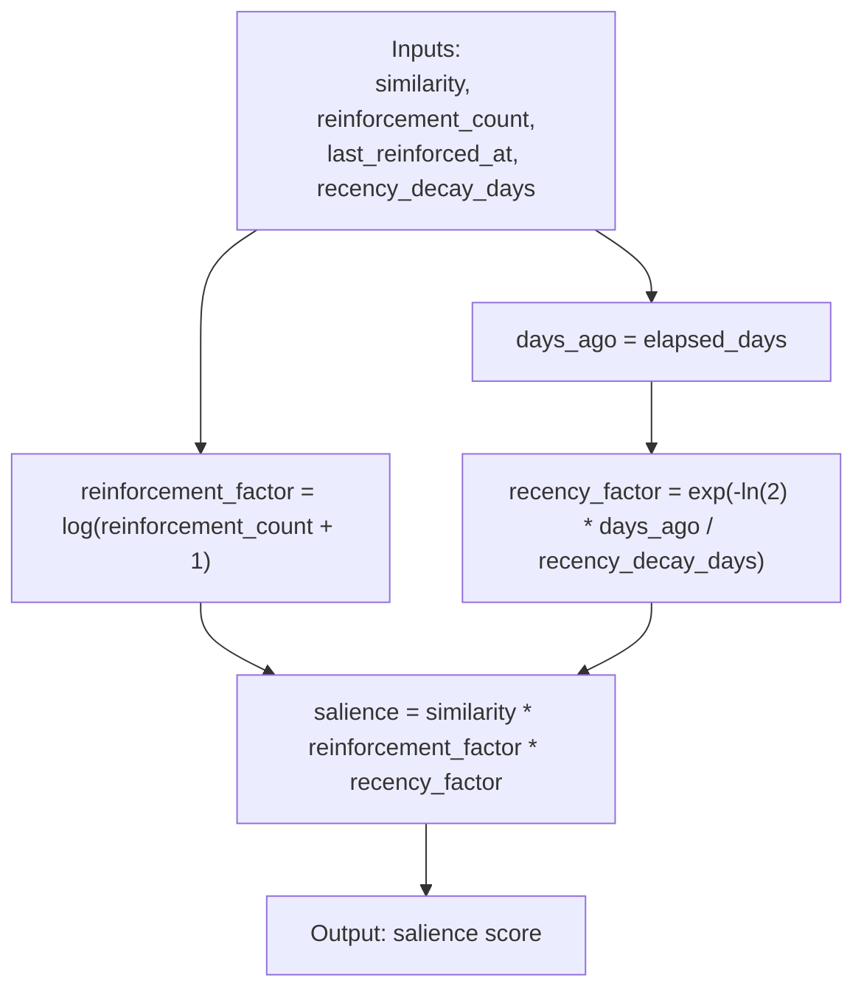
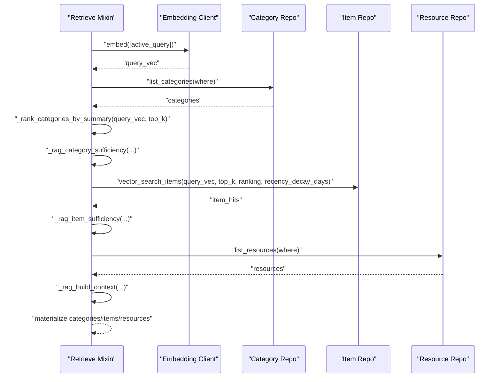
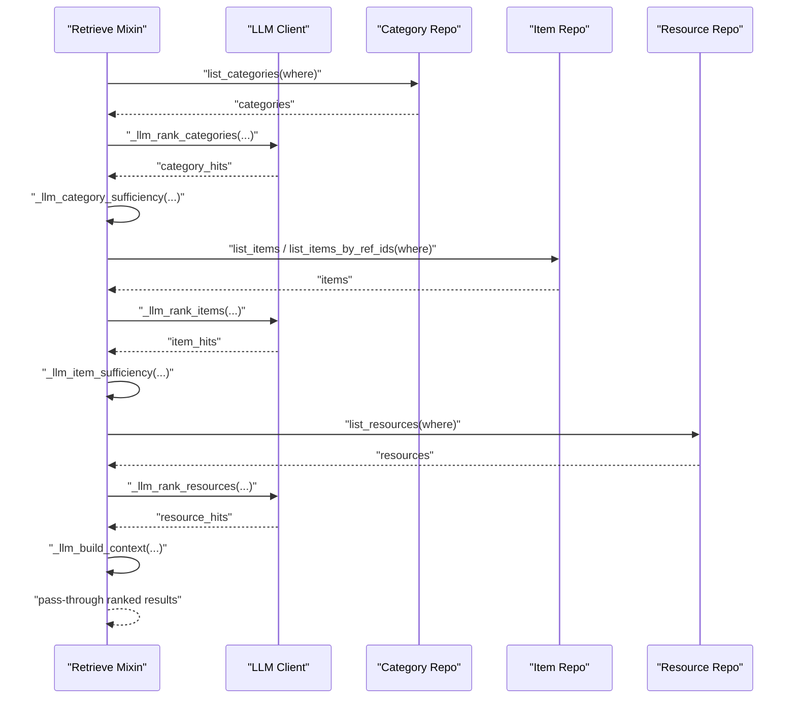
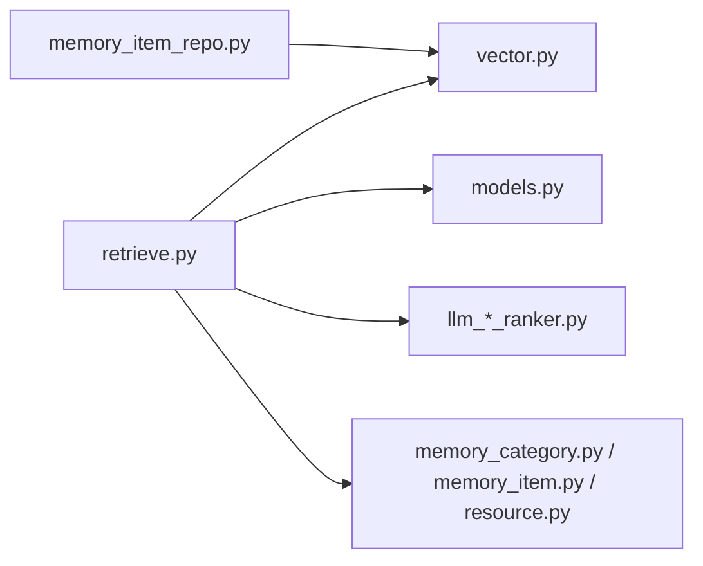

# Hit Materialization and Scoring

<cite>
**Referenced Files in This Document**
- [retrieve.py](file://src/memu/app/retrieve.py)
- [vector.py](file://src/memu/database/inmemory/vector.py)
- [memory_item_repo.py](file://src/memu/database/postgres/repositories/memory_item_repo.py)
- [models.py](file://src/memu/database/models.py)
- [memory_category.py](file://src/memu/database/repositories/memory_category.py)
- [memory_item.py](file://src/memu/database/repositories/memory_item.py)
- [resource.py](file://src/memu/database/repositories/resource.py)
- [llm_category_ranker.py](file://src/memu/prompts/retrieve/llm_category_ranker.py)
- [llm_item_ranker.py](file://src/memu/prompts/retrieve/llm_item_ranker.py)
- [llm_resource_ranker.py](file://src/memu/prompts/retrieve/llm_resource_ranker.py)
- [doc1.txt](file://examples/resources/docs/doc1.txt)
- [test_salience.py](file://tests/test_salience.py)
</cite>

## Table of Contents
1. [Introduction](#introduction)
2. [Project Structure](#project-structure)
3. [Core Components](#core-components)
4. [Architecture Overview](#architecture-overview)
5. [Detailed Component Analysis](#detailed-component-analysis)
6. [Dependency Analysis](#dependency-analysis)
7. [Performance Considerations](#performance-considerations)
8. [Troubleshooting Guide](#troubleshooting-guide)
9. [Conclusion](#conclusion)

## Introduction
This document explains how retrieval results are transformed into structured, materialized objects and how scoring works across categories, items, and resources. It focuses on:
- The _materialize_hits function that converts raw hit tuples into rich context objects with metadata, scores, and relationships
- Scoring mechanisms for categories, items, and resources, including vector similarity scores, recency decay calculations, and ranking algorithms
- Differences between RAG and LLM retrieval modes
- Practical examples of materializing category, item, and resource hits
- Performance optimization and memory management strategies for large hit sets

## Project Structure
The retrieval and materialization logic spans several modules:
- Application-level retrieval orchestration and materialization
- Vector similarity and salience scoring utilities
- Database models and repository interfaces
- LLM prompts for ranking in LLM mode
- Example documentation describing retrieval strategies

**Diagram sources**
- [retrieve.py](file://src/memu/app/retrieve.py#L1-L120)
- [vector.py](file://src/memu/database/inmemory/vector.py#L1-L138)
- [models.py](file://src/memu/database/models.py#L68-L106)
- [memory_category.py](file://src/memu/database/repositories/memory_category.py#L9-L34)
- [memory_item.py](file://src/memu/database/repositories/memory_item.py#L9-L55)
- [resource.py](file://src/memu/database/repositories/resource.py#L9-L31)
- [memory_item_repo.py](file://src/memu/database/postgres/repositories/memory_item_repo.py#L330-L373)
- [llm_category_ranker.py](file://src/memu/prompts/retrieve/llm_category_ranker.py#L1-L36)
- [llm_item_ranker.py](file://src/memu/prompts/retrieve/llm_item_ranker.py#L1-L41)
- [llm_resource_ranker.py](file://src/memu/prompts/retrieve/llm_resource_ranker.py#L1-L41)

**Section sources**
- [retrieve.py](file://src/memu/app/retrieve.py#L1-L120)
- [vector.py](file://src/memu/database/inmemory/vector.py#L1-L138)
- [models.py](file://src/memu/database/models.py#L68-L106)
- [memory_category.py](file://src/memu/database/repositories/memory_category.py#L9-L34)
- [memory_item.py](file://src/memu/database/repositories/memory_item.py#L9-L55)
- [resource.py](file://src/memu/database/repositories/resource.py#L9-L31)
- [memory_item_repo.py](file://src/memu/database/postgres/repositories/memory_item_repo.py#L330-L373)
- [llm_category_ranker.py](file://src/memu/prompts/retrieve/llm_category_ranker.py#L1-L36)
- [llm_item_ranker.py](file://src/memu/prompts/retrieve/llm_item_ranker.py#L1-L41)
- [llm_resource_ranker.py](file://src/memu/prompts/retrieve/llm_resource_ranker.py#L1-L41)

## Core Components
- _materialize_hits: Transforms raw (id, score) tuples into structured dictionaries by fetching objects from pools and attaching scores
- Vector similarity and salience scoring: Computes cosine similarity and optionally adjusts by reinforcement count and recency
- RAG vs LLM retrieval modes: Two distinct pipelines for ranking and assembling results
- Repository interfaces and models: Define the data structures and operations used by retrieval

Key responsibilities:
- Materialization: Attach score and sanitized model data to each hit
- Scoring: Vector similarity or salience-aware scoring with configurable recency decay
- Formatting: Human-readable context snippets for sufficiency checks
- Ranking: LLM-driven ranking prompts for categories, items, and resources

**Section sources**
- [retrieve.py](file://src/memu/app/retrieve.py#L943-L952)
- [vector.py](file://src/memu/database/inmemory/vector.py#L16-L53)
- [memory_item_repo.py](file://src/memu/database/postgres/repositories/memory_item_repo.py#L337-L349)
- [models.py](file://src/memu/database/models.py#L68-L106)

## Architecture Overview
The retrieval system supports two primary modes:

RAG mode:
- Embeddings are generated for queries
- Categories are ranked by summary similarity
- Items are retrieved via vector search with optional salience scoring
- Resources are retrieved via caption embeddings
- Results are materialized and assembled into a unified context

LLM mode:
- LLM ranks categories, items, and resources using dedicated prompts
- Query rewriting and sufficiency checks occur iteratively
- Final results are assembled without explicit vector scoring

**Diagram sources**
- [retrieve.py](file://src/memu/app/retrieve.py#L260-L286)
- [retrieve.py](file://src/memu/app/retrieve.py#L346-L367)
- [retrieve.py](file://src/memu/app/retrieve.py#L400-L424)
- [retrieve.py](file://src/memu/app/retrieve.py#L426-L452)
- [vector.py](file://src/memu/database/inmemory/vector.py#L56-L91)

**Section sources**
- [retrieve.py](file://src/memu/app/retrieve.py#L106-L210)
- [retrieve.py](file://src/memu/app/retrieve.py#L454-L536)
- [doc1.txt](file://examples/resources/docs/doc1.txt#L148-L192)

## Detailed Component Analysis

### Materialization: _materialize_hits
_materialize_hits takes a sequence of (id, score) pairs and a pool dictionary, fetches the corresponding objects, dumps them to dictionaries while excluding embeddings, and attaches the score. This ensures downstream consumers receive rich, structured objects with confidence scores.

**Diagram sources**
- [retrieve.py](file://src/memu/app/retrieve.py#L943-L952)

**Section sources**
- [retrieve.py](file://src/memu/app/retrieve.py#L943-L952)

### Scoring Mechanisms

#### Vector Similarity
- Cosine similarity is computed between query and candidate embeddings
- For large corpora, vectorized computation and argpartition-based top-k selection minimize cost

**Section sources**
- [vector.py](file://src/memu/database/inmemory/vector.py#L11-L13)
- [vector.py](file://src/memu/database/inmemory/vector.py#L56-L91)

#### Salience-Aware Scoring
Salience combines:
- Similarity: cosine similarity score
- Reinforcement: logarithmic factor of reinforcement count
- Recency: exponential decay factor based on days since last reinforcement

**Diagram sources**
- [vector.py](file://src/memu/database/inmemory/vector.py#L16-L53)
- [memory_item_repo.py](file://src/memu/database/postgres/repositories/memory_item_repo.py#L357-L373)
- [test_salience.py](file://tests/test_salience.py#L51-L68)

**Section sources**
- [vector.py](file://src/memu/database/inmemory/vector.py#L16-L53)
- [memory_item_repo.py](file://src/memu/database/postgres/repositories/memory_item_repo.py#L337-L349)
- [memory_item_repo.py](file://src/memu/database/postgres/repositories/memory_item_repo.py#L357-L373)
- [test_salience.py](file://tests/test_salience.py#L138-L157)

### RAG Mode: Hierarchical Retrieval and Materialization
RAG mode follows a deterministic pipeline:
- Route intention and optional query rewriting
- Category ranking by summary similarity
- Sufficiency check after categories
- Item recall via vector search with optional salience scoring
- Sufficiency check after items
- Resource recall via caption embeddings
- Final materialization of all tiers

**Diagram sources**
- [retrieve.py](file://src/memu/app/retrieve.py#L260-L286)
- [retrieve.py](file://src/memu/app/retrieve.py#L346-L367)
- [retrieve.py](file://src/memu/app/retrieve.py#L400-L424)
- [retrieve.py](file://src/memu/app/retrieve.py#L426-L452)

**Section sources**
- [retrieve.py](file://src/memu/app/retrieve.py#L106-L210)
- [retrieve.py](file://src/memu/app/retrieve.py#L260-L286)
- [retrieve.py](file://src/memu/app/retrieve.py#L346-L367)
- [retrieve.py](file://src/memu/app/retrieve.py#L400-L424)
- [retrieve.py](file://src/memu/app/retrieve.py#L426-L452)
- [doc1.txt](file://examples/resources/docs/doc1.txt#L148-L192)

### LLM Mode: Hierarchical LLM Ranking and Materialization
LLM mode uses prompts to rank categories, items, and resources:
- Category ranking prompt selects and orders relevant categories
- Item ranking prompt narrows to items within relevant categories
- Resource ranking prompt selects relevant resources given context
- Materialization passes through raw ranked results without recomputation

**Diagram sources**
- [retrieve.py](file://src/memu/app/retrieve.py#L570-L588)
- [retrieve.py](file://src/memu/app/retrieve.py#L615-L657)
- [retrieve.py](file://src/memu/app/retrieve.py#L684-L706)
- [retrieve.py](file://src/memu/app/retrieve.py#L708-L723)
- [llm_category_ranker.py](file://src/memu/prompts/retrieve/llm_category_ranker.py#L1-L36)
- [llm_item_ranker.py](file://src/memu/prompts/retrieve/llm_item_ranker.py#L1-L41)
- [llm_resource_ranker.py](file://src/memu/prompts/retrieve/llm_resource_ranker.py#L1-L41)

**Section sources**
- [retrieve.py](file://src/memu/app/retrieve.py#L454-L536)
- [retrieve.py](file://src/memu/app/retrieve.py#L570-L588)
- [retrieve.py](file://src/memu/app/retrieve.py#L615-L657)
- [retrieve.py](file://src/memu/app/retrieve.py#L684-L706)
- [retrieve.py](file://src/memu/app/retrieve.py#L708-L723)
- [llm_category_ranker.py](file://src/memu/prompts/retrieve/llm_category_ranker.py#L1-L36)
- [llm_item_ranker.py](file://src/memu/prompts/retrieve/llm_item_ranker.py#L1-L41)
- [llm_resource_ranker.py](file://src/memu/prompts/retrieve/llm_resource_ranker.py#L1-L41)

### Data Models and Repositories
- MemoryCategory: name, description, optional embedding and summary
- MemoryItem: memory_type, summary, optional embedding, timestamps, and extra metadata (including reinforcement tracking)
- Resource: url, modality, local_path, optional caption and embedding

Repository protocols define list and search operations used by retrieval.

**Section sources**
- [models.py](file://src/memu/database/models.py#L68-L106)
- [memory_category.py](file://src/memu/database/repositories/memory_category.py#L9-L34)
- [memory_item.py](file://src/memu/database/repositories/memory_item.py#L9-L55)
- [resource.py](file://src/memu/database/repositories/resource.py#L9-L31)

### Examples: Materializing Hits

- Category hits: Materialized with name, summary, and score; formatted for sufficiency checks
- Item hits: Materialized with memory_type, summary, and score; formatted for sufficiency checks
- Resource hits: Materialized with caption or URL and score; captions are preferred for readability

**Section sources**
- [retrieve.py](file://src/memu/app/retrieve.py#L954-L994)
- [retrieve.py](file://src/memu/app/retrieve.py#L442-L450)

## Dependency Analysis
The retrieval module depends on:
- Vector utilities for similarity and salience computations
- Repository interfaces for listing and searching
- LLM prompts for ranking in LLM mode
- Models for typed data structures

**Diagram sources**
- [retrieve.py](file://src/memu/app/retrieve.py#L1-L18)
- [vector.py](file://src/memu/database/inmemory/vector.py#L1-L138)
- [models.py](file://src/memu/database/models.py#L68-L106)
- [memory_category.py](file://src/memu/database/repositories/memory_category.py#L9-L34)
- [memory_item.py](file://src/memu/database/repositories/memory_item.py#L9-L55)
- [resource.py](file://src/memu/database/repositories/resource.py#L9-L31)
- [memory_item_repo.py](file://src/memu/database/postgres/repositories/memory_item_repo.py#L330-L373)

**Section sources**
- [retrieve.py](file://src/memu/app/retrieve.py#L1-L18)
- [vector.py](file://src/memu/database/inmemory/vector.py#L1-L138)
- [models.py](file://src/memu/database/models.py#L68-L106)
- [memory_category.py](file://src/memu/database/repositories/memory_category.py#L9-L34)
- [memory_item.py](file://src/memu/database/repositories/memory_item.py#L9-L55)
- [resource.py](file://src/memu/database/repositories/resource.py#L9-L31)
- [memory_item_repo.py](file://src/memu/database/postgres/repositories/memory_item_repo.py#L330-L373)

## Performance Considerations
- Vectorized similarity: Uses NumPy to compute all cosine similarities at once, reducing Python loop overhead
- Top-k selection: argpartition-based selection avoids full sorting for large corpora
- Salience scoring: Applies logarithmic and exponential factors efficiently; avoid unnecessary recomputation by caching similarity where possible
- Materialization: Skips missing objects and excludes embeddings to reduce payload sizes
- LLM mode: Avoids heavy vector computations; relies on LLM ranking prompts and iterative sufficiency checks

[No sources needed since this section provides general guidance]

## Troubleshooting Guide
Common issues and remedies:
- Missing embeddings: cosine_topk skips entries with None embeddings; ensure embeddings are populated before retrieval
- Unknown recency: salience_score applies a neutral factor when last_reinforced_at is None; populate extra fields for accurate recency
- Insufficient results: Increase top_k or adjust ranking mode; verify where filters are not overly restrictive
- Score anomalies: Verify recency_decay_days and reinforcement_count values; confirm timezones are handled consistently

**Section sources**
- [vector.py](file://src/memu/database/inmemory/vector.py#L61-L70)
- [vector.py](file://src/memu/database/inmemory/vector.py#L45-L51)
- [memory_item_repo.py](file://src/memu/database/postgres/repositories/memory_item_repo.py#L330-L354)
- [test_salience.py](file://tests/test_salience.py#L180-L193)

## Conclusion
The retrieval system provides robust, extensible materialization and scoring across categories, items, and resources. RAG mode offers fast, deterministic results with vector similarity and optional salience-aware ranking, while LLM mode enables nuanced, context-aware ranking guided by prompts. Proper configuration of top_k, ranking mode, and recency decay yields effective trade-offs between speed, accuracy, and relevance.