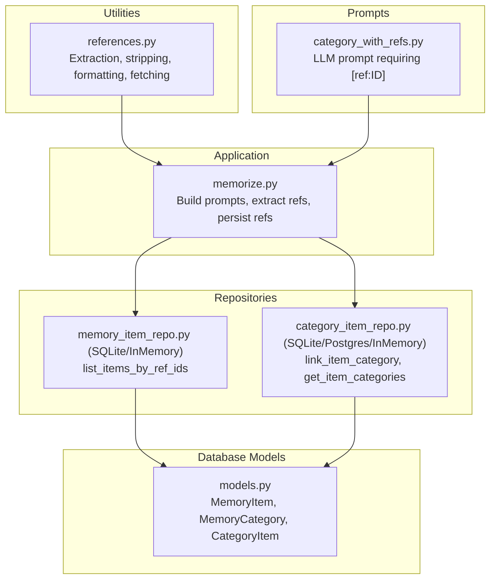
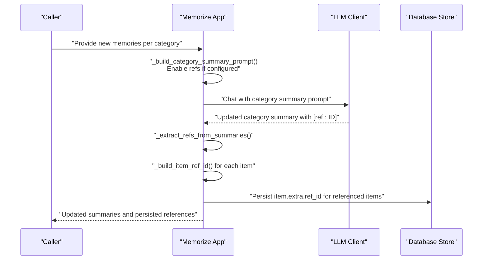
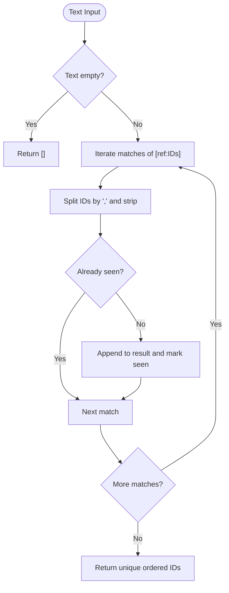
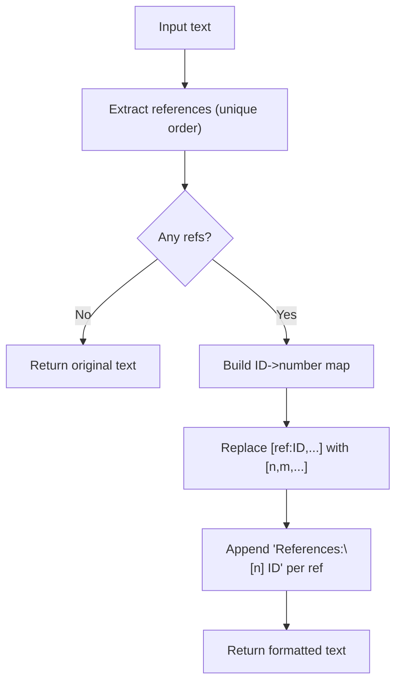
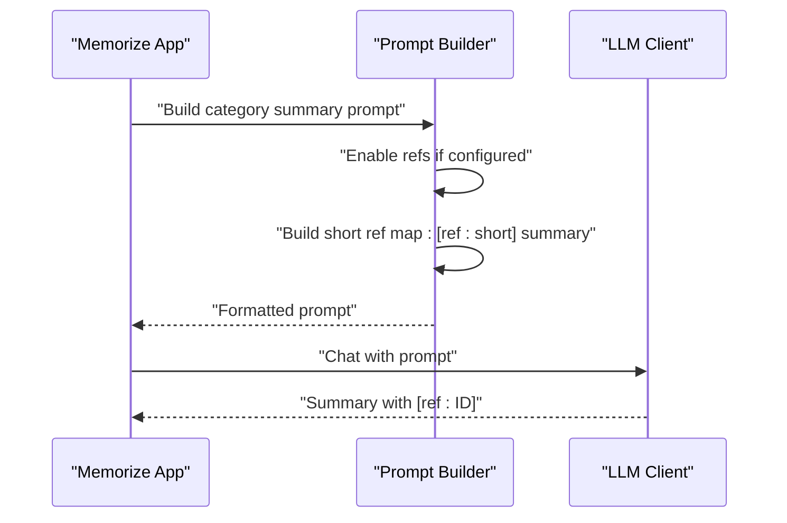
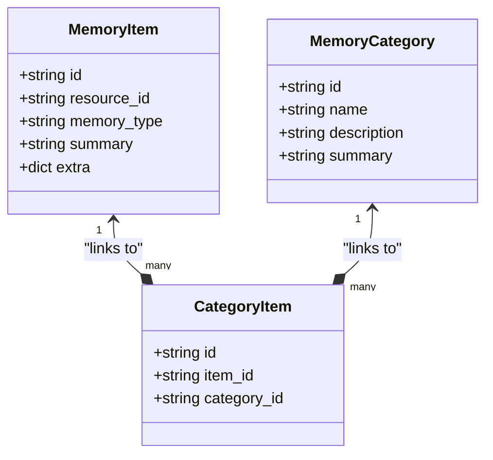
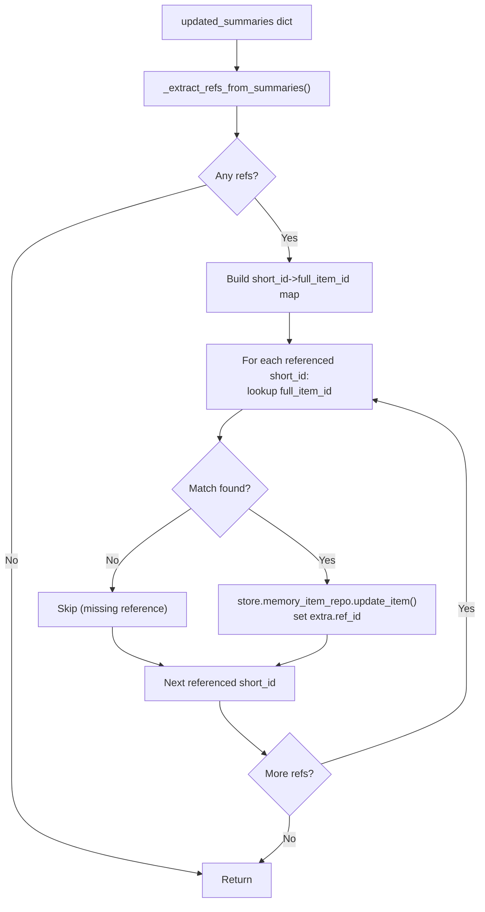
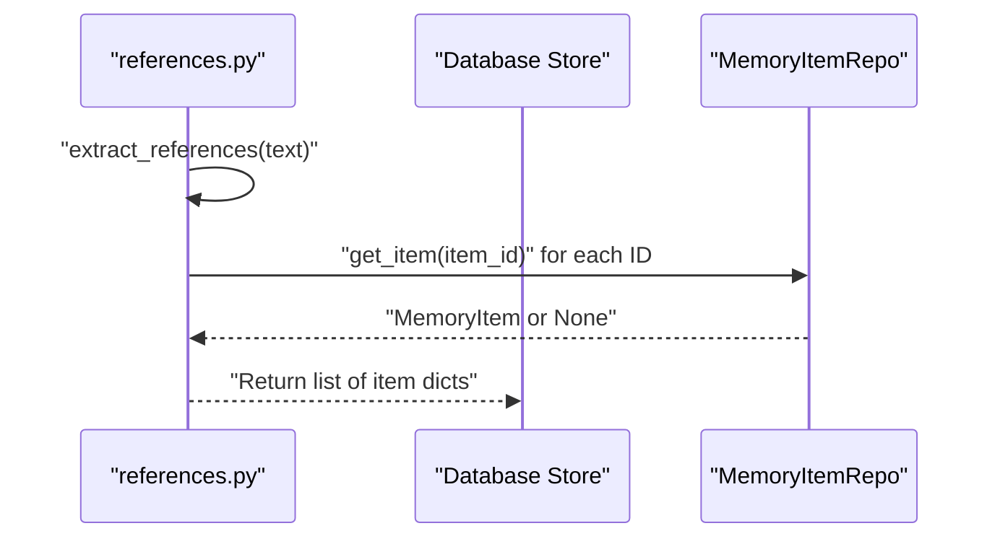
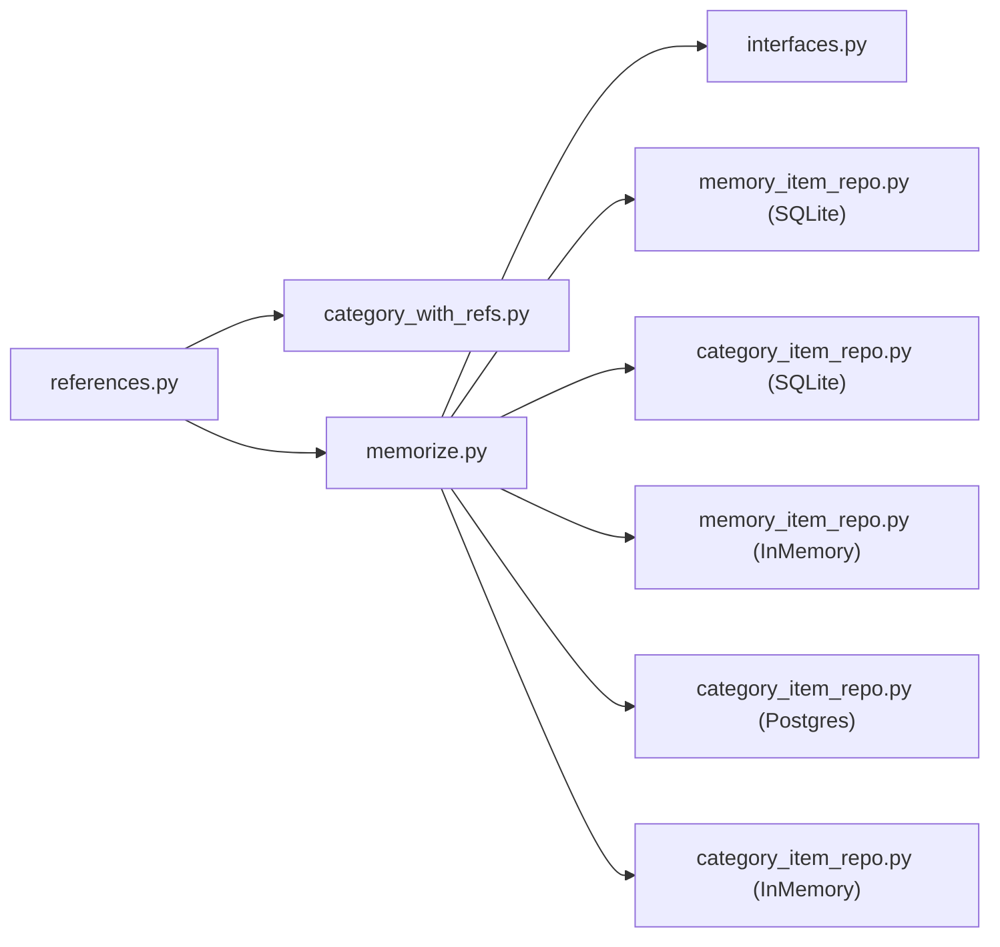

# Reference Resolution and Cross-linking

<cite>
**Referenced Files in This Document**
- [references.py](file://src/memu/utils/references.py)
- [category_with_refs.py](file://src/memu/prompts/category_summary/category_with_refs.py)
- [memorize.py](file://src/memu/app/memorize.py)
- [models.py](file://src/memu/database/models.py)
- [interfaces.py](file://src/memu/database/interfaces.py)
- [memory_item_repo.py (SQLite)](file://src/memu/database/sqlite/repositories/memory_item_repo.py)
- [memory_item_repo.py (InMemory)](file://src/memu/database/inmemory/repositories/memory_item_repo.py)
- [category_item_repo.py (SQLite)](file://src/memu/database/sqlite/repositories/category_item_repo.py)
- [category_item_repo.py (Postgres)](file://src/memu/database/postgres/repositories/category_item_repo.py)
- [category_item_repo.py (InMemory)](file://src/memu/database/inmemory/repositories/category_item_repo.py)
- [test_references.py](file://tests/test_references.py)
</cite>

## Table of Contents
1. [Introduction](#introduction)
2. [Project Structure](#project-structure)
3. [Core Components](#core-components)
4. [Architecture Overview](#architecture-overview)
5. [Detailed Component Analysis](#detailed-component-analysis)
6. [Dependency Analysis](#dependency-analysis)
7. [Performance Considerations](#performance-considerations)
8. [Troubleshooting Guide](#troubleshooting-guide)
9. [Conclusion](#conclusion)

## Introduction
This document explains the reference resolution and cross-linking system used to extract and resolve cross-references between categories and items. It focuses on how category summaries embed inline references to memory items, how those references are extracted and resolved, and how cross-links are established and maintained. It also covers the relationship mapping between categories and items, performance considerations for large knowledge bases, and strategies for handling broken or missing references.

## Project Structure
The reference resolution system spans several modules:
- Utilities for parsing and formatting references
- Prompts that require references in category summaries
- Application logic that orchestrates reference-aware summarization and persistence
- Database models and repositories that store and query references
- Tests validating the behavior of reference extraction and formatting

**Diagram sources**
- [references.py](file://src/memu/utils/references.py#L1-L173)
- [category_with_refs.py](file://src/memu/prompts/category_summary/category_with_refs.py#L1-L141)
- [memorize.py](file://src/memu/app/memorize.py#L981-L1037)
- [models.py](file://src/memu/database/models.py#L76-L106)
- [memory_item_repo.py (SQLite)](file://src/memu/database/sqlite/repositories/memory_item_repo.py#L119-L151)
- [category_item_repo.py (SQLite)](file://src/memu/database/sqlite/repositories/category_item_repo.py#L84-L173)

**Section sources**
- [references.py](file://src/memu/utils/references.py#L1-L173)
- [category_with_refs.py](file://src/memu/prompts/category_summary/category_with_refs.py#L1-L141)
- [memorize.py](file://src/memu/app/memorize.py#L981-L1037)
- [models.py](file://src/memu/database/models.py#L76-L106)
- [memory_item_repo.py (SQLite)](file://src/memu/database/sqlite/repositories/memory_item_repo.py#L119-L151)
- [category_item_repo.py (SQLite)](file://src/memu/database/sqlite/repositories/category_item_repo.py#L84-L173)

## Core Components
- Reference extraction and normalization: Extracts unique item IDs from inline references in category summaries.
- Reference stripping: Removes inline references for clean display.
- Citation formatting: Converts inline references to numbered citations with a reference list.
- Reference-aware item fetching: Resolves referenced IDs to actual memory items.
- Short reference IDs: Generates short identifiers for items included in prompts and maps them back to full IDs during persistence.
- Relationship mapping: Maintains links between items and categories via a junction table.

Key implementation references:
- Extraction and helpers: [references.py](file://src/memu/utils/references.py#L20-L173)
- Prompt requiring references: [category_with_refs.py](file://src/memu/prompts/category_summary/category_with_refs.py#L1-L141)
- Short ID mapping and persistence: [memorize.py](file://src/memu/app/memorize.py#L981-L1037)
- Item and category models: [models.py](file://src/memu/database/models.py#L76-L106)
- Item lookup by ref_id: [memory_item_repo.py (SQLite)](file://src/memu/database/sqlite/repositories/memory_item_repo.py#L119-L151), [memory_item_repo.py (InMemory)](file://src/memu/database/inmemory/repositories/memory_item_repo.py#L27-L51)
- Category-item relations: [category_item_repo.py (SQLite)](file://src/memu/database/sqlite/repositories/category_item_repo.py#L84-L173), [category_item_repo.py (Postgres)](file://src/memu/database/postgres/repositories/category_item_repo.py#L35-L87), [category_item_repo.py (InMemory)](file://src/memu/database/inmemory/repositories/category_item_repo.py#L24-L42)

**Section sources**
- [references.py](file://src/memu/utils/references.py#L20-L173)
- [category_with_refs.py](file://src/memu/prompts/category_summary/category_with_refs.py#L1-L141)
- [memorize.py](file://src/memu/app/memorize.py#L981-L1037)
- [models.py](file://src/memu/database/models.py#L76-L106)
- [memory_item_repo.py (SQLite)](file://src/memu/database/sqlite/repositories/memory_item_repo.py#L119-L151)
- [memory_item_repo.py (InMemory)](file://src/memu/database/inmemory/repositories/memory_item_repo.py#L27-L51)
- [category_item_repo.py (SQLite)](file://src/memu/database/sqlite/repositories/category_item_repo.py#L84-L173)
- [category_item_repo.py (Postgres)](file://src/memu/database/postgres/repositories/category_item_repo.py#L35-L87)
- [category_item_repo.py (InMemory)](file://src/memu/database/inmemory/repositories/category_item_repo.py#L24-L42)

## Architecture Overview
The reference resolution pipeline integrates LLM-driven category summarization with database-backed reference tracking and cross-linking.

**Diagram sources**
- [memorize.py](file://src/memu/app/memorize.py#L1038-L1139)
- [category_with_refs.py](file://src/memu/prompts/category_summary/category_with_refs.py#L1-L141)
- [references.py](file://src/memu/utils/references.py#L20-L48)

## Detailed Component Analysis

### Reference Extraction and Parsing
The system uses a regular expression pattern to detect inline references of the form [ref:ID] and supports comma-separated IDs within a single reference. It ensures uniqueness and strips whitespace.

**Diagram sources**
- [references.py](file://src/memu/utils/references.py#L20-L48)

**Section sources**
- [references.py](file://src/memu/utils/references.py#L20-L48)

### Reference Stripping and Citation Formatting
- Stripping removes inline references and normalizes spacing/punctuation for clean display.
- Citation formatting converts inline references to numbered citations and appends a reference list.

**Diagram sources**
- [references.py](file://src/memu/utils/references.py#L77-L115)

**Section sources**
- [references.py](file://src/memu/utils/references.py#L77-L115)

### Reference-Aware Category Summary Generation
The application builds a category summary prompt that requires inline references for new information. It also constructs a short reference map for the LLM to choose from.

**Diagram sources**
- [memorize.py](file://src/memu/app/memorize.py#L1038-L1098)
- [category_with_refs.py](file://src/memu/prompts/category_summary/category_with_refs.py#L1-L141)
- [references.py](file://src/memu/utils/references.py#L149-L172)

**Section sources**
- [memorize.py](file://src/memu/app/memorize.py#L1038-L1098)
- [category_with_refs.py](file://src/memu/prompts/category_summary/category_with_refs.py#L1-L141)
- [references.py](file://src/memu/utils/references.py#L149-L172)

### Relationship Mapping Between Categories and Items
Items are linked to categories via a junction table. The system provides:
- Link creation and removal
- Retrieval of categories for a given item
- Listing relations with filtering

**Diagram sources**
- [models.py](file://src/memu/database/models.py#L76-L106)
- [category_item_repo.py (SQLite)](file://src/memu/database/sqlite/repositories/category_item_repo.py#L84-L173)
- [category_item_repo.py (Postgres)](file://src/memu/database/postgres/repositories/category_item_repo.py#L35-L87)
- [category_item_repo.py (InMemory)](file://src/memu/database/inmemory/repositories/category_item_repo.py#L24-L42)

**Section sources**
- [models.py](file://src/memu/database/models.py#L76-L106)
- [category_item_repo.py (SQLite)](file://src/memu/database/sqlite/repositories/category_item_repo.py#L84-L173)
- [category_item_repo.py (Postgres)](file://src/memu/database/postgres/repositories/category_item_repo.py#L35-L87)
- [category_item_repo.py (InMemory)](file://src/memu/database/inmemory/repositories/category_item_repo.py#L24-L42)

### Persisting References to Items
After generating summaries, the system extracts referenced short IDs and persists them into the items’ extra metadata. This enables later retrieval of referenced items.

**Diagram sources**
- [memorize.py](file://src/memu/app/memorize.py#L984-L1037)
- [interfaces.py](file://src/memu/database/interfaces.py#L12-L26)

**Section sources**
- [memorize.py](file://src/memu/app/memorize.py#L984-L1037)
- [interfaces.py](file://src/memu/database/interfaces.py#L12-L26)

### Resolving References to Actual Memory Items
There are two complementary mechanisms:
- Direct resolution: Extract referenced IDs and fetch items from the store.
- Reverse lookup: Query items whose extra.ref_id matches a set of short IDs.

**Diagram sources**
- [references.py](file://src/memu/utils/references.py#L118-L146)
- [interfaces.py](file://src/memu/database/interfaces.py#L12-L26)
- [memory_item_repo.py (SQLite)](file://src/memu/database/sqlite/repositories/memory_item_repo.py#L119-L151)
- [memory_item_repo.py (InMemory)](file://src/memu/database/inmemory/repositories/memory_item_repo.py#L27-L51)

**Section sources**
- [references.py](file://src/memu/utils/references.py#L118-L146)
- [interfaces.py](file://src/memu/database/interfaces.py#L12-L26)
- [memory_item_repo.py (SQLite)](file://src/memu/database/sqlite/repositories/memory_item_repo.py#L119-L151)
- [memory_item_repo.py (InMemory)](file://src/memu/database/inmemory/repositories/memory_item_repo.py#L27-L51)

## Dependency Analysis
The reference system depends on:
- Regex-based parsing for inline references
- Prompt templates that enforce reference inclusion
- Short ID mapping for prompts and reverse mapping for persistence
- Database repositories supporting both forward and reverse reference queries

**Diagram sources**
- [references.py](file://src/memu/utils/references.py#L1-L173)
- [category_with_refs.py](file://src/memu/prompts/category_summary/category_with_refs.py#L1-L141)
- [memorize.py](file://src/memu/app/memorize.py#L981-L1037)
- [interfaces.py](file://src/memu/database/interfaces.py#L12-L26)
- [memory_item_repo.py (SQLite)](file://src/memu/database/sqlite/repositories/memory_item_repo.py#L119-L151)
- [category_item_repo.py (SQLite)](file://src/memu/database/sqlite/repositories/category_item_repo.py#L84-L173)
- [memory_item_repo.py (InMemory)](file://src/memu/database/inmemory/repositories/memory_item_repo.py#L27-L51)
- [category_item_repo.py (Postgres)](file://src/memu/database/postgres/repositories/category_item_repo.py#L35-L87)
- [category_item_repo.py (InMemory)](file://src/memu/database/inmemory/repositories/category_item_repo.py#L24-L42)

**Section sources**
- [references.py](file://src/memu/utils/references.py#L1-L173)
- [category_with_refs.py](file://src/memu/prompts/category_summary/category_with_refs.py#L1-L141)
- [memorize.py](file://src/memu/app/memorize.py#L981-L1037)
- [interfaces.py](file://src/memu/database/interfaces.py#L12-L26)
- [memory_item_repo.py (SQLite)](file://src/memu/database/sqlite/repositories/memory_item_repo.py#L119-L151)
- [category_item_repo.py (SQLite)](file://src/memu/database/sqlite/repositories/category_item_repo.py#L84-L173)
- [memory_item_repo.py (InMemory)](file://src/memu/database/inmemory/repositories/memory_item_repo.py#L27-L51)
- [category_item_repo.py (Postgres)](file://src/memu/database/postgres/repositories/category_item_repo.py#L35-L87)
- [category_item_repo.py (InMemory)](file://src/memu/database/inmemory/repositories/category_item_repo.py#L24-L42)

## Performance Considerations
- Regex scanning: Linear in text length; efficient for typical summary sizes.
- Unique ID extraction: Uses a set for O(1) dedup checks; overall linear in number of matches.
- Short ID mapping: One pass over items in category_updates; constant-time lookups.
- Database queries:
  - Forward lookup: One item fetch per referenced ID; batch by ID list if needed.
  - Reverse lookup: JSON extraction and IN-list scan; consider indexing extra fields if supported by backend.
- Parallelism: LLM calls for multiple categories can be executed concurrently; ensure thread-safe repository usage.
- Caching: Keep recent items and relations cached in-memory to reduce repeated lookups.

[No sources needed since this section provides general guidance]

## Troubleshooting Guide
Common issues and resolutions:
- Missing references in summaries: Ensure the prompt requires [ref:ID] and that new items are passed as (id, summary) tuples when reference mode is enabled.
- Broken references: During persistence, missing matches are skipped; verify item IDs exist and were created before summarization.
- Duplicate references: Extraction guarantees uniqueness; verify the input text does not repeat the same ID unnecessarily.
- Display artifacts: Use stripping to remove inline references for clean rendering; verify punctuation normalization.
- Reverse lookup failures: Confirm that items were persisted with extra.ref_id and that the ref_id values are correct.

Validation references:
- Tests for extraction, stripping, citation formatting, and round-trip behavior: [test_references.py](file://tests/test_references.py#L1-L192)

**Section sources**
- [test_references.py](file://tests/test_references.py#L1-L192)

## Conclusion
The reference resolution and cross-linking system combines structured prompts, robust parsing, and database-backed persistence to maintain traceable links between category summaries and memory items. By enforcing inline references, mapping short IDs during prompting, and persisting ref_id metadata, the system enables reliable cross-linking and retrieval. For large-scale knowledge bases, careful attention to regex efficiency, caching, and database indexing will ensure responsive performance while maintaining data integrity.