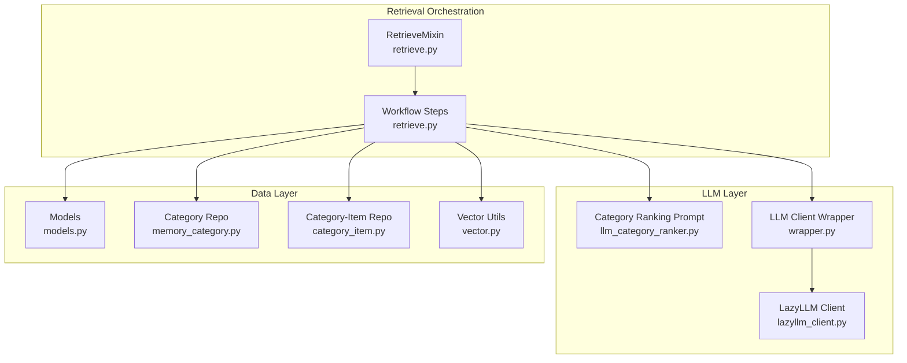
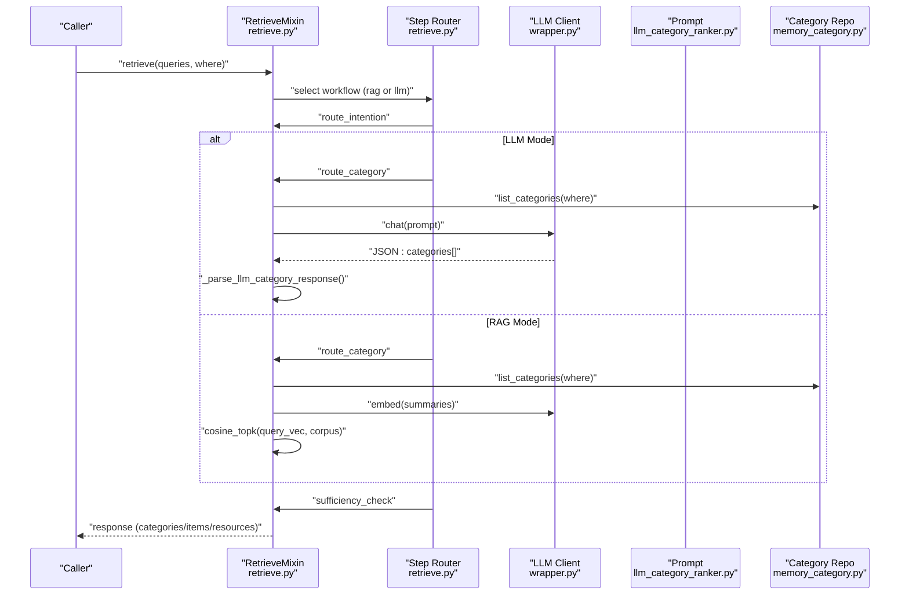
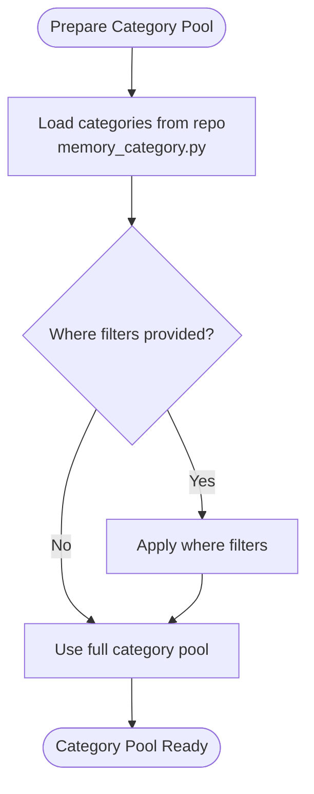
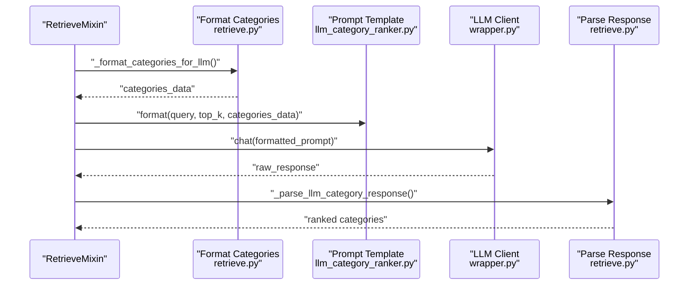
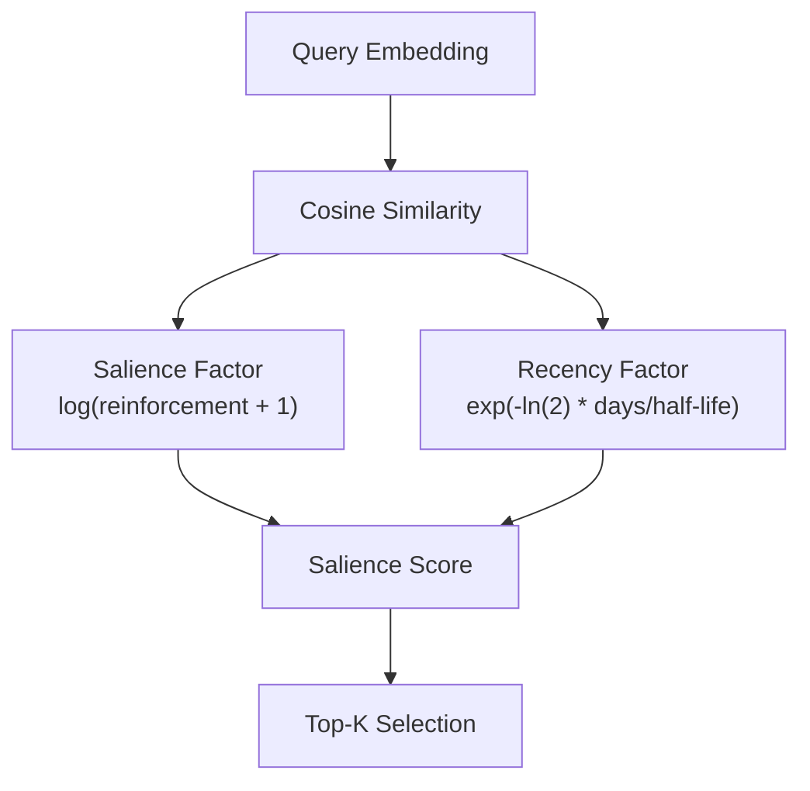
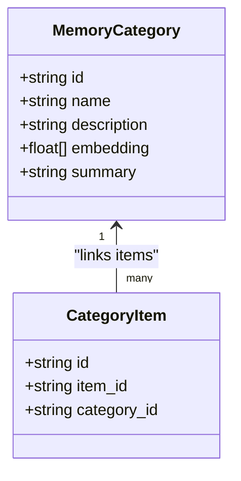
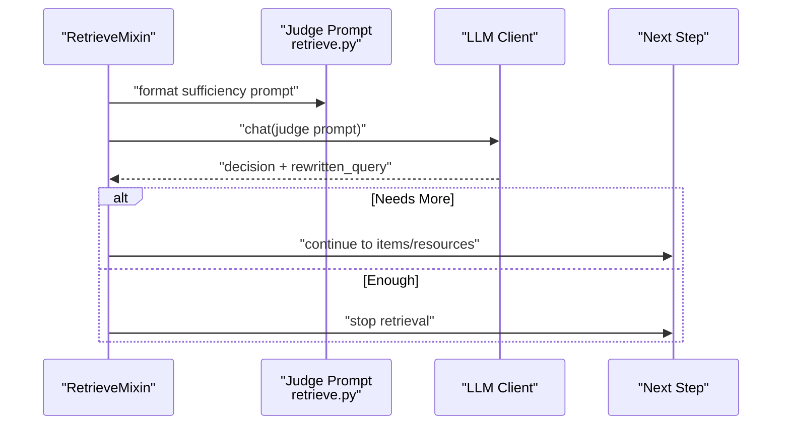
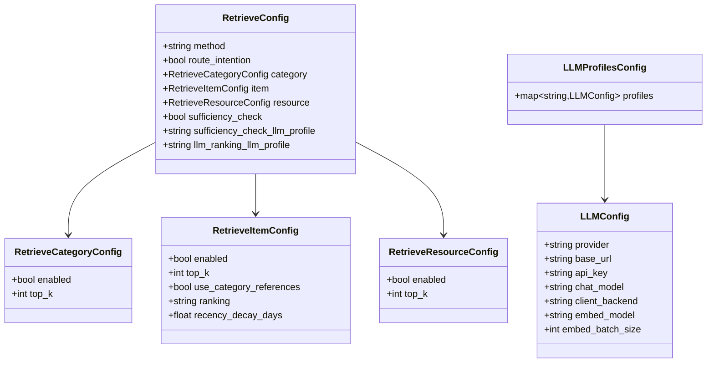
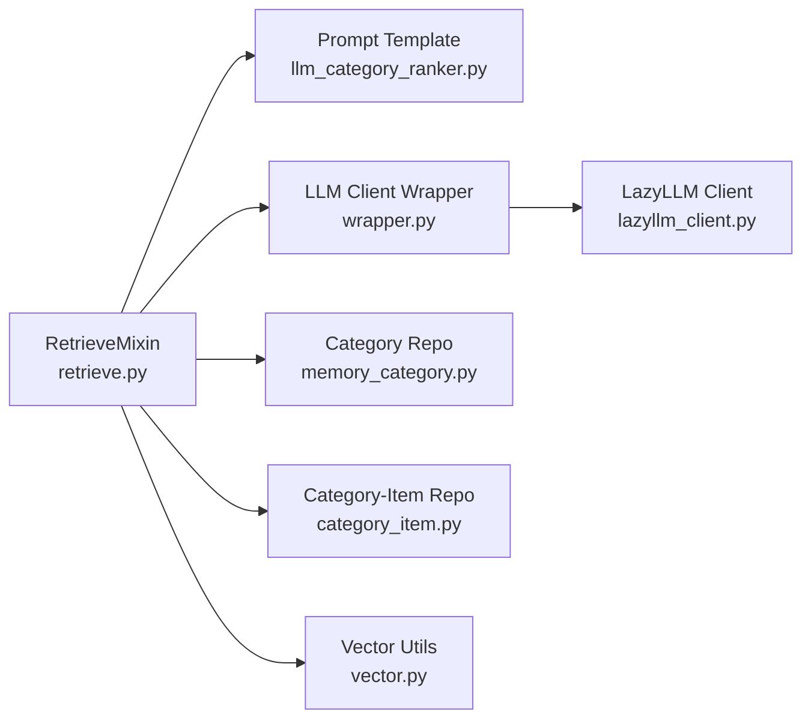

# Category Ranking Phase

<cite>
**Referenced Files in This Document**
- [retrieve.py](file://src/memu/app/retrieve.py)
- [llm_category_ranker.py](file://src/memu/prompts/retrieve/llm_category_ranker.py)
- [settings.py](file://src/memu/app/settings.py)
- [models.py](file://src/memu/database/models.py)
- [category_item.py](file://src/memu/database/repositories/category_item.py)
- [memory_category.py](file://src/memu/database/repositories/memory_category.py)
- [vector.py](file://src/memu/database/inmemory/vector.py)
- [wrapper.py](file://src/memu/llm/wrapper.py)
- [lazyllm_client.py](file://src/memu/llm/lazyllm_client.py)
</cite>

## Table of Contents
1. [Introduction](#introduction)
2. [Project Structure](#project-structure)
3. [Core Components](#core-components)
4. [Architecture Overview](#architecture-overview)
5. [Detailed Component Analysis](#detailed-component-analysis)
6. [Dependency Analysis](#dependency-analysis)
7. [Performance Considerations](#performance-considerations)
8. [Troubleshooting Guide](#troubleshooting-guide)
9. [Conclusion](#conclusion)

## Introduction
This document explains the Category Ranking Phase that drives LLM-powered category prioritization and contextual relevance scoring. It covers how the system prepares the category pool, applies LLM-based ranking with contextual awareness, and parses structured outputs to produce ranked results. It also documents prompt engineering for category ranking, LLM client configuration, scoring and ranking algorithms, and advanced features such as category summary processing, cross-category relationships via item-category links, and performance optimization for large category pools. Configuration options for ranking profiles, top-k selection, and sufficiency checks are included.

## Project Structure
The Category Ranking Phase is implemented within the retrieval workflow and integrates with LLM prompts, LLM clients, and database models. The key areas involved are:
- Retrieval workflow orchestration and step routing
- LLM-based category ranking prompt and parsing
- LLM client abstraction and interceptors
- Database models and repository contracts for categories and item-category relations
- Scoring utilities for salience-aware ranking

**Diagram sources**
- [retrieve.py](file://src/memu/app/retrieve.py#L454-L536)
- [llm_category_ranker.py](file://src/memu/prompts/retrieve/llm_category_ranker.py#L1-L36)
- [wrapper.py](file://src/memu/llm/wrapper.py#L226-L484)
- [lazyllm_client.py](file://src/memu/llm/lazyllm_client.py#L9-L160)
- [models.py](file://src/memu/database/models.py#L96-L106)
- [memory_category.py](file://src/memu/database/repositories/memory_category.py#L10-L34)
- [category_item.py](file://src/memu/database/repositories/category_item.py#L9-L24)
- [vector.py](file://src/memu/database/inmemory/vector.py#L56-L127)

**Section sources**
- [retrieve.py](file://src/memu/app/retrieve.py#L454-L536)
- [llm_category_ranker.py](file://src/memu/prompts/retrieve/llm_category_ranker.py#L1-L36)
- [settings.py](file://src/memu/app/settings.py#L175-L202)

## Core Components
- RetrieveMixin orchestrates the retrieval workflow, including routing, category ranking, sufficiency checks, and context building. It exposes both “rag” (embedding-based) and “llm” (LLM-based) modes for ranking.
- LLM Category Ranking Prompt defines the task, workflow, rules, and output format for selecting and ranking relevant categories.
- LLM Client Wrapper standardizes LLM interactions, interceptors, and usage metrics for chat/embed calls.
- Database Models define MemoryCategory and CategoryItem, enabling category summaries and item-category relations.
- Vector Utilities provide cosine similarity and salience-aware scoring used in embedding-based ranking and performance optimization.

**Section sources**
- [retrieve.py](file://src/memu/app/retrieve.py#L27-L86)
- [llm_category_ranker.py](file://src/memu/prompts/retrieve/llm_category_ranker.py#L1-L36)
- [wrapper.py](file://src/memu/llm/wrapper.py#L226-L484)
- [models.py](file://src/memu/database/models.py#L96-L106)
- [vector.py](file://src/memu/database/inmemory/vector.py#L56-L127)

## Architecture Overview
The Category Ranking Phase operates in a hierarchical retrieval pipeline:
1. Route intention: decide whether retrieval is needed and optionally rewrite the query.
2. Category ranking: either embed-category summaries and select top-k by cosine similarity (RAG) or delegate to LLM to rank categories (LLM mode).
3. Sufficiency check: evaluate whether the retrieved categories are sufficient; if not, rewrite the query and continue to items or resources.
4. Item and resource ranking: optionally continue with LLM-based item and resource ranking.
5. Build context: materialize results into the final response.

**Diagram sources**
- [retrieve.py](file://src/memu/app/retrieve.py#L454-L536)
- [retrieve.py](file://src/memu/app/retrieve.py#L570-L588)
- [retrieve.py](file://src/memu/app/retrieve.py#L1216-L1239)
- [llm_category_ranker.py](file://src/memu/prompts/retrieve/llm_category_ranker.py#L1-L36)
- [memory_category.py](file://src/memu/database/repositories/memory_category.py#L15-L16)

## Detailed Component Analysis

### Category Pool Preparation
- The category pool is loaded from the database repository and filtered by optional where conditions. In LLM mode, the pool is passed to the ranking step; in RAG mode, category summaries are embedded and top-k selected via cosine similarity.
- Cross-category relationships are supported via item-category relations, enabling downstream item and resource ranking to leverage category membership.

**Diagram sources**
- [retrieve.py](file://src/memu/app/retrieve.py#L577-L585)
- [memory_category.py](file://src/memu/database/repositories/memory_category.py#L15-L16)

**Section sources**
- [retrieve.py](file://src/memu/app/retrieve.py#L577-L585)
- [memory_category.py](file://src/memu/database/repositories/memory_category.py#L15-L16)

### LLM-Based Category Ranking with Contextual Awareness
- The LLM receives a formatted list of categories (IDs, names, descriptions, summaries) and the query. It returns a JSON object containing an analysis and a ranked list of category IDs.
- The system builds a structured prompt using the category ranking template and escapes special characters to avoid injection issues.
- The response is parsed to materialize category records without embeddings, preserving relevance order.

**Diagram sources**
- [retrieve.py](file://src/memu/app/retrieve.py#L1119-L1143)
- [retrieve.py](file://src/memu/app/retrieve.py#L1231-L1239)
- [llm_category_ranker.py](file://src/memu/prompts/retrieve/llm_category_ranker.py#L1-L36)
- [retrieve.py](file://src/memu/app/retrieve.py#L1325-L1347)

**Section sources**
- [retrieve.py](file://src/memu/app/retrieve.py#L1216-L1239)
- [llm_category_ranker.py](file://src/memu/prompts/retrieve/llm_category_ranker.py#L1-L36)
- [retrieve.py](file://src/memu/app/retrieve.py#L1325-L1347)

### Relevance Score Calculation and Ranking Algorithms
- Embedding-based ranking (RAG): Cosine similarity between query embedding and category summary embeddings; top-k selection via optimized vectorized computation.
- Salience-aware scoring (when applicable in item ranking): combines similarity, logarithmic reinforcement factor, and exponential recency decay with a configurable half-life.
- LLM-based ranking (this phase): The LLM determines relevance and ranking order; the system expects a JSON list of category IDs ordered by relevance.

**Diagram sources**
- [vector.py](file://src/memu/database/inmemory/vector.py#L16-L53)
- [vector.py](file://src/memu/database/inmemory/vector.py#L56-L91)

**Section sources**
- [retrieve.py](file://src/memu/app/retrieve.py#L725-L744)
- [vector.py](file://src/memu/database/inmemory/vector.py#L56-L127)

### Category Summary Processing and Cross-Category Relationships
- Category summaries are used as the primary signal for relevance in embedding-based ranking. In LLM mode, summaries are included in the prompt to aid contextual reasoning.
- Cross-category relationships are modeled via CategoryItem, which links items to categories. These relations inform downstream item ranking and can be leveraged for reference-aware retrieval.

**Diagram sources**
- [models.py](file://src/memu/database/models.py#L96-L106)
- [models.py](file://src/memu/database/models.py#L103-L106)
- [category_item.py](file://src/memu/database/repositories/category_item.py#L9-L24)

**Section sources**
- [models.py](file://src/memu/database/models.py#L96-L106)
- [category_item.py](file://src/memu/database/repositories/category_item.py#L9-L24)

### Dynamic Ranking Adjustments and Contextual Filtering
- After category ranking, the system evaluates sufficiency using a judge prompt. If insufficient, it rewrites the query and continues to item or resource ranking.
- The judge extracts explicit decisions and rewritten queries from the LLM response, enabling iterative refinement.

**Diagram sources**
- [retrieve.py](file://src/memu/app/retrieve.py#L746-L784)
- [retrieve.py](file://src/memu/app/retrieve.py#L590-L613)

**Section sources**
- [retrieve.py](file://src/memu/app/retrieve.py#L746-L784)
- [retrieve.py](file://src/memu/app/retrieve.py#L590-L613)

### Configuration Options for Ranking Profiles, Top-K, and Confidence Thresholds
- Retrieval configuration supports:
  - method: “rag” or “llm”
  - route_intention: enable query routing and rewriting
  - category.top_k: number of categories to retrieve
  - item.use_category_references: follow [ref:ITEM_ID] citations from category summaries
  - item.ranking: “similarity” or “salience”
  - item.recency_decay_days: half-life for recency decay in salience scoring
  - resource.top_k: number of resources to retrieve
  - sufficiency_check: enable sufficiency checks after each tier
  - sufficiency_check_llm_profile: LLM profile for routing and sufficiency
  - llm_ranking_llm_profile: LLM profile for LLM-based ranking steps
- LLM profiles define provider, base URL, API key, chat and embed models, and backend selection.

**Diagram sources**
- [settings.py](file://src/memu/app/settings.py#L175-L202)
- [settings.py](file://src/memu/app/settings.py#L146-L173)
- [settings.py](file://src/memu/app/settings.py#L263-L297)
- [settings.py](file://src/memu/app/settings.py#L102-L127)

**Section sources**
- [settings.py](file://src/memu/app/settings.py#L175-L202)
- [settings.py](file://src/memu/app/settings.py#L146-L173)
- [settings.py](file://src/memu/app/settings.py#L263-L297)
- [settings.py](file://src/memu/app/settings.py#L102-L127)

## Dependency Analysis
- RetrieveMixin depends on:
  - LLM prompt templates for ranking
  - LLM client wrapper for standardized chat/embed calls
  - Database repositories for categories and relations
  - Vector utilities for cosine similarity and salience scoring
- The LLM client wrapper centralizes interceptors and usage extraction, enabling observability and policy enforcement across ranking steps.

**Diagram sources**
- [retrieve.py](file://src/memu/app/retrieve.py#L1216-L1239)
- [llm_category_ranker.py](file://src/memu/prompts/retrieve/llm_category_ranker.py#L1-L36)
- [wrapper.py](file://src/memu/llm/wrapper.py#L226-L484)
- [lazyllm_client.py](file://src/memu/llm/lazyllm_client.py#L9-L160)
- [memory_category.py](file://src/memu/database/repositories/memory_category.py#L15-L16)
- [category_item.py](file://src/memu/database/repositories/category_item.py#L9-L24)
- [vector.py](file://src/memu/database/inmemory/vector.py#L56-L127)

**Section sources**
- [retrieve.py](file://src/memu/app/retrieve.py#L1216-L1239)
- [wrapper.py](file://src/memu/llm/wrapper.py#L226-L484)

## Performance Considerations
- Vectorized cosine similarity: Uses NumPy to compute similarities efficiently and argpartition for O(n) top-k selection, avoiding full sorts for large corpora.
- Salience-aware scoring: Applies logarithmic reinforcement and exponential recency decay to balance freshness and importance.
- LLM cost control: Limit top_k and rely on structured JSON outputs to reduce hallucinations and parsing overhead.
- Interceptors and batching: The LLM wrapper supports interceptors and batched embeddings to optimize throughput and enforce policies.

[No sources needed since this section provides general guidance]

## Troubleshooting Guide
- LLM response parsing failures: The system logs warnings when JSON parsing fails and falls back gracefully. Verify the prompt enforces JSON output and confirm the LLM profile supports structured outputs.
- Empty category pools: If no categories are found, ranking returns an empty list; ensure category summaries exist and filters are correct.
- Insufficient categories: Use sufficiency checks to rewrite the query and continue to items/resources.
- Embedding dimension mismatches: Ensure embeddings are computed consistently and stored with the correct dimensionality.

**Section sources**
- [retrieve.py](file://src/memu/app/retrieve.py#L1325-L1347)
- [retrieve.py](file://src/memu/app/retrieve.py#L1373-L1395)
- [retrieve.py](file://src/memu/app/retrieve.py#L746-L784)

## Conclusion
The Category Ranking Phase integrates LLM-driven relevance scoring with robust contextual awareness and structured output parsing. It supports both embedding-based and LLM-based ranking, dynamic query rewriting, and cross-category relationships via item-category links. With configurable profiles, top-k controls, and performance optimizations, the system scales to large category pools while maintaining precision and cost efficiency.