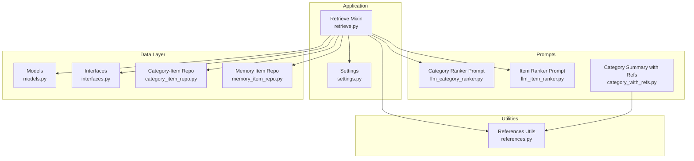
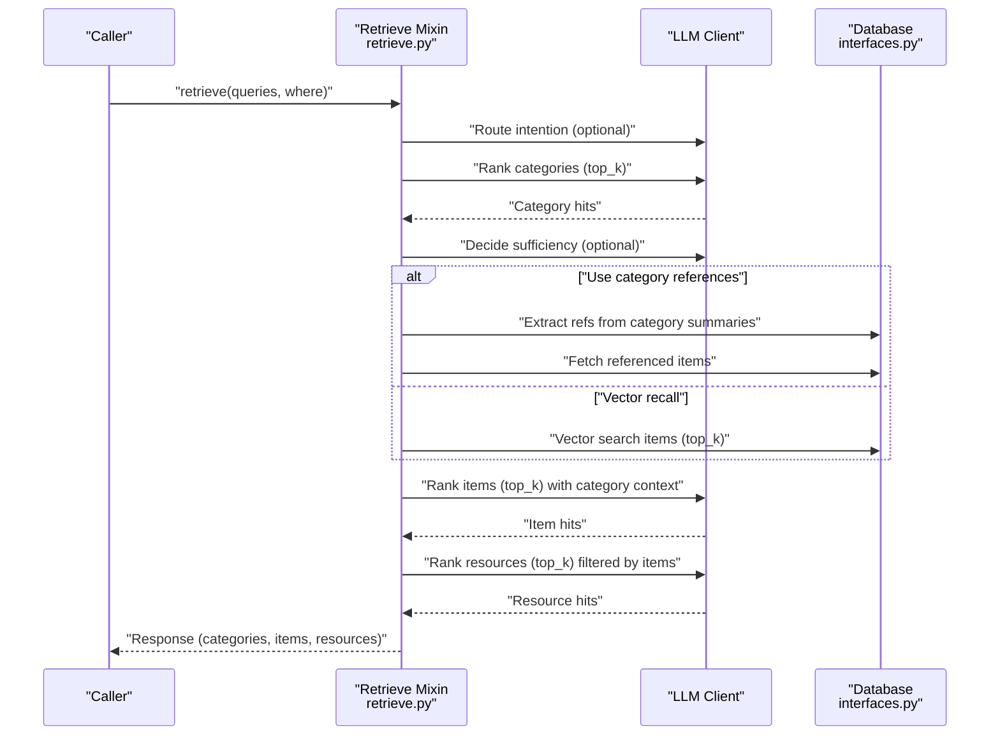
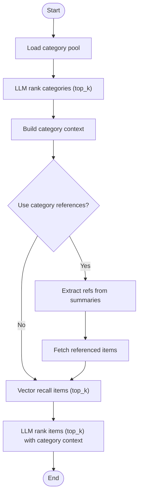
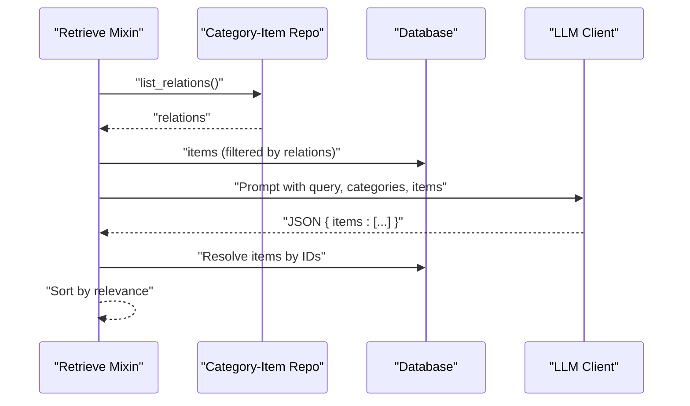
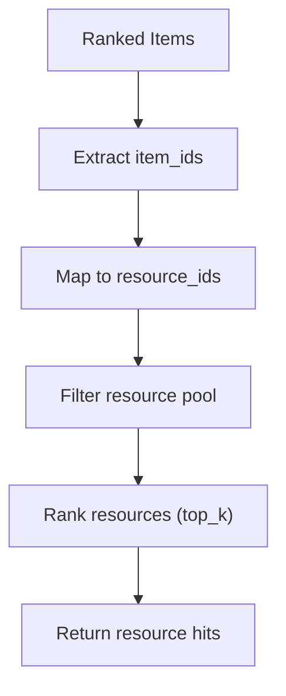
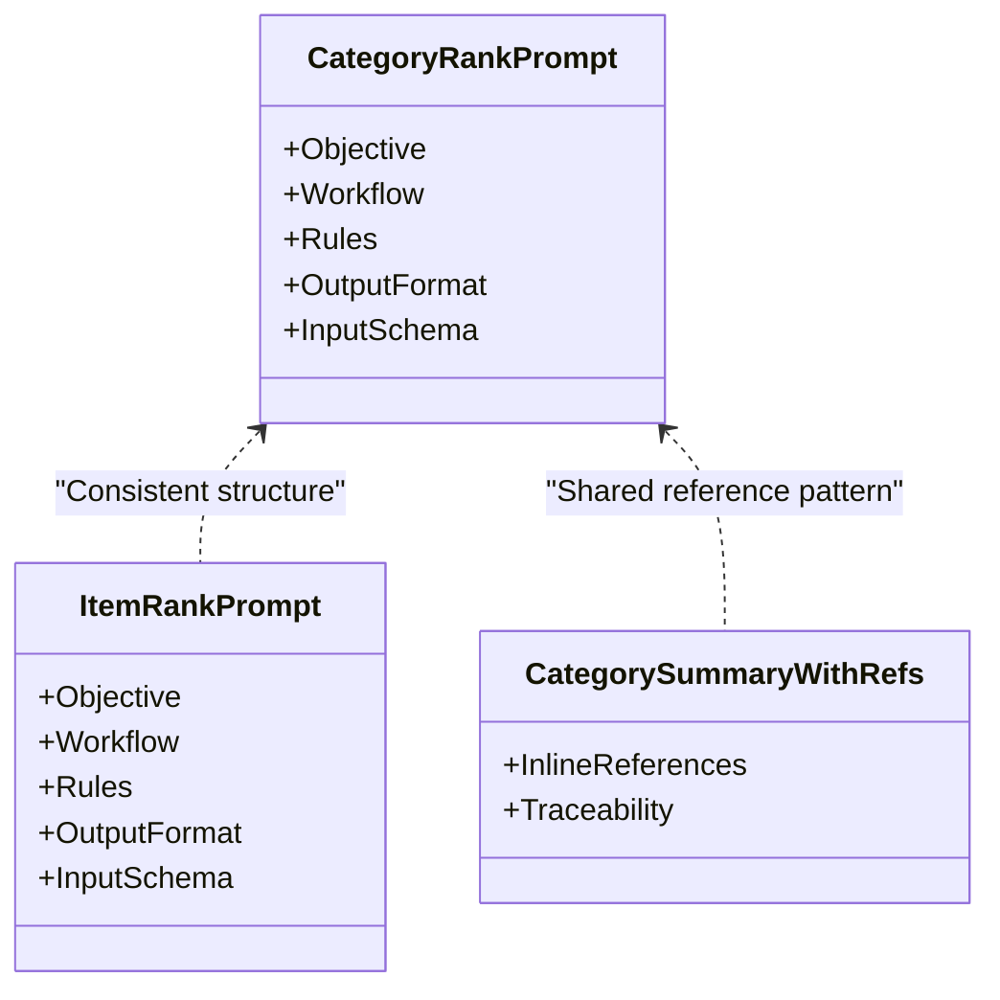
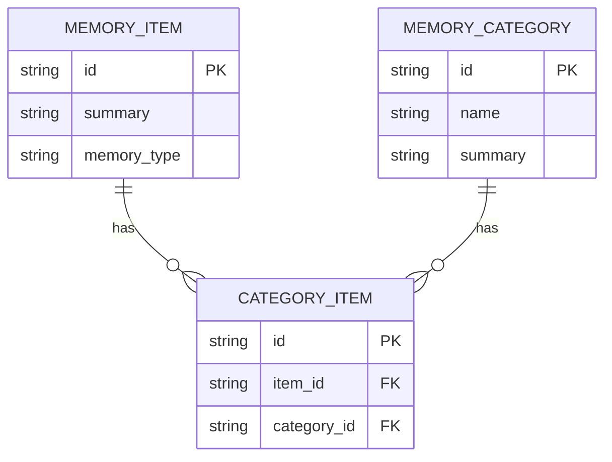
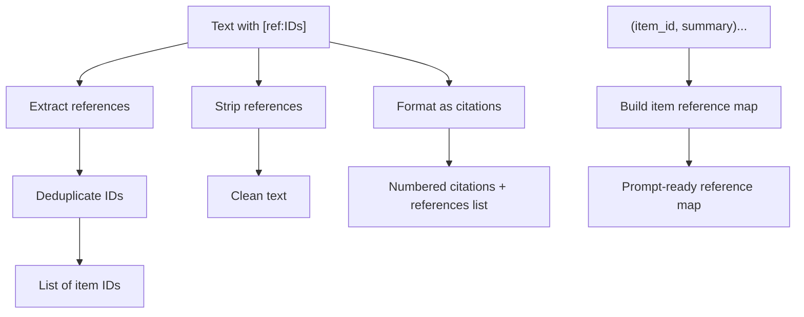
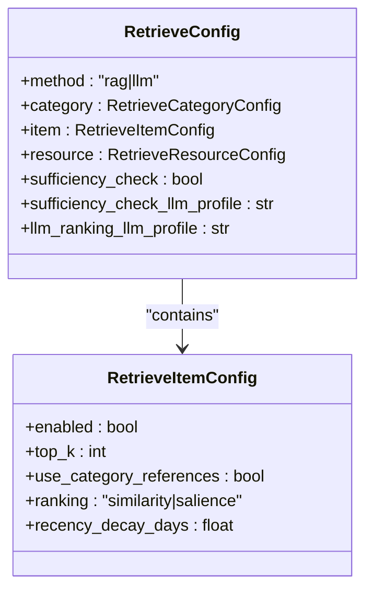
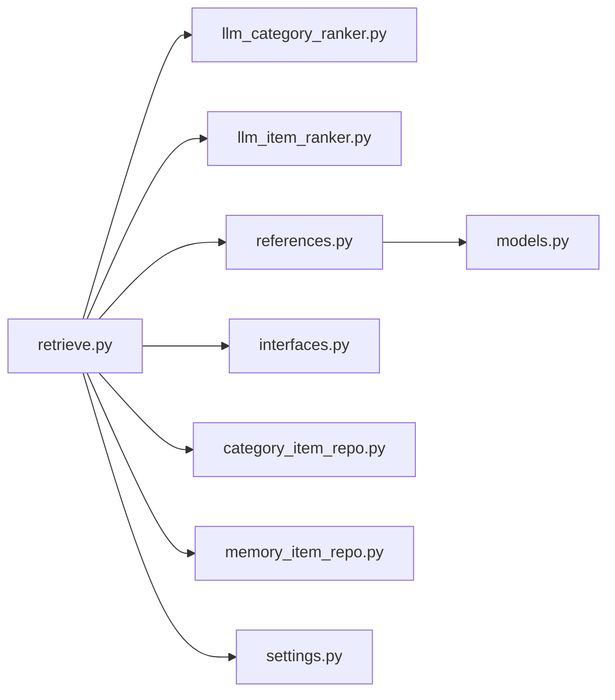

# Item Ranking Phase

<cite>
**Referenced Files in This Document**
- [retrieve.py](file://src/memu/app/retrieve.py)
- [settings.py](file://src/memu/app/settings.py)
- [references.py](file://src/memu/utils/references.py)
- [models.py](file://src/memu/database/models.py)
- [interfaces.py](file://src/memu/database/interfaces.py)
- [category_item_repo.py (inmemory)](file://src/memu/database/inmemory/repositories/category_item_repo.py)
- [category_item_repo.py (postgres)](file://src/memu/database/postgres/repositories/category_item_repo.py)
- [category_item_repo.py (sqlite)](file://src/memu/database/sqlite/repositories/category_item_repo.py)
- [memory_item_repo.py (postgres)](file://src/memu/database/postgres/repositories/memory_item_repo.py)
- [llm_category_ranker.py](file://src/memu/prompts/retrieve/llm_category_ranker.py)
- [llm_item_ranker.py](file://src/memu/prompts/retrieve/llm_item_ranker.py)
- [category_with_refs.py](file://src/memu/prompts/category_summary/category_with_refs.py)
- [test_references.py](file://tests/test_references.py)
</cite>

## Table of Contents
1. [Introduction](#introduction)
2. [Project Structure](#project-structure)
3. [Core Components](#core-components)
4. [Architecture Overview](#architecture-overview)
5. [Detailed Component Analysis](#detailed-component-analysis)
6. [Dependency Analysis](#dependency-analysis)
7. [Performance Considerations](#performance-considerations)
8. [Troubleshooting Guide](#troubleshooting-guide)
9. [Conclusion](#conclusion)
10. [Appendices](#appendices)

## Introduction
This document explains the item ranking phase that drives LLM-powered prioritization of memory items using category context and cross-references. It covers the workflow from category-based filtering to reference-aware ranking, contextual scoring, and relationship-based filtering. It also documents prompt engineering for category and item ranking, category reference processing, and configuration options for reference usage, ranking weights, and performance tuning for large item pools.

## Project Structure
The item ranking phase spans several modules:
- Application orchestration and retrieval workflow
- Configuration for retrieval stages and ranking strategies
- Utilities for extracting and formatting references
- Data models and repository interfaces for categories, items, and relations
- Prompts for LLM-driven ranking
- Tests validating reference handling

**Diagram sources**
- [retrieve.py](file://src/memu/app/retrieve.py#L1-L1419)
- [settings.py](file://src/memu/app/settings.py#L175-L202)
- [llm_category_ranker.py](file://src/memu/prompts/retrieve/llm_category_ranker.py#L1-L36)
- [llm_item_ranker.py](file://src/memu/prompts/retrieve/llm_item_ranker.py#L1-L41)
- [category_with_refs.py](file://src/memu/prompts/category_summary/category_with_refs.py#L1-L141)
- [references.py](file://src/memu/utils/references.py#L1-L173)
- [models.py](file://src/memu/database/models.py#L68-L106)
- [interfaces.py](file://src/memu/database/interfaces.py#L12-L26)
- [category_item_repo.py (inmemory)](file://src/memu/database/inmemory/repositories/category_item_repo.py#L13-L45)
- [memory_item_repo.py (postgres)](file://src/memu/database/postgres/repositories/memory_item_repo.py#L331-L368)

**Section sources**
- [retrieve.py](file://src/memu/app/retrieve.py#L1-L1419)
- [settings.py](file://src/memu/app/settings.py#L175-L202)

## Core Components
- Retrieve Mixin orchestrates the LLM-driven ranking workflow across categories, items, and resources.
- Category and item ranking prompts guide the LLM to select and rank relevant entities.
- Reference utilities extract, strip, and format references for traceability and cross-modal prioritization.
- Configuration controls whether to use category references during item recall and how to rank items (similarity vs. salience).
- Relationship repositories connect items to categories, enabling filtering and contextual scoring.

**Section sources**
- [retrieve.py](file://src/memu/app/retrieve.py#L570-L723)
- [llm_category_ranker.py](file://src/memu/prompts/retrieve/llm_category_ranker.py#L1-L36)
- [llm_item_ranker.py](file://src/memu/prompts/retrieve/llm_item_ranker.py#L1-L41)
- [references.py](file://src/memu/utils/references.py#L20-L173)
- [settings.py](file://src/memu/app/settings.py#L146-L173)
- [category_item_repo.py (inmemory)](file://src/memu/database/inmemory/repositories/category_item_repo.py#L13-L45)

## Architecture Overview
The item ranking phase follows a staged, LLM-guided process:
1. Route intention and decide retrieval sufficiency
2. Rank categories by relevance to the query
3. Optionally refine query and rerank categories
4. Recall items using either:
   - Vector search, or
   - Reference-aware recall by following [ref:ITEM_ID] links from category summaries
5. Rank items with category context and relations
6. Optionally recall and rank resources linked to the ranked items
7. Build a final context response

**Diagram sources**
- [retrieve.py](file://src/memu/app/retrieve.py#L538-L723)
- [llm_category_ranker.py](file://src/memu/prompts/retrieve/llm_category_ranker.py#L1-L36)
- [llm_item_ranker.py](file://src/memu/prompts/retrieve/llm_item_ranker.py#L1-L41)
- [interfaces.py](file://src/memu/database/interfaces.py#L12-L26)

## Detailed Component Analysis

### Category-Based Item Filtering and Reference Extraction
- Category ranking uses an LLM prompt to select top-k categories relevant to the query.
- After category selection, the system builds a category context string for item ranking.
- Reference extraction from category summaries enables reference-aware item recall:
  - Extract all [ref:ITEM_ID] occurrences
  - Fetch referenced items from the database
  - Limit item pool to referenced items for targeted ranking

**Diagram sources**
- [retrieve.py](file://src/memu/app/retrieve.py#L615-L657)
- [references.py](file://src/memu/utils/references.py#L20-L49)

**Section sources**
- [retrieve.py](file://src/memu/app/retrieve.py#L615-L657)
- [references.py](file://src/memu/utils/references.py#L20-L49)

### Relation-Aware Ranking and Contextual Scoring
- Items are formatted for LLM consumption, optionally filtered by category membership via relations.
- Relations are loaded from the category-item repository to ensure only category-associated items are considered.
- The LLM receives:
  - Query
  - Top-k relevant categories
  - Available items within those categories
- The LLM returns a ranked list of item IDs, preserving order as relevance ranking.

**Diagram sources**
- [retrieve.py](file://src/memu/app/retrieve.py#L1145-L1179)
- [category_item_repo.py (inmemory)](file://src/memu/database/inmemory/repositories/category_item_repo.py#L19-L42)

**Section sources**
- [retrieve.py](file://src/memu/app/retrieve.py#L1145-L1179)
- [category_item_repo.py (inmemory)](file://src/memu/database/inmemory/repositories/category_item_repo.py#L19-L42)

### Cross-Modal Item Prioritization
- Resources are recalled and ranked based on the already ranked items.
- Resource recall filters resources by IDs associated with the item’s resource_id.
- This enables cross-modal prioritization: items drive resource selection.

**Diagram sources**
- [retrieve.py](file://src/memu/app/retrieve.py#L1280-L1323)

**Section sources**
- [retrieve.py](file://src/memu/app/retrieve.py#L1280-L1323)

### Prompt Engineering for Item Ranking
- Category rank prompt:
  - Defines objective, workflow, rules, output format, and input schema
  - Enforces top-k selection and ordering
- Item rank prompt:
  - Guides LLM to consider only items in relevant categories
  - Requires inclusion of up to top_k items
  - Preserves order as relevance ranking
- Category summary prompt with references:
  - Instructs LLM to include [ref:ITEM_ID] citations when summarizing
  - Ensures traceability from summary statements to source items

**Diagram sources**
- [llm_category_ranker.py](file://src/memu/prompts/retrieve/llm_category_ranker.py#L1-L36)
- [llm_item_ranker.py](file://src/memu/prompts/retrieve/llm_item_ranker.py#L1-L41)
- [category_with_refs.py](file://src/memu/prompts/category_summary/category_with_refs.py#L1-L141)

**Section sources**
- [llm_category_ranker.py](file://src/memu/prompts/retrieve/llm_category_ranker.py#L1-L36)
- [llm_item_ranker.py](file://src/memu/prompts/retrieve/llm_item_ranker.py#L1-L41)
- [category_with_refs.py](file://src/memu/prompts/category_summary/category_with_refs.py#L1-L141)

### Category-Item Relationship Mapping
- The category-item repository maintains relations between items and categories.
- These relations are used to:
  - Filter items for ranking (only items in relevant categories)
  - Resolve item-category membership for contextual scoring
- Repositories exist for in-memory, PostgreSQL, and SQLite backends.

**Diagram sources**
- [models.py](file://src/memu/database/models.py#L76-L106)
- [category_item_repo.py (inmemory)](file://src/memu/database/inmemory/repositories/category_item_repo.py#L13-L45)
- [category_item_repo.py (postgres)](file://src/memu/database/postgres/repositories/category_item_repo.py#L13-L102)
- [category_item_repo.py (sqlite)](file://src/memu/database/sqlite/repositories/category_item_repo.py#L39-L180)

**Section sources**
- [models.py](file://src/memu/database/models.py#L76-L106)
- [category_item_repo.py (inmemory)](file://src/memu/database/inmemory/repositories/category_item_repo.py#L13-L45)
- [category_item_repo.py (postgres)](file://src/memu/database/postgres/repositories/category_item_repo.py#L13-L102)
- [category_item_repo.py (sqlite)](file://src/memu/database/sqlite/repositories/category_item_repo.py#L39-L180)

### Reference Extraction Algorithms and Utilities
- Extract references:
  - Regex-based extraction of [ref:ID] patterns
  - Handles comma-separated IDs and deduplicates
- Strip references:
  - Removes citations for clean display
- Format as citations:
  - Converts [ref:ID] to numbered citations with a references list
- Build item reference map:
  - Formats available items for LLM prompts with [ref:ID] markers

**Diagram sources**
- [references.py](file://src/memu/utils/references.py#L20-L173)

**Section sources**
- [references.py](file://src/memu/utils/references.py#L20-L173)
- [test_references.py](file://tests/test_references.py#L22-L192)

### Configuration Options for Reference Usage, Ranking Weights, and Performance Tuning
- Enable reference-aware item recall:
  - use_category_references toggles fetching items by [ref:ID] extracted from category summaries
- Ranking strategy:
  - ranking supports "similarity" or "salience"
  - salience incorporates reinforcement count and recency decay
- Performance tuning:
  - top_k controls breadth of retrieval per stage
  - recency_decay_days adjusts half-life for recency weighting
  - sufficiency_check allows iterative refinement of queries across tiers

**Diagram sources**
- [settings.py](file://src/memu/app/settings.py#L146-L173)
- [settings.py](file://src/memu/app/settings.py#L175-L202)

**Section sources**
- [settings.py](file://src/memu/app/settings.py#L146-L173)
- [settings.py](file://src/memu/app/settings.py#L175-L202)
- [memory_item_repo.py (postgres)](file://src/memu/database/postgres/repositories/memory_item_repo.py#L331-L368)

## Dependency Analysis
- Retrieve Mixin depends on:
  - LLM prompts for category and item ranking
  - Reference utilities for parsing and formatting citations
  - Database interfaces and repositories for categories, items, and relations
  - Settings for configuration of retrieval and ranking behavior
- The item ranking pipeline composes these dependencies to deliver a coherent, LLM-driven prioritization flow.

**Diagram sources**
- [retrieve.py](file://src/memu/app/retrieve.py#L1-L1419)
- [llm_category_ranker.py](file://src/memu/prompts/retrieve/llm_category_ranker.py#L1-L36)
- [llm_item_ranker.py](file://src/memu/prompts/retrieve/llm_item_ranker.py#L1-L41)
- [references.py](file://src/memu/utils/references.py#L1-L173)
- [interfaces.py](file://src/memu/database/interfaces.py#L12-L26)
- [category_item_repo.py (inmemory)](file://src/memu/database/inmemory/repositories/category_item_repo.py#L13-L45)
- [memory_item_repo.py (postgres)](file://src/memu/database/postgres/repositories/memory_item_repo.py#L331-L368)
- [settings.py](file://src/memu/app/settings.py#L175-L202)
- [models.py](file://src/memu/database/models.py#L68-L106)

**Section sources**
- [retrieve.py](file://src/memu/app/retrieve.py#L1-L1419)
- [settings.py](file://src/memu/app/settings.py#L175-L202)

## Performance Considerations
- Use category references to reduce the item pool early, minimizing downstream LLM ranking cost.
- Prefer "similarity" ranking for large pools when reinforcement signals are weak; switch to "salience" when reinforcement and recency matter.
- Tune top_k per stage to balance recall and cost; smaller top_k reduces prompt size and LLM calls.
- Leverage sufficiency checks to iteratively refine queries and avoid unnecessary tiers.
- Cache relations and embeddings where feasible to minimize repeated computation.

## Troubleshooting Guide
- Empty or missing category summaries:
  - Ensure category summaries are generated with [ref:ITEM_ID] citations when using reference-aware recall.
- Incorrect item IDs in rankings:
  - Verify that the LLM output adheres to the expected JSON schema and that item IDs exist in the database.
- Missing referenced items:
  - Confirm that referenced item IDs exist in the item pool and that category summaries are properly formatted.
- Unexpected ranking order:
  - Check that the ranking strategy aligns with intended behavior (similarity vs. salience) and that relations are correctly loaded.

**Section sources**
- [references.py](file://src/memu/utils/references.py#L20-L173)
- [test_references.py](file://tests/test_references.py#L22-L192)
- [retrieve.py](file://src/memu/app/retrieve.py#L1325-L1395)

## Conclusion
The item ranking phase leverages LLM-driven ranking with category context and cross-references to prioritize memory items efficiently. By combining category-based filtering, reference extraction, relation-aware scoring, and configurable ranking strategies, the system achieves precise, traceable, and scalable prioritization suitable for large-scale memory systems.

## Appendices

### Concrete Examples

- Category reference extraction and item recall:
  - Extract [ref:ID] from category summaries
  - Fetch referenced items and limit the item pool
  - Rank remaining items with category context

- Relation-based filtering:
  - Use category-item relations to restrict items to relevant categories
  - Ensure only category-associated items are presented to the LLM

- Multi-context scoring:
  - Combine category relevance with item salience (reinforcement + recency)
  - Adjust recency_decay_days to emphasize recent or historical relevance

[No sources needed since this section provides general guidance]