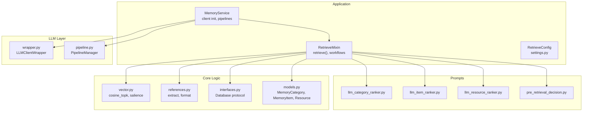
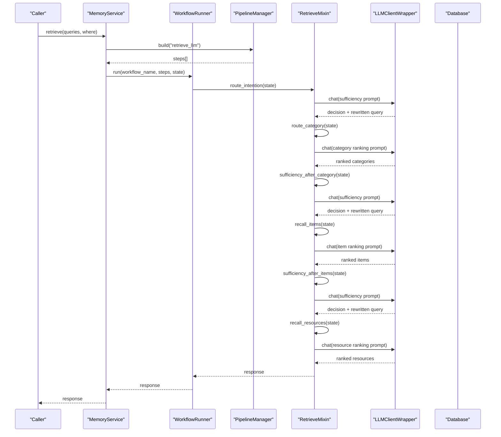
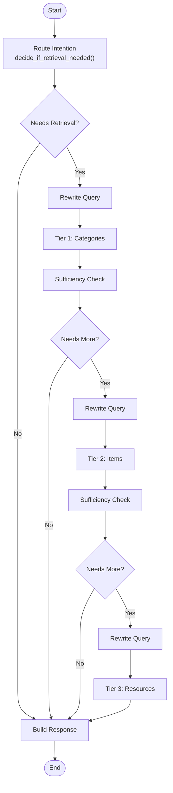
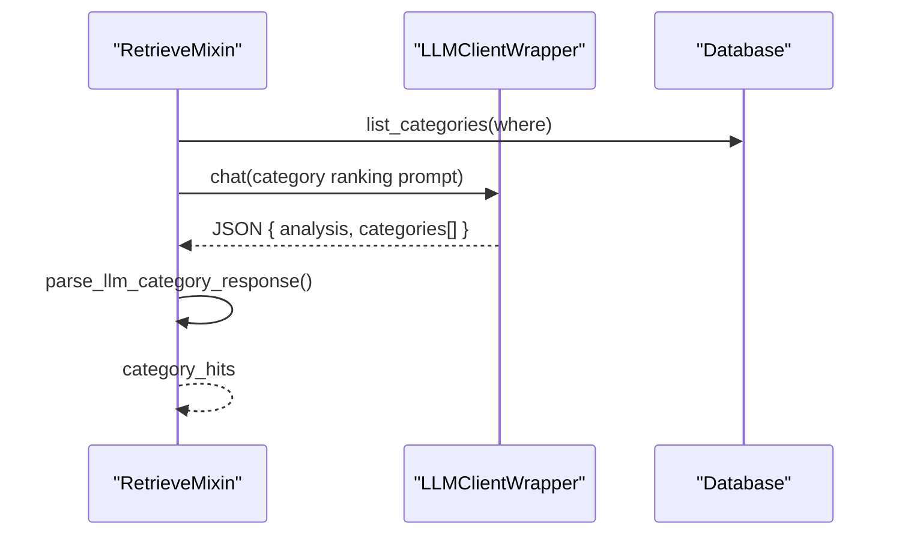
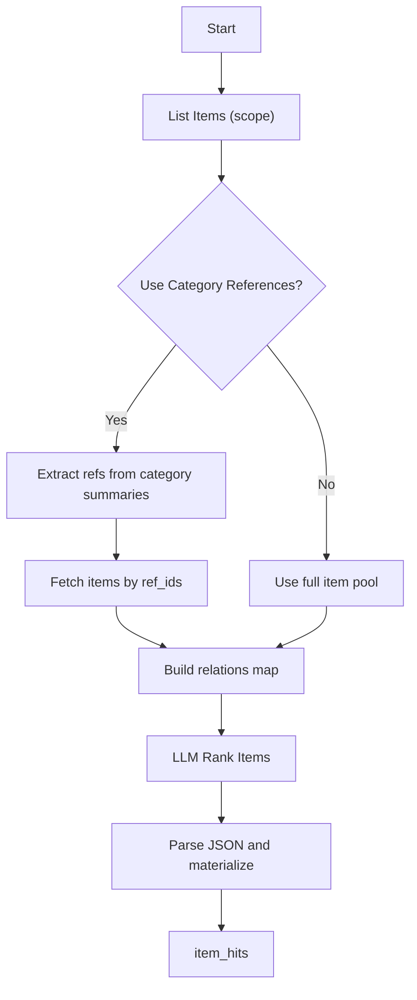
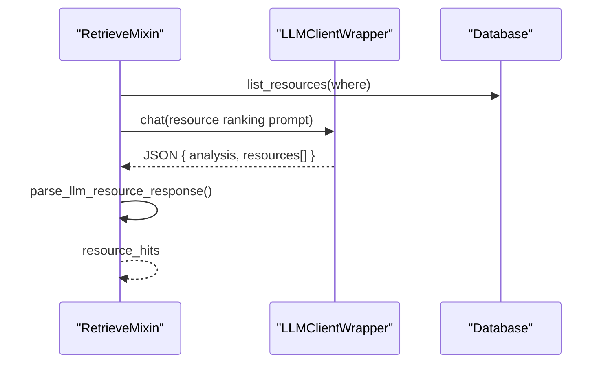
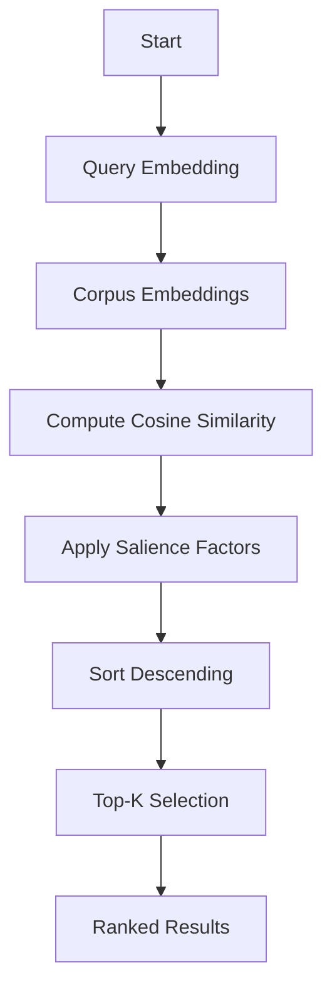
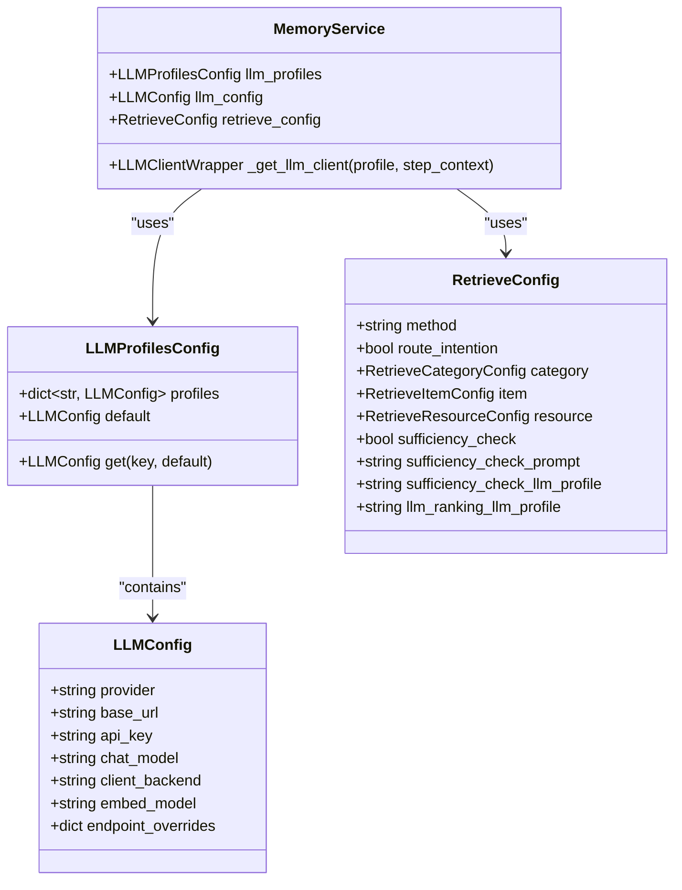
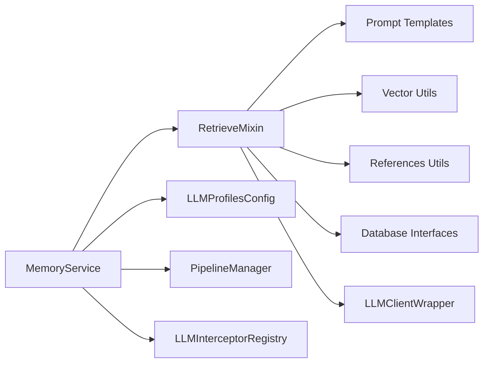

# LLM-Driven Retrieval Mode

<cite>
**Referenced Files in This Document**
- [retrieve.py](file://src/memu/app/retrieve.py)
- [settings.py](file://src/memu/app/settings.py)
- [llm_category_ranker.py](file://src/memu/prompts/retrieve/llm_category_ranker.py)
- [llm_item_ranker.py](file://src/memu/prompts/retrieve/llm_item_ranker.py)
- [llm_resource_ranker.py](file://src/memu/prompts/retrieve/llm_resource_ranker.py)
- [pre_retrieval_decision.py](file://src/memu/prompts/retrieve/pre_retrieval_decision.py)
- [references.py](file://src/memu/utils/references.py)
- [vector.py](file://src/memu/database/inmemory/vector.py)
- [models.py](file://src/memu/database/models.py)
- [service.py](file://src/memu/app/service.py)
- [pipeline.py](file://src/memu/workflow/pipeline.py)
- [interfaces.py](file://src/memu/database/interfaces.py)
- [wrapper.py](file://src/memu/llm/wrapper.py)
</cite>

## Table of Contents
1. [Introduction](#introduction)
2. [Project Structure](#project-structure)
3. [Core Components](#core-components)
4. [Architecture Overview](#architecture-overview)
5. [Detailed Component Analysis](#detailed-component-analysis)
6. [Dependency Analysis](#dependency-analysis)
7. [Performance Considerations](#performance-considerations)
8. [Troubleshooting Guide](#troubleshooting-guide)
9. [Conclusion](#conclusion)
10. [Appendices](#appendices)

## Introduction
This document explains the LLM-driven retrieval mode that powers intelligent ranking and contextual prioritization across categories, items, and resources. It covers the end-to-end workflow: intention routing, LLM-based category ranking, sufficiency checking with contextual awareness, item recall guided by category relationships and references, and resource ranking enriched by cross-modal context. It also documents prompt engineering strategies, LLM client configurations, ranking algorithms, and advanced features such as category reference extraction, relation-based filtering, and cross-modal retrieval strategies. Finally, it provides configuration options for ranking profiles, sufficiency check prompts, and performance tuning.

## Project Structure
The retrieval mode is implemented as part of the Memory Service, orchestrated by a workflow engine. Key areas:
- Application orchestration and retrieval logic
- Configuration models for retrieval behavior and LLM profiles
- Prompt templates for LLM ranking and sufficiency checks
- Utilities for extracting and managing references
- Vector and salience-based ranking utilities
- Database interfaces and models
- LLM client wrappers and interceptors

**Diagram sources**
- [retrieve.py](file://src/memu/app/retrieve.py#L42-L85)
- [settings.py](file://src/memu/app/settings.py#L175-L202)
- [llm_category_ranker.py](file://src/memu/prompts/retrieve/llm_category_ranker.py#L1-L36)
- [llm_item_ranker.py](file://src/memu/prompts/retrieve/llm_item_ranker.py#L1-L41)
- [llm_resource_ranker.py](file://src/memu/prompts/retrieve/llm_resource_ranker.py#L1-L41)
- [pre_retrieval_decision.py](file://src/memu/prompts/retrieve/pre_retrieval_decision.py#L1-L54)
- [vector.py](file://src/memu/database/inmemory/vector.py#L56-L138)
- [references.py](file://src/memu/utils/references.py#L20-L173)
- [interfaces.py](file://src/memu/database/interfaces.py#L12-L36)
- [models.py](file://src/memu/database/models.py#L68-L106)
- [service.py](file://src/memu/app/service.py#L49-L96)
- [wrapper.py](file://src/memu/llm/wrapper.py#L226-L484)
- [pipeline.py](file://src/memu/workflow/pipeline.py#L21-L49)

**Section sources**
- [retrieve.py](file://src/memu/app/retrieve.py#L42-L85)
- [settings.py](file://src/memu/app/settings.py#L175-L202)
- [service.py](file://src/memu/app/service.py#L49-L96)

## Core Components
- RetrieveMixin orchestrates the retrieval workflow, supporting both RAG-style vector search and LLM-driven ranking. It builds two pipelines: retrieve_rag and retrieve_llm, and routes through sufficiency checks after each tier.
- RetrieveConfig controls enabling/disabling retrieval stages, top_k limits, sufficiency checks, and LLM profiles for ranking and decision-making.
- LLM ranking prompts define the tasks and constraints for category, item, and resource ranking.
- Vector utilities implement cosine similarity and salience-aware scoring for efficient retrieval.
- References utilities extract and manage inline citations [ref:ITEM_ID] in category summaries to enable relation-based item filtering.
- LLM client wrapper provides standardized chat/embed calls, usage extraction, and interception hooks.

**Section sources**
- [retrieve.py](file://src/memu/app/retrieve.py#L42-L85)
- [settings.py](file://src/memu/app/settings.py#L146-L202)
- [llm_category_ranker.py](file://src/memu/prompts/retrieve/llm_category_ranker.py#L1-L36)
- [llm_item_ranker.py](file://src/memu/prompts/retrieve/llm_item_ranker.py#L1-L41)
- [llm_resource_ranker.py](file://src/memu/prompts/retrieve/llm_resource_ranker.py#L1-L41)
- [vector.py](file://src/memu/database/inmemory/vector.py#L56-L138)
- [references.py](file://src/memu/utils/references.py#L20-L173)
- [wrapper.py](file://src/memu/llm/wrapper.py#L226-L484)

## Architecture Overview
The retrieval mode supports two strategies:
- RAG: Uses vector embeddings for category and item recall, followed by sufficiency checks and optional resource recall via cross-modal captions.
- LLM: Delegates ranking to LLMs at each tier (categories, items, resources), guided by prompts and context, with optional sufficiency checks.

**Diagram sources**
- [retrieve.py](file://src/memu/app/retrieve.py#L42-L85)
- [retrieve.py](file://src/memu/app/retrieve.py#L454-L536)
- [service.py](file://src/memu/app/service.py#L350-L361)
- [pipeline.py](file://src/memu/workflow/pipeline.py#L47-L49)
- [wrapper.py](file://src/memu/llm/wrapper.py#L274-L306)

## Detailed Component Analysis

### Intention Routing and Sufficiency Checking
- Intention routing decides whether retrieval is needed and optionally rewrites the query to be self-contained using conversation history.
- After each retrieval tier (categories, items), a sufficiency check evaluates whether the retrieved content is sufficient or if further retrieval is needed, potentially rewriting the query again.

**Diagram sources**
- [retrieve.py](file://src/memu/app/retrieve.py#L746-L784)
- [pre_retrieval_decision.py](file://src/memu/prompts/retrieve/pre_retrieval_decision.py#L1-L54)

**Section sources**
- [retrieve.py](file://src/memu/app/retrieve.py#L746-L784)
- [pre_retrieval_decision.py](file://src/memu/prompts/retrieve/pre_retrieval_decision.py#L1-L54)

### LLM-Based Category Ranking
- The category ranking prompt instructs the LLM to analyze the query, review available categories, select up to top_k relevant categories, and rank them by relevance.
- RetrieveMixin constructs the prompt with the query and category pool, then parses the LLM’s JSON response to produce ranked categories.

**Diagram sources**
- [retrieve.py](file://src/memu/app/retrieve.py#L570-L588)
- [llm_category_ranker.py](file://src/memu/prompts/retrieve/llm_category_ranker.py#L1-L36)

**Section sources**
- [retrieve.py](file://src/memu/app/retrieve.py#L570-L588)
- [llm_category_ranker.py](file://src/memu/prompts/retrieve/llm_category_ranker.py#L1-L36)

### Item Recall Using Category Relationships and References
- The item recall step builds a candidate pool from either:
  - Items linked by category-item relations, or
  - All items filtered by scope.
- If enabled, category references are extracted from category summaries and used to fetch referenced items directly.
- The item ranking prompt asks the LLM to rank items within the relevant categories, returning up to top_k items.

**Diagram sources**
- [retrieve.py](file://src/memu/app/retrieve.py#L615-L657)
- [references.py](file://src/memu/utils/references.py#L20-L173)
- [llm_item_ranker.py](file://src/memu/prompts/retrieve/llm_item_ranker.py#L1-L41)

**Section sources**
- [retrieve.py](file://src/memu/app/retrieve.py#L615-L657)
- [references.py](file://src/memu/utils/references.py#L20-L173)
- [llm_item_ranker.py](file://src/memu/prompts/retrieve/llm_item_ranker.py#L1-L41)

### Resource Ranking with Cross-Modal Context
- Resources are recalled and ranked using the LLM with cross-modal context:
  - Relevant categories and items inform the prompt to ground relevance.
  - The prompt template includes context info and available resources.
- The LLM returns a ranked list of resource IDs, which are materialized from the resource pool.

**Diagram sources**
- [retrieve.py](file://src/memu/app/retrieve.py#L684-L706)
- [llm_resource_ranker.py](file://src/memu/prompts/retrieve/llm_resource_ranker.py#L1-L41)

**Section sources**
- [retrieve.py](file://src/memu/app/retrieve.py#L684-L706)
- [llm_resource_ranker.py](file://src/memu/prompts/retrieve/llm_resource_ranker.py#L1-L41)

### Ranking Algorithms and Salience-Aware Scoring
- Vector similarity: cosine_topk computes top-k results using cosine similarity between query and corpus vectors.
- Salience-aware scoring: cosine_topk_salience combines similarity with logarithmic reinforcement and exponential recency decay to prioritize impactful, recent memories.

**Diagram sources**
- [vector.py](file://src/memu/database/inmemory/vector.py#L56-L138)

**Section sources**
- [vector.py](file://src/memu/database/inmemory/vector.py#L56-L138)

### Prompt Engineering Strategies
- Category ranking prompt: task objective, workflow, rules, output format, and structured input placeholders.
- Item ranking prompt: similar structure, with emphasis on relevant categories and item constraints.
- Resource ranking prompt: includes context info and resource constraints.
- Pre-retrieval decision prompt: explicit rules for when to retrieve versus when to answer directly, with structured output format.

**Section sources**
- [llm_category_ranker.py](file://src/memu/prompts/retrieve/llm_category_ranker.py#L1-L36)
- [llm_item_ranker.py](file://src/memu/prompts/retrieve/llm_item_ranker.py#L1-L41)
- [llm_resource_ranker.py](file://src/memu/prompts/retrieve/llm_resource_ranker.py#L1-L41)
- [pre_retrieval_decision.py](file://src/memu/prompts/retrieve/pre_retrieval_decision.py#L1-L54)

### LLM Client Configurations and Profiles
- LLM profiles support multiple providers and backends (SDK, HTTPX, lazyllm_backend).
- Profiles specify provider, base URL, API key, chat and embedding models, and endpoint overrides.
- RetrieveConfig selects which profile to use for sufficiency checks and LLM ranking.
- MemoryService lazily initializes and wraps clients with LLMClientWrapper for standardized usage and interception.

**Diagram sources**
- [settings.py](file://src/memu/app/settings.py#L102-L127)
- [settings.py](file://src/memu/app/settings.py#L263-L297)
- [settings.py](file://src/memu/app/settings.py#L175-L202)
- [service.py](file://src/memu/app/service.py#L97-L135)
- [service.py](file://src/memu/app/service.py#L187-L194)

**Section sources**
- [settings.py](file://src/memu/app/settings.py#L102-L127)
- [settings.py](file://src/memu/app/settings.py#L263-L297)
- [settings.py](file://src/memu/app/settings.py#L175-L202)
- [service.py](file://src/memu/app/service.py#L97-L135)
- [service.py](file://src/memu/app/service.py#L187-L194)

### Advanced Features
- Category reference extraction: extracts [ref:ITEM_ID] citations from category summaries and fetches referenced items to enrich the item pool.
- Relation-based filtering: uses category-item relations to constrain item recall when category references are not sufficient.
- Cross-modal retrieval: resource recall leverages captions and embeddings; the LLM ranks resources grounded in categories and items.

**Section sources**
- [references.py](file://src/memu/utils/references.py#L20-L173)
- [retrieve.py](file://src/memu/app/retrieve.py#L615-L657)
- [retrieve.py](file://src/memu/app/retrieve.py#L684-L706)

## Dependency Analysis
- RetrieveMixin depends on:
  - Prompt templates for LLM ranking and sufficiency checks.
  - Vector utilities for similarity-based ranking.
  - References utilities for extracting and formatting citations.
  - Database interfaces for accessing categories, items, and resources.
  - LLM client wrapper for chat/embed calls and usage extraction.
- MemoryService composes:
  - LLM profiles and client initialization.
  - Pipeline registration for retrieval workflows.
  - Interceptors for observability and policy enforcement.

**Diagram sources**
- [retrieve.py](file://src/memu/app/retrieve.py#L11-L17)
- [interfaces.py](file://src/memu/database/interfaces.py#L12-L36)
- [wrapper.py](file://src/memu/llm/wrapper.py#L226-L484)
- [service.py](file://src/memu/app/service.py#L49-L96)
- [pipeline.py](file://src/memu/workflow/pipeline.py#L21-L49)

**Section sources**
- [retrieve.py](file://src/memu/app/retrieve.py#L11-L17)
- [interfaces.py](file://src/memu/database/interfaces.py#L12-L36)
- [wrapper.py](file://src/memu/llm/wrapper.py#L226-L484)
- [service.py](file://src/memu/app/service.py#L49-L96)
- [pipeline.py](file://src/memu/workflow/pipeline.py#L21-L49)

## Performance Considerations
- Vector similarity:
  - cosine_topk uses vectorized computation and argpartition for top-k selection to achieve sub-linear performance compared to full sorting.
- Salience-aware scoring:
  - logarithmic reinforcement factor and exponential recency decay provide nuanced prioritization while avoiding dominance by frequently reinforced facts.
- LLM calls:
  - LLMClientWrapper batches token usage extraction and provides standardized request/response views for monitoring.
- Pipeline validation:
  - PipelineManager validates step capabilities, required state keys, and profile availability to prevent runtime failures.

**Section sources**
- [vector.py](file://src/memu/database/inmemory/vector.py#L56-L138)
- [wrapper.py](file://src/memu/llm/wrapper.py#L387-L504)
- [pipeline.py](file://src/memu/workflow/pipeline.py#L131-L165)

## Troubleshooting Guide
- Empty or invalid LLM responses:
  - RetrieveMixin extracts JSON blobs from LLM outputs and parses them; malformed JSON leads to warnings and empty results.
- Unknown LLM profile:
  - PipelineManager raises errors if a step references a non-existent profile.
- Missing required state keys:
  - PipelineManager validates that steps receive all required inputs from previous steps or initial state keys.
- Vectorization issues:
  - cosine_topk filters out None vectors; ensure embeddings are present for meaningful similarity ranking.

**Section sources**
- [retrieve.py](file://src/memu/app/retrieve.py#L1380-L1395)
- [pipeline.py](file://src/memu/workflow/pipeline.py#L141-L165)
- [vector.py](file://src/memu/database/inmemory/vector.py#L61-L71)

## Conclusion
The LLM-driven retrieval mode integrates structured prompts, contextual sufficiency checks, and hybrid ranking strategies to deliver precise, prioritized retrieval across categories, items, and resources. By leveraging category references, relations, and cross-modal context, it balances human intent with data-driven signals. With configurable LLM profiles, robust pipeline validation, and performance-oriented vector/salience utilities, the system is extensible and operable in production environments.

## Appendices

### Configuration Options Summary
- RetrieveConfig
  - method: "rag" or "llm"
  - route_intention: enable/disable intention routing
  - category.enabled/top_k
  - item.enabled/top_k/use_category_references/ranking/recency_decay_days
  - resource.enabled/top_k
  - sufficiency_check/sufficiency_check_prompt/sufficiency_check_llm_profile
  - llm_ranking_llm_profile
- LLMProfilesConfig
  - profiles: map of profile name to LLMConfig
  - default: default profile used when unspecified
- LLMConfig
  - provider/base_url/api_key/chat_model/client_backend/embed_model
  - endpoint_overrides, embed_batch_size
  - lazyllm_source for multi-provider backends

**Section sources**
- [settings.py](file://src/memu/app/settings.py#L175-L202)
- [settings.py](file://src/memu/app/settings.py#L263-L297)
- [settings.py](file://src/memu/app/settings.py#L102-L127)