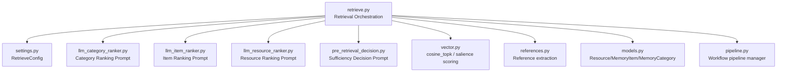
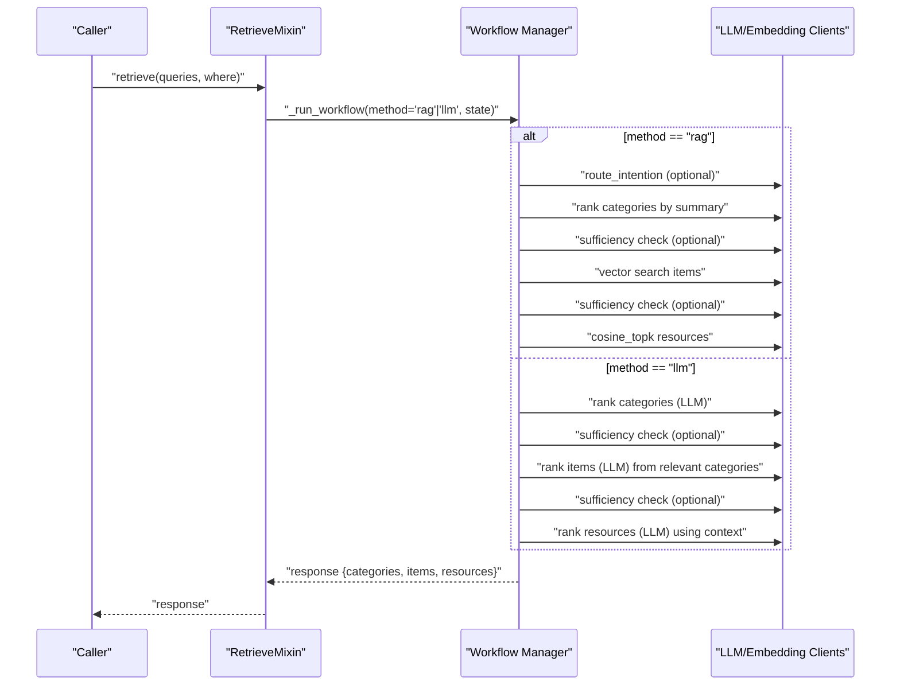
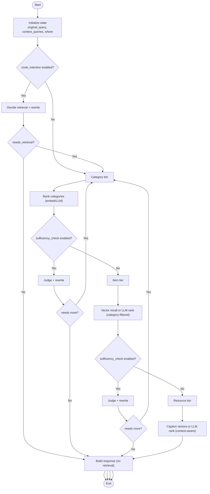
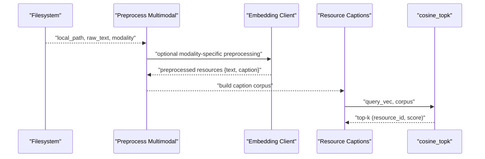
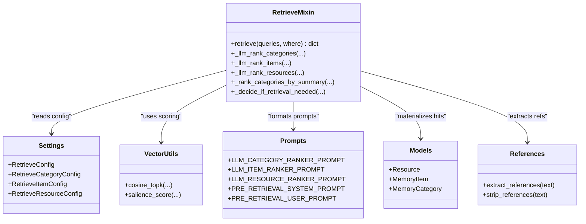
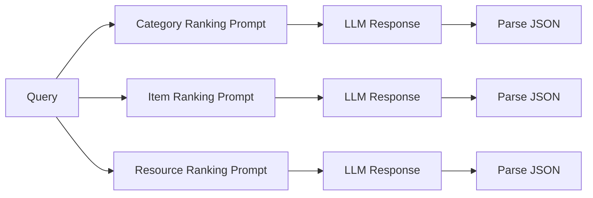
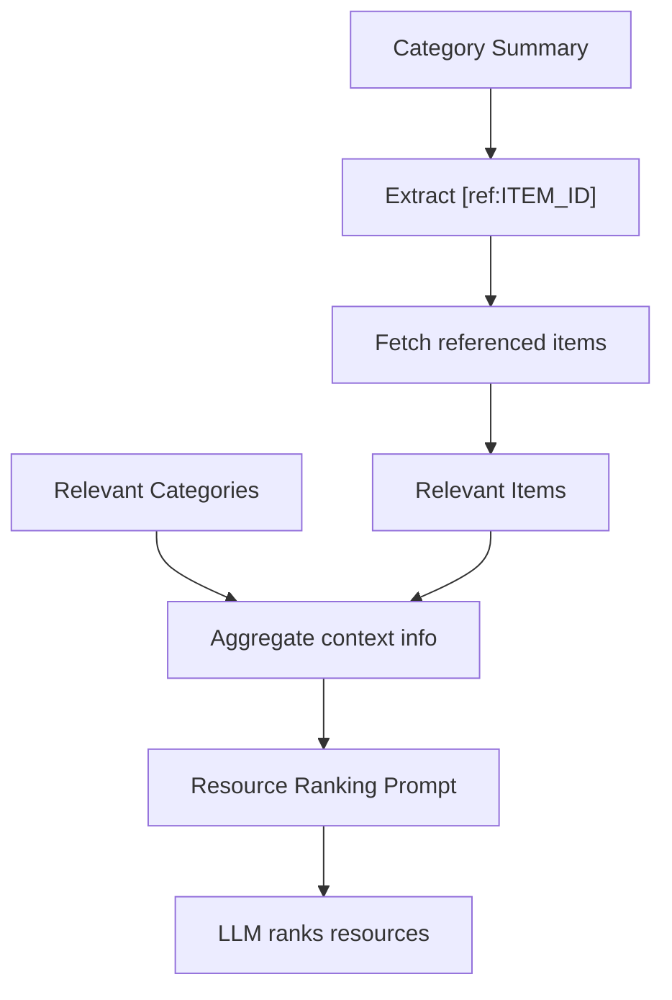
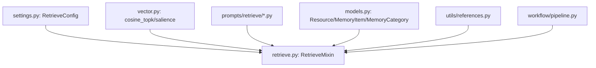

# Resource Ranking Phase

<cite>
**Referenced Files in This Document**
- [retrieve.py](file://src/memu/app/retrieve.py)
- [settings.py](file://src/memu/app/settings.py)
- [models.py](file://src/memu/database/models.py)
- [vector.py](file://src/memu/database/inmemory/vector.py)
- [references.py](file://src/memu/utils/references.py)
- [llm_category_ranker.py](file://src/memu/prompts/retrieve/llm_category_ranker.py)
- [llm_item_ranker.py](file://src/memu/prompts/retrieve/llm_item_ranker.py)
- [llm_resource_ranker.py](file://src/memu/prompts/retrieve/llm_resource_ranker.py)
- [pre_retrieval_decision.py](file://src/memu/prompts/retrieve/pre_retrieval_decision.py)
- [query_rewriter.py](file://src/memu/prompts/retrieve/query_rewriter.py)
- [pipeline.py](file://src/memu/workflow/pipeline.py)
</cite>

## Table of Contents
1. [Introduction](#introduction)
2. [Project Structure](#project-structure)
3. [Core Components](#core-components)
4. [Architecture Overview](#architecture-overview)
5. [Detailed Component Analysis](#detailed-component-analysis)
6. [Dependency Analysis](#dependency-analysis)
7. [Performance Considerations](#performance-considerations)
8. [Troubleshooting Guide](#troubleshooting-guide)
9. [Conclusion](#conclusion)
10. [Appendices](#appendices)

## Introduction
This document explains the resource ranking phase that drives LLM-powered prioritization across heterogeneous memory resources. It covers the multi-modal ingestion and processing pipeline, cross-context scoring, and unified ranking across categories, memory items, and external resources. It documents prompt engineering for ranking, context aggregation, relevance assessment, and advanced features such as reference-aware retrieval, salience-aware ranking, and performance optimizations tailored for mixed modalities (text, image, audio, video).

## Project Structure
The resource ranking phase is implemented in the retrieval module and integrates with configuration, vector scoring utilities, and prompt templates. The key areas are:
- Retrieval orchestration and workflows
- Configuration for retrieval modes, top-K, sufficiency checks, and ranking strategies
- Vector scoring utilities for similarity and salience-aware ranking
- Prompt templates for category, item, and resource ranking
- Utilities for reference parsing and multimodal preprocessing

**Diagram sources**
- [retrieve.py](file://src/memu/app/retrieve.py#L1-L1419)
- [settings.py](file://src/memu/app/settings.py#L175-L202)
- [llm_category_ranker.py](file://src/memu/prompts/retrieve/llm_category_ranker.py#L1-L36)
- [llm_item_ranker.py](file://src/memu/prompts/retrieve/llm_item_ranker.py#L1-L41)
- [llm_resource_ranker.py](file://src/memu/prompts/retrieve/llm_resource_ranker.py#L1-L41)
- [pre_retrieval_decision.py](file://src/memu/prompts/retrieve/pre_retrieval_decision.py#L1-L54)
- [vector.py](file://src/memu/database/inmemory/vector.py#L56-L138)
- [references.py](file://src/memu/utils/references.py#L20-L49)
- [models.py](file://src/memu/database/models.py#L68-L106)
- [pipeline.py](file://src/memu/workflow/pipeline.py#L21-L171)

**Section sources**
- [retrieve.py](file://src/memu/app/retrieve.py#L1-L1419)
- [settings.py](file://src/memu/app/settings.py#L175-L202)

## Core Components
- Retrieval orchestration: Implements two strategies—embedding-based RAG and LLM-driven ranking—each with sufficiency checks and iterative query rewriting.
- Configuration: Centralized RetrieveConfig controls method selection, top-K limits, sufficiency checks, and LLM profiles.
- Scoring utilities: Vector similarity and salience-aware scoring for items; caption embeddings for resources.
- Prompts: Dedicated templates for category, item, and resource ranking with structured outputs.
- References: Extraction and usage of item references embedded in category summaries to expand recall.
- Data models: Resource, MemoryItem, MemoryCategory define the schema for heterogeneous resources.

**Section sources**
- [retrieve.py](file://src/memu/app/retrieve.py#L42-L85)
- [settings.py](file://src/memu/app/settings.py#L175-L202)
- [vector.py](file://src/memu/database/inmemory/vector.py#L56-L138)
- [references.py](file://src/memu/utils/references.py#L20-L49)
- [models.py](file://src/memu/database/models.py#L68-L106)

## Architecture Overview
The retrieval system supports two primary workflows:
- RAG workflow: Embedding-based vector search with optional sufficiency checks and iterative query rewriting.
- LLM workflow: LLM-driven ranking at each tier (categories → items → resources) with structured outputs and cross-context fusion.

**Diagram sources**
- [retrieve.py](file://src/memu/app/retrieve.py#L42-L85)
- [retrieve.py](file://src/memu/app/retrieve.py#L106-L210)
- [retrieve.py](file://src/memu/app/retrieve.py#L454-L536)

## Detailed Component Analysis

### Retrieval Orchestration and Workflows
- Method selection: The retrieve method chooses between RAG and LLM workflows based on configuration.
- State management: A shared WorkflowState carries the original query, rewritten query, context queries, filters, and intermediate results.
- Steps:
  - Route intention: Optional judgment to determine if retrieval is needed and to rewrite the query.
  - Category ranking: Embedding-based ranking by summary or LLM-based ranking.
  - Sufficiency checks: Judge whether more tiers are needed and rewrite the query accordingly.
  - Item recall: Vector search or LLM ranking constrained to relevant categories; supports reference-aware expansion.
  - Resource recall: Vector search on captions or LLM ranking guided by category/item context.
  - Context building: Materialize hits into final response with scores.

**Diagram sources**
- [retrieve.py](file://src/memu/app/retrieve.py#L42-L85)
- [retrieve.py](file://src/memu/app/retrieve.py#L106-L210)
- [retrieve.py](file://src/memu/app/retrieve.py#L454-L536)
- [retrieve.py](file://src/memu/app/retrieve.py#L746-L865)

**Section sources**
- [retrieve.py](file://src/memu/app/retrieve.py#L42-L85)
- [retrieve.py](file://src/memu/app/retrieve.py#L106-L210)
- [retrieve.py](file://src/memu/app/retrieve.py#L454-L536)
- [retrieve.py](file://src/memu/app/retrieve.py#L746-L865)

### Multi-Modal Resource Processing and Cross-Context Scoring
- Multimodal ingestion: Resources are fetched and preprocessed according to modality, producing text and captions suitable for downstream ranking.
- Caption embeddings: Resources with captions are embedded and ranked via cosine similarity.
- Cross-context fusion: Category and item relevance informs resource ranking by constraining the resource pool and constructing context info.
- Reference-aware retrieval: Category summaries may include [ref:ITEM_ID] citations; these are extracted and used to fetch referenced items, expanding recall.

**Diagram sources**
- [retrieve.py](file://src/memu/app/retrieve.py#L186-L197)
- [retrieve.py](file://src/memu/app/retrieve.py#L400-L424)
- [retrieve.py](file://src/memu/app/retrieve.py#L996-L1004)
- [vector.py](file://src/memu/database/inmemory/vector.py#L56-L91)

**Section sources**
- [retrieve.py](file://src/memu/app/retrieve.py#L186-L197)
- [retrieve.py](file://src/memu/app/retrieve.py#L400-L424)
- [retrieve.py](file://src/memu/app/retrieve.py#L996-L1004)
- [vector.py](file://src/memu/database/inmemory/vector.py#L56-L91)

### Unified Ranking Across Resource Types
- Categories: Ranked by summary embeddings or by LLM using a structured prompt.
- Items: Ranked by similarity or salience-aware score; supports category-filtered recall and reference-aware expansion.
- Resources: Ranked by caption embeddings or by LLM using context from categories and items.

**Diagram sources**
- [retrieve.py](file://src/memu/app/retrieve.py#L1216-L1323)
- [settings.py](file://src/memu/app/settings.py#L146-L173)
- [vector.py](file://src/memu/database/inmemory/vector.py#L56-L138)
- [llm_category_ranker.py](file://src/memu/prompts/retrieve/llm_category_ranker.py#L1-L36)
- [llm_item_ranker.py](file://src/memu/prompts/retrieve/llm_item_ranker.py#L1-L41)
- [llm_resource_ranker.py](file://src/memu/prompts/retrieve/llm_resource_ranker.py#L1-L41)
- [pre_retrieval_decision.py](file://src/memu/prompts/retrieve/pre_retrieval_decision.py#L1-L54)
- [models.py](file://src/memu/database/models.py#L68-L106)
- [references.py](file://src/memu/utils/references.py#L20-L49)

**Section sources**
- [retrieve.py](file://src/memu/app/retrieve.py#L1216-L1323)
- [settings.py](file://src/memu/app/settings.py#L146-L173)
- [vector.py](file://src/memu/database/inmemory/vector.py#L56-L138)
- [llm_category_ranker.py](file://src/memu/prompts/retrieve/llm_category_ranker.py#L1-L36)
- [llm_item_ranker.py](file://src/memu/prompts/retrieve/llm_item_ranker.py#L1-L41)
- [llm_resource_ranker.py](file://src/memu/prompts/retrieve/llm_resource_ranker.py#L1-L41)
- [pre_retrieval_decision.py](file://src/memu/prompts/retrieve/pre_retrieval_decision.py#L1-L54)
- [models.py](file://src/memu/database/models.py#L68-L106)
- [references.py](file://src/memu/utils/references.py#L20-L49)

### Prompt Engineering for Ranking
- Category ranking prompt: Guides the LLM to select up to top_K relevant categories and return a JSON list of category IDs.
- Item ranking prompt: Constrains ranking to items within relevant categories and returns a JSON list of item IDs.
- Resource ranking prompt: Uses aggregated context (categories and items) to rank resources and returns a JSON list of resource IDs.
- Pre-retrieval decision prompt: Structured judgment to decide whether retrieval is needed and to rewrite the query.

**Diagram sources**
- [llm_category_ranker.py](file://src/memu/prompts/retrieve/llm_category_ranker.py#L1-L36)
- [llm_item_ranker.py](file://src/memu/prompts/retrieve/llm_item_ranker.py#L1-L41)
- [llm_resource_ranker.py](file://src/memu/prompts/retrieve/llm_resource_ranker.py#L1-L41)
- [retrieve.py](file://src/memu/app/retrieve.py#L1216-L1323)

**Section sources**
- [llm_category_ranker.py](file://src/memu/prompts/retrieve/llm_category_ranker.py#L1-L36)
- [llm_item_ranker.py](file://src/memu/prompts/retrieve/llm_item_ranker.py#L1-L41)
- [llm_resource_ranker.py](file://src/memu/prompts/retrieve/llm_resource_ranker.py#L1-L41)
- [retrieve.py](file://src/memu/app/retrieve.py#L1216-L1323)

### Context Aggregation and Cross-Modal Relevance Assessment
- Context aggregation: Builds context_info from relevant categories and items to inform resource ranking.
- Cross-modal relevance: Items and resources may originate from different modalities; relevance is assessed via embeddings (captions/items) or LLM ranking.
- Reference-aware expansion: Extracts item references from category summaries to broaden item recall.

**Diagram sources**
- [retrieve.py](file://src/memu/app/retrieve.py#L1280-L1323)
- [retrieve.py](file://src/memu/app/retrieve.py#L615-L657)
- [references.py](file://src/memu/utils/references.py#L20-L49)

**Section sources**
- [retrieve.py](file://src/memu/app/retrieve.py#L1280-L1323)
- [retrieve.py](file://src/memu/app/retrieve.py#L615-L657)
- [references.py](file://src/memu/utils/references.py#L20-L49)

### Advanced Features
- Resource type adaptation: Different ranking strategies per tier (embedding for categories/items, captions for resources; LLM for all tiers).
- Context fusion: Resource ranking leverages category and item context to improve relevance.
- Salience-aware ranking: Items can be ranked using similarity × log(reinforcement+1) × recency factor.
- Reference-aware retrieval: Expands item recall using references embedded in category summaries.

**Section sources**
- [retrieve.py](file://src/memu/app/retrieve.py#L346-L367)
- [retrieve.py](file://src/memu/app/retrieve.py#L615-L657)
- [vector.py](file://src/memu/database/inmemory/vector.py#L16-L53)
- [settings.py](file://src/memu/app/settings.py#L151-L168)

### Configuration Options
- RetrieveConfig:
  - method: "rag" or "llm"
  - route_intention: Enable pre-retrieval routing and query rewriting
  - category/top_k, item/top_k, resource/top_k: Controls breadth of retrieval per tier
  - sufficiency_check: Enable iterative sufficiency checks
  - sufficiency_check_llm_profile, llm_ranking_llm_profile: Profiles for LLM clients
- RetrieveItemConfig:
  - use_category_references: Enable reference-aware item recall
  - ranking: "similarity" or "salience"
  - recency_decay_days: Half-life for recency decay in salience scoring
- LLMProfilesConfig: Named profiles for LLM/embedding/VLM/STT backends

**Section sources**
- [settings.py](file://src/memu/app/settings.py#L175-L202)
- [settings.py](file://src/memu/app/settings.py#L146-L173)
- [settings.py](file://src/memu/app/settings.py#L151-L168)
- [settings.py](file://src/memu/app/settings.py#L263-L297)

## Dependency Analysis
The retrieval module depends on:
- Configuration for behavior control
- Vector utilities for scoring
- Prompt templates for structured LLM interactions
- Data models for typed records
- Reference utilities for cross-linking
- Workflow pipeline manager for step orchestration

**Diagram sources**
- [settings.py](file://src/memu/app/settings.py#L175-L202)
- [retrieve.py](file://src/memu/app/retrieve.py#L1-L1419)
- [vector.py](file://src/memu/database/inmemory/vector.py#L56-L138)
- [references.py](file://src/memu/utils/references.py#L20-L49)
- [pipeline.py](file://src/memu/workflow/pipeline.py#L21-L171)

**Section sources**
- [retrieve.py](file://src/memu/app/retrieve.py#L1-L1419)
- [settings.py](file://src/memu/app/settings.py#L175-L202)
- [vector.py](file://src/memu/database/inmemory/vector.py#L56-L138)
- [references.py](file://src/memu/utils/references.py#L20-L49)
- [pipeline.py](file://src/memu/workflow/pipeline.py#L21-L171)

## Performance Considerations
- Vectorized scoring: cosine_topk uses vectorized NumPy operations and argpartition for efficient top-K selection.
- Salience-aware scoring: Logarithmic reinforcement factor and exponential recency decay prevent dominance by frequently reinforced facts while keeping recent memories influential.
- Iterative sufficiency checks: Early termination reduces unnecessary computation when the current context is sufficient.
- Reference-aware recall: Reduces redundant LLM calls by fetching referenced items directly when available.

[No sources needed since this section provides general guidance]

## Troubleshooting Guide
- Empty or invalid queries: Validation extracts text from structured messages and raises explicit errors for invalid formats.
- Parsing failures: LLM response parsing catches exceptions and logs warnings; fallback behavior ensures robustness.
- Unknown filter fields: Where filters are validated against the user model fields to avoid runtime errors.
- Decision extraction: Regex-based extraction for decisions and rewritten queries with sensible defaults.

**Section sources**
- [retrieve.py](file://src/memu/app/retrieve.py#L812-L839)
- [retrieve.py](file://src/memu/app/retrieve.py#L1325-L1395)
- [retrieve.py](file://src/memu/app/retrieve.py#L87-L104)
- [retrieve.py](file://src/memu/app/retrieve.py#L841-L865)

## Conclusion
The resource ranking phase combines embedding-based and LLM-driven strategies to deliver unified, context-aware prioritization across categories, items, and heterogeneous resources. Through structured prompts, cross-context fusion, reference-aware retrieval, and configurable ranking modes, the system adapts to diverse use cases while maintaining performance and reliability.

## Appendices

### Concrete Examples and Strategies
- Category context-driven ranking: Use LLM ranking to select top_K categories, then constrain subsequent tiers to those categories.
- Item-based recommendations: Rank items within relevant categories using either similarity or salience-aware scoring; optionally enable reference-aware recall.
- Cross-modal retrieval: Rank resources by caption embeddings; when LLM mode is used, supply aggregated category/item context to improve relevance.

[No sources needed since this section provides general guidance]