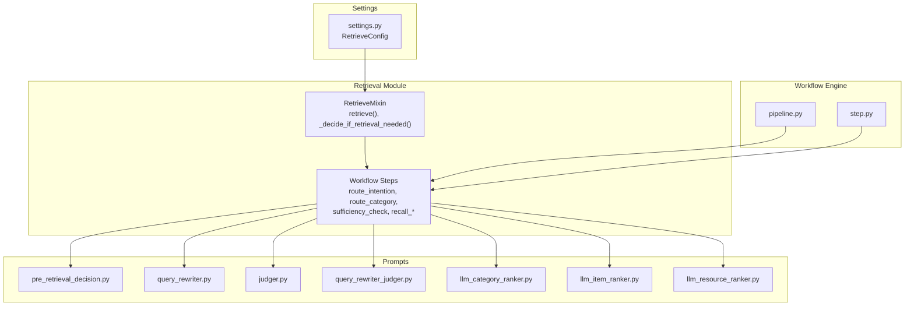
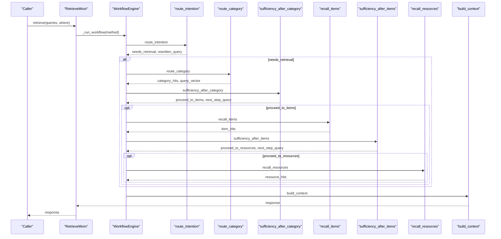
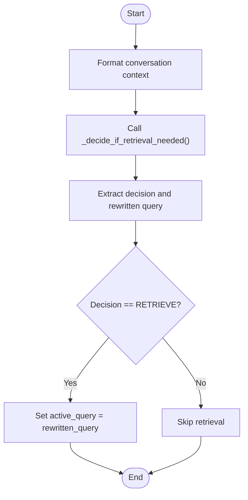
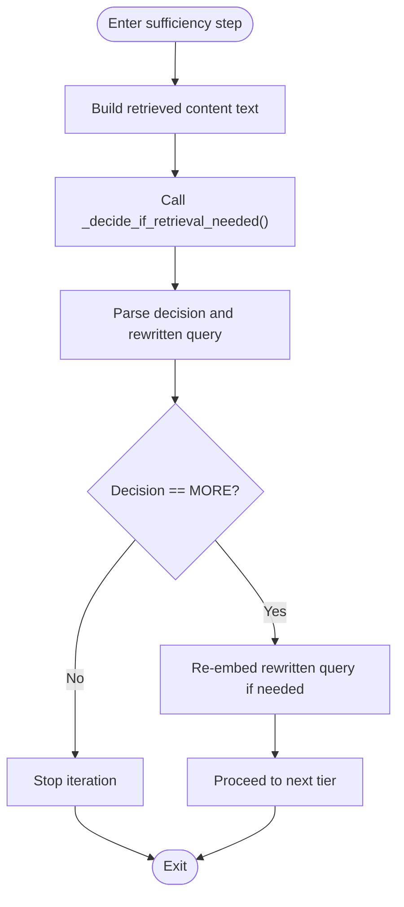
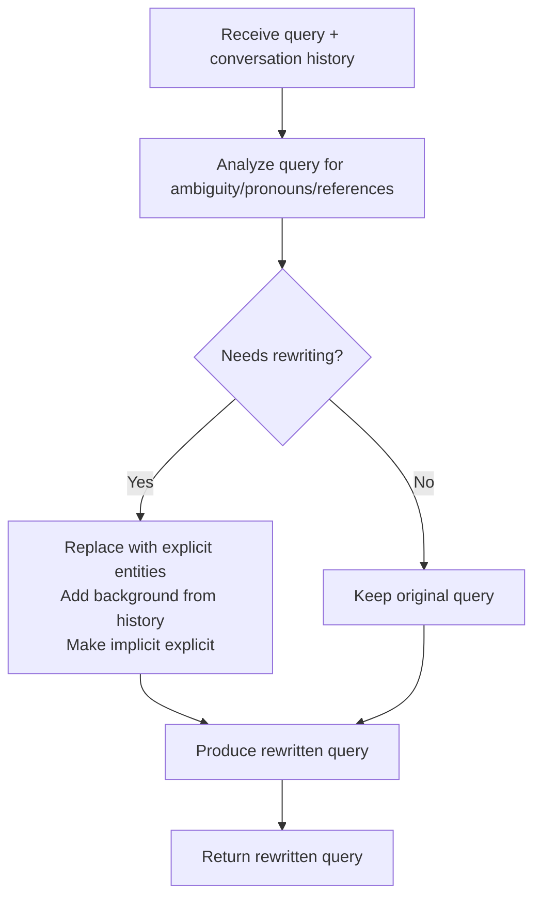
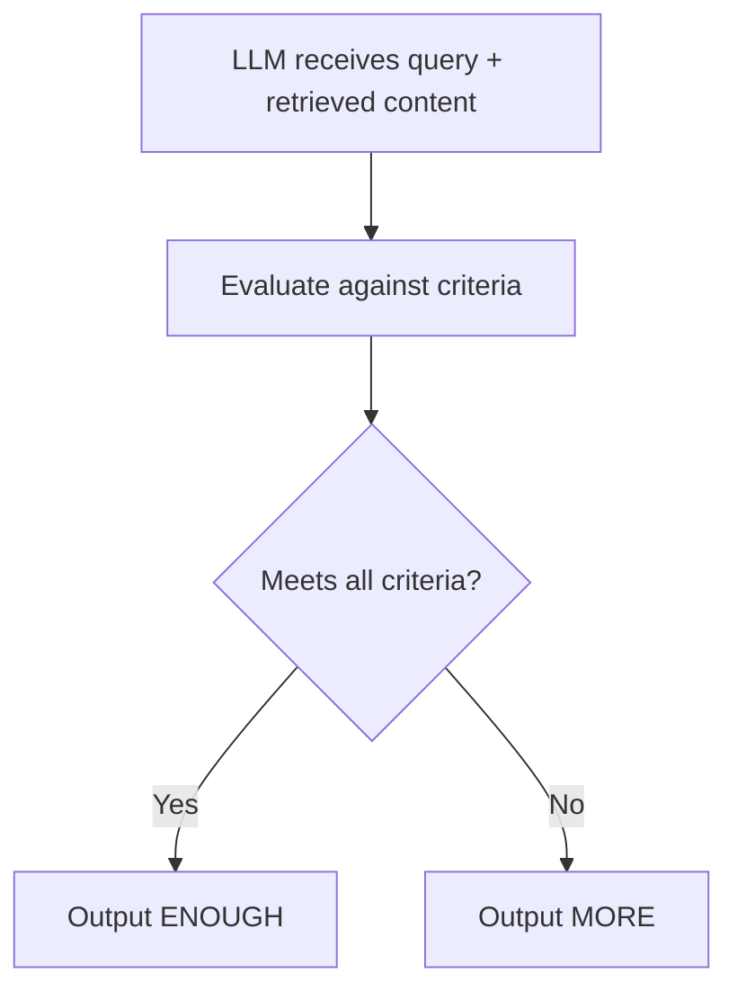
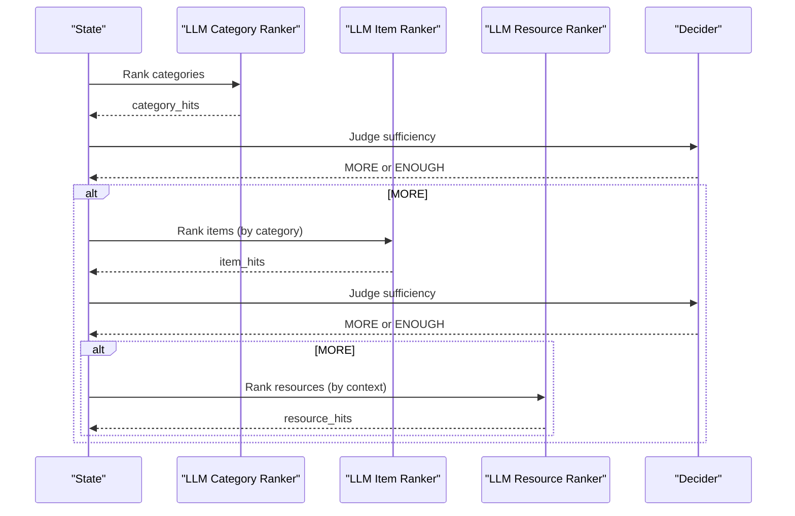
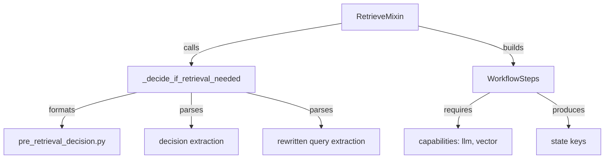

# Sufficiency Checking and Query Rewriting

<cite>
**Referenced Files in This Document**
- [retrieve.py](file://src/memu/app/retrieve.py)
- [settings.py](file://src/memu/app/settings.py)
- [pre_retrieval_decision.py](file://src/memu/prompts/retrieve/pre_retrieval_decision.py)
- [query_rewriter.py](file://src/memu/prompts/retrieve/query_rewriter.py)
- [judger.py](file://src/memu/prompts/retrieve/judger.py)
- [query_rewriter_judger.py](file://src/memu/prompts/retrieve/query_rewriter_judger.py)
- [llm_category_ranker.py](file://src/memu/prompts/retrieve/llm_category_ranker.py)
- [llm_item_ranker.py](file://src/memu/prompts/retrieve/llm_item_ranker.py)
- [llm_resource_ranker.py](file://src/memu/prompts/retrieve/llm_resource_ranker.py)
- [pipeline.py](file://src/memu/workflow/pipeline.py)
- [step.py](file://src/memu/workflow/step.py)
</cite>

## Table of Contents
1. [Introduction](#introduction)
2. [Project Structure](#project-structure)
3. [Core Components](#core-components)
4. [Architecture Overview](#architecture-overview)
5. [Detailed Component Analysis](#detailed-component-analysis)
6. [Dependency Analysis](#dependency-analysis)
7. [Performance Considerations](#performance-considerations)
8. [Troubleshooting Guide](#troubleshooting-guide)
9. [Conclusion](#conclusion)

## Introduction
This document explains the sufficiency checking and query rewriting mechanism used to make intelligent decisions about retrieval depth and refine queries iteratively. It covers:
- Initial query assessment and contextual evaluation
- Decision logic for continuing retrieval across tiers
- Query rewriting strategies grounded in conversation context
- Prompt engineering for sufficiency judgment and query rewriting
- Extraction algorithms for structured decisions and rewritten queries
- Practical examples of sufficiency determination, iterative refinement, and dynamic continuation
- Advanced features such as context-aware decision making, multi-step optimization, and performance feedback loops
- Configuration options for thresholds, rewriting strategies, and prompts

## Project Structure
The sufficiency checking and query rewriting pipeline is implemented as part of the retrieval module and orchestrated via a workflow engine. Prompts define the instruction-following tasks for LLMs, while settings configure runtime behavior.

**Diagram sources**
- [retrieve.py](file://src/memu/app/retrieve.py#L42-L85)
- [pre_retrieval_decision.py](file://src/memu/prompts/retrieve/pre_retrieval_decision.py#L1-L54)
- [query_rewriter.py](file://src/memu/prompts/retrieve/query_rewriter.py#L1-L45)
- [judger.py](file://src/memu/prompts/retrieve/judger.py#L1-L40)
- [query_rewriter_judger.py](file://src/memu/prompts/retrieve/query_rewriter_judger.py#L1-L49)
- [llm_category_ranker.py](file://src/memu/prompts/retrieve/llm_category_ranker.py#L1-L36)
- [llm_item_ranker.py](file://src/memu/prompts/retrieve/llm_item_ranker.py#L1-L41)
- [llm_resource_ranker.py](file://src/memu/prompts/retrieve/llm_resource_ranker.py#L1-L41)
- [settings.py](file://src/memu/app/settings.py#L175-L202)
- [pipeline.py](file://src/memu/workflow/pipeline.py#L21-L49)
- [step.py](file://src/memu/workflow/step.py#L16-L48)

**Section sources**
- [retrieve.py](file://src/memu/app/retrieve.py#L42-L85)
- [settings.py](file://src/memu/app/settings.py#L175-L202)

## Core Components
- RetrieveMixin: Orchestrates retrieval workflows, builds state, and executes steps. It exposes the public retrieve interface and internal handlers for routing, sufficiency checks, and materializing results.
- Workflow engine: Provides a typed step abstraction with capability gating and validation, enabling modular composition of retrieval stages.
- Prompts: Define instruction-following tasks for:
  - Pre-retrieval decision (NO_RETRIEVE vs RETRIEVE, optional rewriting)
  - Query rewriting (contextualization and explicitness)
  - Sufficiency judgment (ENOUGH vs MORE)
  - LLM-based ranking prompts for categories, items, and resources
- Settings: Configure retrieval method, sufficiency checks, tier enablement, and LLM profiles.

Key responsibilities:
- Initial query assessment: Route intention and optional query rewriting
- Contextual content evaluation: Aggregate retrieved content across tiers
- Decision logic: Continue retrieval if MORE, otherwise stop
- Query rewriting: Improve clarity and specificity using conversation context
- Structured extraction: Parse LLM outputs for decisions and rewritten queries

**Section sources**
- [retrieve.py](file://src/memu/app/retrieve.py#L27-L85)
- [pipeline.py](file://src/memu/workflow/pipeline.py#L21-L49)
- [step.py](file://src/memu/workflow/step.py#L16-L48)
- [pre_retrieval_decision.py](file://src/memu/prompts/retrieve/pre_retrieval_decision.py#L1-L54)
- [query_rewriter.py](file://src/memu/prompts/retrieve/query_rewriter.py#L1-L45)
- [judger.py](file://src/memu/prompts/retrieve/judger.py#L1-L40)
- [query_rewriter_judger.py](file://src/memu/prompts/retrieve/query_rewriter_judger.py#L1-L49)
- [settings.py](file://src/memu/app/settings.py#L175-L202)

## Architecture Overview
The retrieval pipeline supports two strategies:
- RAG (embedding-based): Uses vector similarity and optional sufficiency checks after each tier.
- LLM (ranking-based): Delegates relevance ranking to LLMs with structured outputs and sufficiency checks.

**Diagram sources**
- [retrieve.py](file://src/memu/app/retrieve.py#L106-L210)
- [retrieve.py](file://src/memu/app/retrieve.py#L454-L536)
- [retrieve.py](file://src/memu/app/retrieve.py#L228-L258)
- [retrieve.py](file://src/memu/app/retrieve.py#L288-L322)
- [retrieve.py](file://src/memu/app/retrieve.py#L369-L398)
- [retrieve.py](file://src/memu/app/retrieve.py#L400-L424)
- [retrieve.py](file://src/memu/app/retrieve.py#L426-L452)

## Detailed Component Analysis

### Initial Query Assessment and Contextual Evaluation
- Route intention: Determines whether retrieval is needed and optionally rewrites the query using conversation context.
- Context formatting: Converts prior queries into a readable form for prompts.
- Decision extraction: Parses LLM responses to decide NO_RETRIEVE or RETRIEVE and extracts rewritten query.

**Diagram sources**
- [retrieve.py](file://src/memu/app/retrieve.py#L746-L785)
- [retrieve.py](file://src/memu/app/retrieve.py#L841-L865)
- [retrieve.py](file://src/memu/app/retrieve.py#L811-L840)

**Section sources**
- [retrieve.py](file://src/memu/app/retrieve.py#L228-L258)
- [retrieve.py](file://src/memu/app/retrieve.py#L746-L785)
- [retrieve.py](file://src/memu/app/retrieve.py#L811-L865)
- [pre_retrieval_decision.py](file://src/memu/prompts/retrieve/pre_retrieval_decision.py#L1-L54)

### Decision Logic for Continuing Retrieval
- After each tier, the system aggregates retrieved content and asks the LLM to judge sufficiency.
- The decision is extracted conservatively: ENOUGH stops iteration; MORE continues to the next tier.
- Rewritten query is carried forward to refine subsequent searches.

**Diagram sources**
- [retrieve.py](file://src/memu/app/retrieve.py#L288-L322)
- [retrieve.py](file://src/memu/app/retrieve.py#L369-L398)
- [retrieve.py](file://src/memu/app/retrieve.py#L746-L785)
- [retrieve.py](file://src/memu/app/retrieve.py#L1006-L1019)

**Section sources**
- [retrieve.py](file://src/memu/app/retrieve.py#L288-L322)
- [retrieve.py](file://src/memu/app/retrieve.py#L369-L398)
- [retrieve.py](file://src/memu/app/retrieve.py#L1006-L1019)

### Query Rewriting Strategies
- Context-aware rewriting: Resolve pronouns, referential expressions, implicit context, and incomplete information using conversation history.
- Faithfulness: Preserve original intent and avoid introducing new assumptions.
- Output format: Provide analysis and the rewritten query in a structured format.

**Diagram sources**
- [query_rewriter.py](file://src/memu/prompts/retrieve/query_rewriter.py#L1-L45)

**Section sources**
- [query_rewriter.py](file://src/memu/prompts/retrieve/query_rewriter.py#L1-L45)
- [query_rewriter_judger.py](file://src/memu/prompts/retrieve/query_rewriter_judger.py#L1-L49)

### Sufficiency Check Prompt Engineering
- Criteria-driven judgment: Directly addresses the question, specificity/detailedness, gaps/missing details, explicit recall requests.
- Output format: Structured XML-like tags for consideration and judgement.
- Conservative threshold: Only ENOUGH when all criteria are met.

**Diagram sources**
- [judger.py](file://src/memu/prompts/retrieve/judger.py#L1-L40)

**Section sources**
- [judger.py](file://src/memu/prompts/retrieve/judger.py#L1-L40)
- [query_rewriter_judger.py](file://src/memu/prompts/retrieve/query_rewriter_judger.py#L1-L49)

### Multi-Step Query Optimization and Dynamic Continuation
- Hierarchical tiers: Categories → Items → Resources, with optional LLM ranking per tier.
- Iterative refinement: After each tier, the system decides whether to continue and updates the query vector accordingly.
- Reference-aware item retrieval: Optionally follow category-provided references to fetch related items.

**Diagram sources**
- [retrieve.py](file://src/memu/app/retrieve.py#L570-L588)
- [retrieve.py](file://src/memu/app/retrieve.py#L615-L657)
- [retrieve.py](file://src/memu/app/retrieve.py#L684-L706)
- [llm_category_ranker.py](file://src/memu/prompts/retrieve/llm_category_ranker.py#L1-L36)
- [llm_item_ranker.py](file://src/memu/prompts/retrieve/llm_item_ranker.py#L1-L41)
- [llm_resource_ranker.py](file://src/memu/prompts/retrieve/llm_resource_ranker.py#L1-L41)

**Section sources**
- [retrieve.py](file://src/memu/app/retrieve.py#L570-L588)
- [retrieve.py](file://src/memu/app/retrieve.py#L615-L657)
- [retrieve.py](file://src/memu/app/retrieve.py#L684-L706)
- [llm_category_ranker.py](file://src/memu/prompts/retrieve/llm_category_ranker.py#L1-L36)
- [llm_item_ranker.py](file://src/memu/prompts/retrieve/llm_item_ranker.py#L1-L41)
- [llm_resource_ranker.py](file://src/memu/prompts/retrieve/llm_resource_ranker.py#L1-L41)

### Configuration Options
- Method: rag or llm
- route_intention: Enable/disable initial routing and rewriting
- sufficiency_check: Enable/disable sufficiency checks after each tier
- sufficiency_check_prompt: Override user prompt for sufficiency checks
- sufficiency_check_llm_profile: LLM profile for sufficiency checks
- llm_ranking_llm_profile: LLM profile for LLM-based ranking
- Category/Item/Resource tiers: Enable/disable and configure top_k

**Section sources**
- [settings.py](file://src/memu/app/settings.py#L175-L202)

## Dependency Analysis
The retrieval module composes workflow steps with capability requirements and validates dependencies. The decider function bridges prompts and LLM clients, extracting structured outputs.

**Diagram sources**
- [retrieve.py](file://src/memu/app/retrieve.py#L746-L785)
- [retrieve.py](file://src/memu/app/retrieve.py#L841-L865)
- [retrieve.py](file://src/memu/app/retrieve.py#L106-L210)
- [retrieve.py](file://src/memu/app/retrieve.py#L454-L536)
- [pre_retrieval_decision.py](file://src/memu/prompts/retrieve/pre_retrieval_decision.py#L1-L54)

**Section sources**
- [retrieve.py](file://src/memu/app/retrieve.py#L106-L210)
- [retrieve.py](file://src/memu/app/retrieve.py#L454-L536)
- [pipeline.py](file://src/memu/workflow/pipeline.py#L131-L165)
- [step.py](file://src/memu/workflow/step.py#L16-L48)

## Performance Considerations
- Embedding reuse: Re-embed the rewritten query when continuing retrieval to align vectors with refined semantics.
- Tier pruning: Disable tiers or reduce top_k to limit compute when sufficiency is met early.
- LLM profiles: Separate profiles for ranking and sufficiency checks to balance cost and quality.
- Salience-aware item ranking: Use recency decay and reinforcement signals to prioritize relevant items.
- Reference-aware retrieval: Follow category references to reduce iterations by fetching targeted items directly.

[No sources needed since this section provides general guidance]

## Troubleshooting Guide
Common issues and remedies:
- Unclear decisions: If the LLM response lacks structured tags, the extractor falls back to defaults. Ensure prompts include required output blocks.
- Empty or missing content: The decider normalizes missing content to a default message to avoid parsing errors.
- Capability mismatches: Validate that required capabilities (e.g., llm, vector) are available in the workflow step configuration.
- Unknown LLM profile: The pipeline manager raises an error if a step references a non-existent profile.

**Section sources**
- [retrieve.py](file://src/memu/app/retrieve.py#L841-L865)
- [retrieve.py](file://src/memu/app/retrieve.py#L1006-L1019)
- [pipeline.py](file://src/memu/workflow/pipeline.py#L147-L154)

## Conclusion
The sufficiency checking and query rewriting mechanism provides a robust, context-aware retrieval loop that balances accuracy and efficiency. By combining structured prompts, iterative judgment, and dynamic query refinement, the system adapts to user intent across conversational contexts. Configurable profiles and tier controls enable tuning for performance and quality trade-offs, while the workflow engine ensures composability and maintainability.