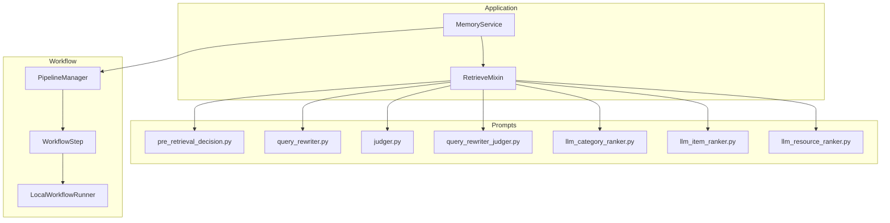
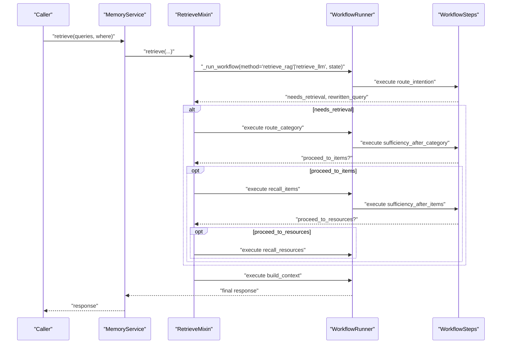
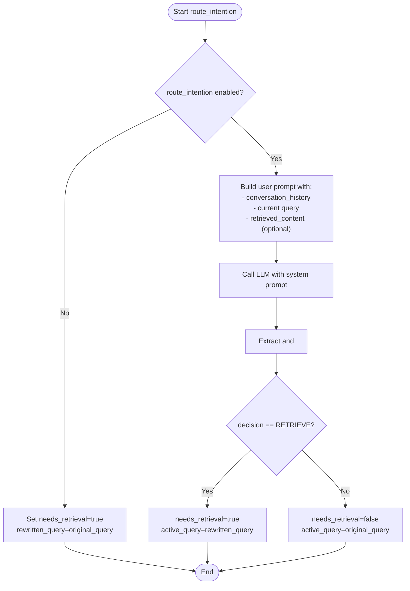
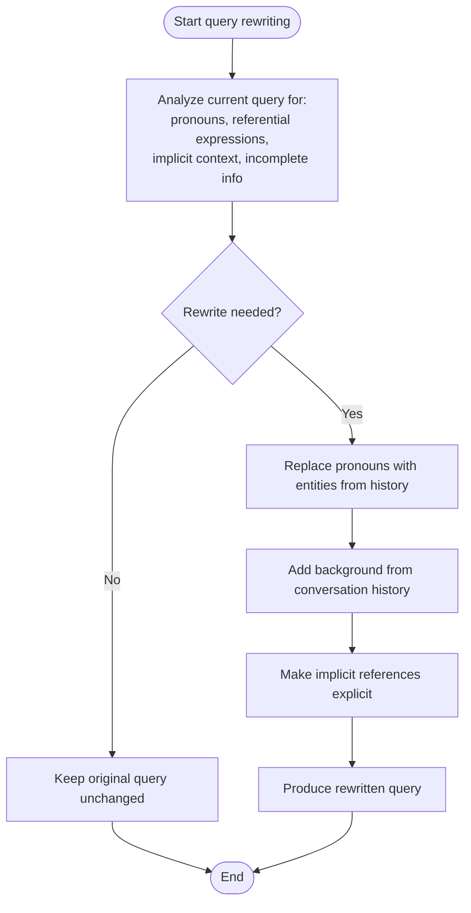
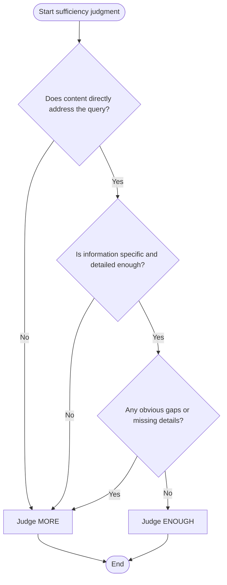
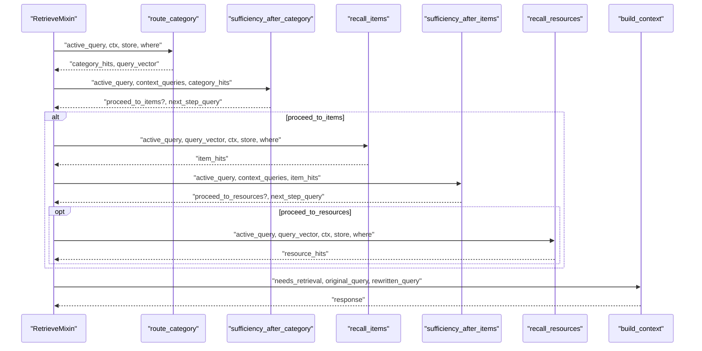
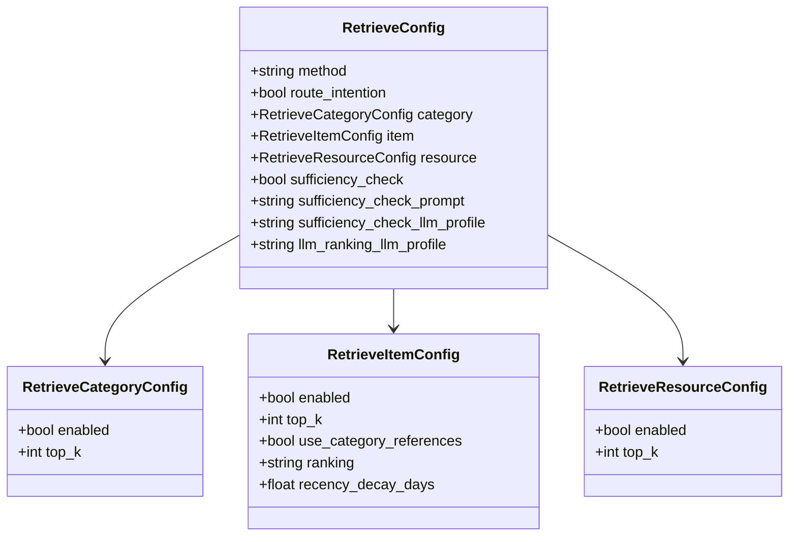
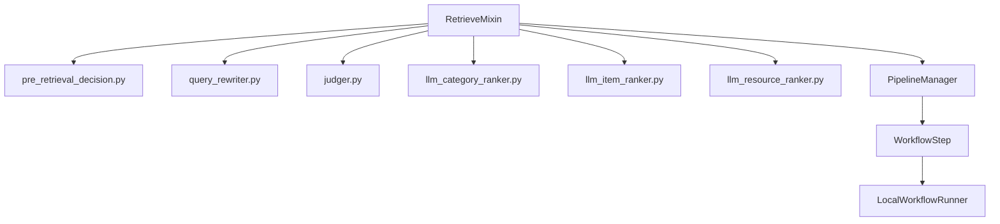

# Query Intent Routing and Classification

<cite>
**Referenced Files in This Document**
- [retrieve.py](file://src/memu/app/retrieve.py)
- [pre_retrieval_decision.py](file://src/memu/prompts/retrieve/pre_retrieval_decision.py)
- [query_rewriter.py](file://src/memu/prompts/retrieve/query_rewriter.py)
- [judger.py](file://src/memu/prompts/retrieve/judger.py)
- [query_rewriter_judger.py](file://src/memu/prompts/retrieve/query_rewriter_judger.py)
- [llm_category_ranker.py](file://src/memu/prompts/retrieve/llm_category_ranker.py)
- [llm_item_ranker.py](file://src/memu/prompts/retrieve/llm_item_ranker.py)
- [llm_resource_ranker.py](file://src/memu/prompts/retrieve/llm_resource_ranker.py)
- [service.py](file://src/memu/app/service.py)
- [settings.py](file://src/memu/app/settings.py)
- [pipeline.py](file://src/memu/workflow/pipeline.py)
- [step.py](file://src/memu/workflow/step.py)
- [runner.py](file://src/memu/workflow/runner.py)
</cite>

## Table of Contents
1. [Introduction](#introduction)
2. [Project Structure](#project-structure)
3. [Core Components](#core-components)
4. [Architecture Overview](#architecture-overview)
5. [Detailed Component Analysis](#detailed-component-analysis)
6. [Dependency Analysis](#dependency-analysis)
7. [Performance Considerations](#performance-considerations)
8. [Troubleshooting Guide](#troubleshooting-guide)
9. [Conclusion](#conclusion)
10. [Appendices](#appendices)

## Introduction
This document explains the query intent routing and classification mechanisms that determine whether memory retrieval is necessary and how to transform queries for optimal results. It focuses on the route_intention system that decides retrieval necessity and performs context-aware query rewriting. The document covers pre-retrieval decision logic, intent classification patterns, context integration strategies, decision thresholds, configuration options, and performance optimization for the retrieval pipeline.

## Project Structure
The retrieval system is implemented as part of the MemoryService application and orchestrated through a workflow engine. Key elements:
- Route-intention and query rewriting prompts define the decision logic and transformation rules.
- Retrieval stages (categories → items → resources) are executed either via embedding-based RAG or LLM-based ranking.
- The workflow pipeline composes steps with explicit state requirements and produces, enabling deterministic control flow.
- Configuration governs routing behavior, sufficiency checks, ranking strategies, and LLM profiles.

**Diagram sources**
- [retrieve.py](file://src/memu/app/retrieve.py#L42-L85)
- [pre_retrieval_decision.py](file://src/memu/prompts/retrieve/pre_retrieval_decision.py#L1-L54)
- [query_rewriter.py](file://src/memu/prompts/retrieve/query_rewriter.py#L1-L45)
- [judger.py](file://src/memu/prompts/retrieve/judger.py#L1-L40)
- [query_rewriter_judger.py](file://src/memu/prompts/retrieve/query_rewriter_judger.py#L1-L49)
- [llm_category_ranker.py](file://src/memu/prompts/retrieve/llm_category_ranker.py#L1-L36)
- [llm_item_ranker.py](file://src/memu/prompts/retrieve/llm_item_ranker.py#L1-L41)
- [llm_resource_ranker.py](file://src/memu/prompts/retrieve/llm_resource_ranker.py#L1-L41)
- [service.py](file://src/memu/app/service.py#L315-L349)
- [pipeline.py](file://src/memu/workflow/pipeline.py#L21-L49)
- [runner.py](file://src/memu/workflow/runner.py#L28-L39)

**Section sources**
- [service.py](file://src/memu/app/service.py#L315-L349)
- [pipeline.py](file://src/memu/workflow/pipeline.py#L21-L49)
- [step.py](file://src/memu/workflow/step.py#L16-L48)
- [runner.py](file://src/memu/workflow/runner.py#L28-L39)

## Core Components
- Route-intention decision: Uses a dedicated system prompt to classify intent and decide retrieval necessity, while optionally rewriting the query with context.
- Query rewriting: Resolves pronouns, referential expressions, and implicit context to produce a self-contained query.
- Sufficiency judgment: Evaluates whether retrieved content is sufficient to answer the query, guiding continuation to deeper tiers.
- Hierarchical retrieval: Two-stage pipelines (RAG and LLM) traverse categories → items → resources, with optional sufficiency checks at each stage.
- Configuration: Controls routing behavior, sufficiency checks, ranking strategies, and LLM profiles.

**Section sources**
- [pre_retrieval_decision.py](file://src/memu/prompts/retrieve/pre_retrieval_decision.py#L1-L54)
- [query_rewriter.py](file://src/memu/prompts/retrieve/query_rewriter.py#L1-L45)
- [judger.py](file://src/memu/prompts/retrieve/judger.py#L1-L40)
- [retrieve.py](file://src/memu/app/retrieve.py#L228-L258)
- [retrieve.py](file://src/memu/app/retrieve.py#L746-L784)
- [settings.py](file://src/memu/app/settings.py#L175-L202)

## Architecture Overview
The retrieval pipeline is a workflow composed of ordered steps. Two strategies are supported:
- RAG strategy: Embeddings drive category and item retrieval; optional sufficiency checks trigger re-embedding with rewritten queries.
- LLM strategy: LLM ranks categories and items; optional sufficiency checks refine the query and continue to the next tier.

**Diagram sources**
- [retrieve.py](file://src/memu/app/retrieve.py#L42-L85)
- [retrieve.py](file://src/memu/app/retrieve.py#L106-L210)
- [retrieve.py](file://src/memu/app/retrieve.py#L454-L536)
- [runner.py](file://src/memu/workflow/runner.py#L31-L39)
- [step.py](file://src/memu/workflow/step.py#L40-L47)

## Detailed Component Analysis

### Route-intention Decision Logic
Route-intention integrates conversation context, the current query, and optionally prior retrieved content to decide:
- Whether retrieval is required (RETRIEVE vs NO_RETRIEVE)
- How to rewrite the query to incorporate relevant context

Decision thresholds and patterns:
- NO_RETRIEVE conditions include greetings, casual chat, acknowledgments, general knowledge questions, requests for clarification, and meta-questions about the system.
- RETRIEVE conditions include questions about past events, user preferences/habits/characteristics, requests to recall specific information, and references to historical data.
- If retrieval is not needed, the original query is preserved unchanged.

**Diagram sources**
- [retrieve.py](file://src/memu/app/retrieve.py#L228-L258)
- [retrieve.py](file://src/memu/app/retrieve.py#L746-L784)
- [pre_retrieval_decision.py](file://src/memu/prompts/retrieve/pre_retrieval_decision.py#L1-L54)

**Section sources**
- [retrieve.py](file://src/memu/app/retrieve.py#L228-L258)
- [retrieve.py](file://src/memu/app/retrieve.py#L746-L784)
- [pre_retrieval_decision.py](file://src/memu/prompts/retrieve/pre_retrieval_decision.py#L1-L54)

### Query Transformation Workflows
Query rewriting resolves ambiguity and makes the query self-contained:
- Identifies pronouns, referential expressions, implicit context, and incomplete information.
- Replaces pronouns with specific entities from conversation history.
- Adds necessary background from conversation history.
- Preserves original intent and avoids introducing new assumptions.

**Diagram sources**
- [query_rewriter.py](file://src/memu/prompts/retrieve/query_rewriter.py#L1-L45)

**Section sources**
- [query_rewriter.py](file://src/memu/prompts/retrieve/query_rewriter.py#L1-L45)

### Context-Aware Query Rewriting Examples
Concrete scenarios:
- Scenario A: “What did we discuss last time?”
  - Original query lacks explicit subject.
  - Rewritten query incorporates the most recent topic from conversation history.
- Scenario B: “Tell me more about it.”
  - “It” refers to a previously mentioned concept or item.
  - Rewritten query replaces “it” with the specific concept/item.
- Scenario C: “Also, what was her opinion?”
  - “Her” refers to a person discussed earlier.
  - Rewritten query replaces “her” with the person’s name or identifier.

These transformations ensure downstream retrieval systems receive precise, self-contained queries.

[No sources needed since this section provides conceptual examples]

### Sufficiency Judgment Patterns
Sufficiency judgment evaluates whether retrieved content answers the query adequately:
- Criteria include directness, specificity, completeness, and absence of obvious gaps.
- Final judgment is a single word: ENOUGH or MORE.
- The system is conservative and marks MORE if any key information is missing or unclear.

**Diagram sources**
- [judger.py](file://src/memu/prompts/retrieve/judger.py#L1-L40)

**Section sources**
- [judger.py](file://src/memu/prompts/retrieve/judger.py#L1-L40)

### Hierarchical Retrieval Pipelines
Two strategies share the same orchestration:
- RAG strategy: Embeddings compute similarity; sufficiency checks can trigger re-embedding with rewritten queries.
- LLM strategy: LLM ranks categories and items; sufficiency checks refine queries and continue to the next tier.

**Diagram sources**
- [retrieve.py](file://src/memu/app/retrieve.py#L106-L210)
- [retrieve.py](file://src/memu/app/retrieve.py#L454-L536)

**Section sources**
- [retrieve.py](file://src/memu/app/retrieve.py#L106-L210)
- [retrieve.py](file://src/memu/app/retrieve.py#L454-L536)

### Configuration Options for Routing Strategies
Key configuration controls:
- method: "rag" or "llm" to select retrieval strategy.
- route_intention: Enable/disable route-intention decision.
- category.enabled/top_k: Enable and limit category retrieval.
- item.enabled/top_k/ranking/recency_decay_days/use_category_references: Enable and tune item retrieval.
- resource.enabled/top_k: Enable and limit resource retrieval.
- sufficiency_check: Enable/disable sufficiency checks after each tier.
- sufficiency_check_llm_profile/llm_ranking_llm_profile: LLM profiles for decision and ranking.
- route_intention_prompt: Optional override for route-intention user prompt.

**Diagram sources**
- [settings.py](file://src/memu/app/settings.py#L175-L202)
- [settings.py](file://src/memu/app/settings.py#L146-L173)
- [settings.py](file://src/memu/app/settings.py#L141-L173)

**Section sources**
- [settings.py](file://src/memu/app/settings.py#L175-L202)

## Dependency Analysis
The retrieval system composes loosely coupled components:
- RetrieveMixin orchestrates workflow steps and delegates to prompts for decision-making and ranking.
- Workflow pipeline enforces capability requirements and validates step dependencies.
- Service registers pipelines and provides LLM clients with profile-based configuration.

**Diagram sources**
- [retrieve.py](file://src/memu/app/retrieve.py#L106-L210)
- [retrieve.py](file://src/memu/app/retrieve.py#L454-L536)
- [pipeline.py](file://src/memu/workflow/pipeline.py#L21-L49)
- [step.py](file://src/memu/workflow/step.py#L16-L48)
- [runner.py](file://src/memu/workflow/runner.py#L28-L39)

**Section sources**
- [retrieve.py](file://src/memu/app/retrieve.py#L106-L210)
- [retrieve.py](file://src/memu/app/retrieve.py#L454-L536)
- [pipeline.py](file://src/memu/workflow/pipeline.py#L131-L165)
- [step.py](file://src/memu/workflow/step.py#L16-L48)

## Performance Considerations
- Minimize unnecessary embeddings: Disable route_intention or sufficiency checks when queries are clearly non-retrieval to avoid costly LLM calls.
- Tune top_k per tier: Lower top_k reduces downstream computation while preserving quality.
- Prefer RAG for broad recall and LLM for precise ranking: Use RAG for early tiers and LLM for later tiers requiring nuanced relevance.
- Use category references: Enable use_category_references to skip redundant retrieval when summaries cite specific items.
- Profile separation: Assign distinct LLM profiles for ranking and sufficiency checks to balance latency and accuracy.
- Batch embeddings: When available, leverage batched embedding APIs to reduce overhead.

[No sources needed since this section provides general guidance]

## Troubleshooting Guide
Common issues and resolutions:
- Empty or invalid query: The system extracts text from structured messages; ensure the query follows the expected format.
- Missing required state keys: Workflow validation ensures previous steps produce required keys; verify step ordering and initial state.
- Unknown LLM profile: Ensure the profile exists in LLMProfilesConfig; otherwise, registration will fail.
- Insufficient retrieval: If sufficiency checks consistently mark MORE, consider increasing top_k or enabling category references.
- Unexpected route_intention decisions: Adjust route_intention_prompt or disable route_intention for simpler workflows.

**Section sources**
- [retrieve.py](file://src/memu/app/retrieve.py#L812-L839)
- [pipeline.py](file://src/memu/workflow/pipeline.py#L156-L162)
- [service.py](file://src/memu/app/service.py#L284-L295)

## Conclusion
The route_intention system provides a robust mechanism to determine retrieval necessity and to rewrite queries for precision. Combined with configurable sufficiency checks and dual retrieval strategies (RAG and LLM), the system balances cost and effectiveness. Proper configuration of routing, ranking, and LLM profiles enables tailored performance for diverse use cases.

## Appendices

### Appendix A: Route-intention Prompt Reference
- System prompt defines decision rules and output format.
- User prompt supplies conversation history, current query, and retrieved content.

**Section sources**
- [pre_retrieval_decision.py](file://src/memu/prompts/retrieve/pre_retrieval_decision.py#L1-L54)

### Appendix B: Query Rewriter Prompt Reference
- Defines rewriting workflow, rules, and output format.
- Ensures rewritten queries are self-contained and preserve intent.

**Section sources**
- [query_rewriter.py](file://src/memu/prompts/retrieve/query_rewriter.py#L1-L45)

### Appendix C: Sufficiency Judger Prompt Reference
- Defines judgment criteria and output format.
- Enforces conservative decision-making.

**Section sources**
- [judger.py](file://src/memu/prompts/retrieve/judger.py#L1-L40)

### Appendix D: LLM Rankers Prompt Reference
- Category, item, and resource rankers define structured prompts and JSON outputs for relevance ranking.

**Section sources**
- [llm_category_ranker.py](file://src/memu/prompts/retrieve/llm_category_ranker.py#L1-L36)
- [llm_item_ranker.py](file://src/memu/prompts/retrieve/llm_item_ranker.py#L1-L41)
- [llm_resource_ranker.py](file://src/memu/prompts/retrieve/llm_resource_ranker.py#L1-L41)