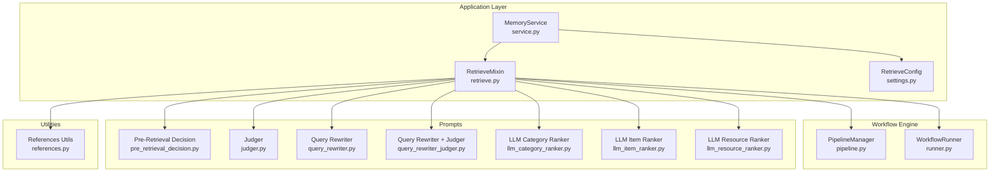
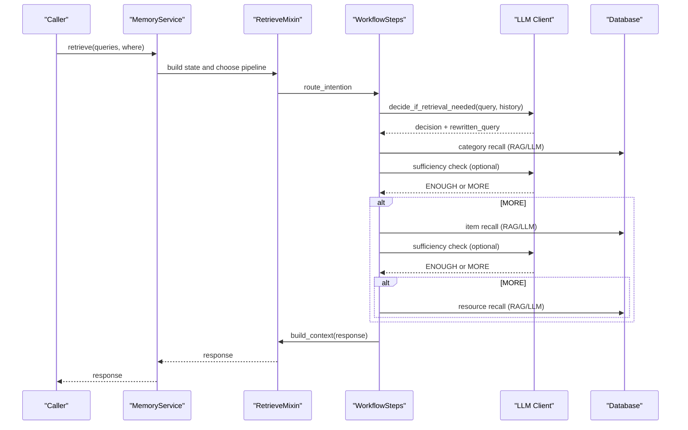
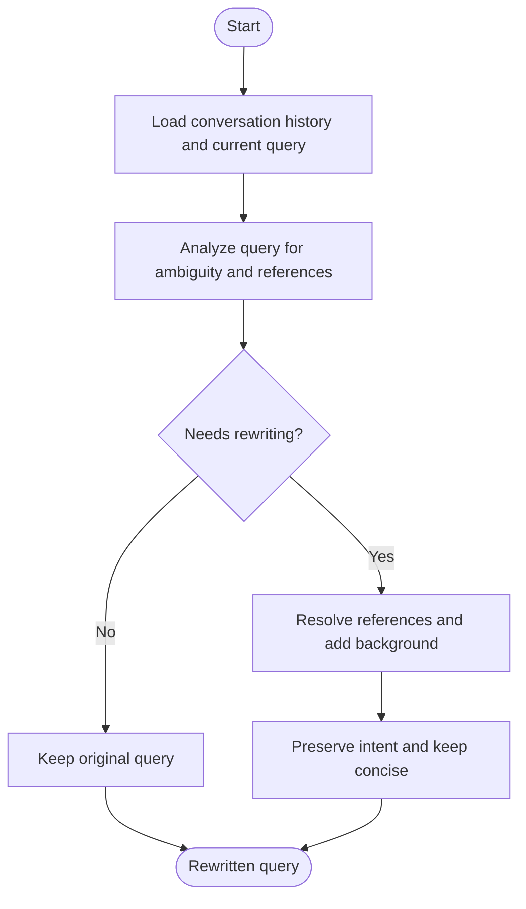
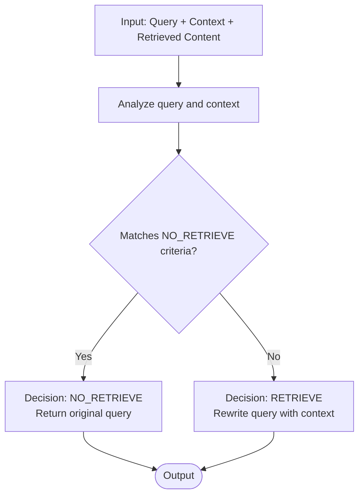
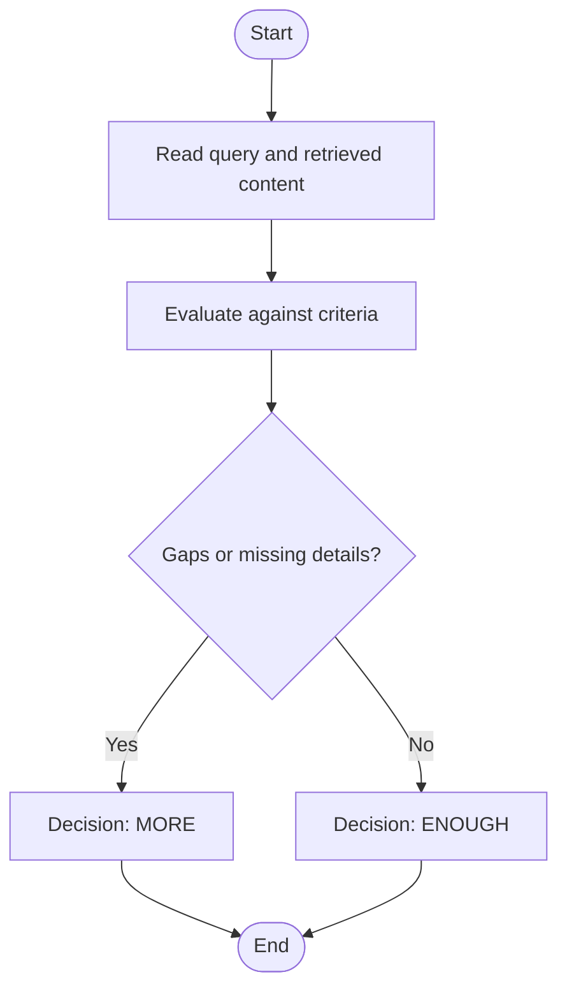
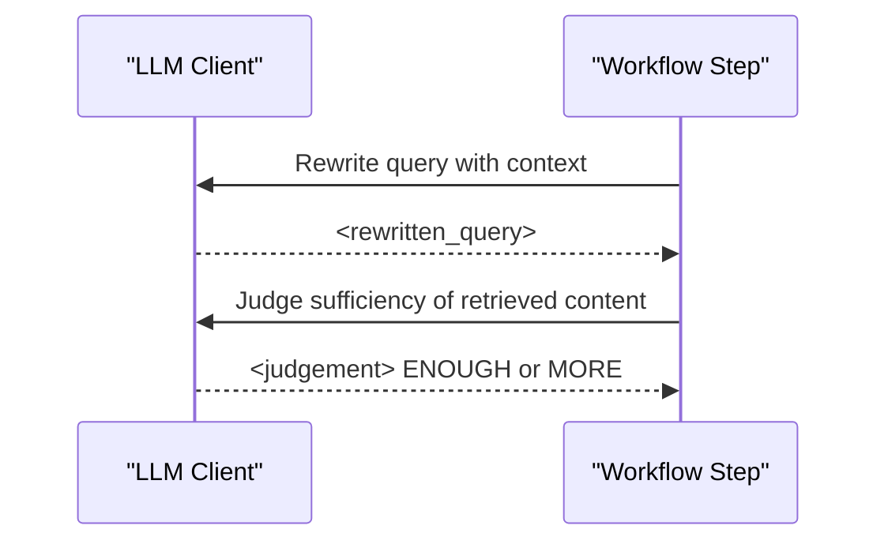
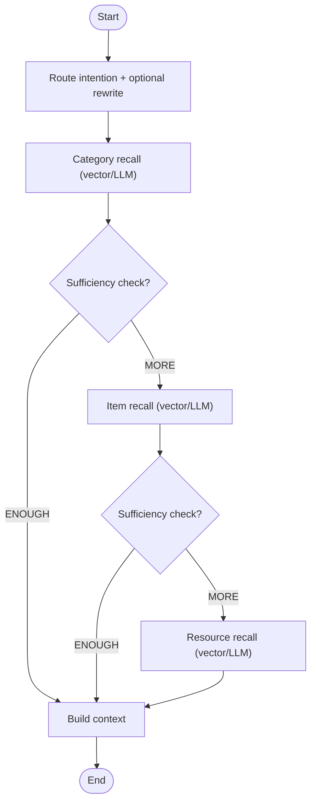
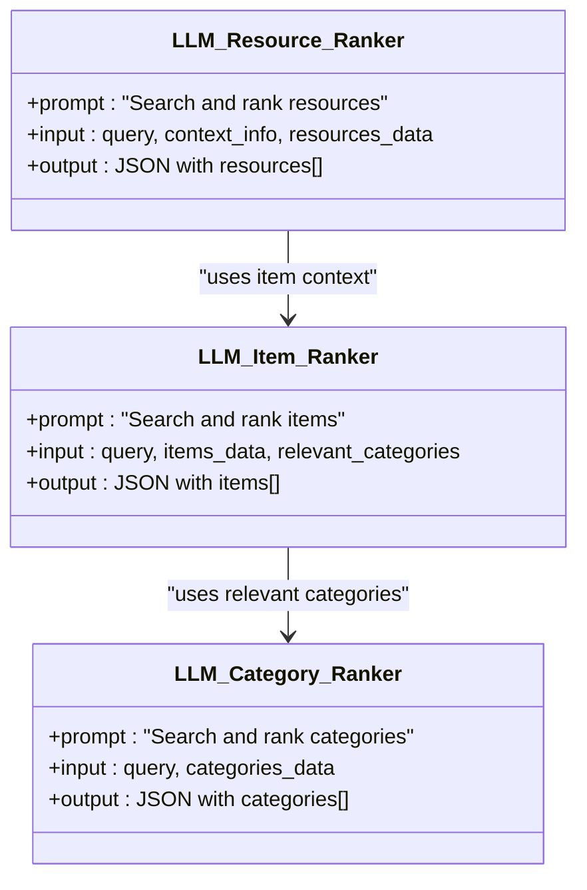
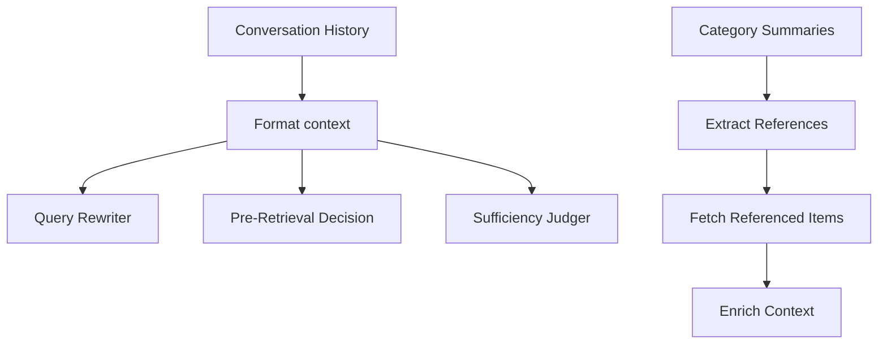
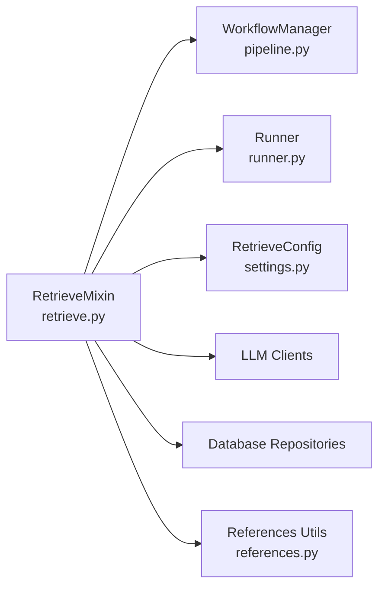

# Query Processing and Rewriting

<cite>
**Referenced Files in This Document**
- [query_rewriter.py](file://src/memu/prompts/retrieve/query_rewriter.py)
- [pre_retrieval_decision.py](file://src/memu/prompts/retrieve/pre_retrieval_decision.py)
- [judger.py](file://src/memu/prompts/retrieve/judger.py)
- [query_rewriter_judger.py](file://src/memu/prompts/retrieve/query_rewriter_judger.py)
- [llm_category_ranker.py](file://src/memu/prompts/retrieve/llm_category_ranker.py)
- [llm_item_ranker.py](file://src/memu/prompts/retrieve/llm_item_ranker.py)
- [llm_resource_ranker.py](file://src/memu/prompts/retrieve/llm_resource_ranker.py)
- [retrieve.py](file://src/memu/app/retrieve.py)
- [settings.py](file://src/memu/app/settings.py)
- [service.py](file://src/memu/app/service.py)
- [pipeline.py](file://src/memu/workflow/pipeline.py)
- [runner.py](file://src/memu/workflow/runner.py)
- [references.py](file://src/memu/utils/references.py)
- [architecture.md](file://docs/architecture.md)
</cite>

## Table of Contents
1. [Introduction](#introduction)
2. [Project Structure](#project-structure)
3. [Core Components](#core-components)
4. [Architecture Overview](#architecture-overview)
5. [Detailed Component Analysis](#detailed-component-analysis)
6. [Dependency Analysis](#dependency-analysis)
7. [Performance Considerations](#performance-considerations)
8. [Troubleshooting Guide](#troubleshooting-guide)
9. [Conclusion](#conclusion)
10. [Appendices](#appendices)

## Introduction
This document explains the query processing and rewriting mechanisms that power query evolution and context-aware transformation in the system. It covers:
- Intent classification and query refinement
- Iterative retrieval sufficiency checks
- Pre-retrieval decision logic that determines whether retrieval is needed
- Rewriting strategies and configuration options
- The judger component that evaluates sufficiency and decides continuation criteria
- Practical examples of transformation workflows and context integration

The goal is to help both technical and non-technical readers understand how queries are transformed, validated, and optimized through successive stages of retrieval and judgment.

## Project Structure
The query processing pipeline lives primarily under the retrieval module and integrates with workflow orchestration, configuration, and prompts. The architecture supports both embedding-based (RAG) and LLM-driven ranking modes.

**Diagram sources**
- [service.py](file://src/memu/app/service.py#L49-L100)
- [retrieve.py](file://src/memu/app/retrieve.py#L106-L210)
- [settings.py](file://src/memu/app/settings.py#L175-L202)
- [pipeline.py](file://src/memu/workflow/pipeline.py#L21-L46)
- [runner.py](file://src/memu/workflow/runner.py#L28-L39)
- [pre_retrieval_decision.py](file://src/memu/prompts/retrieve/pre_retrieval_decision.py#L1-L54)
- [judger.py](file://src/memu/prompts/retrieve/judger.py#L1-L40)
- [query_rewriter.py](file://src/memu/prompts/retrieve/query_rewriter.py#L1-L45)
- [query_rewriter_judger.py](file://src/memu/prompts/retrieve/query_rewriter_judger.py#L1-L49)
- [llm_category_ranker.py](file://src/memu/prompts/retrieve/llm_category_ranker.py#L1-L36)
- [llm_item_ranker.py](file://src/memu/prompts/retrieve/llm_item_ranker.py#L1-L41)
- [llm_resource_ranker.py](file://src/memu/prompts/retrieve/llm_resource_ranker.py#L1-L41)
- [references.py](file://src/memu/utils/references.py#L20-L49)

**Section sources**
- [architecture.md](file://docs/architecture.md#L87-L110)
- [service.py](file://src/memu/app/service.py#L315-L348)
- [retrieve.py](file://src/memu/app/retrieve.py#L106-L210)

## Core Components
- Query Rewriter: Transforms ambiguous or referential queries into explicit, self-contained forms using conversation history.
- Pre-Retrieval Decision: Determines whether retrieval is needed and, if so, rewrites the query to incorporate context.
- Sufficiency Judger: Evaluates whether retrieved content is sufficient to answer the query; decides whether to continue retrieval.
- Retrieval Mixins: Orchestrate intent routing, category/item/resource recall, and sufficiency checks across RAG and LLM modes.
- Configuration: Controls enabling/disabling tiers, sufficiency checks, ranking strategies, and LLM profiles.

Key responsibilities:
- Intent classification and query refinement
- Iterative sufficiency checks after each tier
- Context-aware rewriting for improved recall
- Pluggable LLM profiles and ranking strategies

**Section sources**
- [query_rewriter.py](file://src/memu/prompts/retrieve/query_rewriter.py#L1-L45)
- [pre_retrieval_decision.py](file://src/memu/prompts/retrieve/pre_retrieval_decision.py#L1-L54)
- [judger.py](file://src/memu/prompts/retrieve/judger.py#L1-L40)
- [retrieve.py](file://src/memu/app/retrieve.py#L228-L258)
- [settings.py](file://src/memu/app/settings.py#L175-L202)

## Architecture Overview
The retrieval workflow is a staged pipeline executed as a series of workflow steps. It supports:
- Embedding-based (RAG) ranking
- LLM-driven ranking
- Optional intent routing and query rewriting
- Optional sufficiency checks after each tier

**Diagram sources**
- [retrieve.py](file://src/memu/app/retrieve.py#L42-L85)
- [retrieve.py](file://src/memu/app/retrieve.py#L106-L210)
- [retrieve.py](file://src/memu/app/retrieve.py#L454-L536)
- [retrieve.py](file://src/memu/app/retrieve.py#L746-L784)
- [retrieve.py](file://src/memu/app/retrieve.py#L288-L322)
- [retrieve.py](file://src/memu/app/retrieve.py#L369-L398)
- [retrieve.py](file://src/memu/app/retrieve.py#L400-L424)
- [retrieve.py](file://src/memu/app/retrieve.py#L426-L452)

## Detailed Component Analysis

### Query Rewriting Pipeline
The rewriting pipeline transforms queries to be self-contained and explicit by:
- Identifying pronouns, referential expressions, implicit context, and incomplete information
- Resolving references using conversation history
- Preserving intent while adding necessary background
- Returning unchanged if already clear

**Diagram sources**
- [query_rewriter.py](file://src/memu/prompts/retrieve/query_rewriter.py#L1-L45)

**Section sources**
- [query_rewriter.py](file://src/memu/prompts/retrieve/query_rewriter.py#L1-L45)

### Pre-Retrieval Decision System
The pre-retrieval decision determines whether retrieval is required and, if so, rewrites the query to incorporate context. It classifies queries into:
- NO_RETRIEVE: greetings, casual chat, acknowledgments, general knowledge, clarification requests, meta-questions
- RETRIEVE: past events, preferences, habits, recall requests, historical references

It returns either the original query (unchanged) or a rewritten query incorporating context.

**Diagram sources**
- [pre_retrieval_decision.py](file://src/memu/prompts/retrieve/pre_retrieval_decision.py#L1-L54)

**Section sources**
- [pre_retrieval_decision.py](file://src/memu/prompts/retrieve/pre_retrieval_decision.py#L1-L54)
- [retrieve.py](file://src/memu/app/retrieve.py#L746-L784)

### Sufficiency Judger
The judger evaluates whether retrieved content is sufficient to answer the query. It checks:
- Directness of answer
- Specificity and detail
- Presence of obvious gaps
- Explicit recall requests

It outputs a single-word judgment: ENOUGH or MORE.

**Diagram sources**
- [judger.py](file://src/memu/prompts/retrieve/judger.py#L1-L40)

**Section sources**
- [judger.py](file://src/memu/prompts/retrieve/judger.py#L1-L40)
- [retrieve.py](file://src/memu/app/retrieve.py#L1006-L1019)

### Combined Query Rewriter + Judger
This component performs both tasks in one step:
- Incorporate conversation context to rewrite the query
- Judge sufficiency of retrieved content for the rewritten query

It enforces conservativism: marks ENOUGH only if all criteria are met.

**Diagram sources**
- [query_rewriter_judger.py](file://src/memu/prompts/retrieve/query_rewriter_judger.py#L1-L49)

**Section sources**
- [query_rewriter_judger.py](file://src/memu/prompts/retrieve/query_rewriter_judger.py#L1-L49)

### Intent Routing and Iterative Improvement
The retrieval mixin routes queries through stages:
- Route intention: optional, with query rewriting
- Category recall: embedding-based or LLM-based ranking
- Sufficiency check: optional, with rewriting and re-embedding
- Item recall: embedding-based or LLM-based ranking
- Sufficiency check: optional, with rewriting and re-embedding
- Resource recall: embedding-based or LLM-based ranking
- Build context: assemble final response

**Diagram sources**
- [retrieve.py](file://src/memu/app/retrieve.py#L106-L210)
- [retrieve.py](file://src/memu/app/retrieve.py#L454-L536)

**Section sources**
- [retrieve.py](file://src/memu/app/retrieve.py#L228-L258)
- [retrieve.py](file://src/memu/app/retrieve.py#L288-L322)
- [retrieve.py](file://src/memu/app/retrieve.py#L369-L398)
- [retrieve.py](file://src/memu/app/retrieve.py#L400-L424)
- [retrieve.py](file://src/memu/app/retrieve.py#L426-L452)

### LLM-Based Ranking Prompts
The LLM-based stages rely on specialized prompts:
- Category ranking: identifies and ranks relevant categories
- Item ranking: ranks items within relevant categories
- Resource ranking: ranks resources given context

**Diagram sources**
- [llm_category_ranker.py](file://src/memu/prompts/retrieve/llm_category_ranker.py#L1-L36)
- [llm_item_ranker.py](file://src/memu/prompts/retrieve/llm_item_ranker.py#L1-L41)
- [llm_resource_ranker.py](file://src/memu/prompts/retrieve/llm_resource_ranker.py#L1-L41)

**Section sources**
- [llm_category_ranker.py](file://src/memu/prompts/retrieve/llm_category_ranker.py#L1-L36)
- [llm_item_ranker.py](file://src/memu/prompts/retrieve/llm_item_ranker.py#L1-L41)
- [llm_resource_ranker.py](file://src/memu/prompts/retrieve/llm_resource_ranker.py#L1-L41)

### Context Integration Strategies
- Conversation history is formatted and injected into prompts for rewriting and decision-making.
- Category summaries and item references are used to enrich context.
- Reference extraction enables cross-stage navigation (e.g., following category references to items).

**Diagram sources**
- [retrieve.py](file://src/memu/app/retrieve.py#L786-L809)
- [references.py](file://src/memu/utils/references.py#L20-L49)

**Section sources**
- [retrieve.py](file://src/memu/app/retrieve.py#L786-L809)
- [references.py](file://src/memu/utils/references.py#L20-L49)

## Dependency Analysis
The retrieval pipeline depends on:
- Workflow orchestration (steps, capabilities, profiles)
- LLM clients (chat/embed) with profile-based routing
- Database repositories (categories, items, resources)
- Utility modules (references, escaping, materialization)

**Diagram sources**
- [retrieve.py](file://src/memu/app/retrieve.py#L106-L210)
- [pipeline.py](file://src/memu/workflow/pipeline.py#L21-L46)
- [runner.py](file://src/memu/workflow/runner.py#L28-L39)
- [settings.py](file://src/memu/app/settings.py#L175-L202)
- [references.py](file://src/memu/utils/references.py#L20-L49)

**Section sources**
- [pipeline.py](file://src/memu/workflow/pipeline.py#L131-L164)
- [runner.py](file://src/memu/workflow/runner.py#L61-L81)
- [retrieve.py](file://src/memu/app/retrieve.py#L106-L210)

## Performance Considerations
- Enable sufficiency checks selectively to reduce unnecessary embeddings and LLM calls.
- Prefer embedding-based ranking for scalability when vector backends are available.
- Tune top_k per tier to balance recall and latency.
- Use salience-aware ranking for items when recency and reinforcement signals are valuable.
- Leverage reference-aware retrieval to minimize redundant embeddings.
- Cache LLM clients per profile to avoid repeated initialization overhead.

[No sources needed since this section provides general guidance]

## Troubleshooting Guide
Common issues and resolutions:
- Empty or invalid query messages: ensure proper structure and non-empty text content.
- Unknown filter fields: validate where filters against the user model fields.
- Missing state keys in workflow steps: ensure previous steps produce required keys or provide initial_state_keys.
- Unknown LLM profiles: register profiles in llm_profiles and reference them in step configs.
- Extraction failures: verify JSON parsing helpers and prompt formatting escape sequences.

**Section sources**
- [retrieve.py](file://src/memu/app/retrieve.py#L87-L104)
- [retrieve.py](file://src/memu/app/retrieve.py#L812-L839)
- [pipeline.py](file://src/memu/workflow/pipeline.py#L131-L164)
- [settings.py](file://src/memu/app/settings.py#L263-L296)

## Conclusion
The query processing and rewriting system combines intent classification, context-aware rewriting, and iterative sufficiency checks to evolve queries toward optimal retrieval outcomes. By integrating conversation history, category summaries, and item references, it ensures that retrieval decisions are conservative, context-rich, and efficient. Configuration options allow tailoring behavior to specific use cases, while the workflow engine provides extensibility and observability.

[No sources needed since this section summarizes without analyzing specific files]

## Appendices

### Configuration Options for Rewriting and Decision
- route_intention: Enable/disable intent routing and query rewriting
- sufficiency_check: Enable/disable sufficiency checks after each tier
- sufficiency_check_llm_profile: Profile for sufficiency judgments
- llm_ranking_llm_profile: Profile for LLM-based ranking
- category/top_k, item/top_k, resource/top_k: Control breadth of retrieval per tier
- item/ranking: similarity vs. salience
- item/recency_decay_days: Decay factor for recency in salience
- item/use_category_references: Follow category summary references to items

**Section sources**
- [settings.py](file://src/memu/app/settings.py#L175-L202)
- [settings.py](file://src/memu/app/settings.py#L146-L173)
- [retrieve.py](file://src/memu/app/retrieve.py#L106-L210)