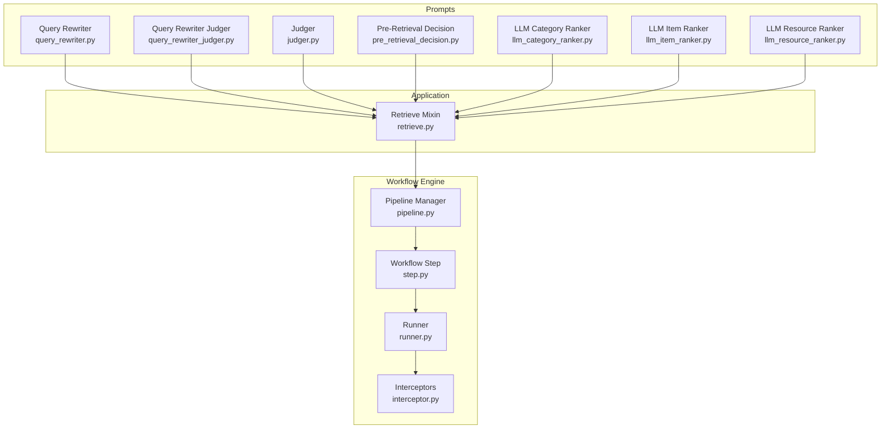
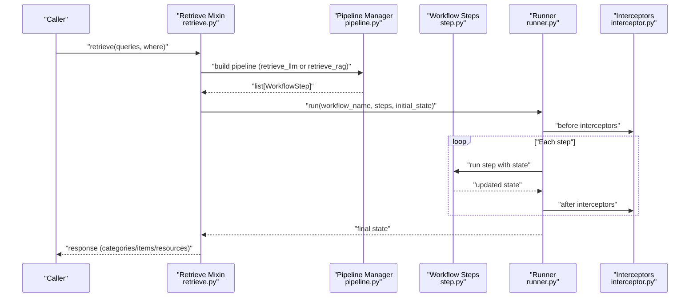
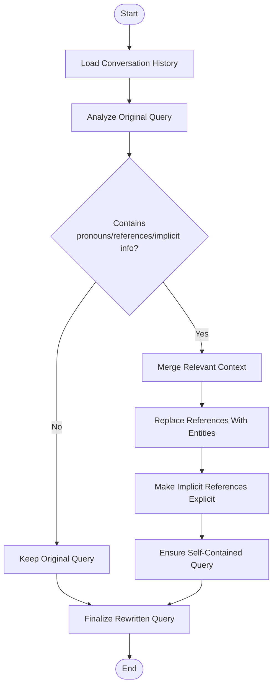
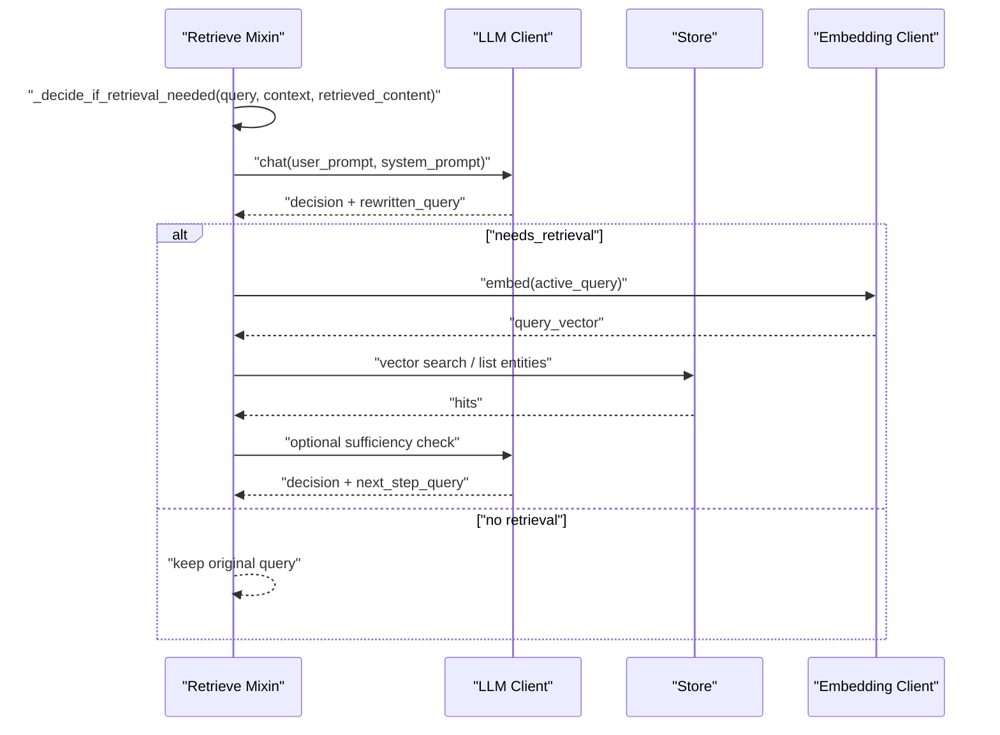
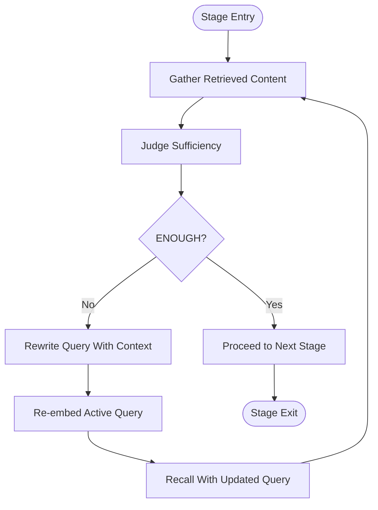
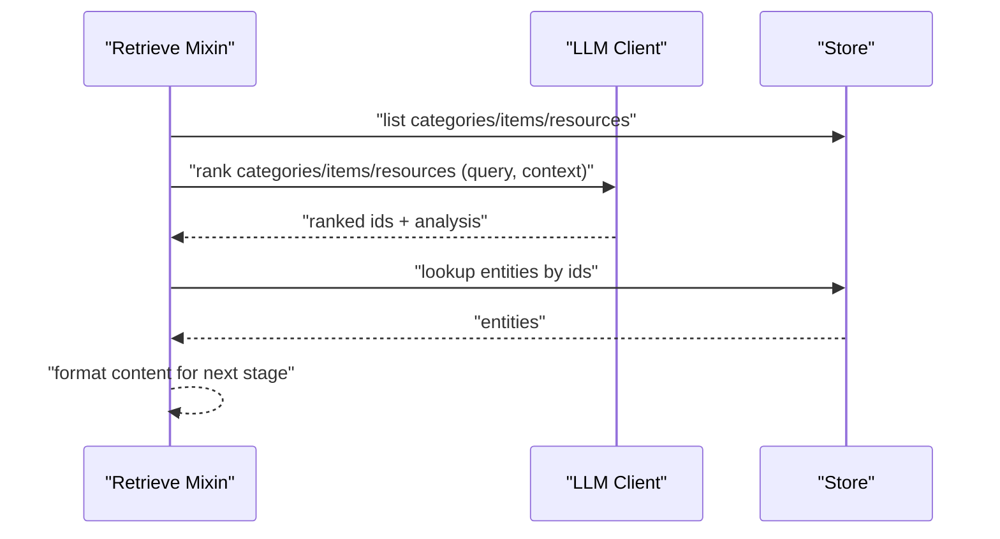
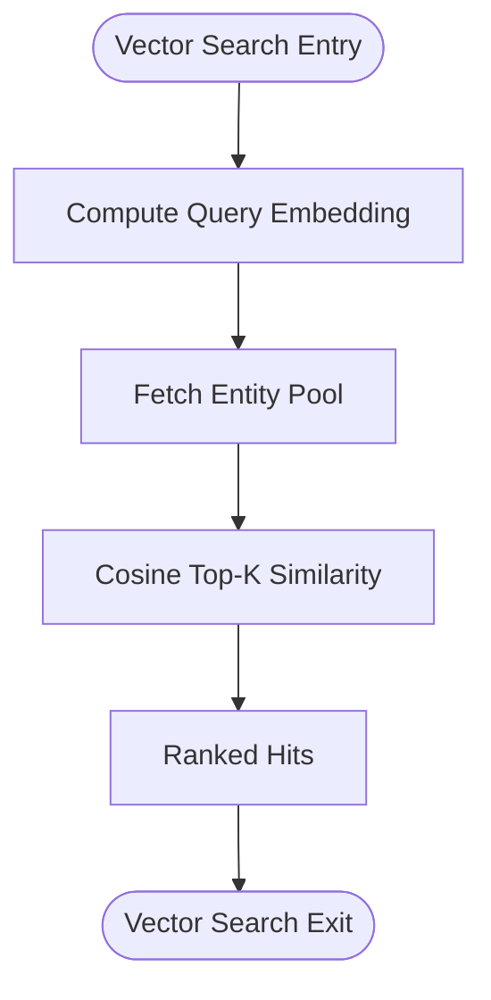
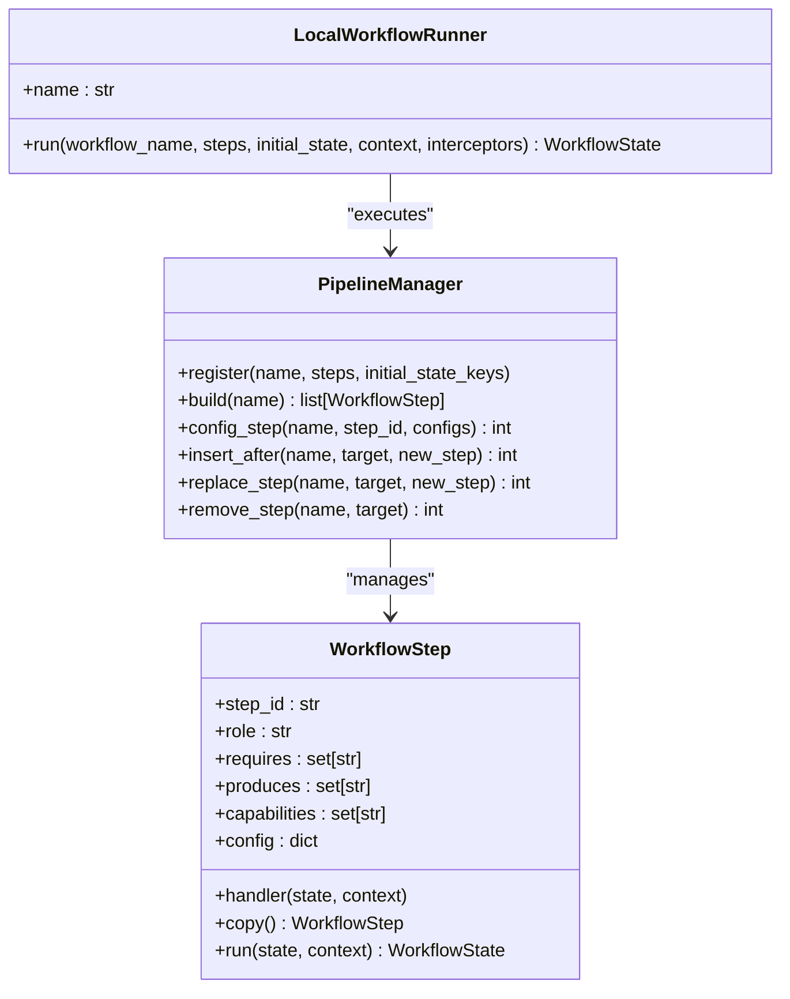
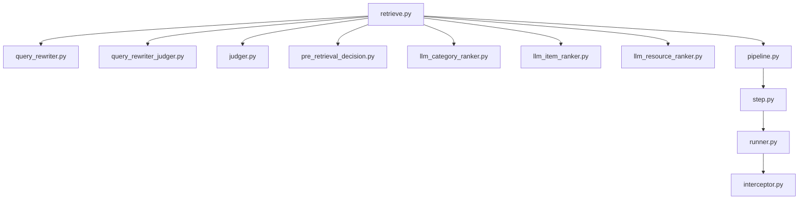

# Query Rewriting and Transformation

<cite>
**Referenced Files in This Document**
- [query_rewriter.py](file://src/memu/prompts/retrieve/query_rewriter.py)
- [query_rewriter_judger.py](file://src/memu/prompts/retrieve/query_rewriter_judger.py)
- [judger.py](file://src/memu/prompts/retrieve/judger.py)
- [pre_retrieval_decision.py](file://src/memu/prompts/retrieve/pre_retrieval_decision.py)
- [llm_category_ranker.py](file://src/memu/prompts/retrieve/llm_category_ranker.py)
- [llm_item_ranker.py](file://src/memu/prompts/retrieve/llm_item_ranker.py)
- [llm_resource_ranker.py](file://src/memu/prompts/retrieve/llm_resource_ranker.py)
- [retrieve.py](file://src/memu/app/retrieve.py)
- [pipeline.py](file://src/memu/workflow/pipeline.py)
- [step.py](file://src/memu/workflow/step.py)
- [runner.py](file://src/memu/workflow/runner.py)
- [interceptor.py](file://src/memu/workflow/interceptor.py)
</cite>

## Table of Contents
1. [Introduction](#introduction)
2. [Project Structure](#project-structure)
3. [Core Components](#core-components)
4. [Architecture Overview](#architecture-overview)
5. [Detailed Component Analysis](#detailed-component-analysis)
6. [Dependency Analysis](#dependency-analysis)
7. [Performance Considerations](#performance-considerations)
8. [Troubleshooting Guide](#troubleshooting-guide)
9. [Conclusion](#conclusion)
10. [Appendices](#appendices)

## Introduction
This document explains the query rewriting and transformation systems that iteratively enhance original queries with conversational context, extract key information, and optimize queries for better retrieval results. It covers the query rewriting pipeline, transformation algorithms (context merging, intent preservation, relevance enhancement), configuration options, and performance optimization strategies. Concrete examples illustrate query evolution workflows and context integration strategies.

## Project Structure
The query rewriting and retrieval pipeline spans prompt definitions, application logic, and workflow orchestration:
- Prompt templates define rewriting and judgment behaviors for query refinement and sufficiency assessment.
- Application-level retrieval orchestrates the pipeline, integrating context, routing decisions, and ranking.
- Workflow engine manages step sequencing, capability gating, and runtime configuration.

**Diagram sources**
- [query_rewriter.py](file://src/memu/prompts/retrieve/query_rewriter.py#L1-L45)
- [query_rewriter_judger.py](file://src/memu/prompts/retrieve/query_rewriter_judger.py#L1-L49)
- [judger.py](file://src/memu/prompts/retrieve/judger.py#L1-L40)
- [pre_retrieval_decision.py](file://src/memu/prompts/retrieve/pre_retrieval_decision.py#L1-L54)
- [llm_category_ranker.py](file://src/memu/prompts/retrieve/llm_category_ranker.py#L1-L36)
- [llm_item_ranker.py](file://src/memu/prompts/retrieve/llm_item_ranker.py#L1-L41)
- [llm_resource_ranker.py](file://src/memu/prompts/retrieve/llm_resource_ranker.py#L1-L41)
- [retrieve.py](file://src/memu/app/retrieve.py#L1-L1419)
- [pipeline.py](file://src/memu/workflow/pipeline.py#L1-L171)
- [step.py](file://src/memu/workflow/step.py#L1-L102)
- [runner.py](file://src/memu/workflow/runner.py#L1-L82)
- [interceptor.py](file://src/memu/workflow/interceptor.py#L1-L219)

**Section sources**
- [retrieve.py](file://src/memu/app/retrieve.py#L1-L1419)
- [pipeline.py](file://src/memu/workflow/pipeline.py#L1-L171)
- [step.py](file://src/memu/workflow/step.py#L1-L102)
- [runner.py](file://src/memu/workflow/runner.py#L1-L82)
- [interceptor.py](file://src/memu/workflow/interceptor.py#L1-L219)

## Core Components
- Query Rewriter Prompt: Guides rewriting to make queries self-contained by resolving pronouns, referential expressions, and implicit context while preserving intent.
- Query Rewriter Judger Prompt: Performs query rewriting and sufficiency judgment to determine if retrieved content answers the query adequately.
- Judger Prompt: Evaluates sufficiency of retrieved content against explicit criteria.
- Pre-Retrieval Decision Prompt: Determines whether retrieval is needed and, if so, rewrites the query with context.
- LLM Rankers: Category, Item, and Resource rankers select and rank relevant entities based on query intent and context.
- Retrieve Mixin: Orchestrates the retrieval workflow, routing, sufficiency checks, and context building.
- Workflow Engine: Provides pipeline registration, step configuration, insertion/removal, and execution with interceptors.

**Section sources**
- [query_rewriter.py](file://src/memu/prompts/retrieve/query_rewriter.py#L1-L45)
- [query_rewriter_judger.py](file://src/memu/prompts/retrieve/query_rewriter_judger.py#L1-L49)
- [judger.py](file://src/memu/prompts/retrieve/judger.py#L1-L40)
- [pre_retrieval_decision.py](file://src/memu/prompts/retrieve/pre_retrieval_decision.py#L1-L54)
- [llm_category_ranker.py](file://src/memu/prompts/retrieve/llm_category_ranker.py#L1-L36)
- [llm_item_ranker.py](file://src/memu/prompts/retrieve/llm_item_ranker.py#L1-L41)
- [llm_resource_ranker.py](file://src/memu/prompts/retrieve/llm_resource_ranker.py#L1-L41)
- [retrieve.py](file://src/memu/app/retrieve.py#L1-L1419)
- [pipeline.py](file://src/memu/workflow/pipeline.py#L1-L171)
- [step.py](file://src/memu/workflow/step.py#L1-L102)
- [runner.py](file://src/memu/workflow/runner.py#L1-L82)
- [interceptor.py](file://src/memu/workflow/interceptor.py#L1-L219)

## Architecture Overview
The retrieval system supports two methods:
- RAG-style retrieval with vector embeddings and optional sufficiency checks.
- LLM-driven ranking and sufficiency assessment.

Both methods share a common orchestration pattern:
- Route intention to decide retrieval necessity and rewrite query with context.
- Optionally rank categories/items/resources.
- Perform sufficiency checks after each stage.
- Build a final context response with materials.

**Diagram sources**
- [retrieve.py](file://src/memu/app/retrieve.py#L42-L85)
- [pipeline.py](file://src/memu/workflow/pipeline.py#L47-L49)
- [step.py](file://src/memu/workflow/step.py#L50-L101)
- [runner.py](file://src/memu/workflow/runner.py#L28-L39)
- [interceptor.py](file://src/memu/workflow/interceptor.py#L163-L165)

## Detailed Component Analysis

### Query Rewriting Pipeline
The rewriting pipeline transforms an original query by:
- Resolving ambiguous references using conversation history.
- Preserving the user’s intent.
- Ensuring the rewritten query is self-contained and explicit.

**Diagram sources**
- [query_rewriter.py](file://src/memu/prompts/retrieve/query_rewriter.py#L5-L18)

**Section sources**
- [query_rewriter.py](file://src/memu/prompts/retrieve/query_rewriter.py#L1-L45)

### Pre-Retrieval Decision and Iterative Rewriting
This component decides whether retrieval is needed and, if so, rewrites the query to incorporate context. It performs sufficiency judgments iteratively across stages.

**Diagram sources**
- [retrieve.py](file://src/memu/app/retrieve.py#L746-L784)
- [pre_retrieval_decision.py](file://src/memu/prompts/retrieve/pre_retrieval_decision.py#L1-L54)

**Section sources**
- [retrieve.py](file://src/memu/app/retrieve.py#L228-L258)
- [retrieve.py](file://src/memu/app/retrieve.py#L288-L322)
- [retrieve.py](file://src/memu/app/retrieve.py#L369-L398)
- [retrieve.py](file://src/memu/app/retrieve.py#L400-L424)
- [retrieve.py](file://src/memu/app/retrieve.py#L746-L784)
- [pre_retrieval_decision.py](file://src/memu/prompts/retrieve/pre_retrieval_decision.py#L1-L54)

### Sufficiency Judgment and Re-Ranking
Sufficiency judgment ensures retrieved content is adequate. After each recall stage, the system may request more retrieval and re-embed the rewritten query.

**Diagram sources**
- [query_rewriter_judger.py](file://src/memu/prompts/retrieve/query_rewriter_judger.py#L1-L49)
- [judger.py](file://src/memu/prompts/retrieve/judger.py#L1-L40)
- [retrieve.py](file://src/memu/app/retrieve.py#L288-L322)
- [retrieve.py](file://src/memu/app/retrieve.py#L369-L398)

**Section sources**
- [query_rewriter_judger.py](file://src/memu/prompts/retrieve/query_rewriter_judger.py#L1-L49)
- [judger.py](file://src/memu/prompts/retrieve/judger.py#L1-L40)
- [retrieve.py](file://src/memu/app/retrieve.py#L288-L322)
- [retrieve.py](file://src/memu/app/retrieve.py#L369-L398)

### LLM-Based Ranking and Context Integration
Rankers operate on categories, items, and resources, integrating context to select the most relevant candidates.

**Diagram sources**
- [llm_category_ranker.py](file://src/memu/prompts/retrieve/llm_category_ranker.py#L1-L36)
- [llm_item_ranker.py](file://src/memu/prompts/retrieve/llm_item_ranker.py#L1-L41)
- [llm_resource_ranker.py](file://src/memu/prompts/retrieve/llm_resource_ranker.py#L1-L41)
- [retrieve.py](file://src/memu/app/retrieve.py#L570-L588)
- [retrieve.py](file://src/memu/app/retrieve.py#L615-L657)
- [retrieve.py](file://src/memu/app/retrieve.py#L684-L706)

**Section sources**
- [llm_category_ranker.py](file://src/memu/prompts/retrieve/llm_category_ranker.py#L1-L36)
- [llm_item_ranker.py](file://src/memu/prompts/retrieve/llm_item_ranker.py#L1-L41)
- [llm_resource_ranker.py](file://src/memu/prompts/retrieve/llm_resource_ranker.py#L1-L41)
- [retrieve.py](file://src/memu/app/retrieve.py#L570-L588)
- [retrieve.py](file://src/memu/app/retrieve.py#L615-L657)
- [retrieve.py](file://src/memu/app/retrieve.py#L684-L706)

### Vector-Based Retrieval and Context Building
Vector-based retrieval computes query embeddings and ranks against stored vectors, enabling efficient similarity search.

**Diagram sources**
- [retrieve.py](file://src/memu/app/retrieve.py#L260-L286)
- [retrieve.py](file://src/memu/app/retrieve.py#L346-L367)
- [retrieve.py](file://src/memu/app/retrieve.py#L400-L424)
- [retrieve.py](file://src/memu/app/retrieve.py#L725-L744)

**Section sources**
- [retrieve.py](file://src/memu/app/retrieve.py#L260-L286)
- [retrieve.py](file://src/memu/app/retrieve.py#L346-L367)
- [retrieve.py](file://src/memu/app/retrieve.py#L400-L424)
- [retrieve.py](file://src/memu/app/retrieve.py#L725-L744)

### Workflow Orchestration and Configuration
The workflow engine manages pipeline composition, step configuration, and runtime execution with interceptors.

**Diagram sources**
- [pipeline.py](file://src/memu/workflow/pipeline.py#L21-L171)
- [step.py](file://src/memu/workflow/step.py#L16-L48)
- [runner.py](file://src/memu/workflow/runner.py#L28-L39)

**Section sources**
- [pipeline.py](file://src/memu/workflow/pipeline.py#L1-L171)
- [step.py](file://src/memu/workflow/step.py#L1-L102)
- [runner.py](file://src/memu/workflow/runner.py#L1-L82)
- [interceptor.py](file://src/memu/workflow/interceptor.py#L1-L219)

## Dependency Analysis
Key dependencies and relationships:
- Retrieve Mixin depends on prompt templates for rewriting and judgment.
- Retrieval stages depend on embedding clients for vector search and LLM clients for ranking and sufficiency.
- Workflow engine validates step dependencies and capability availability.

**Diagram sources**
- [retrieve.py](file://src/memu/app/retrieve.py#L1-L1419)
- [query_rewriter.py](file://src/memu/prompts/retrieve/query_rewriter.py#L1-L45)
- [query_rewriter_judger.py](file://src/memu/prompts/retrieve/query_rewriter_judger.py#L1-L49)
- [judger.py](file://src/memu/prompts/retrieve/judger.py#L1-L40)
- [pre_retrieval_decision.py](file://src/memu/prompts/retrieve/pre_retrieval_decision.py#L1-L54)
- [llm_category_ranker.py](file://src/memu/prompts/retrieve/llm_category_ranker.py#L1-L36)
- [llm_item_ranker.py](file://src/memu/prompts/retrieve/llm_item_ranker.py#L1-L41)
- [llm_resource_ranker.py](file://src/memu/prompts/retrieve/llm_resource_ranker.py#L1-L41)
- [pipeline.py](file://src/memu/workflow/pipeline.py#L1-L171)
- [step.py](file://src/memu/workflow/step.py#L1-L102)
- [runner.py](file://src/memu/workflow/runner.py#L1-L82)
- [interceptor.py](file://src/memu/workflow/interceptor.py#L1-L219)

**Section sources**
- [retrieve.py](file://src/memu/app/retrieve.py#L1-L1419)
- [pipeline.py](file://src/memu/workflow/pipeline.py#L131-L164)

## Performance Considerations
- Minimize unnecessary embeddings: reuse query vectors when moving between stages if the query remains unchanged.
- Limit top-k sizes per stage to reduce downstream processing overhead.
- Use sufficiency checks to avoid redundant retrieval rounds.
- Cache formatted content for categories/items/resources to prevent repeated formatting.
- Configure LLM profiles appropriately to balance cost and latency.
- Monitor slow queries and ensure proper indexing for vector and relational lookups.

[No sources needed since this section provides general guidance]

## Troubleshooting Guide
Common issues and remedies:
- Missing required state keys in workflow steps: ensure previous steps produce required keys or initialize with initial_state_keys.
- Unknown LLM profiles or capabilities: verify profile names and available capabilities match pipeline configuration.
- Insufficient retrieved content: enable sufficiency checks and iterate with rewritten queries; adjust top-k and ranking settings.
- Unexpected query rewriting behavior: validate prompt overrides and ensure conversation history formatting is correct.

**Section sources**
- [pipeline.py](file://src/memu/workflow/pipeline.py#L131-L164)
- [retrieve.py](file://src/memu/app/retrieve.py#L746-L784)

## Conclusion
The query rewriting and transformation system integrates conversational context, preserves user intent, and iteratively improves retrieval quality through sufficiency checks and re-ranking. The modular prompt templates, robust workflow engine, and configurable retrieval strategies enable scalable and maintainable query enhancement pipelines.

[No sources needed since this section summarizes without analyzing specific files]

## Appendices

### Configuration Options for Rewriting Strategies
- route_intention: Enable/disable intent routing and query rewriting.
- method: Choose between "llm" (LLM-driven ranking) and "rag" (vector-based).
- sufficiency_check: Toggle sufficiency checks after each stage.
- sufficiency_check_llm_profile/embed_llm_profile: Configure LLM profiles for judgment and embeddings.
- category/item/resource top_k: Control number of returned results per stage.
- item.use_category_references: Enable reference-based item recall using category summaries.

**Section sources**
- [retrieve.py](file://src/memu/app/retrieve.py#L57-L61)
- [retrieve.py](file://src/memu/app/retrieve.py#L106-L210)
- [retrieve.py](file://src/memu/app/retrieve.py#L454-L536)
- [retrieve.py](file://src/memu/app/retrieve.py#L626-L635)