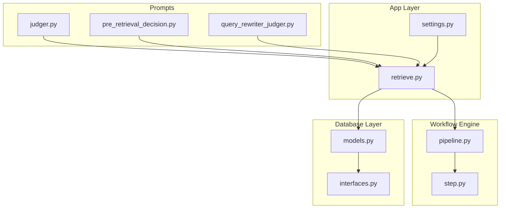
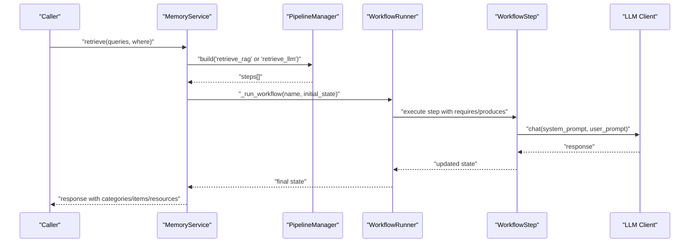
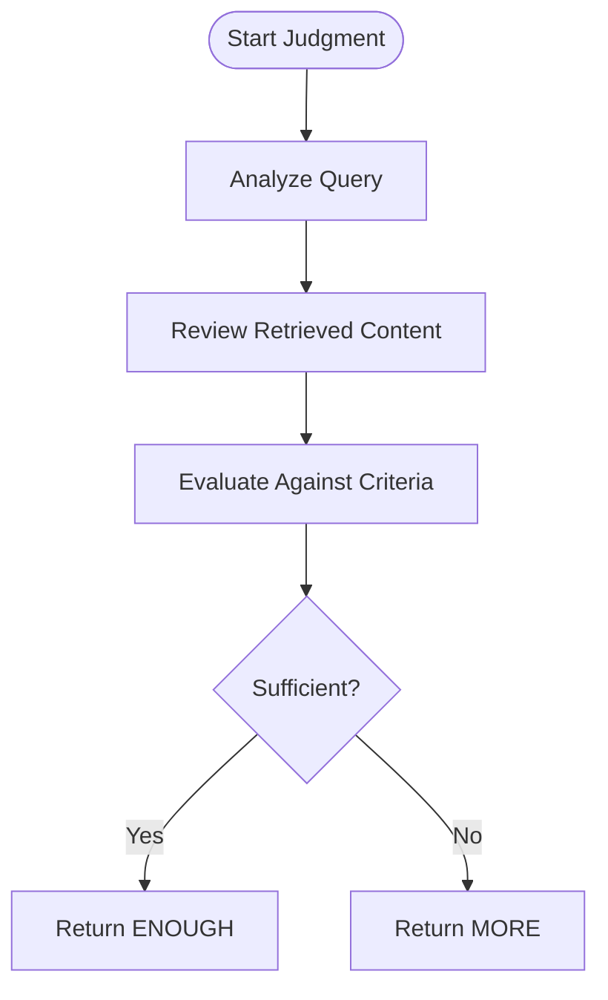
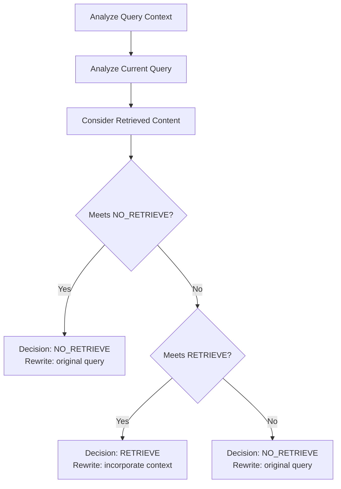
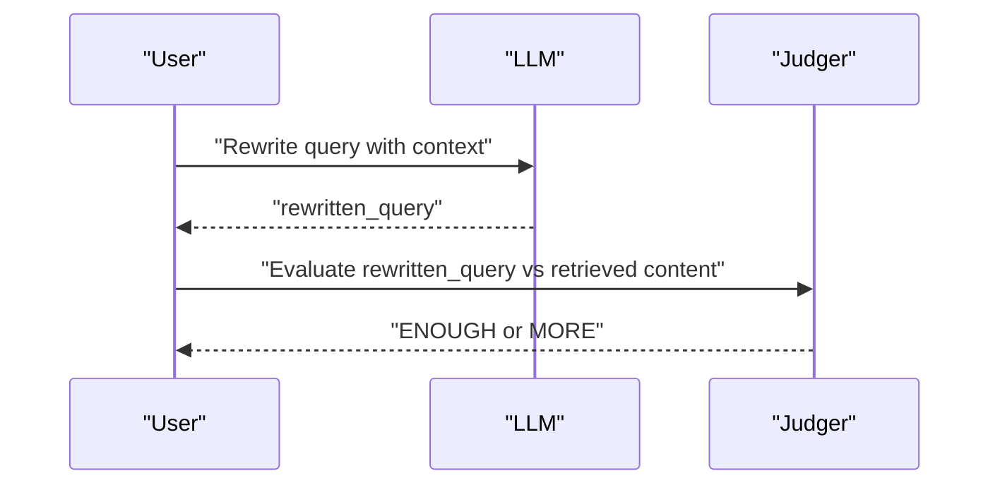
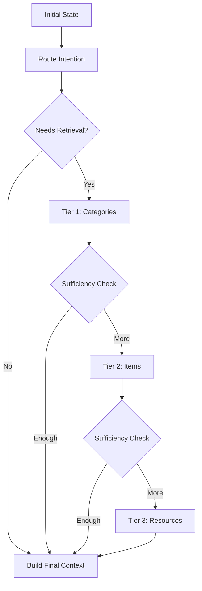
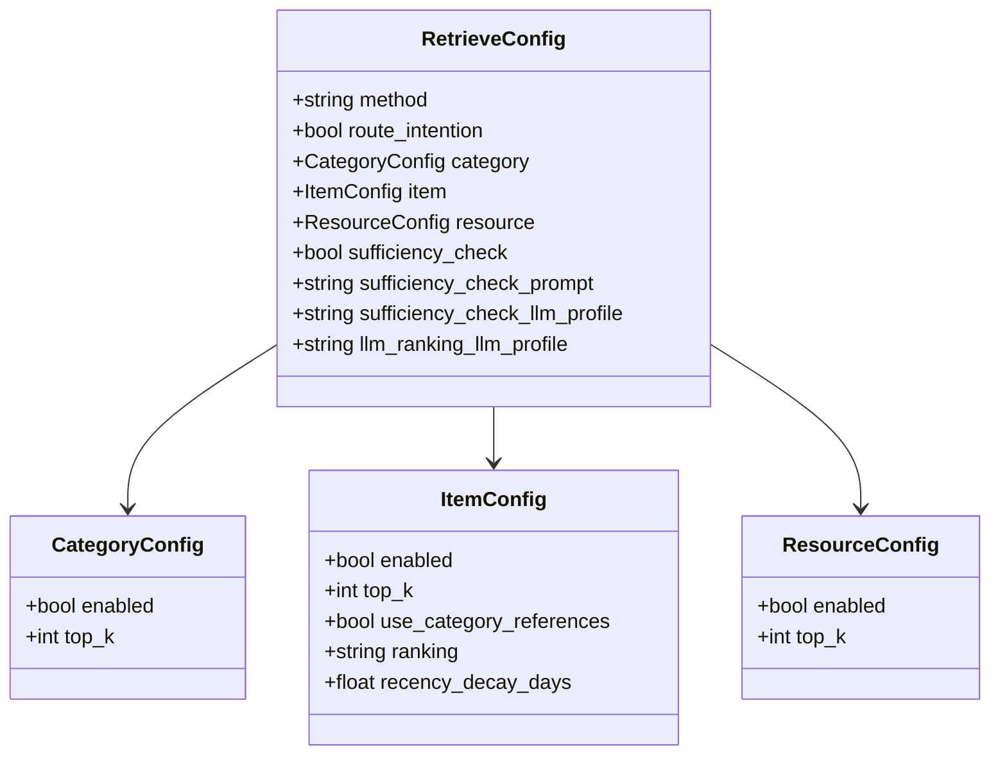
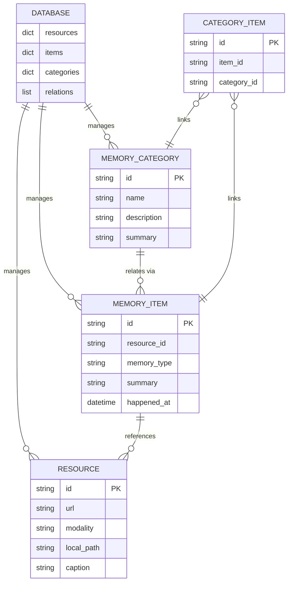
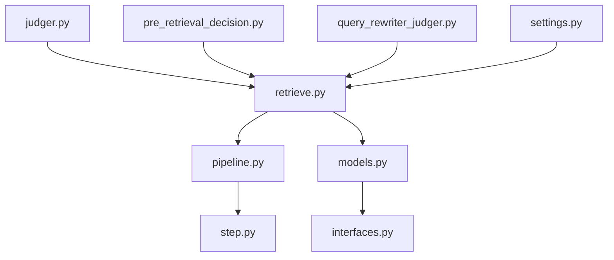

# Sufficiency Judgment and Continuation Logic

<cite>
**Referenced Files in This Document**
- [judger.py](file://src/memu/prompts/retrieve/judger.py)
- [pre_retrieval_decision.py](file://src/memu/prompts/retrieve/pre_retrieval_decision.py)
- [query_rewriter_judger.py](file://src/memu/prompts/retrieve/query_rewriter_judger.py)
- [retrieve.py](file://src/memu/app/retrieve.py)
- [settings.py](file://src/memu/app/settings.py)
- [models.py](file://src/memu/database/models.py)
- [interfaces.py](file://src/memu/database/interfaces.py)
- [pipeline.py](file://src/memu/workflow/pipeline.py)
- [step.py](file://src/memu/workflow/step.py)
</cite>

## Table of Contents
1. [Introduction](#introduction)
2. [Project Structure](#project-structure)
3. [Core Components](#core-components)
4. [Architecture Overview](#architecture-overview)
5. [Detailed Component Analysis](#detailed-component-analysis)
6. [Dependency Analysis](#dependency-analysis)
7. [Performance Considerations](#performance-considerations)
8. [Troubleshooting Guide](#troubleshooting-guide)
9. [Conclusion](#conclusion)

## Introduction
This document explains the sufficiency judgment and continuation logic used to evaluate retrieval adequacy and decide whether to continue with additional retrieval phases. It focuses on the judger component that assesses whether retrieved content is sufficient for the current query and determines continuation criteria. The document also covers sufficiency evaluation criteria, configuration options, and performance optimization strategies for the sufficiency checking pipeline.

## Project Structure
The sufficiency judgment and continuation logic spans several modules:
- Prompts define the instruction templates for decision-making and judgment.
- The retrieval service orchestrates a workflow with sufficiency checks after each tier.
- Settings define configuration options for enabling sufficiency checks and selecting LLM profiles.
- The workflow engine executes steps with capability-based routing and state passing.

**Diagram sources**
- [judger.py](file://src/memu/prompts/retrieve/judger.py#L1-L39)
- [pre_retrieval_decision.py](file://src/memu/prompts/retrieve/pre_retrieval_decision.py#L1-L54)
- [query_rewriter_judger.py](file://src/memu/prompts/retrieve/query_rewriter_judger.py#L1-L49)
- [retrieve.py](file://src/memu/app/retrieve.py#L1-L120)
- [settings.py](file://src/memu/app/settings.py#L175-L202)
- [pipeline.py](file://src/memu/workflow/pipeline.py#L21-L46)
- [step.py](file://src/memu/workflow/step.py#L16-L39)
- [models.py](file://src/memu/database/models.py#L68-L101)
- [interfaces.py](file://src/memu/database/interfaces.py#L12-L26)

**Section sources**
- [retrieve.py](file://src/memu/app/retrieve.py#L1-L120)
- [settings.py](file://src/memu/app/settings.py#L175-L202)
- [pipeline.py](file://src/memu/workflow/pipeline.py#L21-L46)
- [step.py](file://src/memu/workflow/step.py#L16-L39)
- [models.py](file://src/memu/database/models.py#L68-L101)
- [interfaces.py](file://src/memu/database/interfaces.py#L12-L26)

## Core Components
- Judger prompt defines the sufficiency evaluation criteria and output format for a one-word judgment.
- Pre-retrieval decision prompt determines whether retrieval is needed and optionally rewrites the query.
- Query-rewriter + judger prompt combines query rewriting and sufficiency judgment in a single step.
- Retrieve service implements a workflow with sufficiency checks after each tier (categories, items, resources).
- Settings expose configuration toggles for enabling sufficiency checks and selecting LLM profiles.
- Workflow engine executes steps with capability-based routing and state propagation.

Key sufficiency evaluation criteria:
- Directly addresses the user’s question
- Information is specific and detailed enough
- No obvious gaps or missing details
- Explicit request to recall or remember more information

Continuation decision strategy:
- If the judgment is sufficient, stop and proceed to context building.
- If more is needed, rewrite the query with conversation context and continue to the next tier.

**Section sources**
- [judger.py](file://src/memu/prompts/retrieve/judger.py#L1-L39)
- [pre_retrieval_decision.py](file://src/memu/prompts/retrieve/pre_retrieval_decision.py#L1-L54)
- [query_rewriter_judger.py](file://src/memu/prompts/retrieve/query_rewriter_judger.py#L1-L49)
- [retrieve.py](file://src/memu/app/retrieve.py#L288-L398)
- [settings.py](file://src/memu/app/settings.py#L175-L202)

## Architecture Overview
The retrieval pipeline supports two strategies: RAG (embedding-based) and LLM (language model-based ranking). After each tier, a sufficiency check decides whether to continue with the next tier or finalize the context.

**Diagram sources**
- [retrieve.py](file://src/memu/app/retrieve.py#L42-L85)
- [pipeline.py](file://src/memu/workflow/pipeline.py#L47-L49)
- [step.py](file://src/memu/workflow/step.py#L40-L47)

## Detailed Component Analysis

### Judger Prompt and Evaluation Criteria
The judger prompt defines a strict sufficiency evaluation:
- Analyze the query and retrieved content
- Evaluate against four criteria: directness, specificity, completeness, explicit recall requests
- Produce a one-word judgment: sufficient or more is needed

**Diagram sources**
- [judger.py](file://src/memu/prompts/retrieve/judger.py#L5-L13)

**Section sources**
- [judger.py](file://src/memu/prompts/retrieve/judger.py#L1-L39)

### Pre-Retrieval Decision Prompt
This prompt decides whether retrieval is required and optionally rewrites the query:
- NO_RETRIEVE for greetings, casual chat, general knowledge, clarifications, or system meta-questions
- RETRIEVE for past events, preferences, habits, explicit recall requests, or historical references
- Output includes a decision and rewritten query

**Diagram sources**
- [pre_retrieval_decision.py](file://src/memu/prompts/retrieve/pre_retrieval_decision.py#L14-L27)

**Section sources**
- [pre_retrieval_decision.py](file://src/memu/prompts/retrieve/pre_retrieval_decision.py#L1-L54)

### Query-Rewriter + Judger Prompt
Combines query rewriting and sufficiency judgment:
- Incorporate conversation context to rewrite the query
- Judge sufficiency based on directness, specificity, completeness, and explicit recall requests
- Output rewritten query and judgment

**Diagram sources**
- [query_rewriter_judger.py](file://src/memu/prompts/retrieve/query_rewriter_judger.py#L9-L24)

**Section sources**
- [query_rewriter_judger.py](file://src/memu/prompts/retrieve/query_rewriter_judger.py#L1-L49)

### Retrieve Service: Sufficiency Checks and Continuation Logic
The retrieve service implements a two-strategy pipeline with sufficiency checks after each tier:
- Route intention: optional pre-check to decide retrieval necessity and rewrite query
- Tier 1 (categories): vector or LLM ranking, sufficiency check
- Tier 2 (items): vector or LLM ranking, sufficiency check
- Tier 3 (resources): vector or LLM ranking, final context building

**Diagram sources**
- [retrieve.py](file://src/memu/app/retrieve.py#L106-L210)
- [retrieve.py](file://src/memu/app/retrieve.py#L454-L536)

**Section sources**
- [retrieve.py](file://src/memu/app/retrieve.py#L106-L210)
- [retrieve.py](file://src/memu/app/retrieve.py#L288-L398)
- [retrieve.py](file://src/memu/app/retrieve.py#L454-L536)
- [retrieve.py](file://src/memu/app/retrieve.py#L590-L682)

### Configuration Options for Judgment Thresholds and Metrics
Configuration controls sufficiency judgment behavior:
- Enable/disable sufficiency checks after each tier
- Select LLM profile for sufficiency checks and LLM ranking
- Override user prompt for sufficiency checks

**Diagram sources**
- [settings.py](file://src/memu/app/settings.py#L175-L202)
- [settings.py](file://src/memu/app/settings.py#L146-L173)

**Section sources**
- [settings.py](file://src/memu/app/settings.py#L175-L202)
- [settings.py](file://src/memu/app/settings.py#L146-L173)

### Data Models and Interfaces Supporting Retrieval
The retrieval pipeline interacts with typed models and repositories:
- Resource, MemoryItem, MemoryCategory, CategoryItem records
- Database interface exposing repositories and in-memory caches

**Diagram sources**
- [models.py](file://src/memu/database/models.py#L68-L101)
- [interfaces.py](file://src/memu/database/interfaces.py#L12-L26)

**Section sources**
- [models.py](file://src/memu/database/models.py#L68-L101)
- [interfaces.py](file://src/memu/database/interfaces.py#L12-L26)

## Dependency Analysis
The sufficiency judgment pipeline depends on:
- Prompt templates for decision-making and judgment
- Retrieve configuration for enabling checks and selecting LLM profiles
- Workflow engine for step execution and state propagation
- Database models and repositories for materializing hits

**Diagram sources**
- [retrieve.py](file://src/memu/app/retrieve.py#L1-L18)
- [settings.py](file://src/memu/app/settings.py#L175-L202)
- [pipeline.py](file://src/memu/workflow/pipeline.py#L21-L46)
- [step.py](file://src/memu/workflow/step.py#L16-L39)
- [models.py](file://src/memu/database/models.py#L68-L101)
- [interfaces.py](file://src/memu/database/interfaces.py#L12-L26)

**Section sources**
- [retrieve.py](file://src/memu/app/retrieve.py#L1-L18)
- [settings.py](file://src/memu/app/settings.py#L175-L202)
- [pipeline.py](file://src/memu/workflow/pipeline.py#L21-L46)
- [step.py](file://src/memu/workflow/step.py#L16-L39)
- [models.py](file://src/memu/database/models.py#L68-L101)
- [interfaces.py](file://src/memu/database/interfaces.py#L12-L26)

## Performance Considerations
- Minimize unnecessary LLM calls by disabling sufficiency checks when not needed.
- Use appropriate top_k values to balance recall and latency.
- Prefer embedding-based ranking (RAG) for large corpora; reserve LLM ranking for nuanced relevance.
- Cache embeddings and query vectors when feasible to reduce repeated computations.
- Select lightweight LLM profiles for sufficiency checks to reduce cost and latency.

## Troubleshooting Guide
Common issues and resolutions:
- Empty or insufficient retrieved content: ensure sufficiency checks are enabled and prompts are properly formatted.
- Incorrect continuation decisions: verify the judgment extraction logic and prompt alignment.
- Missing state keys during step execution: confirm that required keys are produced by preceding steps.
- Unknown LLM profile errors: ensure the profile exists in the LLM profiles configuration.

Operational checks:
- Validate configuration fields for sufficiency_check, sufficiency_check_llm_profile, and llm_ranking_llm_profile.
- Confirm that the workflow pipeline registers the correct steps and capabilities.
- Inspect step context and state transitions for debugging.

**Section sources**
- [retrieve.py](file://src/memu/app/retrieve.py#L746-L784)
- [pipeline.py](file://src/memu/workflow/pipeline.py#L131-L164)
- [settings.py](file://src/memu/app/settings.py#L263-L297)

## Conclusion
The sufficiency judgment and continuation logic provides a robust mechanism to iteratively refine retrieval results. By combining structured prompts, configurable LLM profiles, and a capability-driven workflow engine, the system ensures that retrieval proceeds only as far as necessary to satisfy the query while maintaining performance and cost efficiency.