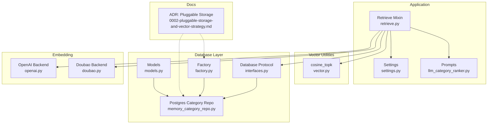
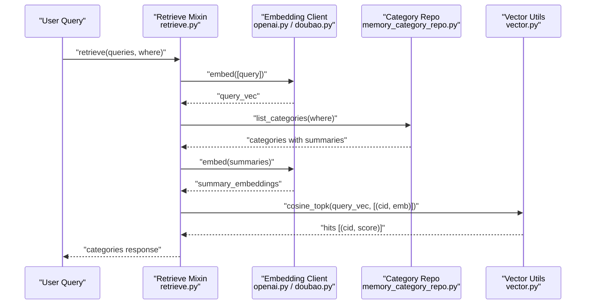
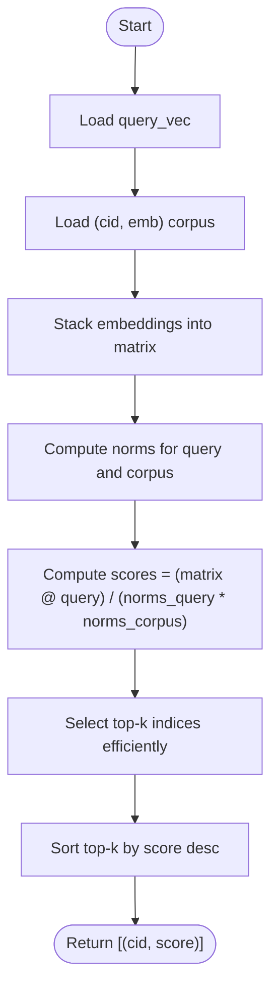
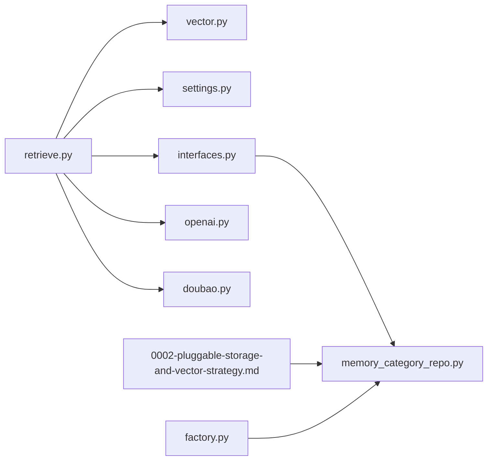

# Category Recall

<cite>
**Referenced Files in This Document**
- [retrieve.py](file://src/memu/app/retrieve.py)
- [vector.py](file://src/memu/database/inmemory/vector.py)
- [memory_category_repo.py](file://src/memu/database/postgres/repositories/memory_category_repo.py)
- [models.py](file://src/memu/database/models.py)
- [settings.py](file://src/memu/app/settings.py)
- [interfaces.py](file://src/memu/database/interfaces.py)
- [factory.py](file://src/memu/database/factory.py)
- [0002-pluggable-storage-and-vector-strategy.md](file://docs/adr/0002-pluggable-storage-and-vector-strategy.md)
- [llm_category_ranker.py](file://src/memu/prompts/retrieve/llm_category_ranker.py)
- [openai.py](file://src/memu/embedding/backends/openai.py)
- [doubao.py](file://src/memu/embedding/backends/doubao.py)
</cite>

## Table of Contents
1. [Introduction](#introduction)
2. [Project Structure](#project-structure)
3. [Core Components](#core-components)
4. [Architecture Overview](#architecture-overview)
5. [Detailed Component Analysis](#detailed-component-analysis)
6. [Dependency Analysis](#dependency-analysis)
7. [Performance Considerations](#performance-considerations)
8. [Troubleshooting Guide](#troubleshooting-guide)
9. [Conclusion](#conclusion)

## Introduction
This document explains the Category Recall phase of the retrieval pipeline, focusing on topic-level memory retrieval using vector similarity search. It covers how category summarization embeddings are generated, how cosine similarity is computed, how top-k categories are ranked, and how the system integrates with different embedding models and vector search implementations. It also documents category pool filtering, configuration options, and performance optimization techniques for large category collections.

## Project Structure
The Category Recall pipeline spans several modules:
- Application-level orchestration and retrieval workflow
- Vector similarity utilities for brute-force search
- Database repositories for categories and items
- Configuration models for retrieval behavior
- Embedding backends for generating query/category embeddings
- Documentation and ADRs that define pluggable storage and vector strategies

**Diagram sources**
- [retrieve.py](file://src/memu/app/retrieve.py#L106-L210)
- [vector.py](file://src/memu/database/inmemory/vector.py#L56-L91)
- [memory_category_repo.py](file://src/memu/database/postgres/repositories/memory_category_repo.py#L13-L38)
- [settings.py](file://src/memu/app/settings.py#L146-L202)
- [interfaces.py](file://src/memu/database/interfaces.py#L12-L26)
- [factory.py](file://src/memu/database/factory.py#L15-L43)
- [llm_category_ranker.py](file://src/memu/prompts/retrieve/llm_category_ranker.py#L1-L35)
- [openai.py](file://src/memu/embedding/backends/openai.py#L8-L18)
- [doubao.py](file://src/memu/embedding/backends/doubao.py#L31-L72)
- [0002-pluggable-storage-and-vector-strategy.md](file://docs/adr/0002-pluggable-storage-and-vector-strategy.md#L1-L43)

**Section sources**
- [retrieve.py](file://src/memu/app/retrieve.py#L106-L210)
- [vector.py](file://src/memu/database/inmemory/vector.py#L56-L91)
- [memory_category_repo.py](file://src/memu/database/postgres/repositories/memory_category_repo.py#L13-L38)
- [settings.py](file://src/memu/app/settings.py#L146-L202)
- [interfaces.py](file://src/memu/database/interfaces.py#L12-L26)
- [factory.py](file://src/memu/database/factory.py#L15-L43)
- [0002-pluggable-storage-and-vector-strategy.md](file://docs/adr/0002-pluggable-storage-and-vector-strategy.md#L1-L43)

## Core Components
- Category summarization embedding generation: The system embeds category summaries to form a corpus for topic-level retrieval.
- Cosine similarity computation: Efficient vectorized similarity scoring across all categories.
- Top-k ranking: Selects the most relevant categories using either pure similarity or salience-aware scoring.
- Category pool filtering: Applies where-scoping filters to constrain the category set during retrieval.
- Configuration-driven behavior: Controls top_k values, ranking strategy, and embedding model selection.

Key implementation references:
- Category summarization embedding and cosine top-k ranking: [retrieve.py](file://src/memu/app/retrieve.py#L725-L744)
- Vectorized cosine similarity and top-k selection: [vector.py](file://src/memu/database/inmemory/vector.py#L56-L91)
- Salience-aware scoring (for items): [vector.py](file://src/memu/database/inmemory/vector.py#L16-L53)
- Category repository listing with filtering: [memory_category_repo.py](file://src/memu/database/postgres/repositories/memory_category_repo.py#L27-L38)
- Retrieval configuration (top_k, ranking, etc.): [settings.py](file://src/memu/app/settings.py#L146-L202)

**Section sources**
- [retrieve.py](file://src/memu/app/retrieve.py#L725-L744)
- [vector.py](file://src/memu/database/inmemory/vector.py#L56-L91)
- [vector.py](file://src/memu/database/inmemory/vector.py#L16-L53)
- [memory_category_repo.py](file://src/memu/database/postgres/repositories/memory_category_repo.py#L27-L38)
- [settings.py](file://src/memu/app/settings.py#L146-L202)

## Architecture Overview
The Category Recall phase follows a two-stage process:
1. Query embedding generation and category summarization embedding computation
2. Vector similarity search and top-k ranking

**Diagram sources**
- [retrieve.py](file://src/memu/app/retrieve.py#L260-L286)
- [retrieve.py](file://src/memu/app/retrieve.py#L725-L744)
- [openai.py](file://src/memu/embedding/backends/openai.py#L14-L18)
- [doubao.py](file://src/memu/embedding/backends/doubao.py#L38-L44)
- [memory_category_repo.py](file://src/memu/database/postgres/repositories/memory_category_repo.py#L27-L38)
- [vector.py](file://src/memu/database/inmemory/vector.py#L56-L91)

## Detailed Component Analysis

### Category Summarization Embedding Process
- The system collects category summaries from the category pool and embeds them using the configured embedding client.
- The resulting embeddings are paired with category IDs to form a corpus for similarity search.
- The embedding client can be selected via LLM profiles and supports multiple backends.

Implementation highlights:
- Embedding summaries and computing corpus: [retrieve.py](file://src/memu/app/retrieve.py#L725-L744)
- Embedding backends (OpenAI/Doubao): [openai.py](file://src/memu/embedding/backends/openai.py#L14-L18), [doubao.py](file://src/memu/embedding/backends/doubao.py#L38-L44)

**Section sources**
- [retrieve.py](file://src/memu/app/retrieve.py#L725-L744)
- [openai.py](file://src/memu/embedding/backends/openai.py#L14-L18)
- [doubao.py](file://src/memu/embedding/backends/doubao.py#L38-L44)

### Cosine Similarity Calculations
- The system computes cosine similarity between the query vector and each category summary embedding.
- Vectorized computation stacks embeddings into a matrix and performs batched dot products with normalization to avoid O(n^2) loops.
- A numerically stable epsilon is used to prevent division by zero.

Key references:
- Vectorized cosine similarity and top-k selection: [vector.py](file://src/memu/database/inmemory/vector.py#L56-L91)

**Diagram sources**
- [vector.py](file://src/memu/database/inmemory/vector.py#L56-L91)

**Section sources**
- [vector.py](file://src/memu/database/inmemory/vector.py#L56-L91)

### Top-k Category Ranking Algorithms
- Pure similarity ranking: Uses cosine similarity scores directly.
- Salience-aware ranking: Applies a composite score combining similarity, reinforcement count, and recency decay. This is primarily used for item ranking but demonstrates the scoring framework applicable to categories.
- Efficient selection: Uses argpartition to achieve near-linear-time top-k selection when k << n.

References:
- Top-k with argpartition: [vector.py](file://src/memu/database/inmemory/vector.py#L81-L91)
- Salience-aware scoring (for items): [vector.py](file://src/memu/database/inmemory/vector.py#L16-L53)

**Section sources**
- [vector.py](file://src/memu/database/inmemory/vector.py#L81-L91)
- [vector.py](file://src/memu/database/inmemory/vector.py#L16-L53)

### Integration with Embedding Models and Backends
- The retrieval pipeline uses the embedding client to generate vectors for both queries and category summaries.
- Multiple backends are supported, enabling flexible deployment and cost control.

References:
- Embedding client usage in category ranking: [retrieve.py](file://src/memu/app/retrieve.py#L725-L744)
- OpenAI backend payload/response handling: [openai.py](file://src/memu/embedding/backends/openai.py#L14-L18)
- Doubao backend payload/response handling: [doubao.py](file://src/memu/embedding/backends/doubao.py#L38-L44)

**Section sources**
- [retrieve.py](file://src/memu/app/retrieve.py#L725-L744)
- [openai.py](file://src/memu/embedding/backends/openai.py#L14-L18)
- [doubao.py](file://src/memu/embedding/backends/doubao.py#L38-L44)

### Vector Search Implementations Across Providers
- In-memory and SQLite providers rely on brute-force vector search for portability and simplicity.
- PostgreSQL provider can leverage pgvector for scalable similarity search when configured.
- The pluggable storage strategy ensures consistent behavior across providers while allowing native acceleration where available.

References:
- Provider selection and vector strategy ADR: [0002-pluggable-storage-and-vector-strategy.md](file://docs/adr/0002-pluggable-storage-and-vector-strategy.md#L1-L43)
- Factory for building database backends: [factory.py](file://src/memu/database/factory.py#L15-L43)

**Section sources**
- [0002-pluggable-storage-and-vector-strategy.md](file://docs/adr/0002-pluggable-storage-and-vector-strategy.md#L1-L43)
- [factory.py](file://src/memu/database/factory.py#L15-L43)

### Category Pool Filtering Mechanisms
- Category retrieval respects where-scoping filters to constrain the candidate set.
- Filtering is applied at the repository level, ensuring only relevant categories participate in similarity search.

References:
- Category listing with where filters (Postgres): [memory_category_repo.py](file://src/memu/database/postgres/repositories/memory_category_repo.py#L27-L38)
- In-memory filtering example: [memory_category_repo.py](file://src/memu/database/inmemory/repositories/memory_category_repo.py#L21-L24)

**Section sources**
- [memory_category_repo.py](file://src/memu/database/postgres/repositories/memory_category_repo.py#L27-L38)
- [memory_category_repo.py](file://src/memu/database/inmemory/repositories/memory_category_repo.py#L21-L24)

### Concrete Examples

#### Example 1: Query Vector Generation
- The system embeds the active query to obtain a dense vector representation used for similarity search.

References:
- Query embedding in category routing: [retrieve.py](file://src/memu/app/retrieve.py#L271)

**Section sources**
- [retrieve.py](file://src/memu/app/retrieve.py#L271)

#### Example 2: Category Embedding Computation
- Category summaries are embedded to form a corpus for topic-level retrieval.

References:
- Summary embedding and corpus construction: [retrieve.py](file://src/memu/app/retrieve.py#L725-L744)

**Section sources**
- [retrieve.py](file://src/memu/app/retrieve.py#L725-L744)

#### Example 3: Similarity Scoring and Ranking
- Cosine similarity is computed between the query vector and each category embedding, then top-k results are returned.

References:
- cosine_topk usage: [retrieve.py](file://src/memu/app/retrieve.py#L742)
- Vectorized cosine similarity: [vector.py](file://src/memu/database/inmemory/vector.py#L56-L91)

**Section sources**
- [retrieve.py](file://src/memu/app/retrieve.py#L742)
- [vector.py](file://src/memu/database/inmemory/vector.py#L56-L91)

### Configuration Options
- top_k: Controls the number of categories to retrieve per query.
- ranking: Strategy for item ranking; while primarily used for items, the same scoring framework applies conceptually to categories.
- Embedding model: Configurable via LLM profiles and embedding backends.

References:
- Category retrieval config: [settings.py](file://src/memu/app/settings.py#L146-L149)
- Item retrieval config (ranking and recency): [settings.py](file://src/memu/app/settings.py#L151-L167)
- Embedding client configuration: [settings.py](file://src/memu/app/settings.py#L102-L127)

**Section sources**
- [settings.py](file://src/memu/app/settings.py#L146-L149)
- [settings.py](file://src/memu/app/settings.py#L151-L167)
- [settings.py](file://src/memu/app/settings.py#L102-L127)

## Dependency Analysis
The Category Recall phase depends on:
- Retrieve mixin for workflow orchestration and embedding client selection
- Vector utilities for efficient similarity computation
- Database repositories for category listing and filtering
- Settings for configuration and embedding model selection
- Embedding backends for vector generation

**Diagram sources**
- [retrieve.py](file://src/memu/app/retrieve.py#L106-L210)
- [vector.py](file://src/memu/database/inmemory/vector.py#L56-L91)
- [settings.py](file://src/memu/app/settings.py#L146-L202)
- [interfaces.py](file://src/memu/database/interfaces.py#L12-L26)
- [memory_category_repo.py](file://src/memu/database/postgres/repositories/memory_category_repo.py#L13-L38)
- [openai.py](file://src/memu/embedding/backends/openai.py#L8-L18)
- [doubao.py](file://src/memu/embedding/backends/doubao.py#L31-L72)
- [0002-pluggable-storage-and-vector-strategy.md](file://docs/adr/0002-pluggable-storage-and-vector-strategy.md#L1-L43)
- [factory.py](file://src/memu/database/factory.py#L15-L43)

**Section sources**
- [retrieve.py](file://src/memu/app/retrieve.py#L106-L210)
- [vector.py](file://src/memu/database/inmemory/vector.py#L56-L91)
- [settings.py](file://src/memu/app/settings.py#L146-L202)
- [interfaces.py](file://src/memu/database/interfaces.py#L12-L26)
- [memory_category_repo.py](file://src/memu/database/postgres/repositories/memory_category_repo.py#L13-L38)
- [openai.py](file://src/memu/embedding/backends/openai.py#L8-L18)
- [doubao.py](file://src/memu/embedding/backends/doubao.py#L31-L72)
- [0002-pluggable-storage-and-vector-strategy.md](file://docs/adr/0002-pluggable-storage-and-vector-strategy.md#L1-L43)
- [factory.py](file://src/memu/database/factory.py#L15-L43)

## Performance Considerations
- Prefer brute-force vector search for small to medium category collections to minimize setup overhead.
- For large category collections, deploy PostgreSQL with pgvector to accelerate similarity search.
- Use top_k tuning to balance recall quality and latency; smaller k reduces downstream processing.
- Normalize and cache category summaries to avoid recomputation when categories are static.
- Batch embedding requests where possible to reduce API overhead.

[No sources needed since this section provides general guidance]

## Troubleshooting Guide
Common issues and resolutions:
- No categories returned:
  - Verify category summaries exist and are embedded.
  - Confirm where filters are not overly restrictive.
  - References: [memory_category_repo.py](file://src/memu/database/postgres/repositories/memory_category_repo.py#L27-L38), [retrieve.py](file://src/memu/app/retrieve.py#L725-L744)
- Low recall or irrelevant categories:
  - Adjust top_k or review embedding model quality.
  - Consider using LLM-based category ranking prompt for improved relevance.
  - References: [settings.py](file://src/memu/app/settings.py#L146-L149), [llm_category_ranker.py](file://src/memu/prompts/retrieve/llm_category_ranker.py#L1-L35)
- Performance bottlenecks:
  - Switch to PostgreSQL with pgvector for large-scale similarity search.
  - References: [0002-pluggable-storage-and-vector-strategy.md](file://docs/adr/0002-pluggable-storage-and-vector-strategy.md#L24-L28), [factory.py](file://src/memu/database/factory.py#L15-L43)

**Section sources**
- [memory_category_repo.py](file://src/memu/database/postgres/repositories/memory_category_repo.py#L27-L38)
- [retrieve.py](file://src/memu/app/retrieve.py#L725-L744)
- [settings.py](file://src/memu/app/settings.py#L146-L149)
- [llm_category_ranker.py](file://src/memu/prompts/retrieve/llm_category_ranker.py#L1-L35)
- [0002-pluggable-storage-and-vector-strategy.md](file://docs/adr/0002-pluggable-storage-and-vector-strategy.md#L24-L28)
- [factory.py](file://src/memu/database/factory.py#L15-L43)

## Conclusion
The Category Recall phase leverages category summarization embeddings and vector similarity search to retrieve topic-level context. By combining efficient vectorized cosine similarity with configurable top_k and ranking strategies, the system balances accuracy and performance. The pluggable storage and vector strategy enable deployment flexibility, from local development to production-grade vector search using pgvector.