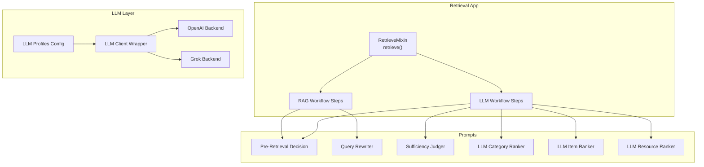
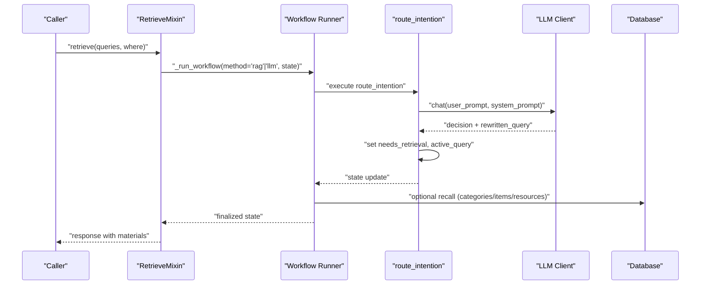
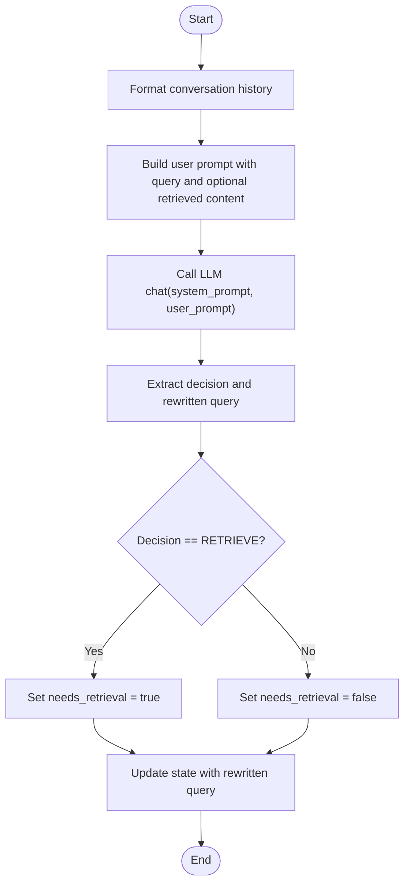
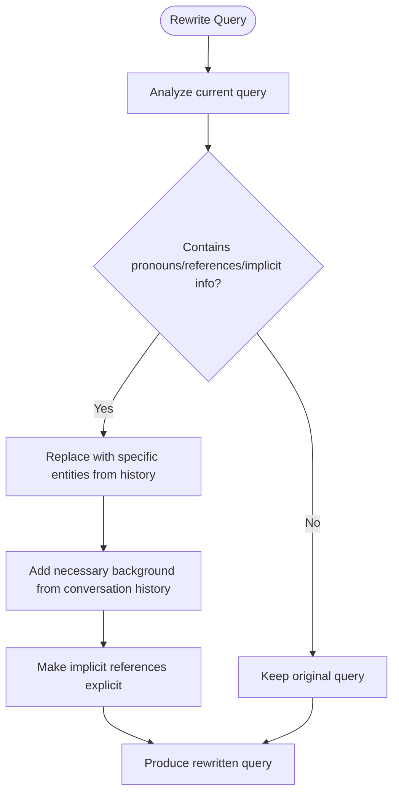
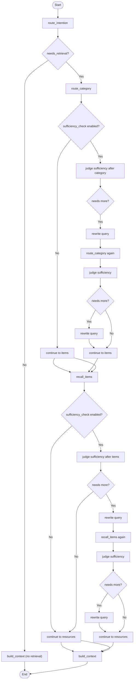
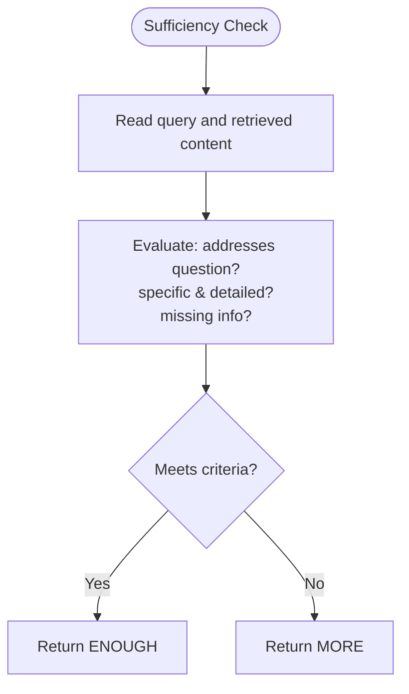
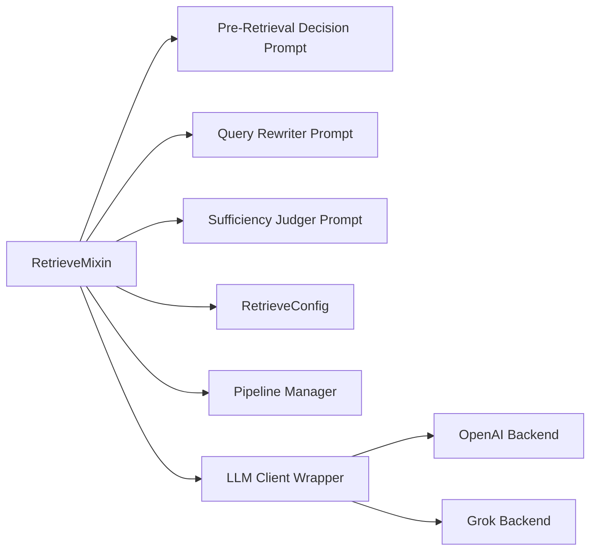

# Intention Routing

<cite>
**Referenced Files in This Document**
- [retrieve.py](file://src/memu/app/retrieve.py)
- [pre_retrieval_decision.py](file://src/memu/prompts/retrieve/pre_retrieval_decision.py)
- [query_rewriter.py](file://src/memu/prompts/retrieve/query_rewriter.py)
- [judger.py](file://src/memu/prompts/retrieve/judger.py)
- [query_rewriter_judger.py](file://src/memu/prompts/retrieve/query_rewriter_judger.py)
- [llm_category_ranker.py](file://src/memu/prompts/retrieve/llm_category_ranker.py)
- [llm_item_ranker.py](file://src/memu/prompts/retrieve/llm_item_ranker.py)
- [llm_resource_ranker.py](file://src/memu/prompts/retrieve/llm_resource_ranker.py)
- [settings.py](file://src/memu/app/settings.py)
- [pipeline.py](file://src/memu/workflow/pipeline.py)
- [wrapper.py](file://src/memu/llm/wrapper.py)
- [openai.py](file://src/memu/llm/backends/openai.py)
- [grok.py](file://src/memu/llm/backends/grok.py)
</cite>

## Table of Contents
1. [Introduction](#introduction)
2. [Project Structure](#project-structure)
3. [Core Components](#core-components)
4. [Architecture Overview](#architecture-overview)
5. [Detailed Component Analysis](#detailed-component-analysis)
6. [Dependency Analysis](#dependency-analysis)
7. [Performance Considerations](#performance-considerations)
8. [Troubleshooting Guide](#troubleshooting-guide)
9. [Conclusion](#conclusion)

## Introduction
This document explains the intention routing phase that decides whether retrieval is needed and rewrites queries for optimal retrieval performance. It covers:
- LLM-based sufficiency checking via dedicated prompts
- Pre-retrieval decision prompt system and query rewriting logic
- Conditional retrieval branching across categories, items, and resources
- Workflow state transitions and configuration options
- Integration with multiple LLM providers
- Practical examples of query analysis, decision extraction, and transformation patterns
- Performance considerations for batch processing and caching strategies

## Project Structure
The intention routing is implemented as part of the retrieval workflow. It composes:
- Prompts for pre-retrieval decisions, query rewriting, sufficiency judgment, and LLM-based ranking
- A configurable retrieval pipeline with RAG and LLM ranking strategies
- LLM provider backends and a wrapper for telemetry and usage extraction

**Diagram sources**
- [retrieve.py](file://src/memu/app/retrieve.py#L42-L85)
- [pre_retrieval_decision.py](file://src/memu/prompts/retrieve/pre_retrieval_decision.py#L1-L54)
- [query_rewriter.py](file://src/memu/prompts/retrieve/query_rewriter.py#L1-L45)
- [judger.py](file://src/memu/prompts/retrieve/judger.py#L1-L40)
- [llm_category_ranker.py](file://src/memu/prompts/retrieve/llm_category_ranker.py#L1-L36)
- [llm_item_ranker.py](file://src/memu/prompts/retrieve/llm_item_ranker.py#L1-L41)
- [llm_resource_ranker.py](file://src/memu/prompts/retrieve/llm_resource_ranker.py#L1-L41)
- [settings.py](file://src/memu/app/settings.py#L175-L202)
- [wrapper.py](file://src/memu/llm/wrapper.py#L226-L450)
- [openai.py](file://src/memu/llm/backends/openai.py#L8-L65)
- [grok.py](file://src/memu/llm/backends/grok.py#L6-L12)

**Section sources**
- [retrieve.py](file://src/memu/app/retrieve.py#L42-L85)
- [settings.py](file://src/memu/app/settings.py#L175-L202)

## Core Components
- RetrieveMixin: Orchestrates retrieval workflows, builds state, and runs either RAG or LLM-based pipelines.
- Pre-retrieval decision prompts: Define when to retrieve and how to rewrite queries.
- Query rewriting prompts: Resolve pronouns and implicit references to make queries self-contained.
- Sufficiency judge prompts: Assess whether retrieved content is sufficient to answer the query.
- LLM rankers: Provide LLM-driven ranking for categories, items, and resources.
- Configuration: RetrieveConfig controls routing, sufficiency checks, and LLM profiles.
- LLM pipeline manager: Validates and instantiates workflows with capability and profile checks.
- LLM wrapper: Provides telemetry, usage extraction, and interception hooks.

**Section sources**
- [retrieve.py](file://src/memu/app/retrieve.py#L27-L85)
- [pre_retrieval_decision.py](file://src/memu/prompts/retrieve/pre_retrieval_decision.py#L1-L54)
- [query_rewriter.py](file://src/memu/prompts/retrieve/query_rewriter.py#L1-L45)
- [judger.py](file://src/memu/prompts/retrieve/judger.py#L1-L40)
- [llm_category_ranker.py](file://src/memu/prompts/retrieve/llm_category_ranker.py#L1-L36)
- [llm_item_ranker.py](file://src/memu/prompts/retrieve/llm_item_ranker.py#L1-L41)
- [llm_resource_ranker.py](file://src/memu/prompts/retrieve/llm_resource_ranker.py#L1-L41)
- [settings.py](file://src/memu/app/settings.py#L175-L202)
- [pipeline.py](file://src/memu/workflow/pipeline.py#L21-L171)
- [wrapper.py](file://src/memu/llm/wrapper.py#L226-L450)

## Architecture Overview
The intention routing integrates with two retrieval strategies:
- RAG pipeline: Uses vector embeddings for category/item recall and optional sufficiency checks.
- LLM pipeline: Delegates ranking to LLMs with explicit prompts for categories, items, and resources.

**Diagram sources**
- [retrieve.py](file://src/memu/app/retrieve.py#L42-L85)
- [retrieve.py](file://src/memu/app/retrieve.py#L228-L258)
- [retrieve.py](file://src/memu/app/retrieve.py#L538-L568)
- [pre_retrieval_decision.py](file://src/memu/prompts/retrieve/pre_retrieval_decision.py#L1-L54)

## Detailed Component Analysis

### Pre-Retrieval Decision Prompt System
- Purpose: Determine whether retrieval is needed and rewrite the query to incorporate context.
- Inputs: Query context (conversation history), current query, and optionally retrieved content.
- Output: Decision tag indicating RETRIEVE or NO_RETRIEVE, and a rewritten query.
- Rules:
  - NO_RETRIEVE for greetings, casual chat, general knowledge, clarifications, and meta-questions about the system.
  - RETRIEVE for past events, preferences, habits, specific recall requests, and historical references.
  - If retrieval is not needed, return the original query unchanged.

**Diagram sources**
- [retrieve.py](file://src/memu/app/retrieve.py#L746-L784)
- [pre_retrieval_decision.py](file://src/memu/prompts/retrieve/pre_retrieval_decision.py#L1-L54)

**Section sources**
- [retrieve.py](file://src/memu/app/retrieve.py#L746-L784)
- [pre_retrieval_decision.py](file://src/memu/prompts/retrieve/pre_retrieval_decision.py#L1-L54)

### Query Rewriting Logic
- Purpose: Resolve pronouns, referential expressions, implicit context, and incomplete information using conversation history.
- Output: A self-contained rewritten query that preserves intent and avoids ambiguity.
- Integration: Used in the RAG workflow’s route_intention step when skip_rewrite is false.

**Diagram sources**
- [query_rewriter.py](file://src/memu/prompts/retrieve/query_rewriter.py#L1-L45)
- [retrieve.py](file://src/memu/app/retrieve.py#L247-L248)

**Section sources**
- [query_rewriter.py](file://src/memu/prompts/retrieve/query_rewriter.py#L1-L45)
- [retrieve.py](file://src/memu/app/retrieve.py#L247-L248)

### Conditional Retrieval Branching
- Route intention sets needs_retrieval and active_query.
- If needs_retrieval is true, the pipeline proceeds to category recall (RAG) or LLM ranking (LLM).
- After each tier, sufficiency checks decide whether to continue to the next tier or stop.
- The final context builder materializes hits into structured results.

**Diagram sources**
- [retrieve.py](file://src/memu/app/retrieve.py#L106-L210)
- [retrieve.py](file://src/memu/app/retrieve.py#L454-L536)
- [retrieve.py](file://src/memu/app/retrieve.py#L228-L258)
- [retrieve.py](file://src/memu/app/retrieve.py#L288-L322)
- [retrieve.py](file://src/memu/app/retrieve.py#L369-L398)
- [retrieve.py](file://src/memu/app/retrieve.py#L538-L568)
- [retrieve.py](file://src/memu/app/retrieve.py#L590-L613)
- [retrieve.py](file://src/memu/app/retrieve.py#L659-L682)

**Section sources**
- [retrieve.py](file://src/memu/app/retrieve.py#L106-L210)
- [retrieve.py](file://src/memu/app/retrieve.py#L454-L536)

### LLM-Based Sufficiency Checking
- Purpose: Judge whether the retrieved content is sufficient to answer the query.
- Inputs: Query and retrieved content.
- Output: ENOUGH or MORE, with a brief consideration rationale.
- Used after category and item tiers to decide continuation to the next tier or to build context.

**Diagram sources**
- [judger.py](file://src/memu/prompts/retrieve/judger.py#L1-L40)
- [retrieve.py](file://src/memu/app/retrieve.py#L288-L322)
- [retrieve.py](file://src/memu/app/retrieve.py#L369-L398)
- [retrieve.py](file://src/memu/app/retrieve.py#L590-L613)
- [retrieve.py](file://src/memu/app/retrieve.py#L659-L682)

**Section sources**
- [judger.py](file://src/memu/prompts/retrieve/judger.py#L1-L40)
- [retrieve.py](file://src/memu/app/retrieve.py#L288-L322)
- [retrieve.py](file://src/memu/app/retrieve.py#L369-L398)
- [retrieve.py](file://src/memu/app/retrieve.py#L590-L613)
- [retrieve.py](file://src/memu/app/retrieve.py#L659-L682)

### Query Rewriting and Sufficiency Combined
- A combined prompt performs both query rewriting and sufficiency judgment in one step.
- Useful when a single LLM call can handle both tasks efficiently.

**Section sources**
- [query_rewriter_judger.py](file://src/memu/prompts/retrieve/query_rewriter_judger.py#L1-L49)

### LLM Ranking Prompts
- Category, item, and resource prompts guide LLM ranking:
  - Category: Identify up to top_k relevant categories.
  - Item: Rank items within relevant categories.
  - Resource: Rank resources using context info.

**Section sources**
- [llm_category_ranker.py](file://src/memu/prompts/retrieve/llm_category_ranker.py#L1-L36)
- [llm_item_ranker.py](file://src/memu/prompts/retrieve/llm_item_ranker.py#L1-L41)
- [llm_resource_ranker.py](file://src/memu/prompts/retrieve/llm_resource_ranker.py#L1-L41)

### Configuration Options for Intention Routing
- RetrieveConfig controls:
  - method: "rag" or "llm"
  - route_intention: Enable/disable pre-retrieval routing
  - category/item/resource: Enable/disable each tier and top_k
  - sufficiency_check: Enable/disable sufficiency checks after each tier
  - sufficiency_check_prompt: Override user prompt for sufficiency checks
  - sufficiency_check_llm_profile: Profile for sufficiency checks
  - llm_ranking_llm_profile: Profile for LLM ranking steps
- LLMProfilesConfig defines named LLM configurations with provider, base_url, api_key, chat/embed models, and client backend.

**Section sources**
- [settings.py](file://src/memu/app/settings.py#L175-L202)
- [settings.py](file://src/memu/app/settings.py#L263-L297)

### Integration with LLM Providers
- Provider backends:
  - OpenAI-compatible backend supports chat, summary, and vision payloads.
  - Grok backend inherits OpenAI backend behavior.
- LLMClientWrapper:
  - Provides unified chat/embed/summarize/vision/transcribe methods.
  - Intercepts calls for telemetry, usage extraction, and error handling.
  - Supports LLM interceptor registry for cross-cutting concerns.

**Section sources**
- [openai.py](file://src/memu/llm/backends/openai.py#L8-L65)
- [grok.py](file://src/memu/llm/backends/grok.py#L6-L12)
- [wrapper.py](file://src/memu/llm/wrapper.py#L226-L450)
- [wrapper.py](file://src/memu/llm/wrapper.py#L653-L703)

## Dependency Analysis
- RetrieveMixin depends on:
  - Prompts for decision, rewriting, and sufficiency
  - LLM profiles via LLMClientWrapper
  - Database for vector search and materialization
  - Pipeline manager for validating step capabilities and profiles
- Workflow steps declare required and produced state keys, ensuring deterministic execution order.

**Diagram sources**
- [retrieve.py](file://src/memu/app/retrieve.py#L27-L85)
- [settings.py](file://src/memu/app/settings.py#L175-L202)
- [pipeline.py](file://src/memu/workflow/pipeline.py#L21-L171)
- [wrapper.py](file://src/memu/llm/wrapper.py#L226-L450)
- [openai.py](file://src/memu/llm/backends/openai.py#L8-L65)
- [grok.py](file://src/memu/llm/backends/grok.py#L6-L12)

**Section sources**
- [retrieve.py](file://src/memu/app/retrieve.py#L27-L85)
- [pipeline.py](file://src/memu/workflow/pipeline.py#L21-L171)

## Performance Considerations
- Batch processing:
  - Embedding batch sizes are configurable; adjust embed_batch_size to balance throughput and latency.
  - Vector search uses cosine_topk; tune top_k per tier to control retrieval breadth.
- Caching strategies:
  - Repeated queries can benefit from caching rewritten queries keyed by conversation history hash and query text.
  - LLM responses can be cached keyed by prompt hash; ensure deterministic prompt formatting and avoid volatile inputs.
  - Database vectors can be cached per query vector to avoid recomputation across tiers.
- Telemetry and usage:
  - LLMClientWrapper extracts token usage and latency; leverage this for cost control and optimization.
  - Use LLM interceptor registry to add rate limiting or retry policies.

[No sources needed since this section provides general guidance]

## Troubleshooting Guide
- Unknown LLM profile:
  - Pipeline validation raises errors if a step references a non-existent profile. Verify LLMProfilesConfig keys.
- Missing state keys:
  - Pipeline validation ensures previous steps produce required keys. Confirm earlier steps are executed and state is updated.
- Insufficient retrieval:
  - If sufficiency checks consistently report MORE, consider enabling LLM ranking tiers or increasing top_k.
- Provider misconfiguration:
  - For Grok, provider defaults override OpenAI defaults; ensure base_url, api_key, and model are set appropriately.

**Section sources**
- [pipeline.py](file://src/memu/workflow/pipeline.py#L131-L164)
- [settings.py](file://src/memu/app/settings.py#L128-L139)

## Conclusion
The intention routing phase uses LLM-based sufficiency checks and query rewriting to minimize unnecessary retrieval while maximizing answer quality. By composing modular prompts, configurable workflows, and robust LLM provider integration, the system supports both RAG and LLM ranking strategies. Proper configuration of profiles, tiers, and top_k values, combined with caching and telemetry, enables scalable and cost-efficient retrieval.